<div align="center">

# repo-harness

### Un flujo de trabajo basado en archivos para Claude y Codex, y un runtime autorizado para los programas construidos sobre él


[](https://www.npmjs.com/package/repo-harness)
[](https://opensource.org/licenses/MIT)
[](https://bun.sh)

[English](README.md) | [简体中文](README.zh-CN.md) | [日本語](README.ja.md) | [Français](README.fr.md) | [Español](README.es.md)

**Dale al agente un PRD o Sprint completo; después, tu bucle es solo revisar y `next`, o inicia `/goal` y ponte AFK.**

</div>

`repo-harness` distribuye un CLI junto con hooks de skill/runtime que escriben
contexto, planes, handoffs, checks y evidencia de review de vuelta en el
proyecto, de modo que la siguiente sesión de agente continúa desde archivos en
lugar del historial de chat. Adopta un repositorio existente con un contract
de agente tasks-first que mantiene alineados a Claude y Codex.

Sobre ese contract ejecuta **programas autorizados**: trabajo de larga duración
que sostiene su propia autorización, presupuesto, task offers y leases, de modo
que un Sprint puede avanzar a través de sesiones sin que un humano conduzca
cada paso.

## Índice

- [Primeros pasos](#primeros-pasos)
- [Por qué usar repo-harness](#por-qué-usar-repo-harness)
- [Dos capas](#dos-capas)
- [Características clave](#características-clave)
- [Cómo funciona](#cómo-funciona)
- [Flujo de trabajo de tareas](#flujo-de-trabajo-de-tareas)
- [Programas autorizados](#programas-autorizados)
- [Hooks](#hooks)
- [Panel de control humano local](#panel-de-control-humano-local)
- [Conector MCP](#conector-mcp)
- [Revisión del trabajo](#revisión-del-trabajo)
- [Skills](#skills)
- [Referencia para mantenedores](#referencia-para-mantenedores)
- [Agradecimientos](#agradecimientos)
- [Versión actual](#versión-actual)
- [Licencia](#licencia)

## Primeros pasos

### 1. Instalar el CLI

Prerrequisitos: un Git working tree, `bun` y un `herdr` >=0.9.0 utilizable para
la readiness del host; macOS/Linux también requieren `bash`, mientras que
Windows requiere Git for Windows (incluidos su Bash y sus herramientas de
`usr/bin`). `jq` es opcional. No se necesita Node.js — el instalador usa Bun >=
1.4.0 como runtime, instalando o actualizando Bun primero si hace falta.

```bash
# macOS / Linux
curl -fsSL https://raw.githubusercontent.com/Ancienttwo/repo-harness/main/install.sh | sh

# Windows (PowerShell)
irm https://raw.githubusercontent.com/Ancienttwo/repo-harness/main/install.ps1 | iex
```

Si ya tienes Bun >= 1.4.0 en el PATH, omite el instalador de shell. Las
instalaciones de Bun gestionadas por un gestor de paquetes fallan de forma
cerrada (fail closed) con el comando de actualización correspondiente
(`brew upgrade bun`), en lugar de sobrescribir archivos que pertenecen a ese
gestor.

```bash
bunx repo-harness@latest install     # Bun one-shot bootstrap
bun add -g repo-harness              # or install the persistent CLI first
repo-harness install
npx -y repo-harness@latest install   # npx fallback; the CLI still runs on Bun
```

Instala herdr desde [herdr.dev](https://herdr.dev/) y verifica
`herdr --version`. El hosting persistente de review requiere process groups
POSIX; en Windows usa WSL. Un herdr ausente o inutilizable bloquea la readiness
del host. Antes de actualizar desde tmux, drena los reviewers existentes con la
versión anterior y vuelve a enlazar explícitamente los endpoints de terminal.
Ver [runtime cutover](docs/researches/20260909-herdr-runtime-cutover.md).

### 2. Bootstrap del runtime del host

```bash
repo-harness install
```

En Windows, mantén Git for Windows en el `PATH` de instalación/actualización.
Esa ceremonia explícita valida y fija `git.exe`, su `bash.exe`/`usr/bin`
correspondiente, y el directorio `TEMP` absoluto de la cuenta de instalación
más las herramientas nativas de `System32` en el
`~/.repo-harness/config.json#protectedHelperRuntime` de la cuenta del sistema
operativo. Los helpers de workflow protegidos no redescubren herramientas desde
el `PATH` de quien los invoca; vuelve a ejecutar `repo-harness update` después
de mover o reemplazar Git for Windows.

El bootstrap global: instala el paquete npm como CLI global, refresca los
alias de skill de repo-harness, instala los hook adapters a nivel de usuario,
y registra un profile de instalación explícito. Es idempotente y no aplica
archivos de workflow repo-local al directorio actual. `--dry-run --json` lista
primero los componentes a instalar, omitir y eliminar. Profiles, autoridad de
delegación nativa de Codex, comandos de refresco, y la auditoría de solo
lectura `setup check`:
[`install-profiles.md`](docs/reference-configs/install-profiles.md).

### 3. Vista previa del contract repo-local

```bash
repo-harness init --dry-run
```

Ejecuta esto desde la raíz del repositorio objetivo. Reporta las
especificaciones, el estado de tareas, el helper runtime, el hook adapter de
destino y los archivos de verificación que se crearían o refrescarían. Nunca
crea un application stack; los proyectos y módulos nuevos usan en su lugar el
scaffold mode de `repo-harness-setup`.

### 4. Aplicar y verificar

```bash
repo-harness init
bash scripts/check-task-workflow.sh --strict
bun test
```

### Así se ve el éxito

Aplicar termina con `=== Migration Report ===`, indicando de dónde viene el
comportamiento de hooks generado, el destino del adapter a nivel de usuario
(`~/.claude/settings.json` y `~/.codex/hooks.json`), las superficies
repo-local creadas o refrescadas, el helper runtime `.ai/harness/scripts/*`, y
un bloque de readiness `--- External Tooling ---`. La intención estable vive
entonces en `docs/spec.md`, el estado de ejecución en `plans/` y `tasks/`, y
el estado de resume en `.ai/harness/handoff/`. Si el dry run se ve mal,
detente y lee primero
[`hook-operations.md`](docs/reference-configs/hook-operations.md).

### Actualizar y desinstalar

```bash
repo-harness update          # reconcile CLI, mandatory deps, profile tooling, and CodeGraph
repo-harness update --check  # read-only repair guidance, no writes
repo-harness uninstall --dry-run # preview owned user configuration cleanup
repo-harness uninstall           # remove owned configuration; preserve user changes/history
repo-harness mcp uninstall --dry-run # preview independent MCP setup cleanup
repo-harness mcp uninstall --services-stopped # after stopping all MCP HTTP services
```

## Por qué usar repo-harness

- **Sesiones respaldadas por archivos, no por historial de chat.** Las
  sesiones separadas de Claude y Codex se mantienen coordinadas a través del
  repositorio. `SessionStart` inyecta el resume packet de la sesión anterior,
  `Stop` escribe el handoff, y cada edición registra un pequeño evento de
  bitácora. Una sesión puede terminar a mitad de tarea, y la siguiente retoma
  exactamente el próximo paso, los blockers y los archivos modificados, sin
  tener que volver a inferirlos.
- **Ahorro de tokens por diseño.** En lugar de bucles de grep-and-read que
  reescanean el repositorio en cada sesión, el harness se apoya en un índice
  de CodeGraph pre-construido para consultas estructurales y en carga de
  contexto progresiva: un root context estable de ~12KB más bloques de
  capability que solo se cargan cuando los archivos que tocas los necesitan.
  Un agente lee un capability contract de ~1KB en vez de redescubrir la
  estructura.
- **Evidencia lista para review.** Cada tarea deja atrás un contract,
  evidencia de check estructurada y una review card. La superficie de
  decisión humana cabe en una sola pantalla — verdict, archivos previstos vs
  reales, comandos que pasaron, riesgo residual, rollback — en lugar de una
  reconstrucción de lo que el agente afirma haber hecho.
- **El trabajo desatendido sigue siendo responsable.** Un programa no puede
  arrancar sin una autorización almacenada, no puede exceder su budget ledger,
  no puede retener una tarea más allá de su lease, y no puede reclamar
  aceptación sin un receipt. La autonomía está acotada por artefactos, no por
  confianza.

En un repositorio adoptado, la superficie se mantiene intencionalmente
pequeña:

| Superficie | Propósito |
| --- | --- |
| `docs/spec.md` y `docs/reference-configs/` | Estándares compartidos e intención de producto estable que toda sesión de agente puede leer. |
| `plans/`, `plans/prds/`, y `plans/sprints/` | Work packages decision-complete antes de empezar la implementación. |
| `tasks/contracts/`, `tasks/reviews/`, y `.ai/harness/checks/` | Alcance, verificación y evidencia de review para demostrar que el trabajo está terminado. |
| `.ai/harness/handoff/` y `tasks/current.md` | Bitácora de la sesión y estado resumible, derivados de artefactos de workflow en lugar de historial de chat. |

## Dos capas

El producto se lee como dos capas que comparten un mismo conjunto de archivos.

**Capa 1 — el contract de sesión.** Un humano, una sesión de agente, una tarea
a la vez. Plans, contracts, checks, reviews y handoffs son la autoridad
durable; los hooks mantienen la sesión dentro de ellos. Esto es el producto
completo para un repositorio en solitario, y todo lo que está en
[Flujo de trabajo de tareas](#flujo-de-trabajo-de-tareas) pertenece aquí. Nada
de lo que sigue es necesario para usarlo.

**Capa 2 — programas autorizados.** Trabajo de larga duración que sobrevive a
una sesión: un controller desatendido que avanza un Sprint, una campaña de
reparación que redacta y adopta GitHub Issues, un programa de refactor guiado
por el modelo de arquitectura, un plano de colaboración donde varios Module
Engineers intercambian señales y handoffs. Cada programa está condicionado a
una autorización emitida por un operador, consume de un budget ledger por goal,
y retiene el trabajo mediante leases renovables. Ver
[Programas autorizados](#programas-autorizados).

| | Capa 1 | Capa 2 |
| --- | --- | --- |
| Unidad de trabajo | Un task contract | Un programa autorizado |
| Quién lo conduce | Un humano en una sesión | Un controller, bajo topes |
| Autoridad | Plan, contract, review, checks | Lo anterior, más authorization, budget, lease, receipts |
| Punto de entrada | `repo-harness init` | `repo-harness automation grant mint` |
| Condición de parada | Closeout de la tarea | Budget agotado, lease perdido, o un receipt terminal |

La capa 2 no reemplaza a la capa 1: cada paso de un programa sigue
proyectándose en los mismos artefactos de plan, contract y review que habría
escrito un humano.

## Características clave

| | |
| --- | --- |
| **Sesiones respaldadas por archivos** | Plans, contracts, checks y handoffs viven en el repositorio, de modo que una sesión nueva retoma desde artefactos en vez de un hilo de chat |
| **Typed hook runtime** | Ocho managed routes compartidas, más tres delegation routes exclusivas de Codex, cada una atada a exactamente un typed handler in-process, con guards fail-closed en el límite de edición |
| **Plan → Contract → Review** | Un solo ciclo de vida desde el plan aprobado hasta el contract proyectado, el worktree aislado, la evidencia estructurada y un closeout revisable |
| **Programas autorizados** | Programas de campaign, refactor, automation y collaboration que sostienen su propia authorization, budget ledger, task offers y leases renovables |
| **Controller desatendido acotado** | Un bucle de dispatch de Engineer bajo topes duros de pasos, duración y reintentos, que reserva budget antes de cada intento |
| **Carga de contexto progresiva** | Un root context estable de ~12KB más capability contracts de ~1KB que solo se cargan para los archivos que realmente se están tocando |
| **Integración con CodeGraph** | Consultas estructurales (callers, callees, definitions) respondidas desde un índice pre-construido en vez de pasadas repetidas de grep-and-read |
| **MCP planner sidecar** | ChatGPT lee el estado real del repositorio y escribe artefactos de PRD/Sprint/Goal; Codex los ejecuta, sin acceso de escritura al código fuente por defecto |
| **Alineación Claude + Codex** | Un solo adapter contract a nivel de usuario, un solo workflow contract, y un solo conjunto de artefactos repo-local compartidos por ambos hosts |

## Cómo funciona

1. **Paquete fuente**: este repositorio posee el CLI, los command facades,
   los templates, los typed hook handlers, el operator-helper asset, el
   workflow contract, los tests y el release gate.
2. **Contract del repositorio objetivo**: `repo-harness init` o la migración
   escribe archivos repo-local como `docs/spec.md`, `plans/`, `tasks/`,
   `.ai/context/`, `.ai/harness/`, helper scripts y `.ai/hooks/`.
3. **Adapters del host**: a nivel de usuario, `~/.claude/settings.json` y
   `~/.codex/hooks.json` enrutan los events de Claude/Codex hacia
   `repo-harness-hook`.

El hook entrypoint termina en silencio para repos que no han hecho opt-in.
Para repos con opt-in, el route registry ata el event tuple público a
exactamente un typed handler empaquetado. `.ai/hooks/` solo contiene la
proyección de operator-helper; nunca es un host-event dispatcher.

El invariante central es que la verdad durable vive en el repositorio, no en
un hilo de chat. Los hooks son aceleradores y guardrails; la autoridad sigue
siendo los artefactos file-backed de plan, contract, review, checks y
handoff. Los gates de plan/spec/contract en la capa de prompt son advisory
routing; el enforcement estricto vive en el límite de edición. Los internals
del handler, la superficie de minimal-change y los policy modes:
[`hook-operations.md`](docs/reference-configs/hook-operations.md) y
[`minimal-change-hooks.md`](docs/reference-configs/minimal-change-hooks.md).

## Flujo de trabajo de tareas

El diagrama asume que el harness ya está instalado. Muestra el ciclo de vida
normal desde un sprint backlog de programa hasta una sola contract task:
seleccionar la tarea, proyectarla en archivos de ejecución, hacer checkout
del contract worktree cuando la política lo exige, implementar bajo los
hooks, verificar, hacer review y cerrar (closeout).

```mermaid
flowchart TD
  Program["Program goal or release theme"] --> Sprint{"Sprint layer needed?"}
  Sprint -->|yes| PRD["Upper-layer PRD<br/>plans/prds/*.prd.md"]
  PRD --> SprintDoc["Sprint backlog<br/>plans/sprints/*.sprint.md"]
  SprintDoc --> NextTask["Select next sprint task<br/>sprint-backlog.sh next"]
  Sprint -->|no| UserTask["User task or planning prompt"]
  Heartbeat["Heartbeat triage<br/>scripts/heartbeat-triage.sh<br/>.ai/harness/triage/"] --> UserTask
  NextTask --> UserTask

  UserTask --> Discovery["Due diligence<br/>P1 map, P2 trace, P3 decision"]
  Discovery --> LoopEvidence["Loop evidence when routing changes<br/>state-snapshot --json<br/>route-nl-vs-ts / cutover gate"]
  LoopEvidence --> PlanDraft["Draft plan<br/>plans/plan-*.md"]
  PlanDraft --> PlanReview{"Plan ready for execution?"}
  PlanReview -->|no| Refine["Refine plan, scope, evidence contract"]
  Refine --> PlanDraft
  PlanReview -->|yes| Approve["Approved plan<br/>Status: Approved"]

  Approve --> Project["Project plan into execution<br/>capture-plan.sh --execute<br/>or plan-to-todo.sh --plan"]
  Project --> Active["Active markers<br/>.ai/harness/active-plan<br/>.ai/harness/active-worktree"]
  Project --> SprintActive["Sprint projection<br/>active-sprint marker<br/>tasks/current.md"]
  Project --> Contract["Sprint contract<br/>tasks/contracts/YYYYMMDD-HHMM-task-slug.contract.md"]
  Project --> ReviewFile["Review file<br/>tasks/reviews/YYYYMMDD-HHMM-task-slug.review.md"]
  Project --> Notes["Task notes<br/>tasks/notes/YYYYMMDD-HHMM-task-slug.notes.md"]

  Contract --> Delegation["Delegation contract<br/>budget / permission_scope / roles"]
  Delegation --> Delegate{"Use contract-run delegation?"}
  Delegate -->|yes| ContractRun["Worker/verifier child run<br/>scripts/contract-run.ts"]
  Delegate -->|no| WorktreePolicy{"Contract worktree required?"}
  WorktreePolicy -->|yes| Checkout["Checkout isolated worktree<br/>contract-worktree.sh start --plan<br/>branch codex/task-slug"]
  WorktreePolicy -->|no| CurrentTree["Use current worktree<br/>small or explicitly allowed slice"]
  Checkout --> Implement
  CurrentTree --> Implement
  ContractRun --> Changes

  Implement["Edit and run commands"] --> PreHooks["Pre-edit guards<br/>PlanStatusGuard, ContractScopeGuard, WorktreeGuard"]
  PreHooks -->|blocked| ScopeFix["Fix plan, contract, worktree, or scope"]
  ScopeFix --> Implement
  PreHooks -->|allowed| Changes["Code, docs, tests, or config changes"]
  Changes --> PostHooks["Post-edit and post-bash hooks<br/>trace, drift request, handoff, check evidence"]
  PostHooks --> ArchQueue["Architecture queue<br/>architecture-queue.sh record/reindex<br/>check-architecture-sync.sh"]
  ArchQueue --> Verify["Run verification<br/>tests plus repo workflow checks"]

  Verify --> Checks["Structured evidence<br/>.ai/harness/checks/latest.json<br/>.ai/harness/runs/*.json"]
  Checks --> CheckReview["Evaluator review<br/>Waza /check -> review file"]
  CheckReview --> External["External acceptance advice<br/>or explicit manual override"]
  External --> DoneGate{"Contract, checks, review, and acceptance pass?"}
  DoneGate -->|no| Repair["Repair failing evidence or implementation"]
  Repair --> Implement
  DoneGate -->|yes| SprintComplete{"Sprint task active?"}
  SprintComplete -->|yes| MarkSprint["Mark backlog item complete<br/>sprint-backlog.sh complete-task"]
  SprintComplete -->|no| Closeout["Closeout<br/>scripts/contract-worktree.sh finish"]
  MarkSprint --> Closeout

  Closeout --> Commit["Commit contract branch"]
  Commit --> Merge["Fast-forward target branch"]
  Merge --> Archive["Archive plan/todo and refresh handoff"]
  Archive --> Cleanup["Cleanup merged worktree<br/>contract-worktree.sh cleanup"]
  Cleanup --> Done["Reviewable completed task"]
```



Para los loops de producto de larga duración, mantén el discovery y el
juicio de engineering-plan con el agente padre antes de que Codex haga loops
de ejecución: `geju` abre el pre-contract frame, el agente padre completa
P1/P2/P3 y congela la dirección aceptada en un PRD de upper-layer bajo
`plans/prds/` y un sprint backlog ordenado bajo `plans/sprints/`, luego un
Codex Goal apunta a ese archivo de sprint. El PRD sigue siendo la fuente de
verdad superior y el backlog es la cola de ejecución durable, de modo que una
sesión de Goal reanudada nunca reinterpreta el chat original. Ver
[`agentic-development-flow.md`](docs/reference-configs/agentic-development-flow.md)
y [`workflow-orchestration.md`](docs/reference-configs/workflow-orchestration.md).

## Programas autorizados

Un programa es trabajo que sobrevive a una sesión. Todos ellos parten de las
mismas tres primitivas, y ninguno puede arrancar sin la primera.

```bash
repo-harness automation grant mint   # store one operator ProgramAuthorizationV1
repo-harness automation grant list   # digests held for this repository
repo-harness automation budget show          # the enforceable per-goal ledger
repo-harness automation budget repair        # seal a stopped or expired run's exhaustion receipt
```

- **Authorization.** Un `ProgramAuthorizationV1` emitido por un operador vive
  en el gate store del home del harness. No existe una ruta de arranque sin
  autenticar, y un programa nunca deriva su propio actor — el autor de cada
  registro se resuelve desde `--authorization-id`.
- **Budget.** Las llamadas al provider, los pasos de campaign, las
  observaciones de adopción, la ejecución de heartbeat y la adquisición de
  worker reservan todas contra un ledger por goal antes de que el trabajo
  quede registrado. `budget repair` solo vuelve a ejecutar una reconciliación
  bloqueada; nunca reserva, cobra ni cambia un tope.
- **Lease.** El trabajo retenido lleva un lease renovable con un intervalo de
  renovación, un TTL máximo y un conjunto cerrado de fuentes de evidencia. Un
  estado de liveness no probado exige atención en lugar de reclamarse en
  silencio.

### Controller desatendido

```bash
repo-harness automation controller start --maximum-steps 20 --maximum-duration-ms 300000
repo-harness automation controller step
repo-harness automation controller status
repo-harness automation controller stop
```

Un bucle de dispatch de Engineer bajo topes duros, con backoff determinista y
un ledger acotado de reintentos por intento. Cada intento reserva budget antes
de quedar registrado, y un resultado proyectado fuera del enum cerrado no puede
contarse como satisfecho.

### Scheduling de Engineer

```bash
repo-harness engineer principal enroll        # map an OAuth authorization to a Binding
repo-harness engineer acquire-next --authorization-id <id> --idempotency-key <key>
repo-harness engineer work-demand propose|transition|materialize|status
repo-harness engineer message send|receive|ack
repo-harness engineer board                   # read-only organization attention
```

`acquire-next` selecciona y reclama la primera offer canónica para un principal
inscrito. Las aristas de dependencia se resuelven desde autoridades de receipt,
no por inferencia, y los IDs de tarea de Sprint son identidades inmutables bajo
el backlog schema v2 — ejecuta `repo-harness sprint migrate-schema` una vez
sobre un backlog más antiguo.

### Campaña de desarrollo

```bash
repo-harness campaign audit          # budgeted read-only group audit
repo-harness campaign author         # persist an IssueBatchIntentV1, open the GPT Pro authoring lane
repo-harness campaign adopt          # exact-SHA readback, seal authoring, publish a repair batch
repo-harness campaign step           # hand one adopted task to its local planning session
repo-harness campaign prepare-resume # zero-provider resume request from stored evidence
```

Un programa de reparación sembrado: audita un grupo, redacta sus Issues a
través del lane de GPT Pro, adóptalos contra un readback de SHA exacto, y luego
haz avanzar cada tarea adoptada al ciclo de vida ordinario de plan → contract →
review. `prepare-resume` reconstruye una resume request a partir de la
evidencia almacenada de adopción, continuación y budget sin contactar a un
provider.

### Refactor Mode

```bash
repo-harness refactor discover        # bounded shadow scan of one local proposal
repo-harness refactor materialize     # one recommendation into N Work Packages
repo-harness refactor verify-candidate
repo-harness refactor board
```

Un programa respaldado por ArchContext que convierte una recomendación de
arquitectura en work packages contra una única autoridad canónica de tarea de
Sprint. Su activación está condicionada: el canary set y la evidencia de
rung-promotion deben refrescarse contra el provider instalado antes de que se
active.

### Plano de colaboración

```bash
repo-harness collaboration exchange              # one Work Exchange snapshot
repo-harness collaboration threads               # lanes, hotspot scores, opportunities
repo-harness collaboration post                  # append one CoordinationSignalV1
repo-harness collaboration handoff publish|list|adopt
repo-harness collaboration packet build|read
```

Varios Module Engineers leen un mismo Work Exchange y publican registros de
coordinación acotados. La adopción de handoff es deliberadamente no exclusiva:
no otorga ninguna Task, Claim ni Lease.

El sustrato mantiene un solo Module Engineer y un solo writer mientras Workers
acotados de solo lectura intercambian señales no confiables y handoffs
explícitos. Ejecuta el live gate del source checkout con
`bun scripts/c9-collaboration-canary.ts --live`; crea repositorios desechables
aislados para tres trazas emparejadas de baseline/treatment y registra el uso de
tokens de Codex autoritativo del provider, el tamaño de contexto, la reutilización
de señales, la adopción de handoff, el conteo de writers y los digests del plano
de entrega. El resultado C9 aceptado es deliberadamente una decisión negativa
sobre multi-seat: el treatment de tres lectores preservó la autoridad y reutilizó
estado, pero no produjo más que el baseline de un solo lector. El
`EngineerSeatV2` persistente de misma capability, un marketplace de Review
independiente y el Merge desatendido siguen inactivos. Ver
[`20260830-c9-real-multi-agent-canary.md`](docs/researches/20260830-c9-real-multi-agent-canary.md).

### Intake de fuentes externas

```bash
repo-harness external-source refresh   # one bounded, explicitly enabled GitHub observation
repo-harness external-source bind      # one immutable revision to one pending canonical task
repo-harness external-source bindings  # binding edges and current drift attention
```

El intake es inerte por diseño. Un Issue observado no acuña ninguna autoridad de
ejecución y no se convierte por sí solo en una tarea ejecutable; el binding
adjunta una revisión de fuente inmutable a una tarea que ya tiene plan aprobado
y contract.

### Review de aceptación persistente

```bash
repo-harness claude-review round --timeout-ms 1800000
repo-harness claude-review status
repo-harness claude-review close
```

Un reviewer de Claude de solo lectura, alojado en una sesión de herdr propia que
sobrevive hasta tres rondas de reparación contra evidencia de `verify-sprint`
preparada. Una sesión repetida más allá del budget de rondas se rechaza con
`claude_review_session_budget_exhausted`.

## Hooks

El adapter instalado posee ocho managed hook routes compartidas. El route
tuple `event + routeId + matcher` es el contract estable; cada tuple ata
exactamente un typed handler in-process.

| Route | Matcher | Handler | Función |
| --- | --- | --- | --- |
| `SessionStart.default` | all sessions | `src/cli/hook/session-context.ts` (in-process builder) | Inyecta el handoff anterior, el estado del sprint, guía de minimal-change y hallazgos de config-security de solo lectura antes de que empiece el trabajo. |
| `PreToolUse.edit` | `Edit\|Write` | `src/cli/hook/mutation-guard.ts` (in-process handler) | Aplica la worktree policy y la readiness de plan/contract antes de las ediciones de implementación. |
| `PreToolUse.subagent` | `Task\|Agent\|SendUserMessage` | `src/cli/hook/subagent-handler.ts` | Mantiene el trabajo delegado retornando a través de la sesión padre, en lugar de dejar escapar afirmaciones de finalización. |
| `PostToolUse.edit` | `Edit\|Write` | `src/cli/hook/mutation-observed.ts` (in-process handler) | Escribe como máximo un pequeño evento de bitácora con dirty bits por cada edición calificada; la verificación del contract, el sync de architecture/context/capability y la evidencia de minimal-change se difieren a Stop en vez de ejecutarse por cada edición. |
| `PostToolUse.bash` | `Bash` | `src/cli/hook/command-observed.ts` | Observa los resultados de comandos y captura evidencia de verificación sin reemplazar el command runner. |
| `PostToolUse.always` | all tools | `src/cli/hook/trace-observer.ts` | Provee trace y runtime observation de bajo ruido y siempre activo. |
| `UserPromptSubmit.default` | all prompts | `src/cli/hook/prompt-handler.ts` | Clasifica la intención del prompt, enruta hints de planning/check y renderiza guía de workflow host-safe. |
| `Stop.default` | session stop | `src/cli/hook/stop-handler.ts` (in-process handler) | Finaliza el handoff y protege contra terminar con draft-plans sin resolver o vacíos de evidencia de completion. |

Codex también instala tres Codex-only bounded-delegation routes —
`UserPromptSubmit.delegation`, `SubagentStart.context`, y
`SubagentStop.quality`, todas atadas a `src/cli/hook/subagent-handler.ts`;
Claude solo conserva la route compartida de return-channel,
`PreToolUse.subagent`.

`repo-harness-hook` y su typed handler registry son el host-event runtime;
`~/.claude/settings.json` y `~/.codex/hooks.json` son los adapters a nivel de
usuario, y Codex debe marcar su archivo como trusted en Settings antes de que
esos hooks corran. `.claude/settings.json` y `.codex/hooks.json` repo-locales
son config legacy a retirar. Depura en este orden: adapter config ->
`repo-harness-hook` -> route registry -> typed handler.

Cuando un hook bloquea el trabajo, lee primero el structured terminal
output: `guard`, `reason`, `fix`, `failure_class`, y `run_id`. Los registros
durables viven en `.ai/harness/failures/latest.jsonl`, con la actividad de
tools circundante en `.claude/.trace.jsonl`. Los guards comunes son
`PlanStatusGuard` (no hay plan activo o ejecutable), `ContractGuard` (falta
el contract scaffold, o se afirma completion antes de que el contract
pasara), y `WorktreeGuard` (escrituras desde el worktree equivocado).
Playbook completo:
[`docs/reference-configs/hook-operations.md`](docs/reference-configs/hook-operations.md).

## Panel de control humano local

Ejecuta la vista de operador de solo observación en la misma máquina que los
repositorios adoptados:

```bash
repo-harness operator serve
```

El comando se enlaza únicamente a loopback e imprime la URL local. El navegador
muestra el resumen canónico de Fleet, una worklist ordenada por atención, un
panel residente de detalle de tarea y estados de snapshot degradados. El
refresco es explícito; el panel lleva exactamente una acción de escritura —
enviar un mensaje dirigido a una tarea — y no adquiere tareas, ni muta el
estado del workflow, ni lanza agentes, ni expone rutas del repositorio.

## Conector MCP

Como sidecar opcional, `repo-harness mcp` expone artefactos de workflow a
clientes MCP a través del profile `planner` por defecto. ChatGPT lee el
estado real del repositorio y mueve una idea a través de artefactos de PRD,
checklist Sprint y Codex goal handoff — sin acceso de escritura al código
fuente por defecto, sin ejecución arbitraria de shell, ni runner por
defecto. Codex sigue siendo el ejecutor.

```bash
repo-harness mcp setup chatgpt --repo .
repo-harness mcp serve --repo . --transport http --host 127.0.0.1 --port 8765 --profile planner
```

Expón ese servidor local a través de un túnel HTTPS, registra la URL `/mcp`,
y el human workflow es:

1. ChatGPT lee los archivos de workflow de repo-harness a través de MCP.
2. ChatGPT escribe un PRD con `write_prd_from_idea`.
3. ChatGPT escribe un checklist Sprint con `write_checklist_sprint`.
4. ChatGPT prepara `.ai/harness/handoff/codex-goal.md` con `prepare_codex_goal_from_sprint`.
5. Codex ejecuta el prompt host-native `/goal` y hace stage de cada fase de Sprint completada.

Herramientas generales de reader/writer del repositorio, consistencia de
snapshot e índice, profiles de servidor y el dev runner opt-in:
[`general-repo-mcp.md`](docs/reference-configs/general-repo-mcp.md). Profile
de direct-coding:
[`chatgpt-coding-mcp.md`](docs/reference-configs/chatgpt-coding-mcp.md).
Operaciones de index-stale, CodeGraph caído y rollback:
[`general-repo-mcp-codegraph.md`](deploy/runbooks/general-repo-mcp-codegraph.md).

## Revisión del trabajo

Empieza por `tasks/reviews/<task>.review.md`. Su `## Human Review Card` es
la superficie de decisión de una sola pantalla: verdict, change type,
archivos previstos vs reales, comandos que pasaron, external acceptance,
riesgo residual, acción del reviewer y rollback. Luego inspecciona el
contract activo, el último trace en `.ai/harness/checks/latest.json` y los
archivos modificados. Acepta solo cuando la review recomiende pass, el
verdict de la card sea pass, y el external acceptance sea pass,
`not_required`, o un override explícito.

Los hechos de ejecución y la aceptación son autoridades separadas: una
ejecución exitosa de `verify-contract` prueba que un comando corrió, no que el
trabajo esté aceptado. La aceptación es su propio receipt tipado.

Los agentes leen los artefactos fuente antes que los resúmenes derivados:

| El agente lee primero | El humano revisa primero |
| --- | --- |
| El prompt actual del usuario y los archivos referenciados | Human Review Card de `tasks/reviews/<task>.review.md` |
| `AGENTS.md` / `CLAUDE.md` | Archivos modificados y el diff |
| Plan activo en `.ai/harness/active-plan` | Allowed paths y exit criteria del contract activo |
| Contract activo en `tasks/contracts/` | `.ai/harness/checks/latest.json` y el run trace |
| Último handoff en `.ai/harness/handoff/` | Riesgos residuales y rollback |

`tasks/current.md` es un snapshot local de orientación ignorado por git, no un
archivo trackeado. Si discrepa del plan activo, el contract, la review, los
checks o el handoff, ganan los artefactos fuente.

Los validadores runtime-heavy (Unity, browser E2E, simuladores móviles,
hardware rigs, staging smoke tests) pueden publicar manifiestos de external
verification bajo la superficie ignorada de run-evidence — hoy una
convención manual, no un gate automático de `repo-harness check`. Ver
[external tooling](docs/reference-configs/external-tooling.md#external-verification-evidence).

## Skills

Los packages canónicos rule-owner viven bajo `assets/skills/` y
`assets/skill-commands/`, manteniendo acotado el discovery de skills del
host mientras el CLI y los hooks poseen la ejecución.

| Skill | Propósito |
| --- | --- |
| `repo-harness` | Skill router raíz, sincronizado sin condición en todo profile |
| `repo-harness-setup` | Modos init, migrate, upgrade, repair, scaffold y capability-configuration; router-only |
| `repo-harness-plan` | Crea un plan decision-complete, o revisa uno existente |
| `repo-harness-product` | Modos PRD, Sprint y Goal para el product planning de upper-layer |
| `repo-harness-check` | Checks de workflow y release, más una referencia de deploy-readiness |
| `repo-harness-ship` | Valida worktrees terminados, hace push de branches y abre PRs |
| `repo-harness-architecture` | Docs de architecture, drift requests y diagramas sin un refresh completo del harness |
| `repo-harness-cross-review` | Review externo independiente: los hosts Claude usan Codex directo; los hosts Codex usan el runtime app-server del plugin oficial de OpenAI `codex@openai-codex` |
| `claude-plan` | Provider skill del lado Codex: consulta independiente en Claude plan mode para un design fork o una decisión de alto riesgo; no es un entrypoint directo de usuario |
| `repo-harness-chatgpt` | Consultas de Oracle browser/GPT Pro, setup del MCP Connector y bridge handoff; solo setup explícito |
| `merge-gate` (externo) | Gate final de exact-candidate; repo-harness no distribuye ningún Skill de merge-gate — ver [external tooling](docs/reference-configs/external-tooling.md) |

La cadena de planning está deliberadamente organizada en capas:

```text
idea -> PRD mode -> Sprint mode -> Goal mode
```

`repo-harness init` es para un repositorio existente; el scaffold mode de
`repo-harness-setup` crea un proyecto o módulo nuevo. `hooks-init`,
`docs-init`, y `create-project-dirs` son pasos internos, no comandos
públicos. Boundaries de routing por modo:
[`agentic-development-flow.md`](docs/reference-configs/agentic-development-flow.md)
y `repo-harness docs show harness-overview`.

## Referencia para mantenedores

Editar el paquete en sí requiere un checkout del source:

```bash
git clone https://github.com/Ancienttwo/repo-harness.git ~/Projects/repo-harness
cd ~/Projects/repo-harness && bun src/cli/index.ts update
```

Ese checkout es la única fuente de verdad editable; las rutas locales de
skill de Claude/Codex son runtime entrypoints respaldados por symlinks,
reconstruidos por `scripts/sync-codex-installed-copies.sh`.

`bun run check:ci` es el único gate equivalente a CI; `bun run check:release`
solo añade el preflight de unpublished-version de npm antes de delegar a ese
mismo gate. Los checks de governance y funcionales corren como jobs de CI
independientes, y `bun run check:route-eval` sostiene un piso de cobertura
fijado sobre cada intent y action de prompt-guard.

```bash
bun run check:ci                    # the whole gate
bun run check:context-map           # .ai/context drift against ArchContext nodes
repo-harness docs list              # runtime reference docs, resolved from the package
repo-harness docs show harness-overview
bun scripts/assemble-template.ts --plan C --name "MyProject"
```

Los cambios de hook actualizan `assets/hooks/` canónico una vez, y luego
corren `bun run sync:hooks` con `bun run check:hooks` en la verificación. Los
reference docs son canónicos bajo `assets/reference-configs/` y se proyectan
en `docs/reference-configs/`; `bun run check:reference-configs` verifica esa
proyección.

## Agradecimientos

`repo-harness` está construido alrededor de un pequeño conjunto de skills,
repos y agent runtimes externos que dieron forma al workflow contract. No
son dependencias empaquetadas ordinarias.

| Herramienta o repo | Usado para | Forma de la dependencia |
| --- | --- | --- |
| [Hylarucoder](https://x.com/hylarucoder) / Geju | El método de due diligence P1/P2/P3 y la práctica Geju que dieron forma a la disciplina de planning, tracing y decision-rationale de este workflow | Contribución metodológica y agradecimiento; no es una dependencia empaquetada |
| Waza de [TW93](https://x.com/HiTw93), incluyendo `think`, `hunt`, `check` y `health` | Planning diario, bug hunts, verificación, health checks y sync de skill Codex-first | Instalado a través del skills CLI en los host skill roots |
| `mermaid` | Authoring y review de legibilidad para el source Mermaid de arquitectura y system-flow | Skill de review runtime-referenced, no vendored en los repos generados y nunca un generador de artefactos HTML |
| [herdr](https://herdr.dev/) | Runtime obligatorio de peer-terminal: despacho de notificaciones, colaboración entre peers y hosting del reviewer de aceptación persistente | Binario instalado externamente, con checksum fijado en `.ai/harness/policy.json`; reemplaza al runtime tmux retirado |
| [`reverse-skill-router`](https://github.com/zhaoxuya520/reverse-skill) | Enruta tareas de ingeniería inversa y seguridad a playbooks especializados | Skill recomendado pero solo explícito (`--with-reverse-skill`); queda fuera de los perfiles porque la suposición upstream «objetivo mencionado = autorizado» exige una revisión independiente del scope |
| CodeGraph (`@colbymchenry/codegraph`) | Navegación symbol-aware, impact tracing y readiness checks para este repo self-host | Dev dependency en este repo; los repos generados se mantienen global-MCP-first salvo que la policy haga opt-in |
| [Oracle](https://github.com/steipete/oracle) de [Peter Steinberger](https://x.com/steipete) (`@steipete/oracle`, MIT) | Motor de consulta de navegador GPT Pro / ChatGPT Web por defecto, al que el Oracle provider `chatgpt-browser` invoca externamente (shell out) para las consultas `gptpro` | Binario resuelto externamente (`--oracle-bin`, `REPO_HARNESS_ORACLE_BIN`, `node_modules/.bin`, o `PATH`); nunca se descarga automáticamente, y un binario ausente es un fallo duro de `ORACLE_NOT_INSTALLED` |
| OpenAI Codex | Agente de ejecución primario para implementación repo-local, verificación y GitHub contributor attribution cuando un commit incluye materialmente trabajo escrito por Codex | Un runtime de agente externo; la atribución es un trailer de commit explícito, no automatización oculta de hooks |

### Atribución de contribuidor en GitHub

Cuando Codex contribuye materialmente a un commit, usa el trailer estándar
de co-author de GitHub al final del mensaje:

```text
Co-authored-by: codex <codex@openai.com>
```

Mantén esta atribución opt-in y visible por commit. No la incorpores en
commit scripts o hooks downstream de repo-harness a menos que ese
repositorio adopte la misma política.

## Versión actual

- Paquete npm: `repo-harness@0.19.0`
- Sello de workflow generado: `repo-harness@0.19.0+template@0.19.0`
- Repositorio de GitHub: `Ancienttwo/repo-harness`
- Notas de versión e historial: [`docs/CHANGELOG.md`](docs/CHANGELOG.md)

## Licencia

MIT — ver [`LICENSE`](LICENSE).
