<div align="center">

# repo-harness

### Un workflow file-backed pour Claude et Codex, et un runtime autorisé pour les programmes bâtis dessus


[](https://www.npmjs.com/package/repo-harness)
[](https://opensource.org/licenses/MIT)
[](https://bun.sh)

[English](README.md) | [简体中文](README.zh-CN.md) | [日本語](README.ja.md) | [Français](README.fr.md) | [Español](README.es.md)

**Donnez à l'agent un PRD ou un Sprint complet ; ensuite, votre boucle se résume à review et `next`, ou à lancer `/goal` et passer AFK.**

</div>

`repo-harness` fournit un CLI ainsi que des hooks skill/runtime qui réécrivent
dans le projet le contexte, les plans, les handoffs, les checks et les preuves
de review, afin que la session d'agent suivante reprenne à partir des fichiers
plutôt que de la mémoire de chat. Il adopte un dépôt existant avec un contrat
d'agent tasks-first qui maintient Claude et Codex alignés.

Par-dessus ce contrat, il exécute des **programmes autorisés** : du travail de
longue durée qui porte sa propre autorisation, son budget, ses task offers et
ses leases, si bien qu'un Sprint peut avancer d'une session à l'autre sans
qu'un humain pilote chaque étape.

## Sommaire

- [Démarrage rapide](#démarrage-rapide)
- [Pourquoi repo-harness](#pourquoi-repo-harness)
- [Deux couches](#deux-couches)
- [Fonctionnalités clés](#fonctionnalités-clés)
- [Comment ça marche](#comment-ça-marche)
- [Workflow des tâches](#workflow-des-tâches)
- [Programmes autorisés](#programmes-autorisés)
- [Hooks](#hooks)
- [Console de contrôle humaine locale](#console-de-contrôle-humaine-locale)
- [Connecteur MCP](#connecteur-mcp)
- [Revue du travail](#revue-du-travail)
- [Skills](#skills)
- [Référence des mainteneurs](#référence-des-mainteneurs)
- [Remerciements](#remerciements)
- [Release actuelle](#release-actuelle)
- [Licence](#licence)

## Démarrage rapide

### 1. Installer le CLI

Prérequis : un working tree Git, `bun`, et un `herdr` >=0.9.0 utilisable pour la
readiness de l'hôte ; macOS/Linux exigent aussi `bash`, tandis que Windows exige
Git for Windows (y compris son Bash et ses outils `usr/bin`). `jq` est
optionnel. Node.js n'est pas nécessaire — l'installateur utilise Bun >= 1.4.0
comme runtime, en l'installant ou en le mettant à niveau d'abord si besoin.

```bash
# macOS / Linux
curl -fsSL https://raw.githubusercontent.com/Ancienttwo/repo-harness/main/install.sh | sh

# Windows (PowerShell)
irm https://raw.githubusercontent.com/Ancienttwo/repo-harness/main/install.ps1 | iex
```

Si Bun >= 1.4.0 est déjà sur le PATH, l'installateur shell peut être ignoré.
Les installations de Bun gérées par un package manager échouent en mode
fail-closed avec la commande de mise à niveau correspondante (`brew upgrade
bun`), plutôt que d'écraser les fichiers appartenant au manager.

```bash
bunx repo-harness@latest install     # Bun one-shot bootstrap
bun add -g repo-harness              # or install the persistent CLI first
repo-harness install
npx -y repo-harness@latest install   # npx fallback; the CLI still runs on Bun
```

Installez herdr depuis [herdr.dev](https://herdr.dev/) et vérifiez
`herdr --version`. L'hébergement persistant des reviewers exige des process
groups POSIX ; sur Windows, utilisez WSL. Un herdr manquant ou inutilisable
bloque la readiness de l'hôte. Avant une montée de version depuis tmux, drainez
les reviewers existants avec la version précédente et rebindez explicitement les
terminal endpoints. Voir
[runtime cutover](docs/researches/20260909-herdr-runtime-cutover.md).

### 2. Bootstrap du runtime hôte

```bash
repo-harness install
```

Sur Windows, gardez Git for Windows sur le `PATH` d'installation et de mise à
jour. Cette cérémonie explicite valide et épingle `git.exe`, ses `bash.exe` /
`usr/bin` correspondants, ainsi que le répertoire `TEMP` absolu du compte
d'installation et les outils natifs `System32`, dans le
`~/.repo-harness/config.json#protectedHelperRuntime` du compte OS. Les helpers
de workflow protégés ne redécouvrent pas les outils depuis le `PATH` d'un
appelant ; relancez `repo-harness update` après avoir déplacé ou remplacé Git
for Windows.

Le bootstrap global : installe le package npm comme CLI global, rafraîchit les
alias de skill repo-harness, installe les hook adapters de niveau utilisateur,
et enregistre un install profile explicite. Il est idempotent et n'applique
aucun fichier de workflow repo-local au répertoire courant. `--dry-run --json`
liste d'abord les composants à installer, ignorer et supprimer. Profiles,
autorité de délégation Codex native, commandes de rafraîchissement, et l'audit read-only `setup
check` : [`install-profiles.md`](docs/reference-configs/install-profiles.md).

### 3. Prévisualiser le contrat repo-local

```bash
repo-harness init --dry-run
```

Lancez cette commande depuis la racine du repository cible. Elle rapporte les
specs, l'état des tasks, le helper runtime, la cible des hook adapters, et les
fichiers de vérification qui seraient créés ou rafraîchis. Elle ne crée jamais
de stack applicatif ; les nouveaux projets et modules utilisent plutôt le
scaffold mode de `repo-harness-setup`.

### 4. Appliquer et vérifier

```bash
repo-harness init
bash scripts/check-task-workflow.sh --strict
bun test
```

### À quoi ressemble le succès

L'apply se termine par `=== Migration Report ===`, qui indique la provenance
du comportement des hooks générés, la cible des adapters de niveau utilisateur
`~/.claude/settings.json` et `~/.codex/hooks.json`, les surfaces repo-local
créées ou rafraîchies, le helper runtime `.ai/harness/scripts/*`, et un bloc de
readiness `--- External Tooling ---`. L'intention stable vit ensuite dans
`docs/spec.md`, l'état d'exécution dans `plans/` et `tasks/`, l'état de
reprise dans `.ai/harness/handoff/`. Si le dry run semble incorrect,
arrêtez-vous et lisez d'abord
[`hook-operations.md`](docs/reference-configs/hook-operations.md).

### Mettre à jour et supprimer

```bash
repo-harness update          # reconcile CLI, mandatory deps, profile tooling, and CodeGraph
repo-harness update --check  # read-only repair guidance, no writes
repo-harness uninstall --dry-run # preview owned user configuration cleanup
repo-harness uninstall           # remove owned configuration; preserve user changes/history
repo-harness mcp uninstall --dry-run # preview independent MCP setup cleanup
repo-harness mcp uninstall --services-stopped # after stopping all MCP HTTP services
```

## Pourquoi repo-harness

- **Des sessions file-backed, pas de mémoire de chat.** Les sessions Claude et
  Codex séparées restent coordonnées via le dépôt. `SessionStart` injecte le
  resume packet de la session précédente, `Stop` écrit le handoff, et chaque
  édition enregistre un petit événement de journal. Une session peut
  s'arrêter en plein milieu d'une tâche, et la suivante reprend directement à
  l'étape suivante exacte, avec les blockers et les fichiers modifiés, sans
  avoir à les redéduire.
- **Économe en tokens par conception.** Au lieu de boucles grep-and-read qui
  rescannent le dépôt à chaque session, le harness s'appuie sur un index
  CodeGraph pré-construit pour les requêtes structurelles, et sur un
  chargement de contexte progressif : un root context stable d'environ 12 Ko,
  plus des capability blocks chargés uniquement quand les fichiers que vous
  touchez en ont besoin. Les agents lisent un capability contract d'environ
  1 Ko au lieu de redécouvrir la structure.
- **Des preuves prêtes pour la review.** Chaque tâche laisse derrière elle un
  contract, des check evidence structurées, et une review card. La surface de
  décision humaine tient sur un seul écran — verdict, fichiers prévus vs
  réels, commandes passées, risque résiduel, rollback — plutôt qu'une
  reconstruction de ce que l'agent prétend avoir fait.
- **Le travail non supervisé reste redevable.** Un programme ne peut pas
  démarrer sans une autorisation stockée, ne peut pas dépasser son budget
  ledger, ne peut pas retenir une tâche au-delà de son lease, et ne peut pas
  revendiquer une acceptance sans receipt. L'autonomie est bornée par des
  artifacts, pas par la confiance.

Dans un dépôt adopté, la surface à comprendre reste volontairement réduite :

| Surface | Rôle |
| --- | --- |
| `docs/spec.md` et `docs/reference-configs/` | Standards partagés et intention produit stable que chaque session d'agent peut lire. |
| `plans/`, `plans/prds/` et `plans/sprints/` | Work packages decision-complete avant le début de l'implémentation. |
| `tasks/contracts/`, `tasks/reviews/` et `.ai/harness/checks/` | Scope, vérification et preuves de review pour démontrer que le travail est terminé. |
| `.ai/harness/handoff/` et `tasks/current.md` | Session journal et statut resumable, dérivés des workflow artifacts plutôt que de la mémoire de chat. |

## Deux couches

Le produit se lit comme deux couches qui partagent un même ensemble de fichiers.

**Couche 1 — le contrat de session.** Un humain, une session d'agent, une tâche
à la fois. Les plans, contracts, checks, reviews et handoffs sont l'autorité
durable ; les hooks maintiennent la session à l'intérieur. C'est le produit
entier pour un dépôt en solo, et tout ce qui figure dans
[Workflow des tâches](#workflow-des-tâches) appartient à cette couche. Rien de
ce qui suit n'est requis pour l'utiliser.

**Couche 2 — les programmes autorisés.** Du travail de longue durée qui survit
à une session : un controller non supervisé qui fait avancer un Sprint, une
campagne de réparation qui rédige et adopte des GitHub Issues, un programme de
refactor piloté par le modèle d'architecture, un plan de collaboration où
plusieurs Module Engineers échangent signaux et handoffs. Chaque programme est
conditionné à une autorisation frappée par un opérateur, puise dans un budget
ledger par goal, et retient le travail via des leases renouvelables. Voir
[Programmes autorisés](#programmes-autorisés).

| | Couche 1 | Couche 2 |
| --- | --- | --- |
| Unité de travail | Un task contract | Un programme autorisé |
| Qui le pilote | Un humain dans une session | Un controller, sous caps |
| Autorité | Plan, contract, review, checks | Ce qui précède, plus authorization, budget, lease, receipts |
| Point d'entrée | `repo-harness init` | `repo-harness automation grant mint` |
| Condition d'arrêt | Closeout de la tâche | Budget épuisé, lease perdu, ou un receipt terminal |

La couche 2 ne remplace pas la couche 1 : chaque étape d'un programme se
projette toujours dans les mêmes artifacts de plan, contract et review qu'un
humain aurait écrits.

## Fonctionnalités clés

| | |
| --- | --- |
| **Sessions file-backed** | Les plans, contracts, checks et handoffs vivent dans le dépôt, si bien qu'une nouvelle session reprend à partir des artifacts plutôt que d'un chat thread |
| **Runtime de hooks typés** | Huit routes managées partagées, plus trois routes de delegation réservées à Codex, chacune liée à exactement un typed handler in-process, avec des guards fail-closed à la frontière d'édition |
| **Plan → Contract → Review** | Un seul lifecycle, du plan approuvé au contract projeté, en passant par le worktree isolé et l'evidence structurée, jusqu'à un closeout prêt pour la review |
| **Programmes autorisés** | Programmes campaign, refactor, automation et collaboration qui portent leur propre authorization, budget ledger, task offers et leases renouvelables |
| **Controller non supervisé borné** | Une boucle de dispatch Engineer sous des caps stricts d'étapes, de durée et de retries, qui réserve du budget avant chaque tentative |
| **Chargement de contexte progressif** | Un root context stable d'environ 12 Ko, plus des capability contracts d'environ 1 Ko chargés uniquement pour les fichiers réellement touchés |
| **Intégration CodeGraph** | Requêtes structurelles (callers, callees, définitions) résolues depuis un index pré-construit, au lieu de passes grep-and-read répétées |
| **MCP planner sidecar** | ChatGPT lit l'état réel du dépôt et écrit les artifacts PRD/Sprint/Goal ; Codex les exécute, sans accès en écriture par défaut au source-code |
| **Alignement Claude + Codex** | Un seul adapter contract de niveau utilisateur, un seul workflow contract, et un seul ensemble d'artifacts repo-local partagés par les deux hosts |

## Comment ça marche

1. **Package source** : ce dépôt possède le CLI, les command facades, les
   templates, les typed hook handlers, l'asset operator-helper, le workflow
   contract, les tests et le release gate.
2. **Contrat du dépôt cible** : `repo-harness init` ou une migration écrit des
   fichiers repo-local tels que `docs/spec.md`, `plans/`, `tasks/`,
   `.ai/context/`, `.ai/harness/`, des helper scripts et `.ai/hooks/`.
3. **Host adapters** : les `~/.claude/settings.json` et `~/.codex/hooks.json`
   de niveau utilisateur routent les events Claude/Codex vers
   `repo-harness-hook`.

Le hook entrypoint se termine silencieusement pour les dépôts non opt-in. Pour
les dépôts opt-in, le route registry lie le tuple d'event public à exactement
un typed handler packagé. `.ai/hooks/` ne contient qu'une projection
operator-helper ; ce n'est jamais un host-event dispatcher.

L'invariant central est que la vérité durable vit dans le dépôt, pas dans un
chat thread. Les hooks sont des accélérateurs et des guardrails ; l'autorité
reste dans les artifacts file-backed : le plan, le contract, la review, les
checks et le handoff. Les gates plan/spec/contract de la prompt layer sont du
routing advisory ; l'enforcement dur vit à la frontière d'édition. Les
internals des handlers, la surface minimal-change et les policy modes :
[`hook-operations.md`](docs/reference-configs/hook-operations.md) et
[`minimal-change-hooks.md`](docs/reference-configs/minimal-change-hooks.md).

## Workflow des tâches

Le diagramme suppose que le harness est déjà installé. Il montre le cycle de
vie normal, depuis le sprint backlog d'un programme jusqu'à une contract task
unique : sélectionner la tâche, la projeter dans des fichiers d'exécution,
checkout le contract worktree quand la policy l'exige, implémenter sous la
protection des hooks, puis vérifier, review, et closeout.

```mermaid
flowchart TD
  Program["Program goal or release theme"] --> Sprint{"Sprint layer needed?"}
  Sprint -->|yes| PRD["Upper-layer PRD<br/>plans/prds/*.prd.md"]
  PRD --> SprintDoc["Sprint backlog<br/>plans/sprints/*.sprint.md"]
  SprintDoc --> NextTask["Select next sprint task<br/>sprint-backlog.sh next"]
  Sprint -->|no| UserTask["User task or planning prompt"]
  Heartbeat["Heartbeat triage<br/>scripts/heartbeat-triage.sh<br/>.ai/harness/triage/"] --> UserTask
  NextTask --> UserTask

  UserTask --> Discovery["Due diligence<br/>P1 map, P2 trace, P3 decision"]
  Discovery --> LoopEvidence["Loop evidence when routing changes<br/>state-snapshot --json<br/>route-nl-vs-ts / cutover gate"]
  LoopEvidence --> PlanDraft["Draft plan<br/>plans/plan-*.md"]
  PlanDraft --> PlanReview{"Plan ready for execution?"}
  PlanReview -->|no| Refine["Refine plan, scope, evidence contract"]
  Refine --> PlanDraft
  PlanReview -->|yes| Approve["Approved plan<br/>Status: Approved"]

  Approve --> Project["Project plan into execution<br/>capture-plan.sh --execute<br/>or plan-to-todo.sh --plan"]
  Project --> Active["Active markers<br/>.ai/harness/active-plan<br/>.ai/harness/active-worktree"]
  Project --> SprintActive["Sprint projection<br/>active-sprint marker<br/>tasks/current.md"]
  Project --> Contract["Sprint contract<br/>tasks/contracts/YYYYMMDD-HHMM-task-slug.contract.md"]
  Project --> ReviewFile["Review file<br/>tasks/reviews/YYYYMMDD-HHMM-task-slug.review.md"]
  Project --> Notes["Task notes<br/>tasks/notes/YYYYMMDD-HHMM-task-slug.notes.md"]

  Contract --> Delegation["Delegation contract<br/>budget / permission_scope / roles"]
  Delegation --> Delegate{"Use contract-run delegation?"}
  Delegate -->|yes| ContractRun["Worker/verifier child run<br/>scripts/contract-run.ts"]
  Delegate -->|no| WorktreePolicy{"Contract worktree required?"}
  WorktreePolicy -->|yes| Checkout["Checkout isolated worktree<br/>contract-worktree.sh start --plan<br/>branch codex/task-slug"]
  WorktreePolicy -->|no| CurrentTree["Use current worktree<br/>small or explicitly allowed slice"]
  Checkout --> Implement
  CurrentTree --> Implement
  ContractRun --> Changes

  Implement["Edit and run commands"] --> PreHooks["Pre-edit guards<br/>PlanStatusGuard, ContractScopeGuard, WorktreeGuard"]
  PreHooks -->|blocked| ScopeFix["Fix plan, contract, worktree, or scope"]
  ScopeFix --> Implement
  PreHooks -->|allowed| Changes["Code, docs, tests, or config changes"]
  Changes --> PostHooks["Post-edit and post-bash hooks<br/>trace, drift request, handoff, check evidence"]
  PostHooks --> ArchQueue["Architecture queue<br/>architecture-queue.sh record/reindex<br/>check-architecture-sync.sh"]
  ArchQueue --> Verify["Run verification<br/>tests plus repo workflow checks"]

  Verify --> Checks["Structured evidence<br/>.ai/harness/checks/latest.json<br/>.ai/harness/runs/*.json"]
  Checks --> CheckReview["Evaluator review<br/>Waza /check -> review file"]
  CheckReview --> External["External acceptance advice<br/>or explicit manual override"]
  External --> DoneGate{"Contract, checks, review, and acceptance pass?"}
  DoneGate -->|no| Repair["Repair failing evidence or implementation"]
  Repair --> Implement
  DoneGate -->|yes| SprintComplete{"Sprint task active?"}
  SprintComplete -->|yes| MarkSprint["Mark backlog item complete<br/>sprint-backlog.sh complete-task"]
  SprintComplete -->|no| Closeout["Closeout<br/>scripts/contract-worktree.sh finish"]
  MarkSprint --> Closeout

  Closeout --> Commit["Commit contract branch"]
  Commit --> Merge["Fast-forward target branch"]
  Merge --> Archive["Archive plan/todo and refresh handoff"]
  Archive --> Cleanup["Cleanup merged worktree<br/>contract-worktree.sh cleanup"]
  Cleanup --> Done["Reviewable completed task"]
```



Pour les boucles produit de longue durée, gardez la discovery et le jugement
d'engineering-plan du côté du parent agent avant que Codex ne boucle sur
l'exécution : `geju` ouvre le pre-contract frame, le parent complète P1/P2/P3
et fige la direction acceptée dans un PRD upper-layer sous `plans/prds/` et un
sprint backlog ordonné sous `plans/sprints/`, puis un Codex Goal pointe vers ce
fichier de sprint. Le PRD reste la source of truth supérieure, et le backlog
est la file d'exécution durable, si bien qu'une session Goal reprise ne
réinterprète jamais le chat d'origine. Voir
[`agentic-development-flow.md`](docs/reference-configs/agentic-development-flow.md)
et [`workflow-orchestration.md`](docs/reference-configs/workflow-orchestration.md).

## Programmes autorisés

Un programme est un travail qui survit à une session. Chacun d'eux part des
trois mêmes primitives, et aucun ne peut démarrer sans la première.

```bash
repo-harness automation grant mint   # store one operator ProgramAuthorizationV1
repo-harness automation grant list   # digests held for this repository
repo-harness automation budget show          # the enforceable per-goal ledger
repo-harness automation budget repair        # seal a stopped or expired run's exhaustion receipt
```

- **Authorization.** Un `ProgramAuthorizationV1` frappé par un opérateur vit
  dans le gate store du harness home. Il n'existe aucun chemin de démarrage non
  authentifié, et un programme ne dérive jamais son propre actor — l'auteur de
  chaque enregistrement est résolu depuis `--authorization-id`.
- **Budget.** Les appels provider, les steps de campaign, les observations
  d'adoption, l'exécution du heartbeat et l'acquisition par un worker réservent
  tous contre un ledger par goal avant que le travail ne soit enregistré.
  `budget repair` ne fait que rejouer une réconciliation verrouillée ; il ne
  réserve jamais, ne facture jamais, et ne change jamais un cap.
- **Lease.** Le travail retenu porte un lease renouvelable avec un intervalle de
  renouvellement, un TTL maximum, et un ensemble fermé de sources d'evidence. Un
  état de liveness non prouvé demande de l'attention plutôt qu'une reprise
  silencieuse.

### Controller non supervisé

```bash
repo-harness automation controller start --maximum-steps 20 --maximum-duration-ms 300000
repo-harness automation controller step
repo-harness automation controller status
repo-harness automation controller stop
```

Une seule boucle de dispatch Engineer sous des caps stricts, avec un backoff
déterministe et un ledger borné de retries de tentative. Chaque tentative
réserve du budget avant d'être enregistrée, et un outcome projeté en dehors de
l'enum fermée ne peut pas être compté comme satisfait.

### Ordonnancement des Engineers

```bash
repo-harness engineer principal enroll        # map an OAuth authorization to a Binding
repo-harness engineer acquire-next --authorization-id <id> --idempotency-key <key>
repo-harness engineer work-demand propose|transition|materialize|status
repo-harness engineer message send|receive|ack
repo-harness engineer board                   # read-only organization attention
```

`acquire-next` sélectionne et réclame la première offre canonique pour un
principal enrôlé. Les arêtes de dépendance se résolvent depuis les autorités de
receipt, pas par inférence, et les IDs de Sprint task sont des identités
immuables sous le backlog schema v2 — lancez une fois
`repo-harness sprint migrate-schema` sur un backlog plus ancien.

### Campagne de développement

```bash
repo-harness campaign audit          # budgeted read-only group audit
repo-harness campaign author         # persist an IssueBatchIntentV1, open the GPT Pro authoring lane
repo-harness campaign adopt          # exact-SHA readback, seal authoring, publish a repair batch
repo-harness campaign step           # hand one adopted task to its local planning session
repo-harness campaign prepare-resume # zero-provider resume request from stored evidence
```

Un programme de réparation amorcé : auditer un groupe, rédiger ses Issues via la
lane GPT Pro, les adopter contre un readback à SHA exact, puis faire passer
chaque tâche adoptée dans le lifecycle ordinaire plan → contract → review.
`prepare-resume` reconstruit une resume request à partir des evidence stockées
d'adoption, de continuation et de budget, sans contacter de provider.

### Refactor Mode

```bash
repo-harness refactor discover        # bounded shadow scan of one local proposal
repo-harness refactor materialize     # one recommendation into N Work Packages
repo-harness refactor verify-candidate
repo-harness refactor board
```

Un programme adossé à ArchContext qui transforme une recommandation
d'architecture en work packages contre une autorité unique et canonique de
Sprint task. L'activation est conditionnée : le canary set et l'evidence de
rung-promotion doivent être rafraîchis contre le provider installé avant
l'activation.

### Plan de collaboration

```bash
repo-harness collaboration exchange              # one Work Exchange snapshot
repo-harness collaboration threads               # lanes, hotspot scores, opportunities
repo-harness collaboration post                  # append one CoordinationSignalV1
repo-harness collaboration handoff publish|list|adopt
repo-harness collaboration packet build|read
```

Plusieurs Module Engineers lisent un même Work Exchange et publient des
enregistrements de coordination bornés. L'adoption d'un handoff est
délibérément non exclusive : elle n'accorde ni Task, ni Claim, ni Lease.

Le substrat conserve un seul Module Engineer et un seul writer pendant que des
Workers read-only bornés échangent des signaux non fiables et des handoffs
explicites. Lancez le live gate en source-checkout avec
`bun scripts/c9-collaboration-canary.ts --live` ; il crée des dépôts jetables
isolés pour trois traces baseline/treatment appariées et enregistre l'usage de
tokens Codex faisant autorité côté provider, la taille de contexte, la
réutilisation de signaux, l'adoption de handoffs, le nombre de writers et les
digests du delivery plane. Le résultat C9 accepté est délibérément une décision
multi-seat négative : le treatment à trois lecteurs a préservé l'autorité et
réutilisé l'état, mais n'a pas produit plus que la baseline à un seul lecteur.
Un `EngineerSeatV2` persistant de même capability, une marketplace de Review
indépendante et un Merge non supervisé restent inactifs. Voir
[`20260830-c9-real-multi-agent-canary.md`](docs/researches/20260830-c9-real-multi-agent-canary.md).

### Intake de sources externes

```bash
repo-harness external-source refresh   # one bounded, explicitly enabled GitHub observation
repo-harness external-source bind      # one immutable revision to one pending canonical task
repo-harness external-source bindings  # binding edges and current drift attention
```

L'intake est inerte par conception. Une Issue observée ne frappe aucune autorité
d'exécution et ne devient pas d'elle-même une tâche exécutable ; le binding
rattache une révision source immuable à une tâche qui possède déjà un plan
approuvé et un contract.

### Review d'acceptance persistante

```bash
repo-harness claude-review round --timeout-ms 1800000
repo-harness claude-review status
repo-harness claude-review close
```

Un reviewer Claude read-only hébergé dans une session herdr détenue, qui survit
jusqu'à trois rounds de réparation contre l'evidence préparée par
`verify-sprint`. Une session répétée au-delà du budget de rounds est refusée
avec `claude_review_session_budget_exhausted`.

## Hooks

L'adapter installé possède huit routes de hook managées et partagées. Le
tuple de route `event + routeId + matcher` est le contrat stable ; chaque
tuple lie exactement un typed handler in-process.

| Route | Matcher | Handler | Fonction |
| --- | --- | --- | --- |
| `SessionStart.default` | all sessions | `src/cli/hook/session-context.ts` (in-process builder) | Injecte le handoff précédent, le statut sprint, la guidance minimal-change, et les findings config-security read-only avant le début du travail. |
| `PreToolUse.edit` | `Edit\|Write` | `src/cli/hook/mutation-guard.ts` (in-process handler) | Impose la worktree policy et la readiness plan/contract avant les edits d'implémentation. |
| `PreToolUse.subagent` | `Task\|Agent\|SendUserMessage` | `src/cli/hook/subagent-handler.ts` | Garde le travail délégué qui revient via la session parent, au lieu de laisser fuiter des complétions prétendues. |
| `PostToolUse.edit` | `Edit\|Write` | `src/cli/hook/mutation-observed.ts` (in-process handler) | Écrit au plus un petit événement de journal avec des dirty bits par edit qualifiant ; la contract verification, la sync architecture/context/capability, et l'evidence minimal-change sont différées jusqu'au Stop plutôt qu'exécutées à chaque edit. |
| `PostToolUse.bash` | `Bash` | `src/cli/hook/command-observed.ts` | Observe les résultats de commande et capture l'evidence de vérification sans remplacer le command runner. |
| `PostToolUse.always` | all tools | `src/cli/hook/trace-observer.ts` | Fournit une trace toujours active et à faible bruit, ainsi que l'observation runtime. |
| `UserPromptSubmit.default` | all prompts | `src/cli/hook/prompt-handler.ts` | Classifie l'intent du prompt, route les hints de planning/check, et rend une guidance de workflow host-safe. |
| `Stop.default` | session stop | `src/cli/hook/stop-handler.ts` (in-process handler) | Finalise le handoff et empêche de terminer avec un draft-plan non résolu ou des gaps d'evidence de complétion. |

Codex installe aussi trois routes de bounded-delegation réservées à Codex —
`UserPromptSubmit.delegation`, `SubagentStart.context` et
`SubagentStop.quality`, toutes liées à `src/cli/hook/subagent-handler.ts` ;
Claude ne garde que la route partagée `PreToolUse.subagent` return-channel.

`repo-harness-hook` et son typed handler registry constituent le host-event
runtime ; `~/.claude/settings.json` et `~/.codex/hooks.json` sont les adapters
de niveau utilisateur, et Codex doit marquer son fichier comme trusted dans
Settings avant que ces hooks ne s'exécutent. Les `.claude/settings.json` et
`.codex/hooks.json` repo-locales sont une config legacy à retirer. Debug dans
l'ordre : adapter config -> `repo-harness-hook` -> route registry -> typed
handler.

Quand un hook bloque le travail, lisez d'abord la sortie terminal structurée :
`guard`, `reason`, `fix`, `failure_class` et `run_id`. Les enregistrements
durables vivent dans `.ai/harness/failures/latest.jsonl`, avec l'activité
outil environnante dans `.claude/.trace.jsonl`. Les guards courants sont
`PlanStatusGuard` (pas de plan actif ou exécutable), `ContractGuard` (contract
scaffold manquant, ou complétion déclarée avant que le contract ne passe), et
`WorktreeGuard` (écritures depuis le mauvais worktree). Guide complet :
[`docs/reference-configs/hook-operations.md`](docs/reference-configs/hook-operations.md).

## Console de contrôle humaine locale

Lancez la vue opérateur observe-only sur la même machine que les dépôts
adoptés :

```bash
repo-harness operator serve
```

La commande se lie uniquement au loopback et affiche l'URL locale. Le navigateur
montre le résumé Fleet canonique, une worklist orientée attention, un panneau de
détail de tâche résident, et les états de snapshot dégradés. Le rafraîchissement
est explicite ; la console ne porte qu'une seule action d'écriture — envoyer un
message adressé à une tâche — et n'acquiert pas de tâches, ne mute pas l'état de
workflow, ne lance pas d'agents, et n'expose pas les chemins du dépôt.

## Connecteur MCP

En tant que sidecar optionnel, `repo-harness mcp` expose les workflow
artifacts aux clients MCP via le profile `planner` par défaut. ChatGPT lit
l'état réel du dépôt et fait avancer une idée à travers les artifacts PRD,
checklist Sprint et Codex goal handoff — sans accès en écriture au
source-code par défaut, sans exécution shell arbitraire, ni runner par
défaut. Codex reste l'exécuteur.

```bash
repo-harness mcp setup chatgpt --repo .
repo-harness mcp serve --repo . --transport http --host 127.0.0.1 --port 8765 --profile planner
```

Exposez ce serveur local via un tunnel HTTPS, enregistrez l'URL `/mcp`, et le
human workflow devient :

1. ChatGPT lit les fichiers de workflow de repo-harness via MCP.
2. ChatGPT écrit un PRD avec `write_prd_from_idea`.
3. ChatGPT écrit un checklist Sprint avec `write_checklist_sprint`.
4. ChatGPT prépare `.ai/harness/handoff/codex-goal.md` avec `prepare_codex_goal_from_sprint`.
5. Codex exécute le prompt host-native `/goal` et stage chaque Sprint phase terminée.

Outils génériques de lecture/écriture du dépôt, cohérence du snapshot et de
l'index, server profiles, et le dev runner opt-in :
[`general-repo-mcp.md`](docs/reference-configs/general-repo-mcp.md). Profile
direct-coding : [`chatgpt-coding-mcp.md`](docs/reference-configs/chatgpt-coding-mcp.md).
Opérations index-stale, CodeGraph-down et rollback :
[`general-repo-mcp-codegraph.md`](deploy/runbooks/general-repo-mcp-codegraph.md).

## Revue du travail

Commencez par `tasks/reviews/<task>.review.md`. Sa `## Human Review Card` est
la surface de décision sur un seul écran : verdict, change type, fichiers
prévus vs réels, commandes passées, external acceptance, risque résiduel,
action du reviewer et rollback. Inspectez ensuite le contract actif, le
dernier trace dans `.ai/harness/checks/latest.json`, et les fichiers
modifiés. N'acceptez que lorsque la review recommande pass, que le verdict de
la card est pass, et que l'external acceptance est pass, `not_required`, ou un
override explicite.

Les faits d'exécution et l'acceptance sont deux autorités distinctes : un run
`verify-contract` qui passe prouve qu'une commande s'est exécutée, pas que le
travail est accepté. L'acceptance est son propre typed receipt.

Les agents lisent les source artifacts avant les résumés dérivés :

| L'agent lit en premier | L'humain revoit en premier |
| --- | --- |
| Prompt utilisateur courant et fichiers référencés | Human Review Card de `tasks/reviews/<task>.review.md` |
| `AGENTS.md` / `CLAUDE.md` | Fichiers modifiés et diff |
| Plan actif dans `.ai/harness/active-plan` | Allowed paths et exit criteria du contract actif |
| Contract actif dans `tasks/contracts/` | `.ai/harness/checks/latest.json` et run trace |
| Dernier handoff dans `.ai/harness/handoff/` | Risques résiduels et rollback |

`tasks/current.md` est un snapshot d'orientation local ignoré, pas un fichier
tracké. S'il diverge du plan actif, du contract, de la review, des checks ou du
handoff, les source artifacts l'emportent.

Les validators runtime-heavy (Unity, browser E2E, mobile simulators, hardware
rigs, staging smoke tests) peuvent publier des manifests de vérification
externe sous la surface ignorée run-evidence — une convention manuelle
aujourd'hui, pas un gate automatique `repo-harness check`. Voir
[external tooling](docs/reference-configs/external-tooling.md#external-verification-evidence).

## Skills

Les packages canoniques propriétaires des règles vivent sous `assets/skills/`
et `assets/skill-commands/`, ce qui garde la découverte de skill côté host
bornée pendant que le CLI et les hooks possèdent l'exécution.

| Skill | Rôle |
| --- | --- |
| `repo-harness` | Skill routeur racine, synchronisé sans condition sur chaque profile |
| `repo-harness-setup` | Modes init, migrate, upgrade, repair, scaffold et capability-configuration ; router-only |
| `repo-harness-plan` | Crée un plan decision-complete, ou revoit un plan existant |
| `repo-harness-product` | Modes PRD, Sprint et Goal pour le product planning upper-layer |
| `repo-harness-check` | Checks workflow et release, plus une référence deploy-readiness |
| `repo-harness-ship` | Valide les worktrees terminés, push les branches et ouvre les PRs |
| `repo-harness-architecture` | Docs d'architecture, drift requests et diagrammes sans rafraîchissement complet du harness |
| `repo-harness-cross-review` | Review externe indépendante : les hosts Claude utilisent Codex en direct ; les hosts Codex utilisent le runtime app-server du plugin officiel OpenAI `codex@openai-codex` |
| `claude-plan` | Provider skill côté Codex : consult indépendant en Claude plan mode pour un design fork ou une décision à enjeux élevés ; pas un point d'entrée utilisateur direct |
| `repo-harness-chatgpt` | Consults Oracle browser/GPT Pro, setup du Connecteur MCP et bridge handoff ; setup explicite uniquement |
| `merge-gate` (externe) | Gate final exact-candidate ; repo-harness ne fournit aucun Skill merge-gate — voir [external tooling](docs/reference-configs/external-tooling.md) |

La chaîne de planning est volontairement découpée en couches :

```text
idea -> PRD mode -> Sprint mode -> Goal mode
```

`repo-harness init` s'utilise sur un dépôt existant ; le scaffold mode de
`repo-harness-setup` crée un nouveau projet ou module. `hooks-init`,
`docs-init` et `create-project-dirs` sont des étapes internes, pas des
commandes publiques. Limites de routing par mode :
[`agentic-development-flow.md`](docs/reference-configs/agentic-development-flow.md)
et `repo-harness docs show harness-overview`.

## Référence des mainteneurs

Éditer le package lui-même nécessite un source checkout :

```bash
git clone https://github.com/Ancienttwo/repo-harness.git ~/Projects/repo-harness
cd ~/Projects/repo-harness && bun src/cli/index.ts update
```

Ce checkout est l'unique source of truth éditable ; les chemins de skill
Claude/Codex locaux sont des runtime entrypoints adossés à des symlinks,
reconstruits par `scripts/sync-codex-installed-copies.sh`.

`bun run check:ci` est le gate unique équivalent CI ; `bun run check:release`
ajoute seulement le preflight npm unpublished-version avant de lui déléguer.
Les checks de gouvernance et fonctionnels tournent comme des jobs CI
indépendants, et `bun run check:route-eval` maintient un plancher de couverture
épinglé sur chaque intent et action des prompt guards.

```bash
bun run check:ci                    # the whole gate
bun run check:context-map           # .ai/context drift against ArchContext nodes
repo-harness docs list              # runtime reference docs, resolved from the package
repo-harness docs show harness-overview
bun scripts/assemble-template.ts --plan C --name "MyProject"
```

Les changements de hook mettent à jour `assets/hooks/` canonique une fois,
puis lancent `bun run sync:hooks`, avec `bun run check:hooks` en
vérification. Les reference docs sont canoniques sous
`assets/reference-configs/` et projetées dans `docs/reference-configs/` ;
`bun run check:reference-configs` vérifie cette projection.

## Remerciements

`repo-harness` est construit autour d'un petit ensemble de skills externes, de
dépôts et d'agent runtimes qui ont façonné le workflow contract. Ce ne sont
pas des dépendances embarquées ordinaires.

| Outil ou dépôt | Utilisé pour | Forme de dépendance |
| --- | --- | --- |
| [Hylarucoder](https://x.com/hylarucoder) / Geju | Méthode de due-diligence P1/P2/P3 et pratique Geju qui ont façonné la discipline de planning, de trace et de decision-rationale dans ce workflow | Contribution méthodologique et remerciement ; pas une dépendance embarquée |
| Waza par [TW93](https://x.com/HiTw93), incluant `think`, `hunt`, `check` et `health` | Planning quotidien, bug hunts, vérification, health checks et skill sync Codex-first | Installé via le skills CLI dans les host skill roots |
| `mermaid` | Authoring et review de lisibilité pour les sources Mermaid d'architecture et de flux système | Skill de review référencé au runtime, non vendored dans les dépôts générés et jamais un générateur d'artifacts HTML |
| [herdr](https://herdr.dev/) | Runtime peer-terminal requis : dispatch de notifications, collaboration entre pairs, et hébergement du reviewer d'acceptance persistant | Binaire installé en externe, épinglé par checksum dans `.ai/harness/policy.json` ; remplace le runtime tmux retiré |
| [`reverse-skill-router`](https://github.com/zhaoxuya520/reverse-skill) | Route les tâches de rétro-ingénierie et de sécurité vers les playbooks spécialisés | Skill recommandé mais uniquement explicite (`--with-reverse-skill`) ; hors profils car l'hypothèse amont « cible mentionnée = autorisée » exige une revue indépendante du scope |
| CodeGraph (`@colbymchenry/codegraph`) | Navigation symbol-aware, impact tracing et readiness checks pour ce dépôt self-host | Dev dependency dans ce dépôt ; les dépôts générés restent global-MCP-first sauf opt-in de la policy |
| [Oracle](https://github.com/steipete/oracle) par [Peter Steinberger](https://x.com/steipete) (`@steipete/oracle`, MIT) | Moteur par défaut de consult navigateur GPT Pro / ChatGPT Web, que le provider Oracle `chatgpt-browser` invoque en shell out pour les consults `gptpro` | Binaire résolu en externe (`--oracle-bin`, `REPO_HARNESS_ORACLE_BIN`, `node_modules/.bin`, ou `PATH`) ; jamais téléchargé automatiquement, et un binaire manquant est une erreur franche `ORACLE_NOT_INSTALLED` |
| OpenAI Codex | Agent d'exécution principal pour l'implémentation repo-local, la vérification, et l'attribution de contributeur GitHub quand un commit inclut matériellement du travail écrit par Codex | Agent runtime externe ; l'attribution est un commit trailer explicite, pas une automatisation cachée par hook |

### Attribution GitHub des contributeurs

Lorsque Codex contribue matériellement à un commit, utilisez le trailer
co-author standard de GitHub à la fin du message :

```text
Co-authored-by: codex <codex@openai.com>
```

Gardez cette attribution opt-in et visible commit par commit. Ne l'intégrez
pas dans les commit scripts ou hooks repo-harness en aval, sauf si ce dépôt
adopte la même policy.

## Release actuelle

- Package npm : `repo-harness@0.19.0`
- Generated workflow stamp : `repo-harness@0.19.0+template@0.19.0`
- Dépôt GitHub : `Ancienttwo/repo-harness`
- Notes et historique de release : [`docs/CHANGELOG.md`](docs/CHANGELOG.md)

## Licence

MIT — voir [`LICENSE`](LICENSE).
