<div align="center">

# repo-harness

### Claude と Codex のコーディングセッションのための、ファイルに基づく再現可能な workflow


[](https://www.npmjs.com/package/repo-harness)
[](https://opensource.org/licenses/MIT)
[](https://bun.sh)

[English](README.md) | [简体中文](README.zh-CN.md) | [日本語](README.ja.md) | [Français](README.fr.md) | [Español](README.es.md)

**Agent に完全な PRD または Sprint を渡せば、その後のループはただ review して `next` を実行するだけ、もしくは `/goal` を起動して AFK するだけです。**

</div>

`repo-harness` は、context、plans、handoffs、checks、review evidence をプロジェクトへ
書き戻す CLI と skill/runtime hooks を提供し、次の agent session が chat memory では
なくファイルから続きに入れるようにします。既存のリポジトリに、Claude と Codex を
揃える tasks-first な agent contract を導入します。

## 目次

- [セットアップ](#セットアップ)
- [なぜ repo-harness を使うのか](#なぜ-repo-harness-を使うのか)
- [主な機能](#主な機能)
- [仕組み](#仕組み)
- [タスク Workflow](#タスク-workflow)
- [Hooks](#hooks)
- [MCP Connector](#mcp-connector)
- [レビューの進め方](#レビューの進め方)
- [Skills](#skills)
- [メンテナー向けリファレンス](#メンテナー向けリファレンス)
- [謝辞](#謝辞)
- [現在の Release](#現在の-release)
- [ライセンス](#ライセンス)

## セットアップ

### 1. CLI をインストールする

前提条件は Git working tree、`bash`、`bun` です。`jq` は任意です。Node.js は
不要です — installer は runtime として Bun >= 1.1.35 を使用し、必要であれば
先に Bun のインストールまたはアップグレードを行います。

```bash
# macOS / Linux
curl -fsSL https://raw.githubusercontent.com/Ancienttwo/repo-harness/main/install.sh | sh

# Windows (PowerShell)
irm https://raw.githubusercontent.com/Ancienttwo/repo-harness/main/install.ps1 | iex
```

Bun >= 1.1.35 がすでに PATH 上にある場合は、shell installer をスキップできます。
Package manager が所有する Bun のインストールでは、manager が管理するファイルを
上書きする代わりに、対応する upgrade コマンド(`brew upgrade bun`)を伴って
fail closed します。

```bash
bunx repo-harness@latest install     # Bun one-shot bootstrap
bun add -g repo-harness              # or install the persistent CLI first
repo-harness install
npx -y repo-harness@latest install   # npx fallback; the CLI still runs on Bun
```

### 2. host runtime を bootstrap する

```bash
repo-harness install
```

この global bootstrap は、npm package を global CLI としてインストールし、
repo-harness の skill alias を更新し、user-level の hook adapter をインストールし、
明示的な install profile を記録します。冪等(idempotent)であり、repo-local な
workflow ファイルをカレントディレクトリへ適用することはありません。
`--dry-run --json` を使うと、インストール・skip・削除される component を
先に一覧できます。profile、native Codex delegation authority、refresh コマンド、read-only な
`setup check` audit については
[`install-profiles.md`](docs/reference-configs/install-profiles.md)
を参照してください。

### 3. repo-local contract をプレビューする

```bash
repo-harness init --dry-run
```

これは対象リポジトリの root から実行します。作成またはリフレッシュされる
spec、task state、helper runtime、hook adapter の対象、verification ファイルを
レポートします。application スタックを作成することは決してありません。新しい
プロジェクトやモジュールには、代わりに `repo-harness-setup` の scaffold mode を
使用してください。

### 4. 適用して検証する

```bash
repo-harness init
bash scripts/check-task-workflow.sh --strict
bun test
```

### 成功時の状態

適用が終わると `=== Migration Report ===` が出力され、生成された hook の挙動が
どこ由来かを示した上で、user-level の `~/.claude/settings.json` と
`~/.codex/hooks.json` の adapter target、作成またはリフレッシュされた repo-local
surface、`.ai/harness/scripts/*` の helper runtime、`--- External Tooling ---`
readiness block を示します。安定した intent は `docs/spec.md` に、実行状態は
`plans/` と `tasks/` に、resume state は `.ai/harness/handoff/` に置かれます。
dry run の結果がおかしいと感じたら、まず立ち止まって
[`hook-operations.md`](docs/reference-configs/hook-operations.md) を読んで
ください。

### 更新と削除

```bash
repo-harness update          # refresh user-level CLI and runtime pieces
repo-harness update --check  # read-only repair guidance, no writes
repo-harness uninstall       # remove managed host adapters only
```

## なぜ repo-harness を使うのか

- **セッションの状態はファイルに残り、チャット履歴には残らない。** 別々の
  Claude セッションと Codex セッションは、リポジトリを介して同期を保ちます。
  `SessionStart` が前回セッションの resume packet を注入し、`Stop` が handoff
  を書き出し、各編集は小さな journal event を記録します。セッションはタスクの
  途中で終了でき、次のセッションは正確な次の一手・blocker・変更ファイルを、
  推測し直すことなくそのまま引き継ぎます。
- **設計上 token を節約する。** セッションのたびにリポジトリを grep-and-read
  で再スキャンするループの代わりに、harness は構造的なクエリに事前構築された
  CodeGraph index を用い、progressive context loading に頼ります。安定した
  約 12KB の root context に、触れるファイルが必要とするときだけ読み込まれる
  capability block が加わる構成です。Agent は構造を再発見する代わりに、約
  1KB の capability contract を読むだけで済みます。
- **Review 可能な evidence を残す。** すべての task は contract、構造化された
  check evidence、review card を残します。人間が判断する surface は 1 画面に
  収まります — verdict、想定/実際の変更ファイル、通過した commands、残余
  リスク、rollback — agent が何をしたと主張しているかを再構築する必要は
  ありません。

導入済みのリポジトリでは、意識すべき surface area は意図的に小さく保たれて
います。

| Surface | 目的 |
| --- | --- |
| `docs/spec.md` と `docs/reference-configs/` | すべての agent session が読める共有標準と安定した product intent。 |
| `plans/`、`plans/prds/`、`plans/sprints/` | 実装開始前に固める decision-complete な work package。 |
| `tasks/contracts/`、`tasks/reviews/`、`.ai/harness/checks/` | 作業完了を証明する scope、verification、review evidence。 |
| `.ai/harness/handoff/` と `tasks/current.md` | chat memory ではなく workflow artifacts から導かれる session journal と resumable status。 |

## 主な機能

| | |
| --- | --- |
| **File-backed sessions** | Plan、contract、check、handoff がリポジトリに残るので、新しいセッションはチャットスレッドではなく artifacts から再開します |
| **Typed hook runtime** | 8 本の共有 managed route と 3 本の Codex 専用 delegation route があり、それぞれが exactly one の typed in-process handler に bind され、edit boundary で fail-closed な guard がかかります |
| **Plan → Contract → Review** | approved plan から投射された contract、隔離された worktree、構造化された evidence、review 可能な closeout までの 1 本の lifecycle |
| **Progressive context loading** | 安定した約 12KB の root context に、実際に触れるファイルにだけ読み込まれる約 1KB の capability contract が加わります |
| **CodeGraph integration** | caller・callee・definition などの構造的なクエリに、grep-and-read を繰り返す代わりに事前構築された index が答えます |
| **MCP planner sidecar** | ChatGPT が実際のリポジトリ状態を読み、PRD/Sprint/Goal artifacts を書きます。実行するのは Codex で、既定では source code への書き込み権限を持ちません |
| **Claude + Codex alignment** | 両方の host が共有する、1 つの user-level adapter contract、1 つの workflow contract、1 組の repo-local artifacts |

## 仕組み

1. **Source package**: 本リポジトリが CLI、command facade、template、typed hook
   handler、operator-helper asset、workflow contract、tests、release gate を
   所有します。
2. **Target repo contract**: `repo-harness init` または migration が、
   `docs/spec.md`、`plans/`、`tasks/`、`.ai/context/`、`.ai/harness/`、helper
   scripts、`.ai/hooks/` のような repo-local ファイルを書き込みます。
3. **Host adapters**: user-level の `~/.claude/settings.json` と
   `~/.codex/hooks.json` が、Claude/Codex の event を `repo-harness-hook` へ
   route します。

hook の entrypoint は、opt-in していないリポジトリに対しては何もせず静かに
終了します。opt-in 済みのリポジトリでは、route registry が public な event
tuple を exactly one の packaged typed handler に bind します。`.ai/hooks/` は
operator-helper の projection だけを保持し、host-event の dispatcher には
決してなりません。

中核となる不変条件は、持続的な truth がチャットスレッドではなくリポジトリに
存在することです。Hooks はあくまで accelerator と guardrail であり、authority
は ファイルに基づく plan、contract、review、checks、handoff の artifacts に
あります。Prompt 層の plan/spec/contract gate は advisory な routing に過ぎず、
hard な enforcement は edit boundary にあります。Handler の内部実装、
minimal-change surface、policy mode については
[`hook-operations.md`](docs/reference-configs/hook-operations.md) と
[`minimal-change-hooks.md`](docs/reference-configs/minimal-change-hooks.md)
を参照してください。

## タスク Workflow

この図は harness が既にインストールされていることを前提としています。program
の sprint backlog から 1 つの contract task に至るまでの通常の lifecycle を
示しています。task を選び、実行ファイルへ投射し、policy が要求する場合は
contract worktree を checkout し、hooks の下で実装し、検証・review を経て
close out します。

```mermaid
flowchart TD
  Program["Program goal or release theme"] --> Sprint{"Sprint layer needed?"}
  Sprint -->|yes| PRD["Upper-layer PRD<br/>plans/prds/*.prd.md"]
  PRD --> SprintDoc["Sprint backlog<br/>plans/sprints/*.sprint.md"]
  SprintDoc --> NextTask["Select next sprint task<br/>sprint-backlog.sh next"]
  Sprint -->|no| UserTask["User task or planning prompt"]
  Heartbeat["Heartbeat triage<br/>scripts/heartbeat-triage.sh<br/>.ai/harness/triage/"] --> UserTask
  NextTask --> UserTask

  UserTask --> Discovery["Due diligence<br/>P1 map, P2 trace, P3 decision"]
  Discovery --> LoopEvidence["Loop evidence when routing changes<br/>state-snapshot --json<br/>route-nl-vs-ts / cutover gate"]
  LoopEvidence --> PlanDraft["Draft plan<br/>plans/plan-*.md"]
  PlanDraft --> PlanReview{"Plan ready for execution?"}
  PlanReview -->|no| Refine["Refine plan, scope, evidence contract"]
  Refine --> PlanDraft
  PlanReview -->|yes| Approve["Approved plan<br/>Status: Approved"]

  Approve --> Project["Project plan into execution<br/>capture-plan.sh --execute<br/>or plan-to-todo.sh --plan"]
  Project --> Active["Active markers<br/>.ai/harness/active-plan<br/>.ai/harness/active-worktree"]
  Project --> SprintActive["Sprint projection<br/>active-sprint marker<br/>tasks/current.md"]
  Project --> Contract["Sprint contract<br/>tasks/contracts/YYYYMMDD-HHMM-task-slug.contract.md"]
  Project --> ReviewFile["Review file<br/>tasks/reviews/YYYYMMDD-HHMM-task-slug.review.md"]
  Project --> Notes["Task notes<br/>tasks/notes/YYYYMMDD-HHMM-task-slug.notes.md"]

  Contract --> Delegation["Delegation contract<br/>budget / permission_scope / roles"]
  Delegation --> Delegate{"Use contract-run delegation?"}
  Delegate -->|yes| ContractRun["Worker/verifier child run<br/>scripts/contract-run.ts"]
  Delegate -->|no| WorktreePolicy{"Contract worktree required?"}
  WorktreePolicy -->|yes| Checkout["Checkout isolated worktree<br/>contract-worktree.sh start --plan<br/>branch codex/task-slug"]
  WorktreePolicy -->|no| CurrentTree["Use current worktree<br/>small or explicitly allowed slice"]
  Checkout --> Implement
  CurrentTree --> Implement
  ContractRun --> Changes

  Implement["Edit and run commands"] --> PreHooks["Pre-edit guards<br/>PlanStatusGuard, ContractScopeGuard, WorktreeGuard"]
  PreHooks -->|blocked| ScopeFix["Fix plan, contract, worktree, or scope"]
  ScopeFix --> Implement
  PreHooks -->|allowed| Changes["Code, docs, tests, or config changes"]
  Changes --> PostHooks["Post-edit and post-bash hooks<br/>trace, drift request, handoff, check evidence"]
  PostHooks --> ArchQueue["Architecture queue<br/>architecture-queue.sh record/reindex<br/>check-architecture-sync.sh"]
  ArchQueue --> Verify["Run verification<br/>tests plus repo workflow checks"]

  Verify --> Checks["Structured evidence<br/>.ai/harness/checks/latest.json<br/>.ai/harness/runs/*.json"]
  Checks --> CheckReview["Evaluator review<br/>Waza /check -> review file"]
  CheckReview --> External["External acceptance advice<br/>or explicit manual override"]
  External --> DoneGate{"Contract, checks, review, and acceptance pass?"}
  DoneGate -->|no| Repair["Repair failing evidence or implementation"]
  Repair --> Implement
  DoneGate -->|yes| SprintComplete{"Sprint task active?"}
  SprintComplete -->|yes| MarkSprint["Mark backlog item complete<br/>sprint-backlog.sh complete-task"]
  SprintComplete -->|no| Closeout["Closeout<br/>scripts/contract-worktree.sh finish"]
  MarkSprint --> Closeout

  Closeout --> Commit["Commit contract branch"]
  Commit --> Merge["Fast-forward target branch"]
  Merge --> Archive["Archive plan/todo and refresh handoff"]
  Archive --> Cleanup["Cleanup merged worktree<br/>contract-worktree.sh cleanup"]
  Cleanup --> Done["Reviewable completed task"]
```



長期にわたる product loop では、Codex が実行を loop する前に、discovery と
engineering-plan の judgment を parent agent 側に留めます。`geju` が
pre-contract の frame を開き、parent が P1/P2/P3 を完了させて、合意した方向性
を `plans/prds/` 配下の upper-layer PRD と `plans/sprints/` 配下の ordered
sprint backlog に固定します。その後、Codex Goal がその sprint file を指し
ます。PRD は上位の source of truth であり続け、backlog は durable な
execution queue となるため、resume された Goal セッションが元のチャットを
再解釈することはありません。詳細は
[`agentic-development-flow.md`](docs/reference-configs/agentic-development-flow.md)
と [`workflow-orchestration.md`](docs/reference-configs/workflow-orchestration.md)
を参照してください。

## Hooks

インストールされた adapter は、8 本の共有 managed hook route を所有します。
`event + routeId + matcher` の route tuple が安定した契約であり、各 tuple は
exactly one の typed in-process handler に bind されます。

| Route | Matcher | Handler | 機能 |
| --- | --- | --- | --- |
| `SessionStart.default` | all sessions | `src/cli/hook/session-context.ts` (in-process builder) | 作業開始前に、直前の handoff、sprint status、minimal-change guidance、read-only な config-security の findings を注入します。 |
| `PreToolUse.edit` | `Edit\|Write` | `src/cli/hook/mutation-guard.ts` (in-process handler) | 実装編集の前に worktree policy と plan/contract の readiness を強制します。 |
| `PreToolUse.subagent` | `Task\|Agent\|SendUserMessage` | `src/cli/hook/subagent-handler.ts` | delegate された作業が completion claim を漏らさず、parent session を経由して戻るようにします。 |
| `PostToolUse.edit` | `Edit\|Write` | `src/cli/hook/mutation-observed.ts` (in-process handler) | 該当する編集ごとに、dirty bits を伴う小さな journal event を高々 1 件書き込みます。contract verification、architecture/context/capability sync、minimal-change evidence は編集ごとには実行されず、Stop まで遅延されます。 |
| `PostToolUse.bash` | `Bash` | `src/cli/hook/command-observed.ts` | command runner を置き換えることなく、command の結果を観測し verification evidence を取得します。 |
| `PostToolUse.always` | all tools | `src/cli/hook/trace-observer.ts` | low-noise で常時稼働する trace と runtime observation を提供します。 |
| `UserPromptSubmit.default` | all prompts | `src/cli/hook/prompt-handler.ts` | prompt の intent を分類し、planning/check の hint を route し、host-safe な workflow guidance を描画します。 |
| `Stop.default` | session stop | `src/cli/hook/stop-handler.ts` (in-process handler) | handoff を finalize し、未解決の draft-plan や completion evidence の gap を残したまま終了しないよう防ぎます。 |

Codex はさらに、3 本の Codex 専用 bounded-delegation route —
`UserPromptSubmit.delegation`、`SubagentStart.context`、`SubagentStop.quality`
— をインストールし、すべて `src/cli/hook/subagent-handler.ts` に bind
されます。Claude 側は共有の `PreToolUse.subagent` return-channel route だけを
保持します。

`repo-harness-hook` とその typed handler registry が host-event の runtime
です。`~/.claude/settings.json` と `~/.codex/hooks.json` が user-level の
adapter であり、Codex は hooks が動く前に Settings でそのファイルを trusted
として明示する必要があります。Repo-local な `.claude/settings.json` と
`.codex/hooks.json` は退役させるべき legacy config です。デバッグする際は
adapter config -> `repo-harness-hook` -> route registry -> typed handler の
順に確認してください。

hook が作業を block したときは、まず構造化された terminal 出力 — `guard`、
`reason`、`fix`、`failure_class`、`run_id` — を読んでください。持続的な記録は
`.ai/harness/failures/latest.jsonl` にあり、周辺の tool activity は
`.claude/.trace.jsonl` にあります。よくある guard は `PlanStatusGuard`(active
または実行可能な plan がない)、`ContractGuard`(contract scaffold が存在
しない、または contract が通る前に completion を主張した)、`WorktreeGuard`
(誤った worktree からの書き込み)です。完全な playbook は
[`docs/reference-configs/hook-operations.md`](docs/reference-configs/hook-operations.md)
を参照してください。

## MCP Connector

オプションの sidecar として、`repo-harness mcp` は既定の `planner` profile
を通じて workflow artifacts を MCP クライアントへ公開します。ChatGPT は実際の
リポジトリ状態を読み、アイデアを PRD、checklist Sprint、Codex goal handoff の
artifacts へと進めます — 既定では source-code への書き込み権限、任意の shell
実行、既定の runner はありません。実行者は引き続き Codex です。

```bash
repo-harness mcp setup chatgpt --repo .
repo-harness mcp serve --repo . --transport http --host 127.0.0.1 --port 8765 --profile planner
```

そのローカル server を HTTPS tunnel 経由で公開し、`/mcp` URL を登録すると、
human workflow は次のとおりです。

1. ChatGPT が MCP 経由で repo-harness の workflow ファイルを読みます。
2. ChatGPT が `write_prd_from_idea` で PRD を書きます。
3. ChatGPT が `write_checklist_sprint` で checklist Sprint を書きます。
4. ChatGPT が `prepare_codex_goal_from_sprint` で `.ai/harness/handoff/codex-goal.md` を準備します。
5. Codex が host-native な `/goal` prompt を実行し、完了した Sprint phase を順に stage します。

汎用的な repo reader/writer tools、snapshot と index の整合性、server
profile、opt-in の dev runner については
[`general-repo-mcp.md`](docs/reference-configs/general-repo-mcp.md) を参照
してください。Direct-coding profile は
[`chatgpt-coding-mcp.md`](docs/reference-configs/chatgpt-coding-mcp.md)、
index-stale・CodeGraph-down・rollback operation は
[`general-repo-mcp-codegraph.md`](deploy/runbooks/general-repo-mcp-codegraph.md)
を参照してください。

## レビューの進め方

まず `tasks/reviews/<task>.review.md` から始めます。その
`## Human Review Card` が 1 画面の意思決定 surface であり、verdict、change
type、想定/実際の変更ファイル、通過した commands、external acceptance、残余
リスク、reviewer action、rollback を載せています。続いて active contract、
`.ai/harness/checks/latest.json` の最新 trace、変更ファイルを確認します。
review が pass を推奨し、card の verdict が pass で、external acceptance が
pass・`not_required`・明示的な override のいずれかのときだけ accept します。

Agent は派生した summary より先に、source artifacts を読みます。

| Agent reads first | Human reviews first |
| --- | --- |
| 現在のユーザー prompt と参照ファイル | `tasks/reviews/<task>.review.md` の Human Review Card |
| `AGENTS.md` / `CLAUDE.md` | 変更ファイルと diff |
| `.ai/harness/active-plan` の active plan | active contract の allowed paths と exit criteria |
| `tasks/contracts/` の active contract | `.ai/harness/checks/latest.json` と run trace |
| `.ai/harness/handoff/` の latest handoff | 残余リスクと rollback |

`tasks/current.md` は orientation のための snapshot にすぎません。active
plan、contract、review、checks、handoff と食い違う場合は、source artifacts
を優先します。

Unity、browser E2E、mobile simulator、hardware rig、staging smoke test の
ような runtime-heavy な validator は、ignore されている run-evidence surface
の下に external verification manifest を公開できます — これは現時点では
手動の convention であり、自動の `repo-harness check` gate ではありません。
詳細は
[external tooling](docs/reference-configs/external-tooling.md#external-verification-evidence)
を参照してください。

## Skills

Canonical な rule-owner package は `assets/skills/` と
`assets/skill-commands/` 配下にあり、host の skill discovery の範囲を抑え
つつ、実行は CLI と hooks が担います。

| Skill | 役割 |
| --- | --- |
| `repo-harness` | root router Skill。すべての profile に無条件で同期されます |
| `repo-harness-setup` | init、migrate、upgrade、repair、scaffold、capability-configuration の各 mode。router-only です |
| `repo-harness-plan` | decision-complete な plan を作成する、または既存の plan を review します |
| `repo-harness-product` | 上位層の product planning のための PRD・Sprint・Goal の各 mode |
| `repo-harness-check` | workflow と release の checks、および deploy-readiness reference |
| `repo-harness-ship` | 完了した worktree を検証し、branch を push し、PR を開きます |
| `repo-harness-architecture` | harness 全体の refresh を伴わない architecture docs、drift request、diagram |
| `repo-harness-cross-review` | host を意識した Claude/Codex 独立 cross-model review |
| `claude-plan` | Codex 側の provider skill：設計上の分岐点や高リスクな意思決定のための、独立した Claude plan mode consult。ユーザーが直接呼び出す entrypoint ではない |
| `repo-harness-chatgpt` | Oracle browser/GPT Pro consult、MCP Connector setup、bridge handoff。explicit setup 限定 |
| `merge-gate`(external) | exact-candidate な final gate。repo-harness は merge-gate Skill を同梱しません — [external tooling](docs/reference-configs/external-tooling.md) を参照 |

planning chain は意図的に層を分けています。

```text
idea -> PRD mode -> Sprint mode -> Goal mode
```

`repo-harness init` は既存リポジトリ向けであり、`repo-harness-setup` の
scaffold mode が新しいプロジェクトやモジュールを作成します。`hooks-init`、
`docs-init`、`create-project-dirs` は内部ステップであり、公開 command では
ありません。mode ごとの routing 境界については
[`agentic-development-flow.md`](docs/reference-configs/agentic-development-flow.md)
と `repo-harness docs show harness-overview` を参照してください。

## メンテナー向けリファレンス

package 本体を編集するには source checkout が必要です。

```bash
git clone https://github.com/Ancienttwo/repo-harness.git ~/Projects/repo-harness
cd ~/Projects/repo-harness && bun src/cli/index.ts update
```

その checkout だけが編集可能な source of truth であり、ローカルの
Claude/Codex skill path は `scripts/sync-codex-installed-copies.sh` によって
再構築される、symlink に裏打ちされた runtime entrypoint です。

`bun run check:ci` が唯一の CI-equivalent gate であり、
`bun run check:release` はそこへ委譲する前に npm の unpublished-version
preflight を追加するだけです。

```bash
bun run check:ci                    # the whole gate
repo-harness docs list              # runtime reference docs, resolved from the package
repo-harness docs show harness-overview
bun scripts/assemble-template.ts --plan C --name "MyProject"
```

Hook の変更は、まず canonical な `assets/hooks/` を更新し、その後
`bun run sync:hooks` を実行し、verification で `bun run check:hooks` を
使います。Reference docs は `assets/reference-configs/` 配下が canonical であり、
`docs/reference-configs/` へ投射されます。`bun run check:reference-configs`
がその投射を検証します。

## 謝辞

`repo-harness` は、workflow contract の形を作った少数の外部 skill、repo、
agent runtime を中心に構築されています。これらは通常の bundled dependency
ではありません。

| Tool or repo | 用途 | Dependency shape |
| --- | --- | --- |
| [Hylarucoder](https://x.com/hylarucoder) / Geju | この workflow における planning、tracing、decision-rationale の規律を形作った P1/P2/P3 due-diligence method と Geju の実践 | Methodology への貢献と謝辞であり、bundled dependency ではありません |
| Waza by [TW93](https://x.com/HiTw93)(`think`、`hunt`、`check`、`health` を含む) | 日々の planning、bug hunt、verification、health check、Codex-first な skill sync | skills CLI を通じて host の skill root にインストールされます |
| `mermaid` | architecture 文書内の Mermaid fenced block に対する authoring / review 支援 | Runtime で参照される外部 skill であり、生成されたリポジトリには vendor されず、standalone HTML も生成しません |
| [`reverse-skill-router`](https://github.com/zhaoxuya520/reverse-skill) | リバースエンジニアリングと security task を専門 playbook にルーティングします | 推奨ですが明示 opt-in (`--with-reverse-skill`) のみ。upstream の「対象を言及 = 許可済み」という前提は独立した scope review が必要なため、profile には含めません |
| CodeGraph(`@colbymchenry/codegraph`) | この self-host リポジトリのための symbol-aware navigation、impact tracing、readiness check | 本リポジトリでは dev dependency。生成されたリポジトリは、policy が opt-in しない限り global-MCP-first のままです |
| [Oracle](https://github.com/steipete/oracle) by [Peter Steinberger](https://x.com/steipete)(`@steipete/oracle`、MIT) | `chatgpt-browser` の Oracle provider が `gptpro` consult のために shell out する、既定の GPT Pro / ChatGPT Web browser consult engine | 外部で解決される binary(`--oracle-bin`、`REPO_HARNESS_ORACLE_BIN`、`node_modules/.bin`、または `PATH`)。自動ダウンロードはされず、binary が見つからない場合は hard な `ORACLE_NOT_INSTALLED` failure になります |
| OpenAI Codex | commit が実質的に Codex 作成の作業を含むときの、repo-local な実装・verification・GitHub contributor attribution を担う primary execution agent | 外部 agent runtime。attribution は隠れた hook automation ではなく、明示的な commit trailer です |

### GitHub 貢献者クレジット表記

commit に対して Codex が実質的に貢献した場合は、message の末尾に GitHub 標準
の co-author trailer を使用します。

```text
Co-authored-by: codex <codex@openai.com>
```

これは commit ごとに opt-in で、可視化された状態を保ってください。対象の
リポジトリが同じ policy を採用しない限り、これを downstream の repo-harness
commit script や hooks に組み込まないでください。

## 現在の Release

- npm package：`repo-harness@0.15.0`
- Generated workflow stamp：`repo-harness@0.15.0+template@0.15.0`
- GitHub repository：`Ancienttwo/repo-harness`
- Release notes and history：[`docs/CHANGELOG.md`](docs/CHANGELOG.md)

## ライセンス

MIT — [`LICENSE`](LICENSE) を参照してください。
