<div align="center">

# repo-harness

### A file-backed, repeatable workflow for Claude and Codex coding sessions


[](https://www.npmjs.com/package/repo-harness)
[](https://opensource.org/licenses/MIT)
[](https://bun.sh)

[English](README.md) | [简体中文](README.zh-CN.md) | [日本語](README.ja.md) | [Français](README.fr.md) | [Español](README.es.md)

**Give the agent a complete PRD or Sprint; after that, your loop is just review and `next`, or start `/goal` and go AFK.**

</div>

`repo-harness` ships a CLI plus skill/runtime hooks that write context, plans,
handoffs, checks, and review evidence back into the project, so the next agent
session continues from files instead of chat memory. It adopts an existing repo
with a tasks-first agent contract that keeps Claude and Codex aligned.

## Contents

- [Get Started](#get-started)
- [Why repo-harness](#why-repo-harness)
- [Key Features](#key-features)
- [How It Works](#how-it-works)
- [Task Workflow](#task-workflow)
- [Hooks](#hooks)
- [MCP Connector](#mcp-connector)
- [Reviewing Work](#reviewing-work)
- [Skills](#skills)
- [Maintainer Reference](#maintainer-reference)
- [Acknowledgements](#acknowledgements)
- [Current Release](#current-release)
- [License](#license)

## Get Started

### 1. Install the CLI

Prerequisites: a Git working tree, `bash`, and `bun`; `jq` is optional. No
Node.js required — the installer uses Bun >= 1.1.35 as the runtime, installing or
upgrading Bun first when needed.

```bash
# macOS / Linux
curl -fsSL https://raw.githubusercontent.com/Ancienttwo/repo-harness/main/install.sh | sh

# Windows (PowerShell)
irm https://raw.githubusercontent.com/Ancienttwo/repo-harness/main/install.ps1 | iex
```

With Bun >= 1.1.35 already on PATH, skip the shell installer. Package-manager-owned
Bun installs fail closed with the matching upgrade command (`brew upgrade bun`)
instead of overwriting manager-owned files.

```bash
bunx repo-harness@latest install     # Bun one-shot bootstrap
bun add -g repo-harness              # or install the persistent CLI first
repo-harness install
npx -y repo-harness@latest install   # npx fallback; the CLI still runs on Bun
```

### 2. Bootstrap the host runtime

```bash
repo-harness install
```

The global bootstrap: installs the npm package as the global CLI, refreshes
repo-harness skill aliases, installs user-level hook adapters, and records an
explicit install profile. It is idempotent and does not apply repo-local workflow
files to the current directory. `--dry-run --json` lists components to install,
skip, and remove first. Profiles, native Codex delegation authority, refresh commands, and the
read-only `setup check` audit:
[`install-profiles.md`](docs/reference-configs/install-profiles.md).

### 3. Preview the repo-local contract

```bash
repo-harness init --dry-run
```

Run this from the target repository root. It reports the specs, task state,
helper runtime, hook adapter target, and verification files that would be created
or refreshed. It never creates an application stack; new projects and modules use
`repo-harness-setup`'s scaffold mode instead.

### 4. Apply and verify

```bash
repo-harness init
bash scripts/check-task-workflow.sh --strict
bun test
```

### Success looks like this

Apply ends with `=== Migration Report ===`, naming where generated hook behavior
comes from, the user-level `~/.claude/settings.json` and `~/.codex/hooks.json`
adapter target, the repo-local surfaces created or refreshed, the
`.ai/harness/scripts/*` helper runtime, and an `--- External Tooling ---`
readiness block. Stable intent then lives in `docs/spec.md`, execution state in
`plans/` and `tasks/`, resume state in `.ai/harness/handoff/`. If the dry run
looks wrong, stop and read
[`hook-operations.md`](docs/reference-configs/hook-operations.md) first.

### Update and remove

```bash
repo-harness update          # reconcile CLI, mandatory deps, profile tooling, and CodeGraph
repo-harness update --check  # read-only repair guidance, no writes
repo-harness uninstall       # remove managed host adapters only
```

## Why repo-harness

- **File-backed sessions, not chat memory.** Separate Claude and Codex sessions
  stay coordinated through the repo. `SessionStart` injects the prior session's
  resume packet, `Stop` writes the handoff, and each edit records a small journal
  event. A session can end mid-task and the next one resumes the exact next step,
  blockers, and changed files without re-deriving them.
- **Token-lean by design.** Instead of grep-and-read loops that re-scan the repo
  every session, the harness leans on a pre-built CodeGraph index for structural
  queries and on progressive context loading: a stable ~12KB root context plus
  capability blocks loaded only when the files you touch need them. Agents read a
  ~1KB capability contract instead of rediscovering structure.
- **Review-ready evidence.** Every task leaves a contract, structured check
  evidence, and a review card behind. The human decision surface is one screen —
  verdict, intended vs actual files, commands passed, residual risk, rollback —
  rather than a reconstruction of what the agent claims it did.

In an adopted repo, the surface area is intentionally small:

| Surface | Purpose |
| --- | --- |
| `docs/spec.md` and `docs/reference-configs/` | Shared standards and stable product intent that every agent session can read. |
| `plans/`, `plans/prds/`, and `plans/sprints/` | Decision-complete work packages before implementation starts. |
| `tasks/contracts/`, `tasks/reviews/`, and `.ai/harness/checks/` | Scope, verification, and review evidence for proving the work is done. |
| `.ai/harness/handoff/` and `tasks/current.md` | Session journal and resumable status, derived from workflow artifacts instead of chat memory. |

## Key Features

| | |
| --- | --- |
| **File-backed sessions** | Plans, contracts, checks, and handoffs live in the repo, so a new session resumes from artifacts instead of a chat thread |
| **Typed hook runtime** | Eight shared managed routes plus three Codex-only delegation routes, each bound to exactly one typed in-process handler, with fail-closed guards at the edit boundary |
| **Plan → Contract → Review** | One lifecycle from approved plan to projected contract, isolated worktree, structured evidence, and a reviewable closeout |
| **Progressive context loading** | A ~12KB stable root context plus ~1KB capability contracts loaded only for the files actually being touched |
| **CodeGraph integration** | Structural queries (callers, callees, definitions) answered from a pre-built index instead of repeated grep-and-read passes |
| **MCP planner sidecar** | ChatGPT reads real repo state and writes PRD/Sprint/Goal artifacts; Codex executes them, with no default source-code write access |
| **Claude + Codex alignment** | One user-level adapter contract, one workflow contract, and one set of repo-local artifacts shared by both hosts |

## How It Works

1. **Source package**: this repository owns the CLI, command facades, templates,
   typed hook handlers, the operator-helper asset, workflow contract, tests, and
   release gate.
2. **Target repo contract**: `repo-harness init` or migration writes repo-local
   files such as `docs/spec.md`, `plans/`, `tasks/`, `.ai/context/`,
   `.ai/harness/`, helper scripts, and `.ai/hooks/`.
3. **Host adapters**: user-level `~/.claude/settings.json` and
   `~/.codex/hooks.json` route Claude/Codex events into `repo-harness-hook`.

The hook entrypoint exits silently for non-opt-in repos. For opted-in repos, the
route registry binds the public event tuple to exactly one packaged typed
handler. `.ai/hooks/` holds operator-helper projection only; it is never a
host-event dispatcher.

The core invariant is that durable truth lives in the repo, not a chat thread.
Hooks are accelerators and guardrails; authority remains the file-backed plan,
contract, review, checks, and handoff artifacts. Prompt-layer plan/spec/contract
gates are advisory routing; hard enforcement lives at the edit boundary. Handler
internals, the minimal-change surface, and policy modes:
[`hook-operations.md`](docs/reference-configs/hook-operations.md) and
[`minimal-change-hooks.md`](docs/reference-configs/minimal-change-hooks.md).

## Task Workflow

The diagram assumes the harness is installed. It shows the normal lifecycle from
a program sprint backlog down to one contract task: select the task, project it
into execution files, check out the contract worktree when policy requires it,
implement under hooks, verify, review, and close out.

```mermaid
flowchart TD
  Program["Program goal or release theme"] --> Sprint{"Sprint layer needed?"}
  Sprint -->|yes| PRD["Upper-layer PRD<br/>plans/prds/*.prd.md"]
  PRD --> SprintDoc["Sprint backlog<br/>plans/sprints/*.sprint.md"]
  SprintDoc --> NextTask["Select next sprint task<br/>sprint-backlog.sh next"]
  Sprint -->|no| UserTask["User task or planning prompt"]
  Heartbeat["Heartbeat triage<br/>scripts/heartbeat-triage.sh<br/>.ai/harness/triage/"] --> UserTask
  NextTask --> UserTask

  UserTask --> Discovery["Due diligence<br/>P1 map, P2 trace, P3 decision"]
  Discovery --> LoopEvidence["Loop evidence when routing changes<br/>state-snapshot --json<br/>route-nl-vs-ts / cutover gate"]
  LoopEvidence --> PlanDraft["Draft plan<br/>plans/plan-*.md"]
  PlanDraft --> PlanReview{"Plan ready for execution?"}
  PlanReview -->|no| Refine["Refine plan, scope, evidence contract"]
  Refine --> PlanDraft
  PlanReview -->|yes| Approve["Approved plan<br/>Status: Approved"]

  Approve --> Project["Project plan into execution<br/>capture-plan.sh --execute<br/>or plan-to-todo.sh --plan"]
  Project --> Active["Active markers<br/>.ai/harness/active-plan<br/>.ai/harness/active-worktree"]
  Project --> SprintActive["Sprint projection<br/>active-sprint marker<br/>tasks/current.md"]
  Project --> Contract["Sprint contract<br/>tasks/contracts/YYYYMMDD-HHMM-task-slug.contract.md"]
  Project --> ReviewFile["Review file<br/>tasks/reviews/YYYYMMDD-HHMM-task-slug.review.md"]
  Project --> Notes["Task notes<br/>tasks/notes/YYYYMMDD-HHMM-task-slug.notes.md"]

  Contract --> Delegation["Delegation contract<br/>budget / permission_scope / roles"]
  Delegation --> Delegate{"Use contract-run delegation?"}
  Delegate -->|yes| ContractRun["Worker/verifier child run<br/>scripts/contract-run.ts"]
  Delegate -->|no| WorktreePolicy{"Contract worktree required?"}
  WorktreePolicy -->|yes| Checkout["Checkout isolated worktree<br/>contract-worktree.sh start --plan<br/>branch codex/task-slug"]
  WorktreePolicy -->|no| CurrentTree["Use current worktree<br/>small or explicitly allowed slice"]
  Checkout --> Implement
  CurrentTree --> Implement
  ContractRun --> Changes

  Implement["Edit and run commands"] --> PreHooks["Pre-edit guards<br/>PlanStatusGuard, ContractScopeGuard, WorktreeGuard"]
  PreHooks -->|blocked| ScopeFix["Fix plan, contract, worktree, or scope"]
  ScopeFix --> Implement
  PreHooks -->|allowed| Changes["Code, docs, tests, or config changes"]
  Changes --> PostHooks["Post-edit and post-bash hooks<br/>trace, drift request, handoff, check evidence"]
  PostHooks --> ArchQueue["Architecture queue<br/>architecture-queue.sh record/reindex<br/>check-architecture-sync.sh"]
  ArchQueue --> Verify["Run verification<br/>tests plus repo workflow checks"]

  Verify --> Checks["Structured evidence<br/>.ai/harness/checks/latest.json<br/>.ai/harness/runs/*.json"]
  Checks --> CheckReview["Evaluator review<br/>Waza /check -> review file"]
  CheckReview --> External["External acceptance advice<br/>or explicit manual override"]
  External --> DoneGate{"Contract, checks, review, and acceptance pass?"}
  DoneGate -->|no| Repair["Repair failing evidence or implementation"]
  Repair --> Implement
  DoneGate -->|yes| SprintComplete{"Sprint task active?"}
  SprintComplete -->|yes| MarkSprint["Mark backlog item complete<br/>sprint-backlog.sh complete-task"]
  SprintComplete -->|no| Closeout["Closeout<br/>scripts/contract-worktree.sh finish"]
  MarkSprint --> Closeout

  Closeout --> Commit["Commit contract branch"]
  Commit --> Merge["Fast-forward target branch"]
  Merge --> Archive["Archive plan/todo and refresh handoff"]
  Archive --> Cleanup["Cleanup merged worktree<br/>contract-worktree.sh cleanup"]
  Cleanup --> Done["Reviewable completed task"]
```



For long-running product loops, keep discovery and engineering-plan judgment with
the parent agent before Codex loops on execution: `geju` opens the pre-contract
frame, the parent completes P1/P2/P3 and freezes the accepted direction into an
upper-layer PRD under `plans/prds/` and an ordered sprint backlog under
`plans/sprints/`, then a Codex Goal points at that sprint file. The PRD stays the
upper source of truth and the backlog is the durable execution queue, so a
resumed Goal session never reinterprets the original chat. See
[`agentic-development-flow.md`](docs/reference-configs/agentic-development-flow.md)
and [`workflow-orchestration.md`](docs/reference-configs/workflow-orchestration.md).

## Hooks

The installed adapter owns eight shared managed hook routes. The route tuple
`event + routeId + matcher` is the stable contract; each tuple binds exactly
one typed in-process handler.

| Route | Matcher | Handler | Function |
| --- | --- | --- | --- |
| `SessionStart.default` | all sessions | `src/cli/hook/session-context.ts` (in-process builder) | Injects prior handoff, sprint status, minimal-change guidance, and read-only config-security findings before work starts. |
| `PreToolUse.edit` | `Edit\|Write` | `src/cli/hook/mutation-guard.ts` (in-process handler) | Enforces worktree policy and plan/contract readiness before implementation edits. |
| `PreToolUse.subagent` | `Task\|Agent\|SendUserMessage` | `src/cli/hook/subagent-handler.ts` | Keeps delegated work returning through the parent session instead of leaking completion claims. |
| `PostToolUse.edit` | `Edit\|Write` | `src/cli/hook/mutation-observed.ts` (in-process handler) | Writes at most one small journal event with dirty bits per qualifying edit; contract verification, architecture/context/capability sync, and minimal-change evidence are deferred to Stop instead of run per edit. |
| `PostToolUse.bash` | `Bash` | `src/cli/hook/command-observed.ts` | Observes command results and captures verification evidence without replacing the command runner. |
| `PostToolUse.always` | all tools | `src/cli/hook/trace-observer.ts` | Provides low-noise always-on trace and runtime observation. |
| `UserPromptSubmit.default` | all prompts | `src/cli/hook/prompt-handler.ts` | Classifies prompt intent, routes planning/check hints, and renders host-safe workflow guidance. |
| `Stop.default` | session stop | `src/cli/hook/stop-handler.ts` (in-process handler) | Finalizes handoff and guards against ending with unresolved draft-plan or completion evidence gaps. |

Codex also installs three Codex-only bounded-delegation routes —
`UserPromptSubmit.delegation`, `SubagentStart.context`, and `SubagentStop.quality`,
all bound to `src/cli/hook/subagent-handler.ts`; Claude keeps only the shared
`PreToolUse.subagent` return-channel route.

`repo-harness-hook` and its typed handler registry are the host-event runtime;
`~/.claude/settings.json` and `~/.codex/hooks.json` are the user-level adapters,
and Codex must mark its file as trusted in Settings before those hooks run.
Repo-local `.claude/settings.json` and `.codex/hooks.json` are legacy config to
retire. Debug in order: adapter config -> `repo-harness-hook` -> route registry
-> typed handler.

When a hook blocks work, read the structured terminal output first: `guard`,
`reason`, `fix`, `failure_class`, and `run_id`. Durable records live in
`.ai/harness/failures/latest.jsonl`, with surrounding tool activity in
`.claude/.trace.jsonl`. The common guards are `PlanStatusGuard` (no active or
executable plan), `ContractGuard` (missing contract scaffold, or completion
claimed before the contract passed), and `WorktreeGuard` (writes from the wrong
worktree). Full playbook:
[`docs/reference-configs/hook-operations.md`](docs/reference-configs/hook-operations.md).

## MCP Connector

As an optional sidecar, `repo-harness mcp` exposes workflow artifacts to MCP
clients through the default `planner` profile. ChatGPT reads real repo state and
moves an idea through PRD, checklist Sprint, and Codex goal handoff artifacts —
with no default source-code write access, arbitrary shell execution, or default
runner. Codex remains the executor.

```bash
repo-harness mcp setup chatgpt --repo .
repo-harness mcp serve --repo . --transport http --host 127.0.0.1 --port 8765 --profile planner
```

Expose that local server through an HTTPS tunnel, register the `/mcp` URL, and
the human workflow is:

1. ChatGPT reads repo-harness workflow files through MCP.
2. ChatGPT writes a PRD with `write_prd_from_idea`.
3. ChatGPT writes a checklist Sprint with `write_checklist_sprint`.
4. ChatGPT prepares `.ai/harness/handoff/codex-goal.md` with `prepare_codex_goal_from_sprint`.
5. Codex runs the host-native `/goal` prompt and stages each completed Sprint phase.

General repo reader/writer tools, snapshot and index consistency, server
profiles, and the opt-in dev runner:
[`general-repo-mcp.md`](docs/reference-configs/general-repo-mcp.md). Direct-coding
profile: [`chatgpt-coding-mcp.md`](docs/reference-configs/chatgpt-coding-mcp.md).
Index-stale, CodeGraph-down, and rollback operations:
[`general-repo-mcp-codegraph.md`](deploy/runbooks/general-repo-mcp-codegraph.md).

## Reviewing Work

Start with `tasks/reviews/<task>.review.md`. Its `## Human Review Card` is the
one-screen decision surface: verdict, change type, intended vs actual files,
commands passed, external acceptance, residual risk, reviewer action, and
rollback. Then inspect the active contract, the latest trace in
`.ai/harness/checks/latest.json`, and the changed files. Accept only when the
review recommends pass, the card verdict is pass, and external acceptance is
pass, `not_required`, or an explicit override.

Agents read source artifacts before derived summaries:

| Agent reads first | Human reviews first |
| --- | --- |
| Current user prompt and referenced files | `tasks/reviews/<task>.review.md` Human Review Card |
| `AGENTS.md` / `CLAUDE.md` | Changed files and diff |
| Active plan in `.ai/harness/active-plan` | Active contract allowed paths and exit criteria |
| Active contract in `tasks/contracts/` | `.ai/harness/checks/latest.json` and run trace |
| Latest handoff in `.ai/harness/handoff/` | Residual risks and rollback |

`tasks/current.md` is only an orientation snapshot. If it disagrees with the
active plan, contract, review, checks, or handoff, the source artifacts win.

Runtime-heavy validators (Unity, browser E2E, mobile simulators, hardware rigs,
staging smoke tests) can publish external verification manifests under the
ignored run-evidence surface — a manual convention today, not an automatic
`repo-harness check` gate. See
[external tooling](docs/reference-configs/external-tooling.md#external-verification-evidence).

## Skills

Canonical rule-owner packages live under `assets/skills/` and
`assets/skill-commands/`, keeping host skill discovery bounded while the CLI and
hooks own execution.

| Skill | Purpose |
| --- | --- |
| `repo-harness` | Root router Skill, synced unconditionally to every profile |
| `repo-harness-setup` | Init, migrate, upgrade, repair, scaffold, and capability-configuration modes; router-only |
| `repo-harness-plan` | Create a decision-complete plan, or review an existing one |
| `repo-harness-product` | PRD, Sprint, and Goal modes for upper-layer product planning |
| `repo-harness-check` | Workflow and release checks plus a deploy-readiness reference |
| `repo-harness-ship` | Validate finished worktrees, push branches, and open PRs |
| `repo-harness-architecture` | Architecture docs, drift requests, and diagrams without a full harness refresh |
| `repo-harness-cross-review` | Host-aware Claude/Codex independent cross-model review |
| `claude-plan` | Codex-side provider skill: independent Claude plan-mode consult for a design fork or high-stakes decision; not a direct user entrypoint |
| `repo-harness-chatgpt` | Oracle browser/GPT Pro consults, MCP Connector setup, and bridge handoff; explicit setup only |
| `merge-gate` (external) | Exact-candidate final gate; repo-harness ships no merge-gate Skill — see [external tooling](docs/reference-configs/external-tooling.md) |

The planning chain is intentionally layered:

```text
idea -> PRD mode -> Sprint mode -> Goal mode
```

`repo-harness init` is for an existing repo; `repo-harness-setup`'s scaffold mode
creates a new project or module. `hooks-init`, `docs-init`, and
`create-project-dirs` are internal steps, not public commands. Per-mode routing
boundaries: [`agentic-development-flow.md`](docs/reference-configs/agentic-development-flow.md)
and `repo-harness docs show harness-overview`.

## Maintainer Reference

Editing the package itself needs a source checkout:

```bash
git clone https://github.com/Ancienttwo/repo-harness.git ~/Projects/repo-harness
cd ~/Projects/repo-harness && bun src/cli/index.ts update
```

That checkout is the only editable source of truth; local Claude/Codex skill
paths are symlink-backed runtime entrypoints rebuilt by
`scripts/sync-codex-installed-copies.sh`.

`bun run check:ci` is the single CI-equivalent gate; `bun run check:release` only
adds the npm unpublished-version preflight before delegating to it.

```bash
bun run check:ci                    # the whole gate
repo-harness docs list              # runtime reference docs, resolved from the package
repo-harness docs show harness-overview
bun scripts/assemble-template.ts --plan C --name "MyProject"
```

Hook changes update canonical `assets/hooks/` once, then run `bun run sync:hooks`
with `bun run check:hooks` in verification. Reference docs are canonical under
`assets/reference-configs/` and projected into `docs/reference-configs/`;
`bun run check:reference-configs` verifies that projection.

## Acknowledgements

`repo-harness` is built around a small set of external skills, repos, and agent
runtimes that shaped the workflow contract. They are not ordinary bundled
dependencies.

| Tool or repo | Used for | Dependency shape |
| --- | --- | --- |
| [Hylarucoder](https://x.com/hylarucoder) / Geju | P1/P2/P3 due-diligence method and Geju practice that shaped the planning, tracing, and decision-rationale discipline in this workflow | Methodology contribution and acknowledgement; not a bundled dependency |
| Waza by [TW93](https://x.com/HiTw93), including `think`, `hunt`, `check`, and `health` | Daily planning, bug hunts, verification, health checks, and Codex-first skill sync | Installed through the skills CLI into host skill roots |
| `mermaid` | Authoring and readability review for Mermaid architecture and system-flow source | Runtime-referenced review skill, not vendored into generated repos and never an HTML artifact generator |
| [`reverse-skill-router`](https://github.com/zhaoxuya520/reverse-skill) | Routes reverse-engineering and security tasks to specialist playbooks | Recommended explicit-only Skill (`--with-reverse-skill`); not profile-selected because upstream's target-mention authorization assumption requires independent scope review |
| CodeGraph (`@colbymchenry/codegraph`) | Symbol-aware navigation, impact tracing, and readiness checks for this self-host repo | Dev dependency in this repo; generated repos stay global-MCP-first unless policy opts in |
| [Oracle](https://github.com/steipete/oracle) by [Peter Steinberger](https://x.com/steipete) (`@steipete/oracle`, MIT) | Default GPT Pro / ChatGPT Web browser consult engine that the `chatgpt-browser` Oracle provider shells out to for `gptpro` consults | Externally-resolved binary (`--oracle-bin`, `REPO_HARNESS_ORACLE_BIN`, `node_modules/.bin`, or `PATH`); never auto-downloaded, and a missing binary is a hard `ORACLE_NOT_INSTALLED` failure |
| OpenAI Codex | Primary execution agent for repo-local implementation, verification, and GitHub contributor attribution when a commit materially includes Codex-authored work | External agent runtime; attribution is an explicit commit trailer, not hidden hook automation |

### GitHub Contributor Attribution

When Codex materially contributes to a commit, use GitHub's standard co-author
trailer at the end of the message:

```text
Co-authored-by: codex <codex@openai.com>
```

Keep this opt-in and visible per commit. Do not bake it into downstream
repo-harness commit scripts or hooks unless that repo adopts the same policy.

## Current Release

- npm package: `repo-harness@0.15.0`
- Generated workflow stamp: `repo-harness@0.15.0+template@0.15.0`
- GitHub repository: `Ancienttwo/repo-harness`
- Release notes and history: [`docs/CHANGELOG.md`](docs/CHANGELOG.md)

## License

MIT — see [`LICENSE`](LICENSE).
