<div align="center">

# repo-harness

### 面向 Claude 与 Codex 的 file-backed workflow，也是构建在它之上的各类 program 的授权 runtime


[](https://www.npmjs.com/package/repo-harness)
[](https://opensource.org/licenses/MIT)
[](https://bun.sh)

[English](README.md) | [简体中文](README.zh-CN.md) | [日本語](README.ja.md) | [Français](README.fr.md) | [Español](README.es.md)

**把完整的 PRD 或 Sprint 交给 agent；之后你的循环只剩 review 和 `next`，或者启动 `/goal` 然后 AFK。**

</div>

`repo-harness` 提供一套 CLI 加 skill/runtime hooks，把 context、plan、handoff、
checks 和 review evidence 写回项目文件，让下一个 agent 会话从文件而不是聊天
记忆里继续。它用 tasks-first agent contract 接入已有仓库，让 Claude 和 Codex
保持一致。

在这层 contract 之上，它运行 **authorized programs**：长周期的工作各自持有自己的
authorization、budget、task offer 和 lease，因此一个 Sprint 可以跨会话推进，不需要
人盯着每一步。

## 目录

- [快速开始](#快速开始)
- [为什么用 repo-harness](#为什么用-repo-harness)
- [两个层次](#两个层次)
- [核心特性](#核心特性)
- [工作原理](#工作原理)
- [任务 Workflow](#任务-workflow)
- [Authorized Programs](#authorized-programs)
- [Hooks](#hooks)
- [本地人工控制台](#本地人工控制台)
- [MCP Connector](#mcp-connector)
- [审查产出](#审查产出)
- [Skills](#skills)
- [Maintainer Reference](#maintainer-reference)
- [致谢](#致谢)
- [当前 Release](#当前-release)
- [许可证](#许可证)

## 快速开始

### 1. 安装 CLI

前置条件：一个 Git working tree、`bun`，以及可用的 `herdr` >=0.9.0 来满足 host
readiness；macOS/Linux 还需要 `bash`，Windows 则需要 Git for Windows（包括其 Bash
与 `usr/bin` 工具）。`jq` 可选。不需要 Node.js——installer 使用 Bun >= 1.4.0
作为 runtime，需要时会先安装或升级 Bun。

```bash
# macOS / Linux
curl -fsSL https://raw.githubusercontent.com/Ancienttwo/repo-harness/main/install.sh | sh

# Windows (PowerShell)
irm https://raw.githubusercontent.com/Ancienttwo/repo-harness/main/install.ps1 | iex
```

如果 Bun >= 1.4.0 已经在 PATH 上，可以跳过 shell installer。由包管理器安装的 Bun
会 fail closed，并提示对应的升级命令（如 `brew upgrade bun`），而不是覆盖包管理器
管理的文件。

```bash
bunx repo-harness@latest install     # Bun one-shot bootstrap
bun add -g repo-harness              # or install the persistent CLI first
repo-harness install
npx -y repo-harness@latest install   # npx fallback; the CLI still runs on Bun
```

从 [herdr.dev](https://herdr.dev/) 安装 herdr，并用 `herdr --version` 验证。
常驻 review hosting 依赖 POSIX process group；Windows 上请走 WSL。herdr 缺失或
不可用会直接挡住 host readiness。从 tmux 升级之前，先用旧版本把已有的 reviewer
drain 掉，并显式重新绑定 terminal endpoint。见
[runtime cutover](docs/researches/20260909-herdr-runtime-cutover.md)。

### 2. 引导 host runtime

```bash
repo-harness install
```

Windows 上应在执行 install/update 时让 Git for Windows 位于 `PATH`。这次显式配置
会验证并固定 `git.exe`、同一安装根下的 `bash.exe`/`usr/bin`，以及安装账号的绝对
`TEMP` 目录和原生 `System32` 工具，写入 OS 账号的
`~/.repo-harness/config.json#protectedHelperRuntime`。protected workflow helper
运行时不会再从调用者 `PATH` 搜索工具；Git for Windows 被移动或替换后，必须重新
运行 `repo-harness update`。

这个全局 bootstrap 会把 npm 包安装成全局 CLI，刷新 repo-harness 的 skill
aliases，安装 user-level hook adapters，并记录一份明确的 install profile。它是
幂等的，不会把 repo-local workflow 文件应用到当前目录。`--dry-run --json` 会先
列出将要安装、跳过和移除的组件。Profile、原生 Codex delegation authority、刷新
命令，以及只读的 `setup check` audit，见
[`install-profiles.md`](docs/reference-configs/install-profiles.md)。

### 3. 预览 repo-local contract

```bash
repo-harness init --dry-run
```

在目标仓库根目录运行这条命令。它会报告将要创建或刷新的 specs、task state、
helper runtime、hook adapter target 和 verification files。它从不创建
application stack；新项目和新模块改用 `repo-harness-setup` 的 scaffold mode。

### 4. 应用并验证

```bash
repo-harness init
bash scripts/check-task-workflow.sh --strict
bun test
```

### 成功之后是这样

应用命令最后会输出 `=== Migration Report ===`，说明生成的 hook 行为来自哪里、
user-level `~/.claude/settings.json` 与 `~/.codex/hooks.json` 的 adapter target、
被创建或刷新的 repo-local surfaces、`.ai/harness/scripts/*` helper runtime，以及
一段 `--- External Tooling ---` readiness block。此后，稳定意图落在
`docs/spec.md`，执行状态落在 `plans/` 和 `tasks/`，resume 状态落在
`.ai/harness/handoff/`。如果 dry run 结果看起来不对，先停下来读
[`hook-operations.md`](docs/reference-configs/hook-operations.md)。

### 更新与移除

```bash
repo-harness update          # reconcile CLI, mandatory deps, profile tooling, and CodeGraph
repo-harness update --check  # read-only repair guidance, no writes
repo-harness uninstall --dry-run # preview owned user configuration cleanup
repo-harness uninstall           # remove owned configuration; preserve user changes/history
repo-harness mcp uninstall --dry-run # preview independent MCP setup cleanup
repo-harness mcp uninstall --services-stopped # after stopping all MCP HTTP services
```

## 为什么用 repo-harness

- **会话状态落在文件里，而不是聊天记忆里。** 不同的 Claude 和 Codex 会话靠仓库
  保持协调。`SessionStart` 注入上一个会话的 resume packet，`Stop` 写下 handoff，
  每次 edit 都记一条小的 journal event。一个会话可以在任务中途结束，下一个会话
  直接接上准确的下一步、blocker 和改动过的文件，不需要重新推导。
- **天生省 token。** Harness 不靠每个会话重新扫一遍仓库的 grep-and-read 循环，
  而是靠预建的 CodeGraph 索引做结构化查询，配合渐进式 context loading：一份稳定
  的约 12KB root context，加上只在你改到的文件需要时才加载的 capability 块。
  Agent 读一份约 1KB 的 capability contract，不用重新摸索结构。
- **自带 review-ready 的证据。** 每个任务都会留下一份 contract、结构化的 check
  证据和一张 review card。人工决策面就是一屏——verdict、intended vs actual
  files、commands passed、residual risk、rollback——而不用靠还原 agent 自称做过
  什么来判断。
- **无人值守的工作仍然可追责。** 一个 program 没有存好的 authorization 就起不来，
  超不出自己的 budget ledger，拿不住超过 lease 期限的任务，也没有 receipt 就声称
  不了 acceptance。约束自主性的是 artifact，不是信任。

在接入后的仓库里，surface 刻意保持精简：

| Surface | 作用 |
| --- | --- |
| `docs/spec.md` 和 `docs/reference-configs/` | 每个 agent 会话都能读到的共享标准和稳定产品意图。 |
| `plans/`、`plans/prds/`、`plans/sprints/` | 开工前就已 decision-complete 的 work package。 |
| `tasks/contracts/`、`tasks/reviews/`、`.ai/harness/checks/` | 证明工作完成所需的 scope、verification 和 review evidence。 |
| `.ai/harness/handoff/` 和 `tasks/current.md` | session journal 和可恢复状态，从 workflow artifact 派生，而不是依赖聊天记忆。 |

## 两个层次

产品读起来是两层，共用同一套文件。

**第 1 层 —— session contract。** 一个人、一个 agent 会话、一次一个任务。Plan、
contract、checks、review 和 handoff 是持久的 authority；hook 负责把会话约束在它们
里面。对单人仓库来说这就是完整的产品，[任务 Workflow](#任务-workflow) 里的全部内容
都属于这一层。下面的内容都不是使用它的前提。

**第 2 层 —— authorized programs。** 活得比会话更久的工作：无人值守的 controller
逐步推进一个 Sprint、一个撰写并 adopt GitHub Issue 的修复 campaign、一个由架构
模型驱动的 refactor program、一个多个 Module Engineer 交换信号与 handoff 的协作
平面。每个 program 都以 operator 铸造的 authorization 为前提，从 per-goal budget
ledger 支取额度，并用可续期的 lease 持有工作。见
[Authorized Programs](#authorized-programs)。

| | 第 1 层 | 第 2 层 |
| --- | --- | --- |
| 工作单元 | 一份 task contract | 一个 authorized program |
| 谁在驱动 | 会话里的人 | 受上限约束的 controller |
| Authority | Plan、contract、review、checks | 以上全部，再加 authorization、budget、lease、receipt |
| 入口 | `repo-harness init` | `repo-harness automation grant mint` |
| 停止条件 | Task closeout | Budget 耗尽、lease 丢失，或拿到终态 receipt |

第 2 层不取代第 1 层：program 的每一步仍然投射进人类本来会写的那些 plan、contract
和 review artifact。

## 核心特性

| | |
| --- | --- |
| **会话状态落在文件里** | Plan、contract、check 和 handoff 都留在仓库里，新会话从 artifact 而不是聊天线程恢复 |
| **Typed hook runtime** | 八条共享 managed route 加三条 Codex-only delegation route，每条都绑定唯一一个 typed in-process handler，在 edit boundary 上做 fail-closed guard |
| **Plan → Contract → Review** | 从 approved plan 到 projected contract、隔离 worktree、结构化证据，再到可审查 closeout 的完整生命周期 |
| **Authorized programs** | Campaign、refactor、automation 和 collaboration program 各自持有 authorization、budget ledger、task offer 和可续期 lease |
| **有上限的无人值守 controller** | 一条 Engineer dispatch loop，受 step、duration、retry 硬上限约束，每次尝试前先预留 budget |
| **渐进式 context loading** | 约 12KB 的稳定 root context，加上只为实际改动文件加载的约 1KB capability contract |
| **CodeGraph 集成** | 用预建索引回答调用者、被调用者、定义位置这类结构化查询，取代反复的 grep-and-read |
| **MCP planner sidecar** | ChatGPT 读取真实仓库状态并写出 PRD/Sprint/Goal artifact；Codex 负责执行，默认没有源码写入权限 |
| **Claude + Codex 对齐** | 一份 user-level adapter contract、一份 workflow contract，以及两个 host 共用的一套 repo-local artifact |

## 工作原理

1. **源码包层**：本仓库负责 CLI、command facade、template、typed hook handler、
   operator-helper asset、workflow contract、test 和 release gate。
2. **目标仓库 contract 层**：`repo-harness init` 或 migration 会写入 repo-local
   文件，例如 `docs/spec.md`、`plans/`、`tasks/`、`.ai/context/`、`.ai/harness/`、
   helper script 和 `.ai/hooks/`。
3. **Host adapter 层**：user-level 的 `~/.claude/settings.json` 和
   `~/.codex/hooks.json` 把 Claude/Codex 的事件路由进 `repo-harness-hook`。

对于没有 opt-in 的仓库，hook entrypoint 会静默退出。对于已经 opt-in 的仓库，
route registry 会把公开的 event tuple 绑定到唯一一个打包好的 typed handler。
`.ai/hooks/` 只保存 operator-helper projection，从来不是 host-event dispatcher。

核心不变量是：持久事实活在仓库里，而不是聊天线程里。Hook 只是 accelerator 和
guardrail；真正的 authority 是 file-backed 的 plan、contract、review、checks 和
handoff artifact。Prompt 层面的 plan/spec/contract gate 只是 advisory routing；
硬性 enforcement 落在 edit boundary 上。Handler 内部实现、minimal-change surface
和 policy mode，见 [`hook-operations.md`](docs/reference-configs/hook-operations.md)
和
[`minimal-change-hooks.md`](docs/reference-configs/minimal-change-hooks.md)。

## 任务 Workflow

这张图假设 harness 已经安装好。它展示的是从 program sprint backlog 到单个
contract task 的正常生命周期：选择任务，把它投射成执行文件，在 policy 要求时
checkout contract worktree，在 hook 保护下实现，然后验证、review、closeout。

```mermaid
flowchart TD
  Program["Program goal or release theme"] --> Sprint{"Sprint layer needed?"}
  Sprint -->|yes| PRD["Upper-layer PRD<br/>plans/prds/*.prd.md"]
  PRD --> SprintDoc["Sprint backlog<br/>plans/sprints/*.sprint.md"]
  SprintDoc --> NextTask["Select next sprint task<br/>sprint-backlog.sh next"]
  Sprint -->|no| UserTask["User task or planning prompt"]
  Heartbeat["Heartbeat triage<br/>scripts/heartbeat-triage.sh<br/>.ai/harness/triage/"] --> UserTask
  NextTask --> UserTask

  UserTask --> Discovery["Due diligence<br/>P1 map, P2 trace, P3 decision"]
  Discovery --> LoopEvidence["Loop evidence when routing changes<br/>state-snapshot --json<br/>route-nl-vs-ts / cutover gate"]
  LoopEvidence --> PlanDraft["Draft plan<br/>plans/plan-*.md"]
  PlanDraft --> PlanReview{"Plan ready for execution?"}
  PlanReview -->|no| Refine["Refine plan, scope, evidence contract"]
  Refine --> PlanDraft
  PlanReview -->|yes| Approve["Approved plan<br/>Status: Approved"]

  Approve --> Project["Project plan into execution<br/>capture-plan.sh --execute<br/>or plan-to-todo.sh --plan"]
  Project --> Active["Active markers<br/>.ai/harness/active-plan<br/>.ai/harness/active-worktree"]
  Project --> SprintActive["Sprint projection<br/>active-sprint marker<br/>tasks/current.md"]
  Project --> Contract["Sprint contract<br/>tasks/contracts/YYYYMMDD-HHMM-task-slug.contract.md"]
  Project --> ReviewFile["Review file<br/>tasks/reviews/YYYYMMDD-HHMM-task-slug.review.md"]
  Project --> Notes["Task notes<br/>tasks/notes/YYYYMMDD-HHMM-task-slug.notes.md"]

  Contract --> Delegation["Delegation contract<br/>budget / permission_scope / roles"]
  Delegation --> Delegate{"Use contract-run delegation?"}
  Delegate -->|yes| ContractRun["Worker/verifier child run<br/>scripts/contract-run.ts"]
  Delegate -->|no| WorktreePolicy{"Contract worktree required?"}
  WorktreePolicy -->|yes| Checkout["Checkout isolated worktree<br/>contract-worktree.sh start --plan<br/>branch codex/task-slug"]
  WorktreePolicy -->|no| CurrentTree["Use current worktree<br/>small or explicitly allowed slice"]
  Checkout --> Implement
  CurrentTree --> Implement
  ContractRun --> Changes

  Implement["Edit and run commands"] --> PreHooks["Pre-edit guards<br/>PlanStatusGuard, ContractScopeGuard, WorktreeGuard"]
  PreHooks -->|blocked| ScopeFix["Fix plan, contract, worktree, or scope"]
  ScopeFix --> Implement
  PreHooks -->|allowed| Changes["Code, docs, tests, or config changes"]
  Changes --> PostHooks["Post-edit and post-bash hooks<br/>trace, drift request, handoff, check evidence"]
  PostHooks --> ArchQueue["Architecture queue<br/>architecture-queue.sh record/reindex<br/>check-architecture-sync.sh"]
  ArchQueue --> Verify["Run verification<br/>tests plus repo workflow checks"]

  Verify --> Checks["Structured evidence<br/>.ai/harness/checks/latest.json<br/>.ai/harness/runs/*.json"]
  Checks --> CheckReview["Evaluator review<br/>Waza /check -> review file"]
  CheckReview --> External["External acceptance advice<br/>or explicit manual override"]
  External --> DoneGate{"Contract, checks, review, and acceptance pass?"}
  DoneGate -->|no| Repair["Repair failing evidence or implementation"]
  Repair --> Implement
  DoneGate -->|yes| SprintComplete{"Sprint task active?"}
  SprintComplete -->|yes| MarkSprint["Mark backlog item complete<br/>sprint-backlog.sh complete-task"]
  SprintComplete -->|no| Closeout["Closeout<br/>scripts/contract-worktree.sh finish"]
  MarkSprint --> Closeout

  Closeout --> Commit["Commit contract branch"]
  Commit --> Merge["Fast-forward target branch"]
  Merge --> Archive["Archive plan/todo and refresh handoff"]
  Archive --> Cleanup["Cleanup merged worktree<br/>contract-worktree.sh cleanup"]
  Cleanup --> Done["Reviewable completed task"]
```



面向长周期的产品 loop，在 Codex 开始循环执行之前，先把 discovery 和工程 plan
判断留给 parent agent：`geju` 打开 pre-contract frame，parent agent 完成
P1/P2/P3，把确认的方向冻结进 `plans/prds/` 下的上层 PRD，以及 `plans/sprints/`
下的有序 sprint backlog，然后用 Codex Goal 指向那份 sprint 文件。PRD 保持为上层
source of truth，backlog 是持久的执行队列，这样 resume 之后的 Goal 会话就不需要
重新解释原始聊天。见
[`agentic-development-flow.md`](docs/reference-configs/agentic-development-flow.md)
和
[`workflow-orchestration.md`](docs/reference-configs/workflow-orchestration.md)。

## Authorized Programs

Program 指的是活得比会话更久的工作。它们全都从同样的三个原语出发，缺了第一个
就一个也起不来。

```bash
repo-harness automation grant mint   # store one operator ProgramAuthorizationV1
repo-harness automation grant list   # digests held for this repository
repo-harness automation budget show          # the enforceable per-goal ledger
repo-harness automation budget repair        # seal a stopped or expired run's exhaustion receipt
```

- **Authorization。** operator 铸造的 `ProgramAuthorizationV1` 存在 harness home
  的 gate store 里。没有未经认证的启动路径，program 也不会自己推导 actor——每条
  记录的作者都由 `--authorization-id` 解析而来。
- **Budget。** Provider 调用、campaign step、adoption 观测、heartbeat 执行和
  worker acquisition，都要先对 per-goal ledger 预留额度，工作才会被记录。
  `budget repair` 只会重跑一次加锁的 reconciliation；它不预留、不扣费，也不改
  上限。
- **Lease。** 被持有的工作带一个可续期的 lease，有续期间隔、最大 TTL 和一组封闭的
  evidence source。liveness 状态无法证明时需要人来看，而不是悄悄回收。

### 无人值守 controller

```bash
repo-harness automation controller start --maximum-steps 20 --maximum-duration-ms 300000
repo-harness automation controller step
repo-harness automation controller status
repo-harness automation controller stop
```

一条 Engineer dispatch loop，受硬上限约束，带确定性 backoff 和有界的
attempt-retry ledger。每次 attempt 记录之前先预留 budget，投射出来的 outcome 落在
封闭 enum 之外时不能算 satisfied。

### Engineer 调度

```bash
repo-harness engineer principal enroll        # map an OAuth authorization to a Binding
repo-harness engineer acquire-next --authorization-id <id> --idempotency-key <key>
repo-harness engineer work-demand propose|transition|materialize|status
repo-harness engineer message send|receive|ack
repo-harness engineer board                   # read-only organization attention
```

`acquire-next` 为已 enroll 的 principal 选中并认领第一个 canonical offer。依赖边
从 receipt authority 解析，不靠推断；backlog schema v2 下 Sprint task ID 是不可变
身份——较旧的 backlog 跑一次 `repo-harness sprint migrate-schema`。

### 开发 campaign

```bash
repo-harness campaign audit          # budgeted read-only group audit
repo-harness campaign author         # persist an IssueBatchIntentV1, open the GPT Pro authoring lane
repo-harness campaign adopt          # exact-SHA readback, seal authoring, publish a repair batch
repo-harness campaign step           # hand one adopted task to its local planning session
repo-harness campaign prepare-resume # zero-provider resume request from stored evidence
```

一个带种子的修复 program：audit 一个 group，走 GPT Pro lane 撰写它的 Issue，用
exact SHA readback 去 adopt，然后把每个 adopted task step 进普通的 plan →
contract → review 生命周期。`prepare-resume` 从存好的 adoption、continuation 和
budget 证据里重建 resume request，不联系 provider。

### Refactor Mode

```bash
repo-harness refactor discover        # bounded shadow scan of one local proposal
repo-harness refactor materialize     # one recommendation into N Work Packages
repo-harness refactor verify-candidate
repo-harness refactor board
```

一个 ArchContext 支撑的 program，把架构建议转成 work package，对应到单一 canonical
Sprint task authority。启用是有闸门的：canary set 和 rung-promotion 证据必须对着
已安装的 provider 重新刷新过，它才会打开。

### 协作平面

```bash
repo-harness collaboration exchange              # one Work Exchange snapshot
repo-harness collaboration threads               # lanes, hotspot scores, opportunities
repo-harness collaboration post                  # append one CoordinationSignalV1
repo-harness collaboration handoff publish|list|adopt
repo-harness collaboration packet build|read
```

多个 Module Engineer 读同一份 Work Exchange，并发布有界的 coordination 记录。
Handoff adoption 刻意做成非独占：它不授予 Task、Claim 或 Lease。

底层保持一个 Module Engineer 和一个 writer，同时让有界的只读 Worker 交换不受信任的
signal 和显式 handoff。用 `bun scripts/c9-collaboration-canary.ts --live` 在
source checkout 里跑 live gate；它会为三组配对的 baseline/treatment trace 创建隔离
的一次性仓库，并记录 provider 权威的 Codex token 用量、context 大小、signal 复用、
handoff adoption、writer 数量和 delivery-plane digest。被接受的 C9 结论刻意是一个
否定性的 multi-seat 决定：三读者的 treatment 保住了 authority 也复用了状态，产出
却没有超过单读者 baseline。常驻的同 capability `EngineerSeatV2`、独立的 Review
marketplace 和无人值守 Merge 仍然处于关闭状态。见
[`20260830-c9-real-multi-agent-canary.md`](docs/researches/20260830-c9-real-multi-agent-canary.md)。

### 外部来源接入

```bash
repo-harness external-source refresh   # one bounded, explicitly enabled GitHub observation
repo-harness external-source bind      # one immutable revision to one pending canonical task
repo-harness external-source bindings  # binding edges and current drift attention
```

接入层被设计成惰性的。观测到的 Issue 不铸造任何执行 authority，也不会自己变成可运行
的任务；bind 只是把一个不可变的 source revision 挂到已经有 approved plan 和
contract 的任务上。

### 常驻验收 review

```bash
repo-harness claude-review round --timeout-ms 1800000
repo-harness claude-review status
repo-harness claude-review close
```

一个只读的 Claude reviewer 托管在自有的 herdr session 里，对着准备好的
`verify-sprint` 证据最多撑过三轮修复。超出 round budget 的重复 session 会被
`claude_review_session_budget_exhausted` 拒绝。

## Hooks

安装好的 adapter 拥有八条共享的 managed hook route。Route tuple
`event + routeId + matcher` 是稳定的 contract；每个 tuple 绑定唯一一个 typed
in-process handler。

| Route | Matcher | Handler | Function |
| --- | --- | --- | --- |
| `SessionStart.default` | all sessions | `src/cli/hook/session-context.ts` (in-process builder) | 在开工前注入之前的 handoff、sprint 状态、minimal-change 指引，以及只读的 config-security 发现项。 |
| `PreToolUse.edit` | `Edit\|Write` | `src/cli/hook/mutation-guard.ts` (in-process handler) | 在实现性 edit 之前，强制执行 worktree policy 和 plan/contract 就绪检查。 |
| `PreToolUse.subagent` | `Task\|Agent\|SendUserMessage` | `src/cli/hook/subagent-handler.ts` | 让 delegated 工作始终经由 parent session 回流，避免泄漏未经确认的 completion 声明。 |
| `PostToolUse.edit` | `Edit\|Write` | `src/cli/hook/mutation-observed.ts` (in-process handler) | 每次符合条件的 edit 最多写一条带 dirty bits 的小 journal event；contract verification、architecture/context/capability sync 和 minimal-change 证据都延后到 Stop 才跑，而不是每次 edit 都跑。 |
| `PostToolUse.bash` | `Bash` | `src/cli/hook/command-observed.ts` | 观察命令结果并捕获 verification 证据，不替代命令本身的 runner。 |
| `PostToolUse.always` | all tools | `src/cli/hook/trace-observer.ts` | 提供低噪音、常驻的 trace 和 runtime observation。 |
| `UserPromptSubmit.default` | all prompts | `src/cli/hook/prompt-handler.ts` | 对 prompt intent 分类，路由 planning/check 提示，并渲染 host-safe 的 workflow 指引。 |
| `Stop.default` | session stop | `src/cli/hook/stop-handler.ts` (in-process handler) | 收尾 handoff，并防止在 draft-plan 未解决或 completion 证据有缺口时结束会话。 |

Codex 还会额外安装三条 Codex-only 的 bounded-delegation route——
`UserPromptSubmit.delegation`、`SubagentStart.context` 和
`SubagentStop.quality`，全部绑定到 `src/cli/hook/subagent-handler.ts`；
Claude 只保留共享的 `PreToolUse.subagent` return-channel route。

`repo-harness-hook` 和它的 typed handler registry 是 host-event runtime；
`~/.claude/settings.json` 和 `~/.codex/hooks.json` 是 user-level adapter，Codex
必须先在 Settings 里把这个文件标记为 trusted，这些 hook 才会运行。Repo-local 的
`.claude/settings.json` 和 `.codex/hooks.json` 是需要退休的 legacy config。按顺序
debug：adapter config -> `repo-harness-hook` -> route registry -> typed handler。

当某个 hook 挡住工作时，先读 terminal 里结构化输出的 `guard`、`reason`、`fix`、
`failure_class` 和 `run_id`。持久记录在 `.ai/harness/failures/latest.jsonl`，相关
tool activity 在 `.claude/.trace.jsonl`。常见的 guard 有 `PlanStatusGuard`（没有
active 或可执行的 plan）、`ContractGuard`（缺少 contract scaffold，或者在 contract
通过之前就声称完成）和 `WorktreeGuard`（从错误的 worktree 写入）。完整 playbook 见
[`docs/reference-configs/hook-operations.md`](docs/reference-configs/hook-operations.md)。

## 本地人工控制台

在托管这些仓库的同一台机器上运行 observe-only 的 operator 视图：

```bash
repo-harness operator serve
```

这条命令只绑定 loopback，并打印本地 URL。浏览器里能看到 canonical Fleet 摘要、
attention-first 的 worklist、常驻的 task 详情面板，以及 degraded snapshot 状态。
刷新是显式的；这块看板只带一个写操作——发送一条 task-addressed message——它不
acquire 任务、不改 workflow state、不启动 agent，也不暴露仓库路径。

## MCP Connector

作为可选 sidecar，`repo-harness mcp` 通过默认的 `planner` profile 把 workflow
artifact 暴露给 MCP client。ChatGPT 读取真实仓库状态，把一个想法推进过 PRD、
checklist Sprint 和 Codex goal handoff artifact——默认没有源码写入权限、没有任意
shell 执行，也没有默认 runner。Codex 仍然是执行者。

```bash
repo-harness mcp setup chatgpt --repo .
repo-harness mcp serve --repo . --transport http --host 127.0.0.1 --port 8765 --profile planner
```

把这个本地 server 通过 HTTPS tunnel 暴露出去，注册 `/mcp` URL，human workflow
就是：

1. ChatGPT 通过 MCP 读取 repo-harness 的 workflow 文件。
2. ChatGPT 用 `write_prd_from_idea` 写一份 PRD。
3. ChatGPT 用 `write_checklist_sprint` 写一份 checklist Sprint。
4. ChatGPT 用 `prepare_codex_goal_from_sprint` 准备好
   `.ai/harness/handoff/codex-goal.md`。
5. Codex 运行 host-native 的 `/goal` prompt，逐个 stage 已完成的 Sprint phase。

通用的 repo reader/writer 工具、snapshot 与 index 一致性、server profile，以及
opt-in 的 dev runner，见
[`general-repo-mcp.md`](docs/reference-configs/general-repo-mcp.md)。
Direct-coding profile 见
[`chatgpt-coding-mcp.md`](docs/reference-configs/chatgpt-coding-mcp.md)。
Index-stale、CodeGraph-down 和 rollback 操作见
[`general-repo-mcp-codegraph.md`](deploy/runbooks/general-repo-mcp-codegraph.md)。

## 审查产出

先看 `tasks/reviews/<task>.review.md`。它的 `## Human Review Card` 是一屏决策面：
verdict、change type、intended vs actual files、commands passed、external
acceptance、residual risk、reviewer action、rollback。然后再检查 active contract、
`.ai/harness/checks/latest.json` 里的最新 trace，以及实际改动的文件。只有当 review
建议 pass、card 的 verdict 是 pass，且 external acceptance 是 pass、`not_required`
或明确的 override 时，才能接受这次交付。

执行事实和 acceptance 是两个独立的 authority：一次通过的 `verify-contract` 只证明
某条命令跑过，不证明工作被接受。Acceptance 有它自己的 typed receipt。

Agent 会先读 source artifact，再读派生出来的摘要：

| Agent 先读 | Human 先看 |
| --- | --- |
| 当前用户 prompt 和引用的文件 | `tasks/reviews/<task>.review.md` 的 Human Review Card |
| `AGENTS.md` / `CLAUDE.md` | 改动的文件和 diff |
| `.ai/harness/active-plan` 里的 active plan | Active contract 的 allowed paths 和 exit criteria |
| `tasks/contracts/` 里的 active contract | `.ai/harness/checks/latest.json` 和 run trace |
| `.ai/harness/handoff/` 里的最新 handoff | 残余风险和 rollback |

`tasks/current.md` 是一份被 ignore 的本地 orientation snapshot，不是 tracked 文件。
如果它和 active plan、contract、review、checks 或 handoff 有分歧，以 source
artifact 为准。

Runtime 较重的 validator（Unity、浏览器 E2E、mobile simulator、硬件 rig、staging
smoke test）可以把 external verification manifest 发布到被忽略的 run-evidence
surface——目前这只是人工约定，还不是 `repo-harness check` 会自动执行的 gate。见
[external tooling](docs/reference-configs/external-tooling.md#external-verification-evidence)。

## Skills

Canonical 的 rule-owner package 放在 `assets/skills/` 和 `assets/skill-commands/`
下，让 host skill discovery 保持在有限范围内，真正的 execution 仍由 CLI 和 hooks
负责。

| Skill | 作用 |
| --- | --- |
| `repo-harness` | 根路由 Skill，无条件同步到每个 profile |
| `repo-harness-setup` | Init、migrate、upgrade、repair、scaffold 和 capability-configuration 各 mode；仅 router-only |
| `repo-harness-plan` | 创建一份 decision-complete plan，或者 review 已有的 plan |
| `repo-harness-product` | 面向上层产品规划的 PRD、Sprint 和 Goal mode |
| `repo-harness-check` | Workflow 和 release check，附带 deploy-readiness reference |
| `repo-harness-ship` | 校验完成的 worktree，push 分支并开 PR |
| `repo-harness-architecture` | Architecture 文档、drift request 和图表，不需要完整刷新 harness |
| `repo-harness-cross-review` | 独立 outside review：Claude 环境直连 Codex；Codex 环境走 OpenAI 官方 `codex@openai-codex` plugin app-server runtime |
| `claude-plan` | Codex 端 provider skill：面向设计分叉或高风险决策的独立 Claude plan mode consult；不是用户直呼入口 |
| `repo-harness-chatgpt` | Oracle browser/GPT Pro consult、MCP Connector setup 和 bridge handoff；仅限显式 setup |
| `merge-gate`（外部） | Exact-candidate 的 final gate；repo-harness 本身不附带 merge-gate Skill——见 [external tooling](docs/reference-configs/external-tooling.md) |

规划链路刻意分层：

```text
idea -> PRD mode -> Sprint mode -> Goal mode
```

`repo-harness init` 面向已有仓库；`repo-harness-setup` 的 scaffold mode 创建新项目
或新模块。`hooks-init`、`docs-init` 和 `create-project-dirs` 是内部步骤，不是公开
命令。各 mode 的路由边界见
[`agentic-development-flow.md`](docs/reference-configs/agentic-development-flow.md)
和 `repo-harness docs show harness-overview`。

## Maintainer Reference

修改 package 本身需要一份 source checkout：

```bash
git clone https://github.com/Ancienttwo/repo-harness.git ~/Projects/repo-harness
cd ~/Projects/repo-harness && bun src/cli/index.ts update
```

这份 checkout 是唯一可编辑的 source of truth；本地 Claude/Codex 的 skill 路径是
symlink-backed 的 runtime entrypoint，由 `scripts/sync-codex-installed-copies.sh`
重建。

`bun run check:ci` 是唯一的 CI-equivalent gate；`bun run check:release` 只是在委托
给它之前，多加一步 npm unpublished-version preflight。治理类和功能类检查作为独立的
CI job 运行，`bun run check:route-eval` 对每个 prompt-guard intent 和 action 守住
一条钉死的覆盖率下限。

```bash
bun run check:ci                    # the whole gate
bun run check:context-map           # .ai/context drift against ArchContext nodes
repo-harness docs list              # runtime reference docs, resolved from the package
repo-harness docs show harness-overview
bun scripts/assemble-template.ts --plan C --name "MyProject"
```

Hook 变更只更新一次 canonical 的 `assets/hooks/`，然后跑 `bun run sync:hooks`，并在
验证里包含 `bun run check:hooks`。Reference doc 的 canonical 版本在
`assets/reference-configs/` 下，并投射到 `docs/reference-configs/`；
`bun run check:reference-configs` 用来验证这次投射。

## 致谢

`repo-harness` 是围绕一小组外部 skill、仓库和 agent runtime 搭建起来的，它们塑造了
这套 workflow contract。它们不是普通的 bundled dependency。

| 工具或仓库 | 用途 | 依赖形态 |
| --- | --- | --- |
| [Hylarucoder](https://x.com/hylarucoder) / Geju | P1/P2/P3 due-diligence 方法和 Geju 实践，塑造了这套 workflow 里 planning、tracing 和 decision-rationale 的纪律 | 方法论贡献和致谢；不是 bundled dependency |
| [TW93](https://x.com/HiTw93) 的 Waza，包括 `think`、`hunt`、`check` 和 `health` | 日常 planning、bug hunt、verification、health check，以及 Codex-first 的 skill sync | 通过 skills CLI 安装进 host skill root |
| `mermaid` | 为 Mermaid 架构图和系统流程图源码提供 authoring 和可读性 review | Runtime-referenced 的 review skill，不会 vendor 进生成的仓库，也从不充当 HTML artifact 生成器 |
| [herdr](https://herdr.dev/) | 必需的 peer-terminal runtime：通知分发、peer 协作，以及托管常驻验收 reviewer | 外部安装的 binary，在 `.ai/harness/policy.json` 里 checksum 钉死；取代已退休的 tmux runtime |
| [`reverse-skill-router`](https://github.com/zhaoxuya520/reverse-skill) | 将逆向工程和安全任务路由到专项 playbook | 推荐但仅显式安装（`--with-reverse-skill`）；上游把“提到目标”视作授权，因此必须独立审核 scope，不进入任何默认 profile |
| CodeGraph（`@colbymchenry/codegraph`） | 为这个 self-host 仓库提供 symbol-aware 导航、impact tracing 和 readiness check | 本仓库的 dev dependency；生成的仓库默认保持 global-MCP-first，除非 policy 显式开启 |
| [Peter Steinberger](https://x.com/steipete) 的 [Oracle](https://github.com/steipete/oracle)（`@steipete/oracle`，MIT） | `chatgpt-browser` 的 Oracle provider 为 `gptpro` consult 默认 shell 出去调用的 GPT Pro / ChatGPT Web 浏览器 consult 引擎 | 外部解析的 binary（`--oracle-bin`、`REPO_HARNESS_ORACLE_BIN`、`node_modules/.bin` 或 `PATH`）；从不自动下载，缺失 binary 会硬失败 `ORACLE_NOT_INSTALLED` |
| OpenAI Codex | repo-local 实现和验证的主要执行 agent；commit 实质包含 Codex 产出内容时，也承担 GitHub contributor attribution | 外部 agent runtime；attribution 是显式的 commit trailer，不是隐藏的 hook automation |

### GitHub 贡献者署名

当 Codex 对某次 commit 有实质贡献时，在 message 末尾用 GitHub 标准的 co-author
trailer：

```text
Co-authored-by: codex <codex@openai.com>
```

保持这条 trailer 逐 commit 显式添加、可见；不要把它固化进下游 repo-harness 的
commit script 或 hook，除非目标仓库采用同样的 policy。

## 当前 Release

- npm package：`repo-harness@0.19.0`
- Generated workflow stamp：`repo-harness@0.19.0+template@0.19.0`
- GitHub repository：`Ancienttwo/repo-harness`
- Release notes 和 history：[`docs/CHANGELOG.md`](docs/CHANGELOG.md)

## 许可证

MIT——见 [`LICENSE`](LICENSE)。
