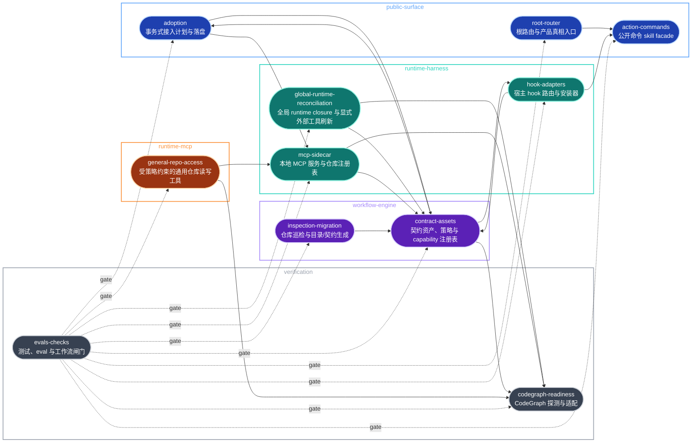

# Architecture Index

> Umbrella architecture ledger for current boundaries, drift requests, snapshots, and diagrams.

## Current Snapshot

- Latest snapshot: [repo-harness plugin review](snapshots/2026-05-25-repo-harness-plugin-review.md) (2026-05-25)
- Latest semantic diagram: [repo-harness plugin review Mermaid](snapshots/2026-05-25-repo-harness-plugin-review.md#semantic-diagram) (2026-05-25)
- Runtime hook adapter semantic diagram: [hook adapter workflow Mermaid](modules/runtime-harness/hook-adapters.md#semantic-diagram) (2026-05-30)

## System Boundary

`repo-harness` is a repo-local workflow harness CLI and skill with an optional
local MCP sidecar. It is not a hosted product runtime, agent gateway, or database
service. Its job is to inspect a target repository, install or refresh a
file-backed workflow contract, route public command skills, expose explicitly
configured local MCP capabilities, and verify that generated repo-local surfaces
remain consistent.

Authoritative surfaces:

- Public router: `SKILL.md`, `README.md`, `AGENTS.md`, `CLAUDE.md`.
- Public command facades: `assets/skill-commands/*/SKILL.md` plus `assets/skill-commands/manifest.json`.
- Engine: `scripts/inspect-project-state.ts`, `src/core/adoption/`, `src/effects/fs-transaction.ts`, `scripts/create-project-dirs.sh`, `scripts/lib/project-init-lib.sh`, and the [Transactional Adoption Planner](transactional-adoption-planner.md).
- Contract assets: `assets/workflow-contract.v1.json`, `.ai/harness/workflow-contract.json`, `.ai/harness/policy.json`, `.ai/context/context-map.json`, and the capability authority selected by `.ai/harness/policy.json#context.capability_source` (this repo: `.archcontext/model/nodes/*.yaml`).
- Runtime harness: `assets/hooks/`, `.ai/hooks/`, user-level host adapters, and ignored `.ai/harness/*` runtime state.
- MCP sidecar: `src/cli/mcp/`, `src/cli/commands/mcp.ts`, user-owned ignored config/registry under `~/.repo-harness/`, and the [MCP sidecar architecture](modules/runtime-harness/mcp-sidecar.md).
- Verification: `tests/`, `evals/`, `scripts/check-task-workflow.sh`, `scripts/check-task-sync.sh`, `scripts/check-agent-tooling.sh`, `scripts/ensure-codegraph.sh`.
- Effective State and workflow policy: `src/core/state/` (pure Effective State
  projection, ESA PR #79), `src/effects/state/` (source resolution and
  publication), and `src/core/workflow/` — `profile.ts` owns the deterministic
  risk/profile authority and `artifact-requirement-policy.ts` (LSC-02) owns
  the Lite/Standard/Strict x edit/stop/ship artifact-requirement matrix.
  Consumer cutovers to that matrix land one package at a time through the
  Loop Semantics Convergence sprint
  (`plans/sprints/20260716-0101-loop-semantics-convergence.sprint.md`);
  its frozen current-behavior baseline lives in
  `tests/state/loop-semantics-characterization.test.ts`.
- Loop semantics parity contract (LSC-08): the readiness authority
  (`src/core/workflow/operation-readiness.ts`'s `evaluateReadiness`, carried
  verbatim as `EffectiveStateV1.readiness`) and its Skill guidance
  (`EffectiveStateV1.guidance`) are projected, never recomputed, by four
  adapter surfaces — CLI (`repo-harness state resolve --json`, including
  `--field readiness`), MCP (`summarize_repo_harness_state`'s compact
  state), Hook (the Stop route's in-process `stop-handler.ts` reading
  `.readiness.allowedToStop` / `.readiness.readyToShip`), and Skill
  (guidance text matched against `CEREMONY_GUIDANCE[profile]`). All four
  agree on profile, operation, decision, reason, and readiness for the same
  fixtures; the parity gate is `tests/state/adapter-parity.test.ts`, with no
  separate gate machinery.
- Shared execution effects: `src/effects/process-runner.ts`,
  `src/effects/process-supervisor.ts`, `src/effects/process-group-launcher.ts`,
  `src/effects/locking/`, and `src/effects/git/` own bounded process lifecycle
  and canonical filesystem/Git primitives consumed by workflow and
  verification modules.

Out of scope:

- Product application scaffolds after their first generated skeleton.
- `_ref/` external reference checkouts and `_ops/` private operations state.
- Installing, upgrading, or enabling external host tools such as Waza, `geju`, or MCP servers. This self-host repo may vendor CodeGraph as a dev dependency, but generated downstream repos keep CodeGraph host setup explicit unless local policy opts in.
- Vendoring external skill bodies such as `mermaid`.

## Umbrella Hierarchy

```text
Project
  -> architecture domain
     -> capability
        -> capability contract block
        -> workstream ledger
        -> current todo slice
        -> source plan
```

- Architecture owns stable truth: boundaries, snapshots, and embedded Mermaid source.
- The capability authority selected by `.ai/harness/policy.json#context.capability_source` owns declared capability prefixes and longest-prefix matching; this repo resolves from `.archcontext/model/nodes/*.yaml`.
- Local `AGENTS.md` / `CLAUDE.md` contract blocks own agent-facing context projection.
- `tasks/workstreams/<domain>/<capability>/` owns durable multi-session progress.
- `tasks/todos.md` owns deferred medium/long-term goals with tradeoff and revisit trigger; current execution slices stay in the active plan's `## Task Breakdown`.

## Domains

- [Public Surface](domains/public-surface.md): root router, README, root agent docs, and action command facades.
- [Workflow Engine](domains/workflow-engine.md): inspection, migration, template install, contract assets, and policy/context generation.
- [Runtime Harness](domains/runtime-harness.md): generated hook implementation, user-level adapter settings, handoff, and runtime event state.
- [Verification](domains/verification.md): unit tests, smoke checks, eval fixtures, CodeGraph readiness, and advisory tooling probes.

## Capability 地图

`.ai/harness/policy.json#context.capability_source` 选中的 capability 权威声明 11 个 capability，分属 5 个 architecture domain；本仓库的权威是 `.archcontext/model/nodes/*.yaml`。
下图按 domain 分组，只画在源码里核实过的强依赖边（import 或运行时调用），
虚线是 verification 的 gate 关系而非代码依赖。



每条实线边的源码证据：

| 边 | 证据 |
| --- | --- |
| root-router -> action-commands | `SKILL.md` 的 verify 步骤指名 `repo-harness-check`，该 facade 实体在 `assets/skill-commands/repo-harness-check/` |
| contract-assets -> adoption | `src/cli/commands/init.ts` 导入 `./adoption-plan` 的 `runAdoptionApply` / `runAdoptionPlan` |
| contract-assets -> hook-adapters | `src/cli/commands/init.ts` 导入 `../installer/install-profile` 的 `PROFILE_COMPONENTS` |
| contract-assets -> codegraph-readiness | `src/cli/commands/init.ts` 导入 `../tools/codegraph` 的 `configureCodegraph` / `ensureCodegraph` |
| global-runtime-reconciliation -> contract-assets | `src/cli/commands/global-runtime.ts` 导入 install-profile 与 skill-surface catalog，并读取 package-owned runtime assets |
| global-runtime-reconciliation -> codegraph-readiness | `src/cli/commands/global-runtime.ts` 导入 `../tools/codegraph` 的 `configureCodegraph` |
| inspection-migration -> contract-assets | `scripts/lib/project-init-lib.sh` 生成并写入下游 registry 模式的 `.ai/context/capabilities.json` 与模板契约文件（新仓库默认 `capability_source: "registry"`，与本仓库自身的 archcontext 权威无关） |
| adoption -> contract-assets | `src/core/adoption/source-checkout.ts` 以 `assets/workflow-contract.v1.json` 判定源码 checkout；`src/core/adoption/standard-plan.ts` 指向 `package:assets/templates/helpers` |
| adoption -> mcp-sidecar | `src/cli/commands/adoption-plan.ts` 导入 `../../effects/repo-registry` 的 `registerRepoHarnessRepo` |
| hook-adapters -> contract-assets | `src/cli/hook/mutation-observed.ts` 以 `capability-context request` 驱动 context-contract-sync 级联，而不是自带第二份 capability-resolver |
| hook-adapters -> action-commands | `src/cli/installer/install-profile.ts` 读取 `assets/skill-commands/manifest.json` 并按名取用各命令源目录 |
| mcp-sidecar -> contract-assets | `src/cli/mcp/tools.ts` 导入 `../runtime/helper-runner` 的 `runHelper` |
| mcp-sidecar -> codegraph-readiness | `src/cli/mcp/server.ts`、`coding-tools.ts`、`reader-tools.ts` 导入 `./codegraph-adapter` |
| general-repo-access -> mcp-sidecar | `src/cli/mcp/general-repo-access.ts` 导入同目录的 `./types` / `./paths` / `./audit` / `./redaction` 与 `../../effects/repo-registry` |
| general-repo-access -> codegraph-readiness | `src/cli/mcp/general-repo-access.ts` 导入 `./codegraph-adapter` 的 `createCodeGraphCliAdapter` |

虚线 gate 边来自每个 capability 在 capability 权威里自己声明的 `verification_hints`
（例如 `tests/cli/adoption-plan.test.ts`、`tests/hook-runtime.test.ts`、`tests/cli/mcp-reader-tools.test.ts`），
以及 `bun test` 与 `scripts/check-task-workflow.sh --strict` 这两个全仓闸门。

contract-assets 内部还有一条投影关系而不是跨 capability 边：`scripts/sync-helper-sources.ts`
把 `scripts/` 下的 helper 单向投影成 `assets/templates/helpers/` 的打包副本，源与投影两端同属
contract-assets 前缀，漂移由 `bun run sync:helpers` 的 `--check` 模式拦截。

### Capability 索引

| capability id | 主前缀 | 职责 | 模块文档 |
| --- | --- | --- | --- |
| `public-surface-root-router` | `SKILL.md` | 根路由与产品真相入口，把请求分发到各动作命令 | [root-router](modules/public-surface/root-router.md) |
| `public-surface-action-commands` | `assets/skill-commands` | 公开动作命令的 skill facade 与 manifest | [action-commands](modules/public-surface/action-commands.md) |
| `public-surface-adoption` | `src/core/adoption` | 事务式接入计划的生成、渲染与文件系统落盘 | [adoption](modules/public-surface/adoption.md) |
| `workflow-engine-inspection-migration` | `scripts/inspect-project-state.ts` | 巡检目标仓库状态并生成或迁移工作流目录骨架 | [inspection-migration](modules/workflow-engine/inspection-migration.md) |
| `workflow-engine-contract-assets` | `assets/workflow-contract.v1.json` | 工作流契约、策略、模板与 capability 注册表的权威面 | [contract-assets](modules/workflow-engine/contract-assets.md) |
| `runtime-harness-hook-adapters` | `assets/hooks` | 宿主 hook 事件的进程内路由、handler 与安装器 | [hook-adapters](modules/runtime-harness/hook-adapters.md) |
| `runtime-harness-global-runtime-reconciliation` | `package.json` | 校验 package-local ArchContext closure，并只在显式选择时刷新 mutable provider | [global-runtime-reconciliation](modules/runtime-harness/global-runtime-reconciliation.md) |
| `runtime-harness-mcp-sidecar` | `src/cli/mcp` | 本地 MCP sidecar 的传输、策略、审计与仓库注册表 | [mcp-sidecar](modules/runtime-harness/mcp-sidecar.md) |
| `runtime-mcp-general-repo-access` | `src/cli/mcp/general-repo-access.ts` | 受策略与授权约束的通用仓库读写工具面 | [general-repo-access](modules/runtime-mcp/general-repo-access.md) |
| `verification-codegraph-readiness` | `scripts/ensure-codegraph.sh` | CodeGraph 可用性探测、解析与 MCP 适配 | [codegraph-readiness](modules/verification/codegraph-readiness.md) |
| `verification-evals-checks` | `tests` | 单元测试、eval fixture、工作流与任务同步闸门 | [evals-checks](modules/verification/evals-checks.md) |

阅读约定：

- 模块文档按 capability 组织，一个 capability 恰好对应 `modules/<domain>/<capability>.md` 一个文件。
- 事实优先级：实际源码 > 本文与模块文档。本图与表若与 `src/`、`scripts/`、`assets/` 的现状冲突，以源码为准并提一次 architecture drift request。
- 前缀权威在 `.ai/harness/policy.json#context.capability_source` 选中的 capability 权威（本仓库为 `.archcontext/model/nodes/*.yaml`），本表「主前缀」只取每个 capability 前缀列表的首项作为定位锚点，不是完整边界。
- Verified against: `main@13686d8d`（2026-08-08）。

## Architecture Drift Flow

- `scripts/architecture-queue.sh` records architecture-sensitive edits as requests.
- `scripts/capability-resolver.ts` resolves changed paths to capabilities with longest-prefix matching.
- `scripts/archive-architecture-request.sh` archives handled requests after an agent records the resolution status and linked artifacts; `Resolved` requires the request's declared architecture module as an existing durable artifact.
- `scripts/context-contract-sync.sh` keeps only the controlled architecture block in capability `AGENTS.md` and `CLAUDE.md` files aligned.
- `scripts/workstream-sync.sh` keeps durable multi-session progress under `tasks/workstreams/<domain>/<capability>/` and projects only pointers into local contracts.
- Semantic diagrams live as Mermaid fenced blocks in the relevant architecture module or snapshot Markdown.
- Mermaid fenced blocks are the only architecture diagram artifacts; agents must not generate standalone HTML.
- `mermaid` is an external authoring/review skill (`~/.codex/skills/mermaid`), not a production dependency or vendored architecture body.

## Request Archive Rule

- `docs/architecture/requests/` contains only pending architecture drift requests.
- Handled requests move to `docs/architecture/requests/archive/YYYY/`.
- Valid terminal statuses are `Resolved`, `Superseded`, `Rejected`, and `No architecture change`.
- The archived request must link any produced module, snapshot, or embedded Mermaid source.
- `docs/architecture/index.md` keeps only pending request links.

## 2026-07-16 Closeout Runner Guardrails

- P1: helper dispatch and authoritative benchmark production are separate
  consumers of one neutral lifecycle/locking effects layer. Workflow helper
  policy remains in `src/cli/runtime/helper-runner.ts`; benchmark semantics
  remain in `scripts/run-harness-profile-benchmark.ts`.
- P2: helper identity selects a fixed timeout envelope. A private launcher
  waits on an inherited start barrier while the supervisor publishes the PGID;
  only then may the target start. The supervisor normally performs `SIGTERM ->
  500ms -> SIGKILL` and publishes completion only after PGID absence; if the
  supervisor itself exceeds its hard envelope, the synchronous parent repeats
  that bounded cleanup against the published PGID. Expensive consumers contend on
  `<git-common-dir>/repo-harness/expensive-run.lock`. Linked worktrees therefore
  share one lane while repo-local state locking keeps its existing path.
- P3: the directory-token primitive was moved, not duplicated, so state and
  closeout locks retain the same fail-closed ancestor, exact-token, and stale
  owner rules. Portable process-group cleanup is guaranteed on POSIX; Windows
  uses best-effort `taskkill /T`, and direct raw Bash helper execution remains
  internal rather than a second supported lifecycle authority.

## Pending Requests


<!-- BEGIN ARCHITECTURE PENDING REQUESTS -->
- (none)
<!-- END ARCHITECTURE PENDING REQUESTS -->


## Review Backlog

- Treat user-level `~/.codex/hooks.json` and `~/.claude/settings.json` as host adapters. Keep hook implementation under `.ai/hooks/`, and treat repo-local `.claude/settings.json` / `.codex/hooks.json` hook adapters as retired legacy config.
- Consider adding `bun scripts/capability-resolver.ts validate --format text` to the strict workflow gate after the architecture registry has been used through one more real slice.

<!-- BEGIN ARCHCONTEXT:generated target="projection_target.architecture.index" sourceDigest="sha256:dfeee72dd6b65c11c5410cf52261499a156ed11386d32cb5121711b63684470d" rendererVersion="archcontext.docs-renderer/v2" outputDigest="sha256:b06c6e04a526077cd1c45aed4cac83fbbab0e57227b7d8a2a0d06329ef2cd392" -->
# Architecture Index

Generated: 1970-01-01T00:00:00.000Z

## Entities

- [Action Commands](modules/public-surface/action-commands.md) — capability / active
- [Adoption](modules/public-surface/adoption.md) — capability / active
- [Root Router](modules/public-surface/root-router.md) — capability / active
- [Global Runtime Reconciliation](modules/runtime-harness/global-runtime-reconciliation.md) — capability / active
- [Hook Adapters](modules/runtime-harness/hook-adapters.md) — capability / active
- [MCP Sidecar](modules/runtime-harness/mcp-sidecar.md) — capability / active
- [General Repository Access](modules/runtime-mcp/general-repo-access.md) — capability / active
- [CodeGraph Readiness](modules/verification/codegraph-readiness.md) — capability / active
- [Evals And Checks](modules/verification/evals-checks.md) — capability / active
- [Contract Assets](modules/workflow-engine/contract-assets.md) — capability / active
- [Inspection And Migration](modules/workflow-engine/inspection-migration.md) — capability / active

## Relations

- capability.public-surface.action-commands -> component.action-commands.primary — calls
- capability.public-surface.adoption -> component.adoption.primary — calls
- capability.verification.codegraph-readiness -> component.codegraph-readiness.primary — calls
- capability.workflow-engine.contract-assets -> component.contract-assets.primary — calls
- capability.verification.evals-checks -> component.evals-checks.primary — calls
- capability.runtime-mcp.general-repo-access -> component.general-repo-access.primary — calls
- capability.runtime-harness.global-runtime-reconciliation -> component.global-runtime-reconciliation.primary — calls
- capability.runtime-harness.hook-adapters -> component.hook-adapters.primary — calls
- capability.workflow-engine.inspection-migration -> component.inspection-migration.primary — calls
- capability.runtime-harness.mcp-sidecar -> component.mcp-sidecar.primary — calls
- capability.public-surface.root-router -> component.root-router.primary — calls

## Projections

- [Mermaid](diagrams/architecture.mmd)
- [Structurizr JSON](diagrams/architecture.structurizr.json)
- [LikeC4](diagrams/architecture.likec4)
- [Decision index](decisions/index.md)
- [Architecture changelog](changelog.md)
<!-- END ARCHCONTEXT:generated target="projection_target.architecture.index" -->
