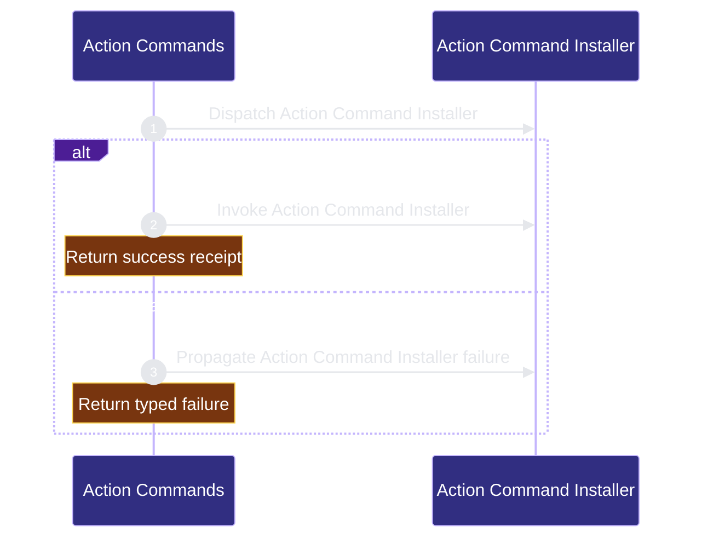

# public-surface/action-commands 架构文档
<!-- BEGIN ARCHCONTEXT:generated target="projection_target.entity.capability-public-surface-action-commands" sourceDigest="sha256:6d50fa43d5583ee0ef25afa1363333f11f3559475cae0f8dd61d8973925acf41" rendererVersion="archcontext.docs-renderer/v2" outputDigest="sha256:69e0cf2353ee72153aba1dc5d7be5d9aa662b4bfa1481410dcf81c6ff8e37dfc" verifiedAgainst="main@1495a1d6d3b60b8b442061a420f443432e140791@2026-08-12T21:59:27+08:00" -->
> **狀態**:`active`
> **Verified against**:`main@1495a1d6d3b60b8b442061a420f443432e140791`(2026-08-12)
> **Capability ID**:`capability.public-surface.action-commands`(kind `capability`)
> **Matched Prefixes**:`assets/skill-commands/**`
> **Local Contracts**:`AGENTS.md`、`CLAUDE.md`
> **事實優先級**:倉庫當前狀態 > 本文檔機器區 > 本文檔人工區。機器區(引言、§1、§2)由 ArchContext 從架構模型與 Git 狀態投影生成,手改會在下次投影被覆蓋。

Defines the user-facing action command skill surface and its evaluation boundary.

## 1. P1:能力架構地圖

### 1.1 架構圖

- Proof: `proven` (`sha256:96137e3e1aed773a373e175732b24d13b569da24490013d68645597b845d1034`).
- Semantic nodes: `2`; declared relations: `1`.

### 1.2 模組職責表

| 宣告入口 | 錨點 | 職責 |
| --- | --- | --- |
| `entrypoint.action-commands.primary` | `src/cli/commands/init.ts#installExternalSkills` | `sink.action-commands.primary` → `src/cli/commands/init.ts#loadSkillSurfaceCatalog` |

### 1.3 規模信號

- 文件數:`7`
- 總行數:`651`
- 匹配前綴:`assets/skill-commands/**`
- 復算:`archctx docs plan --json`(掃描 `source.include` 減 `source.exclude`,跳過 `.git/` 與 `node_modules/`)

### 1.4 依賴邊界

出向關係:

- `calls` → `component.action-commands.primary` — Install action command skills

入向關係:

- 無。

## 2. P2:端到端數據流

> **Proof**: `proven` (`sha256:96137e3e1aed773a373e175732b24d13b569da24490013d68645597b845d1034`); selectors `1/1`.

<!-- END ARCHCONTEXT:generated target="projection_target.entity.capability-public-surface-action-commands" -->
## 3. P3：设计决策与不变量

### 3.1 为什么是"目录 + prose"而不是"命令实现"

用户选择的是**意图**（plan / check / ship / architecture），而执行步骤归 CLI + hooks。这条分工产生的可检验不变量是：`hooks-init`、`docs-init`、`create-project-dirs` 永远是内部步骤而非公共命令（manifest.json:342-346，由 tests/action-command-skills.test.ts:78-82 钉死；同时 tests/action-command-skills.test.ts:249-262 要求根 `SKILL.md`/`README.md`/`agentic-development-flow.md` 三份公共文档同时提到这三个名字并标注 `not public`）。

### 3.2 单一真相 + 确定性投影

`manifest.json` 是 discovery 的唯一权威，其余全是投影：

- `expectedProjections` 是**声明**，`computeFacadesForProfile` / `computeExternalSkillsForProfile` / `computeHostSkillPlacements` 是**复算**，两者不符即 `PROJECTION_MISMATCH`（catalog.ts:596-630）。selector 只有一份实现，导出的 selector 与内部自洽校验共用（catalog.ts:173-210 的注释即为此意图）。
- shell 侧完全不复制选择逻辑：`sync-codex-installed-copies.sh` 通过 `skill-surface-select.ts` 拿投影结果，一次 `profile-projection` 调用同时返回 facade 与 host placement，避免为了加一条归属边界再付一次 Bun 启动开销（脚本 L51-56 注释）。
- 校验层次也是单一的：`profileComponents` 交叉校验的数据源 `PROFILE_COMPONENTS` 由 core 拥有（profile-components.ts），`install-profile.ts` 原样再导出，因此 adapter 直接 import core 而不必把整个 installer 拉进一个薄壳。

### 3.3 fail-closed 的所有权模型

同步脚本对 host skill root 的每一次写入都先证明归属，证明手段有且仅有三种（sync 脚本 L186-234）：exact package-target symlink、owner marker（`owner` + `surface` + `content_hash` 三项全中）、与 package source byte-identical 的目录（这一条是 marker 引入前的一次性迁移分支）。任何未知或被改动的 surface 在事务开始前就 exit 1。两次 `preflight_skill_root` 在脚本 L405-406、即所有 mutation 之前执行，这是"不做半个事务"的结构保证。

`kind: "judge"` 的 `merge-gate` 是这套模型的补角：它需要出现在 full profile 的 discovery 矩阵里作为一行分类，但 repo-harness 不发布它的 SKILL.md、也不为它做任何 runtime projection。用空 `hosts`/`profiles` 表达"不可选"，比加一个 `installable: false` 布尔更省——所有 selector 本来就按这两个字段过滤。

### 3.4 退役是数据，不是删除

`retiredPackages[]` 是纯迁移诊断（**已实现、纯声明**）：19 条记录每条指向其 live 替代者或 `null`（完全退役，仅 `repo-harness-autoplan`）。它不参与任何投影，只用于让"这个名字去哪了"可被机器回答。与之配套的是同步脚本的退役分支：host 上留下的旧名字目录，只要还是干净的托管副本，就被安全回收而不是变成一条 preflight 硬失败。

### 3.5 facade 粒度闸门

局部契约 CLAUDE.md:14-16 挡住了这个目录最可能的腐化方向：每引入一个 CLI 动词就顺手加一个 skill。规则是 facade 必须编排多个 CLI 能力或携带超出单次命令调用的领域规则；单动词改名归 `--help` 或 `docs/reference-configs/`；per-engine-verb 的兄弟 skill 明令禁止（`repo-harness-chatgpt` 是那一整个 engine 的唯一 facade）。

### 3.6 10x 规模下先垮的点

目录本身可以无限增长——它是 on-demand catalog。真正会先垮的是**默认发现面与路由**：

1. **投影表的人工维护成本**。`expectedProjections` 是顺序敏感的手写数组（catalog.ts:600 用 `arraysEqual` 而非集合比较）。到 50+ package 时，每次插入一个 package 都要手改三张表的对应行，`PROJECTION_MISMATCH` 会从"有效护栏"退化成"每次改动都要修一遍的仪式"。当前 16 条尚在人可读范围内。
2. **两 profile 的表达力**。默认面被 `minimal`/`full` 二元投影钉死（full 是默认的 11 hook 面，显式 minimal 保留 7 hook 基线——由 tests/install-profiles.test.ts:105-106 实测断言）。第三类用户出现时，压力会先落在 profile 词表而不是 manifest 结构上。
3. **同步脚本的 O(n) 目录扫描**。`preflight_skill_root` 与 `remove_retired_owned_facades` 都对 `$root/repo-harness-*` 全量遍历，且每个已 marker 的目标都要重算一次 `managed_tree_hash`（全树 cat + sha256）。facade 数量 ×10 时，每次 `init` 的哈希开销线性增长；这是纯本地 I/O，会先表现为安装变慢而非出错。
4. **prose 与 test 的耦合密度**。`tests/action-command-skills.test.ts` 用 `toContain` 逐句钉死 facade 措辞（例如 ship 的 `Does not run \`git reset --hard\`…`）。这保证了 boundary 不被悄悄放宽，代价是每次改写 prose 都要同步改 test。命令数 ×10 后，这套断言的维护成本会先于 manifest 的结构复杂度成为瓶颈。

新增命令改变路由行为时增加 eval case（见 §5），是对 (2) 的直接对冲。

## 4. 历史决策记录（append-only）

改写前的 `docs/architecture/modules/public-surface/action-commands.md`（`# Architecture Module: public-surface/command-facades`，91 行，含 `## P1 Map` / `## P2 Trace` / `## P3 Decision` / `## Optimization Backlog`）**不含任何带日期的章节**，因此本 ledger 从空开始。后续每条带日期的决策在此追加，逐字保留原文，不改写、不翻译。

_（暂无条目）_

## 5. Optimization Backlog

- Add an eval case whenever a new command changes routing behavior.
- Keep command facades thin; move policy into scripts, manifests, or reference configs.
