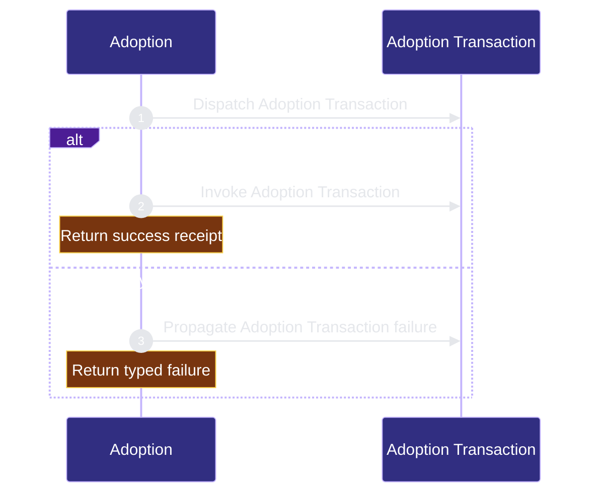

# public-surface/adoption 架构文档
<!-- BEGIN ARCHCONTEXT:generated target="projection_target.entity.capability-public-surface-adoption" sourceDigest="sha256:70f7c537b3943cfc93d02e71670d31413d6676835a0e7d7d51b9ba81083b9397" rendererVersion="archcontext.docs-renderer/v4" outputDigest="sha256:8cdc5490865571f4fc7682b1fcd6f5a75cd436fb08df42f8c5c18da2e8794afe" -->
> **狀態**:`active`
> **Capability ID**:`capability.public-surface.adoption`(kind `capability`)
> **Matched Prefixes**:`src/cli/commands/adoption-plan.ts`、`src/core/adoption/**`、`src/effects/fs-transaction.ts`、`src/effects/path-safety.ts`、`tests/cli/adoption-plan.test.ts`、`tests/fixtures/adoption/**`
> **Local Contracts**:`AGENTS.md`、`CLAUDE.md`
> **事實優先級**:倉庫當前狀態 > 本文檔機器區 > 本文檔人工區。機器區(引言、§1、§2)由 ArchContext 從架構模型與源碼度量投影生成,手改會在下次投影被覆蓋。本文檔不記錄出處;本次投影所驗證的 commit 見 `docs/architecture/.projection-manifest.json`。

Plans and applies repository adoption through the canonical filesystem transaction boundary.

## 1. P1:能力架構地圖

### 1.1 架構圖


- Proof: `proven` (`sha256:10dbfde8a2200fc50316ccffa30c6730cecbe1b0f9c1579db07c0681af104316`).
- Semantic nodes: `2`; declared relations: `1`.

### 1.2 模組職責表

| 宣告入口 | 錨點 | 職責 |
| --- | --- | --- |
| `entrypoint.adoption.primary` | `src/cli/commands/adoption-plan.ts#runAdoptionApply` | `sink.adoption.primary` → `src/effects/fs-transaction.ts#applyAdoptionPlan` |

### 1.3 規模信號

- 規模量級:`20–50` 個文件 / `2000–5000` 行
- 匹配前綴:`src/cli/commands/adoption-plan.ts`、`src/core/adoption/**`、`src/effects/fs-transaction.ts`、`src/effects/path-safety.ts`、`tests/cli/adoption-plan.test.ts`、`tests/fixtures/adoption/**`
- 推導:掃描 `source.include` 減 `source.exclude`,跳過 `.git/` 與 `node_modules/`,再按 1–2–5 階梯分桶。精確計數不入本文檔:量級足以回答「這個能力有多大」,而逐行計數會讓覆蓋範圍內任何一次源碼改動都改寫本文檔。

### 1.4 依賴邊界

出向關係:

- `calls` → `component.adoption.primary` — Apply repository adoption

入向關係:

- 無。

## 2. P2:端到端數據流

> **Proof**: `proven` (`sha256:10dbfde8a2200fc50316ccffa30c6730cecbe1b0f9c1579db07c0681af104316`); selectors `1/1`.


<!-- END ARCHCONTEXT:generated target="projection_target.entity.capability-public-surface-adoption" -->
## 3. P3：设计决策与不变量

### 3.1 为什么是这个形状

**规划/执行分离**是这份代码里最贵也最关键的一条线。`planAdoption` 完全纯函数化（只读 fs），使得 `--dry-run` 输出和 apply 真正执行的是**同一个 operation 模型**，而不是两条各自解释意图的代码路径。这直接消掉了「预演说要改 A，实际改了 B」这一类最难 debug 的问题；代价是 `standard-plan.ts` 必须把所有条件判断前移到规划期，因此它膨胀到 839 行。

**前置条件在规划期固化**（`expectedContentHash` / `expectedAbsent`，`operations.ts:26-29`）是对「规划到执行之间存在时间窗」的正面回应。没有它，长事务里一次并发编辑就会被静默覆盖。

**回滚策略也在规划期固化**（`rollback.ts:11`），而不是执行期临时推断。这样 `--dry-run` 的输出本身就是一份可审计的回滚说明书。

**executor 单点**：`applyAdoptionPlan` 在全仓只有一个调用点（`adoption-plan.ts:150`）。这不是巧合，是刻意的收口——多一个 apply 权威就多一份漂移。

### 3.2 必须保持的不变量

1. **单一事实源**：`assets/workflow-contract.v1.json` + `standard-plan.ts` 的默认值定义 canonical 字节；plan、manifest、registry、Markdown 视图全是投影。
2. **规划层无副作用**：`src/core/adoption/**` 不 import `src/effects/**`。
3. **fail closed**：非法路径、哈希不符、所有权歧义、不支持的 kind → 停止或告警，绝不通过扩大删除范围来「让流程走下去」。
4. **保护用户所有权**：`.gitignore` 只动受管区块（`managed-block.ts:54`）；hook 配置只摘 repo-harness 自有命令（`managed-hook-config.ts:51`）；known-generated 清理只删字节匹配声明 fingerprint 的文件。
5. **manifest 与文件效果同事务**：manifest 写失败即整体失败（`fs-transaction.ts:500`）。
6. **回滚只碰本事务拥有的目标**：apply 之后的用户编辑一律拒绝覆盖。
7. **self-host apply 保持 fail-closed**：在 hook/runtime 审查确定性之前，公共 `init` 不得写自宿主形态。

### 3.3 10x 规模下先垮的点

按当前实现，压力不在包结构，而依次在：

1. **preflight 与 apply 之间的时间窗**。当前 preflight 是全量前置扫描，然后串行执行；operation 数量从当前的几十条涨到几百条时，窗口线性拉长，`target content changed after planning` 的误报率上升。先垮的是可用性，不是正确性——这是刻意的取舍。
2. **锁粒度**。`withTargetLock`（`fs-transaction.ts:209`）是 per-target 的 `O_EXCL` 文件锁，没有全事务锁。两个并发 `init` 不会互相覆盖单个文件，但可以交错出一个「一半来自事务 A、一半来自事务 B」的仓库状态。10x 并发下这是第一个真正的正确性缺口。
3. **备份体积**。每次写入都全量保留原字节到 `.ai/harness/backups/fs-transaction/`，没有任何保留期或 GC。事务次数上去之后这个目录单调增长。
4. **`standard-plan.ts` 的单文件复杂度**。839 行、十余个 `add*Operations` 步骤全部依赖同一个可变 `operations` 数组的顺序。再加几类迁移，顺序耦合会变成隐式契约。拆分的正确触发条件是「出现第二个独立的 plan producer」，而不是行数本身。

### 3.4 刻意不做的事

- 不为 `mergeJson` 补 executor：没有 producer 就没有需求，保留类型定义是历史遗留而非能力承诺（如需清理，应作为独立 work-package 删除类型而非补实现）。
- 不引入独立 workspace package：本 capability 与 CLI 同包同发布，缺少第二个独立发布/部署的 consumer。
- 不加 shell 兼容 apply 路径、不加 experimental apply flag、不加第二套 plan parser。

### 3.5 与专题文档的关系

`docs/architecture/transactional-adoption-planner.md` 是本 capability 的主题设计文档（HRD-09 legacy 退役细节、invariant 清单、recovery 语义）。本文与之复验后的两处补充：

- 该文的 P1 称 `standard-plan.ts` 被 `init` 与 `runInit()` 共同消费；源码事实是两者都经过 `planAdoption`（`plan.ts:22`）这一层，且 `planAdoption` 有一个 self-host 源码 checkout 的短路分支，此时 `standard-plan.ts` 根本不被调用。
- 该文未记录 `runAdoptionApply` 对 `mode === "self-host"` 的显式阻断（`adoption-plan.ts:138`，`self_host_review_required`）。它与 `standard-plan.ts:828` 的不可执行 `runCheck` 构成双保险。

---

## 4. 历史决策记录（append-only）

此前版本的 `docs/architecture/modules/public-surface/adoption.md` 不含任何带日期的决策章节，因此本节目前为空。后续所有带日期的决策条目在此按时间追加，原文保留、不得改写。

---

## 5. Verification

```bash
bun test tests/cli/adoption-plan.test.ts
bun run check:type
bun src/cli/index.ts init --repo . --dry-run
```
