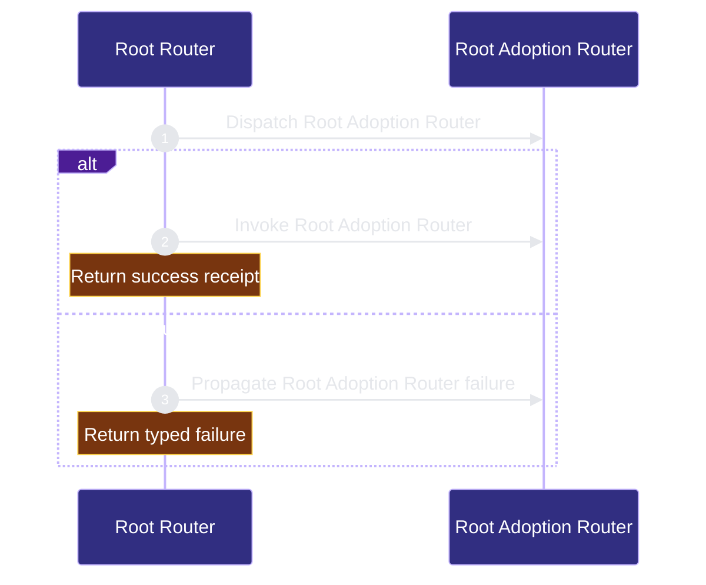

# public-surface/root-router 架构文档
<!-- BEGIN ARCHCONTEXT:generated target="projection_target.entity.capability-public-surface-root-router" sourceDigest="sha256:6d50fa43d5583ee0ef25afa1363333f11f3559475cae0f8dd61d8973925acf41" rendererVersion="archcontext.docs-renderer/v2" outputDigest="sha256:c5cb0b2ca29531b67cadba6d98c2ddf588176a4d4c48cf7cb2b231713d12fee3" verifiedAgainst="main@1495a1d6d3b60b8b442061a420f443432e140791@2026-08-12T21:59:27+08:00" -->
> **狀態**:`active`
> **Verified against**:`main@1495a1d6d3b60b8b442061a420f443432e140791`(2026-08-12)
> **Capability ID**:`capability.public-surface.root-router`(kind `capability`)
> **Matched Prefixes**:`SKILL.md`、`README.md`、`AGENTS.md`、`CLAUDE.md`、`docs/spec.md`
> **Local Contracts**:`AGENTS.md`、`CLAUDE.md`
> **事實優先級**:倉庫當前狀態 > 本文檔機器區 > 本文檔人工區。機器區(引言、§1、§2)由 ArchContext 從架構模型與 Git 狀態投影生成,手改會在下次投影被覆蓋。

Routes repository-level product and agent context into capability-specific contracts.

## 1. P1:能力架構地圖

### 1.1 架構圖

- Proof: `proven` (`sha256:d0ae54672447b74f61fc71d824e589eb5120a92e9b1b031830eecbba139c3f59`).
- Semantic nodes: `2`; declared relations: `1`.

### 1.2 模組職責表

| 宣告入口 | 錨點 | 職責 |
| --- | --- | --- |
| `entrypoint.root-router.primary` | `src/cli/commands/adoption-plan.ts#runAdoptionPlan` | `sink.root-router.primary` → `src/cli/commands/adoption-plan.ts#createPlan` |

### 1.3 規模信號

- 文件數:`5`
- 總行數:`831`
- 匹配前綴:`SKILL.md`、`README.md`、`AGENTS.md`、`CLAUDE.md`、`docs/spec.md`
- 復算:`archctx docs plan --json`(掃描 `source.include` 減 `source.exclude`,跳過 `.git/` 與 `node_modules/`)

### 1.4 依賴邊界

出向關係:

- `calls` → `component.root-router.primary` — Route root initialization

入向關係:

- 無。

## 2. P2:端到端數據流

> **Proof**: `proven` (`sha256:d0ae54672447b74f61fc71d824e589eb5120a92e9b1b031830eecbba139c3f59`); selectors `1/1`.

<!-- END ARCHCONTEXT:generated target="projection_target.entity.capability-public-surface-root-router" -->
## 3. P3：设计决策与不变量

### 3.1 为什么路由器故意做薄

工作流的机器可检查不变量太多，prose 无法保持正确。因此策略是：**policy 住在 contract、script 和 test 里；root 文档只做路由和定向**。`SKILL.md` 里没有一条可以脱离 CLI 单独执行的规则——它给的是命令名和 reference 名，真正的协议在被指向的文件里。

2048 字节的天花板不是风格约束，是**常驻上下文预算**：每个 host、每个 session、在任何动作被选中之前都要加载它。测试注释把这层理由写死在 `tests/bootstrap-files.test.ts:48-51`，防止后人把它读成可协商的 lint 规则。

### 3.2 必须保持的不变量

1. **五动作封闭**：setup / plan / execute / verify / handoff，序号与加粗格式被逐字断言。新增公开命令不能变成第六个动作，只能挂在现有动作下的 facade。
2. **状态权威单一**：`repo-harness state resolve --json` 是唯一入口，其他文件"只在该 JSON 指向时才读"。路由器自身不缓存、不复述状态。
3. **AGENTS.md ≡ CLAUDE.md**：两个 host 契约必须字节相同。任何单侧编辑都是漂移。
4. **公开面与内部步骤分离**：`hooks-init` / `docs-init` / `create-project-dirs` 永远不是公开命令。
5. **profile 只增不诱导**：`repo-harness-setup`、`repo-harness-architecture`、`repo-harness-chatgpt` 的 `profiles: []` + `discoverability: cli-reference|explicit-setup` 意味着它们**永不被任何 profile 隐式发现**，只能经路由器或显式安装到达。这是把发现面压在五动作之内的关键机制。
6. **无兼容回落**：protocol 1 → 2 只有一条显式迁移路径，越界一律 throw。

### 3.3 10x 规模下先垮的点

**先垮的是发现面，不是文件大小。** 当公开命令从当前的 ~10 个（`manifest.json#packages`，其中 4 个是 profile-facade，5 个是 external）涨到 100 个时：

- `SKILL.md` 本身不会垮：五动作是常数级，2048 B 预算与命令数无关。
- 垮的是 **`manifest.json#expectedProjections` 的组合爆炸**。当前它手写枚举 `facadesByProfile` × `externalSkillsByProfile` × `hostSkillPlacementsByProfile` 三张表，共 2 个 profile × 2 个 host。命令数 10x 后，这三张表要么手写维护失败，要么必须从 package 条目派生——但派生就意味着 profile 归属从"显式枚举"变成"计算结果"，会削弱当前"新命令默认不可发现"的 fail-closed 姿态。
- 第二个压力点是 `retiredPackages`：当前 19 条退役映射全部内联在同一个 JSON 里。它是只增不减的，10x 后会超过 packages 本身的体积。

当前形状是正确的最小选择：profile-bounded facade 让专用命令**可用但不默认进入模型上下文**，代价是每加一个公开命令要在 manifest、README、`tests/action-command-skills.test.ts` 三处同步——这个代价是刻意的摩擦，不是遗漏。

### 3.4 已知漂移

| 项 | 声明 | 工作树事实 | 判定 |
| --- | --- | --- | --- |
| workstream 目录 | `.ai/context/capabilities.json` 声明 `tasks/workstreams/public-surface/root-router` | 目录不存在（`tasks/workstreams/public-surface/` 整个缺失） | **声明未落地**。该 capability 至今没有产生过需要跨会话承载的 durable progress；不是错误，但注册表与磁盘不一致 |
| verify 命令形态 | `docs/spec.md:36` 规定 canonical helper 调用是 `repo-harness run <helper>`；`AGENTS.md:66` 用 `repo-harness run check-task-workflow --strict` | `README.md:96` 的 Get Started 第 4 步写 `bash scripts/check-task-workflow.sh --strict` | 在本自托管仓库两者都可执行（`scripts/check-task-workflow.sh` 存在，且 `docs/spec.md:46` 明确 root `scripts/` 是自托管 source/runtime）；但 README 是**下游读者**的入口，展示的是非 canonical 形态 |

## 4. 历史决策记录（append-only）

本文件在 main@13686d8d 之前没有带日期的章节。为不丢失既有判断，以下逐字保留改写前版本（`docs/architecture/modules/public-surface/root-router.md`）的 P1 / P2 / P3 全文，英文原文不翻译。

<!-- BEGIN verbatim: pre-rewrite root-router.md, P1/P2/P3 -->

### Pre-rewrite `## P1 Map`

The root router is the human and agent entrypoint for this plugin. `SKILL.md`
defines when the skill is used and exactly five semantic actions: setup, plan,
execute, verify, and handoff. Its body is capped at 2KB. `README.md` owns first-run operator
guidance. `AGENTS.md` and `CLAUDE.md` define the self-hosted repo workflow for
both Codex and Claude. `docs/spec.md` owns the stable product outcome.

Strong dependencies:

- `scripts/inspect-project-state.ts` for state classification.
- `assets/workflow-contract.v1.json` for the machine-readable contract.
- `docs/reference-configs/agentic-development-flow.md` for routing detail that should not bloat root docs.

Weak dependencies:

- `repo-harness install --profile <profile>` owns first-run global bootstrap;
  the closed vocabulary is `minimal|full`, and full is the default.
- `repo-harness uninstall` removes repo-harness managed host adapters without deleting sibling hooks or third-party tools.
- `repo-harness init` owns repo-local harness adoption and refresh.
- `geju` is a pre-contract framing skill; repo-harness has no external knowledge-CLI runtime or readiness dependency. This self-host repo vendors CodeGraph as a dev dependency while downstream generated repos keep global MCP setup explicit unless policy opts in.

Out of scope:

- Runtime hook implementation.
- Migration internals.
- Product scaffold details after initial harness attachment.

### Pre-rewrite `## P2 Trace`

Concrete route: user explicitly asks for setup -> root `SKILL.md` selects setup
-> `repo-harness install` selects full and plans CLI, effective state, guards,
handoff, adapters, planning integrations, agent fleet, verifier, cross-model
acceptance, and release gates -> `--dry-run` lists install/skip/remove -> apply
persists protocol-2 `~/.repo-harness/install-state.json`. Explicit
`--profile minimal` selects the 7-hook baseline; full selects 11. Legacy
protocol-1 state is rejected outside `--migrate-profile-state`.

Concrete route: user asks for an existing repo install -> root `SKILL.md`
selects the setup action -> `repo-harness-setup` (init mode) routes to
`repo-harness init --repo <repo>` ->
the command runs `inspect-project-state.ts --repo <repo> --format text` -> if no
legacy state is found, `repo-harness init --repo <repo>`
installs or refreshes the workflow -> repo-local checks verify the target repo.

Concrete route: user asks for product discovery or a complex/design architecture
plan -> the parent agent invokes `geju` before a contract exists -> the parent
completes P1 architecture mapping, P2 concrete tracing, and P3 design judgment
with its own repo/runtime capabilities -> it reconciles the evidence and freezes
the accepted thesis, falsifier, and execution boundary into the file-backed plan
and contract. The captured contract, not a live planning provider, owns execution.

For global bootstrap, the input source of truth is the selected host target and
brain root, not the current directory. For repo-local adoption, the source of
truth is the target repo path, not the user's wording. The first repo-local type
transformation is repo filesystem state into `mode`,
`legacy_contract_version`, `drift_signals`, `required_decisions`, and
`upgrade_plan`. The final output is either a configured host runtime or a
file-backed harness plus verification report.

Error paths:

- Missing cwd/repo path stops before mutation.
- Legacy docs route to migration before template refresh.
- Missing JSON runtime fails strict workflow verification.

### Pre-rewrite `## P3 Decision`

The root router is intentionally thin because the workflow has too many
machine-checked invariants to keep correct in prose. The invariant is that
policy lives in contracts, scripts, and tests; root docs only route and orient.

Planning has one lifecycle owner: the parent agent. `geju` expands the design
space before capture, while P1/P2/P3 and the final plan remain parent-owned.
This removes a host-dependent external planning gate without weakening the
file-backed approval, scope, review, or verification boundaries.

At 10x command count, this layer fails first through discovery overload. The
five-action router and profile-bounded installed facades keep specialized CLI
commands available without making them default model context.

<!-- END verbatim -->

**改写时的复验批注**（对上述原文，逐条对源码核对）：

- P1 的 5 个 prefix、2KB 上限、strong/weak dependency 列表——**全部复验通过**。
- P2 第一条 route（install profile / 7-hook / 11-hook / protocol-2 / 遗留拒绝）——**全部复验通过**。
- P2 第二条 route 中"`repo-harness init --repo <repo>` -> the command runs `inspect-project-state.ts`"——**与源码冲突**。`src/cli/**` 对 `inspect-project-state` 零引用；该探测是 `repo-harness-setup` 的 Shared Preflight 第 ② 步（`assets/skills/repo-harness-setup/SKILL.md:16`），发生在 mode selection **之前**、`init` 调用**之前**。所有者与时序两处都不同，正确形态见 §2.1。
- P3 的三段判断——**复验通过**，§3 在其基础上补了 manifest 组合爆炸这个具体的 10x 失效机制。

## Optimization Backlog

- Keep the root router body at or below 2KB and default installed discovery at five actions or fewer.
- If another public command is added, update `assets/skill-commands/manifest.json`, README, and `tests/action-command-skills.test.ts` in the same slice.
