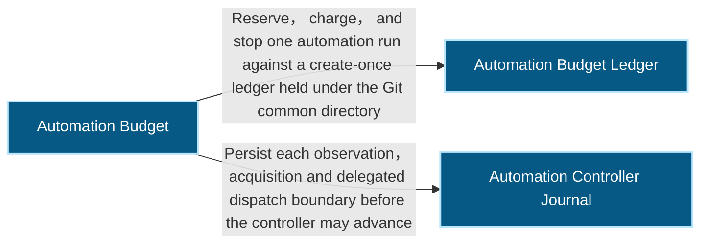
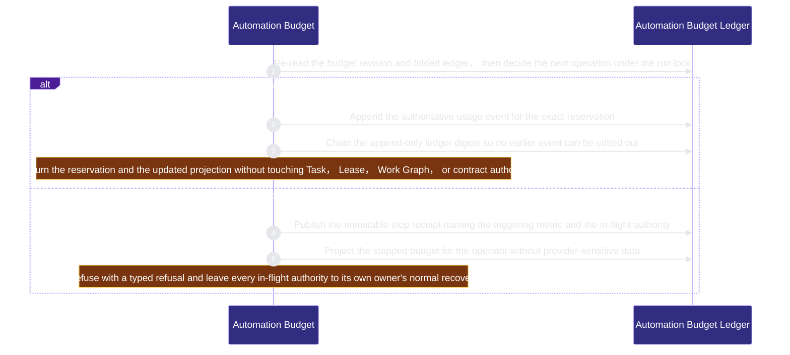
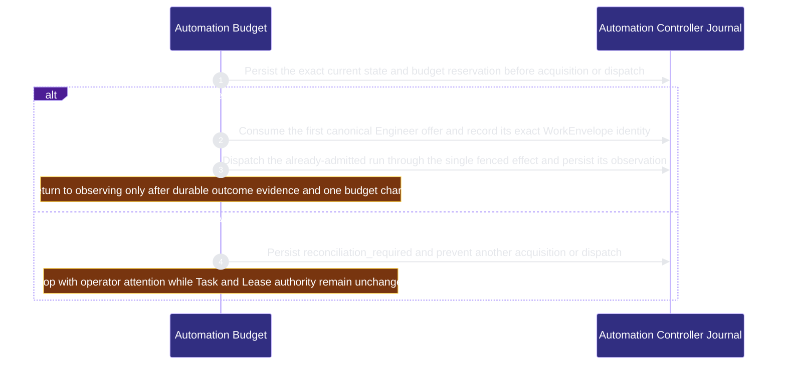

# runtime-harness/automation-budget 架構文檔

<!-- BEGIN ARCHCONTEXT:generated target="projection_target.entity.capability-runtime-harness-automation-budget" sourceDigest="sha256:543f7c79d43d479d08639c5792896807e7702751ffdaec1d57c4255d53223da4" rendererVersion="archcontext.docs-renderer/v4" outputDigest="sha256:4e22f748955143711e4ba6b02638a978e6a785040dd1cd5efc1747cdc79d1193" -->
> **狀態**:`active`
> **Capability ID**:`capability.runtime-harness.automation-budget`(kind `capability`)
> **Matched Prefixes**:`src/core/automation/**`、`src/effects/automation/**`、`src/cli/commands/automation.ts`
> **Local Contracts**:`AGENTS.md`、`CLAUDE.md`
> **事實優先級**:倉庫當前狀態 > 本文檔機器區 > 本文檔人工區。機器區(引言、§1、§2)由 ArchContext 從架構模型與源碼度量投影生成,手改會在下次投影被覆蓋。本文檔不記錄出處;本次投影所驗證的 commit 見 `docs/architecture/.projection-manifest.json`。

Enforces one machine-checked per-goal automation budget and runs the exact Engineer through a bounded, journaled acquire and delegated-dispatch controller.

## 1. P1:能力架構地圖

### 1.1 架構圖

- Proof: `proven` (`sha256:c258b13dd96755bef873cc2402c7948150b1a917e2e643f38ce08590d3846fdd`).
- Semantic nodes: `3`; declared relations: `2`.

### 1.2 模組職責表

| 宣告入口 | 錨點 | 職責 |
| --- | --- | --- |
| `entrypoint.automation-budget.reserve` | `src/effects/automation/budget-store.ts#reserveAutomationBudgetAdmission` | `sink.automation-budget.reservation-decision` → `src/core/automation/budget.ts#evaluateAutomationReservation` |
| `entrypoint.automation-budget.reserve` | `src/effects/automation/budget-store.ts#persistStopReceipt` | `sink.automation-budget.stop-receipt` → `src/core/automation/budget.ts#sealAutomationStopReceipt` |
| `entrypoint.automation-budget.append` | `src/effects/automation/budget-store.ts#prepareUsageCommit` | `sink.automation-budget.usage-event` → `src/core/automation/budget.ts#sealAutomationUsageEvent` |
| `entrypoint.automation-budget.append` | `src/effects/automation/budget-store.ts#publishUsageCommit` | `sink.automation-budget.ledger-chain` → `src/core/automation/budget.ts#chainAutomationLedgerDigest` |
| `entrypoint.automation-budget.project` | `src/effects/automation/budget-store.ts#readAutomationBudgetBoardSlice` | `sink.automation-budget.operator-slice` → `src/core/automation/projection.ts#projectAutomationBudgetSlice` |
| `entrypoint.automation-controller.step` | `src/effects/automation/controller-run.ts#append` | `sink.automation-controller.journal` → `src/effects/automation/controller-store.ts#appendAutomationControllerEvent` |
| `entrypoint.automation-controller.step` | `src/effects/automation/controller-run.ts#acquireNextControllerTask` | `sink.automation-controller.acquire` → `src/effects/engineers/scheduling-acquire-next.ts#acquireNextScheduledEngineerTask` |
| `entrypoint.automation-controller.step` | `src/effects/automation/controller-run.ts#dispatchControllerRun` | `sink.automation-controller.dispatch` → `src/effects/engineers/delegated-run-store.ts#dispatchDelegatedRun` |

### 1.3 規模信號

- 規模量級:`50–100` 個文件 / `10k–20k` 行
- 匹配前綴:`src/core/automation/**`、`src/effects/automation/**`、`src/cli/commands/automation.ts`
- 推導:掃描 `source.include` 減 `source.exclude`,跳過 `.git/` 與 `node_modules/`,再按 1–2–5 階梯分桶。精確計數不入本文檔:量級足以回答「這個能力有多大」,而逐行計數會讓覆蓋範圍內任何一次源碼改動都改寫本文檔。

### 1.4 依賴邊界

出向關係:

- `calls` → `component.automation-budget.ledger` — Reserve, charge, and stop one automation run against a create-once ledger held under the Git common directory
- `calls` → `component.automation-controller.journal` — Persist each observation, acquisition and delegated dispatch boundary before the controller may advance

入向關係:

- `depends_on` ← `capability.runtime-harness.development-campaign` — Consume the existing host-owned ProgramAuthorizationV1 grant identity without minting or widening automation authority

## 2. P2:端到端數據流

> **Proof**: `proven` (`sha256:c258b13dd96755bef873cc2402c7948150b1a917e2e643f38ce08590d3846fdd`); selectors `8/8`.

<!-- END ARCHCONTEXT:generated target="projection_target.entity.capability-runtime-harness-automation-budget" -->

## 3. P3:設計決策與不變量

1. 調用方(controller、CLI、campaign)對所有決策輸入都是不可信的;可信來源只有 host 進程:它的時鐘、它的檔案系統、倉庫裡的 canonical authorities。調用方只說要做什麼、發生了什麼,不說那值多少、發生在何時。每次讀取取一次 store 時鐘並把同一個瞬間用到該次讀取的所有時間欄位,不會同一份投影跨越 deadline。
2. 綁定的 task contract 的位元組在**每一次讀取**時重新驗證:store 依 `contract_path` 讀出 contract、比對 `contract_sha256`、自行解析 `delegation.budget`。因此 run 進行中編輯該 contract 會讓每個 verb 一致地 fail closed(`automation_budget_store_invalid`);恢復方式是還原位元組或另開一個 run,設計上沒有 re-bind 路徑——contract 是 budget 綁定的授權,不是可以中途換掉的參數。
3. `current.json` 是所有 durable record kind 的投影,不是第二個權威。record kind 由 `AUTOMATION_RECORD_KINDS` 逐條列舉,每條都寫明寫入順序與覆蓋其崩潰窗口的 drift face:`budgets/`(store 範圍、不計數)、`reservations/by-digest/`(derived index、不計數)、`reservations/`(`unlisted_reservation`)、`events/`(`unfolded_event`)、`reconciliations/`(`unconsumed_reconciliation`)、`stop-receipt.json`(`unadopted_stop_receipt`、`unsealed_exhaustion`)、以及投影本身 `current.json`,外加一條 `transient`(critical section 內建立、隨即 link/rename 掉的 dot-prefixed 暫存檔;崩潰留下的殘檔不計數、不折疊、不被解析);meta-test 斷言 run 目錄的持久項目剛好只有這些,並另外斷言每個 dot-prefixed 項目都符合 transient 樣式。drift 是有方向的:durable 多於投影是既有的崩潰窗口,可重新折疊;投影多於 durable(event/reservation 缺檔、投影列出的 open reservation 沒有對應檔案、已收費 event 的 reservation 不見了)任何寫入順序都造不出來,一律 typed `automation_budget_store_invalid` fail closed,不折疊也不寫入——而且 publish 與 reconcile 都在寫自己那筆 durable record 之前先分類,所以拒絕時不會留下任何記錄。可修復方向上,mutating verb 進 lock 後重新推導並落盤,read-only 面重新折疊只用於渲染、絕不寫入,`projection_stale` 說的是持久投影落後,不是渲染出來的數字落後。
4. token / cost 硬上限在本 slice 一律 fail closed:沒有 provider-attested usage 權威可讀之前,自證的用量數字比沒有上限更糟。
5. `ProgramAuthorizationV1` 由 operator 鑄進 harness home 的 gate store,key 取自 Git common directory,所以同一個 clone 的每個 linked worktree 解析到同一份 grant;目標不是 Git 倉庫時直接 typed 拒絕,不會落到之後 `git init` 就作廢的路徑 key。每個讀取面都會重新錨定 grant,撤銷或改動後下一個 verb 就停。

6. Controller journal 是 orchestration evidence，不是 Task 或 Lease authority。每次 step 先重驗 Engineer principal、Binding 與 authorization revision，再向 budget store 預留，之後才可調用 canonical acquire-next 或單一 fenced delegated-run effect。任何 event 已持久但 side effect 結果不明的狀態只可進 `reconciliation_required`。
7. 同一 Engineer 的 controller 由 Git common-dir lock 與 current pointer 串行化；terminal run 才可被新 run 取代。每次 invocation 同時受 step count 與 wall duration 上限約束，transient retry 使用 frozen policy 推導的 deterministic capped backoff。10x 時最先失效的是 append-only event 與 transition 目錄的線性枚舉，而不是 Lease/Task authority；屆時應加 content-addressed index，不應另建 task queue。
8. Controller policy 凍結有上限的 Lease renewal interval、maximum TTL、actor kind 與 evidence source closed set。acquire-next 成功後，controller 必須在記錄 `acquired` 前重新讀取 canonical Lease，並只為完全相同的 task revision、claim、generation、worktree 與 branch 建立 renewal；renewal digest 隨 acquisition evidence 一起寫入 controller journal。
9. Liveness journal 以 claim/generation 分代保存，task-level pointer 只指向最新成功 renewal 的 generation projection。Expiry 本身沒有 preemption authority；automatic reclaim 必須在同一 Lease lock 內重讀 owner、renewal、Binding/runtime/publication evidence，消費一張完全相同的 `reclaimable` receipt，再調用既有 generation-incrementing steal。不可讀或缺失的 evidence 投影為 `liveness_unproven` 並交給 operator。10x 時最先受壓的是每 generation 的 append-only renewal 枚舉；可加入由 journal 重建的索引，但 Lease owner 仍是唯一 claim/preemption authority。
10. Work Graph 的 `retry_policy` 是 unattended retry 的唯一策略權威，並被 Work Package revision 與 Engineer offer revision 同時綁定。attempt journal 只記錄執行證據，不改寫 Task status 或 priority；只有 policy 明列的 failure class 可在 deterministic backoff deadline 後重新進入 ordinary offer/Lease 路徑。revision 改變時依顯式 `reset_on_work_package_revision` 建立新的 attempt generation，不沿用舊策略語義。
11. Controller 在 delegated dispatch 前先以 claim、Lease generation、controller run 與 dispatch identity 寫入 attempt-start；完成觀察以相同 identity 冪等封口。start 後 outcome 不明會投影為 `reconciliation_required`，禁止另一個 controller 越過 max-attempt 或重複 dispatch。Engineer CLI/MCP offers 同時公開 attempt count、last outcome、next eligible time、blocker owner 與 starvation attention，且不包含 provider payload。10x 時最先受壓的是每 Work Package revision 的 attempt journal 線性重建；可加可驗證索引，但不可把索引變成 retry authority。

## 4. 歷史決策記錄(append-only)

## Optimization Backlog

## Campaign authoring scope

Campaign authoring reuses the anchored ProgramAuthorization and existing automation run lock, reservation and usage ledger. The required campaign payload field `max_authoring_rounds_per_group` counts admitted initial/fill_missing/edit_issue rounds for one immutable group/intent. It is independent of global stop semantics: a challenge consumes existing provider-invocation limits without consuming an authoring round.

The budget store seals terminal group evidence only after every group provider reservation is settled. The seal permanently closes authoring and binds identity, authorization, exact budget revision and ledger evidence. An unknown browser result remains open until explicit reconciliation; a reservation replay never authorizes a repeated provider call. Consumers read and verify the store's terminal record instead of deriving budget facts from campaign heartbeat/session journals. The API and remaining BRC9 gaps are documented in `docs/researches/20260905-repair-campaign-sprint-execution-boundaries.md`.
