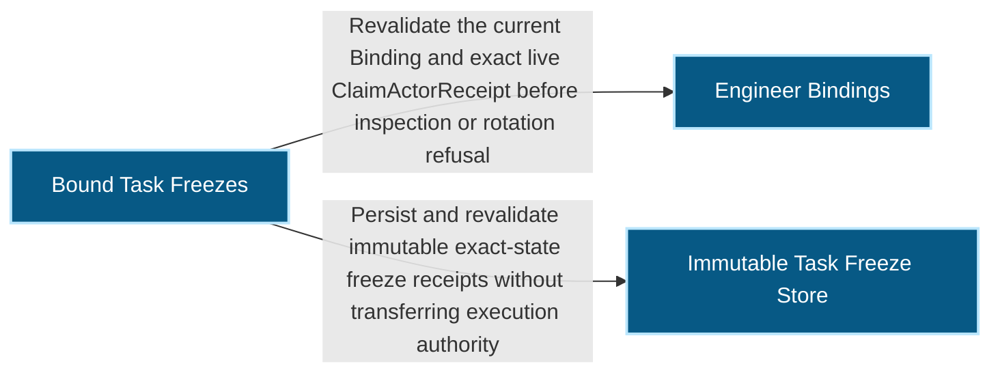
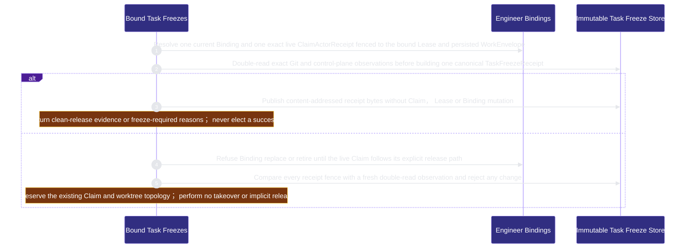

# runtime-harness/bound-task-freezes 架構文檔

<!-- BEGIN ARCHCONTEXT:generated target="projection_target.entity.capability-runtime-harness-bound-task-freezes" sourceDigest="sha256:50bf95c298d1eb462bd2b05a273f7a34ea8be649f18ea2562b25433e1462eca5" rendererVersion="archcontext.docs-renderer/v4" outputDigest="sha256:557ff7976d47c8f901ab758192325809b7d4808fa7cb991eadba32878cb0e89e" -->
> **狀態**:`active`
> **Capability ID**:`capability.runtime-harness.bound-task-freezes`(kind `capability`)
> **Matched Prefixes**:`src/core/engineers/task-freeze.ts`、`src/effects/engineers/task-freeze-store.ts`、`src/effects/engineers/bound-task-rotation.ts`
> **Local Contracts**:`AGENTS.md`、`CLAUDE.md`
> **事實優先級**:倉庫當前狀態 > 本文檔機器區 > 本文檔人工區。機器區(引言、§1、§2)由 ArchContext 從架構模型與源碼度量投影生成,手改會在下次投影被覆蓋。本文檔不記錄出處;本次投影所驗證的 commit 見 `docs/architecture/.projection-manifest.json`。

Freezes exact live Claim, Binding, WorkEnvelope and Git observations while refusing Session rotation that would imply dirty-task transfer.

## 1. P1:能力架構地圖

### 1.1 架構圖

- Proof: `proven` (`sha256:7d292675a7cc468a54552f59363baa784657098859f7ac88ecbba67364b5db4c`).
- Semantic nodes: `3`; declared relations: `2`.

### 1.2 模組職責表

| 宣告入口 | 錨點 | 職責 |
| --- | --- | --- |
| `entrypoint.bound-task-freezes.inspect` | `src/effects/engineers/task-freeze-store.ts#readCurrentTaskFreezeBinding` | `sink.bound-task-freezes.binding-current` → `src/effects/engineers/binding-store.ts#readEngineerBindingStatus` |
| `entrypoint.bound-task-freezes.inspect` | `src/effects/engineers/task-freeze-store.ts#inspectBoundTaskLocked` | `sink.bound-task-freezes.receipt-schema` → `src/core/engineers/task-freeze.ts#buildTaskFreezeReceipt` |
| `entrypoint.bound-task-freezes.persist` | `src/effects/engineers/task-freeze-store.ts#inspectBoundTaskLocked` | `sink.bound-task-freezes.immutable-store` → `src/effects/engineers/task-freeze-store.ts#persistTaskFreezeReceipt` |
| `entrypoint.bound-task-freezes.verify` | `src/effects/engineers/task-freeze-store.ts#verifyTaskFreeze` | `sink.bound-task-freezes.stale-compare` → `src/core/engineers/task-freeze.ts#taskFreezeReceiptChangedFields` |
| `entrypoint.bound-task-freezes.rotation-refusal` | `src/effects/engineers/bound-task-rotation.ts#assertNoLiveClaimForBindingRotation` | `sink.bound-task-freezes.live-claim` → `src/effects/engineers/claim-actor-store.ts#listLiveClaimActorReceiptsForEngineer` |

### 1.3 規模信號

- 規模量級:`2–5` 個文件 / `500–1000` 行
- 匹配前綴:`src/core/engineers/task-freeze.ts`、`src/effects/engineers/task-freeze-store.ts`、`src/effects/engineers/bound-task-rotation.ts`
- 推導:掃描 `source.include` 減 `source.exclude`,跳過 `.git/` 與 `node_modules/`,再按 1–2–5 階梯分桶。精確計數不入本文檔:量級足以回答「這個能力有多大」,而逐行計數會讓覆蓋範圍內任何一次源碼改動都改寫本文檔。

### 1.4 依賴邊界

出向關係:

- `calls` → `capability.runtime-harness.engineer-bindings` — Revalidate the current Binding and exact live ClaimActorReceipt before inspection or rotation refusal
- `calls` → `component.bound-task-freezes.primary` — Persist and revalidate immutable exact-state freeze receipts without transferring execution authority

入向關係:

- `calls` ← `capability.runtime-harness.collaboration` — Prove a handoff's bound_task execution context against the persisted TaskFreeze receipt it names, on publish and again on every read, so a caller-supplied Claim and Lease generation is never projected as a fact

## 2. P2:端到端數據流

> **Proof**: `proven` (`sha256:7d292675a7cc468a54552f59363baa784657098859f7ac88ecbba67364b5db4c`); selectors `5/5`.

<!-- END ARCHCONTEXT:generated target="projection_target.entity.capability-runtime-harness-bound-task-freezes" -->

## 3. P3:設計決策與不變量

## 4. 歷史決策記錄(append-only)

## Optimization Backlog
