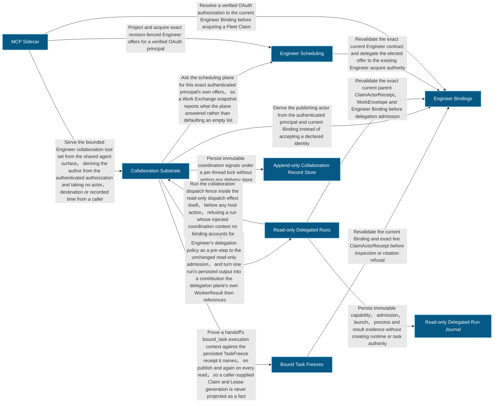
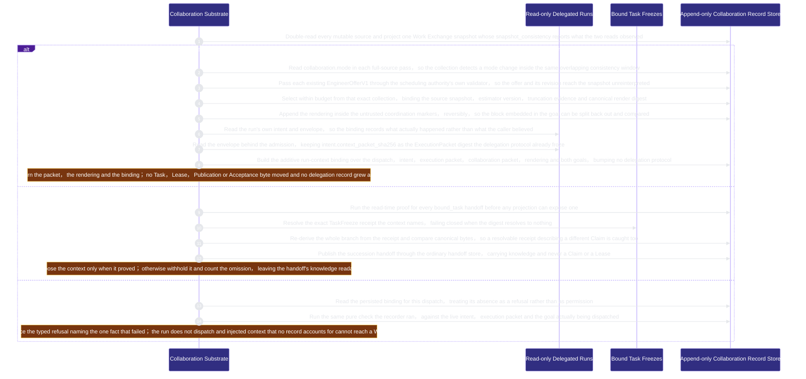
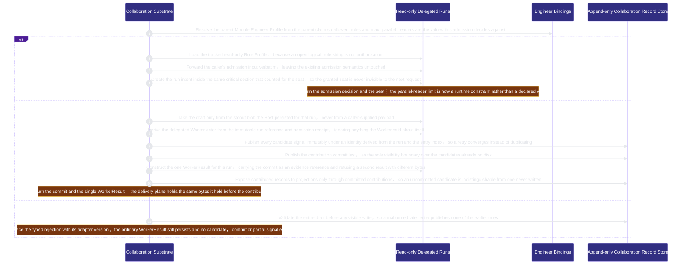
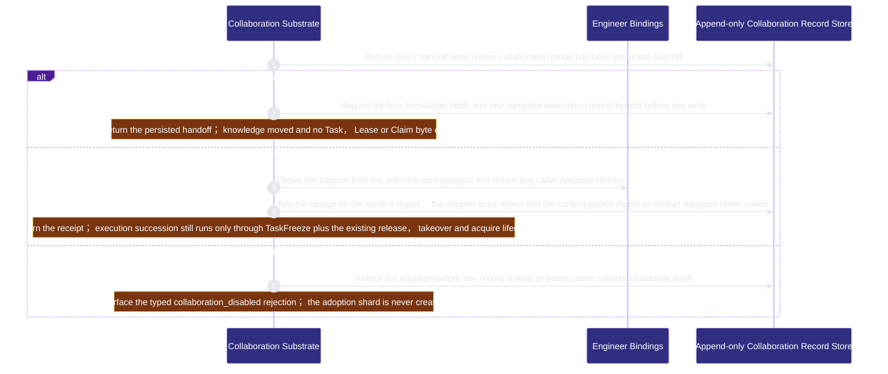
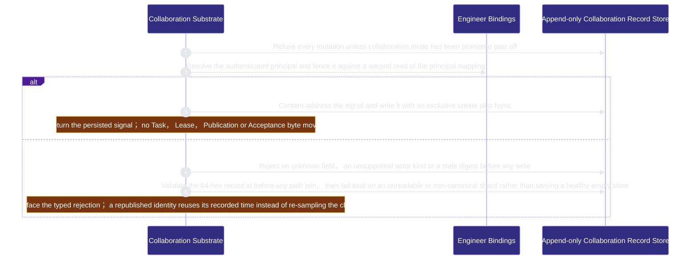

# runtime-harness/collaboration 架構文檔

<!-- BEGIN ARCHCONTEXT:generated target="projection_target.entity.capability-runtime-harness-collaboration" sourceDigest="sha256:973d35624db31c3aa05e5e80286f0dca2353df48cd031d45264fbf478dbce240" rendererVersion="archcontext.docs-renderer/v4" outputDigest="sha256:a0c4f25001b2f5308a3ceb0fea7a4777ac5062c38a161aa07f61f34128ccae86" -->
> **狀態**:`active`
> **Capability ID**:`capability.runtime-harness.collaboration`(kind `capability`)
> **Matched Prefixes**:`src/core/collaboration/**`、`src/effects/collaboration/**`、`src/cli/commands/collaboration.ts`
> **Local Contracts**:`AGENTS.md`、`CLAUDE.md`
> **事實優先級**:倉庫當前狀態 > 本文檔機器區 > 本文檔人工區。機器區(引言、§1、§2)由 ArchContext 從架構模型與源碼度量投影生成,手改會在下次投影被覆蓋。本文檔不記錄出處;本次投影所驗證的 commit 見 `docs/architecture/.projection-manifest.json`。

Publishes append-only coordination signals, work-state handoffs, non-exclusive adoption receipts and delegated-Worker contribution commits over one shared create-once store substrate, enforces the parent Engineer's delegation policy at admission time as a pre-step to the existing read-only delegation, and reads that substrate back into one collaborative Work Exchange snapshot and one bounded context packet whose delivery into a delegated run is fenced by a required run-context binding, with Host-derived identity and recorded time and zero Task, Lease, Publication or Acceptance authority.

## 1. P1:能力架構地圖

### 1.1 架構圖

- Proof: `proven` (`sha256:f1ceb5d4280caa61ca532e0e31dbe615c64cc2d17cfb4fb5290795070901f982`).
- Semantic nodes: `8`; declared relations: `13`.

### 1.2 模組職責表

| 宣告入口 | 錨點 | 職責 |
| --- | --- | --- |
| `entrypoint.collaboration.publish` | `src/effects/collaboration/signal-store.ts#publishCoordinationSignal` | `sink.collaboration.mutation-gate` → `src/effects/collaboration/feature-flag.ts#assertCollaborationMutationEnabled`、`sink.collaboration.signal-schema` → `src/core/collaboration/signal.ts#buildCoordinationSignal` |
| `entrypoint.collaboration.actor-derivation` | `src/effects/collaboration/actor.ts#resolveModuleEngineerActor` | `sink.collaboration.authenticated-principal` → `src/effects/engineers/principal.ts#resolveEngineerPrincipal` |
| `entrypoint.collaboration.read` | `src/effects/collaboration/record-store.ts#readCollaborationRecord` | `sink.collaboration.record-path-guard` → `src/effects/collaboration/record-store.ts#collaborationRecordPath` |
| `entrypoint.collaboration.durable-publish` | `src/effects/collaboration/record-store.ts#publishCollaborationRecordDurably` | `sink.collaboration.staging-name` → `src/effects/collaboration/record-store.ts#collaborationStagingName` |
| `entrypoint.collaboration.handoff-publish` | `src/effects/collaboration/handoff-store.ts#publishWorkStateHandoff` | `sink.collaboration.handoff-mutation-gate` → `src/effects/collaboration/feature-flag.ts#assertCollaborationMutationEnabled`、`sink.collaboration.handoff-schema` → `src/core/collaboration/handoff.ts#buildWorkStateHandoff` |
| `entrypoint.collaboration.handoff-adoption` | `src/effects/collaboration/adoption-store.ts#adoptWorkStateHandoff` | `sink.collaboration.adoption-mutation-gate` → `src/effects/collaboration/feature-flag.ts#assertCollaborationMutationEnabled`、`sink.collaboration.adoption-actor` → `src/effects/collaboration/actor.ts#resolveCollaborationActor` |
| `entrypoint.collaboration.adoption-identity` | `src/core/collaboration/adoption.ts#handoffAdoptionReceiptId` | `sink.collaboration.adoption-triple` → `src/core/collaboration/adoption.ts#deriveHandoffAdoptionReceiptId` |
| `entrypoint.collaboration.admission-bridge` | `src/effects/collaboration/admission-bridge.ts#admitCollaborationDelegation` | `sink.collaboration.parent-delegation-policy` → `src/effects/engineers/profile-store.ts#loadEngineerProfile`、`sink.collaboration.tracked-role-profile` → `src/effects/engineers/delegated-run-store.ts#loadLogicalReadOnlyRoleProfile` |
| `entrypoint.collaboration.admission-window` | `src/effects/collaboration/admission-bridge.ts#admitInsideWindow` | `sink.collaboration.existing-admission` → `src/effects/engineers/delegated-run-store.ts#admitReadOnlyDelegation`、`sink.collaboration.seat-creation` → `src/effects/engineers/delegated-run-store.ts#prepareDelegatedRun` |
| `entrypoint.collaboration.contribution-collect` | `src/effects/collaboration/contribution-collector.ts#collectCollaborationContribution` | `sink.collaboration.persisted-provider-output` → `src/effects/collaboration/provider-output-adapter.ts#readContributionDraftFromPersistedOutput`、`sink.collaboration.delegated-worker-actor` → `src/effects/collaboration/actor.ts#resolveDelegatedWorkerActor` |
| `entrypoint.collaboration.contribution-publish` | `src/effects/collaboration/contribution-collector.ts#publishContribution` | `sink.collaboration.contribution-candidate` → `src/effects/collaboration/signal-store.ts#publishCoordinationSignal`、`sink.collaboration.contribution-commit` → `src/core/collaboration/contribution.ts#buildCollaborationContributionCommit`、`sink.collaboration.single-worker-result` → `src/effects/engineers/delegated-run-store.ts#collectDelegatedRunResult` |
| `entrypoint.collaboration.provider-output` | `src/effects/collaboration/provider-output-adapter.ts#parseContributionDraftFromStdout` | `sink.collaboration.draft-schema` → `src/core/collaboration/contribution.ts#validateCollaborationContributionDraft` |
| `entrypoint.collaboration.contribution-visibility` | `src/effects/collaboration/contribution-store.ts#listContributedSignalIds` | `sink.collaboration.committed-only` → `src/effects/collaboration/contribution-store.ts#listCollaborationContributionCommits` |
| `entrypoint.collaboration.succession` | `src/effects/collaboration/succession.ts#resolveBoundTaskSuccession` | `sink.collaboration.freeze-receipt-read` → `src/effects/engineers/task-freeze-store.ts#readTaskFreezeReceipt`、`sink.collaboration.freeze-derived-context` → `src/effects/collaboration/succession.ts#boundTaskExecutionContext` |
| `entrypoint.collaboration.succession-publish` | `src/effects/collaboration/succession.ts#publishBoundTaskSuccessionHandoff` | `sink.collaboration.succession-handoff-publish` → `src/effects/collaboration/handoff-store.ts#publishWorkStateHandoff` |
| `entrypoint.collaboration.work-exchange` | `src/effects/collaboration/work-exchange.ts#collectCollaborativeWorkExchange` | `sink.collaboration.exchange-projection` → `src/core/collaboration/work-exchange.ts#buildCollaborativeWorkExchangeSnapshot` |
| `entrypoint.collaboration.exchange-source-read` | `src/effects/collaboration/work-exchange.ts#readAllSources` | `sink.collaboration.exchange-mode` → `src/effects/collaboration/feature-flag.ts#readCollaborationMode` |
| `entrypoint.collaboration.execution-context-proof` | `src/effects/collaboration/work-exchange.ts#proveExecutionContexts` | `sink.collaboration.read-time-succession-proof` → `src/effects/collaboration/succession.ts#resolveBoundTaskSuccession` |
| `entrypoint.collaboration.exchange-offer-projection` | `src/core/collaboration/work-exchange.ts#projectExistingEngineerOffer` | `sink.collaboration.existing-offer-authority` → `src/core/engineers/scheduling.ts#validateEngineerOffer` |
| `entrypoint.collaboration.context-delivery` | `src/effects/collaboration/context-delivery.ts#deliverCollaborationContext` | `sink.collaboration.context-packet-build` → `src/core/collaboration/context-packet.ts#buildCollaborationContextPacket`、`sink.collaboration.untrusted-goal-composition` → `src/core/collaboration/run-binding.ts#composeCollaborationGoal` |
| `entrypoint.collaboration.run-context-read` | `src/effects/collaboration/context-delivery.ts#readLiveRun` | `sink.collaboration.live-run-status` → `src/effects/engineers/delegated-run-store.ts#readDelegatedRunStatus`、`sink.collaboration.live-run-envelope` → `src/effects/engineers/delegated-run-store.ts#readDelegationEnvelope` |
| `entrypoint.collaboration.run-binding-record` | `src/effects/collaboration/context-delivery.ts#recordCollaborationRunContextBinding` | `sink.collaboration.run-binding-build` → `src/core/collaboration/run-binding.ts#buildCollaborationRunContextBinding` |
| `entrypoint.collaboration.dispatch-fence` | `src/effects/collaboration/context-delivery.ts#assertCollaborationDispatchBinding` | `sink.collaboration.binding-fence-check` → `src/core/collaboration/run-binding.ts#checkCollaborationRunContextBinding`、`sink.collaboration.persisted-binding-read` → `src/effects/collaboration/context-delivery.ts#readCollaborationRunContextBinding` |
| `entrypoint.collaboration.dispatch-guard` | `src/effects/collaboration/context-delivery.ts#fenceCollaborationDispatch` | `sink.collaboration.dispatch-intent` → `src/effects/collaboration/context-delivery.ts#collaborationDispatchIntent`、`sink.collaboration.dispatch-binding-assert` → `src/effects/collaboration/context-delivery.ts#assertCollaborationDispatchBinding` |
| `entrypoint.collaboration.agent-surface-read` | `src/effects/collaboration/agent-surface.ts#collect` | `sink.collaboration.surface-exchange-collect` → `src/effects/collaboration/work-exchange.ts#collectCollaborativeWorkExchange` |
| `entrypoint.collaboration.agent-surface-offers` | `src/effects/collaboration/agent-surface.ts#readExecutionOffersFor` | `sink.collaboration.surface-offer-authority` → `src/effects/engineers/scheduling.ts#collectEngineerOffers` |
| `entrypoint.collaboration.agent-surface-publish` | `src/effects/collaboration/agent-surface.ts#collaborationSignalPost` | `sink.collaboration.surface-signal-publish` → `src/effects/collaboration/signal-store.ts#publishCoordinationSignal` |
| `entrypoint.collaboration.agent-surface-publish` | `src/effects/collaboration/agent-surface.ts#collaborationHandoffPublish` | `sink.collaboration.surface-handoff-publish` → `src/effects/collaboration/handoff-store.ts#publishWorkStateHandoff` |
| `entrypoint.collaboration.agent-surface-publish` | `src/effects/collaboration/agent-surface.ts#collaborationHandoffAdopt` | `sink.collaboration.surface-handoff-adopt` → `src/effects/collaboration/adoption-store.ts#adoptWorkStateHandoff` |
| `entrypoint.collaboration.agent-surface-packet` | `src/effects/collaboration/agent-surface.ts#collaborationPacketBuild` | `sink.collaboration.surface-mutation-gate` → `src/effects/collaboration/feature-flag.ts#assertCollaborationMutationEnabled`、`sink.collaboration.surface-context-delivery` → `src/effects/collaboration/context-delivery.ts#deliverCollaborationContext` |
| `entrypoint.collaboration.command-family` | `src/cli/commands/collaboration.ts#exchangeAction` | `sink.collaboration.command-exchange` → `src/effects/collaboration/agent-surface.ts#collaborationExchangeView` |
| `entrypoint.collaboration.command-family` | `src/cli/commands/collaboration.ts#postAction` | `sink.collaboration.command-signal-post` → `src/effects/collaboration/agent-surface.ts#collaborationSignalPost` |
| `entrypoint.collaboration.command-family` | `src/cli/commands/collaboration.ts#packetBuildAction` | `sink.collaboration.command-packet-build` → `src/effects/collaboration/agent-surface.ts#collaborationPacketBuild` |
| `entrypoint.collaboration.shared-mechanics` | `src/core/collaboration/signal.ts#buildCoordinationSignal` | `sink.collaboration.actor-union` → `src/core/collaboration/common.ts#validateCollaborationActorRef` |

### 1.3 規模信號

- 規模量級:`20–50` 個文件 / `5000–10000` 行
- 匹配前綴:`src/core/collaboration/**`、`src/effects/collaboration/**`、`src/cli/commands/collaboration.ts`
- 推導:掃描 `source.include` 減 `source.exclude`,跳過 `.git/` 與 `node_modules/`,再按 1–2–5 階梯分桶。精確計數不入本文檔:量級足以回答「這個能力有多大」,而逐行計數會讓覆蓋範圍內任何一次源碼改動都改寫本文檔。

### 1.4 依賴邊界

出向關係:

- `calls` → `capability.runtime-harness.bound-task-freezes` — Prove a handoff's bound_task execution context against the persisted TaskFreeze receipt it names, on publish and again on every read, so a caller-supplied Claim and Lease generation is never projected as a fact
- `calls` → `capability.runtime-harness.delegated-runs` — Enforce the parent Engineer's delegation policy as a pre-step to the unchanged read-only admission, and turn one run's persisted output into a contribution the delegation plane's own WorkerResult then references
- `calls` → `capability.runtime-harness.engineer-bindings` — Derive the publishing actor from the authenticated principal and current Binding instead of accepting a declared identity
- `calls` → `capability.runtime-harness.engineer-scheduling` — Ask the scheduling plane for this exact authenticated principal's own offers, so a Work Exchange snapshot reports what the plane answered rather than defaulting an empty list
- `calls` → `component.collaboration.primary` — Persist immutable coordination signals under a per-thread lock without writing any delivery store

入向關係:

- `calls` ← `capability.runtime-harness.delegated-runs` — Run the collaboration dispatch fence inside the read-only dispatch effect itself, before any host action, refusing a run whose injected coordination context no binding accounts for
- `depends_on` ← `capability.runtime-harness.development-campaign` — Reserve the existing fenced delegated-run boundary as the only later campaign dispatch path
- `calls` ← `capability.runtime-harness.mcp-sidecar` — Serve the bounded Engineer collaboration tool set from the shared agent surface, deriving the author from the authenticated authorization and taking no actor, destination or recorded time from a caller

## 2. P2:端到端數據流

> **Proof**: `proven` (`sha256:f1ceb5d4280caa61ca532e0e31dbe615c64cc2d17cfb4fb5290795070901f982`); selectors `48/48`.

```mermaid
%%{init: {"theme":"base","themeVariables":{"background":"#0d1117","actorBkg":"#312e81","actorBorder":"#c4b5fd","actorTextColor":"#ffffff","signalColor":"#e5e7eb","signalTextColor":"#e5e7eb","labelBoxBkgColor":"#4c1d95","labelBoxBorderColor":"#c4b5fd","labelTextColor":"#ffffff","noteBkgColor":"#78350f","noteBorderColor":"#fcd34d","noteTextColor":"#ffffff","sequenceNumberColor":"#ffffff"}}}%%
sequenceDiagram
  autonumber
  participant p2_collaboration_50c48bca as Collaboration Substrate
  participant p2_collaboration_store_5c827af5 as Append-only Collaboration Record Store
  participant p2_engineer_mcp_97bc42c0 as MCP Sidecar
  participant p2_delegated_runs_6de9843b as Read-only Delegated Runs
  participant p2_scheduling_authority_0fce7315 as Engineer Scheduling
  participant p2_delegated_run_store_75dc2bad as Read-only Delegated Run Journal
  p2_collaboration_50c48bca->>p2_scheduling_authority_0fce7315: Ask the scheduling plane what this exact authenticated principal could pick up， so an empty offer list means the plane answered rather than that nobody asked
  alt A Module Engineer reads the exchange and publishes bounded records whose author the Host derived， with every payload marked untrusted
  p2_collaboration_50c48bca->>p2_collaboration_store_5c827af5: Collect the same double-read exchange the Host reads， so the surface adds no cache and no second answer that could disagree with snapshot_sha256
  p2_collaboration_50c48bca->>p2_collaboration_store_5c827af5: Serve the command family from the shared surface， so the CLI restates none of the actor， destination or marking rules
  p2_engineer_mcp_97bc42c0->>p2_collaboration_50c48bca: Serve the same surface to the closed Engineer tool inventory， which carries no arbitrary write， generic shell， acquire， publication， acceptance or merge tool
  p2_collaboration_50c48bca->>p2_collaboration_store_5c827af5: Publish through the store that derives the author from the authorization， with no parameter anywhere that would accept a caller-declared actor
  p2_collaboration_50c48bca->>p2_collaboration_store_5c827af5: Reject an undeclared key on the wire before publishing， so an identity claim is refused with the field named rather than silently dropped
  p2_collaboration_50c48bca->>p2_collaboration_store_5c827af5: Record adoption as an identity statement that grants no Task， Claim or Lease， so distinct adopters never exclude one another
    Note over p2_collaboration_50c48bca: Return the payload with its mode and its untrusted-coordination marking； no Task， Lease， Publication or Acceptance byte moved
  else A packet build is refused while collaboration.mode is off， and reads keep answering so the flag stays observable
  p2_collaboration_50c48bca->>p2_collaboration_store_5c827af5: Apply the mutation gate at the first boundary a caller can trigger a packet write from， since C6 built delivery as a Host step inside an already-gated round
  p2_collaboration_50c48bca->>p2_collaboration_store_5c827af5: Return C6's rendering verbatim with its untrusted markers intact， rather than re-emitting them from a second producer
    Note over p2_collaboration_50c48bca: Surface the typed refusal with the flag's own reason； a repository that has not opted in cannot grow collaboration state through this surface
  else A dispatch carrying injected coordination context that no binding accounts for is refused before the host action
  p2_collaboration_50c48bca->>p2_collaboration_store_5c827af5: Decide from Host-owned state whether this dispatch is a collaboration dispatch， treating a persisted binding and an untrusted marker in the goal as equally sufficient
  p2_collaboration_50c48bca->>p2_collaboration_store_5c827af5: Re-run the whole binding check against the live run for a collaboration dispatch， and let a delegation-only run through untouched
  p2_delegated_runs_6de9843b->>p2_delegated_run_store_75dc2bad: Call the one exported dispatch from the command adapter， which carries no collaboration pre-step of its own and no second opinion about which runs need a binding
  p2_delegated_runs_6de9843b->>p2_collaboration_50c48bca: Run the fence as the first statement under the dispatch lock， so no caller reaches the host action by forgetting a pre-step and the fence decides on the same locked view the host action is taken from
    Note over p2_delegated_runs_6de9843b: Surface the typed refusal naming the one fact that failed； injected context that no record accounts for cannot reach a Worker
  end
```

<!-- END ARCHCONTEXT:generated target="projection_target.entity.capability-runtime-harness-collaboration" -->

## 3. P3:設計決策與不變量

### 兩個平面,一個方向

交付平面(Work Graph → EngineerOffer → Claim/Lease → WorkEnvelope → Publication
→ Acceptance)是權威。協作平面只讀它,永不寫它,也沒有一條反向邊。這條邊界由
C0 的 D1 凍結,由 `tests/unit/collaboration-authority-baseline.test.ts` 守住:
封閉掃描證明本能力不在五個被凍結的平面上,另一條斷言證明任何交付平面模組都沒有
import 協作模組。

Child PRD A 記的核心風險是「協作 store 退化成第二個調度器」。防線不是文檔約定,
而是這條 import 方向斷言加上 store 本身零交付寫入的 before/after digest 證據。

### 記錄時間為什麼是一個判別聯合

signal 的 `created_at` 由 Host 派生,且對重試穩定。兩種來源各自對應一條真實的
provenance 鏈:delegated 貢獻取該次運行精確的持久化觀測時間,直接發布在第一次
idempotency 事件裡凍結時鐘。用一組可空欄位表達會允許「兩個都為 null」這種無意義
狀態,所以它是判別聯合。

真正的壓力點在重試路徑:先採樣時鐘再查存在性,會讓一次冪等重試看起來像 payload
衝突。store 因此只在建檔那條分支讀時鐘,比較分支一律用已持久化的值重建候選。

### 身份只能由服務端派生

publish 的入參裡根本沒有 actor 欄位。actor 由 `resolveEngineerPrincipal()` 從
authenticated principal 推導,再對 principal mapping 做第二次讀取,兩次不一致就
fail closed。呼叫方自述的身份不是被忽略,而是無處可寫。

P0 的 wire union 只有 `module_engineer` 與 `delegated_worker`,因為只有這兩類有
不可變的服務端 provenance。`human_operator` 與 `native_subagent` 不進 union,也
不留佔位分支——留下的佔位分支遲早會被填上一個沒有 provenance 的值。

### supersede 的 lineage 邊界

append-only 的修訂只能是 supersede,而 supersede 只能在同一個 actor lineage 內。
lineage 對 Module Engineer 取 `engineer_id`,對 delegated Worker 取
`worker_run_ref_sha256`:重新綁定是同一個持久 Engineer 的換屆,兩次 delegated run
則是兩個參與者。

### 10x 規模下先壞的地方

per-thread lock 讓同一條 thread 的寫入串行。單一 thread 上的高頻寫入會先撞到鎖等待,
而不是磁碟。thread 之間互不阻塞,所以擴展方向是 thread 的數量而不是單 thread 的吞吐。
`listCoordinationSignals()` 是全量掃描,C2 的投影需要它時要綁定來源集合的 digest,
且快取永遠不能成為權威。

### 不變量

- 協作平面對 Task、Lease、Publication、Acceptance 的字節影響為 0。
- 每條 signal 一個不可變檔案,身份級原子寫,同 id 同 payload 冪等、不同 payload 顯式衝突。
- store 不可讀時 fail loud,絕不退化成健康空集。
- `collaboration.mode` 預設 `off`,升級順序 `off -> shadow -> active`,不跳級。
- `src/core/collaboration/common.ts` 在 C1 之後凍結,C2-C9 只消費不修改。

## 4. 歷史決策記錄(append-only)

| 日期 | 決策 | 依據 |
| --- | --- | --- |
| 2026-08-29 | 建立 `capability.runtime-harness.collaboration`,協作平面與交付平面分離 | `docs/researches/20260829-c0-collaboration-two-plane-authority-freeze.md` D1-D12 |
| 2026-08-29 | `ArtifactRefV1` 複用 `WorkerResultV1.evidence_refs` 的同一個校驗器,不引入第二個等價引用類型 | D8;`src/core/engineers/delegation.ts` 的 `validateWorkerEvidenceRefs()` |
| 2026-08-29 | store 根、鎖策略與 canonical JSON 複用既有 `repo-harness/<domain>/v1` 慣例與既有鎖原語,不寫第二個序列化器 | D9 |

## Optimization Backlog

- C2 的 thread/hotspot 投影如果需要快取,快取必須綁定來源集合的 digest 並在不匹配時重算。
- 目前 `listCoordinationSignals()` 讀全量;真實 signal 量級由 C9 的 canary 測出來之後再決定要不要分片。
