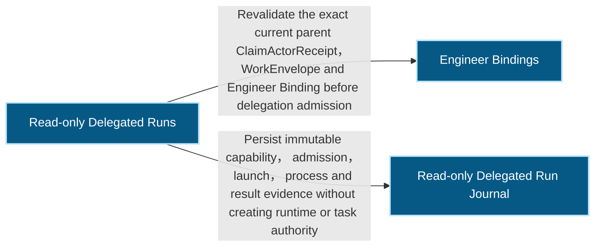
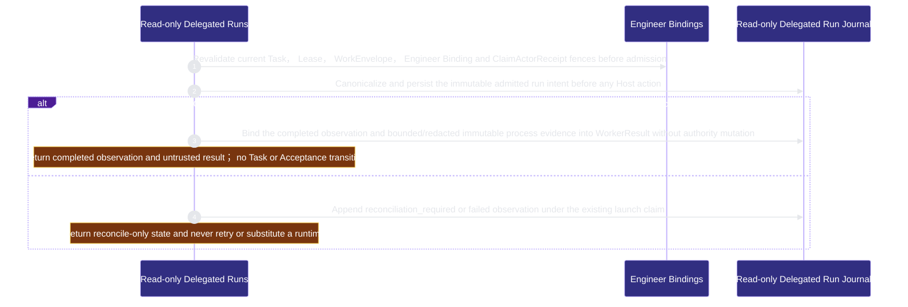

# runtime-harness/delegated-runs 架構文檔

<!-- BEGIN ARCHCONTEXT:generated target="projection_target.entity.capability-runtime-harness-delegated-runs" sourceDigest="sha256:9a17b11dee07f93c3cda04f994717a40f5330066c4dae95e91d4c69cd53cc712" rendererVersion="archcontext.docs-renderer/v4" outputDigest="sha256:76b4aff3968ba4aa46f6981e195b859b576308b02b1a4cc66d5647caca734fc9" -->
> **狀態**:`active`
> **Capability ID**:`capability.runtime-harness.delegated-runs`(kind `capability`)
> **Matched Prefixes**:`src/core/engineers/delegation.ts`、`src/effects/engineers/delegated-run-store.ts`、`src/cli/commands/delegation.ts`
> **Local Contracts**:`AGENTS.md`、`CLAUDE.md`
> **事實優先級**:倉庫當前狀態 > 本文檔機器區 > 本文檔人工區。機器區(引言、§1、§2)由 ArchContext 從架構模型與源碼度量投影生成,手改會在下次投影被覆蓋。本文檔不記錄出處;本次投影所驗證的 commit 見 `docs/architecture/.projection-manifest.json`。

Admits one logical Role Profile against current Engineer authority and journals at most one Codex CLI read-only host action as untrusted evidence.

## 1. P1:能力架構地圖

### 1.1 架構圖

- Proof: `proven` (`sha256:ba1eee35301496400c16d4811f5d155bffb67cda455acdb73e7ffae965875c0c`).
- Semantic nodes: `3`; declared relations: `2`.

### 1.2 模組職責表

| 宣告入口 | 錨點 | 職責 |
| --- | --- | --- |
| `entrypoint.delegated-runs.dispatch-command` | `src/cli/commands/delegation.ts#dispatchDelegatedRunCommand` | `sink.delegated-runs.dispatch-host-action` → `src/effects/engineers/delegated-run-store.ts#dispatchDelegatedRun` |
| `entrypoint.delegated-runs.dispatch-effect` | `src/effects/engineers/delegated-run-store.ts#dispatchDelegatedRun` | `sink.delegated-runs.collaboration-dispatch-fence` → `src/effects/collaboration/context-delivery.ts#fenceCollaborationDispatch` |
| `entrypoint.delegated-runs.parent-authority` | `src/effects/engineers/delegated-run-store.ts#validateDelegationParent` | `sink.delegated-runs.parent-authority` → `src/effects/engineers/claim-actor-store.ts#validateClaimActorReceiptLive` |
| `entrypoint.delegated-runs.intent` | `src/effects/engineers/delegated-run-store.ts#persistIntent` | `sink.delegated-runs.intent-schema` → `src/core/engineers/delegation.ts#canonicalDelegatedRunIntentBytes` |
| `entrypoint.delegated-runs.observation` | `src/effects/engineers/delegated-run-store.ts#appendObservation` | `sink.delegated-runs.observation` → `src/core/engineers/delegation.ts#buildDelegatedRunObservation` |
| `entrypoint.delegated-runs.result` | `src/effects/engineers/delegated-run-store.ts#persistResult` | `sink.delegated-runs.worker-result` → `src/core/engineers/delegation.ts#canonicalWorkerResultBytes` |

### 1.3 規模信號

- 規模量級:`2–5` 個文件 / `2000–5000` 行
- 匹配前綴:`src/core/engineers/delegation.ts`、`src/effects/engineers/delegated-run-store.ts`、`src/cli/commands/delegation.ts`
- 推導:掃描 `source.include` 減 `source.exclude`,跳過 `.git/` 與 `node_modules/`,再按 1–2–5 階梯分桶。精確計數不入本文檔:量級足以回答「這個能力有多大」,而逐行計數會讓覆蓋範圍內任何一次源碼改動都改寫本文檔。

### 1.4 依賴邊界

出向關係:

- `calls` → `capability.runtime-harness.collaboration` — Run the collaboration dispatch fence inside the read-only dispatch effect itself, before any host action, refusing a run whose injected coordination context no binding accounts for
- `calls` → `capability.runtime-harness.engineer-bindings` — Revalidate the exact current parent ClaimActorReceipt, WorkEnvelope and Engineer Binding before delegation admission
- `calls` → `component.delegated-runs.primary` — Persist immutable capability, admission, launch, process and result evidence without creating runtime or task authority

入向關係:

- `calls` ← `capability.runtime-harness.collaboration` — Enforce the parent Engineer's delegation policy as a pre-step to the unchanged read-only admission, and turn one run's persisted output into a contribution the delegation plane's own WorkerResult then references
- `calls` ← `capability.runtime-harness.verified-context` — Revalidate existing immutable WorkerRunRef, process receipt, WorkerResult and evidence blobs as untrusted checkpoint inputs

## 2. P2:端到端數據流

> **Proof**: `proven` (`sha256:ba1eee35301496400c16d4811f5d155bffb67cda455acdb73e7ffae965875c0c`); selectors `4/4`.

<!-- END ARCHCONTEXT:generated target="projection_target.entity.capability-runtime-harness-delegated-runs" -->

## 3. P3:設計決策與不變量

## 4. 歷史決策記錄(append-only)

## Optimization Backlog
