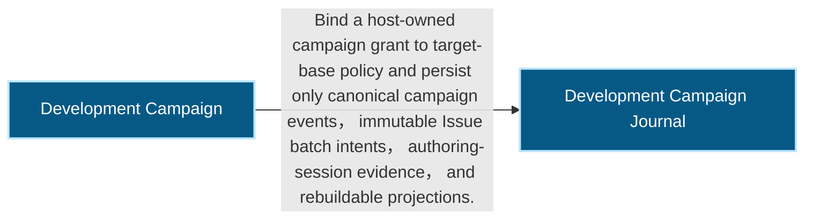
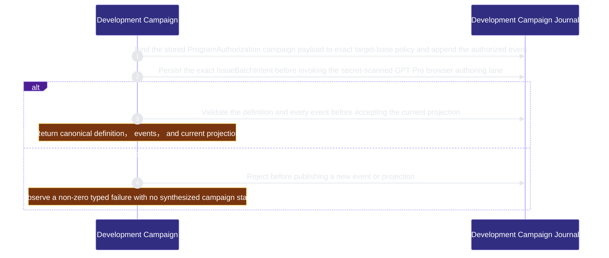

# runtime-harness/development-campaign 架構文檔

<!-- BEGIN ARCHCONTEXT:generated target="projection_target.entity.capability-runtime-harness-development-campaign" sourceDigest="sha256:e821c9e6e681ff519632fc2b3f385e0d78005fd6d46cf098f0657cf7fb6ae9cf" rendererVersion="archcontext.docs-renderer/v4" outputDigest="sha256:564ee2aced00ea97c72f8993668751ad2eba769dca74ae0575a2ddfe67abbc40" -->
> **狀態**:`active`
> **Capability ID**:`capability.runtime-harness.development-campaign`(kind `capability`)
> **Matched Prefixes**:`src/core/automation/campaign-browser-session.ts`、`src/core/automation/campaign-fresh-audit.ts`、`src/effects/automation/campaign-fresh-audit.ts`、`src/core/automation/campaign-closeout.ts`、`src/effects/automation/campaign-closeout.ts`、`src/effects/automation/campaign-closeout-provider.ts`、`src/effects/automation/campaign-not-planned.ts`、`src/core/automation/campaign-runtime.ts`、`src/effects/automation/campaign-runtime.ts`、`src/effects/automation/campaign-recovery.ts`、`src/effects/automation/campaign-revision-admission.ts`、`src/effects/automation/campaign-worker.ts`、`src/core/automation/campaign-planning.ts`、`src/effects/automation/campaign-planning.ts`、`src/effects/automation/campaign-planning-proof.ts`、`src/effects/automation/campaign-planning-store.ts`、`src/core/automation/development-campaign.ts`、`src/core/automation/issue-batch.ts`、`src/core/automation/connector-challenge.ts`、`src/core/automation/issue-batch-adoption.ts`、`src/effects/automation/issue-batch-adoption.ts`、`src/effects/automation/issue-batch-publication.ts`、`src/core/automation/issue-batch-reconcile.ts`、`src/effects/automation/development-campaign-policy.ts`、`src/effects/automation/development-campaign-store.ts`、`src/effects/automation/issue-batch-store.ts`、`src/effects/automation/issue-batch-observer.ts`、`src/effects/automation/campaign-step.ts`、`src/effects/automation/gpt-pro-issue-authoring.ts`、`src/cli/commands/campaign.ts`
> **Local Contracts**:`AGENTS.md`、`CLAUDE.md`
> **事實優先級**:倉庫當前狀態 > 本文檔機器區 > 本文檔人工區。機器區(引言、§1、§2)由 ArchContext 從架構模型與源碼度量投影生成,手改會在下次投影被覆蓋。本文檔不記錄出處;本次投影所驗證的 commit 見 `docs/architecture/.projection-manifest.json`。

Owns the host-authorized, policy-bounded campaign journal that will route externally authored repair Issues into existing execution authorities without replacing them.

## 1. P1:能力架構地圖

### 1.1 架構圖

- Proof: `proven` (`sha256:8db6dc213bf29675bbc9b49fdf4c80696ea174aeed829f4b8adcb46cc1b6da92`).
- Semantic nodes: `2`; declared relations: `1`.

### 1.2 模組職責表

| 宣告入口 | 錨點 | 職責 |
| --- | --- | --- |
| `entrypoint.development-campaign.lifecycle` | `src/cli/commands/campaign.ts#buildCampaignCommand` | `sink.development-campaign.fresh-audit` → `src/effects/automation/campaign-fresh-audit.ts#runCampaignFreshAudit` |
| `entrypoint.development-campaign.lifecycle` | `src/cli/commands/campaign.ts#runCampaignStart` | `sink.development-campaign.create` → `src/effects/automation/development-campaign-store.ts#createDevelopmentCampaign` |
| `entrypoint.development-campaign.lifecycle` | `src/cli/commands/campaign.ts#runCampaignTransition` | `sink.development-campaign.append` → `src/effects/automation/development-campaign-store.ts#appendDevelopmentCampaignEvent` |
| `entrypoint.development-campaign.lifecycle` | `src/cli/commands/campaign.ts#runCampaignStatus` | `sink.development-campaign.status` → `src/effects/automation/development-campaign-store.ts#readDevelopmentCampaignStatus` |
| `entrypoint.development-campaign.lifecycle` | `src/cli/commands/campaign.ts#runCampaignAuthor` | `sink.development-campaign.issue-authoring-start` → `src/effects/automation/gpt-pro-issue-authoring.ts#startIssueBatchAuthoring` |
| `entrypoint.development-campaign.lifecycle` | `src/cli/commands/campaign.ts#runCampaignAuthorFollowup` | `sink.development-campaign.issue-authoring-followup` → `src/effects/automation/gpt-pro-issue-authoring.ts#continueIssueBatchAuthoring` |
| `entrypoint.development-campaign.lifecycle` | `src/cli/commands/campaign.ts#runCampaignHeartbeatStep` | `sink.development-campaign.step` → `src/effects/automation/campaign-step.ts#runCampaignStep`、`sink.development-campaign.planning` → `src/effects/automation/campaign-planning.ts#runCampaignPlanningStep` |
| `entrypoint.development-campaign.lifecycle` | `src/cli/commands/campaign.ts#runCampaignAdopt` | `sink.development-campaign.adopt` → `src/effects/automation/issue-batch-adoption.ts#adoptIssueBatch` |

### 1.3 規模信號

- 規模量級:`20–50` 個文件 / `5000–10000` 行
- 匹配前綴:`src/core/automation/campaign-browser-session.ts`、`src/core/automation/campaign-fresh-audit.ts`、`src/effects/automation/campaign-fresh-audit.ts`、`src/core/automation/campaign-closeout.ts`、`src/effects/automation/campaign-closeout.ts`、`src/effects/automation/campaign-closeout-provider.ts`、`src/effects/automation/campaign-not-planned.ts`、`src/core/automation/campaign-runtime.ts`、`src/effects/automation/campaign-runtime.ts`、`src/effects/automation/campaign-recovery.ts`、`src/effects/automation/campaign-revision-admission.ts`、`src/effects/automation/campaign-worker.ts`、`src/core/automation/campaign-planning.ts`、`src/effects/automation/campaign-planning.ts`、`src/effects/automation/campaign-planning-proof.ts`、`src/effects/automation/campaign-planning-store.ts`、`src/core/automation/development-campaign.ts`、`src/core/automation/issue-batch.ts`、`src/core/automation/connector-challenge.ts`、`src/core/automation/issue-batch-adoption.ts`、`src/effects/automation/issue-batch-adoption.ts`、`src/effects/automation/issue-batch-publication.ts`、`src/core/automation/issue-batch-reconcile.ts`、`src/effects/automation/development-campaign-policy.ts`、`src/effects/automation/development-campaign-store.ts`、`src/effects/automation/issue-batch-store.ts`、`src/effects/automation/issue-batch-observer.ts`、`src/effects/automation/campaign-step.ts`、`src/effects/automation/gpt-pro-issue-authoring.ts`、`src/cli/commands/campaign.ts`
- 推導:掃描 `source.include` 減 `source.exclude`,跳過 `.git/` 與 `node_modules/`,再按 1–2–5 階梯分桶。精確計數不入本文檔:量級足以回答「這個能力有多大」,而逐行計數會讓覆蓋範圍內任何一次源碼改動都改寫本文檔。

### 1.4 依賴邊界

出向關係:

- `depends_on` → `capability.runtime-harness.automation-budget` — Consume the existing host-owned ProgramAuthorizationV1 grant identity without minting or widening automation authority
- `depends_on` → `capability.runtime-harness.collaboration` — Reserve the existing fenced delegated-run boundary as the only later campaign dispatch path
- `depends_on` → `capability.runtime-harness.engineer-scheduling` — Reserve the existing Work Graph and acquire chain as the only later campaign execution path
- `depends_on` → `capability.runtime-harness.external-source-intake` — Require the established external Issue intake policy before campaign startup without acquiring provider mutation authority
- `depends_on` → `capability.runtime-harness.integration-acceptance` — Observe existing acceptance and publication projections later without creating a second acceptance or merge authority
- `calls` → `component.development-campaign.journal` — Bind a host-owned campaign grant to target-base policy and persist only canonical campaign events, immutable Issue batch intents, authoring-session evidence, and rebuildable projections.

入向關係:

- 無。

## 2. P2:端到端數據流

> **Proof**: `proven` (`sha256:8db6dc213bf29675bbc9b49fdf4c80696ea174aeed829f4b8adcb46cc1b6da92`); selectors `3/3`.

<!-- END ARCHCONTEXT:generated target="projection_target.entity.capability-runtime-harness-development-campaign" -->

## 3. P3:設計決策與不變量

### Issue batch observation

`campaign step --campaign-id <id> --group-number <n> --intent-sha256 <digest> --idempotency-key <key>` consumes a persisted authoring intent. The host schedules it while that authoring request still requires local observation. Once settled, the step returns `idle` and `next_check_at` without reading the provider. Intent expiry yields `campaign_no_progress`.

The complete GitHub list snapshot owns presence and absence. Its receipt must bind the exact repository and policy, and name every observation. Issue-number selection, truncated pagination and unavailable providers cannot establish batch completeness. The body marker alone owns campaign/group/slot identity; one strict JSON fence carries proposal metadata. Metadata becomes scheduling authority only after BRC6 adoption.

Every external mutation has an immutable reservation before invocation. Step receipts and mutation reservations share the campaign lock; a step identity can have only one durable receipt, and an unresolved mutation takes precedence over intent expiry. The observed Issue URL must agree with the public number projected in its display reference before reservation. Metadata repair supplies that exact URL and the separate immutable provider ID to the authoring prompt. Missing mutation results require reconciliation; they do not authorize a retry. An unexpected Issue receives its reason comment and `not_planned` close in separate steps. Metadata repair names one existing Issue and can occur once. Valid Issue body changes, including marker removal or reassignment, invalidate the observation with `issue_source_drift`.

The CLI supplies the required browser binding reader and consult/follow-up ports to the authoring effect and heartbeat step. The effect retains authorization and persistence ownership; browser transport implementations remain in the CLI.

This step does not grant adoption, Task ownership or complete campaign budget enforcement. BRC9 remains dependent on the upstream campaign-specific budget/attempt contract subset described in `docs/researches/20260905-repair-campaign-sprint-execution-boundaries.md`; activation cannot be claimed from BRC5 tests alone.

### Current active admission

Content challenge success proves sampled content and an echoed identity only. Until a trusted exact-revision producer exists, `campaign-revision-admission.ts` refuses fresh active adoption/replay, planning, claims and child launches. Historical planning proof remains an antecedent for strict final settlement and cleanup; it does not advertise current execution readiness. Recovery requires a persisted final and validates its original reservation/result charge before changing ownership. See [BRC6a admission boundary](../../../researches/20260907-brc6a-admission.md) for consumer paths, historical-fixture boundaries and remaining producer work.

### Frozen group order and successor replacement

The group lifecycle order is frozen: `prepare_group` -> verified revision observation -> author (+follow-up) -> adopt (challenge, reconciliation, formal publication) -> `start_group` -> planning / acquire / worker / verifier -> PR and human merge -> closeout -> fresh audit -> `accept_group`. Adoption publishes a candidate ref only; it never moves the target tip, so the human merge stays the sole tip-moving authority. `requireCampaignGroupTransition` now enforces the adopt-before-start edge: a `start_group` whose group has no persisted issue batch intent, or no `adoption` and `publication` artifact, is refused with `campaign_group_sequence_invalid` before the event, transition index and current projection are written, so a rejected start leaves the journal byte-for-byte unchanged.

A stopped successor that never adopted can be replaced exactly once, without erasing history. The predecessor's `continuation` artifact is never rewritten; a typed `superseded-<intent>` record on the same predecessor group carries the superseded successor's stop event, campaign current digest, automation run id, budget current digest and ledger digest by pointer, plus the sorted digests of its verified authoring sessions and the slots those sessions marked. `resolveEffectiveContinuation` walks `continuation` then that record family under a bounded hop and cycle guard, and is the single resolution both the resume binder and `assertResumedAdoption` consume, so a superseded successor can never adopt. `assertReplaceableStoppedSuccessor` decides eligibility from canonical stores with zero writes: formally stopped by its own last event, no adoption or publication, no successful acquisition, no open reservation, no budget drift, no active controller step or reserved provider call, no local planning session, every authoring session completed and verified, no provider mutation with an unknown result, and a budget run still bound to the campaign's exact grant. Missing, corrupt or undeterminable evidence is refused, never read as "nothing executed".

Issue identity and last confirmed remote modification stay two data with two authorities. The source adoption keeps deciding slot, opaque database ID and URL; the superseded chain's verified authoring evidence decides which markers a slot may currently carry, projected into a `previous_markers` array (most recent first) that the authoring prompt requires the provider to match before any edit. Each replacement campaign keeps its own automation run and its own grant; no counter is copied, no cap is inherited, and the failed round's spent provider calls stay attributable to the run that spent them.

## 4. 歷史決策記錄(append-only)

## Optimization Backlog
