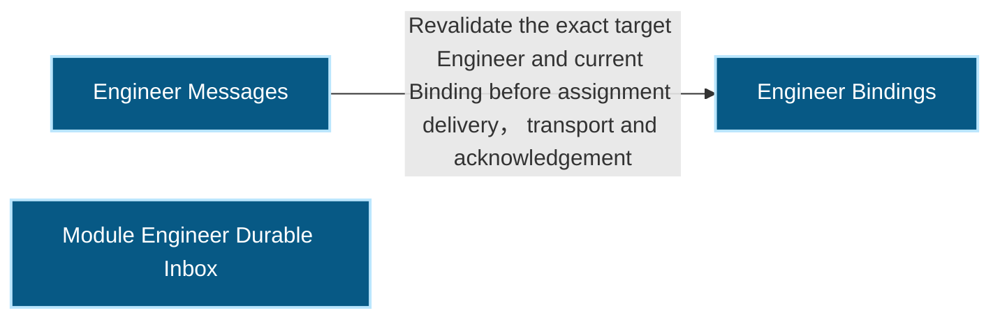
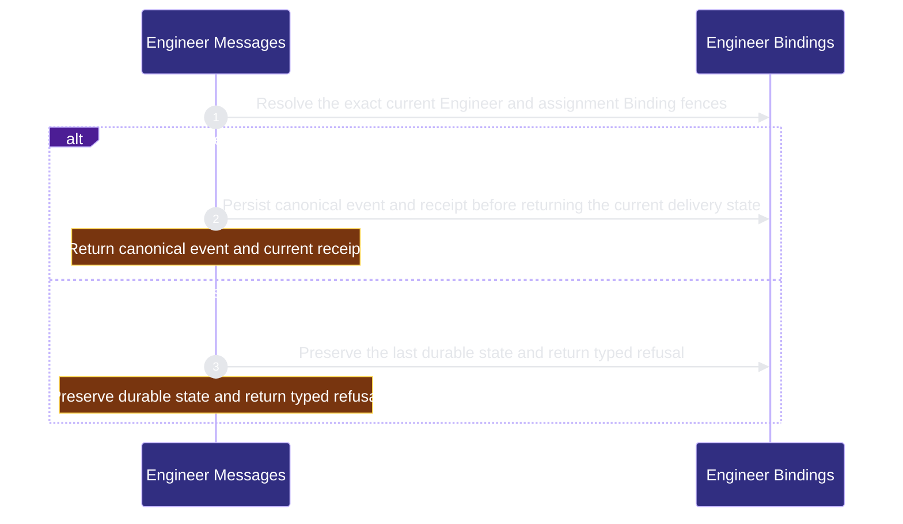

# runtime-harness/engineer-messages 架構文檔

<!-- BEGIN ARCHCONTEXT:generated target="projection_target.entity.capability-runtime-harness-engineer-messages" sourceDigest="sha256:4f24f8a7d8aba2a3b7c222c3032065930c98bf3329ecb25885410df83880d9dc" rendererVersion="archcontext.docs-renderer/v4" outputDigest="sha256:bfa509d1f06a5f75632a5f8de0741ebbf35aedc27cdce6387211ae4f6aac090c" -->
> **狀態**:`active`
> **Capability ID**:`capability.runtime-harness.engineer-messages`(kind `capability`)
> **Matched Prefixes**:`src/core/messages/mechanics.ts`、`src/core/engineers/module-message.ts`、`src/effects/engineers/module-inbox.ts`
> **Local Contracts**:`AGENTS.md`、`CLAUDE.md`
> **事實優先級**:倉庫當前狀態 > 本文檔機器區 > 本文檔人工區。機器區(引言、§1、§2)由 ArchContext 從架構模型與源碼度量投影生成,手改會在下次投影被覆蓋。本文檔不記錄出處;本次投影所驗證的 commit 見 `docs/architecture/.projection-manifest.json`。

Persists closed Module Engineer messages and binding-fenced delivery state before any optional Agent Runtime effect.

## 1. P1:能力架構地圖

### 1.1 架構圖

- Proof: `proven` (`sha256:810402b8f02ac70757a56d84fa51ced9f2901a8e9292d6d6196668ddf5561f2f`).
- Semantic nodes: `3`; declared relations: `1`.

### 1.2 模組職責表

| 宣告入口 | 錨點 | 職責 |
| --- | --- | --- |
| `entrypoint.engineer-messages.send` | `src/effects/engineers/module-inbox.ts#sendModuleMessage` | `sink.engineer-messages.current-binding` → `src/effects/engineers/binding-store.ts#readEngineerBindingStatus` |
| `entrypoint.engineer-messages.acknowledge` | `src/effects/engineers/module-inbox.ts#acknowledgeModuleMessage` | `sink.engineer-messages.resource-bytes` → `src/effects/engineers/module-inbox.ts#verifyModuleMessageResources` |
| `entrypoint.engineer-messages.binding-fence` | `src/effects/engineers/module-inbox.ts#validateTarget` | `sink.engineer-messages.binding-fence` → `src/effects/engineers/binding-store.ts#readEngineerBindingStatus` |
| `entrypoint.engineer-messages.external-delivery-observation` | `src/effects/engineers/module-inbox.ts#recordModuleMessageDeliveryObservation` | `sink.engineer-messages.delivery-receipt` → `src/core/engineers/module-message.ts#applyModuleMessageObservation` |

### 1.3 規模信號

- 規模量級:`2–5` 個文件 / `1000–2000` 行
- 匹配前綴:`src/core/messages/mechanics.ts`、`src/core/engineers/module-message.ts`、`src/effects/engineers/module-inbox.ts`
- 推導:掃描 `source.include` 減 `source.exclude`,跳過 `.git/` 與 `node_modules/`,再按 1–2–5 階梯分桶。精確計數不入本文檔:量級足以回答「這個能力有多大」,而逐行計數會讓覆蓋範圍內任何一次源碼改動都改寫本文檔。

### 1.4 依賴邊界

出向關係:

- `calls` → `capability.runtime-harness.engineer-bindings` — Revalidate the exact target Engineer and current Binding before assignment delivery, transport and acknowledgement

入向關係:

- `calls` ← `capability.runtime-harness.agent-runtime-effects` — Consume one exact persisted message and record effect success only from its authoritative receipt
- `calls` ← `capability.runtime-harness.engineering-overlay` — Observe pending and failed delivery facts from the existing ME-1C event and receipt authority
- `calls` ← `capability.runtime-harness.mcp-sidecar` — Expose authenticated Engineer message send, list and acknowledgement without granting generic Fleet or Provider authority

## 2. P2:端到端數據流

> **Proof**: `proven` (`sha256:810402b8f02ac70757a56d84fa51ced9f2901a8e9292d6d6196668ddf5561f2f`); selectors `1/1`.

<!-- END ARCHCONTEXT:generated target="projection_target.entity.capability-runtime-harness-engineer-messages" -->

## 3. P3:設計決策與不變量

## 4. 歷史決策記錄(append-only)

## Optimization Backlog
