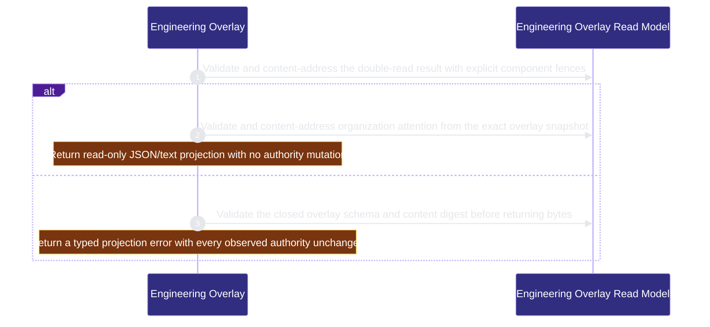

# runtime-harness/engineering-overlay 架構文檔

<!-- BEGIN ARCHCONTEXT:generated target="projection_target.entity.capability-runtime-harness-engineering-overlay" sourceDigest="sha256:f9ab4635d72a1716c09c6070af18e58da67bdbb87773350d6986680dfaf7988e" rendererVersion="archcontext.docs-renderer/v4" outputDigest="sha256:9bae1e0d6199be40d080e00c13cb97f3ef8cb4d1068a029af5dc7c58716edd66" -->
> **狀態**:`active`
> **Capability ID**:`capability.runtime-harness.engineering-overlay`(kind `capability`)
> **Matched Prefixes**:`src/core/engineers/engineering-overlay.ts`、`src/effects/engineers/engineering-overlay.ts`
> **Local Contracts**:`AGENTS.md`、`CLAUDE.md`
> **事實優先級**:倉庫當前狀態 > 本文檔機器區 > 本文檔人工區。機器區(引言、§1、§2)由 ArchContext 從架構模型與源碼度量投影生成,手改會在下次投影被覆蓋。本文檔不記錄出處;本次投影所驗證的 commit 見 `docs/architecture/.projection-manifest.json`。

Projects Profile, Binding, Claim, message and Agent Runtime observations into exact read-only Engineer and organization-attention views without changing Fleet lifecycle authority.

## 1. P1:能力架構地圖

### 1.1 架構圖

- Proof: `proven` (`sha256:559d4d6312038098e0a8c276d4ab6185a5e2de6b144811876a09e78aaa920604`).
- Semantic nodes: `2`; declared relations: `1`.

### 1.2 模組職責表

| 宣告入口 | 錨點 | 職責 |
| --- | --- | --- |
| `entrypoint.engineering-overlay.collect` | `src/effects/engineers/engineering-overlay.ts#collectEngineeringBoard` | `sink.engineering-overlay.binding` → `src/effects/engineers/binding-store.ts#readEngineerBindingStatus`、`sink.engineering-overlay.claim` → `src/effects/engineers/claim-actor-store.ts#listLiveClaimActorReceiptsForEngineer`、`sink.engineering-overlay.messages` → `src/effects/engineers/module-inbox.ts#observeModuleInboxSummary`、`sink.engineering-overlay.runtime-effects` → `src/effects/engineers/agent-runtime-effect-store.ts#observeAgentRuntimeEffects`、`sink.engineering-overlay.schema` → `src/core/engineers/engineering-overlay.ts#buildEngineeringOverlaySnapshot` |
| `entrypoint.engineering-overlay.attention` | `src/core/engineers/engineering-overlay.ts#projectOrganizationAttention` | `sink.engineering-overlay.attention-schema` → `src/core/engineers/engineering-overlay.ts#validateOrganizationAttentionSnapshot` |
| `entrypoint.engineering-overlay.overlay-schema` | `src/core/engineers/engineering-overlay.ts#buildEngineeringOverlaySnapshot` | `sink.engineering-overlay.overlay-validation` → `src/core/engineers/engineering-overlay.ts#validateEngineeringOverlaySnapshot` |

### 1.3 規模信號

- 規模量級:`2–5` 個文件 / `500–1000` 行
- 匹配前綴:`src/core/engineers/engineering-overlay.ts`、`src/effects/engineers/engineering-overlay.ts`
- 推導:掃描 `source.include` 減 `source.exclude`,跳過 `.git/` 與 `node_modules/`,再按 1–2–5 階梯分桶。精確計數不入本文檔:量級足以回答「這個能力有多大」,而逐行計數會讓覆蓋範圍內任何一次源碼改動都改寫本文檔。

### 1.4 依賴邊界

出向關係:

- `calls` → `capability.runtime-harness.agent-runtime-effects` — Observe exact current runtime-effect and reconciliation states without executing or repairing an effect
- `calls` → `capability.runtime-harness.engineer-bindings` — Observe exact current Profile, Binding and live ClaimActor revisions without mutating their stores
- `calls` → `capability.runtime-harness.engineer-messages` — Observe pending and failed delivery facts from the existing ME-1C event and receipt authority
- `calls` → `component.engineering-overlay.primary` — Validate and content-address the read-only Engineer and organization-attention projections

入向關係:

- 無。

## 2. P2:端到端數據流

> **Proof**: `proven` (`sha256:559d4d6312038098e0a8c276d4ab6185a5e2de6b144811876a09e78aaa920604`); selectors `3/3`.

<!-- END ARCHCONTEXT:generated target="projection_target.entity.capability-runtime-harness-engineering-overlay" -->

## 3. P3:設計決策與不變量

## 4. 歷史決策記錄(append-only)

## Optimization Backlog
