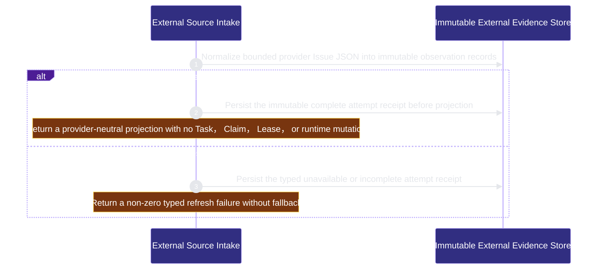

# runtime-harness/external-source-intake 架构文档

<!-- BEGIN ARCHCONTEXT:generated target="projection_target.entity.capability-runtime-harness-external-source-intake" sourceDigest="sha256:9110cbd9bf052fe6fbbe39626d2fb63aa2897853f064c4039407bb1973974cc3" rendererVersion="archcontext.docs-renderer/v4" outputDigest="sha256:9583e5410a03e9fe02eb9d7b8acfedc4acd6cc6dae751b94c0f04a93d7daa8b7" -->
> **狀態**:`active`
> **Capability ID**:`capability.runtime-harness.external-source-intake`(kind `capability`)
> **Matched Prefixes**:`src/core/external-sources/**`、`src/effects/external-sources/**`、`src/cli/commands/external-source.ts`
> **Local Contracts**:`AGENTS.md`、`CLAUDE.md`
> **事實優先級**:倉庫當前狀態 > 本文檔機器區 > 本文檔人工區。機器區(引言、§1、§2)由 ArchContext 從架構模型與源碼度量投影生成,手改會在下次投影被覆蓋。本文檔不記錄出處;本次投影所驗證的 commit 見 `docs/architecture/.projection-manifest.json`。

Owns immutable external Issue evidence and authorization-fenced provenance bindings to exact canonical tasks without scheduler authority.

## 1. P1:能力架構地圖

### 1.1 架構圖

- Proof: `proven` (`sha256:6a93c93fd67f784afff33aee1fc2053c71546701f695987b89f4a73bc7a6a90b`).
- Semantic nodes: `2`; declared relations: `1`.

### 1.2 模組職責表

| 宣告入口 | 錨點 | 職責 |
| --- | --- | --- |
| `entrypoint.external-source-intake.refresh` | `src/effects/external-sources/refresh.ts#refreshExternalSource` | `sink.external-source-intake.immutable-observation-store` → `src/effects/external-sources/store.ts#writeProviderIssueObservation`、`sink.external-source-intake.immutable-attempt-receipt` → `src/effects/external-sources/store.ts#writeExternalSourceRefreshReceipt` |
| `entrypoint.external-source-intake.list` | `src/effects/external-sources/refresh.ts#listExternalSourceProjection` | `sink.external-source-intake.read-only-projection` → `src/core/external-sources/projection.ts#buildExternalSourceProjection` |
| `entrypoint.external-source-intake.bind` | `src/effects/external-sources/binding.ts#bindExternalSource` | `sink.external-source-intake.binding-receipt` → `src/effects/external-sources/store.ts#writeExternalSourceBindingReceipt` |
| `entrypoint.external-source-intake.bind` | `src/effects/external-sources/binding.ts#listExternalSourceBindings` | `sink.external-source-intake.binding-projection` → `src/core/external-sources/binding.ts#ExternalSourceBindingProjectionV1` |

### 1.3 規模信號

- 規模量級:`5–10` 個文件 / `1000–2000` 行
- 匹配前綴:`src/core/external-sources/**`、`src/effects/external-sources/**`、`src/cli/commands/external-source.ts`
- 推導:掃描 `source.include` 減 `source.exclude`,跳過 `.git/` 與 `node_modules/`,再按 1–2–5 階梯分桶。精確計數不入本文檔:量級足以回答「這個能力有多大」,而逐行計數會讓覆蓋範圍內任何一次源碼改動都改寫本文檔。

### 1.4 依賴邊界

出向關係:

- `calls` → `component.external-source-intake.immutable-evidence` — Persist provider-neutral immutable observations and typed refresh receipts before deriving a read-only projection

入向關係:

- `depends_on` ← `capability.runtime-harness.development-campaign` — Require the established external Issue intake policy before campaign startup without acquiring provider mutation authority

## 2. P2:端到端數據流

> **Proof**: `proven` (`sha256:6a93c93fd67f784afff33aee1fc2053c71546701f695987b89f4a73bc7a6a90b`); selectors `2/2`.

<!-- END ARCHCONTEXT:generated target="projection_target.entity.capability-runtime-harness-external-source-intake" -->

## 3. P3：设计决策与不变量

1. GitHub 是证据提供者，不是 Task、优先级、Claim、Lease、WorkEnvelope、协作或 Agent Runtime 权威。
2. `provider_repository_id` 与 `provider_issue_id` 是稳定身份；显示用 `owner/repo#number` 仅为引用，不参与身份判断。
3. 每次刷新写一个不可变 receipt；complete-empty、incomplete 和 unavailable 绝不折叠为同一个投影状态。
4. 标题、正文、labels 与 assignees 是未信任 JSON。P0 只通过 JSON read model 暴露它们，不进入 prompt、合同或执行上下文。
5. append-only 扫描成本是已知 P0 权衡；在实测前不引入 mutable cache 或 adoption state。
6. WP2 的 binding 是 provenance edge，不是 scheduler edge：只有 canonical sprint row 与已批准 plan/contract 能进入现有 TaskOffer；receipt 本身不能创建工作。
7. 一个 receipt 只绑定一个 source revision 与一个 task revision；多条 receipt 自然表达 one-to-many / many-to-one，不做 semantic duplicate 推断。
8. source、canonical task/plan 或 registry authorization 漂移只产生显式 attention，不自动 rebind、取消、重开或改变 Lease。
9. provider 内容只允许由 `renderExternalSourceUntrustedContext` 输出，且 JSON 数据必须位于明确的 `[ExternalSourceUntrusted]` 边界内。

## 4. 历史决策记录（append-only）

### P0 immutable GitHub intake（2026-08-31）

- P1：`src/core/external-sources/` 定义 provider-neutral protocol，`src/effects/external-sources/` 负责 strict policy、`gh` 一次性读取与 Git common-dir store，`src/cli/commands/external-source.ts` 仅注册 refresh/list read surface。
- P2：`external-source refresh --repo <id>` 先读取 registry 与 strict policy，再解析 immutable GitHub identity、分页 Issue JSON、过滤 PR、写 observation 和 attempt receipt，最后从持久记录投影；provider 失败写 typed unavailable/incomplete receipt 并非零退出。
- P3：禁止接入 Fleet 或 collaboration，避免外部 provider 绕过已批准的 sprint/plan/contract/lease 链。10x 时先碰到 provider 页数/字节/截止边界，而非 Lease 并发；超限 fail-closed 且无健康 empty fallback。

### WP2 authenticated canonical binding（2026-09-01）

- P1：`src/core/external-sources/binding.ts` 定义 closed receipt/projection 与唯一 untrusted renderer；`src/effects/external-sources/binding.ts` 负责 registry、observation、canonical task 与 plan/contract 的 exact revalidation；store 只追加 immutable edge。
- P2：`external-source bind` 读取两次 strict registry/source/canonical authority，持久化 exact edge；`bindings` 重读 live authorities并投影 source/canonical/authorization drift；canonical task 随后由既有 Fleet collector 产生 TaskOffer。
- P3：人类 acceptance 留在 PR merge。binding、dispatch、execution、repair 不增加 per-unit waiver/review gate；缺 credential/authorization/provider capability/required host dependency 才属于 installation blocker。
