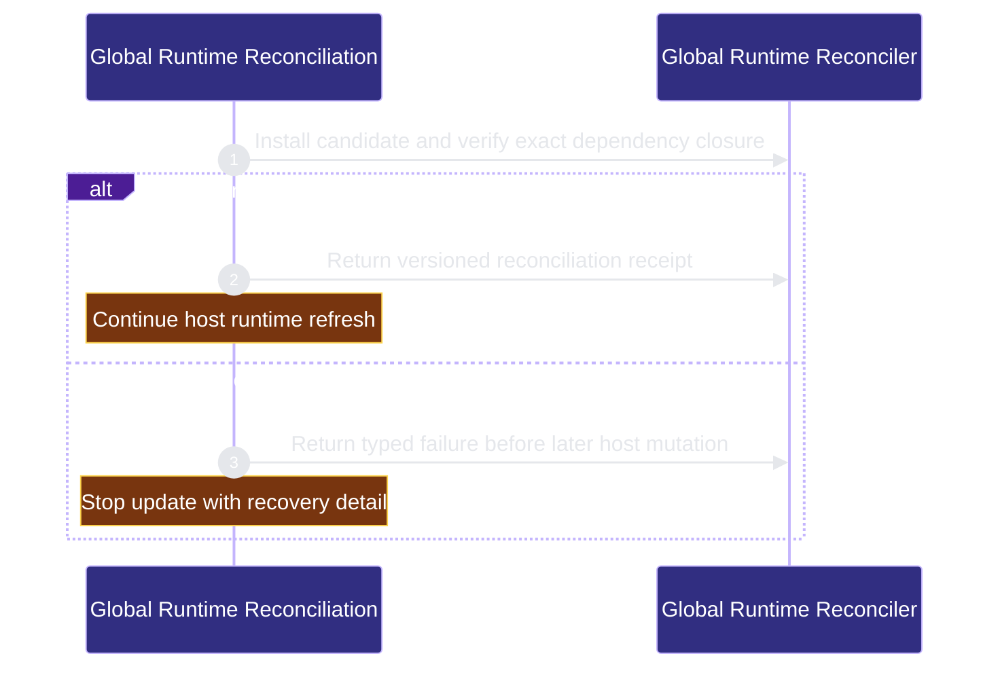

# runtime-harness/global-runtime-reconciliation 架構文檔

<!-- BEGIN ARCHCONTEXT:generated target="projection_target.entity.capability-runtime-harness-global-runtime-reconciliation" sourceDigest="sha256:6d50fa43d5583ee0ef25afa1363333f11f3559475cae0f8dd61d8973925acf41" rendererVersion="archcontext.docs-renderer/v2" outputDigest="sha256:03e585accd98063fab131c2df6eb96132fe58826930c1f5b5a241c67f7e3208c" verifiedAgainst="main@c30f08fcf306b15911f300288bd10cbff03d5377@2026-08-12T23:03:40+08:00" -->
> **狀態**:`active`
> **Verified against**:`main@c30f08fcf306b15911f300288bd10cbff03d5377`(2026-08-12)
> **Capability ID**:`capability.runtime-harness.global-runtime-reconciliation`(kind `capability`)
> **Matched Prefixes**:`package.json`、`bun.lock`、`src/cli/index.ts`、`src/cli/commands/global-runtime.ts`、`scripts/check-managed-runtime.ts`、`scripts/sync-codex-installed-copies.sh`、`src/effects/architecture/**`、`tests/cli/global-runtime-init.test.ts`、`tests/cli/global-runtime.test.ts`、`tests/architecture-projection-provider.test.ts`、`tests/architecture-projection-orchestration.test.ts`、`assets/reference-configs/external-tooling.md`、`docs/reference-configs/external-tooling.md`、`docs/reference-configs/install-profiles.md`
> **Local Contracts**:`AGENTS.md`、`CLAUDE.md`
> **事實優先級**:倉庫當前狀態 > 本文檔機器區 > 本文檔人工區。機器區(引言、§1、§2)由 ArchContext 從架構模型與 Git 狀態投影生成,手改會在下次投影被覆蓋。

Reconciles the installed repo-harness runtime, its mandatory ArchContext closure, and profile-owned external tooling.

## 1. P1:能力架構地圖

### 1.1 架構圖

- Proof: `proven` (`sha256:b19871282a72599ab60a8f1af86d532e425c81ff6498b6ea9020591153bc8e10`).
- Semantic nodes: `2`; declared relations: `1`.

### 1.2 模組職責表

| 宣告入口 | 錨點 | 職責 |
| --- | --- | --- |
| `entrypoint.global-runtime-reconciliation.update` | `src/cli/commands/global-runtime.ts#runGlobalRuntimeSetup` | `sink.global-runtime-reconciliation.readback` → `src/cli/commands/global-runtime.ts#reconcileManagedRuntime` |
| `entrypoint.global-runtime-reconciliation.candidate-readback` | `src/cli/commands/global-runtime.ts#verifyInstalledManagedRuntime` | `sink.global-runtime-reconciliation.candidate-readback` → `src/cli/commands/global-runtime.ts#reconcileManagedRuntime` |

### 1.3 規模信號

- 文件數:`17`
- 總行數:`9110`
- 匹配前綴:`package.json`、`bun.lock`、`src/cli/index.ts`、`src/cli/commands/global-runtime.ts`、`scripts/check-managed-runtime.ts`、`scripts/sync-codex-installed-copies.sh`、`src/effects/architecture/**`、`tests/cli/global-runtime-init.test.ts`、`tests/cli/global-runtime.test.ts`、`tests/architecture-projection-provider.test.ts`、`tests/architecture-projection-orchestration.test.ts`、`assets/reference-configs/external-tooling.md`、`docs/reference-configs/external-tooling.md`、`docs/reference-configs/install-profiles.md`
- 復算:`archctx docs plan --json`(掃描 `source.include` 減 `source.exclude`,跳過 `.git/` 與 `node_modules/`)

### 1.4 依賴邊界

出向關係:

- `calls` → `component.global-runtime-reconciliation.primary` — Reconcile and verify the selected global runtime closure

入向關係:

- 無。

## 2. P2:端到端數據流

> **Proof**: `proven` (`sha256:b19871282a72599ab60a8f1af86d532e425c81ff6498b6ea9020591153bc8e10`); selectors `1/1`.

<!-- END ARCHCONTEXT:generated target="projection_target.entity.capability-runtime-harness-global-runtime-reconciliation" -->

## 3. P3:設計決策與不變量

## 4. 歷史決策記錄(append-only)

## Optimization Backlog
