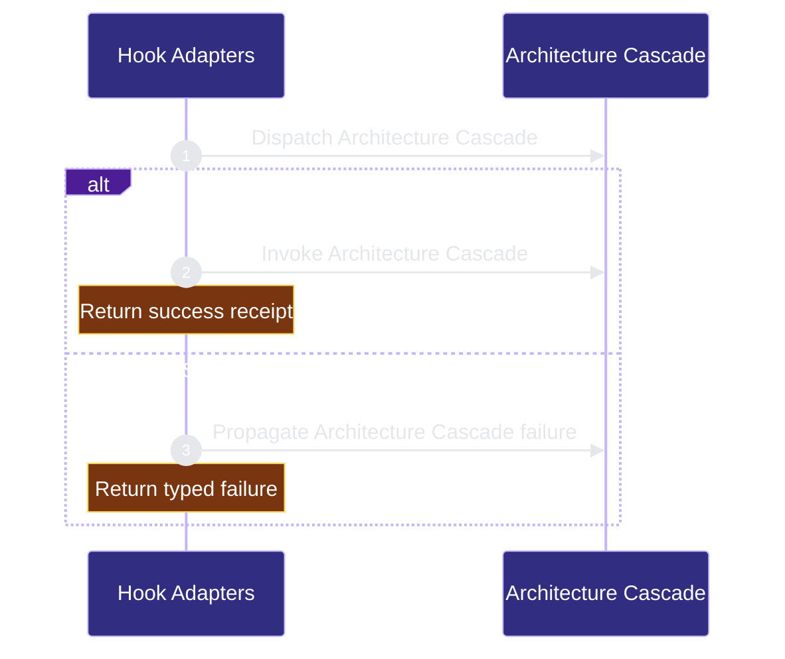

# runtime-harness/hook-adapters 架构文档
<!-- BEGIN ARCHCONTEXT:generated target="projection_target.entity.capability-runtime-harness-hook-adapters" sourceDigest="sha256:132d8cab10d94dc2d5add313cea2a2cfa120b63b2d180ff084f4d9a0fae044bf" rendererVersion="archcontext.docs-renderer/v4" outputDigest="sha256:49427c6729ca7883ed1d9f6f3b23ac6c4ed307748a6344c0e24a4bed00b701ce" -->
> **狀態**:`active`
> **Capability ID**:`capability.runtime-harness.hook-adapters`(kind `capability`)
> **Matched Prefixes**:`assets/hooks/**`、`.ai/hooks/**`、`scripts/run-skill-hook.ts`、`src/cli/installer/**`、`src/cli/hook/**`、`src/cli/hook-entry.ts`
> **Local Contracts**:`assets/hooks/AGENTS.md`、`assets/hooks/CLAUDE.md`
> **事實優先級**:倉庫當前狀態 > 本文檔機器區 > 本文檔人工區。機器區(引言、§1、§2)由 ArchContext 從架構模型與源碼度量投影生成,手改會在下次投影被覆蓋。本文檔不記錄出處;本次投影所驗證的 commit 見 `docs/architecture/.projection-manifest.json`。

Installs and runs typed Claude and Codex host hook routes.

## 1. P1:能力架構地圖

### 1.1 架構圖


- Proof: `proven` (`sha256:c112b4e41464cbd2dd291508791ba1a53d423ad21a2225b5052cc32d3fb3de97`).
- Semantic nodes: `2`; declared relations: `1`.

### 1.2 模組職責表

| 宣告入口 | 錨點 | 職責 |
| --- | --- | --- |
| `entrypoint.hook-adapters.primary` | `src/cli/hook/mutation-observed.ts#processArchitectureCascade` | `sink.hook-adapters.primary` → `src/cli/hook/mutation-observed.ts#runRepoHarnessHelper` |

### 1.3 規模信號

- 規模量級:`50–100` 個文件 / `10k–20k` 行
- 匹配前綴:`assets/hooks/**`、`.ai/hooks/**`、`scripts/run-skill-hook.ts`、`src/cli/installer/**`、`src/cli/hook/**`、`src/cli/hook-entry.ts`
- 推導:掃描 `source.include` 減 `source.exclude`,跳過 `.git/` 與 `node_modules/`,再按 1–2–5 階梯分桶。精確計數不入本文檔:量級足以回答「這個能力有多大」,而逐行計數會讓覆蓋範圍內任何一次源碼改動都改寫本文檔。

### 1.4 依賴邊界

出向關係:

- `calls` → `component.hook-adapters.primary` — Drain Stop architecture work

入向關係:

- 無。

## 2. P2:端到端數據流

> **Proof**: `proven` (`sha256:c112b4e41464cbd2dd291508791ba1a53d423ad21a2225b5052cc32d3fb3de97`); selectors `1/1`.


<!-- END ARCHCONTEXT:generated target="projection_target.entity.capability-runtime-harness-hook-adapters" -->
## 3. P3：设计决策与不变量

### 3.1 必须保持的不变量

1. **一条公开 tuple → 一个 typed handler → 一个 host-output 边界。** `Route` 接口（`route-registry.ts:52`）根本没有 `scripts` 字段，结构上排除了第二 dispatcher。
2. **adapter 命令是信封，不是逻辑。** 任何写进 `~/.claude/settings.json` / `~/.codex/hooks.json` 的分支判断都是回归 —— host 配置无法被测试、无法被原子替换。
3. **ROUTES 顺序是稳定契约。** Codex 按 `(absolute-path, event-snake, i, j)` 哈希 adapter 条目，重排会重新弹出信任提示（`route-registry.ts:14`）。新增 route 只能追加。
4. **handler 不碰 fd。** `HookHandlerResult` 是 handler 的唯一出口，`hostOutput()` 是唯一入海口。Codex 与 Claude 的输出语义差异只能在这一个函数里表达。
5. **opt-in marker 是硬门。** 没有 `.ai/harness/workflow-contract.json` 就静默退出 —— 装了 CLI 的用户在非 harness 仓库不应付出任何代价。
6. **`assets/hooks` 是 canonical root，`.ai/hooks` 是投影。** `.projection.json` 的 digest 与 file_count 是漂移检测，不是备份。
7. **遥测非安全权威，但消费者 fail-closed。** 字段缺失、畸形、重复或混协议时消费者必须停，不得补零。
8. **单一权威不做二次推导。** architecture 级联依赖 `architecture-queue.sh` 自身 stdout，不重实现 capability resolver。

### 3.2 关键权衡

| 决策 | 权衡 |
| --- | --- |
| PostToolUse.edit 只写一条 journal event，重活推到 Stop | 换来编辑热路径近乎零成本，代价是副作用可见性延迟到 Stop；host 若在 Stop 前被杀，pending 事件留在队列等下次 Stop 重试 |
| `subagent` handler 复用 4 条 route | 避免四份近似实现，代价是该 handler 必须在内部按 `context.event` 分支（`handler-registry.ts:49` 的窄化断言即此处的类型缝合点） |
| `hook-entry.ts` 与完整 commander CLI 分离 | 热路径不冷加载非 hook 命令模块（文件头 `:5` 明写理由），代价是子命令分派在 entry 里手写成一串 `if` |
| 保留 `workflow-state.sh` 作为 operator helper | 保住 workflow-state 契约的 parity，代价是仓库里长期存在 1,884 行 × 2 份 Bash；它没有事件入口，所以不构成第二 dispatcher |
| `assets/skill-hooks.json` 保留 7 个空事件 | 零开销的扩展点，但已自标 `deprecated-zero-overhead`；不删除是因为 `scripts/init-project.sh` 与 `assemble-template.ts` 仍在调用其 runner |

### 3.3 10x 规模下先垮的点

排序依据是本仓库自己的 dispatch 遥测 `.ai/harness/runs/hook-events.jsonl`：44,301 条记录，窗口 `2026-07-23T09:05Z` → `2026-08-20T08:26Z`，按 `event.route_id` 聚合 `metrics.elapsed_ms`。占比是该 route 在实测总 hook 墙钟时间中的份额，不是猜测。

| route | 调用数 | 时间占比 | p50 | p95 | p99 / max |
| --- | --- | --- | --- | --- | --- |
| `Stop.default` | 675 | 48.7% | 549ms | 18.4s | 24.4s / 27.4s |
| `PostToolUse.bash` | 16,398 | 26.7% | 52ms | 113ms | 244ms / 1.2s |
| `PreToolUse.edit` | 2,219 | 16.5% | 253ms | 437ms | 873ms / 10.9s |
| `SessionStart.default` | 492 | 4.6% | 304ms | 711ms | 1.2s / 2.1s |
| `PostToolUse.always` | 21,217 | 2.6% | 3.2ms | 11.2ms | — / 386ms |
| 其余 6 条 route 合计 | 3,300 | <1.0% | — | — | — |

按实测的可证伪顺序：

1. **Stop 的串行级联。** 一次 Stop 最多可拉起 `architecture-queue` + `context-contract-sync` + `capability-context` + `verify-contract` 四类 `spawnSync`，逐 pending event 串行。这是唯一已经贴到硬上限的 route：675 次 Stop 里 93 次超过 5s、77 次超过 10s，p99 24.4s，而 host 的 30s adapter timeout 就在旁边。10x 之前它就会先撞墙 —— 它已经吃掉近一半的实测 hook 时间。
2. **`PostToolUse.bash` 的单位成本 × 调用量。** p50 52ms 单看不贵，但它是第二高频 route（16,398 次），乘出来就是 26.7% 的总时间。它没有尾延迟问题（p99 244ms），垮的方式是稳态吞吐：命令密度上去后每次 Bash 调用都固定付这 50ms。
3. **`PreToolUse.edit` 阻塞编辑热路径。** mutation-guard 是**同步前置**门，p50 253ms 直接计入用户可感知的编辑延迟，且 max 10.9s 说明它在状态解析退化时会长尾。§3.2 那条"编辑热路径近乎零成本"的权衡只对 `PostToolUse.edit`（0.8%、p50 13ms）成立，对 PreToolUse 一侧不成立。
4. **SessionStart 上下文预算是全有或全无。** 七个 provider（resume、capability-context-pending、architecture-queue-pending、pending-plan-capture、current-status-snapshot、active-sprint、tooling-update-advisory）在 `session-context.ts:1345-1351` 被 `appendBlock` 拼成**一整块** priority-5 的 `session-start-context.sh` section。`budgetSessionContext` 的裁剪粒度是 section（`session-context-budget.ts:437`），不是 provider —— 超预算时整块被丢掉、只留一行 `[ContextRef:session-start-context.sh]` 占位。所以这里不存在"低优先级 provider 先被牺牲"，而是七块内容一起消失。延迟本身不是瓶颈（4.6%、p95 711ms）。
5. **`resolveEffectiveState` 的锁竞争。** `runtime.ts:277` 的三次有界重试只覆盖两种已知瞬时签名（stability 重读耗尽、独占锁超时）。并行 agent 数量上去后，重试耗尽会把 SessionStart 推进 `[HarnessStateUnavailable]` 分支 —— 这是正确的 fail-closed，但用户侧表现为上下文突然消失。
6. **`install-profile.ts` 1,167 行的单点。** profile 组件矩阵继续增长时，这里是最先需要拆分的文件。不在 dispatch 热路径上。

两个 sink 不是同一个东西，早期版本把它们混为一谈：

- `.ai/harness/runs/hook-events.jsonl` 由 dispatcher 的 `event-telemetry.ts:135` 在**每条 route** 完成后同步 `appendFileSync` 一条，因此它是上表的数据来源，也是唯一全 route 覆盖的写入。
- `.claude/.trace.jsonl` 只由 `trace-observer.ts:190` 写，而 `trace-observer` 只挂在 `PostToolUse.always` 这一条 route 上（`route-registry.ts:100-104`）。

`PostToolUse.always` 确实是调用量最大的 route（21,217 次，超过 bash），但实测它是**最便宜**的高频路径：p50 3.2ms、总占比 2.6%。同步追加争用在当前量级下不是排名靠前的风险；真要成为瓶颈，先出问题的会是 dispatcher 那条全 route 追加，而不是 trace 这一条。

注意遥测本身的边界：`metrics.child_processes` 在全部 44,301 条记录里都是 `0`，它属于 `measurement.incomplete_metrics`，不能用来反推 Stop 的子进程数量；上表只依赖 `elapsed_ms` 这个被标记为 complete 的字段。

### 3.4 prose ↔ 源码冲突（需上层裁决）

- 根 `CLAUDE.md` 写"repo-local `.claude/settings.json` 与 `.codex/hooks.json` hook adapters 已退役"，但 `src/cli/installer/targets/claude.ts:67` 的 `supportsLocation` 仍恒返回 `true`，`resolvePath`（`:58`）在 `--location local` 时写 `<cwd>/.claude/settings.json`，`install.ts:63` 也仍把 `local` 当合法输入。Codex 侧已经真正关死（`codex.ts` 的 `supportsLocation('local') === false`）。**当前源码事实：Claude 的 repo-local 安装路径仍可执行。** 本文按源码记录，退役声明与实现之间的落差需要一次显式裁决（收紧实现，或把根 `CLAUDE.md` 的表述改成"不作为产品交付面推荐"）。
- 本文档旧版 P1 把 `standard-plan.ts` / `fs-transaction.ts` 列为本 capability 模块。按 `.ai/context/capabilities.json`，这两个路径属于 `public-surface-adoption` 的 prefixes。已改列为跨 capability 的一次性迁移依赖，dispatch 路径不消费它们的结论保持不变。

### 3.5 Typed durable-effect failure boundary (2026-08-14)

- P1: `src/cli/hook/handler-registry.ts` is the sole declaration point for
  bounded effect contracts. Only `mutation-observed` (one post-edit journal
  phase) and `stop` (handoff, resume, event, run-summary) declare one; every
  other typed handler remains uninstrumented rather than being inferred as
  effect-free. `src/cli/hook/runtime.ts` owns the invocation-local observation
  and removes handler-ID completeness branches.
- P2: existing post-commit observers feed an additive
  `effect_observation` field in `loop-engine-hook-event/v1`. A thrown targeted
  handler is recorded as `unknown_partial` when no observer phase was seen,
  `committed_partial` for an observed prefix, and `committed_complete` after
  the declared bounded phases. A successful no-op is `none_committed`.
  Telemetry is diagnostic only; the journal and Stop projection files remain
  recovery authority and the public `RunHookResult` vocabulary is unchanged.
- P3: the next host-delivered same-route event is the only production retry
  operation. Fault tests inject throws after each named post-commit phase and
  compare normalized durable artifacts with a no-fault baseline. Stop's append
  event uses a timestamp-free projection key over every non-volatile rendering
  input and compares only the latest Stop inside a bounded reconciliation
  window; an unprovable latest event fails closed as reconcile-required. This
  is handler-local idempotency, not a generic transaction or rollback layer.
  Missing observer evidence fails closed as unknown and never authorizes
  cleanup.

## 4. 历史决策记录（append-only）

> 以下小节为既有文档原文逐字保留，未翻译、未改写。

### Frontend-scoped UX advisory (2026-07-21, PR #109)

The UserPromptSubmit advisory pair is split by scope: `bdd_feature_advice`
stays generic (any feature/implement intent → the `[BDD]` Given-When-Then
reminder), while `ux_feature_guard_advice` additionally requires a frontend/UI
noun — split ZH/EN sets with explicit English word boundaries so `build` and
`suite` can never match via the `ui` substring — evaluated against the
stripped prompt (`ctx.text`), so host-injected context cannot create UX
intent. The fact is echo-only by invariant: it gates the `[UXFeatureGuard]`
push in `prompt-handler.ts` and never enters routing or blocking decisions.
The noun sets expand only with a real missed-case fixture first
(`tests/cli/prompt-intents.test.ts` pins the positive/negative matrix).

### Contract-scoped failed-check repair (2026-08-05)

- P1: `checks_failed` is verification evidence about the current candidate;
  the active contract remains the sole edit-scope authority and Effective
  State remains the profile/blocker authority.
- P2: the resolver canonicalizes the full PreEdit target batch, rejects parent
  traversal and symlink escape, and projects contract authorization into
  Effective State's shared operation readiness. `mutation-guard` consumes the
  resolved `allowedToEdit`, contract path, and `allowed_paths` snapshot without
  rereading workflow authority. The contract-scope guard still rejects every
  sibling outside `allowed_paths`.
- P3: only `allowedToEdit` can exempt the sole `checks_failed` blocker after
  canonical contract authorization. `allowedToStop` and `readyToShip` remain
  hard-blocked, and an unsafe target or any additional blocker fails closed.
  This breaks the review-evidence repair cycle without creating contradictory
  CLI/MCP/hook readiness contracts.

### HRD-09 typed-authority consolidation (原 P3 段落，逐字保留)

The invariant is one public tuple → one typed handler → one host-output
boundary. HRD-09 removes the old second authority in the same work-package:
the Bash host-event runtime and shims are deleted, while the operator helper is
retained as a projection because workflow-state parity still depends on its
contract. Keeping that helper does not keep a second dispatcher alive.

At 10x event volume, synchronous telemetry append contention or incomplete
measurement is the first expected failure. Telemetry is therefore
non-authoritative for safety, but evidence consumers fail closed when required
fields are missing, malformed, duplicated, or mixed-protocol.

### Migration to the typed authority (原 P2 段落，逐字保留)

```text
repo-harness init / runInit
  -> standard-plan (pure operation list)
  -> exact-hash retired-file checks + managed adapter stripping
  -> one FsTransaction apply + manifest
  -> user-level adapter projection remains the host boundary
```

The migration detector is scoped to this explicit transaction. A fingerprint
mismatch preserves the file and reports the mismatch. Custom sibling commands,
unknown events, and unrelated adapter blocks remain intact. Runtime dispatch
does not inspect legacy command shapes, so there is no dual-read path.

### Codex native agent authority (2026-08-11)

- P1: `agents/fleet/*.md` remains persona authority and installed Codex TOML is
  its deterministic projection. The hook runtime owns permission guidance,
  circuit limits, and evidence only; it does not select a second transport.
- P2: `/delegate` or `/parallel` may create bounded advisor state, but every
  official `SubagentStart` independently validates `agent_type`/`model` against
  the installed TOML and writes event-scoped evidence through
  `.ai/harness/delegation/native-role-routing.json` under a dedicated native
  evidence lock, independently from the advisor-state lock. Only the current
  scope is retained, bounded to its latest 32 observations.
  Persistence failure downgrades the child to `unverified`; evidence no longer
  depends on prompt-advisor state and in-memory validation cannot substitute for
  the durable observation.
- P3: native `spawn_agent` plus exact `agent_type` is the sole Codex fleet
  identity/lifecycle authority. Missing/default/mismatched evidence fails
  closed without App-thread, `codex-exec`, or main-thread fallback. Reasoning
  effort stays `configured_unverified` because the event exposes no such field.

### Stop-time git changed set as the architecture observation authority (2026-08-12)

- P1: `src/cli/hook/architecture-drift.ts` owns the architecture changed set. The
  post-edit journal keeps only edit-time trigger payloads (contract
  verification, minimal change, checkpoint); its `dirty.architecture` bit and
  the `skipArchitectureCascade`/`eventIds`/`retainEventFiles` handshake with the
  projection drain are removed, not gated. A journal event only ever existed for
  a Claude Edit/Write tool call, so shell writes (the Codex worktree fleet
  shape) and apply_patch payloads were invisible to drift recording.
- P2: Stop computes `git diff --name-only --no-renames <cursor> HEAD` unioned
  with `git status --porcelain --untracked-files=all` (rename rows contribute
  both sides), canonicalizes every path through the same repo-relative filter
  the edit route uses, and hands one deterministic
  `ArchitectureProjectionSourceEvent` to `drainArchitectureProjectionJobs`. When
  projection is disabled the same path list drives `processArchitectureCascade`.
  `repo-harness architecture-projection drain --json` reads the same authority;
  its output schema is unchanged.
- P3: the cursor (`.ai/harness/state/architecture-drift-cursor.json`, a single
  slot following `session-run-identity.json`) advances to HEAD only on an
  acknowledged delivery, so retry-pending, dead-letter, and thrown failures
  replay the same range on the next Stop. For the disabled projection provider,
  acknowledgment covers the complete legacy cascade: the runner must resolve,
  every primary `architecture-queue` invocation must succeed, and every
  request-triggered `context-contract-sync` / `capability-context` follow-up
  must succeed. Stop remains advisory and reports a bounded diagnostic, while
  the manual drain exits non-zero; neither path advances the cursor after a
  partial cascade. Both callers persist a frozen legacy batch in
  `.ai/harness/state/architecture-drift-cascade.json` under the shared exclusive
  directory lock. Each complete path cascade advances its `completed` offset;
  timeout or failure retries the interrupted path, not the acknowledged prefix.
  The Git cursor advances only to the frozen batch HEAD once all paths finish;
  commits arriving during delivery remain in the next range. Pending working-tree
  edits are observed again by the next Stop. Malformed batch state fails closed,
  and historical paths are validated lexically, independent of the current target
  of completed paths. Each unfinished path must still resolve to its frozen name
  inside the repository immediately before delivery; retargeted or unsafe paths
  retain their offset and fail closed. All cursor writers (legacy, Stop, CLI and
  publication acknowledgement) use the same directory lock and expected-cursor
  comparison. Publication proof validation runs inside that transaction; the
  legacy holder uses the private held-lock writer rather than acquiring twice.
  An external cursor acknowledgement does not prove coverage of an old suffix:
  legacy recovery finishes that suffix first, preserves the external cursor,
  and observes its new range on the following window. A provider mode switch
  retains the legacy batch; only legacy delivery acknowledges its offsets.
  Stale empty locks from creation/release crashes use the existing identity-
  checked recovery protocol; fresh empty directories and live owners remain
  protected. This does not introduce a power-loss/fsync durability guarantee.
  A crash between an effect and its offset write may repeat that path:
  delivery is at least once. Subprocess cost still limits throughput, but a finite
  backlog whose individual cascades fit the budget makes progress across Stops.
  A missing or unresolvable cursor re-anchors at HEAD,
  processes working-tree entries only, and emits one stderr note instead of
  replaying history. Deletions stay in the feed:
  `architecture-queue record --file` classifies lexically and records a card for
  a path that no longer exists on disk. The cascade commands themselves are
  byte-identical -- only their input feed changed.

## 5. 验证面

capabilities.json 的 `verification_hints`：

```bash
bun test tests/hook-runtime.test.ts tests/hook-contracts.test.ts tests/workflow-contract.test.ts
bash scripts/check-task-workflow.sh --strict
```

本模块历史记录的补充验证命令：

- `bun test tests/cli/route-registry.test.ts tests/cli/hook.test.ts`
- `bun test tests/prompt-handler.test.ts tests/subagent-handler.test.ts`
- `bun test tests/command-observed.test.ts tests/trace-observer.test.ts`
- `bun test tests/architecture-drift.test.ts tests/stop-handler.test.ts tests/mutation-observed.test.ts`
- `bun test tests/hook-contracts.test.ts tests/hook-protocol.test.ts`
- `bun run check:type`
- `bun run check:hooks`
- `bash scripts/check-architecture-sync.sh`

## 6. Workstream

- `tasks/workstreams/runtime-harness/hook-adapters/github-issues-158-159.md`
