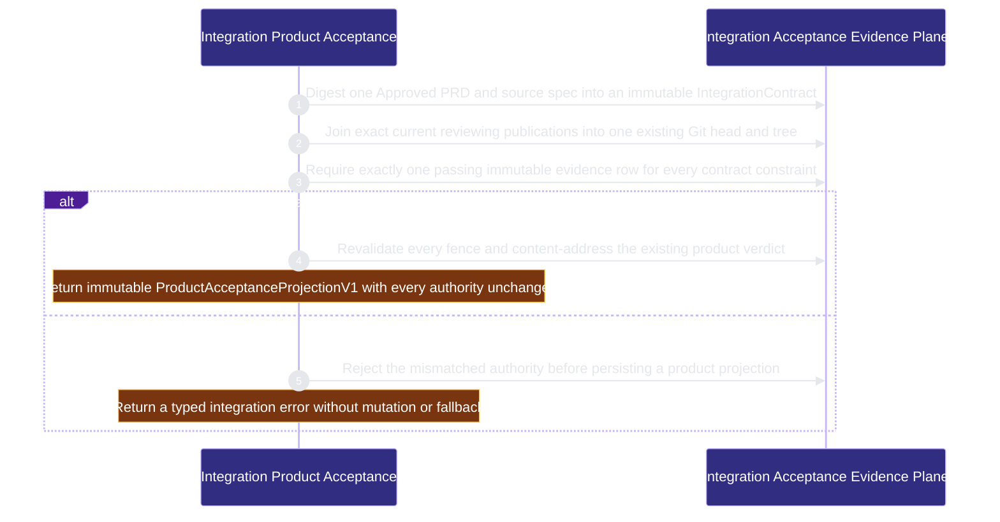

# runtime-harness/integration-acceptance 架構文檔

<!-- BEGIN ARCHCONTEXT:generated target="projection_target.entity.capability-runtime-harness-integration-acceptance" sourceDigest="sha256:fbd133786d816af6cecd0d34cd259a5d6bec58bb3ac958b1afef89cf549feee3" rendererVersion="archcontext.docs-renderer/v4" outputDigest="sha256:48452c6ff7afeafe086d9268ee898c8f9a6503573bf13f4c384066ce4abe2fea" -->
> **狀態**:`active`
> **Capability ID**:`capability.runtime-harness.integration-acceptance`(kind `capability`)
> **Matched Prefixes**:`src/core/integration/product-acceptance.ts`、`src/effects/integration/product-acceptance.ts`
> **Local Contracts**:`AGENTS.md`、`CLAUDE.md`
> **事實優先級**:倉庫當前狀態 > 本文檔機器區 > 本文檔人工區。機器區(引言、§1、§2)由 ArchContext 從架構模型與源碼度量投影生成,手改會在下次投影被覆蓋。本文檔不記錄出處;本次投影所驗證的 commit 見 `docs/architecture/.projection-manifest.json`。

Binds Approved requirement bytes, current module publications, one existing Git candidate, exact evidence and the existing AcceptanceReceipt into immutable product-acceptance projections without creating merge or verdict authority.

## 1. P1:能力架構地圖

### 1.1 架構圖

- Proof: `proven` (`sha256:e6fb78ad0d8769140f8a9d496844c5d540fbb4991e6cb6d2f6d75a3859b616fd`).
- Semantic nodes: `2`; declared relations: `1`.

### 1.2 模組職責表

| 宣告入口 | 錨點 | 職責 |
| --- | --- | --- |
| `entrypoint.integration-acceptance.contract` | `src/effects/integration/product-acceptance.ts#createIntegrationContract` | `sink.integration-acceptance.contract-schema` → `src/core/integration/product-acceptance.ts#buildIntegrationContract` |
| `entrypoint.integration-acceptance.envelope` | `src/effects/integration/product-acceptance.ts#createIntegrationEnvelope` | `sink.integration-acceptance.lease` → `src/effects/state/coordination-lease-store.ts#readLease`、`sink.integration-acceptance.publication` → `src/effects/publication/publication-receipt.ts#readPublicationReceiptCache`、`sink.integration-acceptance.envelope-schema` → `src/core/integration/product-acceptance.ts#buildIntegrationEnvelope` |
| `entrypoint.integration-acceptance.matrix` | `src/effects/integration/product-acceptance.ts#createAcceptanceMatrix` | `sink.integration-acceptance.matrix-schema` → `src/core/integration/product-acceptance.ts#assertCompletePassingMatrix` |
| `entrypoint.integration-acceptance.product` | `src/effects/integration/product-acceptance.ts#createProductAcceptanceProjection` | `sink.integration-acceptance.acceptance` → `scripts/acceptance-receipt.ts#verifyAcceptance`、`sink.integration-acceptance.product-schema` → `src/core/integration/product-acceptance.ts#buildProductAcceptanceProjection` |
| `entrypoint.integration-acceptance.contract-canonical` | `src/core/integration/product-acceptance.ts#buildIntegrationContract` | `sink.integration-acceptance.contract-canonical` → `src/core/publication/publication-receipt.ts#stablePublicationJson` |
| `entrypoint.integration-acceptance.envelope-canonical` | `src/core/integration/product-acceptance.ts#buildIntegrationEnvelope` | `sink.integration-acceptance.envelope-canonical` → `src/core/publication/publication-receipt.ts#stablePublicationJson` |
| `entrypoint.integration-acceptance.matrix-canonical` | `src/core/integration/product-acceptance.ts#buildAcceptanceMatrix` | `sink.integration-acceptance.matrix-canonical` → `src/core/publication/publication-receipt.ts#stablePublicationJson` |
| `entrypoint.integration-acceptance.product-canonical` | `src/core/integration/product-acceptance.ts#buildProductAcceptanceProjection` | `sink.integration-acceptance.product-canonical` → `src/core/publication/publication-receipt.ts#stablePublicationJson` |

### 1.3 規模信號

- 規模量級:`2–5` 個文件 / `500–1000` 行
- 匹配前綴:`src/core/integration/product-acceptance.ts`、`src/effects/integration/product-acceptance.ts`
- 推導:掃描 `source.include` 減 `source.exclude`,跳過 `.git/` 與 `node_modules/`,再按 1–2–5 階梯分桶。精確計數不入本文檔:量級足以回答「這個能力有多大」,而逐行計數會讓覆蓋範圍內任何一次源碼改動都改寫本文檔。

### 1.4 依賴邊界

出向關係:

- `calls` → `component.integration-acceptance.primary` — Validate and persist immutable exact-subject integration evidence before returning a non-authoritative projection

入向關係:

- `depends_on` ← `capability.runtime-harness.development-campaign` — Observe existing acceptance and publication projections later without creating a second acceptance or merge authority

## 2. P2:端到端數據流

> **Proof**: `proven` (`sha256:e6fb78ad0d8769140f8a9d496844c5d540fbb4991e6cb6d2f6d75a3859b616fd`); selectors `4/4`.

<!-- END ARCHCONTEXT:generated target="projection_target.entity.capability-runtime-harness-integration-acceptance" -->

## 3. P3:設計決策與不變量

## 4. 歷史決策記錄(append-only)

## Optimization Backlog
