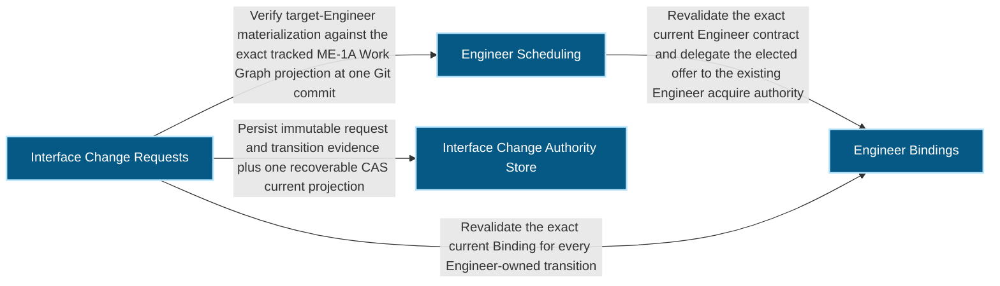
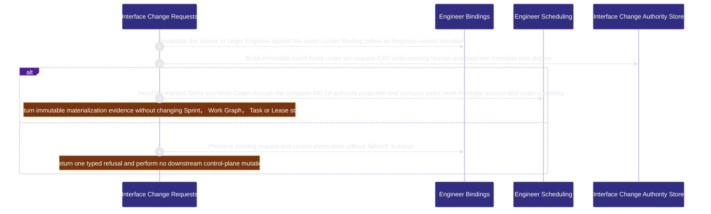

# runtime-harness/interface-change 架構文檔

<!-- BEGIN ARCHCONTEXT:generated target="projection_target.entity.capability-runtime-harness-interface-change" sourceDigest="sha256:75efb06638143eb3cefbe43209117391ab0cba8a352cf85bdbd760984c3770c1" rendererVersion="archcontext.docs-renderer/v4" outputDigest="sha256:60a77edc9d80143bba47f685fc5bbd20b4c096e2b732fe6401669c52f50dba3a" -->
> **狀態**:`active`
> **Capability ID**:`capability.runtime-harness.interface-change`(kind `capability`)
> **Matched Prefixes**:`src/core/engineers/interface-change.ts`、`src/effects/engineers/interface-change-store.ts`、`src/cli/commands/interface-change.ts`
> **Local Contracts**:`AGENTS.md`、`CLAUDE.md`
> **事實優先級**:倉庫當前狀態 > 本文檔機器區 > 本文檔人工區。機器區(引言、§1、§2)由 ArchContext 從架構模型與源碼度量投影生成,手改會在下次投影被覆蓋。本文檔不記錄出處;本次投影所驗證的 commit 見 `docs/architecture/.projection-manifest.json`。

Owns revision-fenced cross-capability interface decisions and exact planning materialization evidence without becoming scheduling, code, runtime or acceptance authority.

## 1. P1:能力架構地圖

### 1.1 架構圖

- Proof: `proven` (`sha256:5fe08894ae4d2243fad3a24295426db63eebe8a664b995833390692a8bc17a58`).
- Semantic nodes: `4`; declared relations: `4`.

### 1.2 模組職責表

| 宣告入口 | 錨點 | 職責 |
| --- | --- | --- |
| `entrypoint.interface-change.binding-fence` | `src/effects/engineers/interface-change-store.ts#validateEngineerActor` | `sink.interface-change.binding` → `src/effects/engineers/binding-store.ts#readEngineerBindingStatus` |
| `entrypoint.interface-change.event-canonical` | `src/core/engineers/interface-change.ts#buildInterfaceChangeEvent` | `sink.interface-change.event-digest` → `src/core/messages/mechanics.ts#canonicalMessageDigest` |
| `entrypoint.interface-change.work-graph` | `src/effects/engineers/interface-change-store.ts#projectedGraphAt` | `sink.interface-change.work-graph` → `src/effects/engineers/scheduling.ts#readTrackedWorkGraphProjectionAt` |
| `entrypoint.interface-change.reverse-lookup` | `src/effects/engineers/interface-change-store.ts#findInterfaceChangesByWorkPackage` | `sink.interface-change.accepted-projection` → `src/core/engineers/interface-change.ts#validateInterfaceWorkPackageProjection` |

### 1.3 規模信號

- 規模量級:`2–5` 個文件 / `1000–2000` 行
- 匹配前綴:`src/core/engineers/interface-change.ts`、`src/effects/engineers/interface-change-store.ts`、`src/cli/commands/interface-change.ts`
- 推導:掃描 `source.include` 減 `source.exclude`,跳過 `.git/` 與 `node_modules/`,再按 1–2–5 階梯分桶。精確計數不入本文檔:量級足以回答「這個能力有多大」,而逐行計數會讓覆蓋範圍內任何一次源碼改動都改寫本文檔。

### 1.4 依賴邊界

出向關係:

- `calls` → `capability.runtime-harness.engineer-bindings` — Revalidate the exact current Binding for every Engineer-owned transition
- `calls` → `capability.runtime-harness.engineer-scheduling` — Verify target-Engineer materialization against the exact tracked ME-1A Work Graph projection at one Git commit
- `calls` → `component.interface-change.primary` — Persist immutable request and transition evidence plus one recoverable CAS current projection

入向關係:

- `calls` ← `capability.runtime-harness.mcp-sidecar` — Expose only authenticated Engineer propose, submit, cancel, materialize and implemented mutations through the server-derived OAuth principal

## 2. P2:端到端數據流

> **Proof**: `proven` (`sha256:5fe08894ae4d2243fad3a24295426db63eebe8a664b995833390692a8bc17a58`); selectors `3/3`.

<!-- END ARCHCONTEXT:generated target="projection_target.entity.capability-runtime-harness-interface-change" -->

## 3. P3:設計決策與不變量

## 4. 歷史決策記錄(append-only)

## Optimization Backlog
