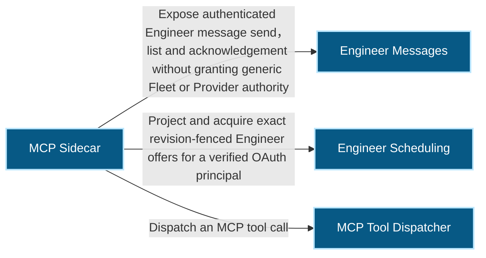
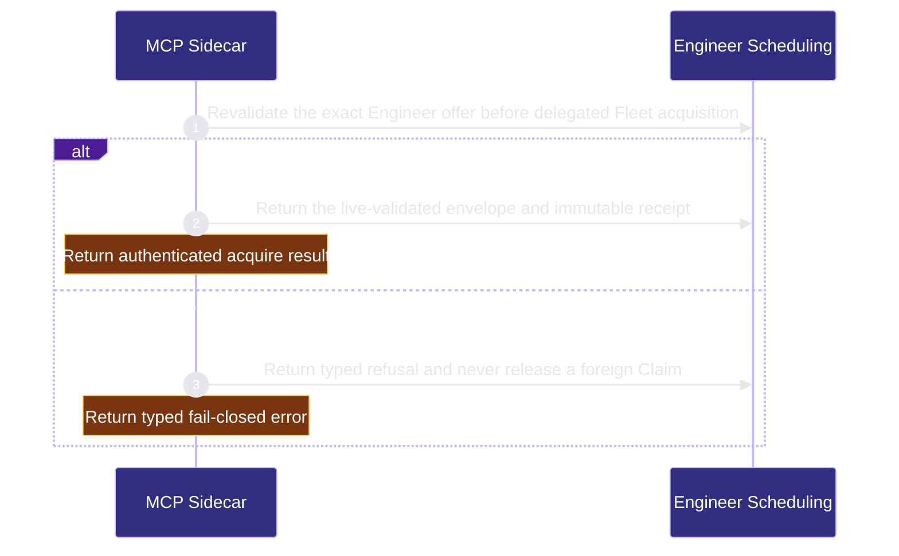
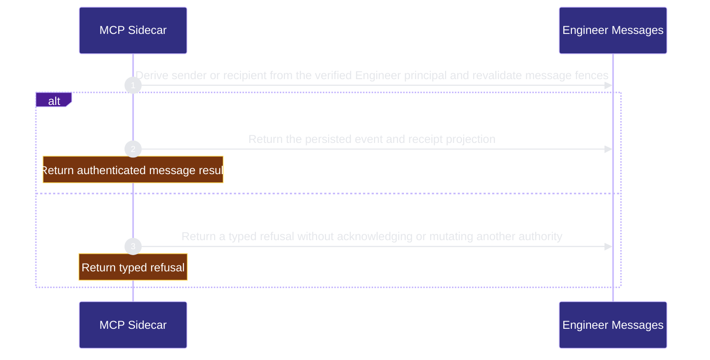
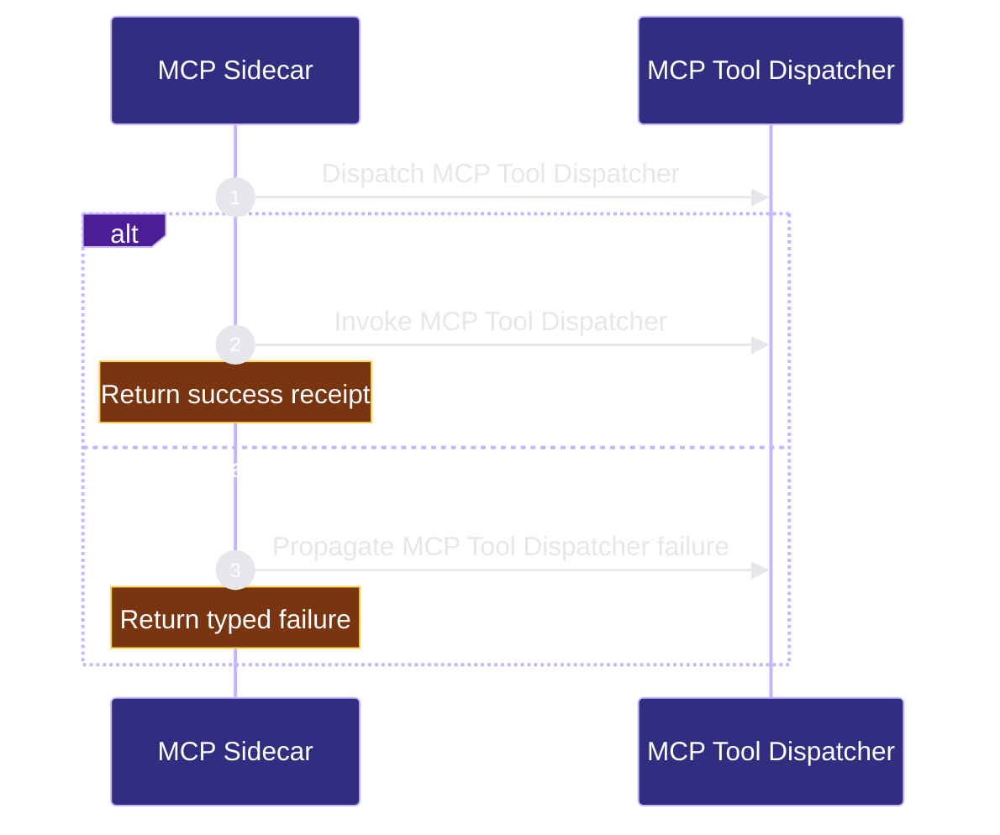

# runtime-harness/mcp-sidecar 架构文档
<!-- BEGIN ARCHCONTEXT:generated target="projection_target.entity.capability-runtime-harness-mcp-sidecar" sourceDigest="sha256:98aca01f5972a801ccbed7b23063276724226233393bfd9d69dda2743eb9a26f" rendererVersion="archcontext.docs-renderer/v4" outputDigest="sha256:f77e33f1153051b1b06a584faf6bd25a8581694d6b6148650dc66c9160b0cf2c" -->
> **狀態**:`active`
> **Capability ID**:`capability.runtime-harness.mcp-sidecar`(kind `capability`)
> **Matched Prefixes**:`src/cli/mcp/**`、`src/cli/commands/mcp.ts`、`src/cli/chatgpt-browser/file-policy.ts`、`src/effects/repo-registry.ts`、`docs/repo-harness-chatgpt-mcp-setup.md`、`docs/reference-configs/chatgpt-coding-mcp.md`、`docs/researches/20260711-devspace-chatgpt-local-control.md`
> **Local Contracts**:`AGENTS.md`、`CLAUDE.md`
> **事實優先級**:倉庫當前狀態 > 本文檔機器區 > 本文檔人工區。機器區(引言、§1、§2)由 ArchContext 從架構模型與源碼度量投影生成,手改會在下次投影被覆蓋。本文檔不記錄出處;本次投影所驗證的 commit 見 `docs/architecture/.projection-manifest.json`。

Provides the local MCP sidecar and its repository access policy boundary.

## 1. P1:能力架構地圖

### 1.1 架構圖

- Proof: `proven` (`sha256:b2f533221d0f4381ab78d10170b30b1d5d04fb5a17487c4901f4d76dcfca14b4`).
- Semantic nodes: `4`; declared relations: `3`.

### 1.2 模組職責表

| 宣告入口 | 錨點 | 職責 |
| --- | --- | --- |
| `entrypoint.mcp-sidecar.primary` | `src/cli/mcp/server.ts#createRepoHarnessMcpServer` | `sink.mcp-sidecar.primary` → `src/cli/mcp/tools.ts#callMcpTool` |
| `entrypoint.mcp-sidecar.engineer-tools` | `src/cli/mcp/engineer-tools.ts#callEngineerTool` | `sink.mcp-sidecar.engineer-principal` → `src/effects/engineers/principal.ts#resolveEngineerPrincipal`、`sink.mcp-sidecar.engineer-offers` → `src/effects/engineers/scheduling.ts#collectEngineerOffers` |
| `entrypoint.mcp-sidecar.engineer-tools` | `src/cli/mcp/engineer-tools.ts#messageSendAsEngineer` | `sink.mcp-sidecar.engineer-messages` → `src/effects/engineers/module-inbox.ts#sendModuleMessage` |
| `entrypoint.mcp-sidecar.engineer-tools` | `src/cli/mcp/engineer-tools.ts#acquireAsEngineer` | `sink.mcp-sidecar.engineer-acquire` → `src/effects/engineers/scheduling-acquire.ts#acquireScheduledEngineerTask` |
| `entrypoint.mcp-sidecar.engineer-tools` | `src/cli/mcp/engineer-tools.ts#callEngineerTool` | `sink.mcp-sidecar.agent-runtime-effect-status` → `src/effects/engineers/agent-runtime-effect-store.ts#observeAgentRuntimeEffectStatus`、`sink.mcp-sidecar.interface-change` → `src/effects/engineers/interface-change-store.ts#transitionInterfaceChangeRequest` |
| `entrypoint.mcp-sidecar.collaboration-tools` | `src/cli/mcp/collaboration-tools.ts#callCollaborationTool` | `sink.mcp-sidecar.collaboration-exchange` → `src/effects/collaboration/agent-surface.ts#collaborationExchangeView`、`sink.mcp-sidecar.collaboration-signal-post` → `src/effects/collaboration/agent-surface.ts#collaborationSignalPost`、`sink.mcp-sidecar.collaboration-handoff-adopt` → `src/effects/collaboration/agent-surface.ts#collaborationHandoffAdopt` |

### 1.3 規模信號

- 規模量級:`20–50` 個文件 / `10k–20k` 行
- 匹配前綴:`src/cli/mcp/**`、`src/cli/commands/mcp.ts`、`src/cli/chatgpt-browser/file-policy.ts`、`src/effects/repo-registry.ts`、`docs/repo-harness-chatgpt-mcp-setup.md`、`docs/reference-configs/chatgpt-coding-mcp.md`、`docs/researches/20260711-devspace-chatgpt-local-control.md`
- 推導:掃描 `source.include` 減 `source.exclude`,跳過 `.git/` 與 `node_modules/`,再按 1–2–5 階梯分桶。精確計數不入本文檔:量級足以回答「這個能力有多大」,而逐行計數會讓覆蓋範圍內任何一次源碼改動都改寫本文檔。

### 1.4 依賴邊界

出向關係:

- `calls` → `capability.runtime-harness.agent-runtime-effects` — Expose read-only runtime capability and current-effect projections to the authenticated Engineer without Host mutation authority
- `calls` → `capability.runtime-harness.collaboration` — Serve the bounded Engineer collaboration tool set from the shared agent surface, deriving the author from the authenticated authorization and taking no actor, destination or recorded time from a caller
- `calls` → `capability.runtime-harness.engineer-messages` — Expose authenticated Engineer message send, list and acknowledgement without granting generic Fleet or Provider authority
- `calls` → `capability.runtime-harness.engineer-bindings` — Resolve a verified OAuth authorization to the current Engineer Binding before acquiring a Fleet Claim
- `calls` → `capability.runtime-harness.engineer-scheduling` — Project and acquire exact revision-fenced Engineer offers for a verified OAuth principal
- `calls` → `capability.runtime-harness.interface-change` — Expose only authenticated Engineer propose, submit, cancel, materialize and implemented mutations through the server-derived OAuth principal
- `calls` → `component.mcp-sidecar.primary` — Dispatch an MCP tool call

入向關係:

- 無。

## 2. P2:端到端數據流

> **Proof**: `proven` (`sha256:b2f533221d0f4381ab78d10170b30b1d5d04fb5a17487c4901f4d76dcfca14b4`); selectors `3/3`.

<!-- END ARCHCONTEXT:generated target="projection_target.entity.capability-runtime-harness-mcp-sidecar" -->
## 3. P3：设计决策与不变量

### 3.1 必须保持的不变量

1. **单一存储权威。** MCP 的配置与凭证只有 `mcpStorageDir()` 一个来源。#167 之所以选择「迁移时轮换凭证而非搬运凭证」，是因为 repo-scope 的 bearer token 与 passphrase 曾经躺在 git 工作树里，可能已进入备份或历史；搬运会把一个已经泄露风险未知的秘密延寿（`setup.ts:765` 的注释即此判断）。删除 repo-scope OAuth token store 强制恰好一次重新授权，是这条决策的可观测代价。
2. **授权真相在注册表，不在 MCP 配置。** `read_write` 授权与 `authorizationRevision` 都由 `registered-repos.json` 持有，写入走文件锁 + 原子 rename（`repo-registry.ts:183`、`:149`）。MCP 配置里的 `authorizationRevision` 只是一份必须与注册表相等的副本，不相等就整体拒绝服务。
3. **authorization-scoped profile 默认关闭且各自闭合。** coding 需要 v3 配置里 `profile: coding` + `coding.enabled: true`、至少一个 `read_write` 注册 repo、OAuth 认证；Engineer 需要 `profile: engineer`、独立的 `repo-harness.engineer` scope、当前 repo `read_write` grant，以及 exact two-tool inventory。任意 live grant/revision/scope 条件失效都立即拒绝；只有 coding 建立 shell runtime。
4. **worktree-first。** `open_workspace` 默认建独立 worktree，`checkout` 必须显式指定。这让远端代理的失败落在一根可丢弃的分支上，而不是用户的工作树。
5. **grant 选工作区，不等于 shell 沙箱。** 授权页文案直说 `exec_command` 能触达本地用户能触达的一切（`http.ts:220`）。文档与 UI 都不得反向承诺「allowed roots 沙箱化了 Bash」。
6. **MCP 只投影状态，不解释状态。** `summarize_repo_harness_state` 复用与 CLI、Stop hook 相同的解析器；保留的 `current` 预览被两处字段显式标注为非权威。
7. **CodeGraph 是可选适配器。** 文件系统与 repo 注册表是内容与授权真相；索引失败只写 dead-letter，不能反过来阻断已成功的变更。

### 3.2 已知张力

- `mcp.local.json` 的 `repo` 字段仍被写入（`setup.ts:821`），但 runtime 的 repoRoot 只来自 `--repo` 或 cwd（`server.ts:180`）。它属于**已实现、保留字段**：doctor 与迁移输出会显示它，没有解析路径消费它。
- `McpLocalConfig.version` 仍接受 `1 | 2 | 3`（`auth.ts:128`），但 coding 面硬性要求 `version === 3`。v1/v2 只对非 coding profile 有效，属于窄口径的历史宽容，不是双权威。
- `capabilities.reader` 是显式标注的 deprecated 键（`auth.ts:30`），仅在 `workspaceReader` 未定义时参与判断。

### 3.3 10x 规模下先垮的点

按当前实现，压力顺序是：

1. **mutation 后的串行 CodeGraph 全仓刷新**（`coding-tools.ts` 的 refresh 链）。它被刻意串行化以避免 mutation/index 竞态；仓库变大或并发授权变多时，这是第一个吃掉端到端延迟的环节，而不是 MCP 路由。
2. **`general-repo-access.ts` 的进程内快照缓存**：`MAX_ENTRY_METADATA_CACHE_ENTRIES = 200_000`、`MAX_SNAPSHOT_CACHE_ENTRIES = 16`、`SNAPSHOT_TTL_MS = 5min`（`general-repo-access.ts:184`–`:186`）。多个大仓交替访问会让快照命中率塌到接近零，退化为反复全量 walk。
3. **`CodingAuthorizationRuntimeStore` 的容量与 session 上限共用一个数**：两者都取 `maxSessions`（默认 64，上限 256，`http.ts:567`–`:569`）。授权数与 transport 数的增长曲线并不相同，共用上限会让先到者挤掉后到者。
4. **每请求同步复核**：`http.ts:616` 的中间件在每个请求上重读 `mcp.local.json` 与 `registered-repos.json`。这是 fail-closed 的代价，也是 QPS 上升时第一个变成同步 IO 热点的地方。

单授权维度已有的硬上限——并发进程 4、单进程最长 30 分钟、输出环 4 MiB、完成后保留 15 分钟、runtime idle 复用 `sessionTtlMs`（默认 30 分钟）——限制的是不可信侧的并发面，不解决上面四点的吞吐问题。

## 4. 历史决策记录（append-only）

重写前的 `docs/architecture/modules/runtime-harness/mcp-sidecar.md` 全文为无日期的 P1/P2/P3 叙述段落，**不含任何带日期的章节**，因此本节当前没有需要逐字保留的条目。

后续带日期的决策请在此追加，只增不改。

### 2026-08-25 ME-0B restricted Engineer carrier

- Engineer 与 coding 复用 OAuth 的授权生命周期机制，但使用不同 scope、不同 exact tool inventory 与不同 runtime policy；coding grant 不蕴含 Engineer authority，Engineer grant 也不创建 coding runtime。
- HTTP transport 将 MCP session 绑定到 verified `authorizationId`。payload 里的 Engineer/Binding/session/thread 字段只能作为 fence 或 observation，不能选择 principal；另一 authorization 复用 session 会得到 404。
- Engineer profile 必须在 generic tool builders 之前按 exact profile 分派，避免 broad capability flag 将 reader/writer/shell/Fleet mutation 扩散进 restricted surface。
