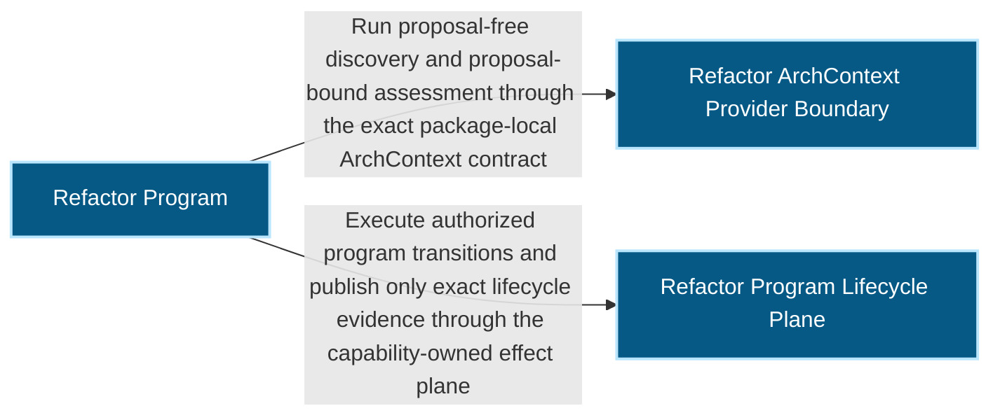
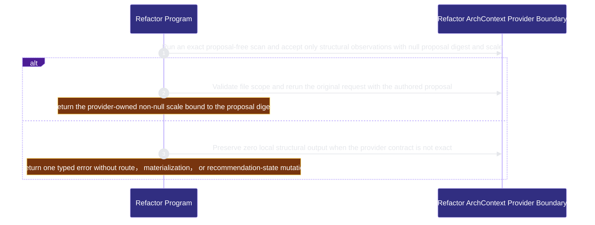
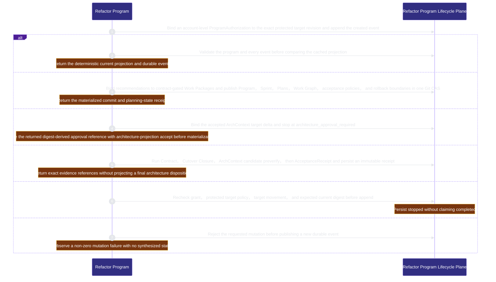

# Refactor Program
<!-- BEGIN ARCHCONTEXT:generated target="projection_target.entity.capability-runtime-harness-refactor-program" sourceDigest="sha256:e62d682d1acc2005b21ec95c10b7d564f58d7974b9190f8bd2352ae2f89574b9" rendererVersion="archcontext.docs-renderer/v4" outputDigest="sha256:281710e8acc1b2e7fa7a7e0521833566e98430f128f36147674832cef046126d" -->
> **狀態**:`active`
> **Capability ID**:`capability.runtime-harness.refactor-program`(kind `capability`)
> **Matched Prefixes**:`src/core/refactor/**`、`src/effects/refactor/**`、`src/cli/commands/refactor.ts`
> **Local Contracts**:`AGENTS.md`、`CLAUDE.md`
> **事實優先級**:倉庫當前狀態 > 本文檔機器區 > 本文檔人工區。機器區(引言、§1、§2)由 ArchContext 從架構模型與源碼度量投影生成,手改會在下次投影被覆蓋。本文檔不記錄出處;本次投影所驗證的 commit 見 `docs/architecture/.projection-manifest.json`。

Orchestrates ArchContext-backed refactor discovery, accountable proposal authoring, conservative workflow routing, execution evidence, and post-merge resolution without duplicating structural authority.

## 1. P1:能力架構地圖

### 1.1 架構圖

- Proof: `proven` (`sha256:73e4995f7ad0fbe27bda040c8e7307891a8407b81069c37844a98b1157da846d`).
- Semantic nodes: `3`; declared relations: `2`.

### 1.2 模組職責表

| 宣告入口 | 錨點 | 職責 |
| --- | --- | --- |
| `entrypoint.refactor-program.discover` | `src/effects/refactor/discovery-authoring.ts#discoverRefactorCandidates` | `sink.refactor-program.provider-scan` → `src/effects/refactor/archctx-provider.ts#runRefactorScan` |
| `entrypoint.refactor-program.discover` | `src/effects/refactor/discovery-authoring.ts#assessRefactorProposal` | `sink.refactor-program.proposal-assessment` → `src/effects/refactor/archctx-provider.ts#runRefactorScan` |
| `entrypoint.refactor-program.lifecycle` | `src/cli/commands/refactor.ts#runRefactorStart` | `sink.refactor-program.create` → `src/effects/refactor/program-store.ts#createRefactorProgram` |
| `entrypoint.refactor-program.lifecycle` | `src/cli/commands/refactor.ts#runRefactorStatus` | `sink.refactor-program.status` → `src/effects/refactor/program-store.ts#readRefactorProgramStatus` |
| `entrypoint.refactor-program.lifecycle` | `src/cli/commands/refactor.ts#runRefactorStop` | `sink.refactor-program.stop` → `src/effects/refactor/program-store.ts#appendRefactorProgramEvent` |
| `entrypoint.refactor-program.lifecycle` | `src/cli/commands/refactor.ts#runRefactorMaterialize` | `sink.refactor-program.materialize` → `src/effects/refactor/materialization.ts#materializeRefactorProgram` |
| `entrypoint.refactor-program.lifecycle` | `src/cli/commands/refactor.ts#runRefactorArchitectureRequest` | `sink.refactor-program.architecture-intervention` → `src/effects/refactor/architecture-intervention.ts#prepareRefactorArchitectureIntervention` |
| `entrypoint.refactor-program.lifecycle` | `src/cli/commands/refactor.ts#runRefactorCandidateVerify` | `sink.refactor-program.candidate-verification` → `src/effects/refactor/candidate-verification.ts#verifyRefactorCandidate` |
| `entrypoint.refactor-program.lifecycle` | `src/cli/commands/refactor.ts#runRefactorBindExecution` | `sink.refactor-program.execution-binding` → `src/effects/refactor/execution-binding-store.ts#appendRefactorExecutionBinding` |
| `entrypoint.refactor-program.lifecycle` | `src/cli/commands/refactor.ts#runRefactorPostMerge` | `sink.refactor-program.post-merge-resolution` → `src/effects/refactor/post-merge-resolution.ts#resolveRefactorPostMerge` |
| `entrypoint.refactor-program.lifecycle` | `src/cli/commands/refactor.ts#runRefactorBoard` | `sink.refactor-program.board-projection` → `src/effects/refactor/post-merge-resolution.ts#rebuildRefactorBoard` |
| `entrypoint.refactor-program.lifecycle` | `src/cli/commands/refactor.ts#runRefactorActivationPromote` | `sink.refactor-program.activation-ledger` → `src/effects/refactor/activation-store.ts#advanceRefactorActivation` |

### 1.3 規模信號

- 規模量級:`20–50` 個文件 / `2000–5000` 行
- 匹配前綴:`src/core/refactor/**`、`src/effects/refactor/**`、`src/cli/commands/refactor.ts`
- 推導:掃描 `source.include` 減 `source.exclude`,跳過 `.git/` 與 `node_modules/`,再按 1–2–5 階梯分桶。精確計數不入本文檔:量級足以回答「這個能力有多大」,而逐行計數會讓覆蓋範圍內任何一次源碼改動都改寫本文檔。

### 1.4 依賴邊界

出向關係:

- `calls` → `component.refactor-program.archctx-provider` — Run proposal-free discovery and proposal-bound assessment through the exact package-local ArchContext contract
- `calls` → `component.refactor-program.lifecycle` — Execute authorized program transitions and publish only exact lifecycle evidence through the capability-owned effect plane

入向關係:

- 無。

## 2. P2:端到端數據流

> **Proof**: `proven` (`sha256:73e4995f7ad0fbe27bda040c8e7307891a8407b81069c37844a98b1157da846d`); selectors `8/8`.

<!-- END ARCHCONTEXT:generated target="projection_target.entity.capability-runtime-harness-refactor-program" -->
## 3. P3:設計決策與不變量

- No local module statistics, dependency analysis, cycle detection, refactor scoring, or scale inference.
- No copied recommendation status or locally synthesized resolution.
- Materialization re-reads ArchContext lifecycle authority and accepts only exact `recommendationId` + fingerprint pairs whose current status is `accepted`, and binds Program scale, affected nodes, assessment, proposal, baseline and major-change reasons to the complete recommendation payload.
- Every generated Work Package ID must be present in the account-level ProgramAuthorization allowlist.
- Every mutating program transition is append-only, idempotent by exact event identity, and rejected on conflicting replay.
- Candidate worktrees cannot relax the target revision's policy or authorization.
- Architecture-scale work always crosses the existing human architecture-acceptance boundary.
- An architecture approval reference is derived from the complete target delta; the existing projection receipt must bind that reference, the exact affected nodes, and the exact provider major-change reasons.
- Projection-owned architecture file changes join the same Git CAS as the Refactor Program artifacts; the refactor lane never renders architecture docs itself.
- Workflow route is a pure three-input projection of provider-owned scale, scale reason codes, and major-change reasons; a supplied route is accepted only when it equals that projection.
- Materialization never creates a Lease: it writes only Program bindings, canonical Sprint tasks, Work Packages, Plans, and their exact acceptance and rollback references.
- One affected architecture node maps to one Work Package, one rollback boundary, and one repo-scoped concurrency key; dependency topology must validate before the Git CAS.
- A failed CAS leaves the append-only program at `materializing`; replay recognizes only the exact authorized child commit and finishes the `planning` transition idempotently. Execution and verification accept only that durable materialization revision while the grant stays pinned to its original baseline.
- Program bindings may fan one exact recommendation out to multiple Work Packages with a consistent fingerprint/alias and distinct canonical task references. Candidate and execution receipts select that recommendation/task pair.
- Completion requires Cutover Closure plus exact post-merge ArchContext measurement. Multi-task candidate measurements may be partially resolved or unchanged while each task closes its own cutover; stale/regressed candidates fail, and single-task candidates still require resolved.
- Final-main measurement groups every mapped task in Program order and resolves each recommendation once. Board cards expose Work Package/task reference identity and require every mapped execution receipt before projecting recommendation resolution.
- Candidate verification preserves the fixed four-gate order. A closure failure prevents provider and acceptance calls; an unavailable Stage 2 provider is recorded explicitly and never weakens Contract, closure, or AcceptanceReceipt gates.
- Execution bindings contain only immutable references. The PR head must equal the verified candidate; the shared merge predicate proves ancestry or an absorbed squash. Candidate verification is a separate receipt because PR and merge identities do not exist at preverify time; no nullable or lifecycle fields represent a partial binding.
- Program and execution bindings identify recommendations by ID plus fingerprint. Provider resolution evidence has a different opaque recommendation digest and joins by unique recommendation ID after exact recommendation readback. Duplicate authorities fail closed.
- Merge observation alone is `merged_pending_measurement`. A card resolves only when provider evidence binds the exact final-main commit and provider lifecycle readback is `resolved`; every recorded merge must be an ancestor of that final main. A persisted measurement retries an interrupted provider lifecycle write, while stale evidence requires reconciliation and all other non-resolved dispositions require follow-up.
- The public discovery selection binds exact recommendation ID and fingerprint. Git supplies regular-file paths from the scan HEAD to the bounded author; upstream owns the structural interpretation. Board writes reject symlink ancestors.
- Discovery re-reads ArchContext lifecycle state and excludes exact resolved or superseded recommendation identities before assigning candidate aliases.
- Runtime policy is an intent ceiling, not activation evidence: shadow requires the shadow rung, active execution requires `active_module`, and cross-module materialization additionally requires `active_cross_module`.
- Activation events are append-only, advance exactly one rung, and bind the fixed canary receipt subset to the same repository and exact target revision. Architecture intervention retains its independent human approval at every rung.

## Verification

Run the root required checks and the focused Refactor Program tests recorded in the capability node.
