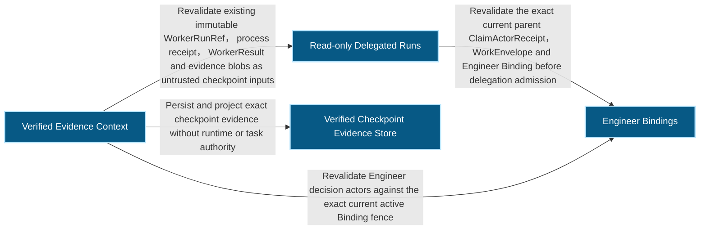
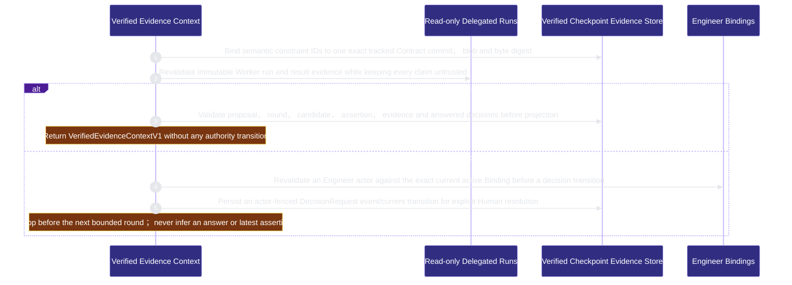

# runtime-harness/verified-context 架構文檔

<!-- BEGIN ARCHCONTEXT:generated target="projection_target.entity.capability-runtime-harness-verified-context" sourceDigest="sha256:232fb84e3e51720488a93ca7ca6fbbbe81ce15ac07e031faf4a85f6dcc780e7e" rendererVersion="archcontext.docs-renderer/v4" outputDigest="sha256:669d3a41e2c42efc35d361452189af9c49a0d680210775c55ba10d9d1cfc57ad" -->
> **狀態**:`active`
> **Capability ID**:`capability.runtime-harness.verified-context`(kind `capability`)
> **Matched Prefixes**:`src/core/engineers/verified-context.ts`、`src/effects/engineers/verified-context-store.ts`、`src/cli/commands/verified-context.ts`
> **Local Contracts**:`AGENTS.md`、`CLAUDE.md`
> **事實優先級**:倉庫當前狀態 > 本文檔機器區 > 本文檔人工區。機器區(引言、§1、§2)由 ArchContext 從架構模型與源碼度量投影生成,手改會在下次投影被覆蓋。本文檔不記錄出處;本次投影所驗證的 commit 見 `docs/architecture/.projection-manifest.json`。

Projects exact Contract constraints, candidate-bound verification checkpoints and Human-fenced decisions into one content-addressed trusted/untrusted context packet.

## 1. P1:能力架構地圖

### 1.1 架構圖

- Proof: `proven` (`sha256:f89eb9ac51dcefd7469532cd4664e6ae88156d11bccdac09fca239172722dee9`).
- Semantic nodes: `4`; declared relations: `4`.

### 1.2 模組職責表

| 宣告入口 | 錨點 | 職責 |
| --- | --- | --- |
| `entrypoint.verified-context.contract` | `src/effects/engineers/verified-context-store.ts#projectSemanticContract` | `sink.verified-context.contract-schema` → `src/core/engineers/verified-context.ts#buildSemanticContractProjection` |
| `entrypoint.verified-context.delegated-evidence` | `src/effects/engineers/verified-context-store.ts#readVerifiedWorkerResultEvidence` | `sink.verified-context.worker-result` → `src/effects/engineers/delegated-run-store.ts#readDelegatedRunResult` |
| `entrypoint.verified-context.compile` | `src/effects/engineers/verified-context-store.ts#compileVerifiedCheckpointProjection` | `sink.verified-context.compile-schema` → `src/core/engineers/verified-context.ts#compileVerifiedEvidenceContext` |
| `entrypoint.verified-context.decision` | `src/effects/engineers/verified-context-store.ts#buildVerifiedDecisionEvent` | `sink.verified-context.decision-schema` → `src/core/engineers/verified-context.ts#buildDecisionRequestEvent` |
| `entrypoint.verified-context.binding-fence` | `src/effects/engineers/verified-context-store.ts#validateCurrentDecisionEngineerBinding` | `sink.verified-context.binding-current` → `src/effects/engineers/binding-store.ts#readEngineerBindingStatus` |

### 1.3 規模信號

- 規模量級:`2–5` 個文件 / `1000–2000` 行
- 匹配前綴:`src/core/engineers/verified-context.ts`、`src/effects/engineers/verified-context-store.ts`、`src/cli/commands/verified-context.ts`
- 推導:掃描 `source.include` 減 `source.exclude`,跳過 `.git/` 與 `node_modules/`,再按 1–2–5 階梯分桶。精確計數不入本文檔:量級足以回答「這個能力有多大」,而逐行計數會讓覆蓋範圍內任何一次源碼改動都改寫本文檔。

### 1.4 依賴邊界

出向關係:

- `calls` → `capability.runtime-harness.delegated-runs` — Revalidate existing immutable WorkerRunRef, process receipt, WorkerResult and evidence blobs as untrusted checkpoint inputs
- `calls` → `capability.runtime-harness.engineer-bindings` — Revalidate Engineer decision actors against the exact current active Binding fence
- `calls` → `component.verified-context.primary` — Persist and project exact checkpoint evidence without runtime or task authority

入向關係:

- 無。

## 2. P2:端到端數據流

> **Proof**: `proven` (`sha256:f89eb9ac51dcefd7469532cd4664e6ae88156d11bccdac09fca239172722dee9`); selectors `5/5`.

<!-- END ARCHCONTEXT:generated target="projection_target.entity.capability-runtime-harness-verified-context" -->

## 3. P3:設計決策與不變量

## 4. 歷史決策記錄(append-only)

## Optimization Backlog
