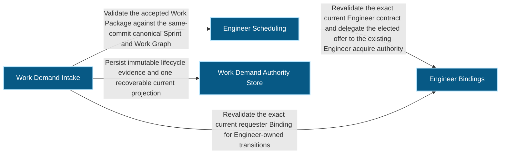
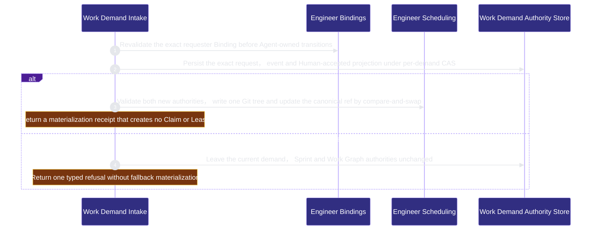

# runtime-harness/work-demand 架构文档
<!-- BEGIN ARCHCONTEXT:generated target="projection_target.entity.capability-runtime-harness-work-demand" sourceDigest="sha256:192e17844f0c2df68cffa64821e48ec677a357bd1989480ef3954a76f687c4ea" rendererVersion="archcontext.docs-renderer/v4" outputDigest="sha256:ff7b43266866c78e6b4e488acd21a1484ce086bdace242e3415ab5bf39de2726" -->
> **狀態**:`active`
> **Capability ID**:`capability.runtime-harness.work-demand`(kind `capability`)
> **Matched Prefixes**:`src/core/engineers/work-demand.ts`、`src/effects/engineers/work-demand-store.ts`、`src/effects/engineers/work-demand-materialization.ts`
> **Local Contracts**:`AGENTS.md`、`CLAUDE.md`
> **事實優先級**:倉庫當前狀態 > 本文檔機器區 > 本文檔人工區。機器區(引言、§1、§2)由 ArchContext 從架構模型與源碼度量投影生成,手改會在下次投影被覆蓋。本文檔不記錄出處;本次投影所驗證的 commit 見 `docs/architecture/.projection-manifest.json`。

Owns durable Agent-originated work requests, Human-frozen backlog projections and atomic Sprint plus Work Graph materialization without creating execution authority.

## 1. P1:能力架構地圖

### 1.1 架構圖

- Proof: `proven` (`sha256:7f26c078e32e16ba967f44fbef6b1fde73fce7388d7a7c92f7fcbf2a025951fe`).
- Semantic nodes: `4`; declared relations: `4`.

### 1.2 模組職責表

| 宣告入口 | 錨點 | 職責 |
| --- | --- | --- |
| `entrypoint.work-demand.event` | `src/core/engineers/work-demand.ts#buildWorkDemandEvent` | `sink.work-demand.digest` → `src/core/messages/mechanics.ts#canonicalMessageDigest` |
| `entrypoint.work-demand.binding` | `src/effects/engineers/work-demand-store.ts#validateEngineer` | `sink.work-demand.binding` → `src/effects/engineers/binding-store.ts#readEngineerBindingStatus` |
| `entrypoint.work-demand.materialize` | `src/effects/engineers/work-demand-materialization.ts#materializeWorkDemand` | `sink.work-demand.graph` → `src/core/engineers/scheduling.ts#projectWorkGraph` |

### 1.3 規模信號

- 規模量級:`2–5` 個文件 / `500–1000` 行
- 匹配前綴:`src/core/engineers/work-demand.ts`、`src/effects/engineers/work-demand-store.ts`、`src/effects/engineers/work-demand-materialization.ts`
- 推導:掃描 `source.include` 減 `source.exclude`,跳過 `.git/` 與 `node_modules/`,再按 1–2–5 階梯分桶。精確計數不入本文檔:量級足以回答「這個能力有多大」,而逐行計數會讓覆蓋範圍內任何一次源碼改動都改寫本文檔。

### 1.4 依賴邊界

出向關係:

- `calls` → `capability.runtime-harness.engineer-bindings` — Revalidate the exact current requester Binding for Engineer-owned transitions
- `calls` → `capability.runtime-harness.engineer-scheduling` — Validate the accepted Work Package against the same-commit canonical Sprint and Work Graph
- `calls` → `component.work-demand.primary` — Persist immutable lifecycle evidence and one recoverable current projection

入向關係:

- 無。

## 2. P2:端到端數據流

> **Proof**: `proven` (`sha256:7f26c078e32e16ba967f44fbef6b1fde73fce7388d7a7c92f7fcbf2a025951fe`); selectors `3/3`.

<!-- END ARCHCONTEXT:generated target="projection_target.entity.capability-runtime-harness-work-demand" -->
## 3. P3: 设计决策与不变量

请求文本和 advisory urgency/dependency hints 始终是未信任输入。Human acceptance 冻结真正的 Task 与 Work Package 字节；materialization receipt 只证明创建工作，不创建 Claim、Lease 或 WorkEnvelope。10x 规模下首先受压的是 Git-common-dir 的逐 demand 文件枚举，单 demand 锁与原子 ref 更新仍保持正确；届时可增加可重建索引，不改变权威文件。
