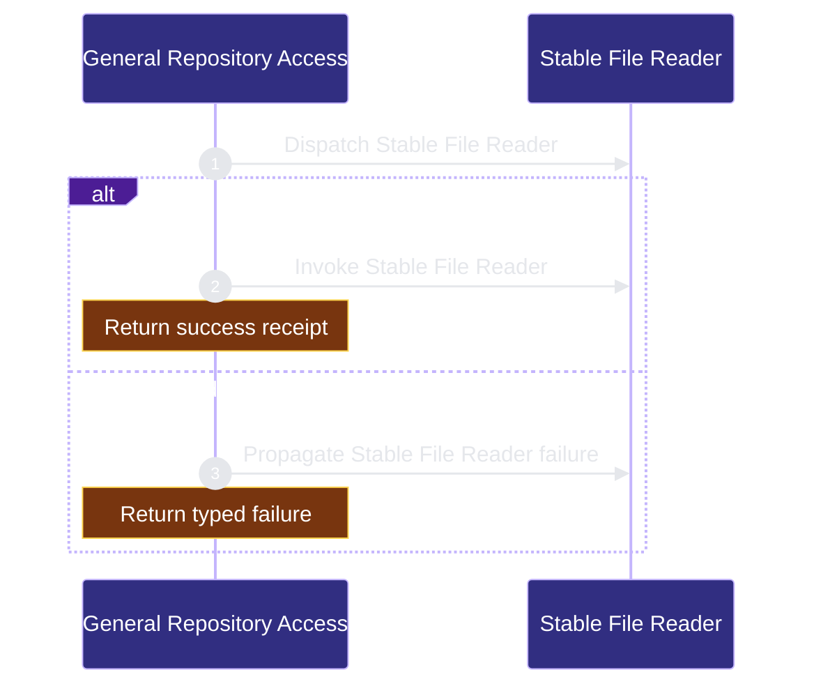

# runtime-mcp/general-repo-access 架构文档
<!-- BEGIN ARCHCONTEXT:generated target="projection_target.entity.capability-runtime-mcp-general-repo-access" sourceDigest="sha256:6d50fa43d5583ee0ef25afa1363333f11f3559475cae0f8dd61d8973925acf41" rendererVersion="archcontext.docs-renderer/v2" outputDigest="sha256:a710d9acbc0dee9f94a37afd55cb14325dc04df8b8ee5e86ea0b969438963196" verifiedAgainst="main@1495a1d6d3b60b8b442061a420f443432e140791@2026-08-12T21:59:27+08:00" -->
> **狀態**:`active`
> **Verified against**:`main@1495a1d6d3b60b8b442061a420f443432e140791`(2026-08-12)
> **Capability ID**:`capability.runtime-mcp.general-repo-access`(kind `capability`)
> **Matched Prefixes**:`src/cli/mcp/general-repo-access.ts`、`src/cli/mcp/general-repo-access/**`、`tests/cli/mcp-reader-tools.test.ts`、`tests/cli/mcp-codegraph-contract.test.ts`、`tests/cli/mcp-policy.test.ts`、`tests/cli/mcp-tools.test.ts`
> **Local Contracts**:`AGENTS.md`、`CLAUDE.md`
> **事實優先級**:倉庫當前狀態 > 本文檔機器區 > 本文檔人工區。機器區(引言、§1、§2)由 ArchContext 從架構模型與 Git 狀態投影生成,手改會在下次投影被覆蓋。

Exposes bounded read-only repository tools through MCP.

## 1. P1:能力架構地圖

### 1.1 架構圖


- Proof: `proven` (`sha256:06213d431dd01abc74ce121eda4dc4f2f3214010b462616665feb9c7a828fe26`).
- Semantic nodes: `2`; declared relations: `1`.

### 1.2 模組職責表

| 宣告入口 | 錨點 | 職責 |
| --- | --- | --- |
| `entrypoint.general-repo-access.primary` | `src/cli/mcp/reader-tools.ts#callReaderTool` | `sink.general-repo-access.primary` → `src/cli/mcp/general-repo-access.ts#callGeneralRepoTool` |

### 1.3 規模信號

- 文件數:`6`
- 總行數:`6727`
- 匹配前綴:`src/cli/mcp/general-repo-access.ts`、`src/cli/mcp/general-repo-access/**`、`tests/cli/mcp-reader-tools.test.ts`、`tests/cli/mcp-codegraph-contract.test.ts`、`tests/cli/mcp-policy.test.ts`、`tests/cli/mcp-tools.test.ts`
- 復算:`archctx docs plan --json`(掃描 `source.include` 減 `source.exclude`,跳過 `.git/` 與 `node_modules/`)

### 1.4 依賴邊界

出向關係:

- `calls` → `component.general-repo-access.primary` — Read a repository file

入向關係:

- 無。

## 2. P2:端到端數據流

> **Proof**: `proven` (`sha256:06213d431dd01abc74ce121eda4dc4f2f3214010b462616665feb9c7a828fe26`); selectors `1/1`.


<!-- END ARCHCONTEXT:generated target="projection_target.entity.capability-runtime-mcp-general-repo-access" -->
## 3. P3：设计决策与不变量

设计出处见 `docs/architecture/decisions/20260622-general-repo-codegraph-access.md`（Sprint 0 contract freeze，2026-06-22）。该 ADR 的核心判断——「不要把授权和索引搅在一起」——在当前源码里逐条可验证。

### 3.1 不变量（源码复验）

| # | 不变量 | 复验点 |
| --- | --- | --- |
| I1 | 路径先被授权，再调用 CodeGraph | `readFilePayload` 的 `resolveRepoPath` 与 `readStableResolvedFile` 与 CodeGraph 结果完全解耦；`snapshot.entriesByPath` 只提供 `indexed` 标志 |
| I2 | 每个从 CodeGraph 回来的路径要重新过 root 包含与 `.ignore` | `codeGraphMetadataIndex()`（`:1020`）在合并前过滤，`filteredPaths` 计数进响应 |
| I3 | `repo_manifest` 是可见文件集权威，search 不是完整性证明 | manifest 走安全文件系统 walk（`walkVisibleEntries`），`search_text` 的候选集来自 snapshot.entries，且**从不**调用 adapter 的搜索能力 |
| I4 | 传输上限只产生分页/分块/显式错误，不从 manifest 里删文件 | `pageEntries()`（`:1331`）与 `next_cursor`；`repo_manifest` 用流式分页而非截断 |
| I5 | 二进制与不可读条目仍以元数据可见 | `metadataForResolved()` 对不可读条目仍产出 entry；`read_file` 才抛 `BINARY_CONTENT` |
| I6 | 写工具必须有 `read_write` + revision 前置条件 | `assertRepoWriteEnabled()` 在四个写工具与 `refresh_repo_index` 的第二行；覆盖/patch/move/delete 全部强制 `expected_sha256`，新建强制 `must_not_exist` |
| I7 | 文件正文不进日志、审计、trace、错误 | 事件只写 `file_hashes`、`relative_paths`、revision；错误 message 过 `redactMcpText` |
| I8 | 外部工具面只认 `repo_id` + repo-relative path | 所有 `inputSchema` 无绝对路径字段；`normalizeRepoRelativePath` 直接拒绝绝对路径 |
| I9 | 目录形状变更不在 v1 变更层 | `move_path` / `delete_path` 只接受 regular file，目标父目录必须已存在，无递归删除 |

### 3.2 约束与权衡

- **`.ignore` 是唯一内容级排除源。** `.gitignore`、`.rgignore`、dotfile、隐藏目录、扩展名、工作流产物身份都不是隐式策略。唯一的硬编码例外是 `.ignore` 文件自身恒被排除（`authority.ts:285`）——这是 ADR 文本里没写出来的一条额外规则。
- **CodeGraph 是元数据来源，不是读取后端。** ADR 写的是「CodeGraph owns indexed code discovery and symbol/text retrieval where it can provide them」，但当前实现里 `GeneralRepoCodeGraphAdapter.searchText`（`codegraph-adapter.ts:59`）**零生产消费者**——`search_text` 全程自己扫文件，只用 `entry.indexed` 决定 `backend` 标签。这是**已实现、保留字段**，不是已接线能力。
- **快照优先于性能。** `SNAPSHOT_TTL_MS = 5min`、`MAX_SNAPSHOT_CACHE_ENTRIES = 16`、`MAX_ENTRY_METADATA_CACHE_ENTRIES = 200,000`。walk 完还要 `validateSnapshotRevision` 复算一遍 digest；漂移时最多重建一次，仍漂移就把 `stale` / `partial` 如实返回而不是重试到成功。
- **变更层是 portable v1。** 保留 mode bits，不保留 ownership、xattr、平台特有元数据；mtime 随提交改变。无覆盖改名靠 `bun:ffi` 直调三个平台的原生 syscall（`:1684`–`:1714`），代价是这一段绑死 Bun runtime。
- **锁是跨进程的但基于文件系统。** `linkSync` + owner.json + PID 存活检测。在 NFS 或容器跨节点共享的仓库上，PID 存活检测会误判。
- **权威只抽了安全逻辑。** dispatch 留在 `general-repo-access.ts`，没有引入插件接口或公共 API。代价是 2,924 行的单文件；收益是新增工具不需要跨模块协商契约。

### 3.3 10x 规模下先垮的点

按当前实现，压力顺序是：

1. **单仓库文件数 10x（≈ 数十万条目）。** `buildVisibleEntrySnapshot` 是全量同步 walk，`ENTRY_METADATA_CACHE` 上限 200k 条会开始抖动，`get_repo_capabilities` / `search_text` / 每次 mutation 响应都各重建一次快照。这是最先垮的。
2. **注册仓库数 10x。** `resolveRepo()` 每次调用都重跑 `uniqueRepoRecords()` → 读注册表 + 对每个仓库 `statSync`/`realpathSync`，是 O(N) 全表扫描，没有缓存。
3. **并发 MCP 会话 10x。** `SNAPSHOT_CACHE` 只有 16 条且是进程内全局，跨仓库共享；多仓库并发会互相驱逐，退化成每次全量重建。
4. **变更频率 10x。** `index-events.jsonl` 只追加不轮转，`readRecentIndexEvents()` 每次 refresh 都要读尾部；`refreshRepo` 走的是 repo 级 `codegraph sync`（`path_refresh_supported: false`），单次变更触发全仓重索引。

内部模块边界（entry ↔ authority）不会先垮——先垮的都是注册表查找与快照/缓存失效，这与 ADR 的 P3 判断一致。

## 4. 历史决策记录（append-only）

本文件在 main@13686d8d 之前的版本没有带日期的章节，因此没有需要保留的日期段落。为不丢失原始判断，改写前的英文原文逐字保存于下：

### 2026-08-08 之前的原始模块文档（verbatim, pre-rewrite）

> # Architecture Module: runtime-mcp/general-repo-access
>
> > **Capability ID**: `runtime-mcp-general-repo-access`
> > **Matched Prefixes**: `src/cli/mcp/general-repo-access.ts`, `src/cli/mcp/general-repo-access`, focused MCP reader/policy/tool tests
> > **Local Contracts**: `AGENTS.md`, `CLAUDE.md`
>
> ## P1 Map
>
> This capability owns the registered-repository access tool implementation and its path-authority safety boundary.
>
> - `src/cli/mcp/general-repo-access.ts` remains the single MCP tool-definition and dispatch owner.
> - `src/cli/mcp/general-repo-access/authority.ts` owns internal repository identity, ignore policy, repo-relative path normalization, symlink containment, and registered-repo checks.
> - Existing MCP auth, audit, policy, workspace, and CodeGraph modules remain sibling dependencies; this capability does not create a plugin interface or public API.
>
> The MCP tool names, input schemas, result shapes, and audit records are public behavior and remain unchanged.
>
> ## P2 Trace
>
> Concrete route: MCP request -> authentication and policy -> registered repo resolution -> path/ignore/containment validation -> read or mutation dispatch -> audit/result. Authority and path checks run before filesystem or index access. Invalid repository identity, traversal, ignored paths, symlink escape, or stale mutation preconditions fail closed.
>
> ## P3 Decision
>
> Extract only the safety logic shared by read, search, write, patch, move, and delete paths. Keep dispatch in the existing entrypoint so the change shrinks one proven responsibility without adding an extension system. At 10x repository count, registry lookup and snapshot/cache invalidation fail before the internal module boundary does.
>
> ## Verification
>
> - `bun test tests/cli/mcp-reader-tools.test.ts tests/cli/mcp-codegraph-contract.test.ts`
> - `bun test tests/cli/mcp-policy.test.ts tests/cli/mcp-tools.test.ts`
> - `bun run check:type`

## Verification

来自 `.ai/context/capabilities.json` 的 `verification_hints`：

```bash
bun test tests/cli/mcp-reader-tools.test.ts tests/cli/mcp-codegraph-contract.test.ts
bun test tests/cli/mcp-policy.test.ts tests/cli/mcp-tools.test.ts
bun run check:type
```
