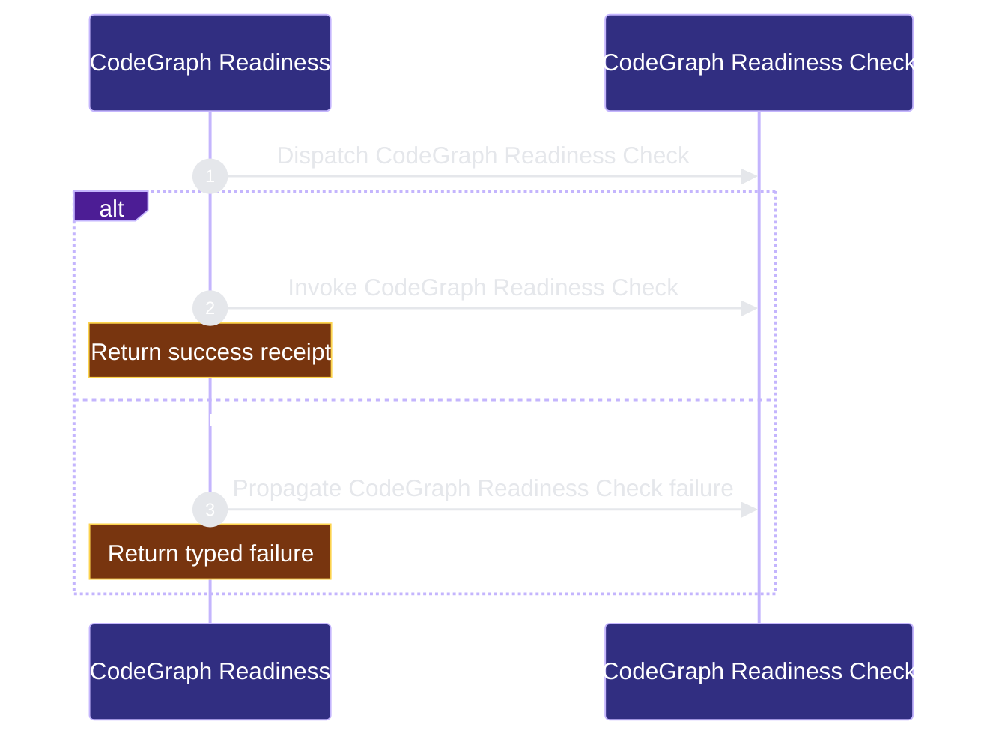

# verification/codegraph-readiness 架构文档
<!-- BEGIN ARCHCONTEXT:generated target="projection_target.entity.capability-verification-codegraph-readiness" sourceDigest="sha256:d7227e9a523c174482329de071e53fca93c9d0936dbdcc5be70065a006d7783f" rendererVersion="archcontext.docs-renderer/v4" outputDigest="sha256:385eae056b2e6fa98d5d9d85d6acd36191d5a705c20f9dcfd0bb5d5d2ad2e8f1" -->
> **狀態**:`active`
> **Capability ID**:`capability.verification.codegraph-readiness`(kind `capability`)
> **Matched Prefixes**:`scripts/ensure-codegraph.sh`、`src/cli/tools/codegraph.ts`、`src/cli/mcp/codegraph-adapter.ts`、`tests/cli/codegraph-resolver.test.ts`、`docs/architecture/modules/verification/codegraph-readiness.md`
> **Local Contracts**:`AGENTS.md`、`CLAUDE.md`
> **事實優先級**:倉庫當前狀態 > 本文檔機器區 > 本文檔人工區。機器區(引言、§1、§2)由 ArchContext 從架構模型與源碼度量投影生成,手改會在下次投影被覆蓋。本文檔不記錄出處;本次投影所驗證的 commit 見 `docs/architecture/.projection-manifest.json`。

Resolves and verifies the repository CodeGraph runtime and index readiness.

## 1. P1:能力架構地圖

### 1.1 架構圖


- Proof: `proven` (`sha256:272869a741b414a399c49e3b3151dfb86771675452d083287682304fec3721e6`).
- Semantic nodes: `2`; declared relations: `1`.

### 1.2 模組職責表

| 宣告入口 | 錨點 | 職責 |
| --- | --- | --- |
| `entrypoint.codegraph-readiness.primary` | `src/cli/tools/codegraph.ts#ensureCodegraph` | `sink.codegraph-readiness.primary` → `src/cli/tools/codegraph.ts#checkCodegraph` |

### 1.3 規模信號

- 規模量級:`5–10` 個文件 / `1000–2000` 行
- 匹配前綴:`scripts/ensure-codegraph.sh`、`src/cli/tools/codegraph.ts`、`src/cli/mcp/codegraph-adapter.ts`、`tests/cli/codegraph-resolver.test.ts`、`docs/architecture/modules/verification/codegraph-readiness.md`
- 推導:掃描 `source.include` 減 `source.exclude`,跳過 `.git/` 與 `node_modules/`,再按 1–2–5 階梯分桶。精確計數不入本文檔:量級足以回答「這個能力有多大」,而逐行計數會讓覆蓋範圍內任何一次源碼改動都改寫本文檔。

### 1.4 依賴邊界

出向關係:

- `calls` → `component.codegraph-readiness.primary` — Verify CodeGraph readiness

入向關係:

- 無。

## 2. P2:端到端數據流

> **Proof**: `proven` (`sha256:272869a741b414a399c49e3b3151dfb86771675452d083287682304fec3721e6`); selectors `1/1`.


<!-- END ARCHCONTEXT:generated target="projection_target.entity.capability-verification-codegraph-readiness" -->
## 3. P3：设计决策与不变量

不变量：

1. **只读即只读。** `--check` 路径绝不执行 `bun install`、`codegraph init`、`codegraph sync`、`codegraph install`。这条由 `tests/cli/codegraph-resolver.test.ts` 用"假 codegraph 在 init/sync/install 上 exit 2"的方式硬性钉死，而不是靠 code review。
2. **探测单一权威。** readiness 判定只有 `check-agent-tooling.sh#detectCodeGraph` 一个来源；`src/cli/tools/codegraph.ts` 是它的消费者与格式化层。任何在 TS 侧重新实现"找二进制/读配置"的代码都是重复权威。
3. **本地依赖优先于全局。** 解析顺序为 `AGENTIC_DEV_CODEGRAPH_LOCAL_BIN` → `node_modules/@colbymchenry/codegraph-<platform>-<arch>/bin/codegraph` → `node_modules/.bin/codegraph` → PATH 上的 `codegraph`（`:1398` 起，候选顺序见 `:1404`-`:1408`）。落到 global 而仓库又声明了本地依赖，会被显式判为 `partial` 而非静默通过。
4. **配置写入必须显式。** host MCP 配置只在 `tools configure codegraph` 或 `init --configure-codegraph-mcp` 下被改写；`install` 与默认 ensure/check 路径零写入。
5. **MCP 执行面不信任 repo 内的可执行文件。** `server.ts:133` 以 `allowRepoLocalBin: false` 构造适配器，PATH 中位于 repo 内的目录被剔除，repo 内的显式 bin 覆盖被拒绝。这是防"被索引的仓库反向控制索引器"的边界，不是性能取舍。
6. **下游生成仓库默认走全局 MCP。** 本自托管仓库把 CodeGraph 作为 devDependency 是特例；生成的下游仓库保持全局默认，除非本地 policy 显式选择 vendored 依赖。

约束与取舍：

- 用 shell shim 包 TS 逻辑，是为了让 hooks、文档、`check-agent-tooling.sh` 的 `ensure_command` 字段都能引用一个稳定的路径字符串，同时保持逻辑在可测试的 TS 侧。代价是多一层 `exec` 和一条 bun 缺失的 fail-closed 分支。
- host 配置改写用正则（TOML）与 JSON 原地修改而非完整重写，是为了保留用户文件里其余内容与尾随换行（`:395`、`:496`）。代价是 TOML 侧的 section 正则（`:273`）对非常规排版脆弱——找不到 section 时选择 `skipped` 而非猜测，符合 fail-closed。
- `configureCodegraph` 把失败编码为 `actions[]` 而不是抛异常，是因为它是多目标（codex + claude）批处理：一个 host 失败不应吞掉另一个 host 的结果。

10x 规模下先垮的点：

- **`discoverRepo` 的全量文件列表。** `codegraph files --format flat --json` 的输出在适配器里被整体 `JSON.parse` 到内存，上限只有 `MAX_STDOUT_BYTES = 10MiB`（`:63`）与 5s 默认超时（`:62`）。仓库文件数量上一个数量级后，先撞的是这两个常量，表现为 `INDEX_UNAVAILABLE` 而非慢——而且它在每次 manifest/snapshot 构建时都被重新调用，没有跨调用缓存。
- **`revisionFor` 的 O(n log n) 排序 + 全量 JSON 序列化**（`:130`）在同一条路径上重复执行，是第二个压力点。
- readiness 链本身不随仓库规模增长（固定几次 `--version`/`status` 调用），先垮的会是 `codegraph status .` 的 1.5s 超时，届时 `project_index.status` 退化为 `unavailable`，进而把整体 status 拉到 `partial`。

## 4. 历史决策记录（append-only）

原模块文档（`Last Updated: 2026-05-28`）全文逐字保留，未作翻译或改写：

````markdown
# CodeGraph Readiness

> **Domain**: verification
> **Capability**: codegraph-readiness
> **Status**: Active slice
> **Last Updated**: 2026-05-28

## Responsibility

Make CodeGraph readiness observable through the repo tooling surface without
changing host adapter installation semantics.

## Boundaries

- `scripts/check-agent-tooling.sh` is the read-only detector and reports
  local/global binary resolution, MCP registration, project index status, and
  update status.
- `scripts/ensure-codegraph.sh` is the mutating entrypoint for local dependency
  installation and index init/sync.
- `src/cli/tools/codegraph.ts` owns CLI resolution and
  `src/cli/mcp/codegraph-adapter.ts` owns MCP index integration.
- `repo-harness install --target codex|claude|both` remains host adapter
  installation only.
- MCP config writes stay explicit and out of the default ensure/check path.

## Runtime Flow

```text
bun install
  -> node_modules/.bin/codegraph
  -> scripts/check-agent-tooling.sh --json reports source=local

scripts/ensure-codegraph.sh --check --json
  -> scripts/check-agent-tooling.sh --json --host codex
  -> read-only report

scripts/ensure-codegraph.sh --init|--sync
  -> local CodeGraph binary first
  -> global fallback only when local is absent
  -> no MCP config writes
```

## Invariants

- Read-only checks must not run `bun install`, `codegraph init`,
  `codegraph sync`, or `codegraph install`.
- Repo-local `node_modules/.bin/codegraph` wins over global `codegraph`.
- Generated downstream repos keep the global MCP default unless local policy
  explicitly opts into a vendored dependency.
- `_ref/` CodeGraph checkouts are reference material only and are not part of
  the committed readiness surface.

## Verification

- `bun test tests/check-agent-tooling.test.ts tests/cli/codegraph-resolver.test.ts`
- `bash scripts/ensure-codegraph.sh --check --json`
- `bash scripts/check-agent-tooling.sh --host both --strict-readiness --json`
````

### 与当前源码的偏差记录（2026-08-08 复核）

以下三处历史 prose 与 main@13686d8d 源码不一致，按事实优先级以源码为准：

1. "`scripts/ensure-codegraph.sh` is the mutating entrypoint" — 该脚本当前只有 16 行，是 `repo-harness tools ensure codegraph` 的 bun shim；变更逻辑在 `src/cli/tools/codegraph.ts#ensureCodegraph`。
2. "`src/cli/mcp/codegraph-adapter.ts` owns MCP index integration" — 该文件是 repo-harness **自身 MCP server** 读取 CodeGraph 索引的适配器（`discoverRepo`/`refreshRepo`），与 host MCP 配置注册无关；host MCP 配置由 `configureCodegraph` 负责。
3. "Repo-local `node_modules/.bin/codegraph` wins over global" — 方向正确但不完整：平台包 `node_modules/@colbymchenry/codegraph-<platform>-<arch>/bin/codegraph` 排在 `node_modules/.bin/codegraph` 之前（`check-agent-tooling.sh:1406`-`:1407`），本仓实测解析到的正是平台包路径。

## 5. Verification

- `bun test tests/check-agent-tooling.test.ts tests/cli/codegraph-resolver.test.ts`
- `bash scripts/ensure-codegraph.sh --check --json`
- `bash scripts/check-agent-tooling.sh --host both --strict-readiness --json`
