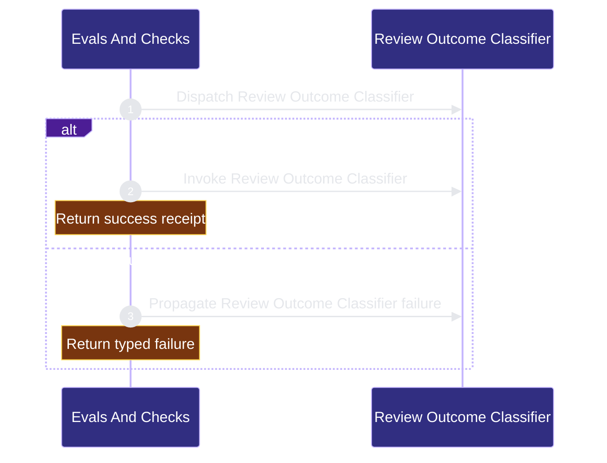

# verification/evals-checks 架构文档
<!-- BEGIN ARCHCONTEXT:generated target="projection_target.entity.capability-verification-evals-checks" sourceDigest="sha256:6d50fa43d5583ee0ef25afa1363333f11f3559475cae0f8dd61d8973925acf41" rendererVersion="archcontext.docs-renderer/v2" outputDigest="sha256:7b0fbb9eca77918bc2cdf77cfa9ca05b01cb19bb6de8cce2925869e8f4b15e8a" verifiedAgainst="main@c30f08fcf306b15911f300288bd10cbff03d5377@2026-08-12T23:03:40+08:00" -->
> **狀態**:`active`
> **Verified against**:`main@c30f08fcf306b15911f300288bd10cbff03d5377`(2026-08-12)
> **Capability ID**:`capability.verification.evals-checks`(kind `capability`)
> **Matched Prefixes**:`tests/**`、`evals/**`、`scripts/run-skill-evals.ts`、`scripts/run-harness-profile-benchmark.ts`、`scripts/validate-harness-profile-benchmark.ts`、`scripts/run-bounded-verifier-command.ts`、`scripts/verify-contract.sh`、`scripts/verify-sprint.sh`、`scripts/check-task-workflow.sh`、`scripts/check-task-sync.sh`、`scripts/check-agent-tooling.sh`、`scripts/check-brain-manifest.sh`、`scripts/sync-brain-docs.sh`
> **Local Contracts**:`AGENTS.md`、`CLAUDE.md`
> **事實優先級**:倉庫當前狀態 > 本文檔機器區 > 本文檔人工區。機器區(引言、§1、§2)由 ArchContext 從架構模型與 Git 狀態投影生成,手改會在下次投影被覆蓋。

Runs repository verification, contract gates, benchmarks, and evaluation suites.

## 1. P1:能力架構地圖

### 1.1 架構圖

- Proof: `proven` (`sha256:3880bef0552ef076d7a1bf843c9fe14088ac05efe72c205d8e2428a7b1a8518c`).
- Semantic nodes: `2`; declared relations: `1`.

### 1.2 模組職責表

| 宣告入口 | 錨點 | 職責 |
| --- | --- | --- |
| `entrypoint.evals-checks.primary` | `src/cli/commands/cross-review.ts#runCrossReviewCommand` | `sink.evals-checks.primary` → `src/effects/review/cross-review-runner.ts#runCrossReview` |

### 1.3 規模信號

- 文件數:`514`
- 總行數:`167458`
- 匹配前綴:`tests/**`、`evals/**`、`scripts/run-skill-evals.ts`、`scripts/run-harness-profile-benchmark.ts`、`scripts/validate-harness-profile-benchmark.ts`、`scripts/run-bounded-verifier-command.ts`、`scripts/verify-contract.sh`、`scripts/verify-sprint.sh`、`scripts/check-task-workflow.sh`、`scripts/check-task-sync.sh`、`scripts/check-agent-tooling.sh`、`scripts/check-brain-manifest.sh`、`scripts/sync-brain-docs.sh`
- 復算:`archctx docs plan --json`(掃描 `source.include` 減 `source.exclude`,跳過 `.git/` 與 `node_modules/`)

### 1.4 依賴邊界

出向關係:

- `calls` → `component.evals-checks.primary` — Evaluate a cross-model review

入向關係:

- 無。

## 2. P2:端到端數據流

> **Proof**: `proven` (`sha256:3880bef0552ef076d7a1bf843c9fe14088ac05efe72c205d8e2428a7b1a8518c`); selectors `1/1`.

<!-- END ARCHCONTEXT:generated target="projection_target.entity.capability-verification-evals-checks" -->
## 3. P3：设计决策与不变量

### 权威 skill eval 证据边界

- 当 release/readiness 断言依赖 skill effectiveness 时，必须执行 non-dry-run `bun run benchmark:skills --eval <slug>`，并保留 `full_test_count` 与 `effectiveness_authority` 的结构化证据。
- **Non-authoritative smoke** 只证明 harness 接线可运行。`bun run benchmark:skills --dry-run` is not skill-effectiveness evidence，不得升格为发布或就绪证明。

**为什么验证面这么宽。** 本仓库同时是产品源码和自托管样例，自托管 runtime 文件、生成模板、已安装副本三者不得静默漂移。这是整个能力面的根不变量。

**必须守住的不变量：**

1. **生产者/消费者单向分离。** profile benchmark 生产证据，bounded verifier 与 `verify-sprint` 只消费。`is_evidence_producer_command()`（`scripts/verify-contract.sh:512`）把这条边界写成执行前拒绝，而不是靠约定——否则收口 gate 会退化成无界 job runner。
2. **evidence emitter 单一权威。** `scripts/emit-verify-evidence.ts` 是唯一 emitter；已安装 helper 按包布局解析它，缺失时 fail-closed 返回 cannot-bind，从不复制 emitter 或合成证据路径。
3. **有界执行 + 进程组回收。** 每条契约命令跑在自己的 detached 进程组里，共享一个绝对截止点；force-kill 阶段寻址原始 PGID 而非当前 leader，堵住 TERM-resistant 后代的逃逸口。
4. **昂贵通道串行化。** 权威 benchmark 在任何 run workspace/report 变更前取 Git-common-dir expensive-run lock 并跨 provider 生命周期持有；dry-run 与 regrade-only 不占该通道。owner 异常死亡时 token 不可回收，留给人工恢复而非自动重开通道。
5. **非权威永远不能升格。** dry-run eval、无 `--execute` 的 benchmark、`--regrade-existing` 三者的输出形状允许存在，但不得被当作 effectiveness 证据；provider-owned 指标宁可留 null 也不估算。
6. **`## Required Checks` 是唯一清单来源。** `repo-harness-check` skill 不维护自己的副本；该段缺失是首个 blocking finding，不是套用默认清单的理由。

**与现有 prose 的冲突（以源码为准）：**

- 下方 2026-07-14 段落写 `verify-contract.sh` 是 "one fixed 600-second deadline"。当前源码 `scripts/verify-contract.sh:5` 是 `VERIFICATION_BUDGET_MS=1200000`，即 1200 秒（20 分钟）。历史段落按 append-only 原样保留，**当前事实以 1200 秒为准**。
- 旧 P1 段把权威清单写成 `bash scripts/check-task-workflow.sh --strict`；根 `## Required Checks` 现用 `repo-harness run check-task-workflow --strict`（helper runtime 调用形态），且额外含 `bash scripts/check-architecture-sync.sh`。本文 §1.4 按根契约列出。
- `assets/skill-commands/repo-harness-check/SKILL.md` 把 Codex 必需 skill 写作 `health`/`check`/`mermaid`，仓库根 `CLAUDE.md` 写的是 `health`、`check`、`diagram-design`。两处未对齐，本文不替任一方裁定。

**10x 规模下先垮的点。** 不是 verifier，而是全量测试成本与证据生产延迟：183 个测试文件 / 66,345 LOC 已是 `bun test` 的主要壁钟成本，而 3×9 矩阵单次授权跑受 50 分钟绝对预算约束。当前拆分让小切片跑聚焦测试、release/pre-merge 才跑全量 gate；再放大一个量级时，先撑不住的是 benchmark 的 evidence-production latency 与 expensive lane 的串行度，而不是有界验证本身。

## 4. 历史决策记录（append-only）

以下段落逐字保留自本文件的历史版本，不翻译、不改写。

## 2026-08-05 Deployed-helper evidence binding

- `scripts/emit-verify-evidence.ts` remains the single evidence-emitter
  authority. It is already included by the package's declared `scripts/`
  publication surface.
- The installed helper executes from `assets/templates/helpers/` and resolves
  that package-owned emitter through the deterministic package layout before
  the explicit source-checkout override. Direct source-helper execution still
  resolves the emitter as a sibling.
- Missing sibling, package, and explicit source-root locations remain a
  fail-closed cannot-bind result; no emitter copy or synthesized evidence path
  was added.

## 2026-07-14 Verifier Evidence Lifecycle Cutover

- `verify-contract.sh` is a bounded evidence consumer: one fixed 600-second
  deadline covers all declared tests and commands, each child runs in its own
  process group, and timeout terminates descendants while preserving duration,
  signal, exit, and timeout evidence.
- Verifier-owned command lists reject benchmark/provider production, adoption,
  evidence producers, and substantive install before execution. `verify-sprint`
  invokes contract verification read-only and validates an already-produced
  authoritative benchmark report without launching the matrix.
- The profile benchmark owns schema v2 evidence production. Its content subject
  binds runner/scenario/fixture/install/provider-schema inputs; its sidecar binds
  the final JSON and Markdown bytes. Three immutable profile bases feed 27
  isolated writable overlays, preserving the 3x9 matrix with three setup passes.
  Execution uses a fixed two-arm pool and a non-configurable 50-minute absolute
  deadline; provider arms are detached process groups and deadline expiry sends
  termination to the whole group, so producer cost cannot silently exceed its
  declared evidence SLO or orphan provider descendants.
- Each arm records its pre-provider baseline revision. Grading and workspace
  evidence compare that baseline to final `HEAD` plus the working tree, so a
  provider commit or fast-forward remains visible final content instead of
  disappearing from a `git status`-only view. Authoritative execution fails
  fast on the first invalid arm and terminates its in-flight sibling group.
- Workspace overlays are full `--no-hardlinks` clones whose `origin` is replaced
  by a bare repository owned by that arm;
  HOME overlays rebase absolute cache symlinks from the profile base to the arm
  copy. Provider-local merge/push/install behavior therefore cannot write back
  through Git remotes, shared object inodes, or copied absolute links.
- Harness-enabled arms (`adaptive-lite` and `strict-harness`) create a private
  primary clone and expose the graded workspace as its linked `codex/benchmark`
  worktree. Adaptive Lite may rise to Strict from runtime risk signals, so the
  topology must exist before provider execution; guards, provider output,
  focused checks, and the grader then observe one workspace instead of an
  ungraded second-level worktree. Strict alone receives preprojected plan and
  contract inputs. No Harness remains a plain isolated clone. Ignored runtime
  inputs such as the resume projection are materialized again in each graded
  linked workspace after worktree creation.
- Authoritative fail-fast still terminates an in-flight sibling. A sibling with
  no structured provider completion is producer cancellation evidence, not an
  independent product regression.
- At 10x scale the first failure would be evidence-production latency, not the
  verifier. Keeping production explicit and verification bounded prevents a
  closeout gate from becoming an unbounded job runner.

## 2026-07-16 Closeout Runner Guardrails

- P1: bounded verification remains an evidence consumer and the profile
  benchmark remains the evidence producer. Their execution policy now consumes
  neutral process/lock effects without moving evaluator or report authority.
- P2: the bounded verifier's force-kill phase is no longer cancelled when the
  process-group leader exits on TERM; after the fixed grace it still addresses
  the original group, closing the TERM-resistant descendant gap. Authoritative
  benchmark main acquires the Git-common-dir expensive-run lock before any run
  workspace/report mutation and holds its explicit token across the awaited
  provider lifecycle.
- Helper execution uses a launcher start barrier so the PGID is durable before
  target execution. If the async supervisor itself stalls, the synchronous
  facade uses that PGID for its final TERM/grace/KILL backstop rather than
  returning with an untracked descendant group.
- P3: release verification and benchmark production serialize through one
  cross-worktree lock, while dry-run and regrade-only benchmark modes do not
  occupy the expensive lane. During the async provider phase, signal cleanup
  retains each PGID through TERM/grace/KILL and releases the token only after
  every group drains, including when a leader exits first. A signal delivered
  while the benchmark is blocked in a synchronous subprocess is handled only
  after that subprocess returns; abnormal owner death leaves the non-reclaimable
  token for manual recovery instead of reopening the lane. CRG-01 uses only
  short sentinel and linked-worktree regressions; it does not regenerate the
  3x9 matrix or change its subject/evaluator contract.

## 2026-06-12 Architecture Queue Closeout

- The strict workflow required-file surface now tracks
  `scripts/architecture-queue.sh` instead of the retired
  `scripts/architecture-drift.sh`.
- Focused coverage for queue behavior lives in `tests/architecture-queue.test.ts`
  and covers card merge, reindex self-heal, cutoff triage, gate modes, and
  archive roundtrip.
- Existing hook/runtime/contract tests continue to assert hook parity and the
  advisory PostToolUse behavior around architecture queue failures.

## Optimization Backlog

- Add capability registry validation to strict workflow checks once the new registry has one more real edit cycle.
- Keep external tooling probes read-only unless a command explicitly targets tooling maintenance.
- The 2026-07-13 Claude matrix passed 27/27 but measured Adaptive Lite at 496 s,
  69 model calls, and 68 s of hooks versus Strict at 391 s, 55 calls, and 60 s
  of hooks. Optimize cold hook execution and Standard/Strict promotion cost
  before claiming a performance win; do not lower deterministic risk floors.

- `tasks/workstreams/verification/evals-checks/github-issues-158-159.md`
