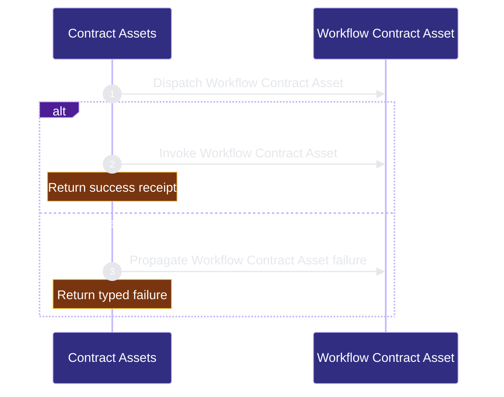

# workflow-engine/contract-assets 架构文档
<!-- BEGIN ARCHCONTEXT:generated target="projection_target.entity.capability-workflow-engine-contract-assets" sourceDigest="sha256:6d50fa43d5583ee0ef25afa1363333f11f3559475cae0f8dd61d8973925acf41" rendererVersion="archcontext.docs-renderer/v2" outputDigest="sha256:4ed97fc0617f36e832189a37a20f4ee0ef42f852f710578ba512170012b2371e" verifiedAgainst="main@c30f08fcf306b15911f300288bd10cbff03d5377@2026-08-12T23:03:40+08:00" -->
> **狀態**:`active`
> **Verified against**:`main@c30f08fcf306b15911f300288bd10cbff03d5377`(2026-08-12)
> **Capability ID**:`capability.workflow-engine.contract-assets`(kind `capability`)
> **Matched Prefixes**:`assets/workflow-contract.v1.json`、`.ai/harness/workflow-contract.json`、`.ai/harness/policy.json`、`.ai/context/context-map.json`、`.archcontext/model/nodes/**`、`scripts/capability-resolver.ts`、`scripts/capability-config.ts`、`scripts/contract-run.ts`、`scripts/contract-worktree.sh`、`scripts/archive-workflow.sh`、`scripts/merge-gate.ts`、`scripts/ship-worktrees.sh`、`src/cli/commands/init.ts`、`src/cli/commands/capability-context.ts`、`src/cli/runtime/helper-runner.ts`、`assets/templates/**`、`assets/reference-configs/**`、`docs/reference-configs/**`
> **Local Contracts**:`assets/AGENTS.md`、`assets/CLAUDE.md`
> **事實優先級**:倉庫當前狀態 > 本文檔機器區 > 本文檔人工區。機器區(引言、§1、§2)由 ArchContext 從架構模型與 Git 狀態投影生成,手改會在下次投影被覆蓋。

Maintains canonical workflow contracts, templates, capability nodes, and helper projections.

## 1. P1:能力架構地圖

### 1.1 架構圖


- Proof: `proven` (`sha256:2b7599e2986a8c54415c65b66011e538f8f58b594a7b656b88404271a91e10c8`).
- Semantic nodes: `2`; declared relations: `1`.

### 1.2 模組職責表

| 宣告入口 | 錨點 | 職責 |
| --- | --- | --- |
| `entrypoint.contract-assets.primary` | `src/core/adoption/workflow-contract-asset.ts#loadWorkflowContractAsset` | `sink.contract-assets.primary` → `src/core/adoption/workflow-contract-asset.ts#readWorkflowContractAsset` |

### 1.3 規模信號

- 文件數:`161`
- 總行數:`45320`
- 匹配前綴:`assets/workflow-contract.v1.json`、`.ai/harness/workflow-contract.json`、`.ai/harness/policy.json`、`.ai/context/context-map.json`、`.archcontext/model/nodes/**`、`scripts/capability-resolver.ts`、`scripts/capability-config.ts`、`scripts/contract-run.ts`、`scripts/contract-worktree.sh`、`scripts/archive-workflow.sh`、`scripts/merge-gate.ts`、`scripts/ship-worktrees.sh`、`src/cli/commands/init.ts`、`src/cli/commands/capability-context.ts`、`src/cli/runtime/helper-runner.ts`、`assets/templates/**`、`assets/reference-configs/**`、`docs/reference-configs/**`
- 復算:`archctx docs plan --json`(掃描 `source.include` 減 `source.exclude`,跳過 `.git/` 與 `node_modules/`)

### 1.4 依賴邊界

出向關係:

- `calls` → `component.contract-assets.primary` — Project the workflow contract

入向關係:

- 無。

## 2. P2:端到端數據流

> **Proof**: `proven` (`sha256:2b7599e2986a8c54415c65b66011e538f8f58b594a7b656b88404271a91e10c8`); selectors `1/1`.


<!-- END ARCHCONTEXT:generated target="projection_target.entity.capability-workflow-engine-contract-assets" -->
## 3. P3：设计决策与不变量

### 3.1 为什么契约资产与 runtime 状态分离

生成仓库必须能在**没有任何服务**的情况下自证。因此 tracked 契约文件是持久真相，而 `.ai/harness/checks/*`、handoff packet、failure log、architecture events、worktrees、run snapshots 全是 ignored runtime 状态。删掉或损坏 ignored 缓存不能让版本回退：`state_version` 是 Git worktree metadata 下的单调计数器，`state_revision` 是确定性内容哈希。

### 3.2 必须守住的不变量

| # | 不变量 | 执行者 |
| --- | --- | --- |
| I1 | asset 契约与自宿主 runtime 副本 byte-identical | `tests/workflow-contract.test.ts:40-45`；写入端只搬字节 |
| I2 | `helpers.scripts` 与 `helpers.descriptions` 1:1，且描述非空 | `helper-runner.ts:254-268` + `tests/workflow-contract.test.ts:199-213` |
| I3 | `helpers.scripts` 是「有哪些 helper」的唯一 id 列表；descriptions 只挂显示数据 | 契约结构 + 上述双向校验 |
| I4 | `.ai/context/capabilities.json` 是 capability 的唯一 runtime 权威 | `capability-resolver.ts` fail-closed；`capability-config add` 是唯一创建路径 |
| I5 | capability context 块、ArchContext node/v2 导出都是单向投影，不是第二作者面 | `capability-context.ts`；`export` 仅接受 `archcontext-nodes-v2`，并由 canonical reader round-trip 验证 |
| I6 | 受保护 helper 的 source/helper/HOME/PATH/解释器解析不受调用者影响 | `protectedChildEnv()`、`resolveHelperRuntime(env, false)` |
| I7 | merge gate 启用位来自**目标 base commit**，candidate 不能自我豁免 | `ship-worktrees.sh:907-911`；`contract-worktree.sh` gate base ref |
| I8 | 51/52 helper 与 `scripts/` byte-identical；唯一例外携带 `@generated-from` 哈希头 | `scripts/sync-helper-sources.ts` `--check` |
| I9 | adoption 事务永不无声覆盖用户内容 | `expectedContentHash` / `expectedAbsent` / move-collision 抛错 |
| I10 | install profile 单一 authored 权威是 `profile`，`components` 是漂移检查过的投影 | `global-runtime.ts:651` + `PROFILE_COMPONENTS` |

### 3.3 已接受的约束与取舍

- **契约是 JSON 而非可执行配置**。代价是表达力弱，收益是 byte-parity 可判定、diff 可读、任何语言都能校验。这是 I1 能成立的前提。
- **超时按类别硬编码而非策略可配**。放弃了「快机器跑快点」的灵活性，换来的是策略文件不能变成拒绝服务或无限挂起的攻击面。
- **闸门在 commit 之后跑**。pre-commit 的 HEAD 无法标识 merge candidate，所以只能先落 commit 再封印；FAIL/BLOCKED 靠恢复 pre-finish commit 与实时工作流工件来回滚。
- **`functional_block_selector` 保留在 context-map 里但自述为 compatibility selector**（`.ai/context/context-map.json`，`rule` 字段原文：`compatibility selector; capability registry is the source of truth`）。这是**已实现、保留字段**：结构在，权威已经移交给注册表。它是有边界的遗留物，不是双权威。
- **`merge-gate` 无 provider 调用**。它是确定性封印，不是语义评审；语义验收由独立的 AcceptanceReceipt 承担。这条边界让闸门可离线、可重放。

### 3.4 10x 规模下先垮的点

按「先垮」排序：

1. **helper 数量增长（当前 52）**。每加一个 helper 要同时改 4 处：`helpers.scripts`、`helpers.descriptions`、`scripts/<name>`、`assets/templates/helpers/<name>`。fail-closed 校验保证漏改会红，但这是**线性增长的手工同步成本**——它已经在真实 ship 中触发过（见第 4 节 2026-07-14 段落记录的 rebase 事件）。第一个撑不住的不是正确性，是改动摩擦。
2. **policy 顶层域数量（当前 29）**。`deepMergeDefaults` 是无 schema 的结构性合并。域数继续涨，「默认值改了但已装仓库不会自动拿到」这类静默偏差会越来越难发现，因为没有 policy schema 版本化与迁移断言。
3. **capability 数量（当前 11）与最长前缀匹配**。`DUPLICATE_PREFIX` 与 `AMBIGUOUS_MATCH` 已经在守，但注册表本身是单文件、人工排序；到几十个 capability 时，「哪个 prefix 该归谁」的判断会先于工具失效。
4. **`assets/templates/` 27k 行**。它是投影，正确性由 `--check` 保证，但每次 helper 改动都在 diff 里翻倍出现，review 信噪比下降。

最小连贯的护栏仍是现有那套：parity 测试 + `sync-helper-sources.ts --check` + `capability-resolver validate` + 自迁移 dry-run。要更进一步，第一刀应是给 `.ai/harness/policy.json` 引入 schema 版本与迁移断言，而不是加抽象。

### 3.5 与历史记录的已知冲突

第 4 节逐字保留，其中三处与 HEAD 源码不符，以本节为准：

| 历史段落 | 历史说法 | HEAD 实际 | 位置 |
| --- | --- | --- | --- |
| 2026-07-16 Closeout Runner Guardrails | `verify-contract`/`verify-sprint` 720 秒 | **1,260 秒**（`VERIFIER_HELPER_TIMEOUT_MS = 1_260_000`） | `src/cli/runtime/helper-runner.ts:13` |
| 2026-07-16 Closeout Runner Guardrails | 900 秒档只含 `contract-worktree`/`ship-worktrees` | 还包含 **`merge-gate`**；`PROTECTED_HELPERS` 另含 `acceptance-receipt` | `helper-runner.ts:12`、`:134-137` |
| 2026-07-14 Helper Descriptions | 46 → 48 条描述 | **52 条**（scripts 与 descriptions 均为 52） | `assets/workflow-contract.v1.json#helpers` |

另有两处已由后续 slice 取代，历史段落本身未改写：

- 旧文档头部与 P1 曾把 `assets/skills/merge-gate/` 列为 matched prefix 与权威文件。该目录在 HEAD **不存在**（`assets/skills/` 下只有 `claude-plan`、`repo-harness-chatgpt`、`repo-harness-cross-review`、`repo-harness-plan`、`repo-harness-product`、`repo-harness-setup`），`.ai/context/capabilities.json` 的 prefix 列表也已移除它。这与 2026-07-21 段落「former host-only merge-gate skill/agent ... are removed」一致。
- 旧 P2 只描述了 shell 路线（`pi_install_workflow_contract` → `pi_write_harness_policy` → …）。这些函数在 `scripts/lib/project-init-lib.sh:917,1675` 仍然存在，但调用者只有 `scripts/create-project-dirs.sh:43` 与 `scripts/init-project.sh:69`，且这两个脚本**不在** `helpers.scripts` 契约清单里。`repo-harness init` 的实际 runtime path 是 §2.1 的 TS 事务模型。

### 2026-08-11 Codex Native Agent Policy Cutover

- The delegation policy now names only native `subagent` transport. Claude
  keeps its native host behavior; Codex requires the exact installed
  `agent_type` and `fork_turns=none`.
- App-thread, `codex-exec`, and main-thread fleet fallbacks are removed from the
  self-host policy and every generated policy projection. A native routing
  mismatch is observable failure, not runner degradation.
- Every new contract template now projects `preferred: [subagent]` with
  `fallback: null`; the contract brief cannot restore an alternate fleet runner
  after policy selection.
- Prompt-hook permission is typed `/delegate` or `/parallel` only. Policy no
  longer grants SessionStart standing authorization or treats natural-language
  classification as permission.

---

## 4. 历史决策记录（append-only）

> 本节逐字保留既有文档中所有带日期的段落，英文不翻译，顺序与原文件一致。仅将标题层级由 `##` 降为 `###` 以嵌入本节；正文一字未改。历史数值与 HEAD 的差异见 §3.5。

### 2026-07-14 Local Merge Gate Enforcement

- P1: installed `contract-worktree` remains the commit/merge authority and
  installed `ship-worktrees` remains the PR push authority. The target base
  policy owns enablement, the OS account home
  `~/.repo-harness/config.json#merge_gate` owns local
  runner identity, the host-only `merge-gatekeeper` agent owns only tool-free model isolation,
  `assets/skills/merge-gate` owns review semantics, and `scripts/merge-gate.ts`
  is the only receipt writer/verifier.
- P2: finish snapshots live workflow state, verifies and archives it, commits
  the exact candidate, and invokes Claude with no tools from an empty temporary
  directory. The stdin request supplies the complete diff,
  goal, changed files, and current deterministic check evidence. A successful
  verdict is stored under `~/.repo-harness/gates/<repo-id>/` and bound to
  repository root, exact base ref/SHA, head SHA, binary diff fingerprint, host
  runtime fingerprint (config, binary identity, agent, and skill), and installed
  helper fingerprint. FAIL/BLOCKED restores
  the pre-finish commit and live workflow artifacts. PR mode fetches the remote
  target and pushes the verified SHA explicitly; local merge also names the
  verified SHA instead of the mutable branch name.
- P3: target-base policy prevents the candidate from disabling its own gate;
  host config and host-state receipts keep runner and receipt authority outside
  the candidate workspace. The gate runs after commit because pre-commit HEAD
  cannot identify the merge candidate. Only Claude is configured in this
  slice; protected helper resolution ignores process-level source/helper/HOME
  overrides and pins its Bash/Git/Bun/gh toolchain outside caller `PATH`.
  There is no provider fallback, GitHub check-run, alternate receipt
  shape, candidate-code execution, or agent-owned write.
- At 10x concurrency the first failure is the remote target advancing after
  fetch. Receipt revalidation rejects any locally observed base or head drift,
  and the explicit SHA refspec prevents a moved local branch from changing what
  is pushed. Remote merge-time freshness remains GitHub branch-protection/CI
  authority rather than a claim made by this local pre-push gate.

### 2026-05-29 Cleanup Script Policy Closeout

- `worktree_strategy.cleanup_script` is part of the policy contract surface. It advertises the terminal cleanup command generated repos can call after `finish` has already archived and merged a contract worktree.
- The runtime owner remains `scripts/contract-worktree.sh`; `.ai/harness/policy.json`, `scripts/ensure-task-workflow.sh`, and `scripts/lib/project-init-lib.sh` only publish the command shape for self-host and generated repos.
- File-prefix capability requests such as `.ai/harness/policy.json` still belong to `workflow-engine-contract-assets`; local capability context is projected to `assets/AGENTS.md` and `assets/CLAUDE.md`.
- No new architecture snapshot or semantic diagram is required because the module boundary, entrypoints, and dependency direction are unchanged.

### 2026-06-12 Architecture Queue Contract Closeout

- The self-host workflow contract helper inventory now names
  `architecture-queue.sh` as the architecture request helper; the retired
  `architecture-drift.sh` is removed from the source and installable helper
  templates.
- `.ai/harness/policy.json` and generated policy templates expose
  `architecture.freshness_gate`, `gate_min_severity`, pending block markers, and
  `queue_script` so slice 2 can promote the gate from advisory to strict without
  changing the queue data model.
- The contract invariant remains byte parity between
  `assets/workflow-contract.v1.json` and `.ai/harness/workflow-contract.json`;
  helper installation stays flat under `scripts/`.

### 2026-07-06 Delegation Policy Auto Mode Closeout

- `.ai/harness/policy.json` now documents that `delegation.mode=auto` is
  install-time standing user authorization for bounded Codex delegation on
  prompts without explicit trigger words.
- Global `~/.repo-harness/config.json` remains the user-level authority for the
  mode choice and takes precedence over repo policy when the value is exactly
  `auto` or `explicit`; repo policy is still the generated/self-host fallback.
- This is a policy text contract change only. It does not change contract asset
  ownership, helper inventory shape, byte-parity requirements, or generated repo
  storage boundaries.

### 2026-07-11 Capability Authority Closeout

- `.ai/context/capabilities.json` is the only runtime capability authority. Resolver commands fail when it is missing or malformed and reject registered prefixes that do not exist.
- `capability-config add` remains the explicit creation path for a new registry; normal reads no longer derive capabilities from `agent-context-blocks.txt`, environment variables, or nested agent files.
- Capability context files and the ArchContext boundary export remain deterministic, one-way projections of the registry. They do not become alternate authoring surfaces.

### 2026-07-11 Archive Evidence Gate Closeout

- `archive-workflow.sh` is the completion archive authority. `Completed` now
  requires a verified `Active` or `Fulfilled` linked contract, the review to
  recommend `pass`, current `verify-sprint` structured evidence, canonical
  external acceptance `pass`, and the architecture freshness helper to succeed
  before any workflow artifact moves. After all gates pass, archive owns the
  `Active -> Fulfilled` transition so verifier/reviewer content cannot be made
  stale by a pre-archive status mutation.
- `Abandoned` and `Superseded` remain non-completion outcomes and preserve the
  complete plan and lifecycle artifact bodies. They do not synthesize passing
  evidence.
- `archive-architecture-request.sh` accepts only a live `Pending` request.
  `Resolved` additionally requires the request's declared architecture module
  to exist and be passed as an existing, repository-contained durable artifact.
  Queue/index projection is rebuilt and checked before and after the move.
- Current-status refresh, architecture reindex, and Sprint backlog back-fill
  failures now propagate to the caller and restore the pre-archive live
  workflow/architecture snapshot. A failed projection can neither be reported
  as a successful finish nor strand the plan/request only in archive storage;
  the same command can be retried after repairing the failed dependency.
- These gates reuse the existing workflow-state, verify-sprint, architecture
  queue, and freshness authorities. No new dependency or compatibility parser
  was added.

### 2026-07-14 Verification Asset Cutover

- The installable helper inventory now includes the bounded-command runner and
  benchmark evidence validator alongside `verify-contract.sh` and
  `verify-sprint.sh`; self-host and product copies remain byte projections.
- Generated contract/review templates emit only canonical completion and Rubric
  v2 subject fields. The retired manual-override, Human Review Card fallback,
  ancestry fingerprint, and report-v1 reader are removed in the same package.
- Report/check projections use one benchmark evidence shape:
  `status`, `report_sha256`, and `benchmark_subject_sha256`.

### 2026-07-13 Deploy SQL Policy Authority

- Optional `.ai/harness/policy.json#operations.deploy_sql` is the sole authority for established alternate SQL roots, naming modes, and invariant files. Its absence keeps the generated `deploy/sql/` plus `ordered4` default.
- Policy generators deliberately do not seed the optional object. Their existing default merge preserves an explicit repo override while avoiding a second steady-state authority.
- Root guidance, generated partials, deploy scaffolds, the deploy skill, and installed hooks are projections of that precedence. Existing parity and scaffold tests guard against self-host/generated drift; the module boundary and dependency direction are unchanged.

### 2026-07-12 Agent Fleet Worker Routing Telemetry Closeout

- `scripts/contract-run.ts` (mirrored byte-for-byte to `assets/templates/helpers/contract-run.ts` through the existing helper projection route) is now a matched prefix of this capability. It is the task-delegation contract runner: it reads a `tasks/contracts/*.contract.md` execution brief, preflights it, generates worker/verifier prompts, optionally dispatches them, and writes a run manifest. This is a distinct "contract" concept from `assets/workflow-contract.v1.json` (the install/workflow contract this capability already owned) — the two share the word by coincidence, not by schema or lifecycle, but both are contract-lifecycle tooling this capability already narrates (compare the pre-existing `scripts/contract-worktree.sh` mention in the 2026-05-29 closeout above).
- Contract roles (`parent`/`explorer`/`worker`/`verifier`; existing generic mode/purpose defaults at `scripts/contract-run.ts:340-346`, unchanged) now also map to the four fixed, model-pinned fleet profiles (`explorer`, `fast-worker`, `deep-reasoner`, `gatekeeper`) through a new `delegation_plan.role_profiles` manifest field (`scripts/contract-run.ts:792-797`):
  - `parent` -> `"orchestrator"`: never model-assigned; not one of the 4 profiles.
  - `explorer` -> `"explorer"` (fixed).
  - `worker` -> derived in `buildRun()` (`scripts/contract-run.ts:754-758`) from the resolved runner dispatch value, without renaming `RunnerContract.preferred`/`fallback`'s pre-existing dispatch-mechanism vocabulary (`subagent` / `codex-subagent` / `codex-exec` / `main-thread`): dispatch `main-thread` -> `"sol-high"`; dispatch `codex-subagent` or `codex-exec` -> the raw dispatch label passed through unchanged (Codex is an independent peer provider, not one of the 4 profiles); any other dispatch (e.g. `subagent`) -> `"fast-worker"`.
  - `verifier` -> `"gatekeeper"` (fixed).
  - `deep-reasoner` sits outside this role table entirely, as an independent escalation path not bound to any single contract role.
- New `--effort <tier>` CLI flag (parsed at `scripts/contract-run.ts:148-151`; validated by the local `EFFORT_TIERS`/`parseEffort()` pair at `scripts/contract-run.ts:190-201` against the closed vocabulary `low`/`medium`/`high`/`xhigh`/`max`, the same tiers `buildFamilyEffortMap()` in `scripts/install-agent-fleet.sh` already uses — kept as a local literal list rather than a shared import because that copy lives inside an embedded Node.js heredoc, not an importable module). Record-only, matching the pre-existing `--runner` philosophy: `contract-run.ts` never itself selects, spawns, or degrades a runner or effort tier. Defaults to `"high"` only when the resolved dispatch is the contract's worker fallback and no explicit `--effort` is passed (`scripts/contract-run.ts:758`).
- New manifest telemetry fields are additive only; `RunnerContract`, `parseRunner()`, `runChild()`, and the run-mode control flow are unchanged:
  - `runner_usage.path`: `"worker_preferred"` | `"worker_fallback"` (`scripts/contract-run.ts:780`).
  - `runner_usage.effort`: resolved effort tier string or `null` (`scripts/contract-run.ts:781`).
  - `delegation_plan.role_profiles`: `{ parent, explorer, worker, verifier }` as derived above (`scripts/contract-run.ts:792-797`).
- Regression coverage lives in `tests/contract-run.test.ts`: the preferred path, the `codex-subagent`/off-policy runner passthrough, the `main-thread` worker-fallback path (`sol-high` plus default effort `"high"`), the `codex-exec` passthrough, and an explicit `--effort xhigh` override sharing one scenario, `"runner metadata from the contract flows into the manifest"` (`tests/contract-run.test.ts:742-891`); invalid `--effort` rejection is `"invalid --effort value exits with usage error"` (`tests/contract-run.test.ts:893-897`).

### 2026-07-12 Repo-owned Agent Fleet Authority Closeout

- `agents/fleet/*.md` is the only authored fleet source and is shipped through
  the existing npm `agents/` package surface. `.claude/agents/*.md` and
  `.codex/agents/*.toml` are deterministic repo-local projections and goldens.
- `.ai/harness/policy.json` declares `external_tooling.agent_fleet` with
  `source: package:agents/fleet`. The retired `fable_agents` key, remote URLs,
  network fetch, source override, and compatibility reader are absent.
- Installer source validation completes for all managed roles before any target
  mutation. Helper-path resolution supports only the declared source-checkout
  and packaged-helper layouts; target-repo cwd never becomes an authority.
- The four managed roles are explorer, deep-reasoner, fast-worker, and
  gatekeeper. Claude receives source bytes; Codex receives the Sol/Luna family
  projection with unchanged effort strings. Gatekeeper remains read-only in
  both sandbox and prompt semantics.
- The first 10x failure would be publishing helpers without their fleet source.
  Tarball-content checks, temporary-HOME package smoke, helper parity, and
  source/projection golden tests guard that distribution boundary.

### 2026-07-12 Agent Fleet Specialist Roles Closeout

- The packaged fleet has six managed identities. `root-cause-prover` produces
  the existing bugfix gate's four evidence fields without changing gate
  semantics; `harness-evaluator` invokes existing skill/adoption evaluation
  surfaces and treats migration audit as a profile rather than another agent.
- The Codex writable-role set is closed and explicit: `fast-worker`,
  `root-cause-prover`, and `harness-evaluator`. Every other projection is
  read-only. Harness-evaluator's workspace-write is valid only inside a
  complete disposable repo/HOME; skills uses the runner's enforcing mode and adoption uses one
  guarded invocation that injects the validated roots into both existing commands. Both reject source or real
  HOME in either argument position. The task contract's
  allowed paths and isolated worktree remain the authority that prevents the
  diagnosis role from turning evidence work into a production fix.
- Native Explore remains host-owned informal capability. Formal explorer work
  resolves to the complete repo-owned persona; no alias, wrapper, inherited
  prompt, incremental merge, or second authored authority participates.
- BDD2 remains an independent sealed evaluation authority. The harness
  evaluator must fail closed on `evals/bdd2/**` or
  `scripts/run-bdd2-evals.ts`, and this work-package does not modify either.
- The first 10x failure would be adding persona names without updating package,
  policy seeds, projections, readiness, and HOME installation together. Exact
  six-role lists, all-source preflight, tarball assertions, and temporary-HOME
  smokes protect that boundary.

### 2026-07-14 Helper Descriptions Contract Surface Closeout

- `assets/workflow-contract.v1.json#helpers.descriptions` is the sole authority for the one-line description of every bundled helper (helper id, filename minus extension, mapped to description text). `helpers.scripts` keeps sole authority over which helpers exist; descriptions attach display data to those ids without introducing a second id list.
- The contract parser fails closed in `src/cli/runtime/helper-runner.ts` (`readContractHelperDescriptions`): a missing `descriptions` object, a scripts entry without a description, an empty or non-string value, or a description key with no matching script is a contract error, so the description map cannot drift from the script list.
- `repo-harness run --help` now renders the full helper enumeration lazily through `listHelpers()` (`src/cli/commands/run.ts`), closing the discovery gap where the 46-helper surface was previously printed only on an unknown-helper failure. `.ai/harness/workflow-contract.json` remains the byte-identical installed mirror of the assets contract; no module boundary, dependency direction, or verification command changed.
- Regression coverage: `tests/workflow-contract.test.ts` (descriptions cover `helpers.scripts` 1:1 with non-empty text) and `tests/cli/run.test.ts` (fail-closed validation plus `run --help` enumeration output).
- The invariant was exercised live at ship time: rebasing onto origin/main added two upstream helpers (`run-bounded-verifier-command.ts`, `validate-harness-profile-benchmark.ts`) and the fail-closed check blocked shipping until their descriptions landed, bringing the map to 48 entries.

### 2026-07-16 Closeout Runner Guardrails

- P1: `src/cli/runtime/helper-runner.ts` remains the canonical helper dispatch
  policy. Ordinary helpers receive a fixed 120-second envelope,
  `verify-contract`/`verify-sprint` receive 720 seconds, and
  `contract-worktree`/`ship-worktrees` receive 900 seconds. Repository policy
  and caller environment cannot redefine these classes.
- P2: every helper runs through a private launcher/supervisor pair. The launcher
  cannot start the target until the supervisor has published its PGID; normal
  cleanup and the parent's hard-timeout backstop both perform TERM, a fixed
  grace period, then KILL against that group. Lock wait consumes the same outer
  deadline, and completion is published only after group absence.
  `ship-worktrees` checks review/acceptance readiness and delegates to
  `contract-worktree finish`; only finish invokes `verify-sprint`, so one ship
  has exactly one sprint-verification producer.
- P3: canonical release helper modes resolve the Git common directory and use
  the same fail-closed expensive-run lane as authoritative benchmark
  production. Nested raw helper calls stay inside the already-held outer lane;
  invoking packaged Bash files directly is an internal/test surface and does
  not create a second lock or verification authority.

### 2026-07-21 Single Acceptance Authority

- The contract's strict `## Acceptance Policy` block freezes reviewer identity
  and whether the named owner may issue `user_waiver`. One host-owned
  UserWaiverGrant records that owner decision against stable contract/goal
  authority. The host-owned AcceptanceReceipt is the exact closeout authority;
  its closed dispositions are `external_pass`, `user_waiver`, and `reject`.
- `verify-sprint --prepare-acceptance` freezes canonical verification evidence.
  Receipt verification binds that evidence, normalized implementation content,
  goal, contract, benchmark evidence, reviewed paths, and target revision.
  Semantic changes invalidate the receipt and require fresh evidence, while an
  unchanged valid waiver grant may rematerialize the new exact receipt without
  repeating the owner's decision. Contract/goal authority changes or explicit
  revocation invalidate the grant. Review Markdown is a generated projection
  and cannot authorize closeout.
- `merge-gate.ts` is now a deterministic local seal. The former host-only
  merge-gate skill/agent and internal Claude call are removed. Lifecycle-only
  head movement is checked against the declared archive manifest; a later
  non-overlapping target advance only reseals the exact base/head/full diff,
  while overlap invalidates semantic acceptance.
- PR CI is the sole candidate-branch lane. `codex/**` push CI is removed and
  workflow concurrency cancels superseded runs for the same PR/ref.

---

## Workstream Ledger

- `tasks/workstreams/workflow-engine/contract-assets/cleanup-script-policy.md`
- `tasks/workstreams/workflow-engine/contract-assets/20260712-contract-assets.md`
- `tasks/workstreams/workflow-engine/contract-assets/agent-fleet-specialists.md`
- `tasks/workstreams/workflow-engine/contract-assets/20260714-merge-gate-enforcement.md`
- `tasks/workstreams/workflow-engine/contract-assets/github-issues-158-159.md`

## Optimization Backlog

- Promote `bun scripts/capability-resolver.ts validate --format text` into the strict workflow gate after one more real architecture slice.
- Keep durable knowledge in repo-authored research and lessons. Optional external brain exports require an operator-invoked manifest sync and never participate in workflow correctness.

## 验证命令

来自 `.ai/context/capabilities.json#verification_hints`：

```bash
bun test tests/workflow-contract.test.ts tests/scaffold-parity.test.ts
bun scripts/capability-resolver.ts validate --format text
```
