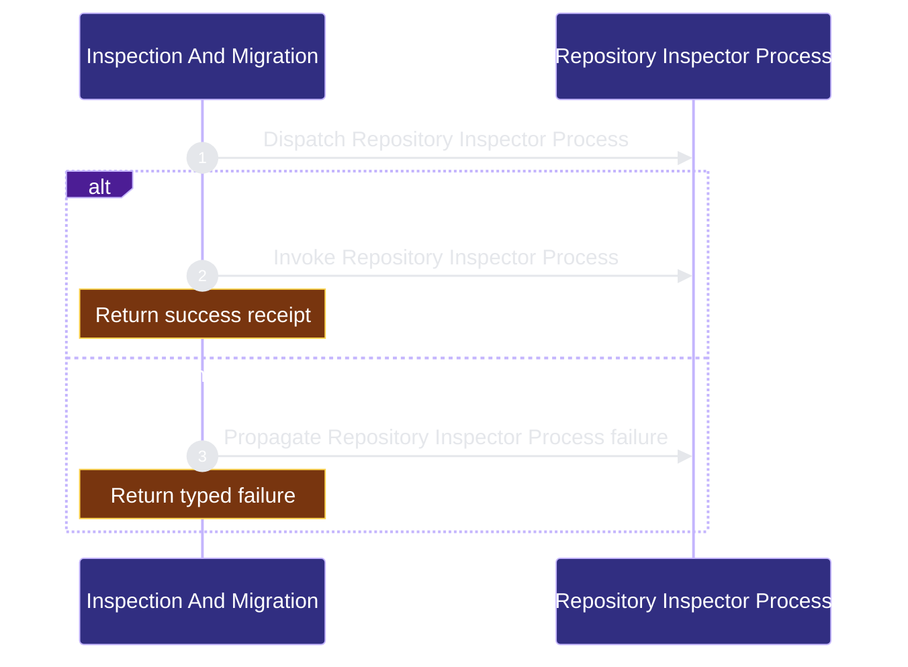

# workflow-engine/inspection-migration 架构文档
<!-- BEGIN ARCHCONTEXT:generated target="projection_target.entity.capability-workflow-engine-inspection-migration" sourceDigest="sha256:654f7236e2e51fd19e64129d48fe05f974f3172f6f69c671a78f31ba896198ae" rendererVersion="archcontext.docs-renderer/v4" outputDigest="sha256:a148fc8868cf1e59ce9fe25484555aff2c06e611ed559c709c045b9cde19ab0a" -->
> **狀態**:`active`
> **Capability ID**:`capability.workflow-engine.inspection-migration`(kind `capability`)
> **Matched Prefixes**:`scripts/inspect-project-state.ts`、`scripts/create-project-dirs.sh`、`scripts/init-project.sh`、`scripts/lib/**`
> **Local Contracts**:`scripts/AGENTS.md`、`scripts/CLAUDE.md`
> **事實優先級**:倉庫當前狀態 > 本文檔機器區 > 本文檔人工區。機器區(引言、§1、§2)由 ArchContext 從架構模型與源碼度量投影生成,手改會在下次投影被覆蓋。本文檔不記錄出處;本次投影所驗證的 commit 見 `docs/architecture/.projection-manifest.json`。

Inspects repository state and executes explicit initialization or migration plans.

## 1. P1:能力架構地圖

### 1.1 架構圖


- Proof: `proven` (`sha256:645bddf60b9049dc2f4d240dce10b9eb745f031ae765418032b109c0b7d3b7b7`).
- Semantic nodes: `2`; declared relations: `1`.

### 1.2 模組職責表

| 宣告入口 | 錨點 | 職責 |
| --- | --- | --- |
| `entrypoint.inspection-migration.primary` | `src/cli/commands/init.ts#runProcess` | `sink.inspection-migration.primary` → `src/effects/process-runner.ts#runProcess` |

### 1.3 規模信號

- 規模量級:`5–10` 個文件 / `2000–5000` 行
- 匹配前綴:`scripts/inspect-project-state.ts`、`scripts/create-project-dirs.sh`、`scripts/init-project.sh`、`scripts/lib/**`
- 推導:掃描 `source.include` 減 `source.exclude`,跳過 `.git/` 與 `node_modules/`,再按 1–2–5 階梯分桶。精確計數不入本文檔:量級足以回答「這個能力有多大」,而逐行計數會讓覆蓋範圍內任何一次源碼改動都改寫本文檔。

### 1.4 依賴邊界

出向關係:

- `calls` → `component.inspection-migration.primary` — Inspect before migration

入向關係:

- 無。

## 2. P2:端到端數據流

> **Proof**: `proven` (`sha256:645bddf60b9049dc2f4d240dce10b9eb745f031ae765418032b109c0b7d3b7b7`); selectors `1/1`.


<!-- END ARCHCONTEXT:generated target="projection_target.entity.capability-workflow-engine-inspection-migration" -->
## 3. P3：设计决策与不变量

### 3.1 必须保持的不变量

1. **inspector 只读**。判定与变更彻底分离：`inspect-project-state.ts` 没有任何写路径，因此可以在任意脏仓库、任意 CI 阶段安全反复运行。`check-ci.sh` 正是靠这一点把它当 smoke 用。
2. **用户内容优先保全**。安全默认写死在 `safeDefaults`（:111-116）：保留 repo-local tasks-first 工作流、归档不确定的遗留内容而非覆盖、只删除 manifest 声明为 `known_generated` 的文件。契约里 `_ref/`、`_ops/`、`.codegraph/` 的动作是 `preserve` 且 `risk: high` / `ownership: user_local`——本仓库当前的 upgrade plan 里唯一一条就是它。
3. **根 `CLAUDE.md` / `AGENTS.md` 永不覆盖**。检测到两者分叉时只产出 required decision 让人处理。
4. **契约是唯一 inventory 权威**。目录清单、helper 清单、legacy 路径、upgrade 动作全部来自 `assets/workflow-contract.v1.json`，脚本里不得再维护第二份平行清单。
5. **helper 解析 fail-closed**。不扫目录、不猜扩展名、不查 home、不认 legacy env alias；不合法条目直接抛错而不是跳过。
6. **下游不装 helper wrapper**。`pi_install_helpers` 只在"目标目录就是源仓库自己"时才把 helper 拷进 `scripts/`；下游仓库统一走全局 repo-harness helper runtime。
7. **dry-run 不碰用户级目录**。agent fleet 安装在非 apply 模式下只打印。

### 3.2 有意接受的约束

- **shell 与 TS 双语言实现**是能力边界的直接结果：判定与事务在 TS（inspector + adoption），脚手架与安装在 shell（`pi_*`）。合并成一种语言会把 adoption 能力的所有权拖进本能力，代价高于收益。
- **`init-project.sh` 会联网装依赖**（`bun create vite`、`npx shadcn` 等）。这是脚手架命令的本分，但也意味着它不能在离线 CI 里当检查用——所以 CI 只跑 inspector。
- **三级 JSON runtime 探测**换来的是在没有 node/bun 的机器上也能读契约。代价是 python3 分支与 node 分支是两份独立实现的 selector 解析逻辑（`project-init-lib.sh:780-810`），语义漂移只能靠测试兜。

### 3.3 10x 规模下先垮的点

按危险度排序：

1. **`project-init-lib.sh` 单文件 2,721 行**。它同时承担契约读取、模板安装、policy 生成、context map 生成、capability registry 生成、harness 状态面、gitignore managed block、外部工具报告七类职责。目标仓库形态每多一种，新分支就往这一个文件里加。这是本能力最先垮的地方——不是因为性能，而是因为没有任何模块边界能阻止一个 `pi_*` 函数偷偷依赖另一个的副作用。
2. **selector 解析的双实现漂移**。python3 与 node 两条分支各写一遍嵌套取值。今天语义一致，但只要有人给 node 分支加一个数组索引语法而忘了 python3 分支，行为就会随机器而变。这一处是 §3.1 第 4 条"单一权威"原则的实际缺口。
3. **`pi_workflow_contract_query_lines` 静默降级**。没有 JSON runtime 时它返回空并只打 warn，调用方 `create_contract_directories` 会安静地一个目录都不建。这与仓库的 fail-closed 原则冲突，但目前没有调用方检查它的返回码。
4. **drift 探测的硬编码常量**。`generatedClaudeHookPaths`（inspector :123-130）与 `ignoredReferenceOrSecretPaths`（:131-134）是 TS 里的字面量，不来自契约。契约里已有对应的 `legacy-claude-hook-shims` / `reference-and-secret-surfaces-preserve` 动作，两边同时改才不漂移。第 4 条不变量在这两处还没有真正兑现。
5. **stack 分支的组合爆炸**。`init-project.sh` 的 5 个 stack 各自硬编码依赖列表。第 6 个 stack 的边际成本是线性的，但每个 stack 的依赖版本腐化是独立的，没有任何检查覆盖它们。

### 3.4 验证面

```bash
bun test tests/migration-script.test.ts tests/create-project-dirs.runtime.test.ts tests/workflow-contract.test.ts
bun src/cli/index.ts init --repo . --dry-run
bun scripts/inspect-project-state.ts --repo . --format text
```

前两条是 `.ai/context/capabilities.json#verification_hints` 的原文。1,582 行测试对 3,786 行生产代码，其中 `create-project-dirs.runtime.test.ts` 一个文件 1,066 行——脚手架的真实行为几乎全靠它兜。

## 4. 历史决策记录（append-only）

以下段落逐字保留自本文件前一版本，不翻译、不改写。

### 2026-08-11 Codex Native Agent Projection Cutover

- `scripts/lib/project-init-lib.sh`, `scripts/ensure-task-workflow.sh`, and the
  packaged helper mirror now emit one native-subagent runner authority.
- Generated policy keeps `mode: "explicit"` as the declared state but has no
  automatic SessionStart authorization, natural-language permission parser, or
  alternate Codex fleet runner.
- The cutover removes the retired authoring path in the same work-package; no
  compatibility key reader, translation, or migration shim is installed.

### 2026-07-11 Helper Authority Closeout

- `src/core/source-projection.ts` is the shared filesystem projection primitive
  used by hook and helper projections; it preserves bytes and executable mode,
  rejects symlinks, and writes atomically.
- `scripts/sync-helper-sources.ts` reads the helper inventory only from the
  workflow contract, rejects unclassified package files, and preserves the one
  declared migration delegate.
- `src/cli/runtime/helper-runner.ts` resolves only contract-listed helpers from
  the package or an explicit source checkout. Missing contracts, malformed JSON,
  unsafe inventory entries, ambiguous helper IDs, and missing implementation
  files fail closed.
- `scripts/workflow-contract.ts` accepts the package-local contract, an installed
  target-repo contract, or an explicit source checkout. It no longer searches
  home directories or legacy skill roots.

### 2026-07-06 Delegation Policy Template Closeout

- `scripts/lib/project-init-lib.sh` now emits the same `delegation.mode=auto`
  policy explanation as the self-host `.ai/harness/policy.json`, so generated
  repos understand auto mode as install-time standing authorization for bounded
  Codex delegation.
- The change stays inside policy generation text. It does not alter migration
  ownership, helper installation, idempotency rules, or protected local runtime
  state.

### 2026-07-12 Agent Fleet Policy Seed Closeout

- `scripts/lib/project-init-lib.sh` and `scripts/ensure-task-workflow.sh` emit
  the same `external_tooling.agent_fleet` seed with
  `source: package:agents/fleet`; their deterministic helper projection carries
  the same bytes into generated repos.
- Downstream policy stays advisory by default while this self-host repo opts
  into automatic installation. Dry-run remains read-only and never touches the
  user-level Claude or Codex agent directories.
- The cutover is intentionally one-way: no `fable_agents` alias, remote fetch,
  source override, or legacy policy reader participates in inspection,
  migration, or installation.

### 2026-07-12 Six-role Fleet Seed Closeout

- `scripts/lib/project-init-lib.sh` and `scripts/ensure-task-workflow.sh` now
  seed the same six-role `external_tooling.agent_fleet.managed_agents` list as
  the self-host policy and packaged tooling default.
- The two additions are `root-cause-prover` and `harness-evaluator`;
  migration auditing is represented inside the evaluator persona and does not
  add an inspection parser, adoption operation, compatibility key, or second
  policy authority.
- Downstream advisory installation and self-host automatic installation keep
  their existing behavior. Missing or malformed packaged persona sources still
  fail before any user-level agent target is mutated.

复验状态（main@13686d8d）：四段 closeout 的核心断言与当前源码一致——六角色清单见 `scripts/lib/project-init-lib.sh:1973` 与 `scripts/ensure-task-workflow.sh:1288`，`install_mode: "advisory"` 下游默认见 `project-init-lib.sh:1976`，`scripts/workflow-contract.ts` 的三源解析与 fail-closed 校验见 §1.2 与 §2.3。

## Optimization Backlog

- Reduce duplicated required-path lists that still exist across shell scripts.

- `tasks/workstreams/workflow-engine/inspection-migration/20260712-inspection-migration.md`

- `tasks/workstreams/workflow-engine/inspection-migration/agent-fleet-specialists.md`
