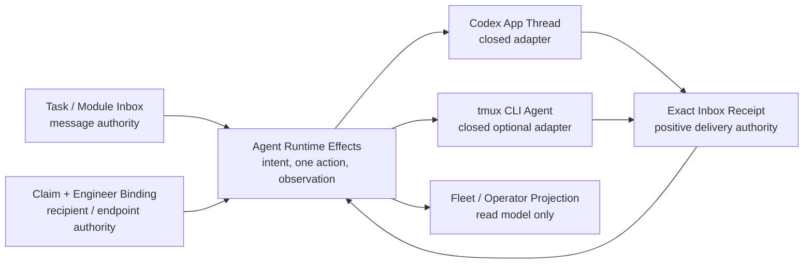

# Agent Runtime Effects Boundary Acceptance

> **Status**: Accepted
> **Accepted**: 2026-08-30T19:18:00+0800
> **Human Approval**: originating Codex task, 2026-08-30
> **Request**: `docs/architecture/requests/archive/2026/runtime-harness-provider-thread-effects.md` (Resolved)
> **PRD**: `plans/prds/20260830-1827-provider-neutral-agent-runtime-adapter.prd.md`
> **Plan**: `plans/plan-20260830-1903-r1-provider-neutral-agent-runtime.md`

## Decision

Accept replacement of `capability.runtime-harness.provider-thread-effects` by
`capability.runtime-harness.agent-runtime-effects`. The new capability owns the
provider-neutral, persist-first and at-most-once runtime-effect boundary. It
does not own message bodies, Task/Lease transitions, Engineer identity, Agent
process lifecycle, transcript semantics or Fleet classification.

This acceptance changes architecture ownership before product implementation.
The node intentionally selects the current V1 Provider Thread source files and
symbols as the evidence-bearing implementation. R1 must replace those paths,
protocols and public names in one work package; no active alias or dual reader
may remain after the migration. Architecture acceptance does not claim that
tmux delivery or Task Inbox receipt correlation already exists.

## P1: Architecture Map

- Task and Module Inbox remain the only message/delivery authorities.
- Engineer Binding remains the only endpoint authority. Task routing must derive
  its Binding through the persisted ClaimActorReceipt.
- Agent Runtime Effects owns immutable intent/observation chains, current repair,
  at-most-once action admission and the closed adapter boundary.
- Fleet, Engineering Overlay and MCP consume read-only projections; Collaboration
  receives no runtime writer dependency.
- The completed ME-3A workstream remains historical evidence. R1 durable progress
  moves to `tasks/workstreams/runtime-harness/agent-runtime-effects/`.

## P2: Accepted Data Flow

1. A Task or Module message and recipient receipt exist before runtime admission.
2. Prepare freezes the exact message reference and current Claim/Binding endpoint.
3. Intent and `effect_started` are durable before one Host adapter action.
4. `tmux-cli-agent` may receive only a bounded opaque inbox-control reference;
   a process success proves only that the effect started.
5. Positive delivery requires the exact authoritative inbox receipt for the same
   message, recipient generation and effect. Missing or ambiguous evidence becomes
   `reconciliation_required`; it never triggers a retry or another adapter.
6. Server-owned delivery/reachability facts may enter read models, but they never
   change Fleet's five Task columns or any Task/Lease/Publication/Acceptance byte.

## P3: Rationale and Invariants

The former capability name encoded one provider and one Thread carrier. Keeping
that identity while adding tmux would make the architecture lie about ownership;
adding a sibling capability would create two effect journals and two endpoint
resolvers. Replacement is therefore the smallest coherent boundary.

The current `EngineerBindingV1` endpoint tuple is retained. Its historical
`provider` and `provider_thread_id` field names may be cleaned only by a later
explicit schema migration; R1 does not add a second store merely to improve
naming.

V1 retirement is terminal-only and one-shot. A non-terminal or
`reconciliation_required` V1 effect blocks migration. Normal V2 code never reads
the V1 archive. Rollback disables new V2 actions and preserves journals; it does
not revive V1 execution.

At 10x endpoints, filesystem effect aggregation fails before tmux addressing.
The accepted scaling direction is bounded server projection over the one journal,
not a second runtime queue or transcript index.

### Invariants

- Message bodies never enter tmux argv, stdin, environment or transcript parsing.
- One effect admits at most one Host action.
- Only an exact persisted inbox receipt proves positive delivery.
- Unknown outcomes never retry and never fall back across adapters.
- Task, Lease, Collaboration, Publication and Acceptance authorities remain byte-identical.
- Architecture source selectors stay on current V1 files only until R1 replaces
  them atomically; this transitional fact must remain explicit in the node notes.

## Acceptance Scope

Accepted now:

- new capability/component identity and relation direction;
- provider-neutral ownership and closed adapter union;
- exact receipt authority and no-retry/no-fallback semantics;
- terminal-only V1 retirement boundary;
- R1 workstream ownership and verification surface.

Still pending R1 implementation:

- V2 product schemas and storage root;
- Task-to-Binding proof integration;
- Codex/tmux closed executors;
- CLI/MCP/product rename and policy flags;
- Fleet/operator DTO projection and real canary.
