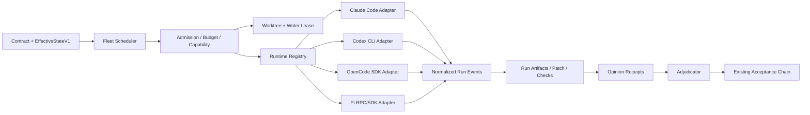

# 结论

要把 OpenCode 和 Pi 接入 `repo-harness`，**不应继续沿用“再增加两个 Claude/Codex 分支”的做法**。当前代码中，宿主安装、Hook 路由、Agent 定义投影、外部审阅和运行时启动分别维护了一套 Claude/Codex 封闭列表：`TargetId`、`RouteHost`、`InstallTargetSpec`、skill surface host、`cross-review provider`、`AcceptancePolicy.reviewer` 都只认识 Claude/Codex；`install-agent-fleet.sh` 又独立硬编码了两个目标目录。这样直接加入 OpenCode/Pi，会把同一个新宿主改动复制到六七个位置。     

建议把架构拆成三个正交层：

1. **Host Integration Adapter**：负责 OpenCode/Pi 作为用户交互宿主时的上下文注入、工具拦截、Session 生命周期和安装。
2. **Fleet Runtime Adapter**：负责由 `agent-fleet` 可编程地启动、取消、监听和收集 Claude、Codex、OpenCode、Pi。
3. **Role Projector**：把同一份 provider-neutral 的 Agent 角色定义，投影成 Claude Markdown、Codex TOML、OpenCode Agent Markdown，以及 Pi 的运行时 prompt/tool policy。

同时，`agent-fleet` 必须是一个**确定性调度器**，不是让某个“总控 LLM”自行决定开多少子 agent、选哪个模型、谁可以写文件。`EffectiveStateV1` 继续是任务、阶段、允许路径和 readiness 的唯一权威；OpenCode/Pi 的 session、todo、subagent tree 都只能是执行记录和证据投影。现有 `EffectiveStateV1` 已经有 authority/subject/evidence/projection revisions、`progress_token`、`allowed_paths`、review、external acceptance 和 checks，足够承载 fleet，无须另建第二套项目真相库。

---

# 一、当前 repo-harness 真正缺少什么

目前并不是“只差 OpenCode/Pi 配置文件”，而是缺少统一的运行时控制协议。

## 1. 宿主支持是分散而非注册式的

目前至少有以下封闭点：

| 当前位置 | 封闭内容 | 加 OpenCode/Pi 的后果 |
|---|---|---|
| `installer/types.ts` | `TargetId = codex \| claude` | 每加宿主都要改核心类型 |
| `targets/registry.ts` | 只有两个 target 实例 | 安装层封闭 |
| `commands/install.ts` | `codex \| claude \| both` | CLI 无法表达任意组合 |
| `hook/route-registry.ts` | `RouteHost = claude \| codex` | Hook 语义和宿主事件名称耦合 |
| `skill-surface/catalog.ts` | host 只有 Claude/Codex | skill 投影无法自然扩展 |
| `install-agent-fleet.sh` | 写入 `.claude/agents` 和 `.codex/agents` | agent 投影与 installer 重复实现 |
| `cross-review.ts` | provider 只有 Claude/Codex | 不能把 OpenCode/Pi 当 reviewer |
| `acceptance-receipt.ts` | reviewer/source 只允许 Claude/Codex | 多 reviewer 无法进入正式验收 |

这些限制都能在当前源代码中直接看到。   

## 2. 当前 agent-fleet 是“角色安装器”，还不是 fleet scheduler

现有 fleet 已经有清晰角色，例如：

- `explorer`
- `deep-reasoner`
- `fast-worker`
- `deep-worker`
- `gatekeeper`
- `root-cause-prover`
- `harness-evaluator`

但这些角色的 canonical source 实际上是 Claude 风格 Markdown，包含 Claude 的 model、effort、tools，然后安装脚本再把它转换为 Codex TOML。测试重点也是确保 Claude 文件 byte-identical、Codex 投影与 golden byte-identical、用户修改能够 drift-detect。  

这说明当前 fleet 已经有良好的**角色语义**和**投影纪律**，但还缺：

- runner capability discovery；
- runner 选择；
- 并发 admission；
- write lease；
- child run 注册；
- cancellation；
- event normalization；
- run recovery；
- 多 reviewer adjudication；
- opinion/verification evidence binding。

`contract-run` 当前也只是运行一个 worker command 和一个 verifier command；runner、effort 主要作为记录字段，它明确不负责自动选择、启动、降级或切换 runner。

---

# 二、OpenCode 架构深入分析

以下分析基于当前 OpenCode 主仓库架构。

## 1. OpenCode 本质上是 client/server agent platform

OpenCode 不是另一个“输出文本的 coding CLI”。它的主要层次是：

```text
TUI / Desktop / Web / IDE
          │
          ▼
 OpenAPI HTTP Server + SSE
          │
          ▼
 Project / Worktree Instance
          │
          ▼
 Persistent Session Engine
          │
          ▼
 Agent + Provider + Tool Loop
          │
          ├── MCP
          ├── LSP
          ├── Permission
          └── Plugin Hooks
```

OpenCode SDK 可以启动 embedded server，也可以连接已经运行的 server；SDK 提供 session create/get/children/prompt/abort/messages、结构化输出和事件订阅。这意味着 repo-harness 不需要解析 TUI 文本，而可以直接控制 session、取消执行、消费 SSE 事件并收集结构化结果。

## 2. Project Instance 是按 directory/worktree 建立的运行边界

OpenCode 的 `InstanceStore` 会基于 resolved directory 缓存一个 instance context，context 包括：

```ts
{
  directory,
  worktree,
  project
}
```

它负责 boot、reload、dispose，并通过全局 event bus 发布 instance 生命周期。这与 repo-harness 的 worktree 模型非常契合：一个 fleet lane 可以绑定一个 OpenCode instance，一个 session 只能在被分配的 worktree 中执行。

但这里的 instance 仍然只是**运行边界**，不是 repo-harness 的任务权威。OpenCode 知道当前 directory、project 和 session，却不知道哪个 plan、contract、`progress_token` 或 acceptance subject 才是当前权威。

## 3. Session 是完整执行树，但不是调度真相

OpenCode session 原生支持：

- `parentID`；
- project/workspace/directory；
- agent；
- model；
- metadata；
- permission；
- cost/tokens；
- revert；
- child sessions。

因此非常适合把：

```text
repo-harness run_id
task_id
role_id
subject_sha256
authority_revision
parent_run_id
```

写入 session metadata，并将 OpenCode child session 关联到 fleet child run。

但是不能反过来把 OpenCode 的 parent/child session 当作 fleet DAG。原因是 OpenCode 的 agent 可以通过 Task 工具自行创建子 session；如果这些子 session 没有先经过 repo-harness admission，它们可能绕过预算、scope、writer lease 和 reviewer independence。

所以应当：

- **交互模式**：可以让用户使用 OpenCode 原生 subagent。
- **受控 fleet 模式**：默认禁止 agent 的 `task` permission。
- agent 需要新子任务时，只能输出 `DelegationProposal`。
- scheduler 验证 proposal 后，显式创建 child run 和 child session。

## 4. Prompt loop 已经整合 agent、provider、MCP、LSP、permission 和 plugin

OpenCode 的中央 prompt loop 会组合：

- agent definition；
- model/provider；
- tool registry；
- MCP；
- LSP；
- permissions；
- session state；
- plugin callbacks；
- structured output。

其原生 Task/subagent 流也会创建对应的消息、tool part 和 child execution，并调用 `tool.execute.before`。这说明 OpenCode 很适合作为一个完整的 `FleetRuntimeAdapter`，而不是只作为 shell command。

## 5. Plugin 是最适合接 repo-harness host guard 的边界

OpenCode plugin 可以接入：

- 通用 event stream；
- `chat.message`；
- `permission.ask`；
- `tool.execute.before`；
- `tool.execute.after`；
- `shell.env`；
- session compaction；
- system/message transformation；
- custom tools。

Plugin 输入还包含 client、project、directory、worktree 和 server URL。

这使它能做四件事：

1. Session 开始时注入 `EffectiveState`。
2. 工具执行前做 allowed-path/lease/actor preflight。
3. 工具执行后记录 observation。
4. Context compaction 时重新注入 durable checkpoint。

但 plugin 必须是**薄适配器**，不能自己解析 plan、决定 authority 或维护 task state。

## 6. OpenCode Agent 定义和 repo-harness fleet role 不能直接等同

OpenCode 支持 primary agent 和 subagent，并允许在：

```text
~/.config/opencode/agents/
.opencode/agents/
```

使用 Markdown 定义 agent，包括 mode、model、prompt 和 permission；还可以限制某个 agent 可调用哪些 subagent。 

因此 repo-harness 可以生成：

```text
.opencode/agents/explorer.md
.opencode/agents/deep-reasoner.md
.opencode/agents/gatekeeper.md
```

但 canonical source 不应再是 Claude frontmatter。应改为 provider-neutral role specification，再由 projector 生成 OpenCode 定义。

## 7. OpenCode 的 permission 不是安全 sandbox

OpenCode 官方 threat model 明确说明：permission system 是用户交互和确认机制，不提供真正的安全隔离；需要真实隔离时必须使用 Docker、VM 或其他 sandbox。Server mode 也需要明确配置密码并限制访问。

因此：

- `permission.edit = deny` 对 reviewer 很有用；
- 但不能把它当成安全证明；
- writable worker 必须运行在独立 worktree；
- 高风险运行还应进入容器；
- arbitrary Bash 的路径写入无法只靠 `tool.execute.before` 完全证明；
- 结束后必须重新计算 Git diff，确认没有越出 `allowed_paths`。

### 7.1 配置隔离与 missing-agent fallback 的实测反例

历史 eval commit `cb07282f` 对未合入的 OpenCode cross-review runtime
`a2bfed64` 做了 disposable falsifier。测试使用 OpenCode `1.18.15` 和
`nvidia/openai/gpt-oss-20b`，把 hostile HOME、XDG、project config、目标 Git
仓库以及 tracked/untracked/ignored sentinels 全部放在临时目录，并在每次运行后
删除。它得到四个可复用结论：

1. `--pure`、`OPENCODE_CONFIG_DIR` 和
   `OPENCODE_DISABLE_PROJECT_CONFIG=1` 能排除 hostile project config，但不能阻止
   user config 合并；resolved config 仍包含 hostile user agent，并把它选为
   `default_agent`。
2. 当生成的 reviewer agent 能被精确解析时，它最后追加的 wildcard deny 层阻止了
   `apply_patch` 写入。OpenCode upstream exit 为 0，repo-harness 将工具尝试分类为
   `policy_violation`，三个 sentinel 均未改变。
3. 当指定 agent 无法解析时，OpenCode 会退回 user-owned default agent，而不是
   fail closed。该 fallback 的最终 `write`/`bash` permission 为 allow；一次权威运行
   改写了 tracked、untracked 和 ignored 三类 sentinel，upstream 仍 exit 0，
   repo-harness 只能在副作用发生后报告 `policy_violation`。
4. LLM 是否在单次 turn 选择写工具具有非确定性，因此安全 gate 必须以 resolved
   principal 与最终 permission 是否可写作为 deterministic failure；sentinel mutation
   只能作为补强证据，不能成为唯一 oracle。

因此 cross-review runtime 不能把 config-only permission 与事后 JSONL classifier
当作 read-only security boundary。任何后续 OpenCode adapter 必须同时证明：

- credential-preserving 的 disposable HOME/XDG；
- missing or unresolved agent 直接失败，禁止 default-agent fallback；
- 实际 resolved principal 与预期 reviewer 的 attestation；
- Docker、VM 或其他独立 filesystem sandbox 在执行前阻断越界写入。

这份证据只否定旧 runtime 的安全前提，不构成该 runtime 的实现或验收；旧分支无需
合并，eval runner 也不应连同被推翻的 parent runtime 一起进入 production history。

---

# 三、目标架构



## 1. 四个身份维度必须分开

现在的 `provider: claude | codex` 实际混合了多个概念。加入 OpenCode/Pi 后，这种表示会立即失真，因为 OpenCode/Pi 都可能运行 Anthropic、OpenAI 或其他模型。

应分成：

```ts
interface AgentIdentity {
  host: "claude" | "codex" | "opencode" | "pi";
  runtime:
    | "claude-code"
    | "codex-cli"
    | "opencode"
    | "pi";
  modelProvider: "anthropic" | "openai" | "google" | string;
  modelFamily: string;
  modelId: string;
  roleId: string;
}
```

含义分别是：

- `host`：用户当前在哪里交互；
- `runtime`：实际启动和控制 agent 的程序；
- `modelProvider/modelFamily`：外部意见是否真正独立；
- `roleId`：explorer、worker、reviewer 等任务语义。

例如：

```text
用户在 OpenCode 中工作
→ repo-harness 调 Codex CLI 取得外部意见
```

此时：

```text
host = opencode
runtime = codex-cli
modelProvider = openai
role = gatekeeper
```

而通过 OpenCode 调 Claude 模型：

```text
runtime = opencode
modelProvider = anthropic
```

不能因为 runtime 不同，就把它当成与 Claude Code 完全独立的第二票。

## 2. 三个核心接口

### Host Integration Adapter

```ts
export interface HostIntegrationAdapter {
  readonly id: string;

  detect(ctx: HostContext): Promise<HostDetection>;
  install(ctx: InstallContext): Promise<InstallResult>;
  uninstall(ctx: InstallContext): Promise<InstallResult>;

  normalizeEvent(input: unknown): HostEvent | null;
  projectContext(state: EffectiveStateV1): HostContextPayload;
}
```

职责：

- 安装 OpenCode plugin 或 Pi extension；
- 把各宿主事件转换成统一事件；
- 注入 context；
- 调用 guard；
- 不启动 fleet worker；
- 不决定 runner。

### Fleet Runtime Adapter

```ts
export interface FleetRuntimeAdapter {
  readonly id: string;

  probe(ctx: ProbeContext): Promise<RuntimeCapabilityReport>;

  prepare(spec: AgentRunSpec): Promise<PreparedRun>;

  start(
    run: PreparedRun,
    signal: AbortSignal,
  ): Promise<AgentRunHandle>;

  events(
    handle: AgentRunHandle,
  ): AsyncIterable<AgentRunEvent>;

  cancel(
    handle: AgentRunHandle,
    reason: string,
  ): Promise<void>;

  collect(
    handle: AgentRunHandle,
  ): Promise<AgentRunResult>;
}
```

`RuntimeCapabilityReport` 至少包括：

```ts
interface RuntimeCapabilities {
  structuredEvents: boolean;
  structuredResult: boolean;
  cancellation: boolean;
  childSessions: boolean;
  preToolGuard: boolean;
  readOnlyPolicy: boolean;
  nativeSandbox: boolean;
  usageReporting: boolean;
  contextInjection: boolean;
}
```

Admission 必须 fail closed。例如 contract 要求真实 sandbox，而当前 OpenCode/Pi 没有 container wrapper，则不能选择它们执行 writable run。

### Role Projector

```ts
export interface RoleProjector {
  readonly runtime: string;

  project(
    role: FleetRole,
    profile: RuntimeProfile,
  ): ProjectedRoleFile[];
}
```

---

# 四、Canonical Fleet Role 应如何改

当前 agent role 混有 Sonnet/Opus、Claude tools 和 effort。应拆成：

```yaml
apiVersion: repo-harness.dev/v1
kind: FleetRole

metadata:
  name: gatekeeper

spec:
  class: reviewer
  mutation: forbidden

  capabilities:
    required:
      - repo.read
      - repo.search
      - command.verify
      - structured.result

  delegation:
    mode: forbidden

  qualityTier: deep

  resultSchema:
    ref: repo-harness.review/v1

  promptRef: prompts/gatekeeper.md
```

`qualityTier` 再由 runtime profile 解析：

```yaml
profiles:
  claude-code:
    deep:
      model: opus
      effort: high

  codex-cli:
    deep:
      model: gpt-5.6-terra
      reasoningEffort: xhigh

  opencode:
    deep:
      model: anthropic/...
      permissionProfile: reviewer

  pi:
    deep:
      provider: anthropic
      model: ...
      thinking: high
```

这样角色语义保持稳定，模型和宿主配置可以独立升级。

现有 Claude/Codex golden 输出应在迁移阶段继续 byte-identical。先把新 projector 的输出与现有 14 个文件逐字比较，完全一致后再退役 Bash 中的模板转换逻辑。

---

# 五、OpenCode 具体接入方案

## A. Level 0：上下文兼容

OpenCode 原生读取项目 `AGENTS.md`，当同一目录同时存在 `AGENTS.md` 和 `CLAUDE.md` 时会优先使用 `AGENTS.md`。所以不应创建第三个根级 canonical instruction，也不应把当前 `AGENTS.md` 与 `CLAUDE.md` 强行合并或 symlink；继续保持两者有意的宿主差异即可。

## B. Level 1：Agent 和 Skill 投影

生成：

```text
.opencode/
├── agents/
│   ├── explorer.md
│   ├── deep-reasoner.md
│   ├── fast-worker.md
│   ├── deep-worker.md
│   └── gatekeeper.md
└── plugins/
    └── repo-harness.ts
```

Reviewer 示例：

```yaml
---
description: Read-only acceptance reviewer
mode: subagent
hidden: true
permission:
  edit: deny
  task: deny
  bash:
    "*": deny
    "git status*": allow
    "git diff*": allow
    "git log*": allow
---
```

OpenCode 也支持 `.opencode/skills`、`.agents/skills` 和 Claude-compatible skill locations，因此短期可以复用现有 skill source，长期再由统一 projector 投影到 OpenCode 原生位置。

## C. Level 2：OpenCode Plugin Bridge

推荐生成一个很薄的 plugin：

```ts
export default async function repoHarnessPlugin(input) {
  const bridge = await startPersistentBridge(input.worktree);

  return {
    async event({ event }) {
      await bridge.observe(normalizeEvent(event));
    },

    async "chat.message"(request) {
      await bridge.observe({
        type: "prompt.submitted",
        sessionId: request.sessionID,
      });
    },

    async "tool.execute.before"(request, output) {
      const decision = await bridge.guard({
        sessionId: request.sessionID,
        tool: request.tool,
        args: output.args,
      });

      if (decision.action === "block") {
        throw new Error(decision.reason);
      }
    },

    async "tool.execute.after"(request, output) {
      await bridge.observe({
        type: "tool.completed",
        tool: request.tool,
        args: request.args,
        metadata: output.metadata,
      });
    },

    async "experimental.session.compacting"(request, output) {
      const checkpoint = await bridge.context(request.sessionID);
      output.context.push(checkpoint);
    },

    async dispose() {
      await bridge.close();
    },
  };
}
```

这里的 bridge 建议是：

```text
OpenCode plugin
     │ persistent JSONL/stdin-stdout
     ▼
repo-harness host-bridge
     │
     ▼
EffectiveState / guard / telemetry
```

不要在每次 `tool.execute.before` 都 `spawnSync("repo-harness", ...)`。更稳妥的方式是一个 session 级长连接 sidecar，或者 Unix domain socket / Named Pipe：

- guard 请求有短 timeout；
- write-capable tool 在 bridge 不可用时 fail closed；
- read-only observation 可以记录 unavailable diagnostic；
- request 带 `session_id`、`run_id`、`lease_id`、`actor_id`；
- bridge 不保存第二套 authority，只读取现有 EffectiveState。

## D. Level 3：OpenCode Fleet Runtime Adapter

受控运行不要使用 OpenCode TUI，而是使用 SDK：

```ts
const runtime = await createOpencode({
  hostname: "127.0.0.1",
  port: 0,
  config: frozenRuntimeConfig,
});

const session = await runtime.client.session.create({
  body: {
    title: runSpec.runId,
    agent: projectedRoleName,
    metadata: {
      run_id: runSpec.runId,
      task_id: runSpec.taskId,
      role_id: runSpec.roleId,
      subject_sha256: runSpec.subject.sha256,
      authority_revision: runSpec.authorityRevision,
    },
    permission: projectedPermission,
  },
});
```

随后：

1. 启动 event consumer；
2. 发送 frozen prompt；
3. 要求 JSON Schema 结构化结果；
4. 监听 session error、tool events 和 idle；
5. 用户取消、authority 变化或 lease 丢失时调用 `session.abort`；
6. 收集结果；
7. 重新计算 Git diff；
8. 检查 allowed paths；
9. 写入 typed run receipt。

### `session.idle` 只能表示 quiescent

OpenCode session idle 不等于：

- contract 完成；
- tests 通过；
- reviewer PASS；
- acceptance receipt 有效；
- 可以 release lease。

正确状态应是：

```text
running
  → runtime_quiescent
  → collecting
  → scope_check
  → verification
  → reviewed
  → accepted
```

### OpenCode instance 策略

首个版本建议：

- 每个 writable lane 一个独立 worktree；
- 每个 writable lane 一个 embedded OpenCode server；
- server 只绑定 `127.0.0.1`；
- 不复用交互式 OpenCode 用户 session；
- read-only reviewer 可以稍后研究共享 server；
- 不要一开始就做跨 repo、跨 worktree session pooling。

这样能先保证 directory、plugin event 和 config 的隔离正确。

---

# 六、Pi 的接入方案

> 后续补充（2026-08-11）：上游 harness-v2（`4181f66`）的 same-process SDK 语义评估已落档于 `20260811-pi-harness-v2-reference-assessment.md`；本节「首版 RPC、后续 same-process SDK」的结论不变。

下文把 `/pi` 理解为当前 `earendil-works/pi` 的 Pi coding agent。

Pi 和 OpenCode 不应使用完全相同的 adapter 实现：

- OpenCode 优先用 embedded server + SDK；
- Pi 首版优先用 RPC process；
- Pi 后续再切换 same-process SDK。

## 1. Pi Host Integration

Pi 支持：

```text
~/.pi/agent/extensions/
.pi/extensions/
```

extension 可以监听：

- `session_start`；
- `before_agent_start`；
- `tool_call`；
- `tool_result`；
- `agent_end`；
- `agent_settled`；
- session switch/fork/compact；
- 并可阻断工具、注册 custom tool 和保存 extension state。

生成：

```text
.pi/extensions/repo-harness.ts
```

其逻辑与 OpenCode plugin 一样，连接同一个 `host-bridge` 协议。

Pi 的 context loader 在每层目录优先查找：

```text
AGENTS.override.md
AGENTS.md
AGENTS.MD
CLAUDE.md
CLAUDE.MD
```

因此当前根目录存在 AGENTS/CLAUDE 时，Pi 会选择 `AGENTS.md`；同样无需新增根级 instruction authority。

## 2. Pi Fleet Runtime 首版用 RPC

推荐启动方式：

```text
pi
  --mode rpc
  --no-session
  --no-context-files
  --no-extensions
  -e <repo-harness-bridge-extension>
  --no-skills
  --provider <resolved-provider>
  --model <resolved-model>
```

理由：

- RPC 使用严格 JSONL；
- 可以稳定发送 prompt、abort、state query；
- 进程退出和 parser failure 容易监督；
- 不依赖 TUI 文本；
- 每个 run 有清晰的 OS process boundary；
- 后续可以把实现替换成 SDK，而不改变 `FleetRuntimeAdapter`。

Pi 的 interactive、JSON 和 RPC 模式共享同一个 `AgentSession` 核心；session 生命周期、模型、工具、compaction 和 branching 都由这个核心负责。

### 结束事件必须使用 `agent_settled`

Pi 的 `agent_end` 之后仍可能发生：

- retry；
- compaction；
- queued follow-up；
- 自动继续。

所以 runtime adapter 只能把 `agent_settled` 映射为：

```text
run.quiescent
```

仍不能直接映射成 acceptance。

## 3. Pi 结构化结果

Pi 没有必要依赖模型“自觉输出 JSON”。repo-harness extension 可以注册一个强类型工具：

```ts
repo_harness_submit_result({
  status,
  summary,
  findings,
  artifacts,
  limitations,
})
```

Agent 必须以这个工具结束。Adapter 只有在以下条件全部满足时才接受：

- tool schema valid；
- `agent_settled`；
- process 状态正常；
- subject 未过期；
- diff scope 合法。

## 4. Pi 同样没有 sandbox

Pi 官方安全边界同样明确：它以本地用户权限运行，不提供内建 sandbox；真实隔离需要 container、VM 或其他系统边界。

因此 Pi writer 与 OpenCode writer 使用同一套 worktree/lease/container 策略。

---

# 七、agent-fleet 调度器应如何设计

## 1. Scheduler 必须是确定性代码

LLM 可以提出：

```json
{
  "requested_role": "explorer",
  "reason": "需要定位影响范围",
  "scope": ["src/core/**"]
}
```

但 scheduler 才能决定：

- 是否允许；
- 使用哪个 runtime；
- 是否有预算；
- 是否有写权限；
- 是否与其他 run 冲突；
- 是否创建 child run。

选择算法应类似：

```ts
eligible = runtimes
  .filter(enabledByPolicy)
  .filter(capabilitiesSatisfyRole)
  .filter(isolationSatisfiesRisk)
  .filter(credentialsAvailable);

selected = stableSort(eligible, [
  userPinnedRuntime,
  policyPriority,
  costClass,
  runtimeId,
])[0];
```

不应让 orchestrator LLM 临时决定“Codex 不行就偷偷改用 OpenCode”。

## 2. 推荐 run state machine

```text
created
  → admitted
  → leased
  → running
  → quiescent
  → collecting
  → verifying
  → awaiting_review
  → accepted
      │
      ├── rejected
      ├── blocked
      ├── cancelled
      └── infrastructure_failed
```

语义失败和基础设施失败要分开：

- timeout、process crash、SSE disconnect：可以按明确 policy retry；
- reviewer FAIL、tests FAIL、scope violation：不能静默 retry；
- 修复必须创建新的 repair run，保留失败 evidence。

## 3. 推荐 DAG

```text
Intake / Freeze Authority
          │
          ▼
 Parallel Read-only Exploration
   ├─ Claude explorer
   ├─ Codex explorer
   ├─ OpenCode explorer
   └─ Pi explorer
          │
          ▼
 Synthesis / Plan Decision
          │
          ▼
 Admission + Writer Lease
          │
          ▼
 Single Writable Worker
          │
          ▼
 Deterministic Verification
          │
          ▼
 Parallel Independent Review
   ├─ Security reviewer
   ├─ Correctness reviewer
   └─ Cross-provider reviewer
          │
          ▼
 Adjudicator
          │
          ▼
 Acceptance Receipt
```

不是每项任务都需要四个 explorer。实际 fan-out 应由 workflow profile、risk floor 和预算决定。

## 4. 并发规则

### Read-only agent

可以并行，但必须：

- 绑定相同 frozen subject；
- 不共享前一个 reviewer 的结论；
- 不修改工作区；
- 输出 evidence，而不是直接改变计划。

### Writable agent

规则应为：

```text
一个 worktree 同一时间最多一个 writer lease
```

多个 writer 只有在以下条件全部满足时才能并行：

- 不同 worktree；
- `allowed_paths` 可证明不重叠；
- 每个 run 有独立 lease；
- 最终由单一 integrator 串行整合；
- 整合后重新跑所有 checks 和 review。

遇到 glob、rename、generated output 或共享 lockfile 导致是否重叠不确定时，应判定为冲突，而不是乐观并发。

## 5. Lease 最少包含

```ts
interface WriterLeaseV1 {
  protocol: 1;
  kind: "repo-harness-writer-lease";

  leaseId: string;
  runId: string;
  actorId: string;

  worktreeId: string;
  allowedPathsSha256: string;

  authorityRevision: string;
  progressToken: string;

  epoch: number;
  acquiredAt: string;
  heartbeatAt: string;
}
```

每次 write preflight 必须验证：

```text
run_id
actor_id
lease_id
worktree
authority_revision
allowed_path
```

Lease timeout 后如果 worktree 有未归属的 dirty changes，不能自动抢占；必须进入 recovery/adoption 流程。

## 6. Normalized event protocol

不同 runtime 统一为：

```text
run.started
model.resolved
prompt.submitted
tool.requested
tool.started
tool.completed
tool.blocked
file.observed
permission.requested
usage.reported
artifact.emitted
run.quiescent
run.completed
run.failed
run.cancelled
```

事件流只是 diagnostics 和恢复材料，不应成为新的 generic authority ledger。

真正长期保留的应是 typed artifacts：

- `RunReceiptV1`
- `OpinionReceiptV1`
- `VerificationEvidence`
- `AcceptanceReceipt`

---

# 八、目前是否支持 Claude/Codex 外部意见

## 已支持的部分

仓库已经实现了相当完整的一对一 cross-review：

- 当前 review scope 包含 branch diff、staged、unstaged 和 untracked；
- scope 绑定 resolved base revision 和 `reviewSubjectSha256`；
- Claude/Codex 以只读方式运行；
- timeout、auth failure、empty output、malformed transcript 和 nonzero exit 都是显式 failure；
- 不会因为某个 provider 失败就静默换另一个；
- P1 阻断，P2 advisory；
- reviewer 输出是建议，不是最终决定。  

所以答案是：

> **目前支持 Claude/Codex 的单次外部第二意见，但还不支持 agent-fleet 一等的多 reviewer 调度、独立性证明和冲突仲裁。**

## 当前限制

现有实现仍然是：

```ts
provider: "claude" | "codex"
```

并且：

```ts
AcceptancePolicy.reviewer: "Claude" | "Codex"
AcceptanceReceipt.expected_reviewer: "Claude" | "Codex"
```

它只能冻结一个预期 reviewer/source，不能表达：

- 两个或三个 reviewer；
- reviewer role；
- model/provider 独立性；
- blind review；
- opinion set digest；
- adjudicator；
- quorum；
- reviewer disagreement；
- OpenCode/Pi runtime；
- 同 vendor 不同 model 是否算独立。

现有 acceptance receipt 对 subject、target revision、verification evidence 和 stale 状态的绑定是正确且应保留的。 

---

# 九、外部意见协议应如何升级

先新增中间 evidence，不要立刻破坏现有 AcceptanceReceipt。

```json
{
  "protocol": 1,
  "kind": "repo-harness-opinion-receipt",

  "run_id": "review-01",

  "subject": {
    "sha256": "sha256:...",
    "target_ref": "origin/main",
    "target_revision": "...",
    "paths": ["src/..."]
  },

  "reviewer": {
    "runtime": "opencode",
    "model_provider": "anthropic",
    "model_family": "claude",
    "model_id": "...",
    "role": "correctness-reviewer",
    "prompt_sha256": "sha256:...",
    "context_sha256": "sha256:..."
  },

  "independence": {
    "write_access": false,
    "blind_to_author_transcript": true,
    "same_runtime_as_author": false,
    "same_model_provider_as_author": false,
    "same_model_family_as_author": false
  },

  "outcome": "approve",
  "findings": [],
  "limitations": [],
  "evidence_refs": []
}
```

## 重要规则

### 1. 同一 subject

所有 reviewer 必须基于同一个：

```text
subject_sha256
target_revision
path set
verification evidence
```

任何代码变化都会让全部 opinion stale。

### 2. 不用简单多数票

三个相关模型一起同意，不代表比一个独立 reviewer 更可靠。

建议按 evidence class 判断：

1. deterministic checks；
2. security/policy hard findings；
3. independent reviewer findings；
4. adjudicator 对重复和冲突 finding 做归并；
5. architecture、产品和 taste 分歧交给人类 closure；
6. 最终 acceptance receipt 绑定 opinion set digest。

### 3. Reviewer 不看作者推理过程

Reviewer 可以看：

- contract；
- plan；
- diff；
- tests；
- verification evidence；
-必要的源代码。

默认不看：

- worker transcript；
- worker 的自我评价；
- 其他 reviewer 的 verdict。

这样可以减少意见相关性。

### 4. Adjudicator 不改代码

Adjudicator 只输出：

```text
ACCEPT
REPAIR_REQUIRED
HUMAN_DECISION_REQUIRED
BLOCKED
```

具体修复交给新的 repair worker run。

---

# 十、建议的代码改造顺序

## Phase 1：建立 provider-neutral contracts，不改变现有行为

新增：

```text
src/core/fleet/
├── runtime-contract.ts
├── role-spec.ts
├── run-manifest.ts
├── events.ts
├── opinion-receipt.ts
└── capability-report.ts

agents/fleet/
├── roles/
│   ├── explorer.yaml
│   ├── gatekeeper.yaml
│   └── ...
└── prompts/
    ├── explorer.md
    ├── gatekeeper.md
    └── ...
```

要求：

- 当前 Claude/Codex 输出保持 byte-identical；
- 现有测试全过；
- 不引入 scheduler 行为。

## Phase 2：拆出 Role Projector

新增：

```text
src/effects/fleet/projectors/
├── claude-projector.ts
├── codex-projector.ts
├── opencode-projector.ts
└── pi-projector.ts
```

处理：

- Claude `.md`；
- Codex `.toml`；
- OpenCode `.opencode/agents/*.md`；
- Pi runtime prompt/tool profile。

把 `install-agent-fleet.sh` 暂时变成 TypeScript projector 的薄 wrapper，等所有 golden 和 drift receipt 测试稳定后再退役 Bash 模板逻辑。

## Phase 3：解除 host closed unions

调整：

```text
src/cli/installer/types.ts
src/cli/installer/targets/registry.ts
src/cli/commands/install.ts
src/cli/hook/route-registry.ts
src/core/skill-surface/catalog.ts
assets/skill-commands/manifest.json
```

CLI 改为：

```text
--target claude,codex,opencode,pi
```

兼容别名：

```text
both = claude,codex
all  = claude,codex,opencode,pi
```

`both` 不应突然改变含义，否则会破坏现有自动化。

## Phase 4：OpenCode read-only vertical slice

首个生产切片只实现：

```text
repo-harness fleet review
  --runtime opencode
  --role gatekeeper
```

完整流程：

1. freeze review subject；
2. 创建 read-only OpenCode session；
3. 禁止 Task nested delegation；
4. 注入 contract/subject；
5. 结构化输出 findings；
6. 收集 SSE；
7. 生成 `OpinionReceiptV1`；
8. 不修改代码；
9. 不改变现有 AcceptanceReceipt。

这是验证 OpenCode SDK、plugin、event、cancellation 和 receipt binding 的最小安全闭环。

## Phase 5：Pi RPC read-only vertical slice

实现同样的 reviewer 流程：

```text
repo-harness fleet review
  --runtime pi
  --role gatekeeper
```

通过 RPC 和 `repo_harness_submit_result` tool 返回结构化结果。

## Phase 6：Scheduler、admission 和 lease

新增：

```text
src/core/fleet/
├── scheduler.ts
├── admission.ts
├── dependency-graph.ts
└── selection-policy.ts

src/effects/fleet/
├── runtime-registry.ts
├── lease-store.ts
├── run-store.ts
├── host-bridge.ts
└── adapters/
    ├── claude-code.ts
    ├── codex-cli.ts
    ├── opencode.ts
    └── pi-rpc.ts
```

新增 CLI：

```text
repo-harness fleet probe
repo-harness fleet run
repo-harness fleet status
repo-harness fleet cancel
repo-harness fleet review
repo-harness fleet adjudicate
```

## Phase 7：最后才开放 writable OpenCode/Pi worker

开放条件：

- actor/lease enforcement 已存在；
- dedicated worktree 已存在；
- post-run diff scope gate 已存在；
- cancellation 已验证；
- dirty worktree recovery 已验证；
- unsupported sandbox requirement 能 fail closed；
- nested delegation 默认关闭；
- no-silent-fallback 测试已存在。

---

# 十一、必须增加的测试

至少应覆盖：

1. Claude/Codex 现有 agent 文件 byte-identical。
2. `both` 仍只表示 Claude+Codex。
3. OpenCode/Pi projector idempotent。
4. 用户修改 OpenCode/Pi agent 文件会 drift-detect，不会覆盖。
5. OpenCode plugin bridge 断开时，writer tool fail closed。
6. OpenCode `session.idle` 不产生 acceptance。
7. Pi `agent_end` 不结束 run，`agent_settled` 才进入 quiescent。
8. cancellation 会终止 process/session，并释放或冻结 lease。
9. authority revision 变化会让 active run stale。
10. 两个 writer 路径重叠时第二个 admission 被拒绝。
11. reviewer 无法取得 writer lease。
12. writable run 越出 allowed paths 时失败。
13. provider timeout 不会自动切换 runner。
14. 同一 Claude model 经 Claude Code 和 OpenCode 运行，不会被算作两份强独立意见。
15. subject 变化会使所有 opinion receipt stale。
16. OpenCode/Pi 没有真实 sandbox 时，要求 hard sandbox 的 contract 被拒绝。
17. child delegation 没有 scheduler-issued child run ID 时被阻断。
18. SSE/JSONL 重连或重复事件不会重复写 receipt。
19. acceptance 继续验证 target overlap、subject digest 和 verification fingerprint。
20. 现有 `repo-harness-cross-review` 行为完全兼容。

---

# 最终建议

最合理的实施策略是：

1. **先抽象 runtime、host 和 role projection，不能直接在现有 closed union 上堆分支。**
2. **OpenCode 采用 Plugin + embedded SDK/server 双层接入。**
3. **Pi 首版采用 Extension + RPC，SDK 放到后续优化。**
4. **OpenCode/Pi 首先只作为 read-only reviewer/advisor。**
5. **agent-fleet 由确定性 scheduler 控制，禁止 agent 自行产生未登记子任务。**
6. **保持 `EffectiveStateV1` 为唯一权威，session tree 只作执行 trace。**
7. **现有 Claude/Codex cross-review 可以直接成为首个 `OpinionAdapter`，但它目前只是一对一第二意见，不是完整多 reviewer 系统。**
8. **多 agent 验收必须使用 subject-bound opinion receipts、独立性字段和 adjudicator，不能使用简单多数票。**
9. **最后才开放 OpenCode/Pi writable workers，并以 worktree、writer lease、actor enforcement 和 post-diff scope gate 作为真正安全边界。**

首个 PR 最适合只做两件事：**provider-neutral FleetRole + OpenCode read-only gatekeeper vertical slice**。这能验证新的架构边界，同时不会立即把写权限、并发 lease 和 acceptance protocol migration 全部混进同一变更。
