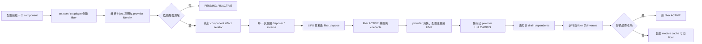

# DeepSeek Harness / Cordis 时空可组合性论文评估

> **Captured**: 2026-08-14
>
> **Primary source**: [A Programming Paradigm for Spatiotemporal Composability](https://github.com/cordiverse/paper/blob/948a07b369c62adb3b12e102458be5c18dfb69b9/paper.pdf), Yifan Shi, Wei Zhang, Tianyi Cui（Peking University / DeepSeek-AI），88 页；评估快照 `cordiverse/paper@948a07b`，PDF SHA-256 `4d48478dc0b6222d9f74d7db10ee776449b1209eb112632336544d32a49db97f`。
>
> **Comments under review**: [WeZZard 的 X 评论](https://x.com/realWeZZard/status/2087954840433668323)，2026-08-14 01:30 HKT；[lifcc 的 Prompt Runtime 评论](https://x.com/mylifcc/status/2087920167216906410)，2026-08-13 23:12 HKT。
>
> **Implementation cross-check**: [deepseek-ai/deepseek-harness@47f9438](https://github.com/deepseek-ai/deepseek-harness/tree/47f943859bef60e4160492346772ded9b24f765a)，以及其 vendored Cordis v4 source。
>
> **Repo baseline**: `repo-harness@6d62d3b` (`main`)。
> **Status**: research synthesis only；未改变产品代码、workflow policy 或 architecture authority。

## 结论

这篇论文的真正贡献不是“DeepSeek 发明了一个 TypeScript 专属的自进化 agent 工具系统”，而是给**进程内动态组件组合**建立了一套 effect/coeffect 运行时模型：

- **temporal composability**：组件产生的 context 内副作用必须携带 inverse，卸载时按 LIFO 撤销；
- **spatial composability**：组件声明它需要和提供的依赖，provider 变化时 runtime 自动协调 dependent 的停用、恢复和重新绑定；
- 在若干强假设成立时，系统可证明 recovery exactness、dependency ordering、progress 和 confluence，使最终静止状态只由最终组件配置决定，而不由中间热插拔历史决定。

论文的形式化工作有价值，Cordis/Koishi 也提供了真实工程存在性证据。但证据边界同样明确：案例只有一个 TypeScript 生态，Koishi 使用 Cordis v3，而论文描述 v4；没有对照实验、性能开销或开发效率数据；**self-evolving agent harness 只被列为动机和 future validation，尚未被论文验证。**

对 X 评论的裁决是：**副作用撤销、依赖协调、withholding/compensation、Proxy mediation 这些抓得准；“论文确立 TypeScript 在自进化 agent 上的地位”则与论文 §6.4 的明文结论相反。** 论文明确称 paradigm language-agnostic，并逐项讨论 Rust、Haskell、Python、Scala、Zig、native dynamic linking 和 WebAssembly 的实现路径。TypeScript 是 Cordis 当前实现的便利宿主，不是理论成立的必要条件。

lifcc 的补充评论比前一条更贴近 DeepSeek Harness 当前源码：**system prompt 确实不是一个单体字符串，而是由 identity、persona、tool guidance、dynamic context、tool schemas、variables 和 scoped waterfall 在每一步组装出的模型输入。** 不过“Prompt Runtime”是一个准确的架构概括，不是仓库定义的新模型协议；最终仍由 adapter 分别发送渲染后的 system text、tool schemas 和消息历史。评论所画的三层 scope 也应收紧为“global layer + 一个选定的 agent scope layer”，agent-specific override 就是该 scoped layer 的 shadowing 行为，并非额外的第三层继承树。

对 repo-harness 的处置：**吸收 boundary / inverse / dependency / compensation 这套审计语言，不引入 Cordis 作为 workflow authority，也不把所有 shell 或 hook 行为改造成动态插件。** repo-harness 管的是跨进程、跨 Git、跨 CI/PR/release 的 durable delivery authority；Cordis 管的是单一运行时内组件的细粒度生命周期。二者可上下分层，不能互相替代。

## 一、P1：论文与 DeepSeek Harness 的真实架构边界

### 1. 论文解决的系统问题

论文把动态组合拆成两个正交方向（§1、§3）：

1. **时间方向**：组件退出后，它对共享 context 的贡献应被完整撤销。
2. **空间方向**：组件应声明依赖，runtime 在依赖出现、消失或 provider 替换时协调生命周期。

它不是一篇 agent planning、tool-use learning、memory、multi-agent orchestration 或 benchmark 论文。Self-evolving agent harness 只是两个 motivating examples 之一；另一个是传统 plugin system。论文最后再次把 agent 自进化称为未来需要验证的方向（§8）。

### 2. 三层实现

论文 §5 把 Cordis 分成三层：

| 层 | 权威职责 |
|---|---|
| Cordis core | `ctx.effect` 跟踪 inverse；coeffect store/isolation/interception；fiber lifecycle |
| component loader | declarative config reconciliation、managed realms、HMR 与失败回滚 |
| application framework | 在通用组合语义之上定义具体领域；论文案例为 Koishi |

DeepSeek Harness 官方架构再在 Cordis 上把 model adapter、tool registry、session log、agent loop、sandbox、approval、UI 等都实现为 plugin。它的“everything is a plugin”是实际产品架构；论文的理论对象则是更一般的 component，不等于“每个 agent 临时脚本都是新 tool plugin”。

### 3. 证据规模与状态

- 论文 88 页，definitions/theorems/lemmas/corollaries 编号到 Definition 74；主体是形式化语义与证明，不是 88 页产品说明。
- Koishi 案例称有 4000+ community plugins，证明这类 abstraction 能承载真实开放生态。
- 论文自己把该证据定性为 **existence-and-adoption result**：单一生态、单一宿主语言、observational evidence，无受控基线。
- DeepSeek Harness 官方 README 在本次快照仍标记 **developer preview**，并明确预告 breaking changes。
- 论文仓库本次快照只有 README 和 PDF；未发现 arXiv ID、DOI、同行评审状态、可执行 proof artifact 或独立复现实验包。因此形式证明需要按印刷假设阅读，工程实现需要由源码和测试另行验证。

### 4. 明确不在保证内的状态

论文 §6.1 把世界分成 system boundary 内外：只有系统能独占修改并恢复的位置才属于 context `Γ`。典型区别是：

- acquisition（注册 handler、打开 descriptor、占用内存、启动 child process）可被 runtime 记录并撤销；
- emission（已写出的文件内容、已发出的网络数据、已发布的报纸、已完成的外部交易）越过 boundary，不会因为 fiber dispose 自动消失。

对越界 emission，论文只给两条应用级路径：在 commit 前 **withhold**，或事后执行 **compensation**。后者只恢复到应用定义的较粗 observational equivalence，论文前面的精确 metatheory 不会自动迁移过来。

## 二、P2：一条真实运行路径

下面是论文 calculus 到 Cordis 实现再到 Harness 的具体路径：

关键 handoff：

1. `ctx.effect(callback)` 驱动普通或 async iterator；每个 step 返回一个 disposer，runtime 反向组合。
2. `ctx.set(key, value)` 本身也是 effect；install 和 remove 都触发 dependency notification。
3. fiber 只在 inject 的所有 key 都解析到 ACTIVE provider 时加载；它提交的是 provider identity view，不只是“是否存在”的布尔值。
4. provider 退出时先停止对外提供，再等待已绑定 dependent 卸载，然后才执行自身 disposer，避免 consumer 在 teardown 中读到已拆掉的 provider。
5. HMR 先分类受影响 module，备份 cache，替换 stale fibers；任一 import 失败则恢复 cache 和旧 fibers。
6. DeepSeek Harness 的 durable `SessionEvent` log 与 Cordis lifecycle 是相邻但不同的 authority：前者保证 model-visible input 可重建，后者保证 context-mediated component contribution 可撤销。卸载一个 plugin 并不会倒改已经落盘的 session facts。

错误路径同样重要：

- inverse 的正确性由 component author 承担，`ctx.effect` **不验证** disposer 真能恢复 forward effect；
- in-flight iteration 只在 step boundary 观察 target 变化，已落地的一步随后由 accumulator 撤销；
- failure 会让不同 schedule 的 fiber lifecycle state 分叉，因此 confluence theorem 明确排除 failed fiber；
- untrusted code 不能只靠 Proxy/DI 权限，论文要求 process、Wasm、SFI 或 container 等外部 sandbox。

## 三、形式结论与成立条件

| 论文结论 | 含义 | 关键前提 / 边界 |
|---|---|---|
| Recovery exactness（Thm. 61 / Cor. 62） | 某 fiber 卸载后只移除自己的贡献，保留 interleaved peers 的贡献 | inverse 有效；跨 fiber effect pairwise independent/commutative；只到 observational equivalence |
| Ordering（Thm. 63） | consumer 仅在 provider 可用后启动；provider 在 consumer 之后退出 | well-formed registry；单一 provider discipline；guarded unload |
| Resolution coherence（Thm. 64） | 一次 activation 不跨两个 dependency resolution 执行 | target identity 被每一步检查；失配后 divert/rollback |
| Progress（Thm. 66） | 无 lifecycle deadlock，且最终 quiesce | dependency precedence acyclic；fiber 数有限；每个 effect iterator 长度有界 |
| Confluence（Thm. 73） | 相同 orchestration input 的不同 interleaving 到达同一静止状态 | pairwise independence；acyclic；provision total；无 failed fibers；只谈 state，不谈外部 emissions |

这张表是论文最需要保留的部分：它没有声称“任意副作用都能撤销”，而是在精确定义的 context、independence、acyclicity 和 totality 条件下给结果。把 theorem 结论拿走、把假设删掉，会把论文误读成通用事务系统。

## 四、X 评论逐项裁决

### 准确或基本准确

1. **动态生成、移除、替换组件需要同时处理副作用与依赖。** 这是论文的核心问题。
2. **只卸载代码不等于撤销代码做过的事。** 论文的 effect tracking 正是在修这个 gap。
3. **外部不可逆输出需要 withholding 或 compensation。** 与 §6.1 一致。
4. **Proxy 可做动态 dependency resolution 与访问检查。** Cordis 的 `ctx[key]` access 会沿 fiber chain 查 committed view，并区分 inactive/undeclared access。
5. **Module augmentation 改善 plugin 的 typed context ergonomics。** Cordis 源码确实通过 declaration merging 扩展 `Context` interface。

### 需要降级为评论者推断

1. **“主要讨论 agent 自进化 runtime”。** Agent 自进化是动机与未来应用；形式系统面向所有 dynamic component systems，实证是 Koishi plugin ecosystem。
2. **“相较 pi 提出全新工具范式”。** 论文没有评估 pi、bash-only harness 或任何 agent tool baseline，也没有提出 tool benchmark；它提出的是 component composition paradigm。把 tool 当 component 是可行应用，不是已比较结论。
3. **“重启会导致 transcript 无法还原的信息丢失”。** 论文谈的是 process-local accumulated state 和 in-flight task disruption；DeepSeek Harness 另用 append-only session log 解决 model history reconstruction。两者不能合并成论文已证明的 transcript guarantee。
4. **“几 GB session state”。** 属于解释性举例，不是论文测量。

### 与论文或语言事实冲突

1. **“论文确定了 TypeScript 在自进化 agent 上的地位”。** §6.4 明确写的是 language-agnostic，并列出多种等价实现路径。
2. **“TS/JS 基于原型链的类型系统，因此可动态改变类型结构”。** JavaScript runtime object model 是 prototype-based；TypeScript 的 static types 在运行时被擦除。Cordis 的 child context 确实用 prototype inheritance，但这不等于 runtime 改写 TS type system。
3. **“agent 挂一个新 tool 到 prototype，类型提示和安全检查会瞬时同步”。** runtime property 出现与 compile-time declaration 可见是两回事。Module augmentation 需要声明参与编译/语言服务，不能让任意运行时生成的 tool 自动获得静态类型证明。
4. **“JS module registry 可真正无痕卸载”。** 论文自己加了限定：CommonJS 有公开 cache；ESM 没有 public eviction API。即使 module cache 被清掉，仍被 closure、timer、listener、native resource 或外部 emission 引用的状态不会因 GC 自动消失。Cordis 的保证来自 disciplined context effects，不来自 GC 魔法。

## 五、补充评论：Prompt Runtime 逐项裁决

这条评论主要描述 [DeepSeek Harness 的 `dsh-system-prompt` 实现](https://github.com/deepseek-ai/deepseek-harness/tree/47f943859bef60e4160492346772ded9b24f765a/packages/core/system-prompt)，不是论文的形式化结论。它与论文的关系是：Cordis 提供可撤销、可分 scope 的组件生命周期，Harness 再用这个底座管理模型可见输入。

### 源码证实的部分

1. **Prompt 是一次 assembly，不是单一配置字符串。** `PromptAssembly` 明确定义为 `sections + contexts + tools + variables`；`system-prompt/assemble` waterfall 可在每次请求中继续变换 assembly。
2. **Identity、persona 和 tool guidance 是具名、排序的 section。** 固定 identity 位于 order `-100`，deployment persona 位于 `0`，tool guidance 约定使用 `100–199`。注册顺序不是模型顺序的权威。
3. **能力可以同时拥有实现、schema 和 model-facing guidance。** 官方 tool packages 会注册自己的 tool schema 与 `tool:*` prompt section；当所属 Cordis fiber dispose 时，这些贡献一并撤销。
4. **Runtime context 与稳定 instruction 被刻意分离。** context provider 每次 assembly 求值，随后作为有来源的 durable user-role snapshot 进入 session history，并标明新 snapshot supersede 旧 snapshot；它不需要改写稳定 system text。
5. **Scope shadowing 是真实机制。** global registrations 与本次 assembly 选定的一个 `ScopeKey` 合并；同名 scoped section/context/variable 覆盖 global contribution。per-child persona 正是通过 child scope 覆盖 deployment persona。
6. **变量与 section 采用 fail-loud 规则。** 同层重复 section/context/variable 在注册时抛错；未知、无值或 malformed 的完整 `{{variable}}` 引用在 render 时抛错；非法 `toolOrder` 或未知 tool name 也会在 load/assembly 阶段失败。
7. **Tool schema 本身属于 prompt surface。** schema 的 name、description、parameters、availability 和 canonical ordering 与 section 一起进入 assembly，虽然后续在 provider wire protocol 中通常作为独立字段发送。

### 需要收紧的部分

1. **“Prompt Runtime”是分析标签，不是新的 wire protocol。** Harness 内部把模型输入当作可组合 runtime state；模型最终仍接收 system prompt、tools 和 messages 等现有协议字段。
2. **scope 不是 `Global → Agent Scope → Agent-specific Override` 三层任意继承。** 当前 authority 是 global layer 加一个被选中的 scoped layer；agent-specific override 就发生在后者，不是第三个独立层。子 agent 也不会自动继承父 agent 的完整 prompt/tool authority，而是获得新的 scoped world，再显式装载 persona、tool filter 等能力。
3. **“每个能力自己携带 Prompt”是推荐的 ownership pattern，不是类型系统强制的不变量。** section、tool schema 和 executable lookup 是可分别注册的 surface；官方文档因此要求 tool filtering 使用统一的 `ToolRuntime.restrict()`，避免展示、查找和执行发生漂移。
4. **dynamic context 不是无历史、无成本的旁路注入。** 它被写成 durable user-role snapshot；变化会增加模型可见 history，直到 compaction 或 surface projection 处理它。分离的是 instruction ownership 与 current-state representation，不是取消 context token 成本。
5. **middleware 权力受约束。** waterfall listener 可以修改甚至 short-circuit 普通 assembly，但 `complete: true` section 会在 waterfall 后恢复为唯一 prompt；listener 若改 tools 或 structured protocol，自己承担一致性与确定性。

因此这条评论的最佳表述是：**DeepSeek Harness 把 prompt construction 提升为具有 registry、scope、lifecycle、validation 和 middleware 的运行时子系统。** “Prompt 从文案变成基础设施”是成立的工程判断；“Prompt 已成为一种新程序语言”则仍是比喻，源码提供的是 typed composition runtime，而非独立语言、编译器或形式语义。

## 六、P3：对 repo-harness 的设计决定

### 1. 边界判断

repo-harness 当前是 delivery/workflow governance，不是 long-lived application plugin host：

- hook runtime 通过 typed route registry 把 `(event, route_id)` 绑定到 exactly one in-process handler；它强调唯一 authority，不支持 agent 随运行任意改写 handler graph；
- MCP coding processes 有 owner/workspace binding、并发 admission、timeout、process-tree termination 和 retained output，但 child process 对 workspace 的文件写入不会随 session termination自动逆转；
- contract worktree、CloseoutJournal、`recover abort|reconcile` 处理的是 Git / PR / merge 等跨进程 durable effects，粒度更粗，但证据和恢复能跨 runtime restart 存活。

因此 Cordis 不应取代 repo-harness 的 plan/contract/review/receipt authority。若未来确有 same-process FleetRuntimeAdapter 或动态 extension host，它可以作为 execution-layer 参考，结果仍必须投影回 repo artifacts 和 receipts。

### 2. 值得吸收的四条契约语言

1. **Effect boundary**：每个 runtime extension 明确列出 context 内 acquisition、boundary 外 emission，以及各自 inverse / compensation / withholding 策略。
2. **Dependency view**：依赖绑定到 provider identity + version/subject，而不是“同名能力存在”布尔值；provider replacement 必须让 dependent 明确重算。
3. **Teardown order**：先停止 provider admission，再 drain dependents，再释放 provider；不能只靠 process exit 或最终 `finally`。
4. **Proof obligation as test surface**：每个 disposer 都要有 forward → dispose 的 state-equivalence test；外部 effect 走 durable journal 与 explicit reconciliation，不伪装成可逆 closure。

这些是审计语言和未来 adapter acceptance 条件，不是本研究授权的新 abstraction。

### 3. 明确拒绝

| 候选动作 | 处置 | 理由 |
|---|---|---|
| 把所有 hooks/actions 改为 Cordis plugin | 拒绝 | 当前 route registry 的 single authority 与 deterministic routing 更重要；没有动态卸载需求证据 |
| 用 in-memory disposer 替代 worktree/closeout journal | 拒绝 | disposer 不能跨进程崩溃，也不能撤销 push/PR/merge 等外部 emission |
| 允许 agent 直接生成并热装任意 TypeScript tool | 拒绝 | 论文未验证 self-evolving harness；还缺 sandbox、type/version contract、inverse witness 和 adversarial evaluation |
| 认为 bash-only tool 天生不可治理 | 拒绝 | 问题取决于 execution boundary 与 effect contract，不取决于入口叫 bash 还是 typed tool |
| 直接采纳 Cordis 的 dependency key semantics | 拒绝 | 论文 §6.6 自认 key collision、interface drift 与跨版本 structural compatibility 仍是 open problem |

## 七、可信度与待验证边界

**总体可信度：中高（理论结构）；中（当前工程普适性）；低（自进化 agent 已验证）。**

支撑高置信的证据：论文全文、精确 theorem assumptions、DeepSeek Harness 官方 README/architecture、vendored Cordis source 可相互印证。

限制置信度的证据缺口：

- 没有同行评审/正式出版标识；
- 没有 machine-checked proof；
- 没有 Cordis v4 对照实验、overhead benchmark 或 failure-injection results；
- Koishi 生产案例仍是 Cordis v3；
- DeepSeek Harness 处于 developer preview；
- 没有 agent 自动生成、验证、部署、撤销自身 component 的端到端实验；
- 没有证明恶意或错误 disposer 的隔离效果；论文明确把 untrusted code sandbox 交给外部机制。

## 八、来源

### Primary

1. [论文固定版本 PDF](https://github.com/cordiverse/paper/blob/948a07b369c62adb3b12e102458be5c18dfb69b9/paper.pdf) — 全文；重点 §1、§3、§4.4、§5、§6、§8。
2. [DeepSeek Harness 固定版本](https://github.com/deepseek-ai/deepseek-harness/tree/47f943859bef60e4160492346772ded9b24f765a) — README、`docs/architecture.md`、`vendor/cordis/src/context.ts`、`fiber.ts`、`reflect.ts`、`registry.ts`。
3. [Cordis upstream](https://github.com/cordiverse/cordis) — 论文实现所对应的 framework 项目。
4. [WeZZard 的被评评论](https://x.com/realWeZZard/status/2087954840433668323) — 对论文、TypeScript 与自进化 agent 的主张；其引用帖只展示论文首页。
5. [lifcc 的 Prompt Runtime 评论](https://x.com/mylifcc/status/2087920167216906410) — 对 Harness system-prompt assembly、scope、context 与 tool schema 的源码解读。

### Method

- 论文 PDF 逐页转文本并按章节、definitions/theorems、implementation algorithms、discussion/limitations 交叉核对。
- 以固定 commit 浅克隆 DeepSeek Harness，核对官方架构说明与 vendored Cordis v4 source。
- 将两条评论拆成可证伪主张，分别标注为 paper fact、implementation fact、commentator inference 或 contradiction。
- 未把社交平台转述、搜索摘要或本地记忆当作论文事实权威。
