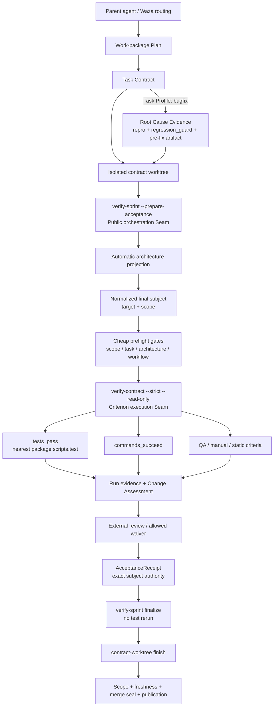
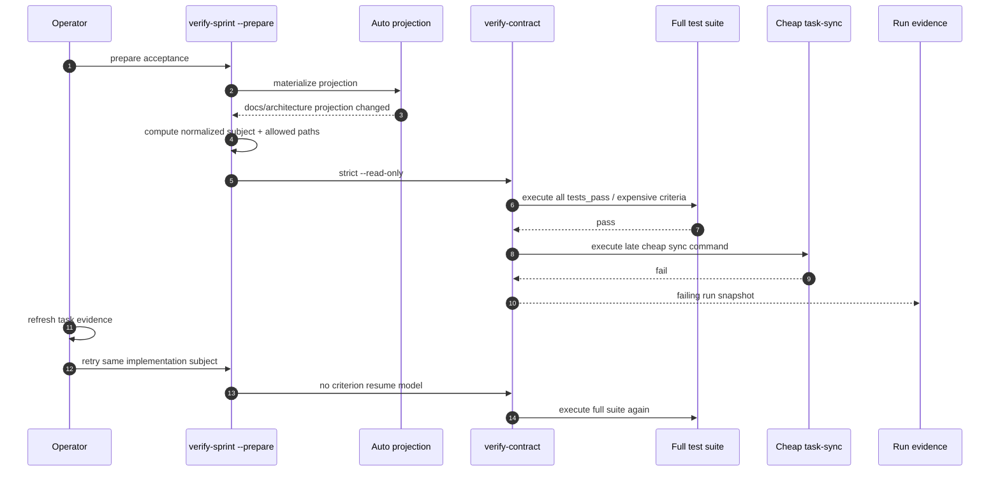

## 结论与置信度

**repo-harness 并没有对所有实现强制 TDD。** 当前机器门禁强制的是：当合同明确标记为 `Task Profile: bugfix` 时，必须先提供可复现失败、`regression_guard` 和非零 `PRE_FIX_EXIT` 的 pre-fix 证据；其他 profile 不触发该门禁。严格说，这属于 **bugfix-scoped test-first regression proof**，并不是完整的 red-green-refactor 教条。([`sprint-contracts.md:L41-L82`](https://github.com/Ancienttwo/repo-harness/blob/050145cbae165d65172baf19c1e801a38123d3b5/docs/reference-configs/sprint-contracts.md#L41-L82)，[`verify-contract.sh:L995-L1015`](https://github.com/Ancienttwo/repo-harness/blob/050145cbae165d65172baf19c1e801a38123d3b5/scripts/verify-contract.sh#L995-L1015))

但仓库也**尚未把这条 bugfix 规则进一步限制为“高风险 Seam”**：所有被标为 bugfix 的合同面对同一门禁，`regression_guard` 只要求是一个失败后转绿的测试路径，没有要求它必须穿过公开调用者或 production entrypoint。与此同时，通用合同模板会为所有新合同预填 `tests/unit/<slug>.test.ts`，这不是机器强制 TDD，却是最明确的“为了有测试文件而造测试”的结构性诱因。([`contract.template.md:L35-L46`](https://github.com/Ancienttwo/repo-harness/blob/050145cbae165d65172baf19c1e801a38123d3b5/assets/templates/contract.template.md#L35-L46)，[`contract.template.md:L122-L138`](https://github.com/Ancienttwo/repo-harness/blob/050145cbae165d65172baf19c1e801a38123d3b5/assets/templates/contract.template.md#L122-L138)，[`plan-to-todo.sh:L267-L283`](https://github.com/Ancienttwo/repo-harness/blob/050145cbae165d65172baf19c1e801a38123d3b5/scripts/plan-to-todo.sh#L267-L283))

对 incremental retry handoff 的核心判断是：

> **最佳 regression seam 是 `verify-sprint --prepare-acceptance`；cache/fuse 的权威也应在 `verify-sprint`，而不是藏进 `verify-contract`。**

原因是 `verify-sprint` 同时拥有 automatic projection、normalized subject、target revision、contract/goal authority、Change Assessment、run evidence 和 AcceptanceReceipt；`verify-contract` 只应保持为可独立调用、每次忠实执行所声明 criteria 的无状态执行器。([`verify-sprint.sh:L886-L990`](https://github.com/Ancienttwo/repo-harness/blob/050145cbae165d65172baf19c1e801a38123d3b5/scripts/verify-sprint.sh#L886-L990)，[`verify-contract.sh:L1045-L1165`](https://github.com/Ancienttwo/repo-harness/blob/050145cbae165d65172baf19c1e801a38123d3b5/scripts/verify-contract.sh#L1045-L1165))

**总体置信度：0.91。**

* TDD 实际门禁范围：**0.97**
* Seam／Tracer Bullet 映射：**0.89**
* incremental retry 放置与测试方法：**0.90**
* “为了测试而测试”在实际合同中的普遍程度：**0.62，证据不足**
* 计划所述两次运行的精确时长与 subject identity：**0.60，只能核实计划记载和代码机制，无法核实被忽略的 runtime snapshots**

### 审计绑定

GitHub Connector 当前没有枚举到可解析的 live branch ref；因此本次没有假装审查一个仍在变化的分支，而是锁定 PR #218 metadata 保存的不可变最后 head：

* branch name：`codex/local-human-control-board-v1`
* frozen head：`050145cbae165d65172baf19c1e801a38123d3b5`
* PR #218 已合并。([PR #218](https://github.com/Ancienttwo/repo-harness/pull/218))

以下所有 GitHub permalink 均固定在该 SHA。该计划本身是 `Draft`，且明确写明“intentionally not the active plan”，所以它是待评审设计，不是已生效政策。([`plan…incremental-retry.md:L1-L16`](https://github.com/Ancienttwo/repo-harness/blob/050145cbae165d65172baf19c1e801a38123d3b5/plans/plan-20260824-2214-verify-sprint-incremental-retry.md#L1-L16))

---

## 外部主张与 repo 事实分栏

| 外部主张（待检验）                          | Repo 事实                                                                                       | 判定                                                    |
| ---------------------------------- | --------------------------------------------------------------------------------------------- | ----------------------------------------------------- |
| 不应对所有实现强制 TDD                      | 只有 `Task Profile: bugfix` 调用 Root Cause Evidence gate；其他 profile 不触发。                         | **成立，而且仓库基本已经这样做。**                                   |
| 只对关键 Seam 做 TDD                    | 当前 bugfix gate 没有 risk/seam qualifier，也没有公开调用者要求；golden example 甚至直接测试 helper。                | **尚未实现。只能说 bugfix-scoped，不能说 high-risk-Seam-scoped。** |
| 测试应优先验证公开行为而非私有 helper             | Cutover 文档要求 composition fixture 穿过 production entrypoint；但 generic bugfix gate 与示例并未体现这条优先级。 | **仓库内部存在正确做法，但政策不一致。**                                |
| 先用 Tracer Bullet 验证最薄竖切            | P2 只要求画一条真实流程；真正可执行的对应物是 production-entrypoint composition fixture。                           | **P2 只是描述性相似；composition fixture 才是真正同构。**            |
| TDD + Seam + Tracer Bullet 应成为更好流程 | 对本次 verification scheduler 变更很适合，但没有证据支持把它升级为全仓库强制步骤。                                         | **适合作为局部选择原则，不适合作为新全局框架。**                            |

支持上述判断的核心权威文本包括 [`agentic-development-flow.md:L8-L32`](https://github.com/Ancienttwo/repo-harness/blob/050145cbae165d65172baf19c1e801a38123d3b5/docs/reference-configs/agentic-development-flow.md#L8-L32)、[`agentic-development-flow.md:L67-L97`](https://github.com/Ancienttwo/repo-harness/blob/050145cbae165d65172baf19c1e801a38123d3b5/docs/reference-configs/agentic-development-flow.md#L67-L97) 及 [`sprint-contracts.md:L165-L184`](https://github.com/Ancienttwo/repo-harness/blob/050145cbae165d65172baf19c1e801a38123d3b5/docs/reference-configs/sprint-contracts.md#L165-L184)。

---

# A. 当前是否“过度强制 TDD”

## 直接判定

**不是全实现强制 TDD；是 bugfix-profile-wide 的 pre-fix regression gate，加上全合同范围的 unit-test scaffold bias。**

### 机器真正强制的内容

`verify-contract.sh`：

1. 接受多个 task profile；
2. 只有 `task_profile == bugfix` 才运行 `check_root_cause_evidence`；
3. 检查四个字段；
4. 要求 guard 同时出现在 `exit_criteria.tests_pass`；
5. 要求 artifact 存在、包含 guard path，并带非零 `PRE_FIX_EXIT`。([`verify-contract.sh:L200-L310`](https://github.com/Ancienttwo/repo-harness/blob/050145cbae165d65172baf19c1e801a38123d3b5/scripts/verify-contract.sh#L200-L310)，[`verify-contract.sh:L995-L1015`](https://github.com/Ancienttwo/repo-harness/blob/050145cbae165d65172baf19c1e801a38123d3b5/scripts/verify-contract.sh#L995-L1015))

`root-cause-prover` 也被明确限定为 bugfix-only，且只负责诊断、失败复现和候选 guard，不得修改生产实现。([`root-cause-prover.md:L1-L22`](https://github.com/Ancienttwo/repo-harness/blob/050145cbae165d65172baf19c1e801a38123d3b5/agents/fleet/root-cause-prover.md#L1-L22))

### 没有被强制的内容

没有机器规则要求：

* feature 必须先红；
* docs-only 必须造测试；
* 每个 private helper 都有 unit test；
* 必须执行 refactor 阶段；
* 每个小任务都显式写 Seam 或 Tracer Bullet。

因此把当前制度称为“全仓库 TDD”是不准确的。

### 仍然存在的过度倾向

通用模板为所有合同预填：

```yaml
tests_pass:
  - path: tests/unit/{{TASK_SLUG}}.test.ts
```

而 `plan-to-todo.sh` 对缺少 profile 的计划默认使用 `code-change`，并直接对通用模板做字符串替换，没有按 profile 删除这个 synthetic test path。([`contract.template.md:L122-L138`](https://github.com/Ancienttwo/repo-harness/blob/050145cbae165d65172baf19c1e801a38123d3b5/assets/templates/contract.template.md#L122-L138)，[`plan-to-todo.sh:L267-L283`](https://github.com/Ancienttwo/repo-harness/blob/050145cbae165d65172baf19c1e801a38123d3b5/scripts/plan-to-todo.sh#L267-L283)，[`plan-to-todo.sh:L408-L603`](https://github.com/Ancienttwo/repo-harness/blob/050145cbae165d65172baf19c1e801a38123d3b5/scripts/plan-to-todo.sh#L408-L603))

这是模板压力，不是 verifier 的硬要求，但它会让 agent 把“合同必须完成”误读成“必须发明一个 unit test 文件”。

---

# P1 — 架构图与概念映射



这张图由现有 plan/contract/worktree/check 路径直接抽取：复杂或高风险任务才要求显式 P1/P2/P3；合同是允许路径和退出标准的执行切片；`verify-sprint` 负责 acceptance orchestration；`verify-contract` 执行 criteria；`contract-worktree finish` 在发布前验证 receipt、architecture freshness、final verify、scope 和 merge seal。([`agentic-development-flow.md:L67-L97`](https://github.com/Ancienttwo/repo-harness/blob/050145cbae165d65172baf19c1e801a38123d3b5/docs/reference-configs/agentic-development-flow.md#L67-L97)，[`verify-sprint.sh:L886-L990`](https://github.com/Ancienttwo/repo-harness/blob/050145cbae165d65172baf19c1e801a38123d3b5/scripts/verify-sprint.sh#L886-L990)，[`contract-worktree.sh:L1860-L1950`](https://github.com/Ancienttwo/repo-harness/blob/050145cbae165d65172baf19c1e801a38123d3b5/scripts/contract-worktree.sh#L1860-L1950))

## B. Seam／Tracer Bullet 与现有机制的映射

| Repo 概念                                       | 与 Seam／Tracer Bullet 的关系                                | 判定                                                    |
| --------------------------------------------- | ------------------------------------------------------- | ----------------------------------------------------- |
| **P1**                                        | 找边界、入口、owner、权威文件和 forbidden dependencies，能帮助识别 Seam。   | **部分同构。** P1 是边界发现方法，不是测试 Seam 本身。                    |
| **P2**                                        | 描述“一条真实请求如何穿过层次”。                                       | **表面／认知层相似。** 它是图和解释，不保证存在一条可执行竖切。                    |
| **P3**                                        | 解释不变量、为何采用当前形状，以及最小 coherent change。                    | **辅助关系。** 它支持选择测试点，但不是 TDD 或 Tracer Bullet。           |
| **Root Cause Evidence**                       | 强制先证明现有失败，再修改生产实现。                                      | **与 TDD 的 red 阶段强相似。** 但没有 refactor 阶段，也没有 Seam 选择规则。 |
| **regression_guard**                          | 可以放在公开 Seam，也可以直接测 helper；当前 schema 不区分。                | **条件同构。** 只有 guard 穿过真实调用者时才是 Seam test。              |
| **task contract**                             | 可以把一个最薄竖切约束在 allowed paths 和 exit criteria 内。           | **容器，不是竖切本身。** 合同也可能是纯横向 refactor。                    |
| **production-entrypoint composition fixture** | 从公开入口穿过多个真实层次验证组合。                                      | **与 Tracer Bullet 最强同构。**                             |
| **`verify-sprint --prepare-acceptance`**      | 本次 bug 的实际调用者边界，跨 projection、subject、contract、evidence。 | **本次最正确的公开 Seam。**                                    |
| **`verify-contract`**                         | criteria 的公开执行边界。                                       | **是真实 Seam，但层级较低。** 适合验证单次执行，不适合拥有跨次 cache authority。 |
| **AcceptanceReceipt**                         | 对最终 subject、target、contract/goal 和 evidence 做精确绑定。      | **非同构。** 它是最终验收权威，不是探索性 Tracer Bullet，也不是 TDD 步骤。     |

仓库已经明确要求 composition-heavy 变更用“production entrypoint + combined-feature case”，并把 scoped tests 放在迭代期、root full suite 放在报告完成前；这比简单要求每个 helper 都有 unit test 更接近 Tracer Bullet。([`sprint-contracts.md:L165-L184`](https://github.com/Ancienttwo/repo-harness/blob/050145cbae165d65172baf19c1e801a38123d3b5/docs/reference-configs/sprint-contracts.md#L165-L184))

---

# P2 — 一条具体 incremental retry 流程 trace

## 当前真实路径



以下部分是**源码直接事实**：

* automatic projection 已经在 review subject 冻结之前执行；
* allowed-path status 已经在调用 `verify-contract` 前计算；
* 但当前代码没有在该处 short-circuit，而是立即无条件调用 `verify-contract`；
* `verify-contract` 先执行所有 `tests_pass`，之后才执行 `commands_succeed`，QA/manual/static checks 更晚；
* retry 没有 pass-result consumer。([`verify-sprint.sh:L886-L990`](https://github.com/Ancienttwo/repo-harness/blob/050145cbae165d65172baf19c1e801a38123d3b5/scripts/verify-sprint.sh#L886-L990)，[`verify-contract.sh:L1045-L1165`](https://github.com/Ancienttwo/repo-harness/blob/050145cbae165d65172baf19c1e801a38123d3b5/scripts/verify-contract.sh#L1045-L1165))

计划记载第一次 full suite 为 `977844ms`、最后 task-sync 只需 `53ms`，修正 task evidence 后第二次 full suite 为 `1069849ms`。这些数字来自 Draft plan；其引用的 `.ai/harness/runs/*.json` 属 ignored runtime evidence，没有提交到 Git，因此本次 Connector 调研不能独立复核数字本身。([`plan…incremental-retry.md:L18-L37`](https://github.com/Ancienttwo/repo-harness/blob/050145cbae165d65172baf19c1e801a38123d3b5/plans/plan-20260824-2214-verify-sprint-incremental-retry.md#L18-L37)，[`AGENTS.md:L25-L39`](https://github.com/Ancienttwo/repo-harness/blob/050145cbae165d65172baf19c1e801a38123d3b5/AGENTS.md#L25-L39))

## Same-subject 是否成立

`buildReviewSubject` 对最终 implementation content 做 normalized hash，并排除：

* `plans/`
* task contracts/reviews/notes/archive/current/todos
* checks/evidence/runs/handoff 等 `.ai/harness` 运营证据

所以只刷新 task-sync 所需的 task evidence，确实可以保持同一 implementation subject。一般 `docs/` **没有被排除**，automatic architecture projection 位于 `docs/architecture/`，因此会进入 subject；当前测试也明确验证 projection manifest 在 subject 冻结前出现。([`diff-fingerprint.ts:L370-L548`](https://github.com/Ancienttwo/repo-harness/blob/050145cbae165d65172baf19c1e801a38123d3b5/src/effects/review/diff-fingerprint.ts#L370-L548)，[`helper-scripts.test.ts:L3889-L3911`](https://github.com/Ancienttwo/repo-harness/blob/050145cbae165d65172baf19c1e801a38123d3b5/tests/helper-scripts.test.ts#L3889-L3911))

这也说明 plan 的第一项“projection 在 key 前 materialize”在该 SHA **已经基本成立**。它应保留为 regression invariant，而不是被描述成尚不存在的主要实现工作。真正缺失的是：

> projection 后先运行 cheap preflight，并在其失败时阻止 expensive runner 启动。

## C. 最佳 regression guard 应放在哪里

最佳 guard 应位于：

```text
tests/helper-scripts.test.ts
  └─ real public entry:
     bash scripts/verify-sprint.sh --prepare-acceptance
        ├─ automatic projection
        ├─ actual normalized subject
        ├─ actual verify-contract
        ├─ expensive-command invocation counter
        └─ actual run/check evidence
```

不应只对一个新提取的 `shouldReuseCriterion()` helper 写 unit test。现有测试已经提供两种正确 fixture：

1. 通过真实 `verify-sprint --prepare-acceptance` 验证 projection-before-subject；
2. 用 sentinel 证明 finalization 不会再调用 `verify-contract`。([`helper-scripts.test.ts:L3889-L3988`](https://github.com/Ancienttwo/repo-harness/blob/050145cbae165d65172baf19c1e801a38123d3b5/tests/helper-scripts.test.ts#L3889-L3988)，[`helper-scripts.test.ts:L3988-L4034`](https://github.com/Ancienttwo/repo-harness/blob/050145cbae165d65172baf19c1e801a38123d3b5/tests/helper-scripts.test.ts#L3988-L4034))

### 哪些需要 TDD，哪些直接实现更合理

| 计划元素                                            | 方法建议                                                                                | 理由                                                                                   |
| ----------------------------------------------- | ----------------------------------------------------------------------------------- | ------------------------------------------------------------------------------------ |
| **Pre-fix regression**                          | **必须先红。**                                                                           | 它定义本次 bug 的公开行为：同一冻结 subject 因 cheap gate 修正而 retry 时，expensive invocation 由 2 降到 1。 |
| **Same-subject key、pass reuse、invalidation**    | **需要 TDD。** 先写 public integration；只有 scheduler 真正抽成 TS 时再加 table-driven unit tests。 | 错误 cache hit 会把未验证状态升格为 pass，属于高风险 verification Seam。                                |
| **Force fuse**                                  | **需要 TDD。**                                                                         | 必须用 sentinel 证明第二次相同 expensive execution 在 process spawn 前被拒绝；这不是仅检查错误字符串。           |
| **把 cheap gates 前移**                            | **不需要为每个 shell helper 单独走 TDD。**                                                    | 由上述公开 regression 覆盖其行为即可；直接调整 phase ordering 更合理。                                    |
| **executed/reused/forced provenance、文档、CLI 文案** | **直接实现，再在同一 integration fixture 中断言。**                                              | 为每个 JSON formatter 或参数 parser 制造私有 unit test收益低。                                     |

---

# P3 — 决策理由

## 1. Cache authority 应属于 `verify-sprint`

`verify-sprint` 拥有跨次复用所必需的全部权威：

* projection ordering；
* normalized implementation subject；
* target revision；
* contract 与 goal authority；
* allowed-path result；
* Change Assessment；
* run snapshot/checks projection；
* AcceptanceReceipt composition。

`verify-contract` 则负责一次调用中忠实执行合同 criteria。其 `--read-only` 只表示不更新合同状态，不表示“不执行命令”；仓库已有测试专门证明 read-only 仍执行 command criteria。把 cache 偷藏进 `verify-contract` 会改变这个公开语义。([`sprint-contracts.md:L151-L164`](https://github.com/Ancienttwo/repo-harness/blob/050145cbae165d65172baf19c1e801a38123d3b5/docs/reference-configs/sprint-contracts.md#L151-L164)，[`tests/helper-scripts.test.ts:L3270-L3360`](https://github.com/Ancienttwo/repo-harness/blob/050145cbae165d65172baf19c1e801a38123d3b5/tests/helper-scripts.test.ts#L3270-L3360))

因此合理分工是：

```text
verify-sprint:
  decide execute / reuse / reject / force
  compose evidence

verify-contract / bounded runner:
  execute one selected criterion faithfully
  report exit, signal, timeout, duration
```

## 2. Plan 的主要方向成立，但有一个未闭合分类问题

计划要求区分：

* preflight/cheap state gates；
* expensive deterministic tests/runtime smoke；
* receipt-only projection。

方向正确，但“expensive deterministic”目前只是 prose，没有机器可判定规则。不能根据 duration 或命令名字猜测某项可以缓存；尤其 runtime smoke 可能依赖外部状态。

**安全的 v1 应默认不复用未知 criteria，只对明确 opt-in 的 criterion 启用 exact-subject pass reuse。** 这可以通过扩展现有 `commands_succeed` item 或 policy-owned allowlist 完成，不需要建立新缓存框架。计划当前只说 key “at least” 包含 subject、target、contract/goal、criterion、toolchain，因此在实施前仍需冻结 canonical eligibility 和 key schema。([`plan…incremental-retry.md:L53-L84`](https://github.com/Ancienttwo/repo-harness/blob/050145cbae165d65172baf19c1e801a38123d3b5/plans/plan-20260824-2214-verify-sprint-incremental-retry.md#L53-L84))

## 3. Force fuse 应是 acceptance-scheduler 边界，不应是全局测试禁令

Fuse 只应约束：

* `verify-sprint --prepare-acceptance`
* 同 repository/worktree authority
* 同 exact key
* 明确标为 reuse-enabled 的 expensive criterion
* 已有 prior pass

它不应阻止开发者：

* 直接执行 `bun test`；
* 直接执行 `verify-contract`；
* 重跑非 cacheable runtime smoke；
* 调试 flaky test。

这使 fuse 成为“防止 acceptance scheduler 无意重复花费”的安全阀，而不是新的测试教条。

---

# D. 当前规则中的具体问题与正确位置

## 可能诱发“为了测试而测试”或反馈过晚

| 位置                                      | Repo 事实                                                                                    | 失败模式                                                                     |
| --------------------------------------- | ------------------------------------------------------------------------------------------ | ------------------------------------------------------------------------ |
| `assets/templates/contract.template.md` | 所有通用合同默认出现 `tests/unit/{{TASK_SLUG}}.test.ts`。                                             | Agent 为填满模板而发明低价值 unit test。                                             |
| `scripts/plan-to-todo.sh`               | 缺少 profile 时默认为 `code-change`，模板渲染不按 profile 删除 synthetic test path。                       | scaffold bias 扩散到普通 feature、配置和流程变更。                                     |
| bugfix Root Cause gate                  | 所有标成 bugfix 的任务都必须有 pre-fix guard，没有 seam/risk/public-caller 条件。                           | 低风险或难自动化 bug 可能产生 contrived test，或诱发 profile gaming。实际频率证据不足。            |
| golden bugfix example                   | 示例直接测试 `isNonEmptyLabel` helper，并把其他 callers 列为 out of scope。                              | 教学上暗示“测 helper 就够”，与 closest-real-caller 原则相反；不过它只是 gate fixture，不是产品测试。 |
| `verify-contract`／`verify-sprint` 顺序    | 所有 `tests_pass` 在 `commands_succeed` 前；allowed-path status 虽先计算，却不阻止 `verify-contract` 启动。 | 53ms 级 sync/scope 错误可能在十几分钟 suite 之后才反馈。                                 |

证据分别见 [`contract.template.md:L122-L138`](https://github.com/Ancienttwo/repo-harness/blob/050145cbae165d65172baf19c1e801a38123d3b5/assets/templates/contract.template.md#L122-L138)、[`plan-to-todo.sh:L267-L283`](https://github.com/Ancienttwo/repo-harness/blob/050145cbae165d65172baf19c1e801a38123d3b5/scripts/plan-to-todo.sh#L267-L283)、[`contract-brief-example-bugfix.md:L12-L48`](https://github.com/Ancienttwo/repo-harness/blob/050145cbae165d65172baf19c1e801a38123d3b5/docs/reference-configs/contract-brief-example-bugfix.md#L12-L48)、[`verify-contract.sh:L1045-L1165`](https://github.com/Ancienttwo/repo-harness/blob/050145cbae165d65172baf19c1e801a38123d3b5/scripts/verify-contract.sh#L1045-L1165) 和 [`verify-sprint.sh:L920-L975`](https://github.com/Ancienttwo/repo-harness/blob/050145cbae165d65172baf19c1e801a38123d3b5/scripts/verify-sprint.sh#L920-L975)。

另有一处反馈成本的权威漂移：`sprint-contracts.md` 仍写固定 600 秒，而当前脚本是 `VERIFICATION_BUDGET_MS=3600000`，即 60 分钟；architecture module 已明确承认源码为准。([`verify-contract.sh:L1-L5`](https://github.com/Ancienttwo/repo-harness/blob/050145cbae165d65172baf19c1e801a38123d3b5/scripts/verify-contract.sh#L1-L5)，[`evals-checks.md:L82-L99`](https://github.com/Ancienttwo/repo-harness/blob/050145cbae165d65172baf19c1e801a38123d3b5/docs/architecture/modules/verification/evals-checks.md#L82-L99))

## 已经正确体现 Seam／Tracer Bullet 的位置

| 位置                                    | 正确之处                                                                                                          |
| ------------------------------------- | ------------------------------------------------------------------------------------------------------------- |
| `agentic-development-flow.md` routing | small/medium、bug hunt、complex planning、pre-merge check 分路，不把一种仪式强加给全部任务。                                      |
| P1/P2/P3 规则                           | small task 可内部完成；只有 complex/risky task 要显式 evidence，避免规划本身成为 ceremony。                                        |
| Root Cause Prover                     | 诊断／复现与生产修复分离，防止 agent 一边改代码一边伪造 root cause。                                                                   |
| Sprint Contract Cutover               | 明确要求先跑最小 falsifier、迭代期 scoped tests、composition-heavy 时通过 production entrypoint fixture，最后才跑 root full suite。 |
| `tests/helper-scripts.test.ts`        | 通过真实 `verify-sprint` CLI 和 disposable workspace 验证跨层行为；finalization 用 sentinel 证明不会重跑合同测试。                    |

对应权威证据见 [`agentic-development-flow.md:L8-L32`](https://github.com/Ancienttwo/repo-harness/blob/050145cbae165d65172baf19c1e801a38123d3b5/docs/reference-configs/agentic-development-flow.md#L8-L32)、[`agentic-development-flow.md:L67-L97`](https://github.com/Ancienttwo/repo-harness/blob/050145cbae165d65172baf19c1e801a38123d3b5/docs/reference-configs/agentic-development-flow.md#L67-L97)、[`root-cause-prover.md:L1-L22`](https://github.com/Ancienttwo/repo-harness/blob/050145cbae165d65172baf19c1e801a38123d3b5/agents/fleet/root-cause-prover.md#L1-L22)、[`sprint-contracts.md:L165-L184`](https://github.com/Ancienttwo/repo-harness/blob/050145cbae165d65172baf19c1e801a38123d3b5/docs/reference-configs/sprint-contracts.md#L165-L184)。

---

# E. 最小政策改动建议

## E1. 在既有 `regression_guard` 文案中加入 Seam 选择顺序，并移除 synthetic unit-test 默认值

**现状证据：** bugfix gate 只验证测试路径和 pre-fix artifact；模板默认生成 `tests/unit/<slug>.test.ts`；golden example 直接测试 helper。

**失败模式：** agent 为满足合同而测试 private helper 或制造空洞 unit test，而不是测试真实调用者可见行为。

**最小改动：**

在现有 `sprint-contracts.md`、`contract.template.md`、`root-cause-prover.md` 的 `regression_guard` 描述中加入一句：

> Choose the closest stable public caller or production entrypoint that reproduces the defect. Test a private helper only when the helper itself is the contractual algorithmic seam or no public path is practical; record the reason in `root_cause` or existing task notes.

同时将通用模板改成空的 `tests_pass`，不再预造路径；`bugfix` gate 仍要求作者填入 concrete guard。

**反例／代价：** 纯算法 helper 有时本身就是稳定 Seam；因此不能机器禁止 private-helper tests，只能要求解释例外。

**可验证验收：**

* 非 bugfix `plan-to-todo` 不再生成 synthetic test path；
* bugfix fixture 仍因空 guard fail closed；
* golden example 改为测试公开 caller，或明确记录 helper-as-contractual-seam 理由；
* 模板、source helper、installed projection parity tests 全部通过。

## E2. 把 cheap preflight 变成 `verify-sprint` 的 pre-spawn phase

**现状证据：** projection 和 allowed-path computation 已经在 subject/contract execution 前；但 allowed-path failure 不会阻止 `verify-contract` 启动，task/architecture/workflow sync 仍可能排在 full suite 后。

**失败模式：** cheap deterministic failure 在 expensive suite 后才暴露。

**最小改动：**

保留现有 criterion authority，不复制 check 清单；由 scheduler 在 projection 后先执行一个封闭的 read-only preflight phase：

* allowed paths／scope；
* task sync；
* architecture sync；
* workflow-contract sync；
* 其他明确声明为 cheap、无副作用的状态 gate。

任一失败即在 expensive runner spawn 前结束。

**反例／代价：** 不能根据 command 名字或历史 duration 自动推断“cheap”；第一版必须使用封闭集合，否则会产生第二套隐式分类权威。

**可验证验收：**

* automatic projection 造成 task-sync failure 时，expensive sentinel count 为 `0`；
* 修正 task evidence 后，expensive count 变为 `1`；
* preflight criteria 仍出现在 canonical run evidence；
* direct `verify-contract` 仍执行完整合同。

## E3. 只对显式 eligible criteria 启用 exact-key pass reuse

**现状证据：** `.ai/harness/runs` 已保留 per-criterion status、duration、exit/timeout，但没有复用 consumer；Draft plan 提议 exact key。

**失败模式：**

* 没有 cache：重复全量执行；
* cache 太宽：环境或外部状态已变，却错误复用 pass；
* 用 duration/name 猜“deterministic”：产生不可审计的隐式策略。

**最小改动：**

在现有 criterion 表达中加入可选的 exact-subject reuse metadata，默认 `never`，而不是建立新框架。Canonical key 至少绑定：

* repository/worktree authority；
* normalized subject；
* target revision；
* contract 与 goal digests；
* exact criterion kind/name/command；
* scheduler/helper implementation identity；
* relevant toolchain/environment fingerprint；
* automatic projection content。

只复用 prior `pass`；failure、timeout、missing、unknown 一律执行。

**反例／代价：** 保守 opt-in 会漏掉部分可复用测试；但 false miss 只多花时间，false hit 会破坏验收权威。

**可验证验收：** 按计划已有的 source、contract、goal、target、command、toolchain、projection invalidation matrix 全部逐项变异，并断言只要任一 authority 改变，process count 就增加。

## E4. Force fuse 只约束 acceptance scheduler，不改变开发者执行面

**现状证据：** 当前 `verify-sprint` 没有 `--force-expensive-rerun` 参数；这是 Draft proposal，尚未实现。

**失败模式：** 没有 fuse 时，scheduler bug 可能静默重复执行；全局 fuse 又可能阻塞正常 debug、flake investigation 和非 cacheable smoke。

**最小改动：**

* 仅在 `verify-sprint --prepare-acceptance` 内生效；
* 仅限 reuse-enabled criterion；
* 相同 exact key 已有 pass 时，第二次 spawn 必须提供非空 reason；
* direct `verify-contract`、direct test command 不受影响；
* evidence 记录 `executed | reused | forced` 及 reason。

**反例／代价：** flaky suite 需要显式 force，增加少量操作成本；这是可审计性换来的合理摩擦。

**可验证验收：**

* 无 force：在 spawn 前拒绝，sentinel 不变化；
* 有 force：sentinel 增加一次，reason 出现在 run snapshot；
* force 不改变 review subject 或 AcceptanceReceipt subject semantics。

## E5. 消除 600 秒／3600 秒双重权威

**现状证据：** reference config 写 600 秒，源码常量是 3600000ms，architecture module 已记录冲突。

**失败模式：** planner、operator 和测试会按错误时限设计 retry、超时和成本预期。

**最小改动：** 不在多个 prose 文件复制数字；reference config 指向一个 machine-readable policy 或源码常量，并由 projection/check 生成当前值。本建议**不主张此时降低 60 分钟 budget**。

**反例／代价：** 文档单独阅读时少一个直观数字，但避免陈旧数字成为伪权威。

**可验证验收：** 增加一个现有 parity/check 测试：文档所展示的 budget 必须由同一 authority 生成；手改任一副本都会 fail。

---

# F. 明确“不要改”的部分

1. **不要删除 bugfix pre-fix evidence gate。** 当前问题是 guard 选点不够精确，不是 test-first regression proof 本身错误。没有 corpus 证据支持给低风险 bugfix 增加泛化 waiver。

2. **不要削弱 AcceptanceReceipt。** exact normalized subject、target revision、contract/goal authority、Change Assessment 和 canonical evidence binding 都应保留；它们是最终 merge authority，不是这次延迟问题的根源。([`docs/spec.md:L39-L65`](https://github.com/Ancienttwo/repo-harness/blob/050145cbae165d65172baf19c1e801a38123d3b5/docs/spec.md#L39-L65))

3. **不要复用 failure、timeout、unknown 或跨 repo/worktree 的结果。** 也不要因为有 cache entry 就合成 pass；Draft plan 对这些 invariant 的方向是正确的。

4. **不要让 `verify-contract --read-only` 静默变成“不执行 criteria”。** 跨次调度属于 `verify-sprint`；独立 verifier 应继续提供可预测的完整执行语义。

5. **不要把 “Seam” 和 “Tracer Bullet” 升级成每份合同的新必填章节。** P1/P2/P3 已经覆盖边界、真实 flow 和决策理由；只需调整现有 guard 选点文案和测试模板。

6. **不要移除最终 full suite。** 应做到“一次 work-package 的最终 authoritative full suite 只执行一次”，而不是以 focused tests 替代最终验证。verification architecture 自己也指出，当前正确分层是小切片跑 focused tests，release/pre-merge 才跑 full gate。([`evals-checks.md:L69-L116`](https://github.com/Ancienttwo/repo-harness/blob/050145cbae165d65172baf19c1e801a38123d3b5/docs/architecture/modules/verification/evals-checks.md#L69-L116))

---

## 证据不足

* **Live branch 状态：** Connector 没有返回该 live branch；本报告只能证明 PR #218 frozen head `050145…` 的状态，不能证明未来重建的同名分支。
* **精确运行时长：** 两次 `977844ms`／`1069849ms` 和 `53ms` 来自 Draft plan；被引用的 `.ai/harness/runs` 未入 Git，无法独立核实。
* **无意义测试的实际比例：** 已证明存在模板诱因，但没有扫描历史合同与测试变更，不能断言仓库已普遍产生大量低价值测试。
* **高风险 Seam 的自动分类：** 当前没有数据或稳定 classifier；不应凭文章观点发明一套 risk score。
* **Cache eligibility：** Draft 使用“expensive deterministic”一词，但尚无机械 schema；在冻结 opt-in 规则之前，广泛缓存 arbitrary runtime smoke 的安全性证据不足。

---

## 行动排序（最多 5 条）

1. **先在 `tests/helper-scripts.test.ts` 写 public-Seam pre-fix regression**：真实 `verify-sprint --prepare-acceptance`、automatic projection、第一次 cheap failure、修正后 retry；当前代码应证明 expensive count 为 `2`。

2. **把 projection 后的 scope/task/architecture/workflow preflight 放到 expensive spawn 前**：先做到 cheap failure 时 count 为 `0`，修正后只执行一次 full suite。

3. **冻结 criterion eligibility 与 canonical exact key，再实现 pass-only reuse**：默认不复用未知 criterion，完成全部 invalidation matrix。

4. **加入仅限 acceptance scheduler 的 force fuse 与 executed/reused/forced provenance**：用 sentinel 证明 reject-before-spawn。

5. **最后收紧政策文案**：移除 generic synthetic unit path，加入 closest-public-Seam 原则，修正 golden example，并统一 600s／3600s 的 budget authority。
