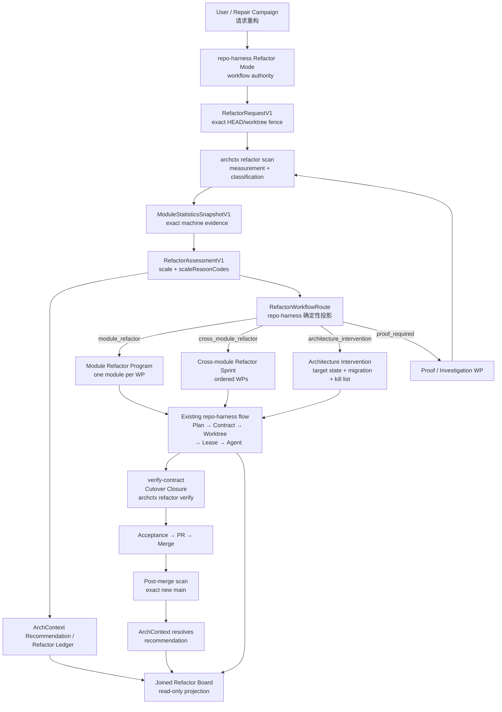

# 代码重构模式：双仓权威边界与实施 Sprint

> contract 字段对照的权威是 arch-context 主干的 `docs/researches/20260902-restructure.md` §0 修订记录；本文 §二十二 是下游对齐记录，只指回它、不独立演化。

> **下游发布读回（2026-09-04）**：上游全部 refactor surface 已随 `archctx@0.5.2` / `archctx-contracts@0.5.2` 发布。公开的 0.5.1 manifest 漏掉 `koffi`，只能视为历史坏包，不得安装。下游 scan 与 verify 继续使用分阶段 feature gate，但两个 stage 都精确绑定 0.5.2；`docs/verification/axr5-archctx-clean-room-readback.json` 是本仓的 packaged readback 证据。正文中的 0.5.0/0.5.1 顺序保留为历史设计记录，不再是执行 pin。

## 最终决策

应采用一条非常清晰的分界：

```text
ArchContext
= 观察代码
+ 定义模块
+ 统计模块
+ 分析依赖与结构压力
+ 判断模块级 / 跨模块 / 架构级
+ 生成重构建议
+ 验证重构前后结构变化
+ 保存语义重构账本

repo-harness
= 接收用户或 Campaign 授权
+ 调用并验证 archctx CLI
+ 把建议物化为 Sprint / Work Package / Plan / Contract
+ 派发 Claude / Codex
+ 管理 Lease / Worktree / WorkEnvelope
+ 执行 Cutover Closure
+ 测试、验收、PR、合并、Issue 关闭和分支清理
+ 展示“建议—执行—完成”的联合看板
```

一句话判断规则：

> **任何脱离 repo-harness 也应该对其他代码仓库有用的重构分析能力，都放进 ArchContext；任何涉及 Task、Plan、Contract、Lease、Agent、PR、AcceptanceReceipt、GitHub Issue 或 Campaign 的功能，都留在 repo-harness。**

不应在 repo-harness 中自行实现：

* LOC／文件／symbol 统计器；
* import graph、fan-in/fan-out、SCC或cycle分析器；
* 模块边界解析器；
* “整体架构还是单模块”的第二套判定器；
* 第二份 `refactor-ledger.json`；
* 直接解析 CodeGraph输出的适配器。

---

# 一、当前基础与真正缺口

ArchContext 当前已经不是一张简单架构图工具。它已有 CodeGraph adapter、architecture pressure、refactor posture、Architecture Intervention、Architecture Ledger、Recommendation lifecycle、audit、book、investigation和projection等基础能力。CLI目前提供 `prepare`、`checkpoint`、`recommendations`、`book`、`investigate`、`audit` 等命令，但尚无一个 first-class、稳定版本化的 `archctx refactor` 协议。

它已经可以按 `.archcontext/model/nodes/*.yaml` 中声明的 `source.include - source.exclude` 计算每个 node的精确文件数和行数，也已有每个 capability的真实已解析 import edge图和 `truncated` 状态。不过生成架构文档时，当前故意只输出 1–2–5 量级区间，而不是精确数字，避免每次普通代码修改都造成文档 churn。

CodeGraph adapter已经固定 `@colbymchenry/codegraph@1.5.0`，支持 index、context、symbol search、impact radius，也会把相对 import解析到真实文件；无法解析的bare package或不存在目标不会被猜成一条边。其projection handshake还会绑定binary、版本、index状态和worktree digest。

但当前判定层还不能直接成为无人值守重构的机器权威：

* pressure engine仍混合task text regex和observed graph evidence；
* `prepareTask()`在调用者没有提供证据时，会默认 `callerCoverage=0.8`、`testsAvailable=true`、`rollbackAvailable=true`；
* `createInterventionProposal()`目前生成的target owner、relation和kill-list仍有通用placeholder；
* 当前 `ArchitecturePosture` 只有 `normal | structural | intervention | proof-required`，还没有明确区分“单模块”“跨模块但不改架构”“整体架构切换”。

所以正确方向不是在 repo-harness 补这些算法，而是先把它们在 ArchContext上游收敛成一个可消费的公开协议。

---

# 二、P1 架构



## 权威关系

```text
ArchContext assessment.scale + assessment.scaleReasonCodes
    是唯一“这次改动实际是多大规模、证据够不够”的判定

repo-harness RefactorWorkflowRoute
    是 (scale, scaleReasonCodes, majorChangeReasons) 的确定性投影
    可以比assessment更保守地停止
    但scale = 'architecture'不得被投影成低于architecture_intervention的任何路由
```

也就是说：

* ArchContext可以说“这次提案的规模是 architecture”；
* repo-harness可以说“需要人工批准”，也可以在证据充足时仍选择停在 `proof_required`；
* repo-harness不能说“为了自动执行，我把它当单模块改动”。

---

# 三、功能归属表

| 功能                                     |   ArchContext上游  |            repo-harness            |
| -------------------------------------- | :--------------: | :--------------------------------: |
| Architecture node／module身份             |      **权威**      |                 只消费                |
| `source.include/exclude` footprint     |      **权威**      |                 不重算                |
| 文件数、行数、symbol数                         |     **计算与协议**    |                只显示摘要               |
| CodeGraph index和版本绑定                   |     **权威适配器**    |           不直接调用CodeGraph           |
| import graph、fan-in、fan-out            |      **计算**      |                 只消费                |
| SCC、cycle、跨边界edge                      |      **计算**      |              用于调度但不重算              |
| entrypoint、owner、lifecycle             |    **架构模型权威**    |                 不推断                |
| unowned／multiply-owned path            |      **检测**      |       遇到即停止或触发model adoption       |
| caller coverage                        | **测量，允许unknown** | Cutover Closure补work-package proof |
| test evidence availability             |     **观察信号**     |              实际测试执行权威              |
| persisted data／external consumer       |     **结构证据**     |          Contract风险和迁移gate         |
| architecture pressure                  |      **计算**      |              不复制score              |
| module／cross-module／architecture判级     |     **唯一权威**     |             映射到workflow            |
| Architecture Intervention target state |     **权威模型**     |             生成Sprint和执行            |
| Refactor recommendation fingerprint    |      **权威**      |               绑定到Task              |
| 重构语义账本                                 |     **唯一权威**     |               不建第二账本               |
| Task／Sprint／Work Graph                 |         否        |               **权威**               |
| Plan／Contract／allowed paths            |         否        |               **权威**               |
| Lease／Claim／WorkEnvelope               |         否        |               **权威**               |
| Claude／Codex并行派工                       |         否        |               **权威**               |
| Cutover Closure                        |      提供结构复测      |             **执行收口权威**             |
| 验证命令和AcceptanceReceipt                 |      可提供检查结果     |               **权威**               |
| PR、merge、Issue closure                 |         否        |               **权威**               |
| GPT Pro出Issue／审计main                   |         否        |           **Campaign权威**           |
| 重构联合看板                                 |      提供语义状态      |            **生成执行联合投影**            |

---

# 四、ArchContext 上游需要新增的能力

## 4.1 模块定义不得按文件夹猜测

“模块”必须定义为：

```text
.archcontext node
+ source.include
- source.exclude
+ declared entrypoints
+ declared relations
```

不得做：

```text
src/foo 文件夹 = foo module
packages/bar = bar module
```

除非 `.archcontext/model` 已明确如此声明。

当出现：

* 文件不属于任何node；
* 同一个文件被多个node覆盖；
* source selector冲突；
* CodeGraph index缺失；
* import graph被截断；

结果必须是上游冻结的 scale 值之一：

```text
insufficient_evidence
或
model_adoption_required
```

不能继续用目录启发式猜一个module。

---

## 4.2 `ModuleStatisticsSnapshotV1`

已在上游冻结（`packages/contracts/src/refactor.ts:219-250`，rf1a）：

```ts
export interface ModuleStatisticsSnapshotV1 {
  schemaVersion: typeof MODULE_STATISTICS_SCHEMA_VERSION; // 'archcontext.module-statistics/v1'
  repository: ArchitectureRepositoryIdentityV1;   // { repositoryId, storageRepositoryId }
  worktree: ArchitectureWorktreeIdentityV1;       // { workspaceId, storageWorkspaceId, branch, headSha, worktreeDigest }
  modelDigest: string;
  codeFacts: {
    provider: "codegraph";
    version: string;
    binaryDigest: string;
    indexedWorktreeDigest: string | null;
    coverage: EvidenceCoverageLevelV2;            // 'complete' | 'partial' | 'unknown'
    truncated: boolean;
    edgeLimit: number | null;
    reasonCodes: RefactorScaleReasonCode[];
  };
  modules: ModuleStatisticsV1[];
  repositorySummary: {
    moduleCount: number;
    undeclaredFootprintNodeCount: number;
    ownedFileCount: number;
    unownedFileCount: number;
    multiplyOwnedFileCount: number;
    crossModuleEdgeCount: number;
    crossModuleCycleCount: number;
    stronglyConnectedComponentCount: number;
    unresolvedImportCount: number;
    dynamicInvocationRiskCount: number;
  };
  createdAt: string;
  snapshotDigest: string;
  extensions?: Record<string, Json>;
}
```

与本文早期草案的差异：`repository` / `worktree` 复用 ledger 身份类型而不是新声明第三种形状；`codeFacts.reasonCodes` 收敛成闭合枚举 `RefactorScaleReasonCode[]` 而不是 `string[]`；新增 `codeFacts.edgeLimit`（index 缺失时为 `null` 而不是 `0`）、`repositorySummary.undeclaredFootprintNodeCount` 与 `createdAt`（`createdAt` 被 `moduleStatisticsSnapshotDigest()` 排除）。

每个module（`refactor.ts:175-217`）：

```ts
export interface ModuleStatisticsV1 {
  nodeId: string;
  nodeDigest: string;
  parentNodeId: string | null;
  footprintDeclared: boolean;
  footprint: {
    fileCount: number;
    lineCount: number;
    sourceFilesDigest: string;
    includePatterns: string[];
    excludePatterns: string[];
  } | null;
  surfaces: {
    declaredEntrypoints: string[];
    observedEntrypoints: string[];
    lifecycleOwners: string[];
    datastoreSubjects: string[];
  };
  dependencyGraph: {
    internalEdgeCount: number;
    inboundModuleEdges: number;
    outboundModuleEdges: number;
    fanIn: number;
    fanOut: number;
    stronglyConnectedComponentId: string | null;
    cycleCount: number;
    instability: number | null;
    directionViolationCount: number | null;
  } | null;
  tests: {
    testFileCount: number | null;
    observedTestEdges: number | null;
    callerCoverage: number | null;
    coverageStatus: ModuleTestsCoverageStatus;      // 'measured' | 'partial' | 'unknown'
  };
  uncertainty: {
    unresolvedImports: number;
    dynamicInvocation: ModuleDynamicInvocationLevel; // 'known' | 'none_observed' | 'possible' | 'unknown'
    ambiguousOwnership: boolean;
  };
  moduleDigest: string;
  extensions?: Record<string, Json>;
}
```

三处是 fail-closed 设计而不是命名差异：

* `footprint` 可为 `null`，并由 `footprintDeclared` 判别（`refactor.ts:454` 要求两者严格互斥）——node 没声明 `source.include` 时不是返回零，而是标为未声明；
* `dependencyGraph` 可为 `null`，且 `codeFacts.coverage === 'unknown'` 时**必须**为 `null`（`refactor.ts:501-508`）；
* module 层没有 `graphTruncated`，截断是 snapshot 级 `codeFacts.truncated` 的全局状态。

`parentNodeId` 为 ancestor/descendant 重叠归属（归最深 node）服务，非同源重叠才置 `ambiguousOwnership`。

## 4.3 精确统计不进入普通架构文档

现有“架构文档只显示量级bucket”的设计应保持。

建议：

```text
机器JSON:
  exact fileCount / lineCount / edgeCount

docs/architecture:
  2–5 files
  1k–2k lines
  high inbound coupling
  one cycle
```

理由是：

* 重构route需要精确机器输入；
* Git追踪文档不应因每次加20行代码而重写；
* ledger绑定 `snapshotDigest`，不需要把全部精确数字复制到Markdown。

---

# 五、ArchContext 的重构判定协议

## 5.1 `RefactorAssessmentV1`

上游没有 route 概念。冻结的词表是 scale 与 scale reason code（`packages/contracts/src/refactor.ts:28-46`）：

```ts
export const REFACTOR_SCALES = [
  "architecture",
  "cross_module",
  "insufficient_evidence",
  "model_adoption_required",
  "module"
] as const;

export const REFACTOR_SCALE_REASON_CODES = [
  "caller-coverage-unknown",
  "code-facts-missing",
  "code-facts-truncated",
  "major-change-detected",
  "multi-node-scope",
  "node-footprint-undeclared",
  "ownership-ambiguous",
  "single-node-scope",
  "target-unresolved",
  "unowned-paths"
] as const;
```

`proof_required` 与 `no_action` **不是** scale 值：

* 证据不足是 `scale = 'insufficient_evidence'`，具体缺什么由 reason code 说明（`code-facts-missing`、`code-facts-truncated`、`caller-coverage-unknown`、`ownership-ambiguous`、`node-footprint-undeclared`、`unowned-paths`、`target-unresolved`）；
* 架构模型缺失是 `scale = 'model_adoption_required'`；
* 没有 agent proposal 的纯观察扫描是 `scale = null`，此时 `proposalDigest` 也必须为 `null`（`refactor.ts:545-547` 要求两者同时为 null），只产出 `structural_observation`。

冻结后的接口（`refactor.ts:259-287`）：

```ts
export interface RefactorAssessmentV1 {
  schemaVersion: typeof REFACTOR_ASSESSMENT_SCHEMA_VERSION; // 'archcontext.refactor-assessment/v1'
  requestId: string;
  statisticsSnapshotDigest: string;
  modelDigest: string;
  codeFactsDigest: string;
  requestedScope: RefactorScopeV1;   // { kind:'repository' } | { kind:'node'; nodeId } | { kind:'paths'; paths }
  proposalDigest: string | null;
  observations: RefactorObservationV1[];
  scale: RefactorScale | null;
  scaleReasonCodes: RefactorScaleReasonCode[];
  affectedNodeIds: string[];
  majorChangeReasons: ArchitectureMajorChangeReasonCode[];
  pressure: {
    level: "low" | "medium" | "high";
    score: number;                   // 整数，闭区间 [0, 100]
    signalIds: string[];
  };
  confidence: {
    level: "low" | "medium" | "high";
    callerCoverage: number | null;
    testsObserved: boolean | null;
    rollbackObserved: boolean | null;
    unresolvedEvidence: string[];
  };
  createdAt: string;
  assessmentDigest: string;
  extensions?: Record<string, Json>;
}
```

没有 `opportunities`。观察结果走 `observations: RefactorObservationV1[]`，其 `kind` 取自闭合的 `REFACTOR_OBSERVATION_KINDS`（`cycle`、`direction-violation`、`evidence-gap`、`ownership-ambiguous`、`undeclared-footprint`、`unowned-paths`）。`majorChangeReasons` 是 `ArchitectureMajorChangeReasonCode[]`（复用现有架构 major-change 词表），且 `scale === 'architecture'` 时至少要有一项（`refactor.ts:548-550`）。

**repo-harness 侧的 `RefactorWorkflowRoute`。** 上游只给规模和证据，不给工作流。repo-harness 需要自己的路由类型，并且它是一个确定性投影，不是第二个判定器：

```ts
// repo-harness 侧类型，不在 archctx-contracts 中
type RefactorWorkflowRoute =
  | 'module_refactor'
  | 'cross_module_refactor'
  | 'architecture_intervention'
  | 'proof_required'
  | 'no_action';

// project(scale, scaleReasonCodes, majorChangeReasons) -> RefactorWorkflowRoute
```

投影规则：

```text
scale = 'architecture'                → architecture_intervention
scale = 'cross_module'                → cross_module_refactor
scale = 'module'                      → module_refactor
scale = 'insufficient_evidence'       → proof_required
scale = 'model_adoption_required'     → proof_required（model adoption 分支）
scale = null（无 proposal 的观察扫描） → no_action 或 proof_required
```

上游定案（2026-09-03）：`RefactorProposalV1.scopePaths` 必须是**文件路径**；目录与 glob 被当作 unowned，直接回 `scale = 'model_adoption_required'`，Program B 需在提交前展开成文件清单。v1 的 `majorChangeReasons` 只推导 `ownership-changed` / `relation-changed` / `node-removed`；`node-added` 与 `lifecycle-changed` 不推导，未解析的 id 走 `targetDelta.unresolvedTargets`。

不变量：repo-harness 可以沿这条阶梯**向更保守的一侧**停（例如把 `module` 投影成 `proof_required` 等待人工），但 `scale = 'architecture'` 永远不得被投影成低于 `architecture_intervention` 的任何路由。违反即 `refactor_route_conflict`。

## 5.2 判级顺序

判级必须按以下顺序执行，不应先看LOC：

ArchContext 侧输出 scale：

```text
1. 架构模型是否存在／可用？
   否 → scale = 'model_adoption_required'

2. code facts是否完整（index存在、未截断）？
   否 → scale = 'insufficient_evidence'
        reason: code-facts-missing / code-facts-truncated

3. module ownership是否唯一、footprint是否已声明？
   否 → scale = 'insufficient_evidence'
        reason: ownership-ambiguous / node-footprint-undeclared / unowned-paths

4. proposal的targetDelta是否仍有unresolvedTargets？
   是 → scale = 'insufficient_evidence'
        reason: target-unresolved（refactor.ts:713-719 强制）

5. 是否涉及architecture major change？
   是 → scale = 'architecture'（majorChangeReasons非空）
        reason: major-change-detected

6. 是否涉及多个architecture nodes？
   是 → scale = 'cross_module'，reason: multi-node-scope

7. 是否明确只在一个node内部？
   是 → scale = 'module'，reason: single-node-scope

8. 没有proposal？
   → scale = null，只产出structural_observation
```

repo-harness 侧再把上述结果投影成 `RefactorWorkflowRoute`；`no_action` 是 repo-harness 对 `scale = null` 且无值得执行观察时的收口，不是 ArchContext 的判定。

上游定案（2026-09-03）：RF2 classifier 的 essential evidence 恰为三项——每个相关 node 的 `footprintDeclared`、每个 `scopePath` 有唯一的最深 owner、`codeFacts.coverage = 'complete'`。`caller-coverage-unknown` 只进 `scaleReasonCodes` 与 `confidence`，永不单独选出 `insufficient_evidence`。

## 5.3 `architecture_intervention` 的触发

应复用现有major-change语义，例如：

* node added／removed／moved／renamed；
* relation changed；
* ownership changed；
* lifecycle changed；
* entrypoint changed；
* interface changed；
* responsibility changed；
* risk boundary changed；
* constraint changed；
* migration target state changed。

repo-harness当前已经用一个闭合major-change reason vocabulary处理这些架构变化，也已经有 `architecture-projection accept` 和 `reconcile` 入口。因此重构模式不应再发明一个“架构改动批准”系统。

## 5.4 `cross_module_refactor` 与架构级的区别

跨模块不一定等于架构切换。

例如：

```text
模块A与模块B重复实现相同serializer
→ 将实现收敛到现有模块A
→ 不新增node
→ 不改变owner
→ 不改变public interface
→ cross_module_refactor
```

而下面属于architecture intervention：

```text
模块A与模块B都有lifecycle owner
→ 创建新的模块C作为唯一owner
→ 删除旧relation
→ 新增public boundary
→ architecture_intervention
```

---

# 六、必须修正的现有 ArchContext 判定缺口

## 6.1 禁止默认“证据充足”

当前：

```ts
callerCoverage ?? 0.8
testsAvailable ?? true
rollbackAvailable ?? true
```

用于交互建议尚可，但不能成为自动重构route的依据。

新协议必须改为：

```text
unknown remains unknown
unknown essential evidence
→ proof_required
```

## 6.2 Task text只可产生advisory signal

类似：

```text
task出现 wrapper / fallback / legacy / cycle
```

只能增加调查方向，不能单独令：

```text
scale = 'architecture'
```

当前pressure engine已经把纯heuristic结果上限压到25，这是正确基础；新classifier应进一步规定，`architecture` scale 至少需要一个observed或verified结构signal，并且 `majorChangeReasons` 非空。上游 sprint 的 rf2 验收里对应 heuristic-isolation fixture：带不带 `task` 文本必须得到同一个 scale。

## 6.3 Intervention不能再输出placeholder target

当前示例中的：

```text
module.target-owner
relation.target-calls-boundary
symbol.legacyWrapper
```

必须替换为：

* exact architecture node ID；
* exact relation ID；
* exact path／symbol selector；
* 或明确 `unresolved`，进入proof-required。

不能把placeholder写进可执行Sprint。

---

# 七、重构账本：只保留一个语义权威

## 7.1 语义账本放在 ArchContext

ArchContext当前Architecture Ledger已经可以记录：

* repository/worktree/head；
* architecture events；
* evidence items与bindings；
* snapshots；
* recommendations；
* recommendation feedback；
* recommendation状态变更；
* audit runs。

Recommendation当前已有：

```text
open
acknowledged
accepted
rejected
deferred
waived
resolved
superseded
expired
```

并且所有 accept/reject/defer/resolve均要求显式actor与reason，不允许implicit acceptance。

所以不应该再建：

```text
repo-harness/refactor-ledger.json
```

记录：

```json
{ "module-a": "done" }
```

这会马上成为第二个状态权威。

## 7.2 建议升级为 `RecommendationV3`

当前 `RecommendationV2` 缺少typed category/payload。重构语义若只塞进自由 `extensions`，以后会难以机器验证。

上游已冻结（`packages/contracts/src/ledger.ts:718-752`）。`RecommendationV3` 不是一个扁平 interface，而是 base 与 category/payload 判别联合的交叉类型，使 category 与 payload 错配在类型层不可表达：

```ts
export const RECOMMENDATION_CATEGORIES = ["practice", "refactor_proposal", "structural_observation"] as const;

/** Strict superset of RecommendationV2: every v2 field is kept verbatim. */
export interface RecommendationV3Base {
  schemaVersion: typeof RECOMMENDATION_V3_SCHEMA_VERSION; // 'archcontext.recommendation/v3'
  recommendationId: string;
  runId: string;
  fingerprint: string;
  subject: string;
  practiceId?: string;
  status: RecommendationStatus;
  confidence: "low" | "medium" | "high";
  enforcement: "advisory" | "checkpoint" | "complete";
  risk: "low" | "medium" | "high";
  uncertainty: "low" | "medium" | "high";
  evidenceBindingIds: string[];
  explanation: string[];
  authoredBy: RecommendationAuthorV1;   // { kind, id, source }
  subjectSelectorId: string;
  relations: RecommendationRelationsV1; // { supersedes?, regressesFrom? }
  createdAt: string;
  updatedAt: string;
  extensions?: Record<string, Json>;
}

export type RecommendationV3CategoryPayloadV1 =
  | { category: "practice"; payload: PracticeRecommendationPayloadV1 }
  | { category: "structural_observation"; payload: StructuralObservationPayloadV1 }
  | { category: "refactor_proposal"; payload: RefactorProposalPayloadV1 };

export type RecommendationV3 = RecommendationV3Base & RecommendationV3CategoryPayloadV1;
```

与本文早期草案的差异：category 是 `practice | refactor_proposal | structural_observation`（没有 `refactor` 与 `architecture_intervention` —— 架构级不是一个 category，而是 `refactor_proposal` 里 `scale = 'architecture'`）；`subjectSelector` 对象被 `subjectSelectorId: string` 取代（复用已有的 selector 记录）；`status` 复用 `ledger.ts:33-42` 的 `RecommendationStatus` 共用 union（值与本文 §7.1 列出的九个一致）。

三个 payload（`ledger.ts:693-716`）：

```ts
export interface PracticeRecommendationPayloadV1 {
  practiceId: string;
  baselineDigest: string | null;
}

export interface StructuralObservationPayloadV1 {
  assessmentDigest: string;
  kind: RefactorObservationKind;
  affectedNodeIds: string[];
  baselineSnapshotDigest: string;
  derivedOutcomes: RefactorTargetOutcomeV1[];
}

export interface RefactorProposalPayloadV1 {
  assessmentDigest: string;
  proposalDigest: string;
  scale: RefactorScale;
  affectedNodeIds: string[];
  majorChangeReasons: ArchitectureMajorChangeReasonCode[];
  baselineSnapshotDigest: string;
  targetDelta?: ArchitectureTargetDeltaV1;
  targetOutcomes: RefactorTargetOutcomeV1[];
  killList: RefactorKillListEntryV1[];
}
```

`targetOutcomes` / `killList` 的元素也是具名类型，不是内联对象：

```ts
export interface RefactorTargetOutcomeV1 {
  outcomeId: string;
  metric: string;                  // 非 metricOrInvariant
  subjectSelectorId: string;
  nodeId: string | null;
  operator: RefactorOutcomeOperator; // 'absent' | 'equals' | 'greater_than' | 'less_than' | 'present'
  value: number | null;            // 非 expected: string|number|boolean；absent/present 时必须为 null
  required: boolean;
}

export interface RefactorKillListEntryV1 {
  kind: RefactorKillListKind;      // 只有 'path' | 'relation' | 'symbol'
  selectorId: string;              // 非 id
  required: boolean;
}
```

`killList.kind` 没有 `fallback` 与 `compatibility`：兼容层的清除通过 `path` / `symbol` / `relation` selector 表达，或经 `targetDelta.migrationState.compatibilityContracts` 与 `cleanupBy` 表达。`risk` 不在 payload 里，它是 `RecommendationV3Base` 的顶层字段。

**作者身份是硬闸门。** `refactor_proposal` 必须由 agent 或人类署名：`authoredBy.source ∈ {cli, manual, mcp, subagent}` 且 `(kind, source)` 必须成对（`cli→cli`、`mcp→mcp`、`subagent→subagent`、`developer→manual`）；`daemon` / `system` / `hook` / `migration` 是 ArchContext 代表自己行动，永远不能作者化一个 proposal。违反返回 `AC_REFACTOR_PROPOSAL_UNAUTHORED`（`packages/contracts/src/schema.ts:35,76`）。反过来，`structural_observation` 必须由 daemon 署名且 `enforcement = 'advisory'`。`refactor_proposal` 的 `enforcement` 由 scale 决定：`architecture` 要求 `complete`，其余要求 `checkpoint`（`refactor.ts:672-689`）。

上游定案（2026-09-03）：0.5.0 不新增任何 source 值。`authoredBy` 记的是**把提案送进 ArchContext 并为其负责的行动者**，不是内容的产地。GPT Pro 起草的提案有两条合法路径——人审阅并署名 → `developer → manual`（责任在人）；repo-harness agent 采纳草稿后以自己名义提交 → `subagent → subagent`（责任在该 agent），来源写进 `intent` 自由文字（例如 `adopted from GPT Pro candidate C01`）。`cli → cli` 保留给操作者通过 CLI 提交自己的提案。GPT Pro 永远不是任何一种 kind。first-class provenance 字段（例如 `provenance?: { provider, ref }`）是 0.6.0 的 contract 变更，属上游 Known Unknown。

repo-harness 侧的结论：**ArchContext 不会自造重构提案**。想让某次重构进入 ledger，提案必须由 repo-harness 派发的 agent（或人）署名提交，ArchContext 只负责判级、记录与事后验证。

## 7.3 “已做”的严格定义

不能以PR merged直接显示“重构完成”。

```text
implemented
= repo-harness PR已合并

resolved
= PR已合并
  + exact final main已重新扫描
  + ArchContext验证target outcomes
  + kill list满足
  + Recommendation状态转为resolved
```

因此看板需要区分：

```text
open
accepted
planned
executing
merged_pending_measurement
partially_resolved
resolved
deferred
rejected
superseded
regressed
stale
```

## 7.4 回归不重写历史

一个已解决问题以后再次出现：

```text
旧Recommendation仍保持resolved
→ 新scan产生新的Recommendation
→ 新记录supersedes / regresses_from旧记录
```

不能把旧记录从resolved重新改回open，避免抹掉历史上确实完成过的重构。

---

# 八、重构结果验证

## 8.1 `RefactorResolutionEvidenceV1`

上游已冻结（`packages/contracts/src/refactor.ts:301-317`）：

```ts
export interface RefactorResolutionEvidenceV1 {
  schemaVersion: typeof REFACTOR_RESOLUTION_EVIDENCE_SCHEMA_VERSION;
  recommendationId: string;
  recommendationDigest: string;
  beforeSnapshotDigest: string;
  afterSnapshotDigest: string;
  verifiedHeadSha: string;
  verifiedWorktreeDigest: string;
  expectedOutcomes: RefactorTargetOutcomeV1[];
  observedOutcomes: RefactorObservedOutcomeV1[];   // { outcomeId, observedValue, satisfied, direction }
  residuals: RefactorResidualV1[];                 // { code, subject, severity: Severity }
  executionEvidenceRefs: RefactorExecutionEvidenceRefV1[];
  disposition: RefactorResolutionDisposition;
  verifiedAt: string;
  resolutionDigest: string;
  extensions?: Record<string, Json>;
}
```

`RefactorExecutionEvidenceKind` 的四个值不变（`acceptance_receipt`、`cutover_closure`、`merge_receipt`、`task_contract`），`sha256` 必须是裸 64 位十六进制（非 `sha256:` 前缀）。`disposition` 的五个值不变。新增 `verifiedAt`，被 `refactorResolutionEvidenceDigest()` 排除。

三条 repo-harness 必须知道的验证器行为（`refactor.ts:591-625`）：

* `observedOutcomes[i].satisfied` 是提交者的**主张**，验证器会用 `expectedOutcomes` 的 `operator` / `value` 重算并报告分歧；disposition 阶梯用重算值，不用主张值；
* disposition 由 required outcome 的满足数机械决定：任一 `direction = 'regressed'` → 必须 `regressed`；全满足 → 必须 `resolved`；零满足 → 必须 `not_improved`；部分 → 必须 `partially_resolved`；
* `disposition = 'stale'` 是唯一豁免上述阶梯的取值。

`executionEvidenceRefs`只负责回答：

> 哪个Task／PR执行了这项重构？

真正回答：

> 结构问题是否解决？

必须由ArchContext重新测量后的 `afterSnapshot` 决定。

---

# 九、ArchContext CLI 设计

建议只新增三个核心verb，复用现有 `recommendations` 和 `book`，不要再造完整平行命令族。

## 9.1 扫描

```bash
archctx refactor scan \
  --request-json '<RefactorRequestV1>'
```

支持scope：

```text
repository
node:<node-id>
paths:<bounded-path-set>
```

输出：

```text
ModuleStatisticsSnapshotV1
RefactorAssessmentV1
proposed RecommendationV3 records
```

默认只读。

## 9.2 记录建议

```bash
archctx refactor record \
  --assessment-digest sha256:... \
  --expected-worktree-digest sha256:...
```

作用：

* 把assessment和selected recommendations写入Architecture Ledger；
* idempotent；
* worktree/head漂移失败；
* 不修改代码；
* 不创建Task；
* 不创建GitHub Issue。

## 9.3 验证结果

语义输入是**重新测量得到的 after `ModuleStatisticsSnapshotV1`**，加上待校验的 evidence。上游冻结的验证入口是：

```ts
refactorVerifyInvariantIssues(
  afterSnapshot: ModuleStatisticsSnapshotV1,
  evidence: RefactorResolutionEvidenceV1
): string[]
```

（`packages/contracts/src/refactor.ts:723-750`）它强制 `evidence.afterSnapshotDigest`、`verifiedHeadSha`、`verifiedWorktreeDigest` 三者都绑定同一份 after snapshot，并且在 after coverage 非 `complete`、或 index 未覆盖被验证 worktree 时拒绝 `resolved`。

上游没有为 verify 冻结独立的请求类型（本文早期草案里的那个名字见 §二十二）。CLI 层按上游 sprint 第 9 行（rf5b）的说法是 `archctx refactor verify --request-json`，但具体请求包络尚未冻结：

```bash
archctx refactor verify --request-json '<...>'   # [UNVERIFIED until rf5b]
```

输出：

```text
RefactorResolutionEvidenceV1
```

然后复用已有：

```bash
archctx recommendations resolve \
  --id <recommendation-id> \
  --reason "Resolved by exact main verification" \
  --evidence-digest sha256:...
```

当前 `archctx recommendations` 已有 acknowledge、accept、reject、defer、waive、resolve 和 metrics，因此无需再复制一套状态转换。

## 9.4 查询账本

继续复用：

```bash
archctx book recommendations --open --explain
archctx book show <node-id>
archctx book timeline <node-id>
archctx book diff --from <ref> --to <ref>
archctx book evidence <recommendation-id>
```

---

# 十、repo-harness 的 Refactor Mode

## 10.1 产品入口

建议增加root action：

```bash
repo-harness refactor scan
repo-harness refactor start
repo-harness refactor status
repo-harness refactor board
repo-harness refactor stop
```

**不要新增独立的 `repo-harness-refactor` Skill／facade package。**

继续执行仍使用现有：

```bash
repo-harness execute
```

也就是：

```text
refactor start
  负责分析、route和物化

root execute
  负责Plan → Contract → Worktree → Verify → Ship
```

这样不会复活旧autoplan，也不会建立第二个workflow engine。

## 10.2 Policy

`required_features` 必须按 provider stage 分开表达，因为 scan/record 与 verify 分属 `archctx@0.5.0` 与 `archctx@0.5.1` 两次发布（见 §十七）：

```json
{
  "refactor": {
    "mode": "off",
    "provider": "archctx",
    "stages": {
      "scan": {
        "provider_version": "0.5.2",
        "required_features": [
          "module-statistics-v1",
          "refactor-assessment-v1",
          "recommendation-v3"
        ]
      },
      "verify": {
        "provider_version": "0.5.2",
        "required_features": [
          "refactor-resolution-v1"
        ]
      }
    },
    "workflow_routing": {
      "module_refactor": "auto_plan_low_risk",
      "cross_module_refactor": "refactor_sprint",
      "architecture_intervention": "human_architecture_approval",
      "proof_required": "investigation_only",
      "no_action": "record_and_stop"
    },
    "maximum_modules_per_program": 10,
    "maximum_parallel_modules": 3,
    "require_cutover_closure": true,
    "require_post_merge_measurement": true
  }
}
```

`workflow_routing` 的键是 `RefactorWorkflowRoute` 值，不是 ArchContext scale；映射由 §5.1 的投影函数产生。`require_cutover_closure` 只有在 repo-harness 侧真正存在 Cutover Closure Gate 之后才能置 `true`（见 §十八 RH-RF4）。`verify` stage 未就绪时，`require_post_merge_measurement` 只能保持 `false`，不得用本地推断顶替。

状态：

```text
off
shadow
active
```

### `off`

完全禁止Refactor Program mutation。

### `shadow`

允许：

* scan；
* assessment；
* recommendation record；
* joined board；
* GPT Pro生成Issue。

禁止：

* Task materialization；
* Worktree；
  -代码修改；
* PR／merge。

### `active`

允许进入正常Task执行流，但auto-merge仍由独立merge policy控制。

---

# 十一、repo-harness 路由行为

以下五个小节的标题是 `RefactorWorkflowRoute` 的取值，属于 repo-harness 概念，由 §5.1 的投影函数从 `(scale, scaleReasonCodes, majorChangeReasons)` 确定性导出；ArchContext 本身不产生也不消费这些值。

## 11.1 `module_refactor`

条件（投影自 `scale = 'module'`）：

* 恰好一个architecture node（`single-node-scope`）；
* 无major architecture reason；
* 无owner/lifecycle/public interface变化；
* code facts coverage完整；
* risk不高；
* 无protected surface。

流程：

```text
Assessment
→ one Refactor Program item
→ one Work Package
→ local /think
→ Task Contract
→ isolated worktree
→ Cutover Closure
→ verify
→ PR
```

通常不需要产品PRD。

## 11.2 `cross_module_refactor`

条件（投影自 `scale = 'cross_module'`）：

* 涉及多个node（`multi-node-scope`）；
* 但不改变architecture node/relation/owner/lifecycle；
* 需要有顺序的迁移或共同cutover；
* 每个模块仍有明确rollback boundary。

流程：

```text
Assessment
→ Refactor Sprint
→ one row per module/cutover stage
→ Work Graph dependencies
→ each row expands to Plan
→ parallel where safe
```

示例：

```text
R1 freeze shared contract
R2 move module A callers
R3 move module B callers
R4 remove old adapter
R5 final closure and after-scan
```

## 11.3 `architecture_intervention`

投影自 `scale = 'architecture'`（`majorChangeReasons` 非空）。这是投影的下限：不得降级成任何其他路由。

流程：

```text
ArchContext ArchitectureInterventionModel
→ target state
→ migration state
→ compatibility contracts
→ kill list
→ benefit/cost ledger
→ repo-harness Architecture Refactor Sprint
→ explicit human architecture approval
→ existing architecture-projection accept
→ implementation
```

v1下禁止自动批准和自动合并。

如果重构同时改变：

* 用户可见行为；
* product requirement；
* public API semantics；
* 新capability；
* 新workflow；

则退出Refactor Mode，转回：

```text
PRD → Sprint → Plan
```

## 11.4 `proof_required`

投影自 `scale = 'insufficient_evidence'` 或 `scale = 'model_adoption_required'`；后者对应 `AC_MODEL_ADOPTION_REQUIRED`，收口动作是补 `.archcontext` 模型而不是补证据。

不允许开始重构，只能创建调查Work Package：

```text
补CodeGraph index
确认dynamic callers
定位unowned paths
运行真实entrypoint fixture
确认persisted data
验证rollback
```

调查完成后重新执行 `archctx refactor scan`，不得由本地Agent手工把route改成module。

## 11.5 `no_action`

投影自 `scale = null`（无 proposal 的观察扫描）且没有值得执行的 observation。

可能出现：

* GPT Pro怀疑的问题无法证实；
* metrics没有明显问题；
* 已在ledger中resolved；
* recommendation已被superseded。

处理：

```text
记录no-action evidence
→ Issue可按not_planned关闭
→ 不制造无意义重构
```

---

# 十二、Refactor Program 与执行绑定

repo-harness需要一个**执行映射**，但它不是第二个账本。

建议文件：

```text
plans/refactors/
  <stamp>-<slug>.refactor-program.v1.json
```

```ts
interface RefactorProgramV1 {
  schemaVersion: 'repo-harness.refactor-program/v1';

  programId: string;

  baseMainSha: string;
  archctxVersion: string;
  statisticsSnapshotDigest: string;
  assessmentDigest: string;

  scale: RefactorScale | null;
  scaleReasonCodes: RefactorScaleReasonCode[];
  workflowRoute: RefactorWorkflowRoute;
  affectedNodeIds: string[];

  bindings: Array<{
    recommendationId: string;
    recommendationDigest: string;

    workPackageId: string;
    taskRef: string;

    executionBoundary:
      | 'module'
      | 'cross_module_stage'
      | 'architecture_intervention';
  }>;

  programDigest: string;
}
```

`scale` / `scaleReasonCodes` 是从 assessment 原样复制的上游权威值；`workflowRoute` 是本地投影结果，两者同时留存才能在事后审计里证明投影没有降级。

不包含：

```text
recommendationStatus
done=true
resolved=true
```

这些状态必须从ArchContext重新读取。

## `RefactorExecutionBindingV1`

每次执行只追加不可变引用：

```ts
interface RefactorExecutionBindingV1 {
  recommendationId: string;
  recommendationDigest: string;

  taskId: string;
  taskRevision: string;

  planPath: string;
  planSha256: string;

  contractPath: string;
  contractSha256: string;

  cutoverClosureSha256: string;
  acceptanceReceiptSha256: string;

  pullRequestNumber: number;
  pullRequestHeadSha: string;
  mergeCommitSha: string;

  bindingSha256: string;
}
```

---

# 十三、联合重构看板

建议生成：

```text
tasks/workstreams/refactor/<program-id>.md
tasks/workstreams/refactor/<program-id>.board.v1.json
```

这两份均为投影。

输入：

```text
ArchContext Recommendation/Resolution
+ Refactor Program
+ Task/Lease state
+ AcceptanceReceipt
+ PR/MergeReceipt
```

输出示例：

| Recommendation                     | Route        | Module         | Execution          | Architecture result |
| ---------------------------------- | ------------ | -------------- | ------------------ | ------------------- |
| `recommendation.auth-dual-owner`   | architecture | auth/session   | Awaiting approval  | Open                |
| `recommendation.cli-wrapper`       | module       | cli            | PR merged          | Pending after-scan  |
| `recommendation.legacy-hook`       | cross-module | init/hooks     | 3/4 WPs complete   | Accepted            |
| `recommendation.state-parser-copy` | module       | workflow-state | Merged and cleaned | Resolved            |

这里的：

```text
PR merged
```

来自repo-harness。

```text
Resolved
```

来自ArchContext。

---

# 十四、与 GPT Pro Repair Campaign 的整合

## 14.1 Refactor批次应先跑archctx

之前的流程是：

```text
GPT Pro读仓库
→ 创建10个Issues
```

加入Refactor Mode后，建议改成：

```text
local archctx refactor scan
→ RefactorAssessment
→ open/resolved recommendation summary
→ bounded GPT Pro authoring bundle
→ GPT Pro读exact main并创建Issues
```

GPT Pro仍然拥有：

* 独立阅读代码；
* 独立选择哪些问题值得开Issue；
* Issue标题和正文。

但不拥有：

* module/cross-module/architecture route；
* recommendation状态；
* Task materialization。

## 14.2 使用短candidate alias

本地为候选生成：

```text
C01
C02
...
C25
```

Intent中保存：

```text
C01 → exact recommendationId + digest
```

GPT Pro Issue只需要写：

```json
{
  "issue_kind": "refactor",
  "candidate_ref": "C01"
}
```

不要求GPT Pro复制64位digest。

## 14.3 Issue kind 与 scale 是两种不同数据

```text
issue_kind = refactor
    由GPT Pro自述

refactor scale =
    module
    cross_module
    architecture
    insufficient_evidence
    model_adoption_required
    由ArchContext从提案与code facts判定

RefactorWorkflowRoute
    由repo-harness从scale确定性投影
```

本地不得根据Issue标题自行推断 scale，GPT Pro 也不产生 scale。

## 14.4 避免双重Issue writer

ArchContext当前 `audit run/approve` 已能持久化architecture audit并发行GitHub Issue drafts。由于你的Repair Campaign已经决定由GPT Pro直接写Issue，同一Campaign不应再调用 `archctx audit approve` 创建另一组Issue。ArchContext在这条lane只提供measurement、recommendation和ledger；它自己的audit issue能力保留给独立使用。

---

# 十五、P2 端到端数据流

```text
1. 用户启动Refactor Mode或Repair Campaign
2. repo-harness冻结exact main SHA
3. repo-harness构造RefactorRequestV1
4. 通过exact-version adapter调用archctx refactor scan
5. ArchContext读取：
   - architecture model
   - source footprints
   - CodeGraph snapshot
   - import graph
   - ledger/recommendations
6. ArchContext输出：
   - ModuleStatisticsSnapshotV1
   - RefactorAssessmentV1
   - candidate recommendations
7. repo-harness验证：
   - package version
   - capabilities
   - repository/workspace/head/worktree
   - assessment digest
8. archctx refactor record写入Recommendation
9. 可选：GPT Pro基于bounded bundle创建Issues
10. repo-harness把accepted recommendations物化为：
    - module Work Package
    - cross-module Refactor Sprint
    - architecture approval request
    - proof investigation
11. local parent生成Plan
12. plan → contract → worktree
13. Worker通过Lease/WorkEnvelope执行
14. verify-contract
15. Cutover Closure验证：
    - old implementation
    - callers
    - fallback
    - comments
    - tests
    - docs
    - generated projections
16. archctx refactor verify对candidate worktree预验
17. AcceptanceReceipt
18. PR与guarded merge
19. exact new main重新运行archctx refactor verify
20. 达到target outcomes：
    → recommendations resolve
21. 未完全达到：
    → partially resolved / follow-up
22. 生成joined Refactor Board
23. Fresh GPT Pro读取exact new main做组级验收
```

---

# 十六、repo-harness 对 ArchContext 的消费方式

当前repo-harness已经采用一个正确模式：

* package-local `archctx`解析；
* exact version要求；
* `capabilities` handshake；
* Node runtime验证；
* versioned request JSON；
* exact expected repository/workspace/head/worktree；
* provider结果和本地readback复核；
* 不相信PATH中任意版本。

Refactor Mode必须复制这个**调用模式**，但不复制projection实现。

建议：

```text
src/core/refactor/provider-contract.ts
    只import archctx-contracts类型

src/effects/refactor/archctx-provider.ts
    复用现有package/runtime resolver

src/cli/commands/refactor.ts
    adapter only
```

禁止：

```text
src/core/refactor/module-statistics.ts
src/core/refactor/cycle-detector.ts
src/core/refactor/refactor-score.ts
```

这些都应在上游。

---

# 十七、版本与发布顺序（历史设计记录）

> 本节记录 2026-09-03 的两段发布计划。实际发布收口为 `archctx@0.5.2` / `archctx-contracts@0.5.2`：0.5.1 因 manifest 缺少 `koffi` 不可消费；scan/record 与 verify 保留独立 feature gate，但两个 stage 的 exact runtime pin 都是 0.5.2。当前权威见文首读回说明及 `docs/verification/axr5-archctx-clean-room-readback.json`。

当时 repo-harness provider contract 固定要求 `archctx@0.4.7` 以及既有 projection feature 集合。以下内容描述当时的发布前基线：

* npm 上 `archctx` 的 `latest` 已经是 `0.4.8`（发布于 2026-09-02T08:32Z），repo-harness 的 pin 落后一个 patch；
* rf1a 冻结的 refactor contracts（2026-09-03 04:00 +0800 合入 arch-context main）**尚未进入任何已发布的 npm 包**。`ARCHCTX_FEATURES`（`packages/contracts/src/projection.ts:58-64`）目前仍不含任何 refactor feature。

新协议分**两次**发布，不是一次：

```text
Stage 1  archctx@0.5.0   scan + record
  features: module-statistics-v1
            refactor-assessment-v1
            recommendation-v3

Stage 2  archctx@0.5.1   verify
  features: refactor-resolution-v1
```

拆两段的原因是上游 sprint 就是这么切的：rf5a 在 0.5.0 发 `refactor scan` / `refactor record` 与前三个 feature，rf4 的 resolution 验证运行时排在 0.5.0 之后，rf5b 才在 0.5.1 发 `refactor verify` 与 `refactor-resolution-v1`。repo-harness 若把四个 feature 写成一个 required set，就会在 0.5.0 阶段整体 fail-closed，白等一次发布周期。

顺序必须是：

```text
1. ArchContext完成并发布0.5.0
2. npm/release readback（npm view archctx@0.5.0）
3. repo-harness更新exact pin到0.5.0
4. repo-harness增加stage-1 required feature handshake
   (module-statistics-v1, refactor-assessment-v1, recommendation-v3)
5. shadow canary（scan/record only）
6. ArchContext完成并发布0.5.1
7. npm/release readback（npm view archctx@0.5.1）
8. repo-harness更新pin到0.5.1并加stage-2 feature
   (refactor-resolution-v1)
9. active canary（含post-merge measurement）
```

不得：

```text
archctx 0.4.7没有refactor功能
→ repo-harness本地fallback自己统计
```

版本不匹配应直接：

```text
refactor_provider_version_mismatch
```

---

# 十八、双仓 Program / Sprint

这个“Refactor Mode”本身是一个新功能，所以仍应按你的规则走：

```text
PRD → Sprint → Plan
```

模式落地之后，普通内部重构才可以通过Refactor Mode运行，而无需每次写产品PRD。

## Program A：ArchContext Refactor Intelligence

建议PRD：

```text
Refactor Intelligence, Module Statistics and Resolution Ledger
```

以下切片镜像上游 `plans/sprints/20260902-2336-refactor-instrumentation-resolution-ledger.sprint.md` 的真实 backlog，编号沿用上游 slug。

**状态（2026-09-04 权威读回）**：Program A 全部切片已发布并以 clean-room 验证收口；实际可消费版本为 `archctx@0.5.2` / `archctx-contracts@0.5.2`。0.5.0/0.5.1 是历史发布阶段，其中 0.5.1 因 manifest 缺少 `koffi` 不可作为 runtime authority。权威证据为 `docs/verification/axr5-archctx-clean-room-readback.json`。

| # | Slug | Mode | 状态 | 产出 |
| - | ---- | ---- | ---- | ---- |
| 1 | `rf0-characterization-freeze` | contract | 已完成（2026-09-03 02:29） | 五个包的 `test/fixtures/refactor-baseline/` digest fixtures；`docs/architecture` 零 drift |
| 2 | `rf1a-contracts-freeze` | contract | 已完成（2026-09-03 04:00） | `packages/contracts/src/refactor.ts` 六个 schema 常量、invariant validators、digest 函数；`RecommendationStatus` 提升为共用 union |
| 3 | `rf1b-module-statistics-snapshot` | contract | done（PR #132） | `packages/core/module-statistics`：两次运行 `snapshotDigest` 一致；footprint 改 git-tracked 来源；ancestor/descendant 重叠归最深 node；缺 index → `coverage=unknown` 且 `dependencyGraph=null` |
| 4 | `rf2-assessment-observations-scale` | contract | 已完成 | `packages/core/refactor-assessment`：S1/S2/S3 scale fixtures、S5 五个 fail-closed 子案例、S7 observation-only、heuristic-isolation |
| 5 | `rf3-recommendation-v3-ledger-recording` | contract | 已完成 | `refactor_scan` event source、`refactorRecord` RPC、`duplicate-active-fingerprint`、`regressesFrom`、v2→v3 migration 且 `ledger rebuild` digest 不变 |
| 6 | `rf5a-cli-rpc-capabilities-0.5.0` | contract | 已完成 | `archctx refactor scan/record` 接 RPC；capabilities 增 `module-statistics-v1`、`refactor-assessment-v1`、`recommendation-v3`；最终由 0.5.2 提供 |
| 7 | `rf5a-release-readback-0.5.0` | inline | 已完成 | 历史 0.5.0 readback；最终 clean-room authority 为 0.5.2 |
| 8 | `rf4-resolution-verification` | contract | 已完成 | resolved / not-improved / stale base / HEAD drift / incomplete-coverage fixtures；`refactorVerify` RPC；evidence 经 `EvidenceBinding/v1` 绑定 |
| 9 | `rf5b-cli-verify-0.5.1` | contract | 已完成 | `archctx refactor verify --request-json` 接 RPC；capabilities 增 `refactor-resolution-v1`；最终由 0.5.2 修复发布 |
| 10 | `rf5b-release-readback-0.5.1` | inline | 已完成（0.5.2 替代） | 0.5.1 manifest 缺陷已由 0.5.2 修复并完成 clean-room readback |

与本文早期草案（AC-RF0..AC-RF5 六段）的结构差异：

* RF1 拆成 `rf1a`（contracts freeze，只冻类型与验证器，零 consumer 切换）与 `rf1b`（真实测量实现）；
* RF5 拆成 `rf5a`（0.5.0，scan/record）与 `rf5b`（0.5.1，verify），各自带一个 inline readback 行；
* RF4 排在 `rf5a` 之后而不是 RF3 之后——0.5.0 不含 verify 能力；
* 上游 sprint 明确 `refactor verify` 不新增 MCP tool，本文早期草案的“CLI/MCP同一core path”验收在 0.5.x 内不成立。

---

## Program B：repo-harness ArchContext-backed Refactor Mode

建议PRD：

```text
ArchContext-backed Refactor Mode and Execution Integration
```

### RH-RF0 — Consumer protocol and exact provider handshake

Provider stage：`archctx@0.5.0`（Stage 1）。

实现：

* import新 `archctx-contracts`；
* exact 0.5.0 pin；
* refactor request/result validators；
* package-local execution；
* no local fallback。

验收：

* 0.4.x拒绝；
* feature缺失拒绝；
* wrong head/worktree拒绝；
* malformed result拒绝。

### RH-RF1 — Refactor Mode policy and state machine

Provider stage：`archctx@0.5.0`（Stage 1）。`post_merge_measuring` / `resolving` 两个状态在 0.5.1 就绪前只能进入 `blocked`。

实现：

```text
off / shadow / active
scan / start / status / board / stop
```

状态：

```text
created
→ scanning
→ assessed
→ routing
→ materializing
→ planning
→ executing
→ verifying
→ merging
→ post_merge_measuring
→ resolving
→ complete
```

异常：

```text
proof_required
architecture_approval_required
stale
blocked
reconciliation_required
```

### RH-RF2 — Module and cross-module materialization

Provider stage：`archctx@0.5.0`（Stage 1）。

实现：

* `RefactorProgramV1`（含 `scale` / `scaleReasonCodes` / `workflowRoute` 三字段）；
* module Work Packages；
* cross-module Sprint；
* dependency graph；
* concurrency keys；
* recommendation-to-task bindings。

验收：

* one module = one rollback boundary；
* same module writers不并行；
* cross-module依赖保持；
* recommendation不直接成为Lease。

### RH-RF3 — Architecture Intervention route

Provider stage：`archctx@0.5.0`（Stage 1）。

实现：

* consume `ArchitectureInterventionModel`；
* architecture request；
* existing architecture-projection accept；
* migration/kill-list projection；
* human approval stop。

验收：

* `scale = 'architecture'` 无法被投影到低于 `architecture_intervention` 的任何 `RefactorWorkflowRoute`；
* 未批准不能implementation；
* public behavior变化转产品PRD；
* generated architecture docs只通过projection更新。

### RH-RF4 — Execution and Cutover Closure

Provider stage：candidate `archctx refactor verify` 需要 `archctx@0.5.1`（Stage 2）；其余闭合项 provider 无关。

**前置缺口**：repo-harness 目前**没有** Cutover Closure Gate。`scripts/cutover-closure.ts` 不存在，`assets/workflow-contract.v1.json` 中无 `cutoverClosure` 键；GPT Pro repair campaign PRD（`plans/prds/20260902-2238-gpt-pro-seeded-repair-campaign.prd.md`）已把 `refactor` issue kind 与 Cutover Closure Gate 本身一并推迟到 Phase B。这个 gate 需要独立设计与冻结，与 archctx 版本无关，不能等发布解决。

实现：

* refactor contract profile；
* mandatory closure inventory；
* caller/reference proof；
* comments/tests/docs disposition；
* projection drift；
* compatibility expiry；
* candidate `archctx refactor verify`。

验收：

* 旧fallback剩余时失败；
* 旧test/doc未处理时失败；
* dynamic caller unresolved时失败；
* module metrics改善但旧public surface仍在时失败。

### RH-RF5 — Post-merge resolution and joined board

Provider stage：`archctx@0.5.1`（Stage 2）。post-merge measurement 依赖 `refactor verify` 与 `refactor-resolution-v1`。

实现：

* exact final main scan；
* ArchContext recommendation resolution；
* `RefactorExecutionBindingV1`；
* workstream/board projections；
* GPT Pro Issue candidate alias；
* resolved duplicate prevention。

验收：

* merged显示`pending_measurement`；
* only ArchContext resolved显示`resolved`；
* stale Issue/recommendation阻止closure；
* board可以从authority重建。

### RH-RF6 — Canary and activation

Canaries：

1. model-free module refactor；
2. incomplete CodeGraph → proof-required；
3. cross-module cutover；
4. ownership change → `scale = 'architecture'` → architecture approval；
5. merged但指标未改善；
6. exact final main resolved；
7. regression产生新recommendation；
8. GPT Pro不会重开已resolved候选；
9. two-worker concurrency；
10. stage version/feature mismatch fail-closed。

Promotion：

```text
off
→ shadow
→ active/module-only
→ active/cross-module
```

Architecture intervention始终保留human approval。

---

# 十九、依赖顺序

```text
rf0 characterization freeze
  → rf1a contracts freeze
  → rf1b module statistics
  → rf2 assessment / scale
  → rf3 recommendation v3 + recording
  → rf5a CLI/RPC/capabilities → archctx 0.5.0 release → readback

archctx 0.5.0（Stage 1: scan + record）
  → RH-RF0
  → RH-RF1
     ├→ RH-RF2
     └→ RH-RF3

rf4 resolution verification runtime（0.5.0之后立即开始）
  → rf5b CLI verify → archctx 0.5.1 release → readback

archctx 0.5.1（Stage 2: verify）
  + RH-RF2 + Cutover Closure Gate（repo-harness侧尚不存在）
  → RH-RF4

RH-RF3 + RH-RF4
  → RH-RF5
  → RH-RF6
```

rf4 只依赖 rf1b 与 rf3 的运行时，不依赖 0.5.0 已发布，因此上游可以在 readback 进行的同时开工；repo-harness 侧则严格按 stage 门控：任何触及 `refactor verify` 或 post-merge measurement 的 slice 必须等 0.5.1。

两个仓库不能在未发布协议上同时猜字段开发。上游必须先冻结contract并发布，repo-harness再消费exact release。

---

# 二十、关键失败闭合行为

ArchContext 侧（上游权威，repo-harness 必须原样透出这些 code，不得改写或本地重造）：

```text
archctx model缺失
→ scale = 'model_adoption_required'
→ AC_MODEL_ADOPTION_REQUIRED

module ownership歧义
→ scale = 'insufficient_evidence'
→ scaleReasonCodes: ownership-ambiguous

CodeGraph index缺失或truncated
→ scale = 'insufficient_evidence'
→ scaleReasonCodes: code-facts-missing / code-facts-truncated

caller coverage unknown
→ scale = 'insufficient_evidence'
→ scaleReasonCodes: caller-coverage-unknown

targetDelta仍有unresolvedTargets
→ scale = 'insufficient_evidence'
→ scaleReasonCodes: target-unresolved

assessment base SHA漂移 / HEAD漂移
→ AC_REFACTOR_STALE（severity warning, retryable, action rerun-refactor-scan）

resolve缺少verify证据或disposition ≠ resolved
→ AC_REFACTOR_EVIDENCE_REQUIRED（severity error, action run-refactor-verify）

refactor_proposal由daemon/system/hook/migration署名
→ AC_REFACTOR_PROPOSAL_UNAUTHORED（severity error, action attach-authoring-actor）

scopePaths含目录或glob（被视为unowned）
→ scale = 'model_adoption_required'

caller coverage unknown（上游定案 2026-09-03：不再单独触发）
→ 只进 scaleReasonCodes 与 confidence，不单独选出 insufficient_evidence
```

上游定案（2026-09-03）：`RefactorVerificationRequestV1` **会**在 `0.5.1`（RF4/RF5b）冻结，预期形状 `archcontext.refactor-verification-request/v1 { recommendationId, expectedHeadSha, expectedWorktreeDigest?, executionEvidenceRefs? }`，核心 API 维持 `refactorVerifyInvariantIssues(afterSnapshot, evidence)`。最终字段以 0.5.1 readback 通知为准，仍标 `[UNVERIFIED until rf5b]`；0.5.1 之前不得为其撰写 validator。

repo-harness 侧（本地工作流错误，不是上游 code）：

```text
architecture workflow route未批准
→ architecture_approval_required

repo-harness把scale = 'architecture'投影到低于architecture_intervention
→ refactor_route_conflict

Cutover Closure缺失
→ refactor_closure_missing

PR merged但未跑after-scan
→ merged_pending_measurement

after-scan未达到target outcomes
→ partially_resolved / not_improved（disposition由验证器机械判定）

ArchContext recommendation已resolved
→ campaign不得重复adopt

archctx版本或stage feature不匹配
→ provider_version_mismatch
```

---

# 二十一、最终边界清单

## 必须上游至 `Ancienttwo/arch-context`

1. `ModuleStatisticsSnapshotV1`
2. module footprint和ownership coverage
3. CodeGraph module import graph
4. fan-in／fan-out／SCC／cycle
5. uncertainty和truncation
6. `RefactorAssessmentV1`
7. `RefactorScale` 判级（module／cross_module／architecture／insufficient_evidence／model_adoption_required）与 `RefactorScaleReasonCode`
8. observed-only architecture pressure signal
9. typed Architecture Intervention
10. Recommendation V3
11. recommendation fingerprint/dedup/supersede
12. semantic refactor ledger
13. before/after structural verification
14. `RefactorResolutionEvidenceV1`
15. `archctx refactor scan|record|verify`
16. capabilities和MCP／daemon协议
17. generated refactor ledger/document projection

## 必须留在 `Ancienttwo/repo-harness`

1. Refactor Mode用户入口
2. off／shadow／active policy
3. exact archctx provider adapter
4. user／Campaign authorization
5. GPT Pro issue-authoring bundle
6. Issue adoption和candidate alias
7. Refactor Program
8. Sprint／Work Graph／Task materialization
9. local `/hunt`／`/think` Plan
10. Contract／allowed paths
11. Lease／Claim／WorkEnvelope
12. Claude／Codex并行派工
13. Cutover Closure Gate
14. tests和verification execution
15. AcceptanceReceipt
16. PR／merge
17. GitHub Issue closure
18. branch／worktree cleanup
19. `RefactorExecutionBindingV1`
20. joined Refactor Board
21. Fresh GPT Pro final-main audit

## 明确不得出现的第三层

```text
repo-harness自制module analyzer
repo-harness自制refactor score
repo-harness直接读CodeGraph
repo-harness复制Recommendation状态
ArchContext创建repo-harness Task
ArchContext管理Lease或Agent
GPT Pro决定module/architecture route
PR merged自动等于refactor resolved
```

**最终架构是：ArchContext决定“哪里有结构问题、问题有多大、应该在哪个层次改、改完是否真的改善”；repo-harness决定“谁来改、如何拆任务、如何安全执行、如何验收合并以及如何把执行证据绑定回这项结构改进”。**

---

# 二十二、上游对齐记录（2026-09-03）

contract 字段对照的权威是 `/Users/ancienttwo/Projects/arch-context/docs/researches/20260902-restructure.md` §0 修订记录（arch-context main）；本节是下游对齐记录，只指回它、不独立演化。字段口径出现分歧时以上游那一份为准。

本节记录本文与 arch-context main（`144b975`）冻结契约的每处差异修正。左为本文原用词，右为上游实际用词与证据。

* `RefactorRoute` 类型 → 不存在；上游是 `RefactorScale`（`arch-context/packages/contracts/src/refactor.ts:28-34,87`）。
* `assessment.route` 字段 → `RefactorAssessmentV1.scale: RefactorScale | null`（`refactor.ts:268`）。
* `routeReasonCodes` 字段 → `scaleReasonCodes: RefactorScaleReasonCode[]`（`refactor.ts:269`，词表 `refactor.ts:35-46`）。
* route 值 `proof_required` → scale `insufficient_evidence`，具体缺口由 reason code 表达（`refactor.ts:31,35-46`）。
* route 值 `no_action` → 不是 scale；无 proposal 时 `scale = null` 且 `proposalDigest = null`（`refactor.ts:545-547`）。
* route 值 `architecture_intervention` → scale `architecture`，且要求 `majorChangeReasons` 非空（`refactor.ts:29,548-550`）。
* “repo-harness 映射到 workflow” 的隐含类型 → 显式命名为 repo-harness 侧 `RefactorWorkflowRoute`，是 `(scale, scaleReasonCodes, majorChangeReasons)` 的确定性投影（本文 §5.1、§11、§12）。
* `RefactorAssessmentV1.opportunities` → `observations: RefactorObservationV1[]`，kind 取自 `REFACTOR_OBSERVATION_KINDS`（`refactor.ts:47-54,252-257,267`）。
* `RefactorAssessmentV1.majorChangeReasons: string[]` → `ArchitectureMajorChangeReasonCode[]`（`refactor.ts:271`，校验 `refactor.ts:551-554`）。
* `ModuleStatisticsSnapshotV1.repository` / `.worktree` 内联对象 → `ArchitectureRepositoryIdentityV1` / `ArchitectureWorktreeIdentityV1`（`refactor.ts:221-222`；`ledger.ts:155-166`）。
* `codeFacts.reasonCodes: string[]` → `RefactorScaleReasonCode[]`（`refactor.ts:232`）。
* `codeFacts` 缺 `edgeLimit` → 新增 `edgeLimit: number | null`（`refactor.ts:231`）。
* `repositorySummary` 缺 `undeclaredFootprintNodeCount` → 新增（`refactor.ts:237`，校验 `refactor.ts:523-526`）。
* `ModuleStatisticsV1.footprint` 必填 → `footprint: {...} | null` + `footprintDeclared: boolean`，严格互斥（`refactor.ts:179-186,454-456`）。
* `ModuleStatisticsV1.dependencyGraph` 必填 → 可为 `null`，且 `coverage === 'unknown'` 时必须为 `null`（`refactor.ts:193-203,501-508`）。
* `ModuleStatisticsV1.uncertainty.graphTruncated` → 不存在；截断是 snapshot 级 `codeFacts.truncated`（`refactor.ts:210-214,229`）。
* `ModuleStatisticsV1` 缺 `parentNodeId` → 新增，用于 ancestor/descendant 归属（`refactor.ts:178`）。
* `tests.testFileCount` / `observedTestEdges` 必填 number → `number | null`（`refactor.ts:205-206`）。
* `RefactorVerificationRequestV1` → 不存在；verify 的语义输入是 after `ModuleStatisticsSnapshotV1` + `RefactorResolutionEvidenceV1`（`refactor.ts:723-750`）。CLI 的 `--request-json` 包络待 rf5b 冻结，标 `[UNVERIFIED until rf5b]`（上游 sprint backlog 第 9 行）。
* `RefactorResolutionEvidenceV1` 缺 `verifiedAt` → 新增并从 digest 排除（`refactor.ts:314`，`refactor.ts:372-380`）。
* `RecommendationV3` 扁平 interface → `RecommendationV3Base & RecommendationV3CategoryPayloadV1`（`ledger.ts:724,747-752`）。
* category `practice | refactor | architecture_intervention` → `practice | refactor_proposal | structural_observation`（`ledger.ts:26`）；架构级是 `refactor_proposal` 里 `scale = 'architecture'`，不是独立 category。
* `RefactorRecommendationPayloadV1` → `RefactorProposalPayloadV1`（`ledger.ts:706-716`）。
* `ArchitectureInterventionPayloadV1` → 不存在；架构目标态是 `RefactorProposalPayloadV1.targetDelta?: ArchitectureTargetDeltaV1`（`ledger.ts:713`；`refactor.ts:128-152`）。
* payload 缺 `StructuralObservationPayloadV1` → 补上（`ledger.ts:698-704`）。
* `subjectSelector: { kind, id }` → `subjectSelectorId: string`（`ledger.ts:744`）。
* payload 内 `route` 字段 → `scale: RefactorScale`（`ledger.ts:709`）。
* `targetOutcomes` 内联对象 → `RefactorTargetOutcomeV1`；`metricOrInvariant` → `metric`，`expected: string|number|boolean` → `value: number | null`，另有 `outcomeId` / `subjectSelectorId` / `nodeId` / `required`（`refactor.ts:105-113`）。
* `killList` 内联对象 → `RefactorKillListEntryV1`；`id` → `selectorId`，kind 只有 `path | relation | symbol`（去掉 `fallback` / `compatibility`）（`refactor.ts:64,122-126`）。
* payload 内 `risk` → 移到 `RecommendationV3Base.risk`（`ledger.ts:732`）。
* 未记录 proposal 作者闸门 → `authoredBy` 必须是 `(cli|mcp|subagent|developer)` 与 `(cli|mcp|subagent|manual)` 的合法配对；违反返回 `AC_REFACTOR_PROPOSAL_UNAUTHORED`（`refactor.ts:71-83,672-689`；`schema.ts:35,76`）。
* 未记录 refactor 错误码 → `AC_REFACTOR_STALE`、`AC_REFACTOR_EVIDENCE_REQUIRED`、`AC_REFACTOR_PROPOSAL_UNAUTHORED`（`arch-context/packages/contracts/src/schema.ts:33-35,74-76`）。
* 单次发布 `archctx@0.5.0` 含四个 feature → 两段发布：0.5.0（`module-statistics-v1`、`refactor-assessment-v1`、`recommendation-v3`，scan/record）与 0.5.1（`refactor-resolution-v1`，verify）（上游 sprint backlog 第 6、9 行）。
* “ArchContext 已有 refactor feature” 的隐含假设 → `ARCHCTX_FEATURES` 目前不含任何 refactor feature（`arch-context/packages/contracts/src/projection.ts:58-64`）；rf1a 契约（2026-09-03 04:00 +0800 合入 main）尚未进入任何已发布包，npm `latest` 仍是 `0.4.8`（发布于 2026-09-02T08:32Z）。
* AC-RF0..AC-RF5 六段切片 → 上游真实 10 行 backlog（rf0、rf1a、rf1b、rf2、rf3、rf5a、rf5a-readback、rf4、rf5b、rf5b-readback），rf0/rf1a 已完成（本文 §十八）。
* RH-RF4 假设 Cutover Closure Gate 已存在 → repo-harness 中 `scripts/cutover-closure.ts` 不存在、`assets/workflow-contract.v1.json` 无 `cutoverClosure` 键；已由 `plans/prds/20260902-2238-gpt-pro-seeded-repair-campaign.prd.md:69,149-150,538-539` 推迟到 Phase B。
