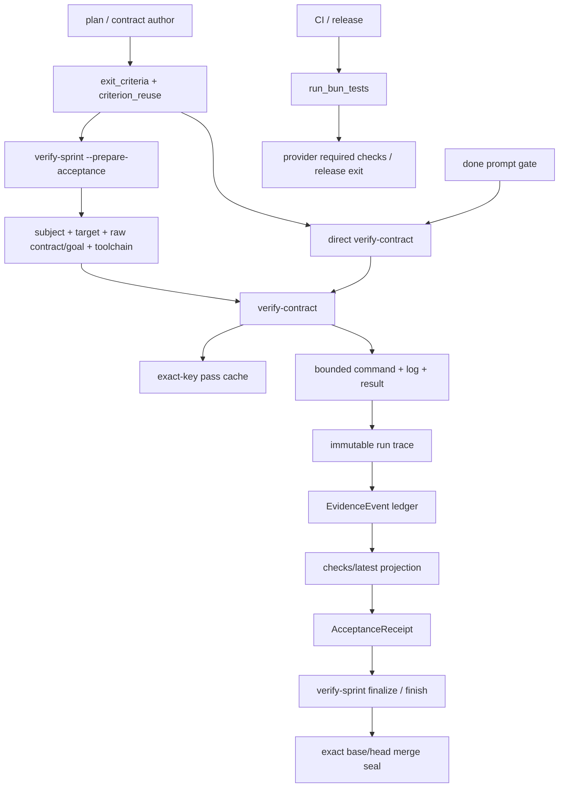

# 全量测试执行与验收数据流审计

本报告记录固定版本诊断、重构设计与验证边界。前半部分属于历史取证；实现和后续纠正见“批准后的实现边界”及其附录。具体提交的验收、部署状态以对应 workflow receipt 和安装读回为准。

## 取证边界

- 固定源码：`ad4afe7765b62a66a58f6378f8d0efcd3c3006cf`。从共享仓库创建独立 detached clone，所有实验在该副本或它生成的临时 Git fixture 中执行。
- 用户指向的 Claude 会话：tmux pane `%6`，标题 `full-test`；会话标识 `8dee0f70-6e81-4d6a-95bb-6b7bae33cf1c`。此前已读取原始会话，重复执行及人工“main 动就停”的记录作为症状线索。
- 当前安装版 `repo-harness 0.18.0`：verify-contract 与固定源码相同；verify-sprint 少了 context drift 的诊断字段，task-sync 的 self-host CLI 选择也较旧。以上差异不改变本文证明的 cache key / direct-call 根因。没有更新全局安装。
- 本轮不运行产品完整测试、不调用真实 reviewer provider、不发布或移动共享 main。模拟的是昂贵命令的执行次数，不是产品测试通过结果。

## P1：系统边界与执行入口

| 阶段 | 权威输入与实际入口 | 输出/消费者 | 是否会执行测试 |
|---|---|---|---|
| 需求与规划 | AGENTS Required Checks、plan、contract authoring | contract 的 exit_criteria | 不执行；full scope 仍由 author 选择 |
| contract 生成 | scripts/plan-to-todo.sh:424，assets/templates/contract.template.md:126 | tests_pass、commands_succeed、单独的 criterion_reuse 列表 | 默认 focused test + typecheck，没有默认 full；reuse 默认空 |
| 普通手工验证 | repo-harness run verify-contract → helper-runner → process-supervisor → verify-contract.sh | criterion report；可更新 Status | 执行全部声明命令；read-only 仅禁止 Status 改写 |
| prepare acceptance | verify-sprint.sh:1094-1129 | context + allowed_paths preflight → verify-contract → run trace | 执行/复用 criteria |
| done 意图 gate | src/cli/hook/prompt-handler.ts:719-761 | 先 direct verify-contract，再查 checks/receipt，最后归档 | **会再次执行 contract 测试** |
| semantic acceptance | scripts/acceptance-receipt.ts | AcceptanceReceipt + review Markdown projection | 不执行测试，消费结构化 evidence |
| finish | contract-worktree.sh:1919-1927 | receipt verify → 普通 verify-sprint finalize → merge seal | 正常路径不执行 contract 测试 |
| ship | ship-worktrees.sh:1228-1248 | finish --no-merge 后 seal/verify | 不额外运行全量，但仍占 coarse expensive lock |
| CI | .github/workflows/ci.yml → check:ci → scripts/check-ci.sh | process exit → Required / CI | 无条件 run_bun_tests；与本地缓存独立 |
| release | scripts/check-npm-release.sh:43 → check-ci.sh | release gate | 默认 full；prepublish fast 模式是显式另一模式 |

合同生成入口有模板和内嵌模板副本；重构 executable schema 时必须同步所有生成器，不能仅修改文案入口。scripts/ 是 helper source of truth，assets/templates/helpers/ 由 scripts/sync-helper-sources.ts 生成；安装 helper 默认从 package 解析，protected closeout helper 禁止 source override。

### 诊断版本数据流



不存在从 provider required checks 到本地 AcceptanceReceipt 的自动证据替代通道。publication merge-readiness 读取 gh required checks，是另一层发布事实。

## P2：从一个全量 criterion 到重复执行

### 输入与变换

1. Author 把全量命令放入 commands_succeed；只有还在 criterion_reuse 中重复声明同一命令，才可能复用。runtime 没有“full suite 必要性”的 typed 决策。
2. CLI 在读 contract/cache 之前按 helper 名称选择整个调用的 expensive lock。verify-contract、verify-sprint、finish、ship 都可能被锁覆盖。锁位于 Git common directory，因此 linked worktrees 相互串行。
3. prepare 生成 `repo-harness-criterion-context.v1`：repository_root、review subject、review target tip、raw contract SHA、raw plan SHA、toolchain fingerprint。
4. verify-contract 以完整 context + criterion kind/target/command 作 cache key。context 缺席时不是拒绝执行，而是禁用 cache。direct call 和 done gate 通常走这一条。
5. 缓存仅保存成功，失败/超时不复用；30 秒 expensive 阈值是运行后分类，不是运行前授权。命中后的强制重跑要求 reason，**换 key 的再次执行不要求这个 reason**。
6. 命令经 run-bounded-verifier-command.ts 执行；tests_pass 走 owning package 的 test script，commands_succeed 走 bash -c。runner 清除 REPO_HARNESS_*，保留真实测试环境，并监督子进程。
7. verify-contract 在成功后保存 criterion pass；verify-sprint 在整轮结束后重新计算 context。target/plan/contract 等期间变化会使整轮不通过，尽管昂贵命令已经执行完成。
8. run trace 保留 execution/cache_key/force_reason，emit-verify-evidence 写入 ledger。contract 未提交时不能绑定权威事件；wrapper 的 cannot-bind 不是成功验收。
9. materializer 按 worktree、contract、subject、trust 等选择事件。checks/latest 是 projection，不能通过手写它恢复旧成功。

源码入口：scripts/verify-contract.sh:753、824、907、1432、1573、1695；scripts/verify-sprint.sh:127、1094、1151；src/cli/runtime/helper-runner.ts:149；src/effects/process-supervisor.ts:427。

### preflight 的入口差异

verify-contract 将五种精确命令字符串识别为 preflight，先执行它们。但“廉价检查失败就阻止后续昂贵命令”还依赖 verify-sprint 注入的 verification_preflight_file。没有该文件的 direct 调用，不具备同样的阻断行为。必须把阶段关系放入明确的 execution plan，不能继续依赖命令字符串和可缺省的私有 env。

### main 变化在各层含义不同

| 身份 | 表达什么 | main 单独前进 |
|---|---|---|
| task-sync substantive digest | resolved merge-base + substantive raw diff | merge-base 未变时可不变；主动合入后可能改变 |
| review_subject_sha256 | 当前变更路径的归一化最终内容 | 无关推进可不变 |
| criterion context target_revision | review_base ref 的 tip | 改变，导致 cache miss |
| raw contract/goal SHA | 整个文档字节 | 文案变也导致 cache miss |
| ChangeAssessment selection packet | 当前 subject + exact target revision | 旧 packet 失效 |
| AcceptanceReceipt | semantic authority + verification evidence | 受旧 packet 失效影响 |
| merge seal | exact base/head/full diff + receipt fingerprint | 必須重新生成与验证；不能沿用旧 base seal |

AcceptanceReceipt 在 :1557 的直接 target 检查只拒绝 overlap，但 :488-511 的 ChangeAssessment 检查要求 exact target revision。这使“无 overlap 可以保留”的表层判断仍被后续精确 packet 拒绝。重构必须显式区分历史审查上下文和当前集成上下文，不能只删一处 target 比较。

### CI 的独立放大

check-ci.sh:31 先执行全部测试，:41 才检查 task-sync。digest 错误要等全量后才暴露。CI isolate 模式对每个 *.test.ts / *.test.tsx 单独启动 Bun，逐文件收集失败；这是当前隔离语义，不能为本次问题顺手改为忽略失败或并行扩大资源。

## 实际运行证据

在同一隔离 fixture 中使用真实 verify-sprint/verify-contract、真实 Git、真实 context/hash/cache 和 run trace；只有昂贵命令替换成计数器，architecture provider 为既有 fixture stub：

| 顺序 | 变化 | 退出码 | 昂贵执行累计 | execution |
|---|---|---:|---:|---|
| 1 | 首次 prepare | 0 | 1 | executed |
| 2 | 原样再 prepare | 0 | 1 | reused |
| 3 | 仅追加 contract 文案 | 0 | 2 | executed |
| 4 | 仅追加 plan 文案 | 0 | 3 | executed |
| 5 | main 增加一个 tree 不变的 commit，feature 不动 | 0 | 4 | executed |
| 6 | direct verify-contract，read-only | 0 | 5 | executed，cache_key 为空 |
| 7 | 相同 direct 再调用 | 0 | 6 | executed，cache_key 为空 |

这证明同一命令的重复不是猜测，也不依赖全量测试真的跑几十分钟。前轮另外用真实 task-sync 证明 main 单独推进仍绑定，而合入 README-only main 会改变 digest。

本轮共 **61 个检查通过、0 失败、548 条断言**：60 个仓库既有测试 + 1 个临时组合 probe。它们分别覆盖：
- criterion reuse、force/failure/timeout、cheap preflight、执行期间 context 漂移；
- package-owned test runner、CI 文件发现/失败聚合；
- Git rebase/base freshness、shared lock、等待者取消、进程组结束；
- done gate 的 command 调用；
- EvidenceEvent producer、materializer 的真实 Git pass/fail 路径；
- AcceptanceReceipt stale/semantic/key-order 边界、finalize 不重跑、merge seal 与 target/lifecycle 变化。

fixture 的 provider 意见、部分 prepared evidence 是测试构造值，不代表真实外部 reviewer 或 hosted CI 的端到端验收；没有运行产品全套、真实发布和跨 OS 矩阵。finalize fixture 的 receipt adapter 是 stub，real receipt 与 materializer 由另外的命名测试验证。不能把分层测试冒充一条已上线的完整流水线。

复跑命令：
```bash
bun test tests/helper-scripts.test.ts --test-name-pattern 'verify-contract reuses a passing expensive criterion|verify-contract never reuses a failure or timeout|verify-sprint blocks expensive criteria|verify-sprint composes executed and reused|verify-sprint rejects a criterion' --timeout 60000
bun test tests/verify-sprint-rebase-base-guard.test.ts tests/acceptance-receipt-evidence-fingerprint.test.ts tests/unit/package-owned-test-runner.test.ts tests/check-ci-isolate-aggregation.test.ts --timeout 60000
bun test tests/unit/closeout-runner-guardrails.test.ts --test-name-pattern 'helper identity|only canonical expensive|outer timeout|leader exit|caller killed while waiting|linked worktrees serialize|ship delegates' --timeout 60000
bun test tests/acceptance-receipt.test.ts tests/merge-gate.test.ts tests/evidence-verify-producer.test.ts --test-name-pattern 'review projection changes|any target revision|consumes the one AcceptanceReceipt|review-only head movement|non-overlapping target movement|post-freeze lifecycle|emits exactly one authoritative|dirty \(uncommitted\)|re-emission with identical' --timeout 60000
bun test tests/helper-scripts.test.ts --test-name-pattern 'verify-sprint finalizes one AcceptanceReceipt without rerunning contract tests|contract-worktree finish runs architecture freshness' --timeout 60000
bun test tests/evidence-checks-materializer.test.ts --test-name-pattern 'end-to-end \(gatekeeper CRITICAL regression|exact subject match only|different contract in the same worktree|an event carrying no run_trace' --timeout 60000
bun test tests/prompt-handler.test.ts --test-name-pattern 'done with fresh contract|done blocks for empty|done blocks when contract verification' --timeout 60000
```

组合 probe 已从测试发现目录移出，保留于本轮临时 clone 父目录的 full-test-flow-probe.test.ts，flow-matrix.json 在同一目录。复跑时复制 probe 回 tests/full-test-flow-probe.test.ts，再运行 --test-name-pattern 'FLOW AUDIT'。它复用 helper-scripts.test.ts 的 fixture，不属于已提交回归。实施时应将这一计数场景提炼进正式测试，不能只保留临时实验。

## P3：推荐的重构边界

### 一个执行权威，三个不同生命周期

1. **VerificationPlan**：由 contract author 决定本次哪些检查需要执行、哪些历史 baseline 可以引用、成本级别与理由。使用单一 typed executable descriptor，替代 executable lists + criterion_reuse 的重复声明。非执行的文件/人工验收要求可以保留原位置。
2. **VerificationExecution**：记录一次真实执行的完整对象、命令、实际工具链、退出结果、日志摘要和时长。写入既有 evidence ledger / run store，不新增第二个权威数据库。
3. **Acceptance / merge evaluation**：把当前 plan 与 immutable execution 引用组合成当前验收；最后针对当前 exact base/head 做集成检查与 seal。重新评价不允许暗中启动测试。

现有 review subject 只覆盖变更路径，**不得充当 full-suite 的完整输入 fingerprint**。exact execution reuse 首期保守绑定完整冻结 checkout tree/受控未提交内容、命令/cwd、实际 runner/toolchain 和声明的环境依赖；缺少输入证明时不宣称可复用。完整 tree 因文档变化而改变时，旧 full pass 仍只能作为历史 baseline，由新的明确 delta plan 说明当前需要什么检查，不能伪称旧 full pass 已验证新 tree。

### 目标行为

- done/状态/receipt verify/finalize/finish/ship 都只读取和验证 evidence；缺失、失效、等待必须返回独立 typed 状态及明确下一步，不自行重跑。
- 显式执行统一经过 canonical executor。direct verify-contract 不再拥有不带 context 的独立执行路径；命令入口可保留，但执行部分必须走同一 plan/context/ledger。
- expensive 重跑必须有当前 plan 的必要性原因，或显式 force reason。cache miss 自身不构成必要性。
- preflight 阶段先完成，再进入命令执行。它是 typed phase，不按 shell 字符串猜测。
- 精确结果查询在 expensive resource lock 之前；锁只覆盖需要运行的 expensive criterion，并延续现有进程组清理保证。
- source 验证对象与 review base 在开始时固定为不可变引用。main 移动不破坏已完成的测试事实，也不要求团队暂停 main。
- 合并前对最新 base 重算候选和 delta。旧 receipt 保留为“当时上下文的审查事实”；当前 ChangeAssessment/集成决策与 exact merge seal 仍必须满足新目标。不能凭路径无 overlap 推断语义独立。
- 本地默认 focused + integrity，CI/release 保留各自显式全量要求。首期不建 CI→local receipt 桥；contract 不能声明依赖尚不存在的桥。未来若要用 CI 满足一个本地 criterion，必须是独立的显式 attestation 协议。
- CI 的廉价 gate 提到 run_bun_tests 前；保持现有失败聚合和 required status。不因 artifact-only、日期、main SHA 变化而启发式跳过 full。
- stamp 和必要归档并入原 work-package 收口，不为同一事实反复开审查/PR；历史非活跃工件仍可审计。

### 实施顺序与停止边界

1. 先消除隐式 execution：done gate 查询 evidence；direct verifier 与 prepare 共用执行计划。用计数红绿测试证明消费者不能 spawn。
2. 收敛 executable descriptor、snapshot、execution/evaluation 关系；复用现有 ledger/materializer。旧 cache 仅保留历史，不双读；旧 executable contract 只允许一次性 operator migration，active 未迁移时 fail closed，archive 不作为可执行合同。
3. 将长资源锁下沉到 actual execution。相同任务通过已有 cache/claim 原语去重，保留 cheap publication 的短一致性锁，禁止持锁等待 provider/CI。
4. 调整 ChangeAssessment/Receipt/merge seal 的 target 生命周期，保留 exact candidate gate；main 前进只触发明确的 integration re-evaluation。
5. 同步 templates、helper projections、host done 指令和 CI preflight 顺序，执行包装/安装路径读回。不得只发布源码侧修复。

这是一项跨 contract/runner/evidence/acceptance 的工作包，不能通过改两行缓存字段完成。建议增量提交在同一隔离工作包内集成，最终 schema cutover 同时移除旧 executable authoring/reader；避免发布中间的双权威状态。

### 取舍与 10 倍规模

- 不做全量 Bash→TS 翻写，不新建调度服务、跨仓库缓存或 CI importer。只把共享 executable plan/decision 与运行效果移入 core/effects，薄入口复用它。
- 执行调度和 evidence reader 是两个真实消费者，足以支持共享 typed core；现有 ledger 和 supervisor 继续承担持久化与进程所有权。
- 10 倍 agent 数时，首先耗尽的是实际 full-suite 的 CPU/内存与单机 expensive 槽，而不是 reviewer 数量。等待必须可观察并且不持有 merge 锁；没有理由把资源保护改成无限并发。
- 10 倍测试文件时，CI isolate 的启动成本仍存在；本工作包不改隔离策略。只有测量显示它成为剩余主要成本，才另做 test sharding。
- 所有缓存/receipt 的安全失败都保留；改变的是失败后的动作和各份证据的适用范围，不是把 stale 改成 pass。


## 设计阶段的文档交付验证（实施前）

只新增本报告及 Draft plan，没有修改产品代码、active contract 或共享运行态。隔离 checkout 中六项根 integrity checks 均给出通过/无 drift/无 planned operation；这是文档交付的一致性验证，不是新重构的实现验收。新增 core/effect 文件仅列在方案中，尚未创建。

收口时共享 main 已推进到 `492add48`。对比固定基线，本文核心 verifier、cache、done gate、evidence、receipt、merge-gate、CI 和 contract authoring 文件未变；并行的 claude-review-host/session 修改不属于本轮真实 provider 验证。没有因为 main 推进重跑昂贵测试。


## 批准后的实现边界

用户批准后，在 `codex/verification-execution-lifecycle` 隔离工作包实施，基线为 `492add48`。

- executable authority 为 `## Verification Plan` JSON。`verification-plan.ts` CLI 的 validate/evaluate/execute 分别负责校验、只读评价和显式执行；core schema 与 effects ledger/supervisor 是唯一实现。
- direct `verify-contract` 与 prepare 共用 executor；shell 不再解析旧 executable YAML，不再维护旧 criterion cache。旧契约通过 operator 明确 mapping 的一次性 migration 切换；未迁移时拒绝执行。
- 自动 `done` 与 Stop journal 均改为 evidence consumer。Stop 的额外调用点是在实现接线审计中确认的，不应仅修 done。
- execution identity 使用完整 Git virtual tree、descriptor、cwd、toolchain 与声明环境。HEAD 和 main ref 的位置是 provenance，不单独使相同 tree 的执行失效。文案导致 tree 改变时，旧 expensive pass 保持历史事实；当前 plan 明确 baseline/delta 或显式 force reason 后才能推进。
- historical receipt 对 frozen target 重算 Change Assessment，验证 immutable execution refs；current merge seal 仍要求 receipt target 与 candidate base 完全一致。prepare→producer 的 target 也显式传递，避免 payload 与 event identity 混用不同 base。
- package test 仍由最近的 package test script 执行；命令仍禁用 login/profile/BASH_ENV，保留 timeout/process-group cleanup 和失败 stdout/stderr 日志。资源锁只包住实际 expensive command。
- CLI 与 report 的 shared fixture 覆盖 source/package 两个消费者；新 test helper 仅生成显式空计划与真实 evaluation，没有产品兼容分支。

未新增依赖、缓存服务或独立持久化 authority。两个新 core/effect 文件服务执行与读取两类真实消费者；两个新 CLI 分别是运行入口和必须显式调用的迁移入口。完整 tree 的保守失效会产生可解释的 needs_verification_plan，绝不会以缺证据为理由自动重跑 full。

### Global cutover prerequisite

The final worktree inventory found five other active contracts still using legacy executable YAML: brc8-bounded-worker-acquisition, context-files-ci-step, context-map-drift-check, route-eval-ci-gate, and untrack-current-status. Each owner must explicitly migrate its executable descriptors before the strict runtime is installed globally. The fix-cross-review-red marker referenced an absent contract, so its status could not be validated. This work-package does not rewrite those WIP surfaces. Disposable package/default CLI verification is complete; it does not imply a global runtime cutover.

### Latest execution supersedes older same-input success

Independent review found a pass-selection defect in the first implementation: filtering failures before choosing the newest event could revive an older pass after a forced failure or timeout. The corrected selection first chooses the newest accepted event for the same check and cache key, then validates its outcome and immutable run. Missing/corrupt latest records also fail closed. Explicit baseline coverage retains historical facts but cannot hide newer failure for those same inputs. Regressions cover ordinary execution, expensive no-auto-rerun, timeout and missing latest records.

### Receipt projection boundary

Immutable execution runs preserve raw facts; the ledger writer applies canonical redaction before materialization. `validateMaterializedVerificationExecutionReport` validates that projected representation against a single writer projection of the immutable result. This explicit boundary prevents embedded commit SHAs in commands from invalidating otherwise authentic evidence. Raw entropy-bearing reports are not receipt inputs. No second parser, raw fallback, or history rewrite is admitted.

### Display IDs cannot own execution identity

Installed verification of publication `879c9bfd` admitted `verification-execution-lifecycle-full-suite-check`, executed the same expensive command twice (counter 1 → 2), and then evaluated as missing. Both events had the same cache key; the writer had redacted their `check_id` display string. Raw/display ID lookup therefore bypassed both reuse and the expensive prior-execution guard.

Execution decisions must use the existing executable/cache fingerprints. Exact reuse selects the newest same-key event before validating the immutable run and its original declared ID; failed or invalid later facts cannot expose an older success. Prior expensive execution uses the executable fingerprint independently of display naming, so renaming does not authorize another launch. Baseline counterevidence follows the same-key execution stream.

Receipt matching already binds the complete check fingerprint. Its materialized input IDs are compared with one canonical writer projection of declared IDs before being mapped to internal raw contract keys. There is no second ID authority, arbitrary length cap, raw/projected fallback, or change to the secret redactor.

### Canonical authoring and CI consumer closure

The first cutover publication `879c9bfd` failed Required CI run `34025058232`. The failures demonstrate that executable authority removal must cover both runtime readers and every producer: disposable fleet/campaign contracts, continuation template installation, skill-evaluation grader contracts, and canonical contract templates. A missing plan remains an error; artifact-only contracts must explicitly declare an empty plan.

The canonical template originally placed prose between the Verification Plan heading and its JSON fence, outside the parser's admitted syntax. Moving the guidance after the JSON restores valid generated contracts without relaxing parsing. A regression parses the actual source template and verifies the installed template is byte-identical. New helper IDs must also appear in the CLI help groups; otherwise the strict inventory equality prevents even `run --help` from rendering.

### Portable fixture runtime authority

CI `34027338609` on `322d7cde` passed every previously failing cutover consumer except two Human Review Card fixtures. Linux Docker with Bun 1.4.0 and Node 24 reproduced both failures: contract verification passed, but review-subject lookup had no hook CLI, so the frozen target revision was empty and Change Assessment failed. Local narrow tests had silently used the globally installed `repo-harness-hook` from PATH. This was independent of the canonical template prose defect.

The two fixtures now explicitly select their copied `src/cli/hook-entry.ts` through `REPO_HARNESS_HOOK_CLI` and assert the resulting target revision equals their own Git main. The same Linux container passed both cases after that change. Fixture validation must name its runtime authority; a populated developer PATH is not evidence that a clean CI environment can resolve the same entrypoint.

### Architecture snapshot drift observations

The proposed exclusion mismatch was disproved against the installed `archctx@0.5.7` projection entrypoint: both sides include root `dist/` and `.archcontext/generated/`. Writing either after capture invalidates the old request; recapturing satisfies the provider's snapshot check. Excluding them only in repo-harness would introduce a protocol mismatch. The historical failure does not establish which process wrote the files.

The diagnostic gap is at `runArchitectureProjection`: the request and post-call checks previously retained only the aggregate digest. The same snapshot traversal now retains path, size and SHA-256 observations in memory. A weak reference associates locally captured requests with their original observation without adding fields to the wire contract or persistent evidence authority. Provider-entry and provider-return observations delimit changes; they cannot identify the writer or the exact mutation time.

`snapshot-drift` diagnostics go to the existing diagnostic callback or stderr, leaving result JSON unchanged. They identify the observation phase, snapshot identity differences and added/modified/deleted inputs, with at most 20 path entries and an exact total. File contents are never included. Deserialized requests have no local capture inventory: pre-call diagnostics explicitly report that inventory as unavailable instead of attributing later-observed changes to an unknown earlier state.

Snapshot rejection and apply-receipt reconciliation remain authoritative. Diagnostics do not retry, recapture an accepted request, or authorize another apply or test execution. Keep generation/build completion ahead of acceptance freeze; when a future failure occurs, use the observed path delta to identify the writer before changing scheduling or ownership. The provider, orchestration, acceptance and refactor adapter regressions cover this boundary without a local full suite.
