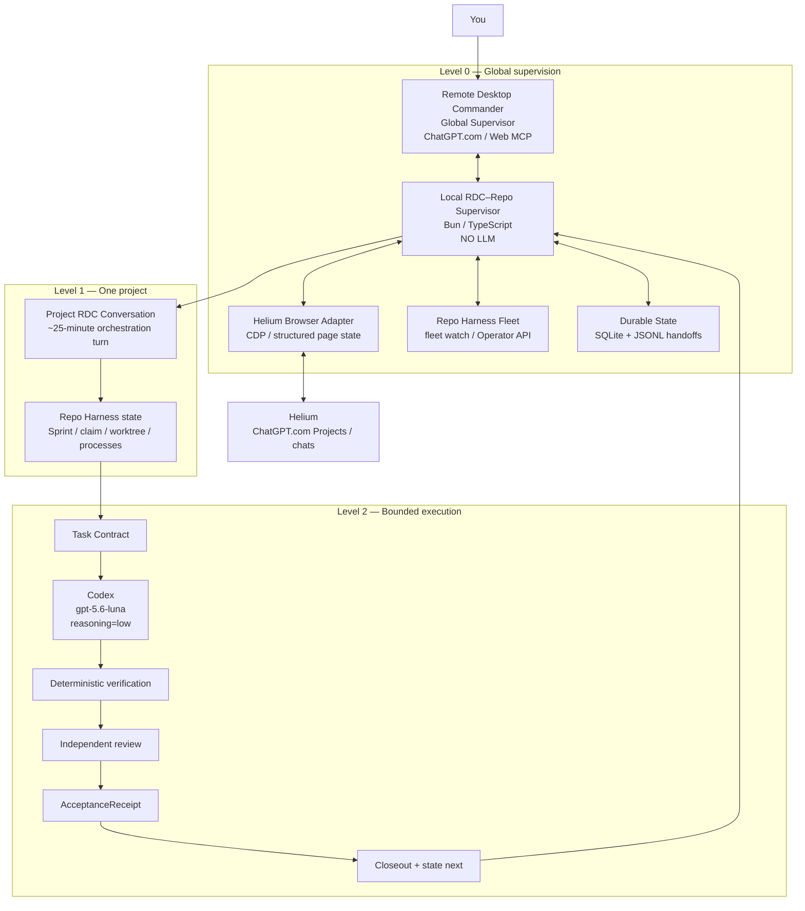
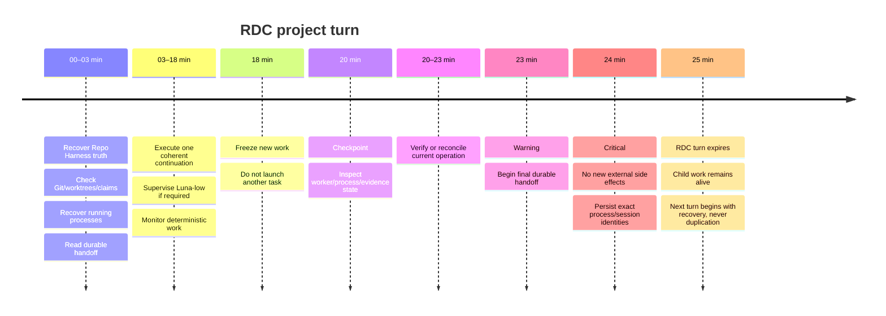

# Autonomous Remote Desktop Commander Supervisor for Repo Harness and ChatGPT.com

## Executive summary

The system you are describing is technically coherent, and most of its difficult primitives already exist. The strongest design is **Option F — a hierarchical hybrid**:

> **Remote Desktop Commander remains the top-level reasoning/orchestration authority, while a small persistent non-LLM supervisor provides continuous liveness, timers, reconciliation and browser/session monitoring between RDC’s roughly 25-minute ChatGPT turns. Repo Harness remains the development-workflow authority.**

This distinction is essential. A ChatGPT/RDC turn is ephemeral; Git state, Repo Harness state, child processes, browser-session records and a local supervisor can survive it. Repo Harness itself is deliberately file-backed and supports authorised programs that outlive individual agent sessions; its public documentation explicitly says durable workflow truth belongs in repository artefacts rather than chat memory. citeturn15search0

The target architecture is therefore:

```text
                   YOU
                    │
                    ▼
        ┌────────────────────────┐
        │ Level 0               │
        │ Global RDC Supervisor │
        │ ChatGPT.com / Web MCP │
        └───────────┬────────────┘
                    │
             receives summaries /
             makes decisions
                    │
                    ▼
      ┌─────────────────────────────┐
      │ Persistent Local Supervisor │
      │ no LLM / no idle tokens     │
      │                             │
      │ • Fleet watcher             │
      │ • browser/session observer  │
      │ • timers                    │
      │ • PID recovery              │
      │ • dispatch ledger           │
      │ • durable handoffs          │
      └─────────────┬───────────────┘
                    │
       ┌────────────┼─────────────┐
       ▼            ▼             ▼
   Helium /     Repo Harness     RDC device
 ChatGPT.com     Fleet/State      agent
       │            │
       └────────────┼─────────────┘
                    ▼
        ┌────────────────────────┐
        │ Level 1               │
        │ Project RDC Chat      │
        │ ~25-minute turn       │
        └───────────┬────────────┘
                    │
                    ▼
        ┌────────────────────────┐
        │ Level 2               │
        │ Repo Harness Contract │
        └───────────┬────────────┘
                    ▼
           Codex / Luna-low
                    │
                    ▼
 verification → review → acceptance
                    │
                    ▼
        closeout → state next
```

The principal conclusions are:

| Question | Recommendation |
|---|---|
| Who should orchestrate everything? | **Remote Desktop Commander** |
| What keeps the system alive when an RDC chat reaches its time boundary? | A **small local deterministic supervisor**, not another model |
| What is workflow truth? | **Repo Harness + Git + processes + receipts** |
| What is ChatGPT.com? | Human-facing orchestration UI and RDC execution surface, **not workflow truth** |
| How should existing managed ChatGPT sessions be resumed? | `repo-harness chatgpt browser-list/session/open/followup` |
| How should a new managed ChatGPT session start? | `repo-harness chatgpt browser-consult` |
| How should all visible ChatGPT tabs be observed? | A **read-only CDP browser adapter** for Helium, after a compatibility canary |
| How should cross-project state be monitored? | `repo-harness fleet watch --format jsonl`, with the Operator Board as the human view |
| Should the supervisor poll the rendered `127.0.0.1:4318` page? | No; consume structured Fleet data instead |
| What model should execute application code? | **`gpt-5.6-luna`, low reasoning**, unless your upgraded local model ID is different |
| Should an LLM run continuously? | **No. Zero LLM calls while idle** |
| Should browser DOM state decide that work is complete? | **No** |
| Best MVP language | **Bun/TypeScript**, to align with Repo Harness |
| Best persistence for MVP | SQLite plus append-only JSONL event/attempt log |
| Biggest technical unknown | Reliable attach/observation of your existing Helium session and provable invocation of RDC inside a ChatGPT Project |
| Biggest deployment gate | Prove the **installed/pinned Repo Harness runtime**, not merely a source worktree, contains the required behaviour |

OpenAI's current model guidance specifically describes `gpt-5.6-luna` as the lowest-cost/lowest-latency option among the cited current reasoning models, which aligns unusually well with your requirement to minimise local execution cost. Lower reasoning effort also reduces token use. citeturn22search0turn22search14

There is one naming caveat: **`gpt-5.6-luna` is the presently documented model ID I can verify.** You previously said you had upgraded to “the next version”; if that means a different Luna model ID, that exact ID is currently **unspecified** and should become a single supervisor configuration value rather than being guessed. The system should fail closed rather than silently falling back to a more expensive model.

The most important implementation insight is that **you do not need another autonomous-agent framework to replace Repo Harness**. Repo Harness already supplies plans, contracts, leases, worktrees, evidence, acceptance and authorised-program semantics; Remote Desktop Commander already supplies remote filesystem/terminal/process control; the missing piece is mainly a deterministic **supervision and browser-observation layer**. Repo Harness explicitly describes its unattended work as bounded by authorisation, budgets, task offers, leases and receipts. citeturn15search0

Your previous WorkAdventure history is valuable empirical evidence for the design: the complete Repo Harness → Luna-low → verification → independent review → acceptance → closeout flow has already been exercised across RDC-style working windows, and subsequent turns were able to continue from durable repository/worktree state instead of reconstructing everything from chat. fileciteturn0file0

## Current stack, authorities and repository findings

### What each layer actually is

**Remote Desktop Commander** is the remote control plane between ChatGPT and your Mac. Its hosted MCP endpoint is `https://mcp.desktopcommander.app/mcp`; the Mac-side device agent runs locally, and ChatGPT reaches filesystem and terminal/process tools through that connection. The official project documents OAuth 2.0/PKCE, an OAuth device pairing flow and HTTPS/TLS transport. The public `remote-desktop-commander` repository contains manifests/documentation rather than the hosted service implementation; the local Desktop Commander MCP implementation is open source. citeturn20view0

Official repositories:

- [Remote Desktop Commander](https://github.com/desktop-commander/remote-desktop-commander)
- [DesktopCommanderMCP](https://github.com/wonderwhy-er/DesktopCommanderMCP)

The device process is started with:

```bash
npx @wonderwhy-er/desktop-commander@latest remote
```

and the official RDC project lists persistent terminal/process operations including starting processes, reading process output, listing active sessions/processes and terminating them. citeturn20view0turn20view1

**Repo Harness** is the authoritative project workflow system. Its public design is explicitly file-backed and token-conscious: plans, contracts, handoffs, checks and review evidence persist between sessions, while CodeGraph is used to avoid repeated repository-wide grep/read discovery. Repo Harness also has a second layer of authorised programs for long-running work under authorisation, budgets and leases. citeturn15search0

Official repository:

- [Repo Harness](https://github.com/Ancienttwo/repo-harness)

**Helium** is your human-facing browser. It is a Chromium-derived browser, which makes Chrome DevTools Protocol approaches technically plausible, but **a real CDP-attach test against your installed Helium build remains mandatory** before we treat it as supported. citeturn20view3

Official repository:

- [Helium](https://github.com/imputnet/helium)

**Oracle** is already the main browser provider underneath the local Repo Harness ChatGPT Browser Engine. The local Repo Harness browser documentation makes Oracle the recommended path and leaves its older native Chrome CDP provider deprecated. Oracle itself is designed around browser-based ChatGPT consultation. citeturn20view2

Official repository:

- [Oracle](https://github.com/steipete/oracle)

### Local paths confirmed during the investigation

The relevant checkouts on your Mac are:

```text
Repo Harness:
/Users/test/Documents/work/repo-harness

Your Desktop Commander fork:
/Users/test/Documents/RemoteMCP-Jazz/repositories/DesktopCommanderMCP

Public RDC manifests/docs checkout:
/Users/test/Documents/RemoteMCP-Jazz/repositories/remote-desktop-commander

Previously observed Helium data root:
~/Library/Application Support/net.imput.helium
```

The earlier inspection observed a Helium `Profile 4` as `last_used`; that should be treated as historical evidence, **not as a configuration guarantee today**. The implementation must discover and explicitly select the intended automation profile.

The primary Repo Harness sources inspected directly for this report are:

```text
/Users/test/Documents/work/repo-harness/
├── src/cli/chatgpt-browser/
├── src/cli/commands/chatgpt.ts
├── src/effects/operator/server.ts
├── src/core/automation/campaign-browser-session.ts
├── src/cli/commands/fleet.ts
└── docs/repo-harness-chatgpt-browser-engine.md
```

Your evolving design documents also live under:

```text
docs/remote-desktop-commander-orchestrator-mvp-spec.md
docs/repo-harness-helium-chat-workflow.md
docs/project-chat-coordinator-workflow.md
docs/new-repository-start-here.md
```

### What the Repo Harness source already gives us

Direct inspection of `src/cli/commands/chatgpt.ts` confirms the browser command surface:

```text
repo-harness chatgpt browser-setup
repo-harness chatgpt browser-doctor
repo-harness chatgpt browser-consult
repo-harness chatgpt browser-list
repo-harness chatgpt browser-session
repo-harness chatgpt browser-open
repo-harness chatgpt browser-followup
repo-harness chatgpt browser-cleanup
```

This distinction matters:

```text
browser-consult
    = create a new managed browser conversation

browser-list / browser-session
    = recover known session identity and metadata

browser-open --launch
    = open the recorded conversation URL in the system browser

browser-followup
    = continue a managed conversation without creating a competing root
```

Therefore the command you previously highlighted:

```bash
repo-harness chatgpt browser-open \
  --repo <repo> \
  <session-id> \
  --launch
```

is a **resume/navigation operation**, not the first operation for a project that has never had a managed session.

For a new autonomous session, the more important primitive is:

```bash
repo-harness chatgpt browser-consult \
  --repo <repo> \
  --provider oracle \
  --chatgpt-url "<CHATGPT_PROJECT_OR_START_URL>" \
  --chatgpt-app "<REMOTE_DESKTOP_COMMANDER_APP_NAME>" \
  --heartbeat 59 \
  --prompt "<PROJECT RDC STARTUP PROMPT>"
```

Two details still need live proof:

1. The exact visible ChatGPT connector/app name for Remote Desktop Commander is account-specific and therefore **unspecified** here.
2. Starting from a ChatGPT Project URL must be tested to prove that the new conversation is actually created in that intended Project rather than merely using that URL as a navigation starting point.

The local browser-engine documentation also gives us a strong security boundary. It stores managed sessions under:

```text
.ai/harness/chatgpt/sessions/<sessionId>/
    meta.json
    prompt.md
    transcript.md
    output.md
    events.jsonl
    artifacts/
```

and records browser binding metadata separately rather than treating browser cookies or credentials as workflow artefacts. It explicitly warns against automatic provider retries after a possibly submitted request: if capture fails after submission, blindly repeating the consult could create a duplicate ChatGPT turn.

That behaviour should become a central supervisor invariant:

> **uncertain effect → reconcile → never blind retry**

### The Operator Board is already the right global projection

`src/effects/operator/server.ts` currently fixes the normal server to loopback:

```text
127.0.0.1:4318
```

and defines:

```text
GET  /healthz
GET  /api/v1/fleet/snapshot
GET  /api/v1/collaboration/.../snapshot
POST /api/v1/fleet/tasks/.../messages
```

The source makes an architectural point of the fact that the board has only one browser-write route, the task message. This matches the public documentation: the Human Control Board is deliberately an observe-first Fleet projection and does **not** acquire tasks or launch agents. citeturn15search0

That is why **Option D**, turning the Operator Board itself into your autonomous scheduler, is not my recommendation.

More importantly, direct inspection of `src/cli/commands/fleet.ts` found an even better machine interface:

```bash
repo-harness fleet watch \
  --format jsonl \
  --interval-ms 30000
```

Its implementation emits immediate, sequential, non-overlapping Fleet snapshots. It accepts:

```text
--interval-ms       1000–300000, default 30000
--max-concurrency   1–16, default 4
--timeout-ms        1000–30000 per repository
```

That means the MVP supervisor does **not** need to screen-scrape the Operator Board or even repeatedly call the HTTP endpoint. It can keep one lightweight child process alive and consume JSONL.

The board remains useful for you:

```text
http://127.0.0.1:4318
```

while the machine consumes:

```text
repo-harness fleet watch --format jsonl
```

or, when useful:

```text
GET http://127.0.0.1:4318/api/v1/fleet/snapshot
```

### Repo Harness already contains a useful browser-completion proof

A particularly important local finding is:

```text
src/core/automation/campaign-browser-session.ts
```

For its current campaign/GitHub use case, Repo Harness does **not** decide completion from a visible “Stop generating” button. It reads invocation-owned captured conversation history and demands conditions including:

```text
final assistant message
status == finished_successfully
end_turn == true
working_turn_id == turn_exchange_id
```

It then inspects actual tool-message metadata and verifies a connector invocation.

That is exactly the pattern we need for RDC.

The limitation is that this current implementation is purpose-built for campaign GitHub evidence and hardcodes:

```text
app: "GitHub"
```

The architectural refactor should generalise the mechanism rather than invent another parser:

```text
CampaignBrowserSessionEvidence
             ↓
generic BrowserToolInvocationEvidence
             ↓
expected_app = "Remote Desktop Commander"
```

Conceptually:

```ts
interface BrowserToolInvocationEvidence {
  conversationId: string;
  repoRoot: string;
  providerSessionId: string;
  expectedApp: string;
  actualApp: string;
  turnExchangeId: string;
  toolInvocations: ToolInvocation[];
  finalStatus: "finished_successfully";
  endTurn: true;
  capturedAt: string;
  evidenceSha256: string;
}
```

This would let the supervisor distinguish:

```text
assistant text says "I checked your Mac"
```

from:

```text
the captured ChatGPT turn proves that
Remote Desktop Commander was actually invoked
and the turn terminated normally
```

That is a major reliability improvement.

### CodeGraph research boundary

Repo Harness's public design specifically describes CodeGraph as a token-saving structural query mechanism rather than repeatedly rereading the codebase. citeturn15search0

A fresh CodeGraph invocation was **not exposed as an executable connector in the tool surface available for this research turn**. I therefore did not pretend to execute one. I used the CodeGraph-derived structure recorded in your supplied reports and then directly re-read/search-verified the high-value source files above through RDC.

The supervisor and future implementation agent should still use the repository-local index as intended:

```bash
cd /Users/test/Documents/work/repo-harness

if [ -d .codegraph ]; then
  codegraph sync .
else
  codegraph init .
fi

codegraph status .
```

Useful implementation queries would include:

```bash
codegraph explore \
  "ChatGPT browser session completion evidence and provider session ancestry"

codegraph explore \
  "Fleet watch snapshots operator server and state next continuation"

codegraph explore \
  "contract-run worker invocation model configuration and closeout"
```

The report's architecture does not depend on unverified CodeGraph output; the key source surfaces were checked directly.

## Architecture choices and recommended hierarchical hybrid

The six sensible designs differ mainly in where durable orchestration lives.

| Option | Design | Build cost | Idle model cost | Survives RDC turn expiry | Browser coverage | Coupling | Assessment |
|---|---|---:|---:|---:|---:|---:|---|
| **A** | Prompt-driven RDC only | Very low | Low | Partial | Managed sessions | Low | Good proof-of-concept, not autonomous |
| **B** | RDC + persistent local non-LLM supervisor | Low–medium | **Zero** | **Yes** | Needs adapter | Low | Excellent MVP substrate |
| **C** | Add Repo Harness primitives directly to DesktopCommanderMCP fork | High | Zero | Yes | Depends on implementation | **High** | Attractive later |
| **D** | Make Repo Harness Operator Board the dispatcher | High | Zero | Yes | Separate | Medium | Violates an intentional current boundary |
| **E** | Browser-centric Helium self-watcher | Medium | Zero–high depending on implementation | Partial | **Excellent** | Medium | Useful observer; wrong workflow authority |
| **F** | **Global RDC + deterministic supervisor + browser adapter + project RDC + Repo Harness + Luna-low** | Medium | **Zero while idle** | **Yes** | **Excellent** | Controlled | **Recommended** |

**Option A — prompt-driven RDC.** You manually start each global/project RDC chat, and the RDC agent reads Fleet and Repo Harness state. This is enough to validate prompts and handoffs but cannot guarantee unattended continuity after a chat ends.

**Option B — persistent supervisor.** Add a tiny local Bun service with no LLM. It owns timers, a project/session registry, process recovery and a dispatch ledger. It wakes an RDC conversation only on state transitions. This is the smallest genuinely autonomous foundation.

**Option C — native Desktop Commander integration.** After the protocol proves itself, your DesktopCommanderMCP fork could expose high-level typed tools such as:

```text
repo_harness_fleet_status
repo_harness_project_status
repo_harness_resume
repo_harness_handoff
repo_harness_project_tick
```

The upstream Desktop Commander already supports persistent processes and terminal control, so this is technically natural. citeturn20view1 The drawback is permanent coupling between two independently evolving projects.

**Option D — Operator Board scheduler.** Avoid this initially. Repo Harness intentionally documents the local Human Control Board as an observational control surface rather than an agent launcher. citeturn15search0 Changing it into an autonomous dispatcher would mix workflow projection with execution authority.

**Option E — browser-centric supervisor.** CDP watches all ChatGPT tabs and infers which conversations are running. This is valuable for **observation and navigation**, but browser DOM state must not become the task authority. A browser tab can be idle while a Luna worker is still running, or active while the repository task is already invalid.

**Option F — hierarchical hybrid.** This combines B and E while keeping the authority hierarchy intact. It is the closest match to your mental model.



The resulting authority hierarchy should be explicit:

```text
Highest authority
    Repo Harness canonical workflow state
    Git/worktree state
    claims/leases/receipts
    actual process state

Derived coordination state
    local supervisor SQLite
    durable handoff
    Fleet projection

Observation/navigation state
    Repo Harness browser-session metadata
    ChatGPT conversation metadata
    Helium/CDP DOM/accessibility state

Lowest authority
    old chat prose
    assumptions about what a browser tab "looks like"
```

This resolves the apparent contradiction in “RDC must orchestrate everything”. **RDC owns the decisions; the deterministic supervisor owns persistence and wake-up.** It is analogous to a scheduler waking an operator, not an independent AI making product decisions.

The local supervisor should never invent work. Its allowed decision vocabulary should be closer to:

```text
OBSERVE
RECONCILE
NO_OP
WAKE_GLOBAL_RDC
RESUME_PROJECT_RDC
CHECK_RUNNING_PROCESS
REQUEST_HUMAN
```

rather than:

```text
"Maybe we should refactor authentication next."
```

## Startup protocol, project turns and command interfaces

### Cold startup

The standalone entry point should eventually be one command:

```bash
rdc-rh-supervisor start
```

Internally, startup should follow a deterministic sequence.

**Bring up the RDC transport.**

```bash
npx @wonderwhy-er/desktop-commander@latest remote
```

The official RDC flow pairs the device through OAuth device authorisation and makes the machine reachable only while the local device agent is running. Tool execution occurs with the local user's permissions, which is why the account must be treated as a privileged credential. citeturn20view0

**Bring up the human Repo Harness view.**

```bash
repo-harness operator serve \
  --host 127.0.0.1 \
  --port 4318
```

Health:

```bash
curl --fail --silent \
  http://127.0.0.1:4318/healthz
```

Human dashboard:

```text
http://127.0.0.1:4318
```

Machine projection when an ad-hoc snapshot is needed:

```bash
curl --fail --silent \
  http://127.0.0.1:4318/api/v1/fleet/snapshot
```

The server is intentionally loopback-oriented and the public Repo Harness documentation describes the board as a local observe-only view except for its bounded task-message action. citeturn15search0

**Start the persistent Fleet stream.**

```bash
repo-harness fleet watch \
  --format jsonl \
  --interval-ms 30000 \
  --max-concurrency 4 \
  --timeout-ms 30000
```

This becomes the primary cross-project wake-up source.

The supervisor stores a normalised digest of each relevant repository projection. A fresh JSONL line does **not** automatically mean “invoke an agent”. It means:

```text
snapshot changed
       ↓
which repository changed?
       ↓
is the change actionable?
       ↓
reconcile that repo
       ↓
only then decide whether RDC needs waking
```

**Load the project registry.**

A minimal configuration could be:

```toml
# ~/.config/rdc-rh-supervisor/projects.toml

[[projects]]
id = "workadventure"
repo = "/Users/test/Documents/work/workadventure"
chatgpt_project_url = "https://chatgpt.com/g/g-p-..."
browser_session = "auto"
enabled = true

[[projects]]
id = "devin-webmcp-local-chat"
repo = "/Users/test/Documents/work/devin-webmcp-local-chat"
chatgpt_project_url = "https://chatgpt.com/g/g-p-..."
browser_session = "auto"
enabled = true
```

No cookie, bearer token, OAuth token or password belongs in this file.

**Check browser-engine readiness.**

For each project that needs managed ChatGPT automation:

```bash
repo-harness chatgpt browser-doctor \
  --repo "$REPO" \
  --provider oracle \
  --json
```

The local Browser Engine already has an explicit doctor, pinned-provider policy, provider session records and recovery states. Use those instead of writing a second Oracle wrapper.

### Recovering an existing ChatGPT/RDC session

First:

```bash
repo-harness chatgpt browser-list \
  --repo "$REPO" \
  --json
```

Inspect the selected one:

```bash
repo-harness chatgpt browser-session \
  --repo "$REPO" \
  "$SESSION_ID" \
  --metadata-only
```

Then open it in the configured system browser:

```bash
repo-harness chatgpt browser-open \
  --repo "$REPO" \
  "$SESSION_ID" \
  --launch
```

If macOS routes HTTP/HTTPS to Helium, this is the simple native path into Helium. There is no need for Playwright merely to open a known conversation.

### Creating a project RDC conversation

When there is no resumable session:

```bash
repo-harness chatgpt browser-consult \
  --repo "$REPO" \
  --provider oracle \
  --chatgpt-url "$CHATGPT_PROJECT_URL" \
  --chatgpt-app "$RDC_APP_NAME" \
  --heartbeat 59 \
  --prompt "$PROJECT_RDC_START_PROMPT"
```

A good machine-generated startup prompt is compact:

```text
@Remote Desktop Commander

Project: workadventure
Repository: /Users/test/Documents/work/workadventure
Turn budget: approximately 25 minutes.

Recover current truth from Repo Harness, Git, worktrees, claims,
running processes and the latest durable handoff.

Do not recreate existing work, steal a valid claim, start a duplicate
worker, or infer completion from old chat history.

Use repo-harness state next --json before deciding what continuation
is valid.

Local implementation may use only the configured Luna-low launcher.

At minute 18, stop starting new work.
Before expiry, persist the exact handoff and running-process state.
```

The **RDC invocation canary** must prove that `--chatgpt-app` actually selects the visible Remote Desktop Commander connector and that captured conversation evidence contains real RDC tool invocations. Until then, app selection should be considered configuration intent rather than an attested capability.

### Continuing the same project chat

```bash
repo-harness chatgpt browser-followup \
  --repo "$REPO" \
  --session "$SESSION_ID" \
  --provider oracle \
  --heartbeat 59 \
  --prompt "$RESUME_PROMPT"
```

This is preferable to opening another competing conversation when the current conversation is still the right authority.

An incomplete capture must be reconciled first. The local Browser Engine deliberately avoids silent provider fallback because a prompt might already have been submitted. That design principle should remain unchanged.

### New-repository bootstrap inside the project turn

The global supervisor should never blindly run `init` on every folder.

Project RDC first asks whether the repository is already adopted.

For an unadopted repository:

```bash
cd "$REPO"

repo-harness init \
  --repo "$PWD" \
  --mode standard \
  --no-codegraph \
  --dry-run
```

After the adoption preview is acceptable:

```bash
repo-harness init \
  --repo "$PWD" \
  --mode standard \
  --no-codegraph

repo-harness status --json
repo-harness run check-task-workflow --strict
```

Repo Harness's public quickstart similarly makes `init --dry-run` the preview boundary before local adoption and describes the resulting plans, tasks, checks and handoffs as durable workflow state. citeturn15search0

Then initialise/synchronise CodeGraph:

```bash
if [ -d .codegraph ]; then
  codegraph sync .
else
  codegraph init .
fi

codegraph status .
```

### Determine the actual continuation

The project RDC's main routing primitive should be:

```bash
repo-harness state next --json
```

Do not derive the next task from chat prose.

The interpretation is:

```text
state next says task/claim requires recovery
    → recover

state next says verification/review
    → do that

state next says blocked
    → preserve block / request exact decision

state next says complete
    → return to global scheduler

state next says next task available
    → only start if turn budget and policy permit
```

### Launch bounded code execution

Preflight:

```bash
repo-harness run contract-run preflight \
  --contract "$CONTRACT"
```

Execution:

```bash
repo-harness run contract-run run \
  --contract "$CONTRACT" \
  ...
```

The supervisor should not let an arbitrary prompt invoke arbitrary Codex defaults.

Use one explicit wrapper:

```bash
#!/usr/bin/env bash
set -euo pipefail

exec codex exec \
  --ignore-user-config \
  --strict-config \
  --model gpt-5.6-luna \
  -c 'model_reasoning_effort="low"' \
  -c 'model_verbosity="low"' \
  -c 'web_search="disabled"' \
  "$@"
```

OpenAI currently identifies `gpt-5.6-luna` as the lowest-cost/latency choice among the current reasoning models cited in its guidance, and documents that lower reasoning effort reduces token consumption. citeturn22search0turn22search14

The exact installed Codex CLI must be tested for the configuration keys in that wrapper. The hard invariant is more important than any spelling detail:

```text
requested model unavailable?
       ↓
HALT

low effort cannot be asserted?
       ↓
HALT

configuration tries to select another local model?
       ↓
HALT
```

There should be **no fallback to a more expensive model**.

### Verification, acceptance and closeout

The project RDC remains responsible for orchestrating the complete Repo Harness lifecycle:

```text
contract-run
    ↓
Git/diff inspection
    ↓
deterministic contract verification
    ↓
policy-selected independent review
    ↓
typed AcceptanceReceipt
    ↓
authorised contract-worktree closeout
    ↓
repo-harness state next --json
```

Repo Harness explicitly separates command/check evidence from human/semantic acceptance, and its public workflow description treats contracts, checks, reviews and receipts as distinct authorities. citeturn15search0

### The 25-minute RDC turn

The turn should be treated as a **lease on orchestration attention**, not a deadline for killing child processes.



A handoff should contain at least:

```yaml
project: workadventure
repo: /Users/test/Documents/work/workadventure
target_branch: main

sprint: plans/sprints/...
task_id: ...
claim_id: ...
generation: ...
plan: plans/...
contract: tasks/contracts/...
worktree: /Users/test/Documents/work/...

browser:
  session_id: ...
  conversation_url_hash: ...
  provider_session_id: ...
  last_turn_exchange_id: ...

processes:
  - pid: 12345
    kind: codex
    command_digest: sha256:...
    started_at: ...
    state: running

verification:
  status: pending|valid|stale
  evidence_digest: ...

acceptance:
  status: none|pending|valid

next:
  action: check_running_process
  reason: Luna worker survived RDC turn boundary

do_not_redo:
  - browser consult was already submitted
  - task claim already exists
  - Codex worker PID 12345 still owns the contract
```

That is enough for a completely fresh RDC chat to recover without rereading days of transcript.

### Minimal Bun/TypeScript supervisor skeleton

The MVP does not need an AI-agent framework.

```ts
// PSEUDO-CODE: architecture sketch, not production implementation.

import { Database } from "bun:sqlite";

type Project = {
  id: string;
  repo: string;
  chatgptProjectUrl: string;
  enabled: boolean;
};

type ReconcileReason =
  | "fleet_changed"
  | "timer"
  | "browser_changed"
  | "process_exit"
  | "startup";

const db = new Database(
  `${process.env.HOME}/.local/state/rdc-rh-supervisor/state.sqlite`,
  { create: true },
);

function recordIntent(
  projectId: string,
  kind: string,
  idempotencyKey: string,
  payload: unknown,
): void {
  // INSERT before performing any external side effect.
}

async function rhJson(repo: string, args: string[]): Promise<any> {
  const proc = Bun.spawn(["repo-harness", ...args], {
    cwd: repo,
    stdout: "pipe",
    stderr: "pipe",
  });

  const stdout = await new Response(proc.stdout).text();
  const stderr = await new Response(proc.stderr).text();
  const code = await proc.exited;

  if (code !== 0) {
    throw new Error(`repo-harness failed: ${stderr}`);
  }

  return JSON.parse(stdout);
}

async function latestBrowserSession(repo: string): Promise<any | null> {
  const out = await rhJson(repo, [
    "chatgpt",
    "browser-list",
    "--repo",
    repo,
    "--json",
  ]);

  return out.sessions?.[0] ?? null;
}

async function reconcile(
  project: Project,
  reason: ReconcileReason,
): Promise<void> {
  // One reconcile lock per repository.
  if (!acquireProjectLock(project.id)) return;

  try {
    // Never start a duplicate child.
    const running = recoverRecordedProcesses(project.id);
    if (running.length > 0) {
      await inspectProcessesAndPersist(project, running);
      return;
    }

    // Repo Harness, not browser state, decides workflow continuation.
    const next = await rhJson(project.repo, [
      "state",
      "next",
      "--json",
    ]);

    const session = await latestBrowserSession(project.repo);
    const browser = await observeBrowserReadOnly(project, session);

    const decision = deterministicRoute({
      next,
      browser,
      reason,
      turnBudget: readRdcBudget(project.id),
    });

    switch (decision.kind) {
      case "NO_OP":
        return;

      case "CHECK_PROCESS":
        await inspectProcessesAndPersist(project, decision.processes);
        return;

      case "REQUEST_HUMAN":
        persistAttention(project, decision);
        return;

      case "RESUME_RDC": {
        const key = buildDispatchKey(project, decision, session);

        recordIntent(project.id, "rdc_followup", key, decision);

        // Must reconcile source session before this call.
        await execChecked([
          "repo-harness",
          "chatgpt",
          "browser-followup",
          "--repo",
          project.repo,
          "--session",
          session.sessionId,
          "--provider",
          "oracle",
          "--heartbeat",
          "59",
          "--chatgpt-app",
          process.env.RDC_CHATGPT_APP!, // exact value proven by canary
          "--prompt",
          renderResumePrompt(project, next),
        ]);

        markDispatchSubmitted(key);
        return;
      }

      case "CREATE_RDC": {
        const key = buildDispatchKey(project, decision, null);

        recordIntent(project.id, "rdc_consult", key, decision);

        await execChecked([
          "repo-harness",
          "chatgpt",
          "browser-consult",
          "--repo",
          project.repo,
          "--provider",
          "oracle",
          "--chatgpt-url",
          project.chatgptProjectUrl,
          "--chatgpt-app",
          process.env.RDC_CHATGPT_APP!,
          "--heartbeat",
          "59",
          "--prompt",
          renderStartupPrompt(project, next),
        ]);

        markDispatchSubmitted(key);
        return;
      }
    }
  } finally {
    releaseProjectLock(project.id);
  }
}

async function watchFleet(projects: Project[]): Promise<void> {
  const proc = Bun.spawn(
    [
      "repo-harness",
      "fleet",
      "watch",
      "--format",
      "jsonl",
      "--interval-ms",
      "30000",
    ],
    { stdout: "pipe", stderr: "pipe" },
  );

  for await (const line of jsonLines(proc.stdout)) {
    persistFleetSnapshot(line);

    for (const project of changedProjects(line, projects)) {
      // Queue; don't run concurrent reconciles for the same repository.
      enqueue(() => reconcile(project, "fleet_changed"));
    }
  }

  // Watcher died: restart only after fresh board reconciliation.
  scheduleFleetWatcherRecovery();
}

await recoverUnfinishedDispatches();
await reconcileAllProjects("startup");
await watchFleet(loadProjects());
```

The supervisor needs very little state:

```text
projects
browser_sessions
fleet_observations
dispatch_intents
dispatch_results
processes
handoffs
attention_items
```

It does **not** need to store full chats, full source code or model contexts.

## Open-source comparisons and reusable architecture

No one project implements your exact combination of **ChatGPT.com + RDC Web MCP + Repo Harness + Helium + 25-minute orchestration windows**. The useful approach is to take narrow, proven patterns from several systems while leaving Repo Harness as the workflow authority.

| Project | Repository | Solved problem | What to reuse | Licence | Fit | Concrete surfaces worth studying |
|---|---|---|---|---|---:|---|
| **Browser Harness** | [browser-use/browser-harness](https://github.com/browser-use/browser-harness) | Connects an agent to a real browser through CDP; exposes reusable browser helpers and a Skill/MCP surface. citeturn15search1turn16search13 | Persistent browser attachment, browser health/connection setup, domain skills, thin CDP layer | MIT citeturn15search1 | **9.5/10** | `src/browser_harness/`, `SKILL.md`, `install.md`, `docs/MCP.md` |
| **Playwright MCP** | [microsoft/playwright-mcp](https://github.com/microsoft/playwright-mcp) | Browser control through structured accessibility snapshots instead of screenshot reasoning; deterministic tool use. citeturn15search2 | Accessibility-tree state, CDP connection, deterministic actions, profile separation | Apache-2.0 | **9/10** | MCP server source/config, CDP endpoint support, browser-extension/connection mechanisms |
| **Browser Use** | [browser-use/browser-use](https://github.com/browser-use/browser-use) | General AI browser agents and browser infrastructure. The organisation also maintains Browser Harness and browser-native tooling. citeturn16search0turn21view1 | Browser/session abstractions, auth/profile handling and browser lifecycle patterns | MIT citeturn16search0 | **7.5/10** | `browser_use/`, examples, browser/session abstractions |
| **OpenHands** | [OpenHands/OpenHands](https://github.com/OpenHands/OpenHands) | Self-hosted control centre for multiple coding agents/backends plus scheduled/event-triggered automation. citeturn19view0 | **Agent Server vs Automation Server vs UI** separation, backend registry, run history | MIT citeturn19view0 | **9/10 architecture** | `src/`, `electron/`, `examples/acp-docker/`; also study `OpenHands/software-agent-sdk`, `typescript-client`, `automation` boundaries |
| **Microsoft Agent Framework / AutoGen** | [microsoft/agent-framework](https://github.com/microsoft/agent-framework), [microsoft/autogen](https://github.com/microsoft/autogen) | Production multi-agent workflows: sequential/concurrent/handoff/group patterns, checkpoints, HITL and observability; AutoGen is now maintenance-mode in favour of MAF. citeturn19view1turn16search7 | Hierarchical manager pattern, checkpoint/restart semantics, explicit handoffs | MIT citeturn19view1 | **8/10 patterns; 5/10 as dependency** | MAF `python/`, `dotnet/`, workflow examples; AutoGen team/orchestration implementations |
| **Stagehand** | [browserbase/stagehand](https://github.com/browserbase/stagehand) | Hybrid deterministic + AI browser automation with `act`, `extract`, `observe`, self-healing and an extension/runtime split. citeturn17search10turn17search13 | Fallback self-healing when ChatGPT DOM changes; Observe→Act→Validate design | MIT citeturn17search13 | **7/10** | SDK packages, Chrome-extension runtime, JSON-RPC-over-CDP boundary |
| **Temporal TypeScript** | [temporalio/sdk-typescript](https://github.com/temporalio/sdk-typescript) | Durable long-running workflow execution with recovery, activities and persisted orchestration. citeturn17search1 | Workflow IDs, durable timers, idempotent activities, signal/query model | MIT | **6/10 MVP, 9/10 later** | `packages/client/`, `packages/worker/`, `packages/workflow/`, `packages/activity/` |
| **LangGraph** | [langchain-ai/langgraph](https://github.com/langchain-ai/langgraph) | Long-running stateful graph execution with durability and human-in-loop pause/resume. citeturn21view3turn17search5 | Checkpointer/thread identity, explicit interrupt/resume semantics, state-machine discipline | MIT citeturn21view3 | **7/10** | `libs/`, persistence/checkpoint implementation, interrupt semantics; JS/TS package for concepts |
| **Skyvern** | [Skyvern-AI/skyvern](https://github.com/Skyvern-AI/skyvern) | AI-assisted browser workflows atop Playwright, with validation, workflows, extraction and UI. citeturn21view2 | Validate-after-action pattern, workflow blocks, AI fallback only after deterministic selectors fail | **AGPL-3.0** citeturn21view2 | **5.5/10** | `skyvern/`, `skyvern-ts/client/`, `packages/skyvern-ui/`, `integrations/` |

### Browser Harness

This is the closest match to the **missing browser-observer layer**. It explicitly connects an LLM to the user's real browser through CDP and keeps core browser control thin while allowing reusable helpers/skills around it. It also publishes an MCP server, so the same browser primitives can be exposed to different clients without a second browser-control implementation. citeturn15search1turn16search13

Relevant setup surfaces:

- [README](https://github.com/browser-use/browser-harness)
- [install.md](https://github.com/browser-use/browser-harness/blob/main/install.md)
- [SKILL.md](https://github.com/browser-use/browser-harness/blob/main/SKILL.md)
- [MCP documentation](https://github.com/browser-use/browser-harness/blob/main/docs/MCP.md)

Examples:

```bash
# Discover/register its coding-agent browser skill.
browser-harness skill
```

```bash
# MCP form when a host should drive the browser through tools.
browser-harness-mcp
```

What to borrow: **connection lifecycle, browser health diagnostics, real-browser CDP attachment and domain-specific helper patterns**.

What not to borrow: an LLM loop for continuous monitoring. Your supervisor should consume browser state deterministically.

### Playwright MCP

Playwright MCP is particularly interesting because its design is explicitly based on structured accessibility snapshots rather than screenshots or visual-model reasoning, and the project describes that as a fast, deterministic LLM interface. It also explicitly notes that CLI+Skill workflows can be more token-efficient than continuously injecting large MCP tool schemas and accessibility trees. citeturn15search2

Repository/docs:

- [microsoft/playwright-mcp](https://github.com/microsoft/playwright-mcp)

Typical start:

```bash
npx @playwright/mcp@latest
```

For a browser exposing a local CDP endpoint, the architecture to test is:

```bash
npx @playwright/mcp@latest \
  --cdp-endpoint http://127.0.0.1:9222
```

For your implementation, the better lesson is not necessarily “run Playwright MCP forever”; it is:

```text
DOM/accessibility snapshot
        ↓
small normalised ChatGPT-state object
        ↓
supervisor
```

rather than sending the entire browser tree into RDC every 30 seconds.

### Browser Use

Browser Use is a broad browser-agent platform, while its companion Browser Harness is closer to this specific problem. The organisation's current open-source portfolio includes Browser Use, Browser Harness and browser-native agent tooling. citeturn16search0turn21view1

Repository:

- [browser-use/browser-use](https://github.com/browser-use/browser-use)

Typical library setup:

```bash
uv add browser-use
```

Conceptually:

```python
from browser_use import Agent

agent = Agent(
    task="Perform one bounded browser task",
    llm=...,
)
await agent.run()
```

For your architecture, borrow **browser-session abstractions and logged-in profile handling**, but do not use its general LLM browser agent as the idle monitor.

A highly relevant adjacent project is [Browser Use Desktop](https://github.com/browser-use/desktop): it deliberately separates “your normal browser” from the agent half and presents a desktop product for teams of browser agents. That makes it an excellent packaging/UX reference for the eventual standalone Mac application. citeturn16search4

### OpenHands

OpenHands is the strongest **control-plane product reference**.

Its current Agent Canvas is a self-hosted developer control centre that can work with multiple agent backends, including Codex. It explicitly separates the UI/control centre from an Agent Server, and pairs Agent Server with an Automation Server for scheduled/event-triggered work. citeturn19view0

Repository:

- [OpenHands/OpenHands](https://github.com/OpenHands/OpenHands)

Quick local launch:

```bash
npm install -g @openhands/agent-canvas
agent-canvas
```

It can also split the stack:

```bash
agent-canvas --frontend-only
agent-canvas --backend-only
```

Those commands and the Agent Server/Automation Server architecture are documented directly in the current README. citeturn19view0

The architecture worth borrowing is:

```text
Agent Canvas                   Your equivalent
────────────                   ───────────────
control UI                     Repo Harness Operator + future UI
Automation Server              rdc-rh-supervisor
Agent Server                   RDC + project execution surface
agent backend                  Codex Luna-low / RDC
```

Do **not** replace Repo Harness with OpenHands. Borrow its separation of concerns.

### Microsoft Agent Framework and AutoGen

Microsoft Agent Framework explicitly targets production multi-agent workflows and supports sequential, concurrent, handoff and group-collaboration patterns together with checkpointing, human-in-loop and observability. citeturn19view1

Repository:

- [microsoft/agent-framework](https://github.com/microsoft/agent-framework)

Install:

```bash
pip install agent-framework
```

The main reusable idea is:

```text
manager
  ↓
specialist agent
  ↓
typed handoff/checkpoint
  ↓
next specialist
```

which maps neatly to Global RDC → Project RDC → Luna.

AutoGen is still useful as an architectural reference, especially its manager/orchestrator patterns, but Microsoft now marks it maintenance-mode and tells new users to start with Agent Framework. citeturn16search7

Repository:

- [microsoft/autogen](https://github.com/microsoft/autogen)

Therefore I would **not add AutoGen as a dependency** to this MVP.

### Stagehand

Stagehand's valuable idea is hybrid automation: deterministic browser control for known states and an AI-assisted fallback when the page changes. Its current architecture separates an SDK from a Chrome-extension runtime communicating through CDP/JSON-RPC. citeturn17search13

Repository:

- [browserbase/stagehand](https://github.com/browserbase/stagehand)

Typical TypeScript setup:

```bash
npm install @browserbasehq/stagehand
```

and:

```ts
import { Stagehand } from "@browserbasehq/stagehand";

const stagehand = new Stagehand({
  env: "LOCAL",
});

await stagehand.init();
```

The project exposes concepts such as:

```text
act
extract
observe
agent
```

for browser operations. citeturn17search10

For your system I would use Stagehand, if at all, only as the **UI-drift fallback**:

```text
known ChatGPT layout
    → deterministic browser adapter

selector/accessibility contract fails
    → Stagehand Observe / recover locator

new deterministic contract recorded
    → go back to no-LLM monitoring
```

That preserves tokens.

### Temporal

Temporal is the strongest reference for “this process can crash at literally any point, but the workflow must not accidentally repeat an external side effect”. It is designed for durable asynchronous long-running logic and has separate client, worker, workflow and activity packages. citeturn17search1

Repository:

- [temporalio/sdk-typescript](https://github.com/temporalio/sdk-typescript)

Client packages:

```bash
npm install --save \
  @temporalio/client \
  @temporalio/common
```

Worker packages:

```bash
npm install --save \
  @temporalio/worker \
  @temporalio/workflow \
  @temporalio/activity \
  @temporalio/common
```

Temporal's own documentation warns that worker-level TypeScript SDK features depend strongly on authentic Node.js APIs and are not officially supported on Bun even though client-level features may work. citeturn17search1

That is one reason **not to introduce Temporal in the MVP**.

Borrow its principles instead:

```text
workflow/dispatch ID
persist intent
perform activity
persist result
retry activity only when its prior outcome is known
timers are durable state
signals are explicit
```

Move to Temporal later only if the supervisor itself grows into a critical long-running infrastructure product.

### LangGraph

LangGraph is a low-level framework for stateful, long-running agents and explicitly provides durable execution and human-in-the-loop state handling. Its interrupts persist graph state and can wait for an external resume command. citeturn21view3turn17search5

Repository:

- [langchain-ai/langgraph](https://github.com/langchain-ai/langgraph)

Python:

```bash
pip install -U langgraph
```

For the JS/TS ecosystem, the official project links to LangGraph.js; the model is still the useful part: persistent thread identity + checkpoint + explicit resume. citeturn21view3

The analogue in our supervisor is:

```text
project ID
    +
dispatch ID
    +
browser session ID
    +
Repo Harness claim ID
    +
RDC turn generation
```

Together those form an unambiguous resumable execution identity.

Again, this is a design pattern we can implement with SQLite before adding another framework.

### Skyvern

Skyvern provides browser workflows with a Playwright-compatible SDK, AI actions, extraction, validation and higher-level workflows. It supports operations such as `page.act`, `page.extract`, `page.validate` and workflow execution. citeturn21view2

Repository:

- [Skyvern-AI/skyvern](https://github.com/Skyvern-AI/skyvern)

Local quickstart:

```bash
pip install "skyvern[all]"
skyvern quickstart
```

TypeScript client:

```bash
npm install @skyvern/client
```

The architectural lesson worth taking is **postcondition validation**:

```text
perform browser action
       ↓
validate expected browser state
       ↓
only then record success
```

For example:

```text
open conversation
       ↓
prove URL/conversation identity

select RDC
       ↓
prove RDC tool invocation

submit prompt
       ↓
prove correct user turn exists

wait
       ↓
prove finished_successfully + end_turn
```

Skyvern itself is AGPL-3.0. citeturn21view2 If the eventual supervisor is distributed under different licensing terms, treat Skyvern primarily as an architectural reference unless you deliberately accept the licence implications.

## Token economics, recovery and security

### Token conservation must be architectural, not prompt etiquette

The global supervisor should consume **zero LLM tokens while nothing interesting is happening**.

The normal idle path is:

```text
repo-harness fleet watch JSONL
          +
local process/PID checks
          +
browser CDP state
          +
SQLite timers
          │
          ▼
deterministic comparison
          │
     nothing changed?
          │
         YES
          ▼
        NO OP
```

No ChatGPT follow-up.

No Codex.

No repository reread.

No screenshot.

No model.

Only a meaningful transition wakes RDC.

The browser observer should normalise ChatGPT into tiny records such as:

```json
{
  "conversationId": "abc",
  "projectId": "workadventure",
  "urlHash": "sha256:...",
  "composerReady": true,
  "generationState": "idle",
  "lastTurnId": "turn-...",
  "lastTurnFinished": true,
  "rdcInvocationSeen": true
}
```

rather than returning the whole DOM.

Playwright MCP is relevant here because its maintainers explicitly contrast structured browser state with screenshot-based reasoning and note that concise CLI/Skill workflows can save tokens compared with continuously loading large MCP schemas and page trees. citeturn15search2

Repo Harness itself has the same philosophy: its public docs describe progressive context loading and CodeGraph as mechanisms for avoiding repeated repo-wide discovery. citeturn15search0

The supervisor should also enforce:

```text
one active implementation worker per task
one active project RDC turn per project
small handoff, not transcript replay
state next before reasoning
CodeGraph before broad file discovery
exact relevant artefacts, not entire repo dumps
no browser screenshots except visual diagnosis
no autonomous web search in local Luna execution
```

### Luna-low execution policy

The canonical configuration should live in **one machine-readable policy**, for example:

```toml
# ~/.config/rdc-rh-supervisor/policy.toml

[codex]
allowed_model = "gpt-5.6-luna"
reasoning_effort = "low"
verbosity = "low"
web_search = false
fail_if_unavailable = true
max_parallel_workers = 1
```

The rest of the stack reads that configuration; it should not duplicate the model string in fifteen prompt templates.

OpenAI's current documentation explicitly describes `gpt-5.6-luna` as the lower-cost/latency reasoning choice, making it a defensible default for your constrained worker role. citeturn22search0

The one caveat remains: if your “next version” upgrade introduced a different Luna ID, that value is **not established by the evidence here**. Update the single `allowed_model` value after verification.

### Failure and recovery contract

| Failure | Unsafe response | Required recovery |
|---|---|---|
| `browser-consult` exits ambiguously after submission | Submit same prompt again | Inspect session record/provider session/capture; continue only through a proven resumable session |
| ChatGPT page looks idle | Mark task complete | Check captured turn evidence + Repo Harness + processes |
| RDC 25-minute turn expires | Kill Luna and start over | Persist PID/session/worktree/claim; next turn recovers existing child |
| Remote MCP connection drops | Restart every command | Local supervisor remains alive; reconcile RDC device/session before dispatch |
| Fleet watcher exits | Continue from presumed sequence | Start fresh watcher and reconcile current Fleet snapshot |
| Mac sleeps/reboots | Repeat last dispatch | Recover SQLite intents; reconcile each unfinished side effect first |
| Luna transport times out | Launch second Luna | Check PID/session/output/Git state first |
| Claim appears stale | Steal automatically | Use Repo Harness canonical lease/claim recovery rules |
| Browser selector breaks | Invoke an LLM indefinitely | Deterministic fallback → structured observer → bounded Stagehand-style recovery |
| Acceptance uncertain | Close out because tests passed | Require valid acceptance authority |
| Closeout response lost | Publish/merge again | Read Repo Harness/Git/publication state to establish whether effect landed |
| Installed runtime differs from source checkout | Assume local source fix applies | Block execution lane until exact deployable runtime provenance is validated |

The governing rule is:

```text
INTENT
  ↓ persist first
SIDE EFFECT
  ↓
RESULT
  ↓ persist
RECONCILE
```

Never:

```text
SIDE EFFECT
  ↓ timeout
SHRUG
  ↓
SIDE EFFECT AGAIN
```

### Browser state versus workflow state

The supervisor should use three classes of browser evidence:

**Managed Repo Harness evidence** is strongest. A `browser-consult`/`browser-followup` gives us session identity, provider identity, conversation URL and captured conversation history.

**CDP observation** is useful for discovering:

```text
which ChatGPT tabs exist
which Project/chat is visible
whether a composer is present
whether a generation appears active
whether a known conversation URL is open
```

but does not establish Repo Harness ownership or acceptance.

**Visual/AI browser recovery** is the last resort when deterministic observation fails.

This produces:

```text
Repo Harness managed evidence
        >
structured CDP observation
        >
AI browser inference
        >
screenshot-only inference
```

### Credential handling

RDC itself is highly privileged. Its official architecture relays authorised MCP tool calls to a paired device, and those tools execute with the local user's permissions. The RDC project explicitly advises protecting connected AI accounts as credentials and using MFA; paired devices can be revoked from its dashboard. citeturn20view0

Therefore:

**Operator/Fleet networking.** Keep `127.0.0.1:4318` loopback-only. Do not expose it through the RDC tunnel, local network or public tunnel just because it is convenient. The global RDC can query it through local machine tools.

**Browser CDP.** Bind any debugging endpoint only to loopback. Never expose a logged-in Helium debugging socket to the LAN or Internet. A live CDP endpoint is effectively browser-control authority.

**Browser profile.** Prefer a dedicated automation profile or a provider-mediated throwaway copy. The supervisor should never parse Helium's cookie database itself.

**Supervisor database.** Store:

```text
repo paths
project IDs
conversation/session IDs
URL hashes
claim IDs
worktree paths
PIDs
dispatch IDs
timestamps
digests
```

Do not store:

```text
ChatGPT cookies
OAuth bearer tokens
2FA secrets
RDC access tokens
plaintext passwords
private keys
```

**Prompt transport.** Use Repo Harness's existing prompt path and secret scanning for delegate context rather than inventing a second uploader. Secret-bearing files remain excluded.

**Scope separation.** Never construct a prompt by aggregating multiple repositories. The global supervisor may know that several projects exist, but a project RDC turn receives only that project's bounded state.

**Browser allowlist.** A monitoring adapter should normally allow:

```text
https://chatgpt.com/*
http://127.0.0.1:4318/*
```

and refuse arbitrary navigation unless an explicit browser task authorises it.

**Logs.** Redact query parameters, tokens and prompt contents by default. Use event IDs/digests in operational logs.

**Least privilege.** Global RDC should coordinate projects rather than edit application source casually. Source changes happen within a Repo Harness task/worktree/contract.

## MVP implementation and acceptance specification

The fastest route is **not** to modify Repo Harness or your Desktop Commander fork first. Build a thin external proof, stabilise the protocol, and only then decide what to upstream.

### Milestone: provenance and runtime gate

Before autonomous code execution, record:

```text
repo-harness source checkout HEAD
installed repo-harness version
installed runtime source/provenance
Codex CLI version
configured Luna model
Oracle version/capability doctor
CodeGraph status
RDC device-agent version
Helium version/profile
```

The earlier investigation correctly identified the danger of validating a source worktree while Nix/deployment still points to another runtime revision. fileciteturn0file0

Acceptance:

```text
source behaviour required by the orchestrator
        ==
behaviour in the exact installed/pinned runtime
```

Where a runtime fix requires an unpublished revision:

```text
commit/publish corrected runtime
    ↓
pin exact SHA
    ↓
refresh projections
    ↓
build deployable candidate
    ↓
test THAT candidate
```

Do not waive this merely because the source checkout passes tests.

A multi-minute `contract-run` canary should exceed any historic shorter dispatcher boundary before unattended operation is enabled.

### Milestone: Fleet-only supervisor

Create:

```text
rdc-rh-supervisor/
├── src/
│   ├── main.ts
│   ├── fleet.ts
│   ├── reconcile.ts
│   ├── projects.ts
│   ├── state-store.ts
│   ├── process-registry.ts
│   └── handoff.ts
├── test/
└── package.json
```

Start only:

```bash
repo-harness fleet watch \
  --format jsonl \
  --interval-ms 30000
```

No browser automation. No model.

Prove:

```text
multiple registered repositories observed
repository change detected
unchanged snapshots cause no work
watcher restart reconciles safely
supervisor restart restores state
degraded repository does not crash fleet loop
```

### Milestone: Helium browser attach canary

This is the first genuinely uncertain layer.

Use a dedicated/disposable Helium automation profile and test a loopback CDP adapter inspired by Browser Harness/Playwright.

The canary is **read-only**:

```text
launch/configure Helium with local CDP
       ↓
attach
       ↓
enumerate tabs
       ↓
find chatgpt.com tabs
       ↓
read URL/title/structured page state
       ↓
detach
```

It passes only if:

```text
normal Helium session remains usable
no credential DB is read
no page is mutated
no session is logged out
no remote CDP exposure exists
adapter reconnects after browser restart
```

If Helium proves incompatible with generic CDP attachment, the fallback is **not** “rewrite the browser”. Continue using Repo Harness/Oracle for managed conversations and use a separate controlled Chromium only for external observation until a safe Helium mechanism is found.

Browser Harness is the first codebase to study for this canary because its core proposition is direct CDP control of the user's real browser. citeturn15search1 Playwright MCP is the second because of its compact structured accessibility representation. citeturn15search2

### Milestone: RDC invocation canary

Create a disposable ChatGPT Project or disposable conversation.

Perform:

```bash
repo-harness chatgpt browser-consult \
  --repo "$CANARY_REPO" \
  --provider oracle \
  --chatgpt-url "$CANARY_CHATGPT_PROJECT_URL" \
  --chatgpt-app "$RDC_APP_NAME" \
  --heartbeat 59 \
  --prompt '
Use Remote Desktop Commander to perform one harmless read-only operation:
report the current working directory.
Return a unique CANARY_ID and do nothing else.
'
```

The canary must prove all of these independently:

```text
correct ChatGPT account
correct Project/conversation
conversation URL recorded
RDC connector selected
RDC tool invocation actually occurred
tool invocation completed successfully
final assistant turn finished normally
final turn belongs to the expected exchange
no application/repository mutation occurred
session is resumable
```

This is where `campaign-browser-session.ts` becomes useful. Generalise its actual-invocation evidence rather than inventing an RDC-specific DOM heuristic.

Then:

```bash
repo-harness chatgpt browser-followup \
  --repo "$CANARY_REPO" \
  --session "$SESSION_ID" \
  --provider oracle \
  --chatgpt-app "$RDC_APP_NAME" \
  --heartbeat 59 \
  --prompt "Read current state and reply with the same CANARY_ID."
```

Prove that it continues the same conversation.

Finally:

```bash
repo-harness chatgpt browser-open \
  --repo "$CANARY_REPO" \
  "$SESSION_ID" \
  --launch
```

Prove that macOS opens the same conversation in Helium.

### Milestone: one supervised project lifecycle

Take one non-critical project.

The automated path becomes:

```text
Fleet change
    ↓
supervisor reconcile
    ↓
state next
    ↓
existing session?
  yes ─────── no
   │          │
followup    consult
   └────┬─────┘
        ↓
Project RDC
        ↓
recover claims/worktree/processes
        ↓
one task contract
        ↓
Luna-low only
        ↓
verification/review/receipt
        ↓
closeout
        ↓
state next
        ↓
handoff
```

The first canary should intentionally process **only one task** even if `state next` exposes another.

### Milestone: 25-minute recovery test

This test is mandatory because it validates the architecture's defining constraint.

Start a safe child process or contract operation that lasts longer than the RDC window.

Record:

```text
PID
RDC process-session ID
worktree
task ID
claim ID/generation
contract
command digest
start timestamp
```

At minute 18 the RDC turn stops opening new work.

At minute 20 it checkpoints.

At minute 23 it writes the handoff.

At minute 25, allow the RDC turn to expire **without terminating the child**.

Start/resume the next project RDC turn.

Its first actions must be equivalent to:

```text
read handoff
    ↓
list RDC sessions/processes
    ↓
check PID
    ↓
check Repo Harness claim
    ↓
check Git/worktree
    ↓
read existing output
```

The test **fails immediately** if a second worker is launched before those checks.

Pass condition:

```text
one task
one worktree
one valid claim generation
one implementation worker
two RDC orchestration turns
zero duplicated side effects
```

### Milestone: crash, sleep and ambiguous-submit recovery

Inject:

```text
supervisor SIGKILL
Fleet watcher SIGKILL
RDC device disconnect
Helium restart
Mac sleep/wake
browser-consult capture loss after submit
Codex transport timeout while process survives
```

For every case, the first post-recovery operation is reconciliation.

A useful test invariant:

```text
count(external_side_effects with same idempotency_key) <= 1
```

### Milestone: multi-project autonomous soak

Register three real but low-risk projects.

Run an eight-hour soak first, then a 24-hour soak.

The local supervisor may:

```text
observe
detect changes
recover processes
open/resume managed chats
wake RDC
prepare compact handoffs
```

It may not:

```text
invent a project goal
steal claims automatically
run an unapproved migration
change model policy
rotate credentials
push/merge/deploy without policy
```

Measure:

```text
Fleet rounds
actionable transitions
RDC turns launched
browser observations
browser failures
duplicate-dispatch prevention events
Luna invocations
Luna tokens
idle-model invocations
recovery events
average handoff size
projects completed/blocked
```

The crucial metric is:

```text
idle_model_invocations == 0
```

### Milestone: package it only after the protocol is stable

Only after the daemon works should you consider a native UI.

The eventual application can be thin:

```text
┌──────────────────────────────────────────────┐
│ RDC Repo Supervisor                         │
├──────────────────────────────────────────────┤
│ WorkAdventure     Working   RDC 09:12/25:00 │
│ Devin             Blocked   human decision   │
│ Repo Harness      Review    no worker        │
│ Nix Config         Idle     complete          │
├──────────────────────────────────────────────┤
│ ChatGPT                                              │
│ ✓ Helium attached                            │
│ ✓ RDC device online                          │
│ ✓ 3 conversations mapped                     │
├──────────────────────────────────────────────┤
│ Local workers                                │
│ PID 3812  workadventure  Luna-low  running   │
└──────────────────────────────────────────────┘
```

OpenHands Agent Canvas is probably the best product-UX reference here because it already separates a developer control centre from agent and automation servers. citeturn19view0 Browser Use Desktop is another relevant packaging reference because its explicit goal is a desktop application coordinating browser agents while preserving a normal browser-centric user workflow. citeturn16search4

### MVP acceptance criteria

The MVP should not be called autonomous until all of these are true:

| Acceptance requirement | Pass condition |
|---|---|
| **One-command start** | Supervisor can initialise all deterministic monitoring from one command |
| **RDC online detection** | Device-agent availability is observable without an LLM |
| **Fleet monitoring** | All registered repositories are observed continuously |
| **Zero idle model cost** | No ChatGPT/Codex invocation is made merely because a polling interval elapsed |
| **Helium observation** | Read-only adapter can identify relevant ChatGPT sessions without credential extraction |
| **Managed browser creation** | `browser-consult` can create the intended project RDC conversation |
| **Managed browser continuation** | `browser-followup` resumes exact session identity |
| **Human navigation** | `browser-open --launch` reopens that exact conversation in Helium |
| **RDC proof** | Captured evidence proves a real RDC tool invocation, not merely assistant prose |
| **Conversation completion proof** | Final turn satisfies captured terminal-state conditions, not DOM guesswork |
| **Project identity** | repo ↔ ChatGPT Project ↔ session mapping is durable |
| **No duplicate workers** | Recovery checks running processes before every worker dispatch |
| **Repo Harness authority** | `state next`/claim/worktree state outranks browser/chat state |
| **Luna-only execution** | Any non-allowed model request is refused |
| **Low reasoning** | Worker launch proves configured low reasoning |
| **No local worker web search** | Web search remains disabled for the mechanical implementation worker |
| **25-minute recovery** | One >25-minute workflow crosses RDC turns without duplicate execution |
| **Crash recovery** | Restart reconciles incomplete intents rather than replaying them |
| **Secret hygiene** | Supervisor store contains no cookies/passwords/OAuth tokens |
| **Loopback security** | Fleet UI/API and browser-debug endpoint remain loopback-only |
| **Runtime provenance** | Installed/pinned Repo Harness runtime is the exact tested revision |
| **Closeout safety** | Ambiguous publication/closeout is reconciled before retry |
| **Multi-project soak** | At least three projects run through the supervisor without cross-project context leakage |

### Concise risk checklist

The items that deserve explicit release gates are:

- **Helium CDP compatibility is not yet proven.**
- **ChatGPT Project placement through `--chatgpt-url` is not yet proven.**
- **The exact RDC `--chatgpt-app` visible name is unspecified.**
- **Generic RDC tool-invocation evidence does not yet exist; the current strong implementation is GitHub/campaign-specific.**
- **Browser UI state must never become Repo Harness completion authority.**
- **A submitted-but-uncaptured ChatGPT request must never be blindly resent.**
- **RDC expiry must not be interpreted as child-process expiry.**
- **A source checkout containing a fix is not proof that the activated/pinned Repo Harness runtime contains it.**
- **The Luna model must be hard-pinned and fail closed if its exact allowed identifier is unavailable.**
- **No CDP endpoint may be exposed beyond loopback.**
- **No browser credentials belong in the supervisor database.**
- **No new LLM should be introduced simply to poll, schedule, classify unchanged Fleet snapshots or watch timers.**
- **Skyvern code incorporation carries AGPL implications; treat it mainly as a design reference unless that licence is deliberately acceptable.** citeturn21view2
- **Temporal is architecturally attractive but unnecessary complexity for the first Bun supervisor, and its worker SDK is officially tied to Node-specific runtime facilities rather than Bun support.** citeturn17search1
- **AutoGen should be treated as a pattern source, not the basis of a new implementation; Microsoft now places it in maintenance mode and directs new projects to Agent Framework.** citeturn16search7

The resulting MVP is deliberately small:

```text
Existing:
    Remote Desktop Commander
    Repo Harness
    Repo Harness ChatGPT Browser Engine / Oracle
    Fleet
    Operator Board
    state next
    contract-run
    Codex / gpt-5.6-luna
    CodeGraph
    Helium

Build:
    rdc-rh-supervisor
      ≈ deterministic Bun service
      + SQLite
      + project/session registry
      + idempotent dispatch ledger
      + 25-minute timer/recovery protocol
      + thin Helium CDP observer
      + generic RDC browser-invocation evidence

Do not build:
    another task database
    another lease system
    another acceptance system
    another generic coding agent
    an idle LLM scheduler
    a browser screenshot reasoning loop
```

That is the shortest path from the system you already operate manually to the autonomous system you have described: **RDC remains the orchestrator; Repo Harness remains the workflow authority; Helium remains the human browser; a tiny deterministic supervisor supplies continuity; and Luna-low is invoked only when there is actual bounded code to implement.**