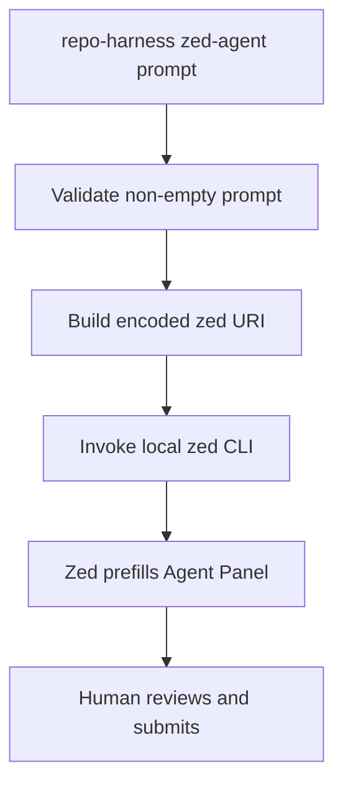

# Audit and Decision: Zed Interactive Hand-off MVP 1

> **Verdict:** revise before implementation
> **Accepted direction:** launcher-only interactive hand-off
> **Rejected direction:** detect-only Zed `AgentTarget`

## 1. Executive decision

The supplied plan correctly identifies that `zed://agent?prompt=...` is an
interactive, human-gated path. It then places that path inside the wrong
`repo-harness` abstraction.

`AgentTarget` is not a generic registry of every editor or agent-related tool.
It is the hook-runtime installer abstraction. Its methods describe supported
configuration locations, detect a configuration path, install or remove files,
and report filesystem mutations. Zed's prompt URI does none of those things.

The minimum coherent MVP is therefore:



The MVP ends at the successful CLI hand-off. Steps after that are outside the
command's observable contract.

## 2. External API findings

### 2.1 Zed is a host, not a repo-harness provider

Current Zed documentation distinguishes three agent paths:

1. Zed Agent;
2. ACP-integrated External Agents; and
3. terminal-backed threads.

It separately distinguishes those agent paths from LLM providers. Calling Zed
a provider or treating it as equivalent to the Claude/Codex hook targets would
collapse distinct concepts.

### 2.2 First-class external-agent integration is ACP

Zed documents Agent Client Protocol as the integration boundary for External
Agents. Claude and Codex can run as ACP External Agents in the Agent Panel. A
custom agent is configured under `agent_servers` with a command, arguments, and
environment.

That path is relevant to a future first-class integration, but it does not make
Zed an `AgentTarget` in this repository. If `repo-harness` later exposes an ACP
agent process, that requires its own product and protocol design.

### 2.3 The CLI can open Zed URLs

The official Zed CLI reference documents:

```bash
zed zed://settings
```

and states that `zed://`, `file://`, and `ssh://` URLs can be opened through the
CLI. This supports a URI launcher as a reasonable local effect.

### 2.4 Submission is a human action

The Agent Panel documentation says users type in the message editor and press
Enter to submit. The supplied source audit reports that `zed://agent?prompt=`
prefills the composer. MVP 1 must preserve that human boundary and must never
describe a successful URI launch as a completed or even started agent run.

### 2.5 The specific route is not a stable public contract in the current CLI docs

The current official CLI reference documents generic `zed://` URL handling but
not the `agent?prompt=` route. The supplied research inspected implementation
behavior, but a manual compatibility smoke test remains a release gate. The
plan must not imply the route has the same stability as a documented ACP API.

## 3. Repository audit findings

### Finding A — `both` would change behavior

**Severity:** critical

`src/cli/commands/install.ts` resolves `both` with:

```ts
if (spec === 'both') return [...ALL_TARGETS];
```

The supplied plan appends `zedTarget` to `ALL_TARGETS` while claiming `both`
continues to mean Claude plus Codex. Both statements cannot be true.

Consequences of following the draft:

- default `repo-harness install` would include the Zed target because the CLI
  defaults to `--target both`;
- adapter-only install and uninstall loops would report Zed pseudo-actions;
- registry tests asserting exactly two targets would fail; and
- future registry-driven behavior could silently treat Zed as a hook host.

**Decision:** do not register Zed in `ALL_TARGETS` for this MVP.

### Finding B — `AgentTarget` is a hook installer, not a capability catalog

**Severity:** high

`src/cli/installer/types.ts` explicitly calls the abstraction the
"repo-harness hook-runtime installer." Its methods and comments are all
filesystem-oriented:

- `supportsLocation` selects global/local configuration scope;
- `detect` reports configuration state and a config path;
- `install` and `uninstall` return disk mutation records; and
- `describePaths` lists paths the target would write.

A URI launcher has no location, config path, installation, or uninstallation.
A no-op implementation would weaken the abstraction instead of extending it.

**Decision:** keep the launcher outside `src/cli/installer/`.

### Finding C — CLI presence is not configuration

**Severity:** high

The draft returns:

```ts
{ installed, alreadyConfigured: installed }
```

for the presence of the `zed` executable. This falsely reports that
repo-harness has configured Zed. No repo-harness setting, hook, agent server,
or launcher registration was installed.

**Decision:** do not map executable detection into `DetectionResult`.

### Finding D — pseudo-files corrupt `WriteResult` meaning

**Severity:** medium

The draft returns a file record whose path is the literal string `zed` and whose
action is `unchanged` or `not-found`. `WriteResult.files` is documented as what
changed on disk. `unchanged` means existing file content already equals what
repo-harness would write. Neither claim applies to an executable lookup.

**Decision:** use a command-specific launch result, not `WriteResult`.

### Finding E — install location has no meaning

**Severity:** medium

Returning `true` for both global and local locations does not mean Zed supports
both configuration scopes. It means the operation has no configuration scope.
Using a location API for a location-free operation creates misleading behavior.

**Decision:** no `supportsLocation` implementation.

### Finding F — `compatibility.agents` would overstate parity

**Severity:** high

Adding `zed` to `assets/workflow-contract.v1.json` would imply compatibility at
the same conceptual layer as Claude and Codex, despite the absence of:

- hook events;
- managed runtime adapters;
- skills/fleet projection;
- reviewer/provider invocation;
- headless behavior; or
- structured completion evidence.

The validator in `scripts/workflow-contract.ts` currently only requires
`compatibility` to be a record; weak validation is not permission to publish a
false contract.

The draft also omits the required mirror
`.ai/harness/workflow-contract.json`, contrary to repository rules requiring the
two contracts to stay synchronized.

**Decision:** change neither workflow contract in launcher-only MVP 1.

### Finding G — CLI wiring in the draft is incomplete

**Severity:** medium

The current CLI uses Commander. Public command builders are imported into
`src/cli/index.ts`, listed in `SUBCOMMANDS`, and registered with
`program.addCommand(...)`. Adding only a `runZedAgent` function is insufficient.

A correct implementation must review:

- command-builder import;
- `SUBCOMMANDS`;
- `program.addCommand(buildZedAgentCommand())`;
- help text and description; and
- missing-argument exit semantics.

**Decision:** provide a complete `buildZedAgentCommand` snippet and CLI tests.

### Finding H — the draft leaks the full prompt to terminal output

**Severity:** high

The supplied success line includes:

```ts
`zed-agent: opened ${uri}`
```

The URI contains the entire encoded prompt. Encoding does not make it secret.
Shell history may already contain a literal prompt, and echoing the URI creates
another copy in logs, CI captures, support bundles, and terminal scrollback.

**Decision:** stdout and stderr must never include the prompt or full URI.

### Finding I — the process argument itself remains observable

**Severity:** high

Even with safe command output, `zed <uri>` places the prompt in a process
argument. Depending on operating system and endpoint tooling, it may appear in:

- process listings;
- endpoint monitoring;
- parent-process telemetry;
- URI-handler logs; and
- application diagnostics.

This is intrinsic to the proposed transport. A code change cannot honestly
eliminate it.

**Decision:** document the boundary; reject secrets and sensitive source text.

### Finding J — `zedCommand` alone is a weak test seam

**Severity:** medium

Pointing at a fake executable tests through filesystem and shell mechanics but
makes focused unit tests harder. Existing repository effects use injected
process functions in several places.

**Decision:** inject a typed launch-process function. Keep a separate CLI
integration test with a fake `zed` executable for end-to-end registration.

### Finding K — success cannot prove editor state

**Severity:** medium

A zero exit from the `zed` CLI can only prove that the CLI accepted the launch
request. It does not prove:

- the intended workspace received the prompt;
- the prompt is still present after URI/OS handling;
- a human reviewed it;
- the human pressed Enter;
- the agent started;
- the agent completed; or
- the result was successful.

**Decision:** name the result outcome `handed-off`, not `completed`. Success
text may say only that the Zed CLI accepted the hand-off; it must tell the user
to check Zed rather than asserting that the editor opened or displayed a
prefilled prompt.

### Finding L — no portable deep-link length guarantee exists

**Severity:** medium

Prompt size may be bounded by the CLI, OS argument limits, URI handling, or the
editor. The supplied research does not establish a portable limit, and current
public CLI documentation does not publish one.

**Decision:** document the uncertainty. Do not invent an arbitrary product limit
without a tested support contract. Long or sensitive prompts should use files,
ACP, or another transport in a later design.

### Finding M — the proposed effects directory is unnecessary

**Severity:** low

`src/effects/agent/` does not currently exist. One launcher does not justify a
new directory. The repository already uses flat effect modules such as
`src/effects/process-runner.ts`.

**Decision:** propose `src/effects/zed-agent-launcher.ts` until observed reuse
justifies a subdirectory.

### Finding N — Commander can leak an option-like prompt before the action

**Severity:** critical

Commander parses options before `.action()` runs. With the draft command shape,
a prompt such as `--SENTINEL_SECRET` is treated as an unknown option and echoed
in Commander's error output. Command-domain leakage tests cannot catch this
pre-action path.

**Decision:** the command builder must call `.allowUnknownOption(true)` so
unknown option-like words reach `[prompt...]` as prompt data without a parser
error. Known options such as `--help` remain options; users who need those
literal values must use the standard `--` separator. Add an end-to-end sentinel
test that begins with `--`.

### Finding O — new paths need explicit architecture ownership

**Severity:** high

`src/cli/index.ts` and the external-tooling reference files already resolve to
`capability.runtime-harness.global-runtime-reconciliation`, but the proposed
new command, effect, and tests are not currently claimed by a capability node.
Leaving them unmatched/root would weaken the architecture boundary.

**Decision:** add the new source/test paths to
`.archcontext/model/nodes/capability.runtime-harness.global-runtime-reconciliation.yaml`,
update its responsibility for explicit external-tool hand-offs, and regenerate
the architecture projection. Generated architecture docs must not be hand
edited.

## 4. Options considered

| Option | Description | Decision | Reason |
|---|---|---|---|
| A | Detect-only Zed `AgentTarget` | Reject | Changes `both`, violates installer semantics, false configuration reporting |
| B | Standalone URI launcher command | Accept for MVP 1 | Smallest truthful interactive hand-off |
| C | ACP External Agent integration | Defer to separate product plan | Correct first-class Zed agent API, but substantially different scope |
| D | `eval-cli` headless execution | Defer to later MVP | Different runtime, result, lifecycle, and deployment contract |
| E | `zed-eval` remote orchestration | Defer to later MVP | Adds service/remote execution and operational concerns |

## 5. Revised architecture decision

### Decision

Add a standalone command that owns only two operations:

1. deterministic URI construction; and
2. best-effort local launch through `zed`.

The command returns success after the local CLI accepts the request. It never
returns the URI, prompt, or an agent result.

### Invariants

1. Installer target registries remain exactly Claude and Codex.
2. `--target both` behavior is unchanged.
3. Hook routes and managed entries are unchanged.
4. Compatibility contracts are unchanged.
5. Fleet/reviewer/provider surfaces are unchanged.
6. The prompt is never emitted by repo-harness, including Commander parse
   failures before the action.
7. Success text says only that the CLI accepted the hand-off, tells the user to
   check Zed, and states that manual submission is still required.
8. Launch errors are prompt-independent.
9. Tests can observe the URI only through an injected process seam.
10. New source/test paths have explicit capability ownership before merge.

### Consequences

Positive:

- minimal change surface;
- no false runtime parity;
- no installer regressions;
- straightforward rollback;
- independently testable encoding and invocation; and
- leaves ACP/headless designs unconstrained.

Negative:

- prompt remains exposed as a process argument;
- no stable structured result;
- no automatic submission;
- no completion tracking;
- no guaranteed workspace selection;
- dependent on a not-currently-publicly-documented Zed route; and
- limited value compared with native ACP External Agents for some users.

## 6. Mandatory pre-implementation spike

Run this manually with a non-sensitive marker on every supported platform/release
combination before merging implementation:

```bash
zed 'zed://agent?prompt=repo-harness-zed-mvp1-smoke'
```

Record answers to:

1. Does Zed open successfully?
2. Is the marker present in the Agent Panel composer?
3. Is it unsubmitted?
4. Which window/workspace receives it when multiple windows are open?
5. Does a newline/symbol/Unicode prompt round-trip correctly?
6. Does the CLI return promptly?
7. What happens when no Zed window is open?

If the prompt auto-submits, the route is absent, or behavior is unstable, do not
ship this MVP.

## 7. When to choose ACP instead

Choose a separate ACP plan when the requirement includes any of:

- first-class thread creation;
- structured messages or responses;
- lifecycle and completion tracking;
- tool calls and permissions;
- session restore/import;
- auth/model integration;
- remote projects; or
- parity with Claude/Codex as External Agents in Zed.

The current official Zed `agent_servers` custom-agent configuration is the
relevant API surface for that work. It should not be retrofitted into the
repo-harness hook installer.

## 8. Final audit disposition

- **Original draft:** rejected as an implementation plan.
- **User-facing idea:** retained as an optional convenience command.
- **Revised MVP 1:** approved for consideration after the manual compatibility
  spike and explicit user approval.
- **Production changes made by this audit:** none.
