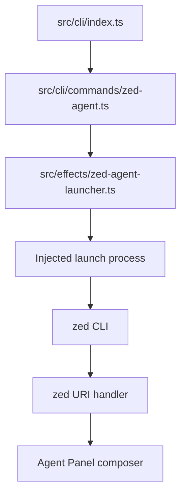

# Implementation Plan: Zed Interactive Hand-off MVP 1

> **Status:** proposal; not activated for execution
> **Artifact level:** work-package candidate
> **Implementation type:** focused CLI/effect addition
> **Prerequisite:** approval of the launcher-only decision

## 1. Goal

Provide a local convenience command:

```bash
repo-harness zed-agent "<prompt>"
```

that encodes the prompt into a `zed://agent?prompt=...` URI and asks the local
`zed` CLI to open it. The command must state that a human still needs to review
and submit the prompt inside Zed.

## 2. Observable contract

### Inputs

- One or more command-line prompt words, joined with a single space by the
  Commander adapter.
- Quoted input is recommended to preserve shell-level spacing and symbols.

### Success

- Exit code `0` means the local `zed` CLI accepted the launch request.
- Stdout says only that the local Zed CLI accepted the hand-off request.
- Stdout tells the user to check Zed and, if the prompt appears, review and
  submit it manually.
- Stdout does not claim observed editor state and does not contain prompt
  contents or the generated URI.

### Usage failure

- Exit code `2` for a missing or whitespace-only prompt.
- Stderr contains a usage-specific message without prompt content.
- The launcher is not called.

### Operational failure

- Exit code `1` when `zed` cannot be found or the launch process fails.
- Stderr gives actionable, prompt-independent guidance.
- No URI or prompt is printed.

### Explicitly unobservable

The command cannot assert whether:

- Zed displayed the prompt;
- the correct workspace was selected;
- the user submitted it;
- an agent turn started or completed; or
- the agent result passed any check.

## 3. Scope

### Included

- Pure URI builder.
- Local launch effect with an injected process seam.
- Command-domain result function.
- Commander command builder.
- Top-level command registration.
- Unit and CLI integration tests.
- Mirrored external-tooling documentation.

### Excluded

- Any installer, target, hook, fleet, reviewer, benchmark, MCP, or workflow
  compatibility changes.
- Zed configuration writes.
- CLI discovery during installation.
- ACP implementation.
- Remote/background operation.
- Prompt submission or result collection.

## 4. Architecture



### Layer responsibilities

#### CLI registration

`src/cli/index.ts` owns discoverability only:

- import command builder;
- add `zed-agent` to `SUBCOMMANDS`; and
- register the command with `program.addCommand`.

It must not encode URIs or spawn processes.

#### Command domain

`src/cli/commands/zed-agent.ts` owns:

- prompt validation;
- mapping launch outcomes to exit codes;
- safe human-readable messages; and
- Commander argument adaptation.

It must not expose the URI.

#### Effect

`src/effects/zed-agent-launcher.ts` owns:

- URI construction;
- invocation of `zed`;
- process outcome normalization; and
- classification of missing executable versus other launch failure.

It returns no prompt or URI in its public launch result.

## 5. Future implementation file list

### Exact hand-authored source, tests, docs, and architecture authority

| File | Action | Responsibility |
|---|---|---|
| `src/effects/zed-agent-launcher.ts` | new | URI builder, typed process seam, launch result |
| `src/cli/commands/zed-agent.ts` | new | validation, safe messages, Commander builder |
| `src/cli/index.ts` | edit | import, `SUBCOMMANDS`, `addCommand` |
| `tests/effects/zed-agent-launcher.test.ts` | new | encoding, invocation, failure classification |
| `tests/cli/zed-agent.test.ts` | new | validation, no leakage, parser safety, help, fake-CLI E2E |
| `assets/reference-configs/external-tooling.md` | edit | canonical package/runtime documentation |
| `.archcontext/model/nodes/capability.runtime-harness.global-runtime-reconciliation.yaml` | edit | claim new paths and verification under the existing capability |

### Deterministic generated/projection outputs

| File | Action | Producer |
|---|---|---|
| `docs/reference-configs/external-tooling.md` | generated edit | `bun run sync:reference-configs` |
| `docs/architecture/modules/runtime-harness/global-runtime-reconciliation.md` | generated edit | configured ArchContext docs projection |
| `docs/architecture/.projection-manifest.json` | generated if planned | configured ArchContext docs projection |

Run `archctx docs plan --json` to obtain the authoritative complete generated
architecture output list before apply; do not hand-edit generated module text.

### Workflow-managed files

After approval, use the repository's normal work-package capture and contract
workflow. Timestamped `plans/`, contract, review, notes, workstream, and current
projection paths are created by that workflow and are not safe to pre-name in
this proposal.

## 6. Explicit non-change list

The implementation contract must forbid edits to:

```text
src/cli/installer/types.ts
src/cli/installer/targets/registry.ts
src/cli/commands/install.ts
src/cli/hook/route-registry.ts
src/cli/installer/managed-entries.ts
src/core/skill-surface/catalog.ts
src/core/review/cross-review.ts
src/effects/review/cross-review-runner.ts
src/cli/mcp/types.ts
src/cli/tools/codegraph.ts
scripts/install-agent-fleet.sh
assets/templates/helpers/install-agent-fleet.sh
assets/workflow-contract.v1.json
.ai/harness/workflow-contract.json
assets/skill-commands/manifest.json
```

Absent requirements are forbidden design space. Do not add Zed to any closed
host/provider list during this slice.

## 7. Implementation sequence

### Phase 0 — compatibility and architecture spike

1. Confirm the `zed` CLI is installed.
2. Run a non-sensitive `zed://agent?prompt=` smoke marker.
3. Confirm prefill and manual-submit behavior.
4. Test no-window and multiple-window behavior.
5. Record supported Zed version/platform in the implementation notes.
6. Stop if the route is missing or auto-submits.
7. Confirm the launcher belongs to
   `capability.runtime-harness.global-runtime-reconciliation` because the CLI
   entrypoint and external-tooling docs already resolve there.
8. Update that capability node to claim the new command, effect, and tests; do
   not leave new paths unmatched/root.
9. Run `archctx docs plan --json` and record every generated projection path.

### Phase 1 — pure effect

1. Add `buildZedAgentUri(prompt)`.
2. Use `URLSearchParams` and normalize form-encoded `+` separators to `%20`.
3. Define a narrow injected process function.
4. Default to synchronous `spawnSync` with ignored stdio and a bounded timeout.
5. Normalize outcomes with a non-sensitive `outcome` discriminant:
   `handed-off`, `not-found`, or `launch-failed`.
6. Never return the URI from `launchZedAgent`.

### Phase 2 — command domain

1. Add `runZedAgent(prompt, deps)`.
2. Reject blank input before the effect.
3. Inject `launch` for unit tests.
4. Map outcomes to `0`, `1`, or `2`.
5. Use only generic success/error text.
6. Add `buildZedAgentCommand()` with optional variadic prompt arguments so the
   command domain, not Commander, owns exit code `2` for missing input.
7. Call `.allowUnknownOption(true)` so unknown option-like prompt words reach
   the action instead of being echoed by a Commander parse error.
8. Keep known options such as `--help`; document `--` for passing those values
   literally.

### Phase 3 — CLI registration

1. Import `buildZedAgentCommand` in `src/cli/index.ts`.
2. Add `zed-agent` to `SUBCOMMANDS`.
3. Register it beside other public command builders.
4. Do not change install target help.
5. Do not change the top-level description to claim Zed runtime parity.

### Phase 4 — tests

1. Test URI encoding of spaces, plus, ampersand, equals, newline, Unicode, and
   percent characters.
2. Test exactly one process invocation with command `zed` and one URI argument.
3. Test `cwd`, ignored stdio, and timeout options.
4. Test missing executable classification.
5. Test non-zero status and signal classification.
6. Test blank prompt exit `2` and no launch call.
7. Test success wording and manual-send wording.
8. Test that stdout/stderr exclude prompt and `zed://agent`.
9. Test CLI help registration.
10. Test end-to-end fake `zed` receives the expected URI.
11. Test launch failure output does not leak prompt.
12. Test an unknown option-like sentinel prompt reaches the fake `zed` and is
    absent from stdout/stderr.
13. Test the ordinary `launch-failed` command-domain branch, not only thrown
    exceptions.

### Phase 5 — documentation

1. Edit only the canonical
   `assets/reference-configs/external-tooling.md` source.
2. State interactive-only behavior.
3. State manual submission requirement.
4. State no structured result/completion tracking.
5. State prompt/process argument privacy risk.
6. Point first-class Zed agent integration to ACP.
7. Run `bun run sync:reference-configs` to generate the docs target.
8. Run `bun run check:reference-configs` to verify the projection.

### Phase 6 — validation

Run focused tests first, then repository gates:

```bash
bun test tests/effects/zed-agent-launcher.test.ts tests/cli/zed-agent.test.ts
bun src/cli/index.ts zed-agent --help
bun run sync:reference-configs
bun run check:reference-configs
archctx docs plan --json

git diff --check
bun test
bash scripts/check-deploy-sql-order.sh
bash scripts/check-architecture-sync.sh
bash scripts/check-task-sync.sh
repo-harness run check-task-workflow --strict
bun scripts/inspect-project-state.ts --repo . --format text
bun src/cli/index.ts init --repo . --dry-run
```

For manual smoke testing, use only a harmless marker:

```bash
bun src/cli/index.ts zed-agent "repo-harness-zed-mvp1-smoke"
```

## 8. Acceptance criteria

### Functional

- [ ] `buildZedAgentUri('test prompt')` equals `zed://agent?prompt=test%20prompt`.
- [ ] Special characters round-trip through URL query parsing.
- [ ] The launcher invokes `zed` exactly once with exactly one URI argument.
- [ ] `repo-harness zed-agent "test prompt"` exits `0` when fake `zed` exits `0`.
- [ ] Missing/blank prompt exits `2` without invoking `zed`.
- [ ] Missing/failing `zed` exits `1`.

### Human boundary

- [ ] Success output says the Zed CLI accepted the hand-off request.
- [ ] Success output tells the user to check Zed and manually submit the prompt
  if it appears.
- [ ] Success output does not claim Zed displayed the prompt.
- [ ] Documentation says no editor state or agent run has been observed by
  repo-harness.

### Privacy

- [ ] No command result includes the URI.
- [ ] No stdout or stderr includes prompt contents.
- [ ] No stdout or stderr includes `zed://agent`.
- [ ] Errors do not interpolate raw process arguments.
- [ ] Unknown option-like prompt values do not trigger a Commander error that
  echoes the prompt.
- [ ] Known option names can be passed literally after `--`.
- [ ] Documentation warns about process-argument and URI-handler exposure.

### Architecture

- [ ] Installer registry remains `codex`, `claude` only.
- [ ] `--target both` remains unchanged.
- [ ] No compatibility contract changes.
- [ ] No hook/fleet/reviewer/provider changes.
- [ ] No new dependency is added.
- [ ] New command/effect/test paths are claimed by the approved capability node.
- [ ] Generated architecture docs match `archctx docs plan --json`.

### Verification

- [ ] Focused tests pass.
- [ ] Full required checks pass.
- [ ] Manual compatibility smoke confirms prefill without auto-submit.
- [ ] Changed product paths match the approved file list.

## 9. Security and privacy design

### Threat model

The user may pass proprietary code, credentials, tokens, personal data, or
incident details as a prompt. The transport exposes the prompt in a URI process
argument.

### Controls

- never echo URI/prompt;
- ignore child stdout/stderr;
- use prompt-independent failure messages;
- no telemetry added by repo-harness;
- no persistence added by repo-harness;
- explicit documentation warning; and
- command-domain and pre-action Commander tests with sentinel prompts to catch
  output leakage.

### Residual risks

- shell history from the original command;
- OS process listings;
- endpoint/process telemetry;
- URI handler/application logs;
- Zed/provider data handling after user submission; and
- unknown URI length limits.

These risks are inherent to the route and cannot be described as remediated by
URL encoding.

## 10. Rollout and rollback

### Rollout

- Ship as an opt-in command only.
- Do not add it to default install flows.
- Do not advertise runtime compatibility.
- Document minimum manually verified Zed version if known at implementation
  time.

### Rollback

The feature has no persisted repo-harness state. Rollback is:

1. remove command registration from `src/cli/index.ts`;
2. delete the command and effect modules;
3. delete focused tests; and
4. remove the canonical documentation section and re-run its projection; and
5. remove the new paths/responsibility from the capability node and regenerate
   architecture documentation.

No user configuration migration or uninstall action is required.

## 11. Future boundaries

### ACP work-package

A future ACP proposal should define:

- whether repo-harness is itself an agent or only a workflow service;
- ACP initialization and capabilities;
- session/thread ownership;
- tool and permission mapping;
- result and error envelopes;
- authentication and provider boundary;
- remote project behavior; and
- lifecycle/upgrade installation.

### Headless work-package

A future `eval-cli`/`zed-eval` proposal should independently define:

- binary/version discovery;
- process supervision;
- workspace isolation;
- structured result capture;
- timeout/cancellation;
- remote transport;
- secrets/auth;
- retries and idempotency; and
- fleet/reviewer admission.

Neither future direction should be inferred from or added to MVP 1.
