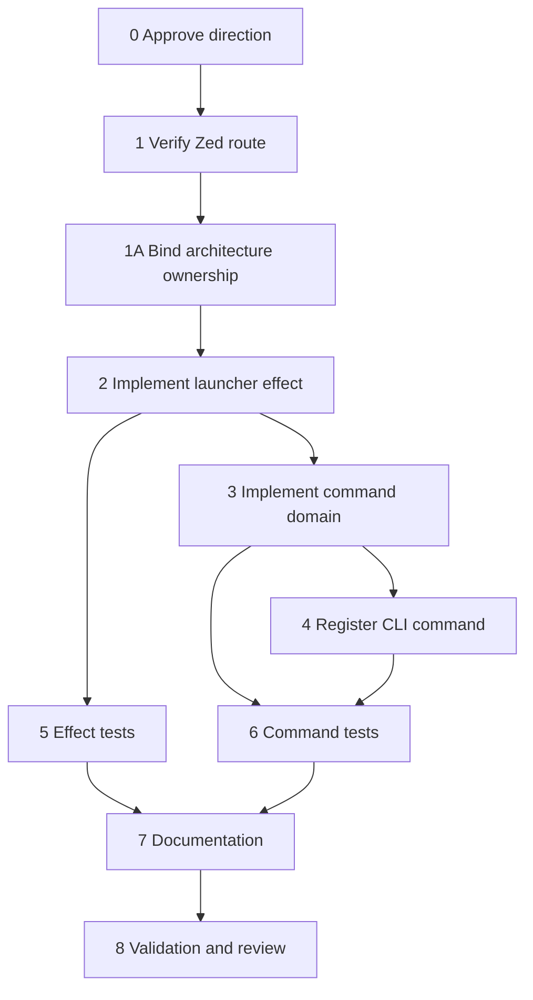

# Tasks and Subtasks: Zed Interactive Hand-off MVP 1

> This is a planning checklist, not an active repository task contract. Promote
> it through the normal `repo-harness` workflow only after the launcher-only
> decision is approved.

## Task metadata

- **Goal:** add a safe, interactive `zed-agent` convenience command.
- **Change class:** code-change work package.
- **Primary boundary:** CLI command plus local process effect.
- **Human boundary:** Zed prompt remains unsubmitted until the user acts.
- **No-extra boundary:** no installer/provider/hook/fleet/reviewer changes.

## Dependency graph

## T0 — Approve the revised boundary

### Objective

Prevent implementation from accidentally treating Zed as a hook host or
runtime-compatible provider.

### Subtasks

- [ ] T0.1 Read `audit-and-decision.md`.
- [ ] T0.2 Confirm the desired feature is only an interactive hand-off.
- [ ] T0.3 Confirm `repo-harness install --target zed` is not required.
- [ ] T0.4 Confirm no structured result or completion tracking is required.
- [ ] T0.5 Confirm prompt-in-process-argument risk is acceptable.
- [ ] T0.6 Approve the exact future product file list.
- [ ] T0.7 Capture an approved work-package plan through `repo-harness`.
- [ ] T0.8 Start the policy-required isolated contract worktree if enabled.

### Exit criteria

- Direction is explicitly approved.
- Execution boundary lists every forbidden subsystem.
- A real workflow plan/contract owns implementation.

## T1 — Verify the Zed route against a supported release

### Objective

Prove the source-audited URI route still behaves as assumed before adding a
public command around it.

### Subtasks

- [ ] T1.1 Record OS and architecture.
- [ ] T1.2 Record `zed --version` output.
- [ ] T1.3 Run `zed 'zed://agent?prompt=repo-harness-zed-mvp1-smoke'`.
- [ ] T1.4 Confirm Zed opens.
- [ ] T1.5 Confirm the marker appears in the Agent Panel composer.
- [ ] T1.6 Confirm the marker is not automatically submitted.
- [ ] T1.7 Confirm the CLI exits promptly.
- [ ] T1.8 Repeat with no Zed window open.
- [ ] T1.9 Repeat with multiple Zed windows open.
- [ ] T1.10 Record which workspace receives the prompt.
- [ ] T1.11 Test a harmless Unicode/symbol marker.
- [ ] T1.12 Record any observed length limit without using sensitive content.

### Stop conditions

Stop the work package if:

- the route is not recognized;
- the route auto-submits;
- behavior is unstable across the supported environment; or
- selecting the receiving workspace is a mandatory requirement that the route
  cannot satisfy.

### Exit criteria

- Prefill/manual-submit behavior is observed and recorded.
- Supported environment is stated.
- Known workspace behavior is documented as fact or uncertainty.

## T1A — Bind architecture ownership

### Files

- `.archcontext/model/nodes/capability.runtime-harness.global-runtime-reconciliation.yaml`
- generated ArchContext projection outputs reported by `archctx docs plan --json`

### Objective

Keep the new command, effect, and tests inside an explicit longest-prefix
capability boundary instead of leaving them unmatched/root.

### Subtasks

- [ ] T1A.1 Confirm `src/cli/index.ts` and external-tooling docs currently resolve
  to `capability.runtime-harness.global-runtime-reconciliation`.
- [ ] T1A.2 Update the node responsibility to include explicitly invoked external
  editor hand-offs that do not mutate hook/runtime compatibility state.
- [ ] T1A.3 Add the new command, effect, and two focused test paths to
  `source.include`.
- [ ] T1A.4 Add focused test commands under `extensions.verification`.
- [ ] T1A.5 Run `archctx docs plan --json`.
- [ ] T1A.6 Record every generated projection path in the active contract.
- [ ] T1A.7 Apply the configured architecture projection; do not hand-edit the
  generated architecture module.

### Exit criteria

- Every new source/test path resolves to the intended capability.
- Architecture projection is current and passes sync checks.

## T2 — Implement the launch effect

### File

`src/effects/zed-agent-launcher.ts`

### Objective

Create a small effect with deterministic URI construction and a testable local
process boundary.

### Subtasks

- [ ] T2.1 Export `buildZedAgentUri(prompt: string): string`.
- [ ] T2.2 Encode through `URLSearchParams`.
- [ ] T2.3 Normalize query separator spaces from `+` to `%20`.
- [ ] T2.4 Preserve literal plus as `%2B`.
- [ ] T2.5 Define `RunZedLaunchProcess` as a narrow injected function type.
- [ ] T2.6 Implement the default runner with `spawnSync`.
- [ ] T2.7 Invoke exactly `zed` plus one URI argument.
- [ ] T2.8 Set `stdio: 'ignore'`.
- [ ] T2.9 Apply a bounded launch timeout.
- [ ] T2.10 Pass optional `cwd` only as process context; do not claim it selects
  a Zed workspace.
- [ ] T2.11 Classify `ENOENT` as `not-found`.
- [ ] T2.12 Classify other errors, signals, null statuses, and non-zero statuses
  as `launch-failed`.
- [ ] T2.13 Return `{ ok: true, outcome: 'handed-off' }` on accepted launch.
- [ ] T2.14 Do not return the URI or prompt from `launchZedAgent`.
- [ ] T2.15 Add comments that explain the human boundary and privacy constraint.

### Exit criteria

- URI construction is pure.
- Launch result contains no prompt-bearing field.
- Tests can observe process invocation without a real executable.
- No new dependency is introduced.

## T3 — Implement command-domain behavior

### File

`src/cli/commands/zed-agent.ts`

### Objective

Own validation, exit codes, safe messages, and Commander adaptation.

### Subtasks

- [ ] T3.1 Define `ZedAgentCommandResult` with `exitCode`, `stdout`, `stderr`.
- [ ] T3.2 Define injectable `launch` dependency.
- [ ] T3.3 Validate missing or whitespace-only prompt before launch.
- [ ] T3.4 Return exit `2` for invalid usage.
- [ ] T3.5 Map launch success to exit `0`.
- [ ] T3.6 Map missing Zed and other launch failures to exit `1`.
- [ ] T3.7 Make success output say only that the Zed CLI accepted the
  hand-off request.
- [ ] T3.8 Tell the user to check Zed and manually review/submit the prompt if it
  appears; do not assert observed editor state.
- [ ] T3.9 Never interpolate prompt, URI, raw args, or untrusted process errors.
- [ ] T3.10 Catch unexpected exceptions and return a generic failure.
- [ ] T3.11 Export `buildZedAgentCommand()`.
- [ ] T3.12 Use optional variadic `[prompt...]` arguments.
- [ ] T3.13 Join prompt parts with one space.
- [ ] T3.14 Write result output to the correct stream.
- [ ] T3.15 Call `.allowUnknownOption(true)` so unknown option-like prompts do
  not leak through Commander errors.
- [ ] T3.16 Preserve known options such as `--help` and document `--` for literal
  known-option prompt values.
- [ ] T3.17 Exit with the command-domain result code.

### Exit criteria

- Missing prompt consistently exits `2`, not Commander's default missing-required-argument code.
- Output does not contain prompt-bearing data.
- Command logic is unit-testable without process mutation.

## T4 — Register the public command

### File

`src/cli/index.ts`

### Objective

Make the command discoverable without touching installer target parsing.

### Subtasks

- [ ] T4.1 Import `buildZedAgentCommand`.
- [ ] T4.2 Add `zed-agent` to `SUBCOMMANDS`.
- [ ] T4.3 Register `program.addCommand(buildZedAgentCommand())`.
- [ ] T4.4 Confirm `repo-harness --help` lists `zed-agent`.
- [ ] T4.5 Confirm `repo-harness zed-agent --help` explains interactive-only behavior.
- [ ] T4.6 Leave `TARGET_HELP` unchanged.
- [ ] T4.7 Leave `InstallTargetSpec` unchanged.
- [ ] T4.8 Leave the installer registry unchanged.
- [ ] T4.9 Do not change top-level wording to claim Zed parity.

### Exit criteria

- Public command is registered once.
- Existing install flags and defaults are byte-for-byte unchanged unless an
  independently justified unrelated update is explicitly approved.

## T5 — Add effect tests

### File

`tests/effects/zed-agent-launcher.test.ts`

### Objective

Prove encoding and process semantics at the effect boundary.

### Subtasks

- [ ] T5.1 Test plain text.
- [ ] T5.2 Test spaces become `%20`.
- [ ] T5.3 Test plus becomes `%2B`.
- [ ] T5.4 Test ampersand and equals are encoded inside the prompt value.
- [ ] T5.5 Test percent is encoded.
- [ ] T5.6 Test newline is encoded.
- [ ] T5.7 Test Unicode round-trip using `new URL(uri).searchParams.get('prompt')`.
- [ ] T5.8 Capture runner call count.
- [ ] T5.9 Assert command is `zed`.
- [ ] T5.10 Assert exactly one argument.
- [ ] T5.11 Assert the expected URI argument.
- [ ] T5.12 Assert ignored stdio and bounded timeout.
- [ ] T5.13 Assert optional `cwd` propagation.
- [ ] T5.14 Assert success result contains no `uri` or `prompt` key.
- [ ] T5.15 Assert `ENOENT` maps to `not-found`.
- [ ] T5.16 Assert non-zero status maps to `launch-failed`.
- [ ] T5.17 Assert a signal maps to `launch-failed`.

### Exit criteria

- No real Zed process is opened by unit tests.
- Every transport-sensitive character is covered.
- Public launch result is privacy-minimal.

## T6 — Add command and CLI tests

### File

`tests/cli/zed-agent.test.ts`

### Objective

Prove exit semantics, safe output, Commander registration, and one fake-binary
end-to-end path.

### Subtasks

- [ ] T6.1 Unit-test blank prompt exit `2`.
- [ ] T6.2 Assert blank prompt never calls launch.
- [ ] T6.3 Unit-test successful generic output.
- [ ] T6.4 Assert output includes prefill/manual-submit wording.
- [ ] T6.5 Use a sentinel secret prompt.
- [ ] T6.6 Assert sentinel is absent from stdout/stderr.
- [ ] T6.7 Assert `zed://agent` is absent from stdout/stderr.
- [ ] T6.8 Unit-test not-found guidance.
- [ ] T6.9 Unit-test generic launch failure guidance.
- [ ] T6.10 Assert injected thrown errors do not leak their message.
- [ ] T6.11 Test `repo-harness --help` lists `zed-agent`.
- [ ] T6.12 Test command help states interactive/manual submission.
- [ ] T6.13 Create a temporary fake `zed` executable.
- [ ] T6.14 Capture its first argument in a temporary file.
- [ ] T6.15 Run CLI with a non-sensitive prompt.
- [ ] T6.16 Assert captured URI is exactly encoded.
- [ ] T6.17 Assert CLI output excludes the prompt and URI.
- [ ] T6.18 Run CLI without prompt and assert exit `2`.
- [ ] T6.19 Run CLI with no `zed` on `PATH` and assert exit `1`.
- [ ] T6.20 Pass an unknown option-like sentinel prompt beginning with `--` and
  assert Commander neither rejects nor echoes it.
- [ ] T6.21 Assert the fake `zed` receives that option-like prompt in the URI.
- [ ] T6.22 Pass a known option name literally after `--` and assert it is prompt
  data.
- [ ] T6.23 Unit-test the ordinary `launch-failed` result branch.

### Exit criteria

- Command behavior is verified both in-process and through the real CLI entrypoint.
- Prompt leakage regression is covered.

## T7 — Update mirrored documentation

### Files

- `assets/reference-configs/external-tooling.md`
- `docs/reference-configs/external-tooling.md`

### Objective

Describe the exact capability and prevent users from mistaking it for a
provider/runtime integration.

### Subtasks

- [ ] T7.1 Add a “Zed interactive hand-off” section only to the canonical
  `assets/reference-configs/external-tooling.md` source.
- [ ] T7.2 Document command syntax.
- [ ] T7.3 State prompt is prefilled only.
- [ ] T7.4 State manual review and submission are required.
- [ ] T7.5 State no result/completion is returned.
- [ ] T7.6 State Zed is not an install target.
- [ ] T7.7 State Zed is not added to compatibility agents.
- [ ] T7.8 Warn that prompt is present in a URI process argument.
- [ ] T7.9 Warn not to pass secrets/sensitive source text.
- [ ] T7.10 Link first-class external-agent integration to Zed ACP docs.
- [ ] T7.11 Run `bun run sync:reference-configs` to generate the docs target.
- [ ] T7.12 Run `bun run check:reference-configs` to verify projection parity.

### Exit criteria

- The two docs are synchronized according to repository projection rules.
- User-facing claims match observable behavior.

## T8 — Validate, review, and close

### Focused validation

- [ ] T8.1 Run focused effect and CLI tests.
- [ ] T8.2 Run CLI help tests manually.
- [ ] T8.3 Run fake-binary E2E.
- [ ] T8.4 Run real Zed smoke with a harmless marker.
- [ ] T8.5 Inspect stdout/stderr for leakage.

### Repository gates

- [ ] T8.6 Run `git diff --check`.
- [ ] T8.7 Run `bun test`.
- [ ] T8.8 Run `bash scripts/check-deploy-sql-order.sh`.
- [ ] T8.9 Run `bash scripts/check-architecture-sync.sh`.
- [ ] T8.10 Run `bash scripts/check-task-sync.sh`.
- [ ] T8.11 Run `repo-harness run check-task-workflow --strict`.
- [ ] T8.12 Run `bun scripts/inspect-project-state.ts --repo . --format text`.
- [ ] T8.13 Run `bun src/cli/index.ts init --repo . --dry-run`.

### Review

- [ ] T8.14 Confirm hand-authored files match the approved list and generated
  files match the reference/architecture projection plans.
- [ ] T8.15 Confirm all explicitly forbidden files are unchanged.
- [ ] T8.16 Confirm installer registry tests still assert exactly Claude/Codex.
- [ ] T8.17 Confirm no compatibility contract drift.
- [ ] T8.18 Perform Waza `/check`-style review.
- [ ] T8.19 Record manual Zed evidence in the task review/notes artifact.
- [ ] T8.20 Finish the contract worktree through the normal workflow.

## Definition of done

MVP 1 is done only when:

1. the route has been manually verified on the supported Zed release;
2. the focused command works with a fake and real CLI;
3. no repo-harness output contains prompt-bearing data;
4. users are told manual submission is required;
5. option-like prompts cannot leak through pre-action Commander errors;
6. no installer/provider/compatibility surface changed;
7. architecture ownership and projections are current;
8. all required checks pass; and
9. durable workflow evidence is closed through the repository contract.
