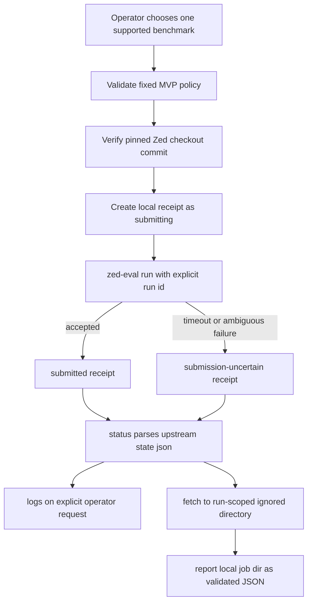

# Audit and Revised Plan: Zed Eval MVP 3

**Status:** audit baseline; implementation applied separately and under validation  
**Draft verdict:** **REJECT AS A GENERIC FLEET MVP**  
**Revised verdict:** **CONDITIONAL APPROVAL** for a benchmark-only wrapper  
**Repository baseline:** `main` at `41671fdb`  
**Upstream pin:** Zed `24e25552b1259d56a6fdd7956a419ed9e8a1a25e`  
**Scope:** historical audit and future-plan definition; implementation status is tracked separately

## 1. Executive decision

The draft correctly recognizes that Zed's Python `zed-eval` package has a
run-ID-based remote lifecycle. It is incorrect about the product abstraction,
repository baseline, cancellation API, run-store need, artifact path, sandbox
claim, writable admission, and output parsing.

The proposed implementation must not proceed as written.

`zed-eval` is a benchmark controller for Zed's first-party `eval-cli`. It builds
Zed source, launches supported benchmark datasets through Modal/Harbor/Pier,
stores controller state on a Modal volume, fetches benchmark archives, and
reports metrics. It is not a generic remote runtime that accepts an arbitrary
repo-harness instruction and repository.

The revised direction is deliberately narrower:



No arrow enters repo-harness writer leases, task contracts, cross-review,
acceptance, or merge automation. Benchmark sandboxes may be writable internally,
but this integration does not expose them as repo-harness writable workers.

## 2. Audit scope

The audit compared:

- the supplied MVP 3 draft;
- the supplied Zed automation research;
- the current repository at `main`;
- `AGENTS.md` architecture/workflow/optimization rules;
- `src/effects/process-runner.ts`;
- `src/cli/index.ts`;
- `.ai/harness/policy.json`;
- `.gitignore` and `.rgignore`;
- `.archcontext/model/nodes/*.yaml`;
- `docs/researches/20260808-repo-harness-in-opencode.md`; and
- the pinned upstream `zed-eval` README and Python implementation.

The audit treats future MVP 1 and MVP 2 documentation as proposals, not merged
source. Neither is present on `main` as implementation.

## 3. Verified repository baseline

### 3.1 There is no fleet runtime subsystem

At the audited baseline, none of these paths exists:

```text
src/core/fleet/
src/effects/fleet/
src/cli/commands/fleet.ts
```

There is no `FleetRuntimeAdapter`, `RemoteOrchestrationAdapter`, runtime registry,
or generic fleet admission function to extend.

The research document that sketches those abstractions places scheduler,
admission, lease, run-store, registry, and four runtime adapters together in a
later Phase 6. Cherry-picking only a Zed adapter before scheduler/lease and
before the independently meaningful runtime consumers would invert that plan.

### 3.2 `fleet` already means the installed specialist roster

Repository docs and helper names already use “fleet” for the installed
Claude/Codex specialist roster. A public `repo-harness fleet` benchmark wrapper
would collide with that established concept.

### 3.3 Process execution already has one hardened authority

`src/effects/process-runner.ts` provides:

- synchronous bounded execution;
- explicit/inherited environment handling;
- process-group supervision;
- SIGTERM/SIGKILL cleanup;
- timeout classification;
- command/stdout/stderr redaction; and
- output caps.

Any future wrapper must reuse `runProcess(..., { processGroup: true })`. It must
not add direct `spawn`, `exec`, another process supervisor, or another generic
redaction implementation.

### 3.4 Public Commander commands have three registration touchpoints

A future command requires:

1. a builder import in `src/cli/index.ts`;
2. an entry in `SUBCOMMANDS`; and
3. `program.addCommand(buildZedBenchmarkCommand())` in `buildProgram()`.

A command module alone is not registered.

### 3.5 Run evidence already has a canonical ignored root

`.ai/harness/policy.json` declares `.ai/harness/runs`. `.gitignore` and
`.rgignore` ignore it. Remote receipts and fetched archives belong under a
run-scoped child of that directory. They are raw evidence, not tracked durable
truth.

### 3.6 Architecture ownership must be explicit

`tests/**` is already claimed by `capability.verification.evals-checks`.
`src/cli/index.ts` is claimed by
`capability.runtime-harness.global-runtime-reconciliation`. New
`src/core/zed-benchmark/**`, `src/effects/zed-benchmark/**`, and
`src/cli/commands/zed-benchmark.ts` paths would otherwise be unmatched/root.

The future work package must update the ArchContext source of truth and apply
its generated projection. Generated architecture docs must not be hand-edited.

## 4. Verified upstream contract

All statements in this section are pinned to Zed commit
`24e25552b1259d56a6fdd7956a419ed9e8a1a25e`.

### 4.1 Product purpose

The upstream README defines `zed-eval` as a Python CLI/package for:

- building Zed's headless `eval-cli`;
- launching benchmark runs on Modal/Harbor/Pier; and
- fetching and reporting benchmark results.

Supported selectors at the pin include SWE-Atlas Q&A/refactoring/test-writing,
Terminal-Bench 2.1, and DeepSWE. This is not an arbitrary prompt/repository API.

### 4.2 `--from` selects Zed source

`zed-eval run ... --from <value>` selects the Zed source used to build
`eval-cli`:

- `local` = current Zed checkout HEAD plus tracked changes;
- ref/tag/SHA = clean Zed source resolved through the configured repository.

It does not select the repository that a free-form repo-harness worker edits.
Untracked files are excluded unless explicitly allowed.

### 4.3 Submission is detached and accepts an explicit run ID

`launch.py` creates the run record and calls the Modal controller's `.spawn(...)`.
The CLI accepts `--run-id`, prints that ID, and returns after spawning. Therefore
repo-harness can generate the upstream ID itself. It does not need to scrape
human-readable stdout.

For one benchmark selector, the supplied ID is used verbatim. Multi-benchmark
runs derive additional IDs, so the revised MVP permits exactly one selector per
submission.

### 4.4 Upstream already owns a local atomic index

`run_index.py` records run ID, namespace, experiment, volume, model, judge,
build, suite, kind, and creation time under an XDG/home cache. It writes through
a temporary file and `os.replace`.

A repo-harness receipt can still record policy and local evidence, but it must
not be justified as necessary for `zed-eval` to survive shell disconnects. The
upstream tool already supports that lifecycle.

### 4.5 Status is structured state JSON

`status` reads and prints `state.json`. The implementation comment identifies
the coarse lifecycle:

```text
pending -> running -> completed | failed
```

The draft's regex parser is unnecessary and unsafe. It invents `submitted`,
`cancelled`, and broad text matching instead of parsing the available JSON.

### 4.6 There is no cancel command

The pinned parser registers doctor, deploy, build, builds, run, report, cleanup,
swe-atlas, list, runs, status, logs, fetch, rejudge, suite operations, and
baseline operations. It does not register `cancel`.

The README warning that `deploy` can cancel in-flight runs is not a supported
per-run cancellation API. `deploy` replaces the live Modal app and can disrupt
unrelated runs. It must never be used as cancellation.

### 4.7 Fetch destination is caller-controlled

`fetch` accepts `--jobs-dir`, downloads `harbor-job.tar.gz`, and safely extracts
it below that jobs directory. The default is `~/.cache/harbor/jobs`, but a
wrapper can and should pass an exact run-scoped ignored directory.

The draft sets `localArtifactDir` without passing a corresponding upstream
option. That path would be false evidence.

### 4.8 Report JSON is not remote state

`report --json` computes success-conditioned benchmark metrics from a fetched
Harbor/Pier job directory. It is not the run lifecycle authority. `status` owns
state; report owns benchmark metrics.

When `report --fetch` is used, fetch progress is printed before the JSON report,
so blindly parsing the entire stdout as JSON is unsafe. The revised flow runs
`fetch` first and then `report --job-dir <exact-dir> --json`.

### 4.9 Remote prerequisites, secrets, and sharing matter

The upstream tool requires Modal access, a controller token secret, provider API
secrets, and local `git`, `modal`, and `harbor` executables. Remote volume
namespaces prevent collisions but are explicitly not access control. Workspace
members with volume access can read manifests, logs, patches, and archives.

Remote runs incur infrastructure and model costs and may send benchmark/source
data to Modal, model providers, and configured model-routing providers.

## 5. Severity-ranked findings

### Critical C1 — the proposed writable admission is false

The draft reports `nativeSandbox: true` and keeps a generic `admitRun()` unchanged,
thereby admitting `--writable --require-sandbox`.

Problems:

1. no attestation is collected for the selected backend or run;
2. Modal/Harbor/Pier are multiple layers, not one guaranteed capability;
3. the proposed `writable` value is never passed upstream;
4. benchmark tasks are inherently controlled by their harness, not by this bit;
5. there is no repo-harness writer lease, dedicated contract worktree, diff-scope
   gate, or patch acceptance path; and
6. a remote benchmark sandbox is not automatically a repo-harness mutation
   sandbox.

**Decision:** remove `writable`, `nativeSandbox`, and generic admission from MVP
3. Treat the operation as benchmark evidence generation only.

### Critical C2 — the adapter targets the wrong product

The draft describes a generic remote runtime, but upstream runs fixed benchmark
families and builds Zed source. It cannot accept an arbitrary repo-harness task
against the current repository.

**Decision:** rename the product boundary to `zed-benchmark`. If the actual goal
is a remote arbitrary-repository worker, stop this plan and design a different
runtime around a supported arbitrary-repo transport.

### Critical C3 — cancellation is invented

No pinned `zed-eval cancel` parser entry exists. Calling it would fail.

**Decision:** no cancel method, command, capability, phase, or acceptance test.
A future cancellation slice requires a new upstream pin and live destructive
semantics tests.

### Critical C4 — retry after submission timeout can duplicate paid work

The upstream command creates a remote record before spawning the controller. A
local outer timeout or connection failure can occur after remote acceptance.
Blind retry can launch a duplicate run and duplicate cost.

**Decision:** allocate the exact upstream run ID first, persist a `submitting`
receipt before invocation, and mark ambiguous failures `submission-uncertain`.
Status reconciliation uses the same explicit ID. Never auto-retry submit.

### High H1 — the repository subsystem assumed by the draft does not exist

Every proposed fleet file either extends a non-existent file or creates a new
generic subsystem with one consumer.

**Decision:** no `src/core/fleet`, `src/effects/fleet`, runtime adapter, or
registry in this work package.

### High H2 — the draft duplicates upstream run mapping

The upstream run index already maps run ID to namespace/experiment and survives
shell disconnects. The draft's reason for a second store is factually wrong.

**Decision:** keep only a repo-harness receipt for policy/evidence. Pass explicit
run ID, namespace, and experiment on every call so control does not depend on
either best-effort index.

### High H3 — regex parsing discards structured state

Matching words such as `done`, `error`, or `active` can classify unrelated text,
changes silently with wording, and maps transport failures to `unknown`.

**Decision:** parse `state.json` as JSON, validate required fields, allow only
pinned statuses, and distinguish transport/schema failures from remote phase.

### High H4 — artifact reporting is fabricated

The draft claims a path without passing `--jobs-dir`, and returns a report with
`null` on parse/fetch failure.

**Decision:** pass an exact jobs directory, verify the expected extracted job
directory, parse report JSON after a separate fetch, and fail closed on missing
or malformed output.

### High H5 — binary identity and environment are not stable

The adapter's probe may receive a binary path/env, while submit/status/report
call `bin({})` and discard that context. The normal upstream installation is
editable and can change with its checkout.

**Decision:** require an absolute Zed checkout, execute its one-off script, and
verify `git -C <checkout> rev-parse HEAD` equals the approved pin before every
state-changing operation. Store the verified pin in the receipt.

### High H6 — source reproducibility is under-specified

`--from local` includes tracked Zed changes, excludes untracked files by default,
and can upload a patch. `main` is moving. A tag can be moved.

**Decision:** MVP accepts only a full 40-hex clean Zed source SHA and passes
`--require-clean`. Do not expose `--repo-url`, `--patch-path`, `--base-sha`,
`--allow-untracked`, `--clean-source`, or arbitrary Harbor arguments.

### High H7 — deployment is a dangerous hidden operation

Deploying replaces the live app and can cancel in-flight runs.

**Decision:** the wrapper never deploys. Deployment is a separately authorized
operator prerequisite and cannot be used as probe, repair, or cancellation.

### High H8 — logs and artifacts can contain sensitive data

Controller logs, source patches, manifests, prompts/tasks, model output, tool
inputs, and fetched archives may contain sensitive information. `runProcess`
redacts bounded returned text but cannot retroactively sanitize remote volume
content or extracted files.

**Decision:** require explicit data/cost acknowledgement, keep local evidence
ignored with restrictive permissions, avoid automatic durable promotion, and
state remote retention/access implications.

### Medium M1 — report/status authority is conflated

A completed benchmark report is not the state machine, and report generation can
fail after the run completed.

**Decision:** status and report have separate validated contracts and error
classes.

### Medium M2 — run-store code is path-traversal and corruption prone

The draft interpolates arbitrary run IDs into filenames, uses non-atomic writes,
silently maps corrupt records to missing, ignores its schema field, and permits
state regression.

**Decision:** validate constrained generated IDs, use one directory per run,
create files atomically with restrictive mode, validate schema on read, and
surface corruption distinctly.

### Medium M3 — CLI validation is incomplete

The draft does not validate positive integer task counts, concurrency, supported
benchmarks, source identity, model, namespace, adapter lookup, or report output.
It uses non-null assertions after registry lookup.

**Decision:** use a narrow typed request and fail before any remote call.

### Medium M4 — costs and quotas have no admission boundary

Remote build, controller, sandbox, model, and judge use can be expensive. The
draft has no confirmation, task cap, concurrency cap, or resource cap.

**Decision:** require `--acknowledge-remote-cost-and-data`, cap MVP task and
concurrency values, pass explicit CPU/memory/time limits, and add cost-aware live
canary gates.

### Medium M5 — multi-benchmark ID semantics are ignored

An explicit `--run-id` is used verbatim only for the first leg; multiple
benchmarks derive more IDs and may create a suite.

**Decision:** MVP accepts exactly one benchmark selector per submit. Suites are
a later work package.

### Medium M6 — current CLI naming would collide

`fleet` is already overloaded, and future MVP 2 proposes `zed-eval` for the
direct local binary.

**Decision:** use `repo-harness zed-benchmark` for the Python remote benchmark
orchestrator.

### Medium M7 — architecture projection is absent

The new production paths are not currently claimed by a capability node.

**Decision:** update ArchContext ownership and regenerate projections in the
implementation work package.

### Low L1 — compatibility metadata is unrelated

Adding `zed` to `compatibility.agents` does not follow from a benchmark wrapper
and would also require synchronized edits to both workflow contract copies.

**Decision:** change neither workflow contract.

## 6. Draft disposition table

| Draft proposal | Disposition | Reason |
|---|---|---|
| Extend `FleetRuntimeAdapter` | Reject | No implemented fleet subsystem or shared consumer |
| `RemoteOrchestrationAdapter` | Reject for MVP | Premature generic abstraction |
| `.ai/harness/runs/fleet/` mapping store | Replace | Use run-scoped benchmark receipt; upstream already indexes |
| Parse run ID from stdout | Reject | Pass explicit upstream `--run-id` |
| Regex phase parser | Reject | Parse pinned `state.json` JSON |
| `cancel` command | Reject | No upstream API at pin |
| `nativeSandbox: true` | Reject | No run-specific attestation; wrong abstraction |
| `writable` admission | Reject | Flag has no upstream effect; no lease/diff gate |
| `repo-harness fleet` | Reject | Semantic collision |
| `report --fetch` then JSON.parse stdout | Reject | Fetch progress contaminates stdout |
| Generic runtime registry | Defer | Extract only after real independent consumers |
| Reuse `runProcess` | Accept | Existing bounded process authority |
| Persist local evidence | Accept with redesign | Receipt, not duplicate control-plane mapping |
| Detached submit/status/logs/fetch/report | Accept with pinned contracts | Matches upstream lifecycle |

## 7. Revised MVP boundary

### 7.1 In scope

- One top-level `zed-benchmark` command.
- Subcommands: `submit`, `status`, `logs`, `fetch`, `report`.
- One supported benchmark per submit.
- Full clean Zed source SHA only.
- Explicit pinned Zed checkout and one-off script.
- Explicit upstream run ID, namespace, benchmark, model, task count,
  concurrency, CPU, memory, and timeout arguments.
- Fixed initial benchmark allowlist.
- Explicit remote cost/data acknowledgement.
- Pre-submit receipt and `submission-uncertain` recovery.
- JSON validation for state and report.
- Fetch to `.ai/harness/runs/zed-benchmark/<runId>/artifacts/`.
- Existing `runProcess` with process-group supervision.
- Focused unit/fixture/CLI tests and one opt-in paid live canary.
- ArchContext ownership and generated projection.
- Documentation for setup, security, cost, retention, and rollback.

### 7.2 Explicitly out of scope

- arbitrary prompts or arbitrary repositories;
- generic fleet runtime interfaces, scheduler, registry, leases, or selection;
- repo-harness writer admission or mergeable patches;
- cancellation;
- deploy/doctor repair automation;
- multi-benchmark suites;
- `--from local`, moving refs, patches, custom repo URLs, or untracked source;
- arbitrary extra Harbor args or secret overrides;
- staff mode;
- installer targets, hooks, providers, reviewers, compatibility metadata;
- automatic artifact promotion; and
- installation or redistribution of Zed/Modal/Harbor/Pier tooling.

## 8. Proposed future architecture

### 8.1 Public command

```text
repo-harness zed-benchmark submit \
  --zed-checkout /absolute/pinned/zed \
  --source-sha <40-hex-zed-sha> \
  --benchmark rf \
  --model sonnet-4.6 \
  --n-tasks 2 \
  --n-concurrent 1 \
  --acknowledge-remote-cost-and-data

repo-harness zed-benchmark status --run-id <id>
repo-harness zed-benchmark logs --run-id <id>
repo-harness zed-benchmark fetch --run-id <id>
repo-harness zed-benchmark report --run-id <id> --json
```

### 8.2 Local receipt phases

```text
submitting
submission-uncertain
pending
running
completed
failed
```

`submission-uncertain` is local evidence about the submit call, not an upstream
remote status. `status` can reconcile it to a remote status. No state is ever
called cancelled.

### 8.3 One source of truth per datum

| Datum | Authority |
|---|---|
| Remote run lifecycle | upstream `state.json` from `zed-eval status` |
| Benchmark metrics | validated JSON from `zed-eval report --job-dir ... --json` |
| Remote logs | upstream `controller.log` via explicit `logs` request |
| Local invocation policy/spec | repo-harness receipt |
| Remote run locator | exact generated run ID + stored explicit namespace/experiment |
| Fetched artifacts | exact run-scoped jobs directory |
| Upstream implementation contract | approved Zed commit pin |

## 9. Future implementation file list

| Future path | Action | Purpose |
|---|---|---|
| `src/core/zed-benchmark/types.ts` | new | Narrow requests, phases, receipts, validated state/report types |
| `src/core/zed-benchmark/admission.ts` | new | Pure benchmark/source/cost/resource/run-ID validation |
| `src/core/zed-benchmark/state-schema.ts` | new | Parse pinned `state.json` and report JSON fail-closed |
| `src/effects/zed-benchmark/receipt-store.ts` | new | Atomic restrictive run-scoped receipt persistence |
| `src/effects/zed-benchmark/run-zed-benchmark.ts` | new | Pinned checkout verification and submit/status/log/fetch/report effects |
| `src/cli/commands/zed-benchmark.ts` | new | Commander surface and safe formatting |
| `src/cli/index.ts` | edit | Import, `SUBCOMMANDS`, registration |
| `.archcontext/model/nodes/capability.verification.evals-checks.yaml` | edit | Claim and describe new verification paths |
| generated architecture projection paths | generated | Apply exactly what `archctx docs plan --json` reports |
| `docs/reference-configs/external-tooling.md` | edit | Operator prerequisites and boundaries |
| `assets/reference-configs/external-tooling.md` | synchronized edit | Packaged mirror required by reference-config sync |
| `tests/zed-benchmark-admission.test.ts` | new | Pure validation matrix |
| `tests/zed-benchmark-state-schema.test.ts` | new | State/report schema fixtures |
| `tests/zed-benchmark-receipt-store.test.ts` | new | Atomicity, corruption, permissions, transitions |
| `tests/zed-benchmark-runner.test.ts` | new | Exact argv/env/timeout and ambiguous submit behavior |
| `tests/cli/zed-benchmark.test.ts` | new | Commander registration, exits, output, fixture binary |
| `tests/live/zed-benchmark.live.test.ts` | new, opt-in | Paid one-task canary only |

### Files explicitly forbidden in this work package

```text
src/cli/installer/types.ts
src/cli/installer/targets/registry.ts
src/cli/hook/route-registry.ts
src/cli/installer/managed-entries.ts
src/core/review/cross-review.ts
src/effects/review/cross-review-runner.ts
assets/templates/helpers/install-agent-fleet.sh
assets/workflow-contract.v1.json
.ai/harness/workflow-contract.json
```

No `src/core/fleet/**`, `src/effects/fleet/**`, or
`src/cli/commands/fleet.ts` path may be created.

## 10. Acceptance gates

### Contract gates

- The operator confirms benchmark-only intent.
- The approved plan records the upstream commit and exact allowed selectors.
- No cancellation or generic writable claim appears.
- Exact cost/resource caps are approved.
- The execution boundary forbids every out-of-scope subsystem.

### Static/unit gates

- Every generated run ID matches a constrained pattern.
- Only a full 40-hex source SHA is accepted.
- `local`, `main`, tags, patch paths, custom repo URLs, extra args, and staff mode
  cannot enter the CLI.
- Submit persists before invocation and never auto-retries.
- Timeout/nonzero submit produces `submission-uncertain`.
- State JSON accepts only pinned phases.
- Corrupt receipt/state/report files fail distinctly.
- Fetch/report paths remain under the canonical run directory.
- No command logs credentials or the full environment.

### Integration gates

- Fake `zed-eval` fixture proves exact argv for every subcommand.
- Fixture status uses real JSON, not prose regex.
- Fetch creates the expected run directory before report is accepted.
- Report parsing rejects prefixed/suffixed prose.
- CLI help contains benchmark-only, remote-cost, and no-cancel wording.
- Existing install/fleet/reviewer surfaces are unchanged.

### Live gate

One manually enabled, one-task, one-concurrent canary must prove:

1. pinned checkout verification;
2. remote acceptance under the generated ID;
3. status progression;
4. explicit logs retrieval;
5. fetch into the canonical run directory;
6. report JSON validation;
7. no tracked repository mutation; and
8. recorded cost/data/retention observations.

Do not run live canaries in normal `bun test` or CI.

### Repository gates

Run the root required checks after future implementation:

```bash
bun test
bash scripts/check-deploy-sql-order.sh
bash scripts/check-architecture-sync.sh
bash scripts/check-task-sync.sh
repo-harness run check-task-workflow --strict
bun scripts/inspect-project-state.ts --repo . --format text
bun src/cli/index.ts init --repo . --dry-run
```

Also run:

```bash
bun run check:type
bun run check:reference-configs
```

## 11. Rollback

The implementation rollback is deletion of the new `zed-benchmark` source/tests,
removal of the three CLI registration edits, restoration of the prior
ArchContext node/projection, and synchronized removal of external-tooling docs.

Rollback must not:

- delete remote Modal runs or shared volume data;
- run `zed-eval deploy`;
- pretend in-flight remote work was cancelled;
- delete ignored local evidence unless the operator explicitly requests it; or
- alter installer/hook/reviewer/compatibility surfaces.

## 12. Approval decision required

Choose one:

1. **Approve revised benchmark-only direction.** Capture this as a work-package
   plan and implement only after architecture/cost/source pins are frozen.
2. **Need arbitrary-repository remote agent execution.** Reject this MVP and
   design a different runtime; `zed-eval` is not that API.
3. **Need cancellation before adoption.** Defer until upstream exposes and the
   project verifies a supported per-run cancel contract.
