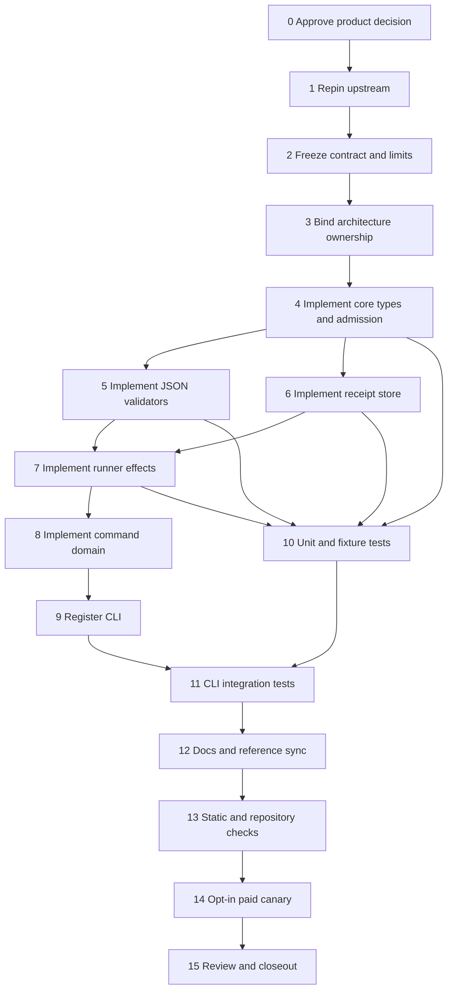

# Tasks and Subtasks: Zed Eval MVP 3

> This is the active acceptance checklist for the implemented MVP 3 slice.
> Source presence does not imply a task is complete: each task is complete only
> when its required evidence has been produced and reviewed.
>
> The implementation remains benchmark-only. Requirements for arbitrary
> repository execution, cancellation, writer admission, deployment automation,
> or a generic fleet runtime stop this work package.

## Task metadata

- **Goal:** wrap pinned Zed `zed-eval` benchmark orchestration safely and
  reproducibly.
- **Draft disposition:** reject generic fleet/writable runtime.
- **Revised product name:** `repo-harness zed-benchmark`.
- **Change class:** code-change work package with remote-cost/security boundary.
- **Primary capability:** verification/evals-checks, subject to ArchContext plan.
- **Evidence root:** `.ai/harness/runs/zed-benchmark/` (ignored raw evidence).
- **No-extra boundary:** no generic fleet, scheduler, writer, installer, hook,
  reviewer, provider, compatibility, deployment, cancellation, or suite work.
- **Upstream pin for planning:**
  `24e25552b1259d56a6fdd7956a419ed9e8a1a25e`.

## Dependency graph



## T0 — Approve or reject the revised product boundary

### Objective

Prevent implementation of a benchmark controller when the actual requirement is
an arbitrary-repository remote agent.

### Subtasks

- [ ] T0.1 Read `audit-and-revised-plan.md` completely.
- [ ] T0.2 Confirm that supported benchmark datasets—not the current repo—are the
      target workload.
- [ ] T0.3 Confirm `--from` selects Zed source for building `eval-cli`.
- [ ] T0.4 Confirm no free-form instruction or arbitrary repo path is required.
- [ ] T0.5 Confirm no mergeable patch is expected from this command.
- [ ] T0.6 Confirm absence of cancellation is acceptable for MVP 3.
- [ ] T0.7 Confirm no generic `fleet` command/interface is required.
- [ ] T0.8 Confirm no writer/sandbox capability is advertised to other
      repo-harness subsystems.
- [ ] T0.9 Confirm remote Modal/model costs and data sharing are acceptable.
- [ ] T0.10 Record the decision in an approved work-package plan.
- [ ] T0.11 Stop if any answer requires arbitrary-repository execution,
      cancellation, or writer admission.

### Exit criteria

- Product intent is benchmark-only and written down.
- Every forbidden subsystem is in the execution boundary.
- An approved plan, not this checklist, becomes execution authority.

## T1 — Repin and re-audit upstream

### Objective

Avoid implementing against a moving editable checkout or stale Python CLI.

### Subtasks

- [ ] T1.1 Select the exact Zed commit to support.
- [ ] T1.2 Record commit, commit date, tag if any, and repository URL.
- [ ] T1.3 Read `crates/eval_cli/zed_eval/README.md` at the pin.
- [ ] T1.4 Read parser definitions in `cli.py`.
- [ ] T1.5 Read submission logic in `launch.py`.
- [ ] T1.6 Read local index behavior in `run_index.py`.
- [ ] T1.7 Read state/log/fetch behavior in `volume.py`.
- [ ] T1.8 Read JSON report behavior in `report.py`.
- [ ] T1.9 Inspect upstream tests for run IDs, source resolution, index writes,
      archive extraction, and report JSON.
- [ ] T1.10 Confirm `run` still accepts `--run-id`.
- [ ] T1.11 Confirm one-selector runs use the supplied run ID verbatim.
- [ ] T1.12 Record the exact state values from `state.json` producers/tests.
- [ ] T1.13 Confirm `fetch --jobs-dir` destination semantics.
- [ ] T1.14 Confirm report JSON can be produced from `--job-dir` without prose.
- [ ] T1.15 Search for a real per-run cancel command.
- [ ] T1.16 If cancel exists at a newer pin, keep it out of this slice and open a
      separate design because destructive semantics changed.
- [ ] T1.17 Record package license and redistribution implications.
- [ ] T1.18 Capture citations in the approved plan/notes.

### Stop conditions

- No stable exact upstream pin is available.
- Explicit run IDs are not supported.
- State is no longer machine-readable.
- Fetch cannot be confined to an exact local directory.
- The supported benchmark/source model differs materially from this audit.

### Exit criteria

- A source-backed command/JSON contract is frozen.
- Every future fixture derives from the frozen contract.

## T2 — Freeze the MVP policy

### Objective

Turn cost, source, benchmark, and resource assumptions into explicit admission
rules before any remote call.

### Proposed initial policy

- one benchmark selector per submit;
- allowlist: `qna`, `rf`, `tw`, `terminal-bench-2.1`, `deepswe`;
- full 40-lowercase-hex Zed source SHA only;
- no local source, moving refs, tags, patches, custom repo URLs, or untracked
  source;
- task count `1..10`;
- concurrency `1..2` and not greater than task count;
- explicit model required;
- fixed CPU, memory, sandbox timeout, and idle timeout values;
- staff mode absent/off;
- explicit remote cost/data acknowledgement;
- one generated run ID matching `rh-zb-<uuid>`;
- one explicit namespace matching a constrained slug;
- no custom secrets or arbitrary extra harness arguments.

### Subtasks

- [ ] T2.1 Approve or amend the benchmark allowlist.
- [ ] T2.2 Approve task count maximum.
- [ ] T2.3 Approve concurrency maximum.
- [ ] T2.4 Approve CPU and memory values.
- [ ] T2.5 Approve sandbox and idle timeouts.
- [ ] T2.6 Approve model syntax/allowlist.
- [ ] T2.7 Approve namespace convention.
- [ ] T2.8 Freeze acknowledgement wording.
- [ ] T2.9 Freeze local receipt schema/version.
- [ ] T2.10 Freeze allowed state transitions.
- [ ] T2.11 Document that transport timeout means uncertain submission.
- [ ] T2.12 Document that submit is never automatically retried.

### Exit criteria

- No admission value is inferred from adapter name or container presence.
- Every launch-affecting argument is controlled by the approved request schema.

## T3 — Bind architecture ownership

### Objective

Make new production paths resolve to an explicit capability instead of
unmatched/root context.

### Candidate files

- `.archcontext/model/nodes/capability.verification.evals-checks.yaml`
- generated projection files reported by `archctx docs plan --json`

### Subtasks

- [ ] T3.1 Run the capability resolver for every proposed source/test/doc path.
- [ ] T3.2 Confirm `tests/**` already resolves to verification/evals-checks.
- [ ] T3.3 Confirm `src/cli/index.ts` remains owned by global runtime
      reconciliation.
- [ ] T3.4 Extend verification/evals-checks responsibility to remote benchmark
      orchestration evidence.
- [ ] T3.5 Add exact new core/effect/command/doc paths to `source.include`.
- [ ] T3.6 Add focused verification commands.
- [ ] T3.7 Update the corresponding component node if ArchContext requires it.
- [ ] T3.8 Run `archctx docs plan --json`.
- [ ] T3.9 Record every generated output path in the contract.
- [ ] T3.10 Apply the projection; never hand-edit generated architecture docs.
- [ ] T3.11 Run architecture sync checks.

### Exit criteria

- Every new production path has one unambiguous longest-prefix owner.
- Generated architecture surfaces are current.

## T4 — Implement narrow types and admission

### Files

- `src/core/zed-benchmark/types.ts`
- `src/core/zed-benchmark/admission.ts`

### Objective

Define only the contracts needed by one benchmark wrapper.

### Subtasks

- [ ] T4.1 Define the benchmark selector union.
- [ ] T4.2 Define remote phases exactly from the upstream pin.
- [ ] T4.3 Define local receipt phases including `submitting` and
      `submission-uncertain`.
- [ ] T4.4 Define immutable submit request fields.
- [ ] T4.5 Define receipt schema with run ID, namespace, benchmark, source pin,
      checkout pin, model, limits, timestamps, and local paths.
- [ ] T4.6 Define process-result-independent command outcomes.
- [ ] T4.7 Validate a full absolute Zed checkout path syntactically.
- [ ] T4.8 Validate full 40-hex source SHA.
- [ ] T4.9 Validate one supported benchmark.
- [ ] T4.10 Validate model and namespace slugs.
- [ ] T4.11 Validate bounded positive task/concurrency integers.
- [ ] T4.12 Require cost/data acknowledgement.
- [ ] T4.13 Generate a constrained run ID; never accept path-bearing IDs.
- [ ] T4.14 Do not define `writable`, `nativeSandbox`, `cancelled`, adapter ID,
      generic capabilities, or runtime registry types.

### Exit criteria

- Admission is pure and table-testable.
- Unsupported values fail before filesystem or network effects.

## T5 — Implement pinned JSON validators

### File

`src/core/zed-benchmark/state-schema.ts`

### Objective

Use machine-readable upstream artifacts without unsafe casts or regex parsing.

### Subtasks

- [ ] T5.1 Parse JSON with a distinct syntax error.
- [ ] T5.2 Require a plain object.
- [ ] T5.3 Require `status` as a pinned allowed string.
- [ ] T5.4 Validate optional run ID/namespace/experiment fields when present.
- [ ] T5.5 Preserve validated upstream state as read-only metadata.
- [ ] T5.6 Reject unknown status values rather than map to `unknown`.
- [ ] T5.7 Validate report JSON top-level shape.
- [ ] T5.8 Require finite/non-negative count/rate fields when present.
- [ ] T5.9 Do not use report success as remote lifecycle state.
- [ ] T5.10 Add fixtures copied or derived from the exact upstream pin.

### Exit criteria

- Prose, truncated JSON, arrays, null, unknown status, NaN-like values, and wrong
  types fail closed.

## T6 — Implement the receipt store

### File

`src/effects/zed-benchmark/receipt-store.ts`

### Objective

Persist local policy/evidence safely without pretending to replace the upstream
control plane.

### Subtasks

- [ ] T6.1 Resolve canonical root
      `.ai/harness/runs/zed-benchmark` under the supplied repo root.
- [ ] T6.2 Validate run ID before path construction.
- [ ] T6.3 Use one directory per run.
- [ ] T6.4 Reject symlink/path escape conditions.
- [ ] T6.5 Create directory mode `0700` where supported.
- [ ] T6.6 Create initial receipt atomically/exclusively.
- [ ] T6.7 Write replacement through same-directory temporary file plus rename.
- [ ] T6.8 Set receipt mode `0600` where supported.
- [ ] T6.9 Validate schema and all fields on read.
- [ ] T6.10 Distinguish missing from corrupt.
- [ ] T6.11 Enforce legal phase transitions.
- [ ] T6.12 Preserve immutable request fields on update.
- [ ] T6.13 Record `updatedAt` on every transition.
- [ ] T6.14 Never enumerate or follow arbitrary filenames.
- [ ] T6.15 Keep logs/reports/artifacts outside the receipt JSON.

### Exit criteria

- Corruption and duplicate run IDs fail visibly.
- Concurrent/partial writes cannot produce an accepted receipt.

## T7 — Implement effects

### File

`src/effects/zed-benchmark/run-zed-benchmark.ts`

### Objective

Own exact external process invocation and artifact paths through `runProcess`.

### Subtasks

- [ ] T7.1 Resolve `<zedCheckout>/crates/eval_cli/script/zed-eval`.
- [ ] T7.2 Verify checkout is absolute and expected files exist.
- [ ] T7.3 Run `git -C <checkout> rev-parse HEAD` through `runProcess`.
- [ ] T7.4 Require checkout HEAD equals the approved integration pin.
- [ ] T7.5 Do not run `git fetch`, checkout, reset, install, doctor repair, or
      deploy.
- [ ] T7.6 Generate run ID and persist `submitting` before launch.
- [ ] T7.7 Pass explicit namespace, one benchmark, `--run-id`, full `--from`
      SHA, `--require-clean`, model, task/concurrency, and resource limits.
- [ ] T7.8 Omit staff, local source, extra args, secret overrides, and custom repo.
- [ ] T7.9 Use `runProcess` with process-group supervision and bounded output.
- [ ] T7.10 On clean exit, update receipt to `pending` or submitted-equivalent.
- [ ] T7.11 On timeout, signal, nonzero, or malformed acceptance, update to
      `submission-uncertain` and never retry.
- [ ] T7.12 Implement status with explicit namespace/experiment/run ID.
- [ ] T7.13 Parse status JSON and update only legal phases.
- [ ] T7.14 Implement logs as an explicit operator request with bounded/redacted
      returned output.
- [ ] T7.15 Implement fetch with exact run-scoped `--jobs-dir`.
- [ ] T7.16 Verify expected extracted `<jobsDir>/<runId>` directory exists.
- [ ] T7.17 Implement report using `--job-dir <exact> --json` after fetch.
- [ ] T7.18 Parse report JSON fail-closed.
- [ ] T7.19 Do not implement cancel, deploy, list-all, suite, rejudge, baseline,
      or cleanup.

### Exit criteria

- Every external argv is deterministic and fixture-testable.
- Ambiguous submission can be reconciled without duplicate launch.

## T8 — Implement command-domain behavior

### File

`src/cli/commands/zed-benchmark.ts`

### Objective

Own Commander adaptation, safe messages, exits, and explicit remote-risk UX.

### Subtasks

- [ ] T8.1 Build one `zed-benchmark` command with five subcommands.
- [ ] T8.2 `submit` requires checkout, source SHA, benchmark, model, task count,
      concurrency, and acknowledgement.
- [ ] T8.3 Expose no raw passthrough args.
- [ ] T8.4 Return usage/admission failures with exit `2`.
- [ ] T8.5 Return policy/runtime/remote failures with documented nonzero exits.
- [ ] T8.6 Print generated run ID on accepted or uncertain submission.
- [ ] T8.7 Make uncertain output explicitly say “do not retry submit; run status”.
- [ ] T8.8 Keep stdout machine-readable under `--json`.
- [ ] T8.9 Send diagnostics to stderr.
- [ ] T8.10 Never print credentials, full environment, source patches, or raw
      process command.
- [ ] T8.11 Mark logs as potentially sensitive in help.
- [ ] T8.12 State no cancellation is available.
- [ ] T8.13 State command is benchmark-only and not a writer.

### Exit criteria

- Help and outputs cannot be mistaken for generic fleet execution.

## T9 — Register the command

### File

`src/cli/index.ts`

### Subtasks

- [ ] T9.1 Import `buildZedBenchmarkCommand`.
- [ ] T9.2 Add `zed-benchmark` to `SUBCOMMANDS`.
- [ ] T9.3 Register `program.addCommand(buildZedBenchmarkCommand())`.
- [ ] T9.4 Confirm top-level help lists the command exactly once.
- [ ] T9.5 Leave install target help unchanged.
- [ ] T9.6 Leave description claims about Claude/Codex compatibility unchanged.

## T10 — Add unit and fixture tests

### Subtasks

- [ ] T10.1 Table-test every benchmark selector.
- [ ] T10.2 Reject local/main/tag/short SHA/mixed-case/path source values.
- [ ] T10.3 Test task and concurrency boundaries.
- [ ] T10.4 Test acknowledgement required.
- [ ] T10.5 Test run-ID generation and path rejection.
- [ ] T10.6 Test every pinned state and every malformed state fixture.
- [ ] T10.7 Test report numeric/type validation.
- [ ] T10.8 Test receipt create/load/update.
- [ ] T10.9 Test duplicate, corrupt, truncated, symlink, and illegal transition
      behavior.
- [ ] T10.10 Test restrictive permissions where portable.
- [ ] T10.11 Inject `runProcess` and capture exact argv/options.
- [ ] T10.12 Test checkout pin mismatch before launch.
- [ ] T10.13 Test success, nonzero, timeout, signal, and exception submission.
- [ ] T10.14 Assert submit is called at most once.
- [ ] T10.15 Assert uncertain receipt preserves run ID.
- [ ] T10.16 Test status reconciliation from uncertain.
- [ ] T10.17 Test exact fetch jobs directory.
- [ ] T10.18 Test report uses local `--job-dir`, not mixed fetch output.
- [ ] T10.19 Assert no forbidden argv appears.
- [ ] T10.20 Assert no `cancel` or `deploy` invocation exists.

## T11 — Add CLI integration tests

### Subtasks

- [ ] T11.1 Create a temporary fake Zed checkout.
- [ ] T11.2 Create fake `git` and one-off `zed-eval` scripts.
- [ ] T11.3 Capture every argv without network access.
- [ ] T11.4 Run the real Bun CLI entrypoint.
- [ ] T11.5 Assert top-level and subcommand help.
- [ ] T11.6 Assert missing acknowledgement fails before fixture invocation.
- [ ] T11.7 Assert accepted submit prints run ID and receipt path only.
- [ ] T11.8 Assert timeout output says submission uncertain/no retry.
- [ ] T11.9 Assert status JSON/text modes.
- [ ] T11.10 Assert logs are emitted only on explicit logs command.
- [ ] T11.11 Simulate fetch extraction and report JSON.
- [ ] T11.12 Assert no tracked files are modified.
- [ ] T11.13 Assert install, hooks, reviewers, and workflow contracts are unchanged.

## T12 — Update operator documentation

### Files

- `docs/reference-configs/external-tooling.md`
- `assets/reference-configs/external-tooling.md`

### Subtasks

- [ ] T12.1 Explain benchmark-only purpose.
- [ ] T12.2 Explain source SHA is Zed source, not target repo.
- [ ] T12.3 Document Modal/Harbor/provider prerequisites.
- [ ] T12.4 Document separate manual deployment and its in-flight risk.
- [ ] T12.5 Document cost, quotas, remote sharing, and retention.
- [ ] T12.6 Document local ignored artifact path and permissions.
- [ ] T12.7 Document no cancellation/no automatic retry.
- [ ] T12.8 Document uncertain submission recovery.
- [ ] T12.9 Document repinning process.
- [ ] T12.10 Synchronize asset/docs copies with the repository script.

## T13 — Run validation

### Focused commands

```bash
bun test tests/zed-benchmark-admission.test.ts
bun test tests/zed-benchmark-state-schema.test.ts
bun test tests/zed-benchmark-receipt-store.test.ts
bun test tests/zed-benchmark-runner.test.ts
bun test tests/cli/zed-benchmark.test.ts
bun run check:type
bun run check:reference-configs
```

### Root commands

```bash
bun test
bash scripts/check-deploy-sql-order.sh
bash scripts/check-architecture-sync.sh
bash scripts/check-task-sync.sh
repo-harness run check-task-workflow --strict
bun scripts/inspect-project-state.ts --repo . --format text
bun src/cli/index.ts init --repo . --dry-run
```

### Subtasks

- [ ] T13.1 Run focused tests first.
- [ ] T13.2 Run type checking.
- [ ] T13.3 Run reference mirror check.
- [ ] T13.4 Run architecture projection/sync checks.
- [ ] T13.5 Run the full required suite.
- [ ] T13.6 Review `git diff --check`.
- [ ] T13.7 Review changed paths against execution boundary.
- [ ] T13.8 Confirm no live network call occurred in ordinary tests.

## T14 — Run one opt-in paid canary

### Preconditions

- Manual operator approval immediately before launch.
- Dedicated Modal service token and least-privilege secrets.
- Known remaining budget/quota.
- No `zed-eval deploy` while runs are active.
- One task, one concurrent sandbox, approved model.
- No sensitive local Zed patch; full clean source SHA.

### Subtasks

- [ ] T14.1 Run upstream `doctor` manually without repair side effects.
- [ ] T14.2 Confirm deployment exists; do not redeploy automatically.
- [ ] T14.3 Submit one allowed benchmark/task.
- [ ] T14.4 Record generated run ID and local receipt.
- [ ] T14.5 Observe pending/running/completed or failed state.
- [ ] T14.6 Retrieve bounded logs manually.
- [ ] T14.7 Fetch into the exact ignored run directory.
- [ ] T14.8 Validate report JSON.
- [ ] T14.9 Record actual cost/resource/retention observations.
- [ ] T14.10 Confirm `git status` shows no product/source mutation from the run.
- [ ] T14.11 If submission is uncertain, reconcile by status; never resubmit.

### Stop conditions

- unexpected benchmark/source/model/secret routing;
- evidence outside the canonical directory;
- unexpected tracked source mutation;
- status/report schema drift;
- quota/cost anomaly;
- inability to identify remote run uniquely; or
- any need to deploy in order to continue.

## T15 — Review and close out

### Subtasks

- [ ] T15.1 Run Waza `/check`-style review.
- [ ] T15.2 Verify no extra subsystem was added.
- [ ] T15.3 Verify all source claims cite the final upstream pin.
- [ ] T15.4 Promote durable conclusions to architecture/research/reference docs.
- [ ] T15.5 Keep raw canary evidence ignored.
- [ ] T15.6 Complete contract-worktree finish flow.
- [ ] T15.7 Archive fulfilled plan/contract/review/notes artifacts per policy.
- [ ] T15.8 Do not delete remote runs or shared volume artifacts as part of code
      closeout.

## Final definition of done

MVP 3 is done only when the command safely orchestrates one pinned remote Zed
benchmark with deterministic IDs, validated state/report contracts, confined
local artifacts, explicit cost/data acknowledgement, uncertain-submit recovery,
and no false fleet/writer/cancel/provider claim.
