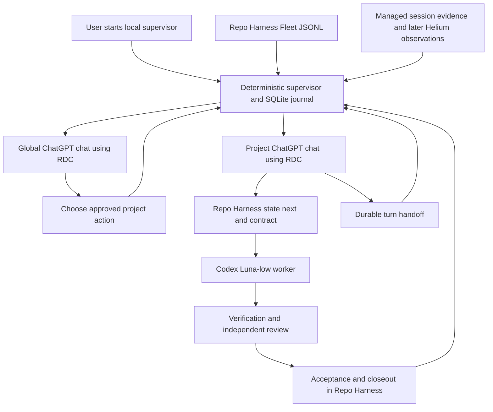

# PRD: RDC Supervisor — phased roadmap

> **Status**: Draft
> **Approval**: Planning only; no implementation or activation approved
> **Created**: 2026-09-26
> **Owner**: Parent orchestrator and human product owner
> **Research**: [Autonomous RDC Supervisor report](../../docs/researches/deep-research-report-Remote-Desktop-Commander-Supervisor-Repo-Harness-ChatGPT.md)
> **Execution home**: Proposed standalone `rdc-rh-supervisor` repository; location needs approval
> **Detailed MVP plan**: [Monitor checkpoint and one-project execution MVP](../plan-20260926-1340-rdc-supervisor-mvp.md)
> **Priority decision**: Deliver an intentionally unhardened personal MVP first. All new security engineering is deferred to the final phase.

## Product outcome

After one-time setup, the user starts a local supervisor. It observes Repo Harness Fleet and the explicitly registered ChatGPT/RDC sessions, resumes approved work in the right project, supervises Luna-low execution, and preserves continuity across approximately 25-minute RDC turns. Eventually it coordinates several projects without requiring the user to type “continue” after every turn.

An idle system makes **zero model calls**. Browser response completion is not task acceptance. Repo Harness remains authoritative for tasks, claims, worktrees, verification, acceptance, and closeout.

The first monitor release is useful but is **not** the requested autonomous system. The execution MVP is a one-project, managed-session-only vertical slice. Broad observation of already-open Helium chats remains a separately named roadmap deliverable, not a capability implied by `browser-open --launch`.

## Research assessment

The report is a good architectural direction and integration inventory, but its skeleton is illustrative rather than production-ready code. Local source was checked at Repo Harness HEAD `f11ed7a2459b6d22e3e122efd7401484fd13022a`; installed executables, external forks, live account behavior, and upgraded model availability must be checked again during implementation.

| Finding | Decision and consequence |
|---|---|
| Hierarchical hybrid: global RDC, project RDC, deterministic host | Keep. ChatGPT supplies reasoning through RDC; a local non-LLM process supplies timers, persistence, and dispatch. RDC is a tool/service, not an independently thinking daemon. |
| Operator Board and Fleet already exist | Reuse them. No dashboard replacement and no scheduler inside the Board. Use Fleet JSONL for machine observation; the Board remains the human view. |
| Browser consult/followup/open already exist | Reuse them for managed sessions. `browser-open` only opens a saved URL; it neither creates the first session nor continuously monitors a tab. |
| Browser completion evidence exists | Reuse the evidence owner, not the campaign assumptions. The current verifier is GitHub/campaign-specific; generic RDC invocation evidence is a gated integration gap. |
| Skeleton selects `sessions[0]` | Reject. Persist explicit project/repository/session/provider/conversation lineage. An unrelated newer consult must not replace it. |
| SQLite intent implies exactly-once remote execution | Reject that claim. Commit dispatch intent before spawning. Unknown remote outcome requires reconciliation, never blind resubmission. |
| Submission recorded after awaited browser command | Correct ordering. Record admission and launching/unknown before the effect. A command can submit remotely and crash before Harness saves its session. |
| PID and expired RDC budget identify completion | Insufficient. Bind process start identity and task generation. Expiry ends a work window, not necessarily the worker, browser generation, or workflow. |
| Fleet unchanged means no work | Only partly true. Suppress unchanged-event processing, but still reconcile due timers and tracked processes. Collection sequence is not a material revision. |
| Luna wrapper fixes worker configuration | Keep the cost policy, but reject conflicting argument/config overrides and inspect reviewer paths too. Cooperative launcher policy is not an OS security boundary. |
| Credentials, sandboxing, permissions, hardening before MVP | Defer all new security work to the final phase per the user. Do not disable existing protections as a substitute for delivering functionality. |
| Generic browser/agent/workflow frameworks | Do not add initially. Oracle + Repo Harness + Bun/SQLite cover the observed need. Reconsider only after a measured limitation. |

Report citation tokens from its export are not independent source links. Local findings below and the actual URLs in the source index are the evidence anchors.

## P1 — ownership map

| Entity | Responsibility | Not its responsibility |
|---|---|---|
| Human owner | Approve scope, choose pilot repo/model, resolve genuinely ambiguous outcomes | Repeatedly poll pages or restart every turn |
| Global ChatGPT/RDC chat | Cross-project decisions and exceptions; receives compact changed-state summaries | Idle polling, direct source implementation, a second task database |
| Local supervisor | Observe, keep timers and dispatch journal, resume exact sessions, recover child processes | Invent tasks, mark acceptance, pull/rebase/deploy projects automatically |
| Project ChatGPT/RDC chat | Recover one repo, follow `state next`, supervise one approved work unit, hand off | Select unrestricted local models or launch duplicate workers |
| Repo Harness | Workflow authority, claims, contracts, worktrees, continuation, acceptance | Browser activity authority or perpetual scheduling |
| Oracle / Harness browser engine | Submit or continue managed ChatGPT interactions and capture evidence | Prove project work is accepted just because a response finished |
| Helium / browser observation adapter | Human console; later, compact live tab activity observations | Infer workflow success from visible chat text |
| Codex Luna-low | Bounded implementation and policy-compatible local review | Cross-project reasoning or idle monitoring |

## P2 — target flow

One-time OAuth, device pairing, ChatGPT login, connector selection, and explicit project registration are setup prerequisites, not actions that must be automated to call the later workflow autonomous. Their setup remains human-assisted in the MVP.

## P3 — smallest coherent design

- Standalone Bun/TypeScript process; built-in SQLite, CLI and JSON output, no new web UI.
- Reuse installed, compatible Repo Harness/Oracle/RDC commands. Do not substitute public `@latest` for a fork required by the local protocol.
- One registered execution project, one active project turn, one implementation worker globally in the MVP.
- Configuration maps repositories to ChatGPT Projects. SQLite owns operational dispatch/session state. Handoffs and logs are projections, not competing journals.
- Foreground process started by the operator first; no launchd installer required for MVP. Project RDC submits durable worker requests to this supervisor, which alone launches the canonical contract runner; the runner owns claim renewal.
- Managed browser sessions first. No silent fallback to screenshots, another profile, Stagehand, or a local reasoning model.
- Basic functionality and recovery precede framework generalization, extensive soak testing, distribution, and security engineering.

## Phased roadmap

Estimates are rough engineering effort for one developer familiar with the stack, not calendar promises. External integration failures and approvals can dominate elapsed time. Do not delay a completed monitor release while resolving browser/model gates.

| Phase | Deliverable | Scope | Exit criterion | Rough effort |
|---|---|---|---|---|
| 0 — discovery/compatibility | Concrete execution-home and readiness facts | Identify executables, fix standalone repo/pilot, decide `monitor_ready`; record browser/model/reviewer readiness as ready or blocked without live mutation | Exact execution home and monitor prerequisites are fixed; browser/worker blockers have explicit owners/results and do not delay Phase 1 | 0.5–1 day, plus unresolved integration work |
| 1 — monitor checkpoint | First useful running product | Fleet JSONL, registry, SQLite observations, CLI status, reconnect, timer reconciliation | Correct status/restart with zero model calls and no workflow writes | 1–2 days |
| 2 — execution MVP | One-project autonomous continuation under bounded scope | Explicit managed sessions, RDC invocation proof, persist-before-dispatch, one approved task, Luna-low launcher, handoff and one >25-minute recovery test | One real task accepted/closed through Harness; next RDC turn recovers without manual “continue” or duplicate work | 3–5 days after compatibility; evidence adapter work may add effort |
| 3 — multi-project reliability | Global RDC coordination and serial scheduling | 2–3 projects, fairness, compact event summaries, browser/session lifecycle correlation, crash/sleep/ambiguous-submit recovery, bounded soaks | 8-hour pilot then separately approved 24-hour soak; no duplicate work and zero idle model calls | 2–4 days plus observation time |
| 4 — complete browser experience and packaging | Helium observation plus repeatable setup | Attach canary, registered live-tab adapter, ChatGPT Project placement, explicit fresh-chat rollover, optional autostart and typed RDC tools | Named supported Helium/profile combination works; setup/restart demonstrated on a clean local install | 2–4 days, browser-dependent |
| 5 — security hardening LAST | Hardened release candidate | Threat model, access control, credential/log controls, sandboxing, CDP exposure controls, dependency/release review | Security review and negative tests pass for the intended deployment | Scope after MVP; provisional 2–5 days |

Phases 0–2 are detailed in the captured MVP work-package plan. Phases 3–5 are roadmap scope, not authorized contracts. Turn them into ordered sprint rows only when prerequisites and ownership are concrete. Concurrency is optional after serial operation is measured; it is not required for this roadmap to succeed.

## What is deliberately absent from the insecure MVP

No new authentication/RBAC system, TLS layer, secrets vault, credential encryption, sandbox, hardened browser-profile isolation, permission broker, prompt-injection defense project, tamper-proof audit log, penetration test, or dependency-security gate. These are all Phase 5 work.

The MVP uses the existing user's permissions and existing login/device/browser setup. It is an **unhardened personal-local experiment**, not a secure service or a multi-user deployment. Existing localhost addresses and existing protections remain as they are; intentionally exposing services or disabling checks is not part of making an MVP faster.

Duplicate prevention, process recovery, explicit session binding, correct model selection, and existing Repo Harness acceptance rules remain functional requirements. Removing them would produce repeated prompts, duplicate edits, wasted tokens, or false completion—not simply a less secure implementation.

## Requirement-to-release mapping

| Original requirement / research milestone | First demonstrated | Later completion |
|---|---|---|
| Fleet/dashboard monitoring | Phase 1 Fleet reader; existing Board view | Phase 3 global RDC consumes compact deltas |
| Start/recover ChatGPT via native browser commands | Phase 2 consult/followup/open vertical slice | Phase 4 full fresh-chat and Project-placement UX |
| Project RDC supervises Repo Harness and Luna | Phase 2 one already-adopted pilot | New-project initialization added after pilot; never reinitialize an adopted repo |
| Observe chat activity | Phase 2 managed-session evidence only | Phase 4 registered Helium live tabs; all-tabs discovery is not implied |
| Global RDC watches several project chats | Phase 3 serial multi-project coordination | Phase 4 browser observation enrichment |
| 25-minute recovery | Phase 2 actual contract-worker chain across one turn boundary | Phase 3 repeated crash/sleep/reconnect and soak |
| Zero idle tokens, only approved local Luna-low | Phase 1 zero calls; Phase 2 worker enforcement | Retained through every phase, including reviewer routes |
| Security requirements in research | None added as MVP gates | Phase 5, explicitly last |

## Decisions before activation, not before planning

1. Complete the separate discovery Sprint and fix the external app repository/location; proposed name `rdc-rh-supervisor`. Planning artifacts stay here until ownership is transferred explicitly.
2. Select one already-adopted pilot repository and one small candidate approved task. Do not bootstrap every project first.
3. For the monitor path, only `monitor_ready=true` is required. Browser and worker readiness may remain blocked with explicit reasons.
4. Before M3, choose the exact ChatGPT Project, visible RDC connector, managed browser profile/provider, and approve the frozen V4 canary budget.
5. Before M5, resolve “Luna Low 6” to an exact available model identifier and compatible independent-review policy. Older docs say `gpt-5.6-luna`, while the checked-in fast worker now selects `gpt-6-astra`/low; neither is permission to guess the upgraded Luna name.
6. Before M6, freeze the V5 subject/validity inputs and separately approve the single pilot + long recovery budget. That same pilot supplies acceptance/closeout evidence; do not schedule a second demonstration by default.

## Source index and tool inventory

| Tool / evidence | Source | Use |
|---|---|---|
| Repo Harness | [upstream](https://github.com/Ancienttwo/repo-harness), [local start guide](../../docs/new-repository-start-here.md) | Adoption, Fleet, browser commands, contracts, acceptance |
| Fleet watch | [CLI source](../../src/cli/commands/fleet.ts), [digest implementation](../../src/core/fleet/board.ts) | `repo-harness fleet watch --format jsonl --interval-ms 30000` |
| Operator Board | [server](../../src/effects/operator/server.ts), [HTTP projection](../../src/core/operator/fleet-snapshot.ts) | `repo-harness operator serve --host 127.0.0.1 --port 4318`; HTTP snapshot is a redacted projection |
| Browser engine | [engine](../../src/cli/chatgpt-browser/engine.ts), [Oracle adapter](../../src/cli/chatgpt-browser/oracle-provider.ts) | Managed consult/followup/session/open; fork capability checks |
| Invocation evidence | [campaign verifier](../../src/core/automation/campaign-browser-session.ts), [capture validator](../../src/core/automation/campaign-revision-evidence.ts) | Existing validation owner; GitHub/campaign coupling must not be mistaken for generic RDC support |
| Continuation | [long-run guide](../../docs/reference-configs/long-run-continuation.md), [runner](../../scripts/contract-run.ts) | `state next`, attempts, claim renewal, worker lifecycle |
| Remote Desktop Commander | [public repository](https://github.com/desktop-commander/remote-desktop-commander), [setup](https://github.com/desktop-commander/remote-desktop-commander/blob/main/docs/SETUP.md) | Hosted relay, OAuth/device pairing; relay implementation is not the open-source local agent |
| Local Desktop Commander | [upstream](https://github.com/wonderwhy-er/DesktopCommanderMCP), [user fork](https://github.com/drunkod/DesktopCommanderMCP) | Persistent process tools and fork-specific work-window lifecycle; recheck exact installed fork |
| Oracle | [repository](https://github.com/steipete/oracle), [browser mode](https://github.com/steipete/oracle/blob/main/docs/browser-mode.md) | ChatGPT browser transport; public capabilities do not establish local fork compatibility |
| Codex | [repository](https://github.com/openai/codex), [current local worker](../../.codex/agents/fast-worker.toml) | Verify actual configuration and flags; model ID remains an activation decision |
| CodeGraph | [repository](https://github.com/colbymchenry/codegraph) | Source discovery when implementing; not a supervisor polling dependency |
| Helium | [repository](https://github.com/imputnet/helium), [Chrome debugging change](https://developer.chrome.com/blog/remote-debugging-port) | Chrome 136 profile restrictions are context, not proof of Helium attach behavior |

Existing [orchestrator spec](../../docs/remote-desktop-commander-orchestrator-mvp-spec.md), [Helium guide](../../docs/repo-harness-helium-chat-workflow.md), and [coordinator workflow](../../docs/project-chat-coordinator-workflow.md) remain historical design inputs. This roadmap explicitly supersedes their MVP sequencing and any inference that browser-open alone provides autonomous monitoring; it does not overwrite those user-owned drafts.
