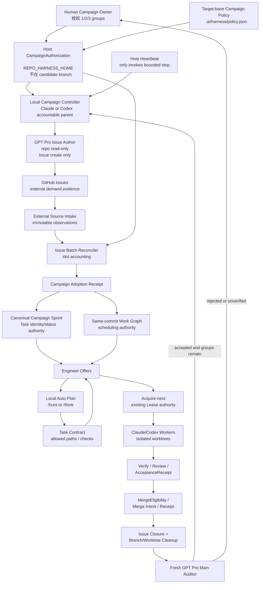

# 先定案：**Issue 由 GPT Pro 直接写**

在你补充“GPT Pro 对代码仓库只读，Issue 是它唯一可写入的 GitHub surface”之后，最合理的职责分配是：

```text
GPT Pro
  = 独立审计仓库
  = 独立提出 bugfix / refactor / test_gap
  = 直接创建 GitHub Issues
  ≠ 修改代码
  ≠ 创建分支或 PR
  ≠ 合并
  ≠ 关闭 Issue

本地 Claude / Codex
  = 独立观察 GitHub
  = 验证、采纳和物化 Issues
  = 本地规划、派工、实现和验证
  = 创建 PR、合并、关闭 Issue、清理分支
  ≠ 改写 GPT Pro 的 Issue 需求正文

新的 GPT Pro 会话
  = 对 exact final main SHA 做独立验收
  = 决定是否进入下一组
```

这样比“GPT Pro 出题、本地再代抄 Issue”更符合你的目标：你不用写，本地 Agent 也不替 GPT Pro 润色或筛选观点，Issue 保留真正独立的审计意见。

机械可靠性问题则通过 **slot 对账、局部补写、重复即停、local adoption receipt** 解决，而不是把写权限拿回本地。

另外，最终 main 验收应使用**全新 GPT Pro 会话**，不要延续出题会话。否则 GPT Pro 会同时担任出题者和判卷者，独立性明显下降。

---

# Sprint：GPT Pro–Seeded Bounded Repair Campaign

> **建议文件名**：`plans/sprints/20260902-gpt-pro-seeded-bounded-repair-campaign.sprint.md`
> **建议 Source PRD**：`plans/prds/20260902-gpt-pro-seeded-bounded-repair-campaign.prd.md`
> **Status**：Draft
> **Baseline**：`main@a2830db43f7fffbe0535f5b98674f6c4e5aa4f84`
> **Parent Design**：`plans/prds/20260828-2321-guarded-merge-unattended-automation.prd.md`
> **Goal Mode**：incremental
> **Default Feature State**：off
> **Default Campaign**：1 group × 10 Issues
> **Allowed Group Count**：1、2 或 3
> **Allowed Issue Kinds**：`bugfix | refactor | test_gap`
> **New Feature Route**：继续走 `PRD → Sprint → Plan`，不得进入本 Campaign

当前主线仍为 `a2830db43f7fffbe0535f5b98674f6c4e5aa4f84`。旧 `repo-harness-autoplan` 已明确退役；当前自动继续任务的公开路径是 root `repo-harness execute`，沿 Effective State 推进既有 `plan → contract → worktree → verify → ship` 流程。因此本方案不会复活旧 autoplan，也不会创建第二套执行引擎。

---

# 一、Sprint 决策摘要

## 1.1 Sprint 目标

实现一条有界、可恢复、可审计的 Repair Campaign：

```text
用户授权 1 / 2 / 3 组
→ 本地 Agent 请求 GPT Pro 审计 exact main
→ GPT Pro 直接创建本组 10 个 Issues
→ heartbeat 唤醒本地 Campaign Controller
→ 本地独立观察并对账 10 个 slot
→ Issues 被窄化采纳为 bugfix/refactor/test_gap Tasks
→ 本地 Agent 自动做 /hunt 或 /think 规划
→ 通过 prompt 启动并行 Worker
→ Worker 通过 Engineer Offer / Lease / WorkEnvelope 领任务
→ verify / review / PR
→ 低风险 PR 串行 guarded merge
→ 验证 exact main integration
→ 关闭 Issue
→ 删除远程分支、本地分支和 worktree
→ 新 GPT Pro 会话审计 exact final main
→ 通过则进入下一组
→ 达到用户指定组数后停止
```

## 1.2 一组的精确定义

一组不是“随便跑十个 Issue”，而是一个闭合的反馈波次：

```text
Group N
  = 一个 frozen base main SHA
  + 一个 GPT Pro issue-authoring session
  + 十个唯一 slot
  + 一批可并行但有依赖/并发控制的本地任务
  + 一组 merge/closure/cleanup receipts
  + 一个 frozen final main SHA
  + 一个全新的 GPT Pro main-audit session
```

生产 v1 固定：

```text
issues_per_group = 10
group_count      = 1 | 2 | 3
groups           = sequential
tasks in group   = parallel where authorities allow
```

Group 2 必须基于 Group 1 验收后的新 main 出题；不能在旧 main 上一次性生成 30 个 Issues。

---

# 二、产品边界

## 2.1 只处理三类需求

```ts
type RepairCampaignIssueKind =
  | 'bugfix'
  | 'refactor'
  | 'test_gap';
```

### `bugfix`

必须具备：

* 可证伪的故障或违反 invariant；
* Root Cause Evidence；
* regression guard；
* 修复后原行为或既有 contract 恢复。

### `refactor`

必须具备：

* 不引入新用户能力；
* 不改变公开行为或明确记录兼容性影响；
* Cutover Closure Evidence；
* 旧实现、旧 caller、旧 fallback、旧测试和旧文档有明确 disposition。

### `test_gap`

必须具备：

* 已存在行为或 invariant；
* 明确说明现有测试为何未覆盖；
* 不通过测试偷偷定义新产品行为；
* 测试必须能在旧实现或 mutation fixture 上失败。

## 2.2 明确拒绝的类型

以下任何一种进入 Campaign 都必须停止或转标准产品流程：

```text
feature
new capability
new user-visible workflow
new public API / CLI / MCP tool
new protocol authority
new database or task authority
destructive migration
authentication / authorization redesign
payment / credential surface
new provider integration
architecture ownership change
```

这类工作继续走：

```text
PRD
→ Sprint
→ decision-complete Plan
→ contract
→ implementation
```

## 2.3 Campaign 本身不能自动修改自己

以下路径或能力默认是 protected：

```text
development-campaign authority
Issue authoring protocol
CampaignAuthorization
budget authority
MergeEligibility / Merge Controller
AcceptanceReceipt validation
Lease / Claim authority
task identity derivation
Cutover Closure Gate
security / auth / credentials
branch protection / release policy
```

Campaign 找到这些地方的 bug 可以开 Issue、做调查和 Plan，但默认不能 auto-merge。必须进入 human attention。

---

# 三、P1 架构

## 3.1 架构图



## 3.2 权威分工

| Datum                           | 唯一权威                                                     | 不得成为权威                             |
| ------------------------------- | -------------------------------------------------------- | ---------------------------------- |
| 可运行几组、每组几项、允许什么风险               | Target-base Campaign Policy + Host CampaignAuthorization | GPT Pro prompt、Issue body          |
| GPT Pro 被要求创建哪些 slot            | Local `IssueBatchIntentV1`                               | GPT Pro 最终口头总结                     |
| Issue 内容                        | GitHub provider observation                              | 本地重写后的摘要                           |
| 哪些 Issue 被 Campaign 采纳          | `CampaignIssueBatchAdoptionReceiptV1`                    | 搜索结果数量                             |
| Task 身份与状态                      | Canonical Sprint                                         | GitHub Issue number、campaign store |
| priority、dependency、concurrency | Same-commit Work Graph                                   | Worker prompt                      |
| Plan 与 implementation scope     | Approved Plan + Task Contract                            | Issue body、GPT Pro advice          |
| 任务归属                            | Lease + ClaimActorReceipt + WorkEnvelope                 | “Worker A 负责 Issue #123”的 prompt   |
| 验证结果                            | checks + AcceptanceReceipt                               | GPT Pro 说“看起来通过”                   |
| 是否可自动合并                         | MergeEligibility + Host grant + exact provider facts     | PR label、Issue state               |
| 合并事实                            | Provider merge observation + exact main readback         | API 请求成功返回之前的推断                    |
| Issue 是否可关闭                     | Issue binding + integrated work outcome                  | Task self-report                   |
| 是否进入下一组                         | Fresh GPT Pro audit receipt + CampaignAuthorization      | 出题会话自己的自评                          |

## 3.3 GPT Pro 的精确权限

### Issue authoring session

允许：

* 通过 GitHub Connector 读取 exact pinned main；
* 搜索既有 Issues，避免明显重复；
* 创建本组尚缺的 slot；
* 在明确 repair 请求下编辑自己已创建的指定 Issue；
* 写完整标题、证据、问题、验收标准和建议验证。

禁止：

* 修改代码；
* 创建分支；
* 创建或更新 PR；
* merge；
* close Issue；
* 改 label、milestone、assignee；
* 创建未授权 slot；
* 在 audit session 中擅自创建下一组 Issues。

### Main audit session

允许：

* 读取 exact final main SHA；
* 读取本组 Issues、PR、merge commits；
* 返回结构化验收结果。

禁止：

* 创建任何 Issue；
* 修改已有 Issue；
* 直接 reopen；
* merge或回滚；
* 将 follow-up 自动扩展成 Group 4。

---

# 四、P2 完整数据流

## 4.1 Campaign 授权

用户一句明确指令即可成为授权源，例如：

```text
启动一个 Repair Campaign：
1 组，每组 10 个 Issue，
只接受 bugfix、refactor、test_gap，
最多并行 2 个任务，
低风险自动合并，
完成后让新的 GPT Pro 会话验收 main。
```

本地 Agent将其冻结为 Host-owned authorization：

```ts
interface DevelopmentCampaignAuthorizationV1 {
  protocol: 1;
  kind: 'repo-harness-development-campaign-authorization';

  campaign_id: string;
  repository_id: string;
  target_ref: string;
  initial_target_revision: string;

  group_count: 1 | 2 | 3;
  issues_per_group: 10;

  allowed_issue_kinds: readonly [
    'bugfix',
    'refactor',
    'test_gap'
  ];

  max_parallel_tasks: 1 | 2 | 3;

  issue_author: 'gpt_pro';
  local_parent_host: 'claude' | 'codex';
  allowed_worker_hosts: readonly ('claude' | 'codex')[];

  execution_approval:
    | 'campaign_preapproved_low_risk'
    | 'per_plan';

  merge_mode:
    | 'manual'
    | 'auto_low_risk';

  require_fresh_main_audit: true;

  budget: CampaignBudgetLimitV1;
  stop_on: readonly CampaignStopCondition[];

  issued_by: string;
  issued_at: string;
  expires_at: string;
  authorization_sha256: string;
}
```

授权存放于：

```text
$REPO_HARNESS_HOME/authorizations/
  development-campaigns/<campaign-id>/authorization.json
```

Candidate branch不能修改或放宽它。

目标仓库中的 `.ai/harness/policy.json` 只定义 maximum。当前 repo 的 `agent_runtime`、`external_sources` 等新 mutation surface 默认均为关闭状态；Campaign 同样必须默认 `off`。

---

## 4.2 Group 准备

Controller读取并冻结：

```text
repository
target_ref
base_main_sha
group_number
10 个 slot
allowed kinds
authoring policy revision
prompt hash
```

生成：

```ts
interface IssueBatchIntentV1 {
  protocol: 1;
  kind: 'repo-harness-issue-batch-intent';

  campaign_id: string;
  group_number: number;
  repository_id: string;

  base_main_sha: string;
  slots: readonly [
    '01', '02', '03', '04', '05',
    '06', '07', '08', '09', '10'
  ];

  allowed_issue_kinds:
    readonly RepairCampaignIssueKind[];

  prompt_sha256: string;
  authoring_policy_sha256: string;

  authoring_parent: 'claude' | 'codex';
  gpt_pro_transport:
    | 'codex_iab'
    | 'oracle_browser';

  created_at: string;
  expires_at: string;
  intent_sha256: string;
}
```

必须先持久化 Intent，再打开 GPT Pro。

---

## 4.3 GPT Pro 创建 Issue

每个 Issue标题建议：

```text
[rh-campaign:<campaign-id>:g01:s01][bugfix] <title>
```

正文必须包含短 marker：

```html
<!-- repo-harness-campaign:v1
campaign_id=<campaign-id>
group=1
slot=01
-->
```

**marker 不包含 SHA 或 digest。**

精确值全部留在本地 Intent 和 Adoption Receipt，避免 GPT Pro 复制 40/64 位 hash 时出错。

正文另包含 strict metadata：

```json
{
  "protocol": 1,
  "kind": "repo-harness-campaign-issue-metadata",
  "issue_kind": "bugfix",
  "primary_capability": "capability.runtime-harness.example",
  "priority": 90,
  "depends_on_slots": [],
  "suspected_paths": [
    "src/example.ts",
    "tests/example.test.ts"
  ]
}
```

以及固定章节：

```text
Audit baseline
Finding
Repository evidence
Failure / debt mechanism
Required change
Non-goals
Acceptance criteria
Suggested verification
```

`primary_capability`、`priority`、`depends_on_slots` 和 `suspected_paths` 是 proposal metadata；只有被本地 adoption并写进 Work Graph后，才成为调度输入。

---

## 4.4 Heartbeat 观察

现有 `heartbeat-triage` 明确只记录发现，不批准、不执行、不 spawn、不建 PR，也不安装持久 scheduler。因此不得把现有 triage runner改成写入控制器。

新增独立命令：

```text
repo-harness campaign step \
  --campaign-id <id> \
  --source heartbeat \
  --once \
  --json
```

Host heartbeat只负责调用一次 bounded step：

```text
heartbeat
→ acquire campaign lock
→ read current
→ revalidate authorization
→ perform at most one external mutation
→ append step receipt
→ publish current projection
→ release lock
```

Heartbeat不是权限来源。

---

## 4.5 Slot 对账

本地通过 GitHub／External Source Intake独立读取 Issue，不相信 GPT Pro 自报“已创建 10 个”。

对每个 `(campaign_id, group, slot)`：

### 恰好一个合法 Issue

```text
slot = complete
```

### 没有 Issue

```text
slot = missing
```

Controller继续同一个 authoring session，只请求补缺：

```text
请只创建 Group 1 缺失的 slots 08、09、10。
不要修改 01–07，也不要创建其他 Issue。
```

### 一个 slot 对应两个或更多 Issue

```text
issue_batch_ambiguous
→ fail closed
→ human attention
```

不得自动关闭“看起来较差”的那个。

### metadata非法

```text
slot_invalid
```

最多允许一次指定 Issue edit repair：

```text
请只编辑 Issue #N 的 Campaign metadata；
不要创建新 Issue。
```

如果 GPT Pro错误地新建另一个同 slot Issue，就进入 ambiguous。

### Partial authoring

例如创建到第七个浏览器中断：

```text
7 complete
3 missing
→ persist observation
→ bounded follow-up for 3 missing
```

不会重新要求“再创建 10 个”。

---

## 4.6 Batch adoption

只有以下全部成立，才可采纳：

* 10 个 slot全部存在；
* 每 slot恰好一个 Issue；
* Issue仍 open；
* marker与group一致；
* metadata exact-key合法；
* `issue_kind` 属于闭合词汇；
* capability ID可解析；
* dependency slots只引用本组；
* dependency graph无环；
* priority合法；
* suspected paths为安全 repo-relative hints；
* Issue provider observations完整；
* GPT Pro authoring session完成且绑定目标 repo；
* authoring时 pinned main没有被悄悄替换；
* CampaignAuthorization仍当前。

生成：

```ts
interface CampaignIssueBatchAdoptionReceiptV1 {
  protocol: 1;
  kind: 'repo-harness-campaign-issue-batch-adoption';

  campaign_id: string;
  group_number: number;
  base_main_sha: string;

  issue_batch_intent_sha256: string;
  authorization_sha256: string;
  authoring_session_ref: string;
  connector_evidence:
    | 'verified'
    | 'bundle_only'
    | 'unverified';

  issues: readonly CampaignIssueAdoptionV1[];
  dependency_graph_sha256: string;

  adopted_at: string;
  receipt_sha256: string;
}
```

每个 issue item绑定：

```ts
interface CampaignIssueAdoptionV1 {
  slot: string;
  provider_issue_id: string;
  issue_number: number;

  source_observation_sha256: string;
  title_sha256: string;
  body_sha256: string;

  issue_kind: RepairCampaignIssueKind;
  primary_capability: string;
  priority: number;
  depends_on_slots: readonly string[];
  suspected_paths: readonly string[];
}
```

GPT Pro Connector 使用必须按可观察证据分类；当前 orchestrate contract也要求 remote SHA、prompt、conversation和 Connector invocation分别绑定，不能把模型口头陈述当作 proof。

---

## 4.7 物化为 canonical Sprint 与 Work Graph

每组生成一个 tracked Sprint：

```text
plans/sprints/
  <stamp>-<campaign-id>-group-01.sprint.md
  <stamp>-<campaign-id>-group-01.work-graph.v1.json
  <stamp>-<campaign-id>-group-01.issue-batch.v1.json
```

Issue manifest、Sprint和Work Graph作为一个 materialization commit进入 main。

每个 slot投影为：

```text
Task:
  [G01/S01] <exact Issue title>

Mode:
  contract

Acceptance:
  satisfy adopted Issue #N at exact source observation digest

Plan:
  initially absent / planning_required
```

Work Package：

```ts
{
  "work_package_id": "g01-s01",
  "task_ref": "[G01/S01] ...",
  "primary_capability": "capability.runtime-harness.example",
  "depends_on": [
    {
      "repository_id": "repo_...",
      "work_package_id": "g01-s00",
      "required_state": "canonical_done"
    }
  ],
  "priority": 90,
  "concurrency": {
    "scope": "repo",
    "key": "capability:runtime-harness.example"
  },
  "execution_surface": "contract",
  "integration_group": "<campaign-id>-g01",
  "required_acceptance": [...],
  "rollback_boundary": {...}
}
```

v1只让 Campaign-generated dependency使用：

```text
canonical_done
```

不会等待完整实现 `module_accepted`、`publication_integrated`、`product_accepted`。现有 Work Graph虽声明这四类状态，但当前默认 resolver只真正处理 `canonical_done`；其余仍会成为 `authority_unavailable`。

---

## 4.8 Local Auto-Plan

现有 Task Offer已经能表达：

```text
planning_required
execution_ready
inline_ready
unsupported
```

Contract-mode Task缺少合法 plan/contract proof时，会进入 `planning_required`，这就是 Campaign planning触发信号。

### `bugfix`

本地 parent执行：

```text
/hunt
→ reproduce or falsify
→ root cause sentence
→ Root Cause Evidence
→ regression guard
→ decision-complete Plan
```

### `refactor`

本地 parent执行：

```text
/think
→ P1/P2/P3
→ current/target authority
→ cutover inventory
→ Cutover Closure Contract
→ Plan
```

### `test_gap`

本地 parent执行：

```text
characterize current behavior
→ prove test is missing
→ mutation/old-code falsifier
→ test-only or bounded support plan
```

## 为什么 Plan 不再交给 GPT Pro

GPT Pro已经是：

* Issue proposer；
* final main auditor。

若又由 GPT Pro负责每项 Plan，就会成为：

```text
提出问题
→ 设计方案
→ 最后验收自己的方案
```

独立性反而下降。

所以职责应是：

```text
GPT Pro：独立找问题
Local Claude/Codex：验证问题、规划和实现
Fresh GPT Pro：独立审计结果
```

---

## 4.9 Campaign 自动批准 Plan

当 `execution_approval=campaign_preapproved_low_risk` 时，不需要每个 Plan再问用户。

但必须满足：

* Issue kind合法；
* 本地复现或 refactor evidence成立；
* Plan只有一个 rollback boundary；
* allowed paths有界；
* 不涉及 protected path/capability；
* 不新增 command、MCP tool、public export、protocol kind、capability node；
* 不涉及 migration；
* bugfix有 Root Cause Evidence；
* refactor有 Cutover Closure；
* verification boundary完整；
* target main和Issue observation均未漂移。

否则：

```text
human_attention_required
```

本地不在 intake阶段重新解释 GPT Pro 的 `kind`，但会根据真实 Plan、路径和diff执行 deterministic risk floor。

---

## 4.10 并行派工

Campaign Controller生成的是 dispatch prompt，不是任务 ownership。

示例：

```text
本组最多并行启动 2 个 Worker。

每个 Worker必须：
1. 读取自己的 current Engineer Offers；
2. 调用 acquire-next 或 exact acquire；
3. 只接受返回的 WorkEnvelope；
4. 只在其 worktree和contract allowed_paths内修改；
5. 完成 verify/review/publication后返回 receipts；
6. 无 eligible offer时正常退出；
7. 不得按 Issue number或prompt自行宣称任务归属。
```

真正的任务归属仍由：

```text
Engineer Offer
→ Lease election
→ Claim
→ fresh worktree
→ bind
→ ClaimActorReceipt
→ WorkEnvelope
```

决定。当前 acquire链已经具备 revision revalidation、Claim、fresh worktree、Lease bind、claim token、plan projection和最终 readback。

组内并行规则：

```text
不同 concurrency key
  → 可并行

相同 capability concurrency key
  → 串行

有 depends_on
  → dependency canonical_done 后才可领取

同一 Task
  → 永远只有一个 current Lease owner
```

---

## 4.11 验证与 PR

每个 work item必须经过：

```text
implementation
→ verify-contract
→ check-task-workflow
→ Cutover Closure（refactor）
→ semantic review
→ AcceptanceReceipt
→ repo-harness-ship
→ PR
```

GPT Pro Issue不是 acceptance authority。

---

## 4.12 串行 Guarded Merge

Worker可以并行，但 merge必须串行。

每次 merge前：

1. 重算当前 MergeEligibility；
2. 检查 exact PR head；
3. 检查 current main；
4. 检查 required CI；
5. 检查 reviews和unresolved feedback；
6. 检查 AcceptanceReceipt；
7. 检查 risk tier；
8. 检查 Host CampaignAuthorization；
9. 检查 budget；
10. 持久化 MergeIntent；
11. 再读一次 provider facts；
12. submit merge；
13. read back merged SHA；
14. 写 MergeReceipt。

这直接复用仓库已有的 Guarded Auto-Merge设计：target-base maximum、Host ProgramAuthorization、budget、provider capability、persist-before-effect以及 uncertain-outcome reconciliation，而不是另建简化版 merge按钮。

### main 已被前一个 PR 推进

```text
non-overlapping target movement
→ 重新生成 current local seal
→ 保留原 semantic Acceptance
→ merge

overlapping target movement
→ old Acceptance stale
→ 返回 repair / reverify
→ 不 blind rebase
```

### merge请求超时

```text
provider outcome unknown
→ reconciliation_required
→ 先读 GitHub PR和main
→ 确认未merge才允许重试
```

---

## 4.13 Issue 关闭

Issue关闭必须晚于 merge和main readback。

```text
PR merged
→ merge commit可从current main到达
→ bound Task完成
→ Acceptance仍current
→ Issue body revision未漂移
→ 所有关联Work Packages完成
→ 写IssueCloseIntent
→ 添加closure comment
→ close issue
→ read back closed state
→ IssueClosureReceipt
```

### 成功修复

GitHub state reason：

```text
completed
```

### 本地验证证明 Issue 不成立

例如 bug无法复现且有明确 falsifier：

```text
not_planned
```

Closure comment必须记录：

* campaign/group/slot；
* base main；
* exact Issue observation；
* disposition；
* evidence或merge SHA；
* 本地验收结果。

不能为了凑十个而实现一个不存在的 bug。

---

## 4.14 Branch 和 worktree 清理

安全顺序：

```text
merge
→ verify exact main
→ close Issue
→ delete remote branch
→ remove local worktree
→ delete local branch
→ persist CleanupReceipt
```

Cleanup Receipt绑定：

```ts
interface CampaignCleanupReceiptV1 {
  protocol: 1;
  kind: 'repo-harness-campaign-cleanup-receipt';

  campaign_id: string;
  group_number: number;
  slot: string;

  task_id: string;
  claim_id: string;

  pr_number: number;
  pr_head_sha: string;
  merge_commit_sha: string;
  observed_main_sha: string;

  remote_branch: string;
  remote_branch_deleted: boolean;

  local_worktree: string;
  local_worktree_removed: boolean;

  local_branch: string;
  local_branch_deleted: boolean;

  dirty_paths_before_cleanup: readonly string[];

  completed_at: string;
  receipt_sha256: string;
}
```

如果 worktree 有未提交内容：

```text
cleanup_blocked_dirty_worktree
```

不得强删。

如果 merge成功但cleanup失败：

```text
group state = cleanup_pending
```

代码不回滚，但默认不进入下一组。

---

## 4.15 Fresh GPT Pro Main Audit

本组所有 slots终结、Issues关闭、分支清理后：

```text
freeze final_main_sha
→ open a brand-new GPT Pro conversation
→ provide campaign/group manifest
→ require Connector read of exact final_main_sha
→ audit current code and closed issues
```

输出：

```ts
type MainAuditDisposition =
  | 'accepted'
  | 'accepted_with_followups'
  | 'rejected'
  | 'unverified';
```

结构：

```ts
interface CampaignMainAuditV1 {
  protocol: 1;
  kind: 'repo-harness-campaign-main-audit';

  campaign_id: string;
  group_number: number;

  expected_main_sha: string;
  observed_main_sha: string;

  reviewed_issue_numbers: readonly number[];
  reviewed_pr_numbers: readonly number[];

  disposition: MainAuditDisposition;
  findings: readonly MainAuditFindingV1[];

  audit_session_ref: string;
  connector_evidence:
    | 'verified'
    | 'bundle_only'
    | 'unverified';

  raw_answer_sha256: string;
}
```

Local生成 receipt时必须验证：

```text
observed_main_sha == expected_main_sha
connector_evidence == verified
fresh conversation == true
all 10 slots accounted for
```

### `accepted`

* 有下一组：开始 Group N+1；
* 无下一组：Campaign completed。

### `accepted_with_followups`

* 有下一组：follow-ups只作为下一组 authoring brief输入；
* 无下一组：Campaign `completed_with_followups`；
* 不允许自动创建 Group 4。

### `rejected`

```text
campaign blocked
→ 不启动下一组
→ 不自动rollback main
→ 保留findings
→ 请求用户决定repair campaign
```

### `unverified`

```text
audit无效
→ 不启动下一组
→ 允许在预算内重新执行fresh audit
```

---

# 五、P3 设计取舍

## 5.1 为什么由 GPT Pro 创建 Issues

选择 GPT Pro直接写，而不是本地代写，原因是：

1. **真正独立**
   本地 Agent不会在写入前删掉自己不喜欢的问题，或将问题改写成更容易实现的版本。

2. **权限边界干净**
   GPT Pro对代码只读，Issue是 proposal surface；即使判断错误，也不能直接修改实现。

3. **用户不需要写需求**
   这是这个 Campaign存在的核心产品价值。

4. **本地仍独立验真**
   GPT Pro创建成功并不自动触发代码；本地仍要观察、采纳、复现和规划。

机械缺点则由 slot protocol承担，不是架构否决理由。

## 5.2 为什么不用本地先生成 Issues再让 GPT Pro review

那会变成：

```text
本地系统决定问题
→ GPT Pro只是润色/背书
```

不符合你要的独立外部审计。

## 5.3 为什么最终验收用新会话

同一会话会带有：

* 它自己选择问题时的解释；
* 它对自己结论的承诺；
* 可能的 confirmation bias；
* 大量不再相关的旧 main上下文。

Fresh session只获得：

* exact final main SHA；
* exact Issue/PR list；
* group outcome；
* acceptance rubric。

更接近独立复核。

## 5.4 为什么不复活 autoplan

旧 autoplan已退役；当前 root execute已拥有唯一 lifecycle route。新 Campaign只负责：

```text
external demand
→ bounded adoption
→ route existing planning/execution
→ closeout
```

它不重新实现 plan、contract、worktree、verify或ship。

## 5.5 为什么不用现有 heartbeat-triage直接执行

现有 heartbeat-triage的安全 contract就是只读 discovery。如果把它变成执行器，会静默扩大一个已有命令的权限。

所以：

```text
heartbeat-triage
  = 只读诊断，保持不变

campaign step
  = 受HostAuthorization约束的有界状态转换
```

## 5.6 为什么每组必须等 final main audit

否则两三组会退化为：

```text
在旧main上一次生成20/30个问题
```

第一组完成后，后续问题可能：

* 已被顺带修复；
* 路径漂移；
* 根因改变；
* 变成重复；
* 与新架构冲突。

顺序 group让 GPT Pro每次审计最新系统。

---

# 六、核心 invariants

1. GPT Pro Issue不是 Task、Lease、Plan或执行权限。
2. CampaignAuthorization只允许1–3组，每组固定10项。
3. Issue authoring必须在 frozen base main上进行。
4. 只有 `bugfix|refactor|test_gap` 可被采纳。
5. 一个 `(campaign, group, slot)` 必须对应恰好一个 Issue。
6. 缺 slot可补；重复 slot必须停。
7. 本地不改写 GPT Pro Issue正文。
8. Issue body是 untrusted external content。
9. Task身份仍来自 canonical Sprint。
10. Work Graph仍是priority/dependency/concurrency authority。
11. Worker prompt不构成任务ownership。
12. Lease和WorkEnvelope是唯一领取权限。
13. bugfix无Root Cause Evidence不得实施。
14. refactor无Cutover Closure Evidence不得auto-merge。
15. feature/public protocol/security/migration不得进入低风险自动执行。
16. 一个controller step最多做一个外部mutation。
17. 所有provider effect均persist intent first。
18. uncertain provider result必须reconcile，不能直接重试。
19. Worker可以并行；merge必须串行。
20. Issue只在exact main integration后关闭。
21. remote/local branch删除必须绑定exact merged work item。
22. Fresh GPT Pro audit只决定是否进入下一组，不替代AcceptanceReceipt。
23. 达到用户授权group count后必须停止。
24. Candidate branch不能修改允许自己auto-merge的maximum policy。
25. Campaign自身、merge authority和acceptance authority永远是protected surface。

---

# 七、状态机

## 7.1 Campaign 状态

```text
created
→ authorized
→ group_preparing
→ group_running
→ group_auditing
→ group_accepted
   ├→ group_preparing       # next group
   └→ completed             # no groups remain

Any state
→ stopped
→ budget_exhausted
→ human_attention_required
→ reconciliation_required
→ authorization_expired
```

## 7.2 Group 状态

```text
prepared
→ issue_authoring_requested
→ awaiting_issue_batch
→ issue_batch_complete
→ adoption_ready
→ materializing
→ planning
→ executing
→ verifying
→ publishing
→ integrating
→ closing_issues
→ cleaning
→ main_audit_requested
→ main_audit_observed
→ accepted
```

异常：

```text
issue_batch_incomplete
issue_batch_ambiguous
source_main_stale
planning_blocked
execution_blocked
cleanup_pending
main_audit_rejected
main_audit_unverified
```

## 7.3 Work item 状态

```text
observed
→ adopted
→ materialized
→ planning_required
→ plan_approved
→ offered
→ claimed
→ executing
→ verifying
→ accepted
→ published
→ merged
→ issue_closed
→ cleaned
→ complete
```

替代终点：

```text
not_reproducible
→ reviewed
→ issue_closed_not_planned
→ complete

out_of_campaign_scope
→ human_attention_required
```

---

# 八、Feature Policy

建议扩展 `.ai/harness/policy.json`：

```json
{
  "development_campaign": {
    "mode": "off",
    "allowed_issue_kinds": [
      "bugfix",
      "refactor",
      "test_gap"
    ],
    "issues_per_group": 10,
    "maximum_groups": 3,
    "maximum_parallel_tasks": 3,
    "issue_author": "gpt_pro",
    "require_fresh_main_audit": true,
    "protected_capabilities": [
      "development-campaign",
      "acceptance",
      "coordination",
      "merge-controller",
      "security"
    ],
    "merge": {
      "mode": "disabled",
      "allowed_risk_tiers": ["low"],
      "method": "squash",
      "require_current_acceptance": true,
      "require_exact_main_readback": true
    }
  }
}
```

模式：

### `off`

* 禁止创建 Campaign；
* 禁止 issue authoring intent；
* 现有 runtime evidence只读。

### `shadow`

允许：

* GPT Pro创建10个 Issues；
* heartbeat观察和slot对账；
* adoption dry-run；
* local auto-plan dry-run。

禁止：

* Sprint materialization；
* Claim；
* code execution；
* PR；
* merge；
* close Issue。

### `active`

允许：

* materialization；
* local planning；
* Worker执行；
* PR；
* 是否auto-merge仍由独立 merge policy和Host grant决定。

---

# 九、Sprint 依赖图

```text
BRC0 Authority freeze
├─→ BRC1 Dispatch fence
├─→ BRC2 Cutover Closure Gate
└─→ BRC3 Campaign protocol / policy / store

BRC3 → BRC4 GPT Pro issue authoring
BRC4 → BRC5 GitHub slot observation / reconciliation
BRC5 → BRC6 Adoption + Sprint/WorkGraph materialization
BRC6 → BRC7 Local auto-plan + promotion guard

BRC1 + BRC7 → BRC8 Acquire-next + parallel worker controller

BRC3 → BRC9 Budget + attempt/retry evidence
BRC8 + BRC9 → BRC10 Lease liveness / controller recovery

BRC2 + BRC8 + BRC9 + BRC10
→ BRC11 MergeEligibility

BRC11 → BRC12 Provider merge effect / reconciliation
BRC12 → BRC13 Issue closure + branch/worktree cleanup

BRC4 + BRC5 + BRC13
→ BRC14 Fresh GPT main audit + multi-group sequencing

All → BRC15 canary / rollout / activation
```

## 允许并行

* BRC1、BRC2、BRC3 在 BRC0 后可并行；
* BRC4 与 BRC9 在 BRC3 后可并行；
* BRC11 read-side设计可在BRC10后半段并行准备；
* 文档/Operator projection可在schema冻结后并行。

## 禁止并行

* 两个WP同时改 Campaign core protocol；
* Issue batch parser尚未冻结时写materializer；
* Lease liveness与Lease schema改动由两个分支同时进行；
* MergeEligibility和provider merge effect在同一个未冻结协议上并行；
* Candidate branch修改自己的auto-merge maximum；
* Campaign controller自身通过Campaign自动合并。

---

# 十、Backlog

|  # | ID    | Task                                                             | Mode     | 关键验收                                                 |
| -: | ----- | ---------------------------------------------------------------- | -------- | ---------------------------------------------------- |
|  1 | BRC0  | Authority freeze and baseline characterization                   | contract | 固定Issue/Task/Plan/Lease/Merge/GPT权限矩阵；现有行为零变化        |
|  2 | BRC1  | Move collaboration dispatch fence into effect boundary           | contract | 非CLI caller无法绕过fence；CLI和canary只执行一次                 |
|  3 | BRC2  | Ship Cutover Closure Gate for refactor campaigns                 | contract | 旧实现/caller/fallback/comment/test/doc/projection有机器证据 |
|  4 | BRC3  | Campaign protocol, target policy, Host authorization and journal | contract | exact-key schema、append-only state、CAS、默认off         |
|  5 | BRC4  | GPT Pro Issue Batch authoring lane                               | contract | persist-first、10 slot、Issue-only权限、无local gh create  |
|  6 | BRC5  | Heartbeat observation and slot reconciliation                    | contract | 7/10恢复、缺slot补写、重复slot停、source drift                  |
|  7 | BRC6  | Campaign adoption and atomic Sprint/WorkGraph materialization    | contract | 10项exact adoption；一commit物化；无Issue直达Task             |
|  8 | BRC7  | Local auto-plan and feature-promotion guard                      | contract | bugfix `/hunt`、refactor closure、feature转标准流程         |
|  9 | BRC8  | Acquire-next and bounded parallel worker control                 | contract | canonical排序、idempotency、并发Claim安全                    |
| 10 | BRC9  | Campaign budget, attempt receipts, retry/backoff                 | contract | 无无限重试/成本；crash后reconcile                             |
| 11 | BRC10 | Renewable Lease liveness and controller recovery                 | contract | 不以超时/PID单独抢Lease；generation-fenced reclaim           |
| 12 | BRC11 | Read-only MergeEligibility and provider capability               | contract | exact current gates；protected/high risk永不auto-ready  |
| 13 | BRC12 | Persist-first merge effect and uncertain-outcome reconciliation  | contract | zero duplicate merge；exact merged SHA                |
| 14 | BRC13 | Issue closure and exact branch/worktree cleanup                  | contract | merge后才close；dirty worktree不删；cleanup receipts       |
| 15 | BRC14 | Fresh GPT Pro main audit and 1/2/3 group sequencing              | contract | fresh session；exact SHA；rejected/unverified不进入下一组    |
| 16 | BRC15 | Shadow/manual/auto canaries and activation                       | contract | 模型free、真实GPT、真实GitHub、真实并发、真实merge证明                 |

---

# 十一、各 Work Package 详细设计

## BRC0 — Authority Freeze

### Purpose

在写状态机前固定所有现有 authority，防止 Campaign变成第二个 Task Board或scheduler。

### 主要文件

```text
plans/prds/20260902-gpt-pro-seeded-bounded-repair-campaign.prd.md
plans/sprints/20260902-gpt-pro-seeded-bounded-repair-campaign.sprint.md
docs/architecture/requests/...
docs/researches/20260902-bounded-repair-campaign-authority-freeze.md
tests/characterization/...
```

### Tasks

* 记录 exact baseline；
* 绘制 Issue→Task→Plan→Lease→PR→Merge data flow；
* 固定GPT Pro/local Agent权限表；
* 证明 heartbeat-triage仍只读；
* 证明旧 autoplan已退役；
* 证明 External Source binding不创建Task；
* 证明Campaign capability默认不存在／off；
* 冻结provider partial-success fixtures；
* 冻结protected capabilities。

### Acceptance

* 源码行为零变化；
* Task、Lease、Acceptance、Publication bytes无变化；
* architecture request完整；
* 负面fixtures能证明Issue不是Task、prompt不是Claim。

---

## BRC1 — Dispatch Fence

对应现有 [#278](https://github.com/Ancienttwo/repo-harness/issues/278)。

### Purpose

非CLI Campaign controller将成为 `dispatchDelegatedRun()` 的第二个 production caller，因此 collaboration fence必须进入effect boundary。

### Acceptance

* 直接effect call缺binding时，在host action前失败；
* `delegation_only`行为不变；
* stale binding拒绝；
* CLI、C9和Campaign路径只执行一次fence；
* raw unfenced entrypoint不再被外部模块调用；
* ArchContext同步。

---

## BRC2 — Cutover Closure Gate

### Purpose

Campaign主要处理重构。如果没有旧实现收口证据，自动化只会更快累积技术债。

### 主要边界

```text
scripts/cutover-closure.ts
assets/workflow-contract.v1.json#cutoverClosure
verify-contract consumer
verify-sprint evidence binding
check-task-workflow schema/drift checks
```

### Acceptance

* active task必须显式profile；
* refactor Campaign task必须有closure block；
* base SHA frozen inventory；
* remove/replace/retain_live/retain_migration闭合；
* caller、comments、docs、tests、package exposure、projection drift有证据；
* compatibility必须有owner/deadline/removal trigger/tests；
* report绑定final subject；
* AcceptanceReceipt变化后旧证据失效。

---

## BRC3 — Campaign Core

### 主要文件

```text
src/core/automation/development-campaign.ts
src/effects/automation/development-campaign-store.ts
src/effects/automation/development-campaign-policy.ts
src/cli/commands/campaign.ts
tests/unit/development-campaign.test.ts
tests/effects/development-campaign-store.test.ts
```

### Store

```text
<git-common-dir>/repo-harness/development-campaigns/v1/
  <campaign-id>/
    events/
    current.json
    groups/
      0001/
      0002/
      0003/
    locks/
```

### Commands

```text
repo-harness campaign start
repo-harness campaign step
repo-harness campaign status
repo-harness campaign stop
repo-harness campaign reconcile
```

### Acceptance

* exact-key canonical protocol；
* append-only event chain；
* current projection可重建；
* cross-process lock；
* same-key replay idempotent；
* conflicting replay拒绝；
* candidate branch不能放宽policy；
* `off`时所有mutation失败。

---

## BRC4 — GPT Pro Issue Authoring

### 主要文件

```text
src/core/automation/issue-batch.ts
src/effects/automation/gpt-pro-issue-authoring.ts
assets/skills/repo-harness-chatgpt/references/campaign-issues.md
docs/reference-configs/...
tests/unit/issue-batch.test.ts
tests/effects/gpt-pro-issue-authoring.test.ts
```

### Required behavior

* persist IssueBatchIntent before browser；
* exact repo/ref/SHA；
* prompt secret scan；
* exactly 10 slots；
* GPT Pro直接调用GitHub Issue create；
* 不提供local issue-create fallback；
* authoring session可用于补缺和指定edit；
* browser timeout后不推断成功；
* local观察后才改变batch state。

### Acceptance

* Fake provider在第7项中断；
* controller观察7项；
* follow-up只补3项；
* 最终10项无重复；
* 本地从未调用issue create；
* GPT Pro创建第11项时，第11项不被采纳；
* wrong campaign/group issue被忽略；
* session unverified不能adopt。

---

## BRC5 — Slot Observation

### 主要文件

```text
src/core/automation/issue-batch-reconcile.ts
src/effects/automation/issue-batch-observer.ts
src/core/external-sources/...
src/effects/external-sources/...
tests/effects/issue-batch-observer.test.ts
```

### Acceptance matrix

| 情况                                  | 结果                           |
| ----------------------------------- | ---------------------------- |
| 10 unique valid                     | `complete`                   |
| 7 valid、3 missing                   | `incomplete` + missing slots |
| same slot ×2                        | `ambiguous`                  |
| invalid kind                        | `invalid`                    |
| malformed marker                    | 不采纳                          |
| issue body edited after observation | source drift                 |
| provider unavailable                | unavailable，不当empty          |
| pagination incomplete               | incomplete，不当complete        |
| main moved beforeadoption           | stale                        |

---

## BRC6 — Adoption and Materialization

### Purpose

提供窄化的 bugfix/refactor Campaign adoption，不建设通用 feature WorkDemand平台。

### 主要文件

```text
src/core/automation/campaign-adoption.ts
src/effects/automation/campaign-materialization.ts
src/effects/git/... transaction helper
src/core/engineers/scheduling.ts integration
tests/effects/campaign-materialization.test.ts
```

### Acceptance

* 10项才可物化；
* campaign grant替代逐Issue批准；
* unsupported kind拒绝；
* Sprint、Work Graph、issue manifest同一Git transaction；
* crash不能留下只更新一半；
* replay不重复新增rows；
* dependency DAG准确；
* capability concurrency准确；
* materialization本身不Claim、不建WorkEnvelope；
* canonical main收到materialization commit后才出现Offers。

---

## BRC7 — Local Auto-Plan

### 主要文件

```text
src/core/automation/campaign-planning.ts
src/effects/automation/campaign-planning.ts
src/effects/automation/campaign-promotion-guard.ts
src/cli/commands/campaign.ts
tests/unit/campaign-planning.test.ts
tests/effects/campaign-promotion-guard.test.ts
```

### Closed planning outcomes

```text
plan_ready
not_reproducible
feature_route_required
human_attention_required
source_stale
planning_failed
```

### Acceptance

* bugfix无Root Cause Evidence不能plan_ready；
* refactor无Cutover Closure不能plan_ready；
* test_gap无法证明old test gap时不能plan_ready；
* 新MCP/CLI/protocol/capability被feature guard拦截；
* protected path拦截；
* plan绑定exact Issue observation和Task revision；
* Issue edited后旧Plan stale；
* local parent唯一；
* GPT Pro不参与per-Issue Plan authority。

---

## BRC8 — Acquire-next and Worker Pool

对应 [#280](https://github.com/Ancienttwo/repo-harness/issues/280) 的核心部分。

### Required effect

```ts
acquireNextScheduledEngineerTask({
  repo_root,
  principal,
  idempotency_key,
  closed_filters,
  max_selection_attempts
})
```

### Acceptance

* 只使用canonical EngineerOffers排序；
* 无第二套scoring；
* internally构造full assertion；
* stale offer bounded reread；
* same idempotency key返回同一acquisition；
* two-process race不重复claim；
* same concurrency key不并行；
* max_parallel_tasks严格执行；
* Worker只消费真实WorkEnvelope。

---

## BRC9 — Budget and Attempts

合并现有 #282、#287 的Campaign必要子集。

### Required limits

```text
campaign wall-clock deadline
controller step count
GPT authoring rounds
successful acquisitions
provider/runner invocations
per-task repair cycles
consecutive no-progress steps
consecutive transient failures
```

### Required attempt outcomes

```text
completed
not_reproducible
user_blocked
external_blocked
transient_failure
permanent_failure
lease_lost
cancelled
reconciliation_required
```

### Acceptance

* 每个side effect前先reserve；
* crash after reservation阻止二次消费；
* same-key不double charge；
* max retry后`retry_exhausted`；
* user/permanent blocker不自动retry；
* deterministic backoff；
* budget耗尽在下一次claim/dispatch前停止；
* 无可验证token usage时不能声称执行token hard limit。

---

## BRC10 — Lease Liveness

对应 [#286](https://github.com/Ancienttwo/repo-harness/issues/286)。

### Acceptance

* current owner可generation-fenced renew；
* old generation不能续期；
* expiry本身不等于dead；
* active provider effect保护Lease；
* completing/reviewing保护；
* liveness unknown只产生attention；
* evidence-gated reclaim使用现有steal路径；
* 两个reclaimer只有一个成功；
* controller crash可恢复但不制造双owner。

---

## BRC11 — MergeEligibility

### P0 只读

```text
Publication / Acceptance / Checks / Reviews
+ exact target-base Campaign policy
+ Host CampaignAuthorization
+ provider capability
+ budget
+ risk tier
→ MergeEligibilityV1
```

### Acceptance

* read-only；
* stable blocker order；
* unknown不等于available；
* user waiver阻止auto-ready；
* medium/high/protected不auto-ready；
* campaign authority code不auto-ready；
* stale target/Acceptance/PR head拒绝；
* candidate不能修改maximum并让自己通过。

---

## BRC12 — Merge Effect

### Required journal

```text
MergeIntent
→ MergeObservation chain
→ MergeReceipt
```

### Acceptance

* intent在provider call前fsync；
* exact head/base reread；
* provider timeout进入reconciliation；
* reconcile先读provider；
* merged fact可重建missing receipt；
* different merged head阻塞；
* same key不重复merge；
* auto-merge与manual merge有相同readback proof；
* current main exact merged SHA可验证。

---

## BRC13 — Closure and Cleanup

### Acceptance

* 未merge不能close completed；
* source Issue drift阻止自动close；
* 一Issue多Task时全部完成才close；
* not-reproducible使用not_planned；
* Issue close请求persist-first；
* unknown close result先reconcile；
* remote branch只按exact ref删除；
* dirty worktree拒绝；
* foreign Lease引用的worktree拒绝；
* local/remote already absent为idempotent success；
* cleanup receipt完整。

---

## BRC14 — Fresh Main Audit and Group Loop

### Acceptance

* audit必须新会话；
* audit session不能是authoring session；
* exact final main SHA；
* Connector invocation verified；
* audit不允许创建Issue；
* accepted才启动下一组；
* accepted_with_followups不突破group_count；
* rejected停止；
* unverified可有界重试；
* Group 2基于Group 1 final main；
* Group 3基于Group 2 final main；
* group count结束后controller terminal。

---

## BRC15 — Canary and Activation

### Canary 1：model-free

Fake GitHub/GPT：

* 10 slots；
* 第7项断线；
* duplicate slot；
* malformed metadata；
* issue edit drift；
* controller crash；
* merge timeout；
* cleanup crash；
* audit wrong SHA。

### Canary 2：real GPT Pro shadow

在 disposable repository：

```text
GPT Pro creates 10
→ local observes
→ slot reconciliation
→ adoption dry-run
→ no task/code/PR mutation
```

### Canary 3：active/manual merge

```text
one group
max_parallel=2
PR generation automatic
merge manual
Issue closure and cleanup automatic
fresh GPT audit
```

### Canary 4：auto-low-risk

只允许：

```text
test_gap
small bugfix
non-public refactor with closure evidence
```

在 disposable repository完成真实merge。

### Canary 5：repo-harness one-group

* protected Campaign自身不进入auto-merge；
* 用户显式启用；
* 10个真实Repair Issues；
* 完整group outcome；
* fresh GPT audit；
* zero authority drift。

### Promotion

```text
off
→ shadow
→ active/manual merge
→ active/auto-low-risk
```

不得跳级。

---

# 十二、Fail-closed 错误词汇

## Issue authoring

```text
campaign_authorization_missing
campaign_authorization_stale
campaign_group_limit_exceeded
issue_authoring_session_unverified
issue_authoring_prompt_stale
issue_batch_incomplete
issue_batch_ambiguous
issue_slot_invalid
issue_slot_duplicate
issue_slot_unexpected
issue_provider_unavailable
issue_provider_snapshot_incomplete
```

## Adoption / planning

```text
issue_kind_unsupported
issue_capability_unresolved
issue_dependency_cycle
issue_source_drift
campaign_base_main_moved
campaign_materialization_stale
campaign_materialization_partial
root_cause_evidence_missing
cutover_closure_missing
feature_surface_detected
protected_surface_detected
public_protocol_change_detected
migration_required
plan_scope_widening
plan_source_stale
```

## Execution

```text
engineer_offer_stale
acquire_next_conflict
active_claim_limit
campaign_parallel_limit
campaign_budget_exhausted
campaign_retry_exhausted
campaign_no_progress
lease_liveness_unproven
lease_recovery_required
controller_reconciliation_required
```

## Merge / closeout

```text
merge_eligibility_blocked
provider_merge_capability_unavailable
merge_target_moved
merge_head_stale
merge_outcome_unknown
merge_reconciliation_required
issue_close_blocked
issue_close_outcome_unknown
cleanup_blocked_dirty_worktree
cleanup_foreign_authority
cleanup_pending
main_audit_unverified
main_audit_wrong_sha
main_audit_rejected
```

不得自动降级为 warning，也不得切换另一provider来制造成功。

---

# 十三、10x 时最先失败的地方

## 1. GitHub Issue分页和搜索延迟

Marker搜索可能有索引延迟。v1应使用 provider issue list/read和本地 observation store，不依赖GitHub全文搜索作为complete authority。

## 2. Runtime store线性扫描

Campaign event、Issue observations、attempts和merge journals会增长。10x后需要：

* content-addressed index；
* per-group current projection；
* full evidence blob + summary hash；
* GC只处理terminal runtime cache，不删除权威receipt。

## 3. Merge成为吞吐瓶颈

执行可并行，merge必然串行。10x后首先需要改善的是：

* non-overlap reseal；
* conflict routing；
* integration queue visibility；

不是放宽并行merge。

## 4. GPT Pro context和provider配额

一组一次authoring＋一次audit较稳定；让GPT Pro逐Issue参与规划会把provider round数放大10倍。因此本Sprint刻意让local parent负责Plan。

## 5. 同 capability过度串行

v1使用capability-scoped concurrency是保守选择。实测出现明显瓶颈后，才允许基于sealed allowed-path overlap生成更细 concurrency key。

---

# 十四、与现有 #278–#287 的关系

并非十个Issue都必须先实现，Campaign才能落地。

## 直接属于本 Sprint

| Issue | 对应                                      |
| ----- | --------------------------------------- |
| #278  | BRC1 dispatch fence                     |
| #279  | BRC3/BRC7/BRC8/BRC14 bounded controller |
| #280  | BRC8 acquire-next                       |
| #282  | BRC9 budget                             |
| #286  | BRC10 Lease liveness                    |
| #287  | BRC9 attempts/retry                     |

## 不作为 v1 硬依赖

| Issue                            | 原因                                                       |
| -------------------------------- | -------------------------------------------------------- |
| #281 wake_for_offer              | 本Sprint明确选择host heartbeat polling；event wake可作为v2优化      |
| #283 persisted Task IDs          | v1以exact task revision和禁止中途改Task title规避；仍是重要独立迁移        |
| #284 full dependency authorities | Campaign v1只生成`canonical_done`依赖                         |
| #285 general WorkDemand          | Campaign使用窄化Repair adoption；通用Agent feature-demand继续单独设计 |

这样不会为了实现一个 bugfix/refactor Campaign，先建设完整的通用产品需求平台。

---

# 十五、全 Sprint 最终验收

Sprint只有在以下全部成立时才能标记完成：

1. GPT Pro直接创建Issues，本地没有issue-create fallback。
2. 一次真实7/10中断可以只补3项。
3. Duplicate slot稳定进入ambiguous。
4. 每组必须正好10个accepted slots。
5. Feature kind无法进入Campaign。
6. GPT Pro Issue不能直接创建Task或Claim。
7. Batch adoption绑定exact provider observations。
8. Sprint/WorkGraph物化原子且可重放。
9. Bugfix没有Root Cause Evidence不能执行。
10. Refactor没有Cutover Closure不能auto-merge。
11. Worker prompt不能绕过Offer/Lease/WorkEnvelope。
12. 两个Worker不能获得同一Task。
13. max_parallel_tasks和concurrency同时生效。
14. Budget在超限前阻止下一动作。
15. Crash后不会重复dispatch或merge。
16. Lease expiry不会单独触发takeover。
17. auto-merge只处理current low-risk exact candidate。
18. Campaign authority自身不能auto-merge。
19. Issue只在exact main integration后关闭。
20. False positive可用not_planned关闭并保留证据。
21. Dirty worktree不会被清理。
22. Remote branch删除绑定exact merged branch。
23. Final audit使用新的GPT Pro会话。
24. Final audit读取exact final main SHA。
25. rejected/unverified不会进入下一组。
26. 两组运行时Group 2基于Group 1 final main。
27. 三组结束后不会自动生成Group 4。
28. `off → shadow → active/manual → active/auto-low-risk`逐级canary通过。
29. full tests、type、architecture、workflow、packaging和跨平台检查通过。
30. main、Task、Lease、Acceptance、Publication各自仍只有一个权威。

---

# 最终 Sprint 决策

**Issue authoring交给 GPT Pro。**

Sprint内部采用三方分离：

```text
GPT Pro Session A
  独立审计并直接创建十个Issue

Local Claude/Codex
  独立验真、规划、执行、验收、合并、关闭和清理

GPT Pro Session B
  读取exact final main并独立验收
```

Campaign是一个**窄化 Repair lane**，只服务：

```text
bugfix
refactor
test_gap
```

新功能继续由你掌握方向，走标准：

```text
PRD → Sprint → Plan
```

这既保留了你希望放出去的“独立找问题和写Issue”权力，又没有把代码、Task、Lease、merge或下一组启动权交给GPT Pro。
